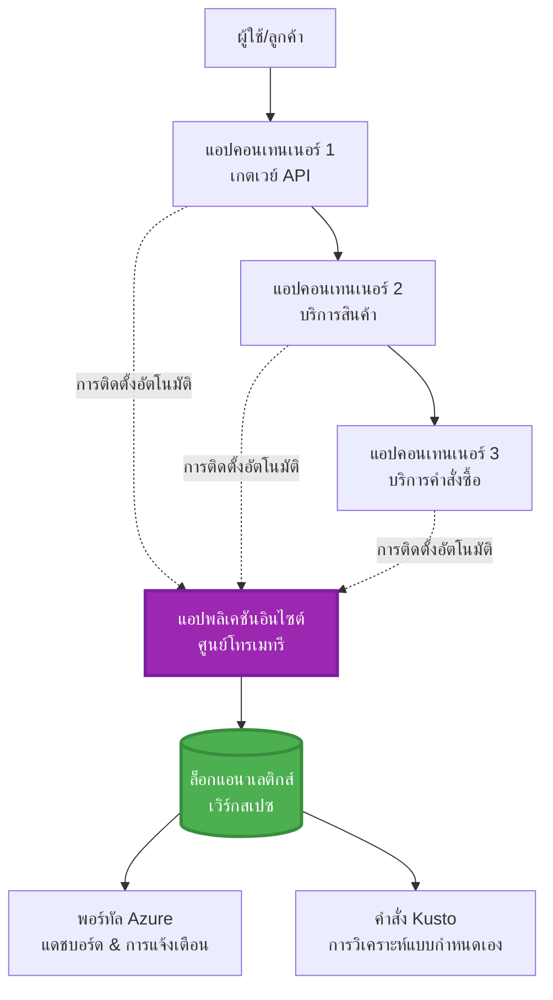
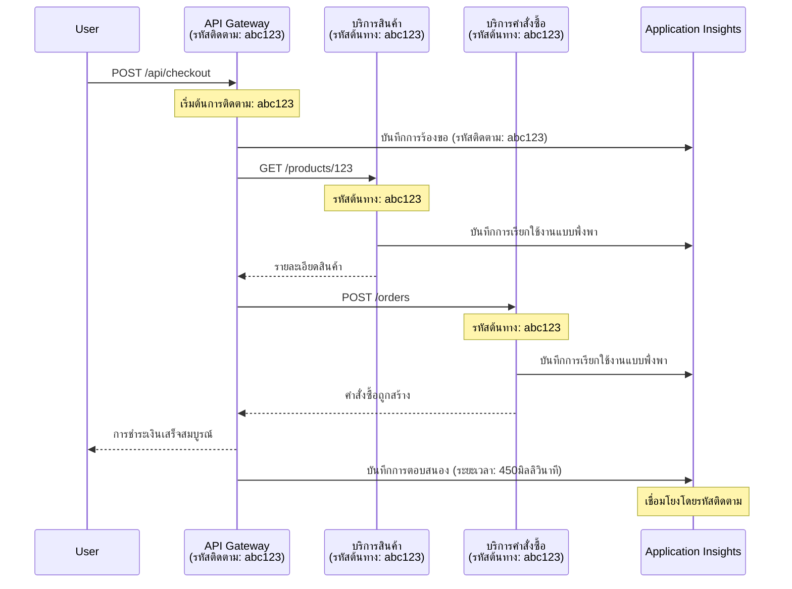

# การรวม Application Insights กับ AZD

⏱️ **เวลาที่คาดการณ์**: 40-50 นาที | 💰 **ผลกระทบค่าใช้จ่าย**: ~$5-15/เดือน | ⭐ **ความซับซ้อน**: ปานกลาง

**📚 เส้นทางการเรียนรู้:**
- ← ก่อนหน้า: [Preflight Checks](preflight-checks.md) - การตรวจสอบก่อนการปรับใช้
- 🎯 **คุณอยู่ที่นี่**: การรวม Application Insights (การตรวจสอบ, เทเลเมทรี, การดีบัก)
- → ถัดไป: [Deployment Guide](../chapter-04-infrastructure/deployment-guide.md) - ปรับใช้ไปยัง Azure
- 🏠 [หน้าหลักหลักสูตร](../../README.md)

---

## สิ่งที่คุณจะได้เรียนรู้

เมื่อทำบทเรียนนี้จบ คุณจะสามารถ:
- รวม **Application Insights** เข้าในโปรเจกต์ AZD โดยอัตโนมัติ
- กำหนดค่า **distributed tracing** สำหรับไมโครเซอร์วิส
- นำไปใช้ **custom telemetry** (เมตริก, เหตุการณ์, ความสัมพันธ์)
- ตั้งค่า **live metrics** สำหรับการตรวจสอบแบบเรียลไทม์
- สร้าง **การแจ้งเตือนและแดชบอร์ด** จากการปรับใช้ AZD
- ดีบักปัญหาในระบบจริงด้วย **telemetry queries**
- ปรับแต่ง **กลยุทธ์ค่าใช้จ่ายและการสุ่มตัวอย่าง**
- ตรวจสอบ **แอปพลิเคชัน AI/LLM** (โทเคน, ความหน่วง, ค่าใช้จ่าย)

## ทำไม Application Insights กับ AZD ถึงสำคัญ

### ความท้าทาย: การสังเกตในระบบที่ใช้งานจริง

**ถ้าไม่มี Application Insights:**
```
❌ No visibility into production behavior
❌ Manual log aggregation across services
❌ Reactive debugging (wait for customer complaints)
❌ No performance metrics
❌ Cannot trace requests across services
❌ Unknown failure rates and bottlenecks
```

**ถ้ามี Application Insights + AZD:**
```
✅ Automatic telemetry collection
✅ Centralized logs from all services
✅ Proactive issue detection
✅ End-to-end request tracing
✅ Performance metrics and insights
✅ Real-time dashboards
✅ AZD provisions everything automatically
```

**การเปรียบเทียบ**: Application Insights เหมือนกับการมีเครื่องบันทึกข้อมูล "กล่องดำ" และแดชบอร์ดในห้องนักบินสำหรับแอปของคุณ คุณจะเห็นทุกอย่างที่เกิดขึ้นแบบเรียลไทม์และสามารถย้อนดูเหตุการณ์ใด ๆ ได้

---

## ภาพรวมสถาปัตยกรรม

### Application Insights ในสถาปัตยกรรม AZD


### สิ่งที่ถูกตรวจสอบโดยอัตโนมัติ

| ประเภทเทเลเมทรี | สิ่งที่จับข้อมูลได้ | กรณีใช้งาน |
|----------------|------------------|----------|
| **คำขอ (Requests)** | คำขอ HTTP, รหัสสถานะ, ระยะเวลา | การตรวจสอบประสิทธิภาพ API |
| **ความสัมพันธ์ (Dependencies)** | การเรียกภายนอก (ฐานข้อมูล, API, storage) | ตรวจหาคอขวด |
| **ข้อยกเว้น (Exceptions)** | ข้อผิดพลาดที่ไม่ได้จับคู่พร้อมสแต็คเทรซ | ดีบักข้อผิดพลาด |
| **เหตุการณ์กำหนดเอง (Custom Events)** | เหตุการณ์ธุรกิจ (สมัครสมาชิก, การซื้อ) | การวิเคราะห์และช่องทาง |
| **เมตริก (Metrics)** | เคาน์เตอร์ประสิทธิภาพ, เมตริกกำหนดเอง | การวางแผนความจุ |
| **แทรซ (Traces)** | ข้อความล็อกพร้อมความรุนแรง | ดีบักและตรวจสอบ |
| **ความพร้อมใช้งาน (Availability)** | การทดสอบเวลาทำงานและเวลาตอบสนอง | การตรวจสอบ SLA |

---

## ข้อกำหนดเบื้องต้น

### เครื่องมือที่จำเป็น

```bash
# ตรวจสอบ Azure Developer CLI
azd version
# ✅ คาดว่า: azd เวอร์ชัน 1.0.0 หรือสูงกว่า

# ตรวจสอบ Azure CLI
az --version
# ✅ คาดว่า: azure-cli 2.50.0 หรือสูงกว่า
```

### ข้อกำหนดของ Azure

- ต้องมีการสมัครสมาชิก Azure ที่ใช้งานอยู่
- สิทธิ์ในการสร้าง:
  - ทรัพยากร Application Insights
  - Log Analytics workspaces
  - Container Apps
  - Resource groups

### ความรู้เบื้องต้น

คุณควรได้ทำ:
- [พื้นฐาน AZD](../chapter-01-foundation/azd-basics.md) - แนวคิดหลักของ AZD
- [การตั้งค่า](../chapter-03-configuration/configuration.md) - การตั้งค่าสภาพแวดล้อม
- [โปรเจกต์แรก](../chapter-01-foundation/first-project.md) - การปรับใช้เบื้องต้น

---

## บทเรียน 1: Application Insights อัตโนมัติกับ AZD

### วิธีที่ AZD จัดเตรียม Application Insights

AZD จะสร้างและกำหนดค่า Application Insights โดยอัตโนมัติเมื่อคุณปรับใช้ มาดูกันว่ามันทำงานอย่างไร

### โครงสร้างโปรเจกต์

```
monitored-app/
├── azure.yaml                     # AZD configuration
├── infra/
│   ├── main.bicep                # Main infrastructure
│   ├── core/
│   │   └── monitoring.bicep      # Application Insights + Log Analytics
│   └── app/
│       └── api.bicep             # Container App with monitoring
└── src/
    ├── app.py                    # Application with telemetry
    ├── requirements.txt
    └── Dockerfile
```

---

### ขั้นตอนที่ 1: กำหนดค่า AZD (azure.yaml)

**ไฟล์: `azure.yaml`**

```yaml
name: monitored-app
metadata:
  template: monitored-app@1.0.0

services:
  api:
    project: ./src
    language: python
    host: containerapp

# AZD automatically provisions monitoring!
```

**แค่นี้!** AZD จะสร้าง Application Insights โดยค่าเริ่มต้น ไม่ต้องตั้งค่าเพิ่มเติมสำหรับการตรวจสอบพื้นฐาน

---

### ขั้นตอนที่ 2: โครงสร้างพื้นฐานการตรวจสอบ (Bicep)

**ไฟล์: `infra/core/monitoring.bicep`**

```bicep
param logAnalyticsName string
param applicationInsightsName string
param location string = resourceGroup().location
param tags object = {}

// Log Analytics Workspace (required for Application Insights)
resource logAnalytics 'Microsoft.OperationalInsights/workspaces@2022-10-01' = {
  name: logAnalyticsName
  location: location
  tags: tags
  properties: {
    sku: {
      name: 'PerGB2018'  // Pay-as-you-go pricing
    }
    retentionInDays: 30  // Keep logs for 30 days
    features: {
      enableLogAccessUsingOnlyResourcePermissions: true
    }
  }
}

// Application Insights
resource applicationInsights 'Microsoft.Insights/components@2020-02-02' = {
  name: applicationInsightsName
  location: location
  tags: tags
  kind: 'web'
  properties: {
    Application_Type: 'web'
    WorkspaceResourceId: logAnalytics.id
    IngestionMode: 'LogAnalytics'
    publicNetworkAccessForIngestion: 'Enabled'
    publicNetworkAccessForQuery: 'Enabled'
  }
}

// Outputs for Container Apps
output logAnalyticsWorkspaceId string = logAnalytics.id
output logAnalyticsWorkspaceName string = logAnalytics.name
output applicationInsightsConnectionString string = applicationInsights.properties.ConnectionString
output applicationInsightsInstrumentationKey string = applicationInsights.properties.InstrumentationKey
output applicationInsightsName string = applicationInsights.name
```

---

### ขั้นตอนที่ 3: เชื่อม Container App กับ Application Insights

**ไฟล์: `infra/app/api.bicep`**

```bicep
param name string
param location string
param tags object = {}
param containerAppsEnvironmentName string
param applicationInsightsConnectionString string

resource containerApp 'Microsoft.App/containerApps@2023-05-01' = {
  name: name
  location: location
  tags: tags
  properties: {
    configuration: {
      ingress: {
        external: true
        targetPort: 8000
      }
      secrets: [
        {
          name: 'appinsights-connection-string'
          value: applicationInsightsConnectionString
        }
      ]
    }
    template: {
      containers: [
        {
          name: 'api'
          image: 'myregistry.azurecr.io/api:latest'
          resources: {
            cpu: json('0.5')
            memory: '1Gi'
          }
          env: [
            {
              name: 'APPLICATIONINSIGHTS_CONNECTION_STRING'
              secretRef: 'appinsights-connection-string'
            }
            {
              name: 'APPLICATIONINSIGHTS_ENABLED'
              value: 'true'
            }
          ]
        }
      ]
    }
  }
}

output uri string = 'https://${containerApp.properties.configuration.ingress.fqdn}'
```

---

### ขั้นตอนที่ 4: โค้ดแอปพลิเคชันพร้อมเทเลเมทรี

**ไฟล์: `src/app.py`**

```python
from flask import Flask, request, jsonify
from opencensus.ext.azure.log_exporter import AzureLogHandler
from opencensus.ext.azure.trace_exporter import AzureExporter
from opencensus.ext.flask.flask_middleware import FlaskMiddleware
from opencensus.trace.samplers import ProbabilitySampler
import logging
import os

app = Flask(__name__)

# รับสตริงการเชื่อมต่อ Application Insights
connection_string = os.environ.get('APPLICATIONINSIGHTS_CONNECTION_STRING')

if connection_string:
    # กำหนดค่าการติดตามแบบกระจาย
    middleware = FlaskMiddleware(
        app,
        exporter=AzureExporter(connection_string=connection_string),
        sampler=ProbabilitySampler(rate=1.0)  # การสุ่มตัวอย่าง 100% สำหรับการพัฒนา
    )
    
    # กำหนดค่าการบันทึกล็อก
    logger = logging.getLogger(__name__)
    logger.addHandler(AzureLogHandler(connection_string=connection_string))
    logger.setLevel(logging.INFO)
    
    print("✅ Application Insights enabled")
else:
    logger = logging.getLogger(__name__)
    logger.setLevel(logging.INFO)
    print("⚠️ Application Insights not configured")

@app.route('/health')
def health():
    logger.info('Health check endpoint called')
    return jsonify({'status': 'healthy', 'monitoring': 'enabled'})

@app.route('/api/products')
def get_products():
    logger.info('Fetching products')
    
    # จำลองการเรียกฐานข้อมูล (ติดตามเป็นการพึ่งพาโดยอัตโนมัติ)
    products = [
        {'id': 1, 'name': 'Laptop', 'price': 999.99},
        {'id': 2, 'name': 'Mouse', 'price': 29.99},
        {'id': 3, 'name': 'Keyboard', 'price': 79.99}
    ]
    
    logger.info(f'Returned {len(products)} products')
    return jsonify(products)

@app.route('/api/error-test')
def error_test():
    """Test error tracking"""
    logger.error('Testing error tracking')
    try:
        raise ValueError('This is a test exception')
    except Exception as e:
        logger.exception('Exception occurred in error-test endpoint')
        return jsonify({'error': str(e)}), 500

@app.route('/api/slow')
def slow_endpoint():
    """Test performance tracking"""
    import time
    logger.info('Slow endpoint called')
    time.sleep(3)  # จำลองการดำเนินการช้า
    logger.warning('Endpoint took 3 seconds to respond')
    return jsonify({'message': 'Slow operation completed'})

if __name__ == '__main__':
    app.run(host='0.0.0.0', port=8000)
```

**ไฟล์: `src/requirements.txt`**

```txt
Flask==3.0.0
opencensus-ext-azure==1.1.13
opencensus-ext-flask==0.8.1
gunicorn==21.2.0
```

---

### ขั้นตอนที่ 5: ปรับใช้และตรวจสอบ

```bash
# เริ่มต้น AZD
azd init

# ติดตั้ง (จัดเตรียม Application Insights โดยอัตโนมัติ)
azd up

# รับ URL ของแอป
APP_URL=$(azd env get-values | grep API_URL | cut -d '=' -f2 | tr -d '"')

# สร้างข้อมูลโทรมาตร
curl $APP_URL/health
curl $APP_URL/api/products
curl $APP_URL/api/error-test
curl $APP_URL/api/slow
```

**✅ ผลลัพธ์ที่คาดหวัง:**
```json
{
  "status": "healthy",
  "monitoring": "enabled"
}
```

---

### ขั้นตอนที่ 6: ดูเทเลเมทรีใน Azure Portal

```bash
# ดึงรายละเอียด Application Insights
azd env get-values | grep APPLICATIONINSIGHTS

# เปิดใน Azure Portal
az monitor app-insights component show \
  --app $(azd env get-values | grep APPLICATIONINSIGHTS_NAME | cut -d '=' -f2 | tr -d '"') \
  --resource-group $(azd env get-values | grep AZURE_RESOURCE_GROUP | cut -d '=' -f2 | tr -d '"') \
  --query "appId" -o tsv
```

**ไปที่ Azure Portal → Application Insights → Transaction Search**

คุณควรเห็น:
- ✅ คำขอ HTTP พร้อมรหัสสถานะ
- ✅ ระยะเวลาคำขอ (เกิน 3 วินาทีสำหรับ `/api/slow`)
- ✅ รายละเอียดข้อยกเว้นจาก `/api/error-test`
- ✅ ข้อความล็อกกำหนดเอง

---

## บทเรียน 2: เทเลเมทรีและเหตุการณ์กำหนดเอง

### ติดตามเหตุการณ์ธุรกิจ

มาสร้างเทเลเมทรีกำหนดเองสำหรับเหตุการณ์สำคัญทางธุรกิจกัน

**ไฟล์: `src/telemetry.py`**

```python
from opencensus.ext.azure import metrics_exporter
from opencensus.stats import aggregation as aggregation_module
from opencensus.stats import measure as measure_module
from opencensus.stats import stats as stats_module
from opencensus.stats import view as view_module
from opencensus.tags import tag_map as tag_map_module
from opencensus.ext.azure.log_exporter import AzureLogHandler
from opencensus.ext.azure.trace_exporter import AzureExporter
from opencensus.trace import tracer as tracer_module
import logging
import os

class TelemetryClient:
    """Custom telemetry client for Application Insights"""
    
    def __init__(self, connection_string=None):
        self.connection_string = connection_string or os.environ.get('APPLICATIONINSIGHTS_CONNECTION_STRING')
        
        if not self.connection_string:
            print("⚠️ Application Insights connection string not found")
            return
        
        # ตั้งค่าตัวบันทึกเหตุการณ์
        self.logger = logging.getLogger(__name__)
        self.logger.addHandler(AzureLogHandler(connection_string=self.connection_string))
        self.logger.setLevel(logging.INFO)
        
        # ตั้งค่าตัวส่งออกเมตริก
        self.stats = stats_module.stats
        self.view_manager = self.stats.view_manager
        self.stats_recorder = self.stats.stats_recorder
        
        exporter = metrics_exporter.new_metrics_exporter(
            connection_string=self.connection_string
        )
        self.view_manager.register_exporter(exporter)
        
        # ตั้งค่าตัวติดตาม
        self.tracer = tracer_module.Tracer(
            exporter=AzureExporter(connection_string=self.connection_string)
        )
        
        print("✅ Custom telemetry client initialized")
    
    def track_event(self, event_name: str, properties: dict = None):
        """Track custom business event"""
        properties = properties or {}
        self.logger.info(
            f"CustomEvent: {event_name}",
            extra={
                'custom_dimensions': {
                    'event_name': event_name,
                    **properties
                }
            }
        )
    
    def track_metric(self, metric_name: str, value: float, properties: dict = None):
        """Track custom metric"""
        properties = properties or {}
        self.logger.info(
            f"CustomMetric: {metric_name} = {value}",
            extra={
                'custom_dimensions': {
                    'metric_name': metric_name,
                    'value': value,
                    **properties
                }
            }
        )
    
    def track_dependency(self, name: str, dependency_type: str, duration: float, success: bool):
        """Track external dependency call"""
        with self.tracer.span(name=name) as span:
            span.add_attribute('dependency.type', dependency_type)
            span.add_attribute('duration', duration)
            span.add_attribute('success', success)

# ไคลเอนต์การวัดทางไกลระดับโลก
telemetry = TelemetryClient()
```

### อัปเดตแอปด้วยเหตุการณ์กำหนดเอง

**ไฟล์: `src/app.py` (ปรับปรุง)**

```python
from flask import Flask, request, jsonify
from telemetry import telemetry
import time
import random

app = Flask(__name__)

@app.route('/api/purchase', methods=['POST'])
def purchase():
    """Track purchase event with custom telemetry"""
    data = request.json
    product_id = data.get('product_id')
    quantity = data.get('quantity', 1)
    price = data.get('price', 0)
    
    # ติดตามเหตุการณ์ทางธุรกิจ
    telemetry.track_event('Purchase', {
        'product_id': product_id,
        'quantity': quantity,
        'total_amount': price * quantity,
        'user_id': request.headers.get('X-User-Id', 'anonymous')
    })
    
    # ติดตามตัวชี้วัดรายได้
    telemetry.track_metric('Revenue', price * quantity, {
        'product_id': product_id,
        'currency': 'USD'
    })
    
    return jsonify({
        'order_id': f'ORD-{random.randint(1000, 9999)}',
        'status': 'confirmed',
        'total': price * quantity
    })

@app.route('/api/search')
def search():
    """Track search queries"""
    query = request.args.get('q', '')
    
    start_time = time.time()
    
    # จำลองการค้นหา (จะเป็นการสอบถามฐานข้อมูลจริง)
    results = [{'id': 1, 'name': f'Result for {query}'}]
    
    duration = (time.time() - start_time) * 1000  # แปลงเป็นมิลลิวินาที
    
    # ติดตามเหตุการณ์การค้นหา
    telemetry.track_event('Search', {
        'query': query,
        'results_count': len(results),
        'duration_ms': duration
    })
    
    # ติดตามตัวชี้วัดประสิทธิภาพการค้นหา
    telemetry.track_metric('SearchDuration', duration, {
        'query_length': len(query)
    })
    
    return jsonify({'results': results, 'count': len(results)})

@app.route('/api/external-call')
def external_call():
    """Track external API dependency"""
    import requests
    
    start_time = time.time()
    success = True
    
    try:
        # จำลองการเรียกใช้ API ภายนอก
        response = requests.get('https://api.example.com/data', timeout=5)
        result = response.json()
    except Exception as e:
        success = False
        result = {'error': str(e)}
    
    duration = (time.time() - start_time) * 1000
    
    # ติดตามการพึ่งพา
    telemetry.track_dependency(
        name='ExternalAPI',
        dependency_type='HTTP',
        duration=duration,
        success=success
    )
    
    return jsonify(result)

if __name__ == '__main__':
    app.run(host='0.0.0.0', port=8000)
```

### ทดสอบเทเลเมทรีกำหนดเอง

```bash
# ติดตามเหตุการณ์การซื้อ
curl -X POST $APP_URL/api/purchase \
  -H "Content-Type: application/json" \
  -H "X-User-Id: user123" \
  -d '{"product_id": 1, "quantity": 2, "price": 29.99}'

# ติดตามเหตุการณ์การค้นหา
curl "$APP_URL/api/search?q=laptop"

# ติดตามการพึ่งพาภายนอก
curl $APP_URL/api/external-call
```

**ดูใน Azure Portal:**

ไปที่ Application Insights → Logs แล้วรัน:

```kusto
// View purchase events
traces
| where customDimensions.event_name == "Purchase"
| project 
    timestamp,
    product_id = tostring(customDimensions.product_id),
    total_amount = todouble(customDimensions.total_amount),
    user_id = tostring(customDimensions.user_id)
| order by timestamp desc

// View revenue metrics
traces
| where customDimensions.metric_name == "Revenue"
| summarize TotalRevenue = sum(todouble(customDimensions.value)) by bin(timestamp, 1h)
| render timechart

// View search performance
traces
| where customDimensions.event_name == "Search"
| summarize 
    AvgDuration = avg(todouble(customDimensions.duration_ms)),
    SearchCount = count()
  by bin(timestamp, 5m)
| render timechart
```

---

## บทเรียน 3: Distributed Tracing สำหรับไมโครเซอร์วิส

### เปิดใช้งานการแทรซข้ามบริการ

สำหรับไมโครเซอร์วิส Application Insights จะเชื่อมโยงคำขอระหว่างบริการโดยอัตโนมัติ

**ไฟล์: `infra/main.bicep`**

```bicep
targetScope = 'subscription'

param environmentName string
param location string = 'eastus'

var tags = { 'azd-env-name': environmentName }

resource rg 'Microsoft.Resources/resourceGroups@2021-04-01' = {
  name: 'rg-${environmentName}'
  location: location
  tags: tags
}

// Monitoring (shared by all services)
module monitoring './core/monitoring.bicep' = {
  name: 'monitoring'
  scope: rg
  params: {
    logAnalyticsName: 'log-${environmentName}'
    applicationInsightsName: 'appi-${environmentName}'
    location: location
    tags: tags
  }
}

// API Gateway
module apiGateway './app/api-gateway.bicep' = {
  name: 'api-gateway'
  scope: rg
  params: {
    name: 'ca-gateway-${environmentName}'
    location: location
    tags: union(tags, { 'azd-service-name': 'gateway' })
    applicationInsightsConnectionString: monitoring.outputs.applicationInsightsConnectionString
  }
}

// Product Service
module productService './app/product-service.bicep' = {
  name: 'product-service'
  scope: rg
  params: {
    name: 'ca-products-${environmentName}'
    location: location
    tags: union(tags, { 'azd-service-name': 'products' })
    applicationInsightsConnectionString: monitoring.outputs.applicationInsightsConnectionString
  }
}

// Order Service
module orderService './app/order-service.bicep' = {
  name: 'order-service'
  scope: rg
  params: {
    name: 'ca-orders-${environmentName}'
    location: location
    tags: union(tags, { 'azd-service-name': 'orders' })
    applicationInsightsConnectionString: monitoring.outputs.applicationInsightsConnectionString
  }
}

output APPLICATIONINSIGHTS_CONNECTION_STRING string = monitoring.outputs.applicationInsightsConnectionString
output GATEWAY_URL string = apiGateway.outputs.uri
```

### ดูธุรกรรมตั้งแต่ต้นจนจบ


**สอบถามการแทรซตั้งแต่ต้นจนจบ:**

```kusto
// Find complete request flow
let traceId = "abc123...";  // Get from response header
dependencies
| union requests
| where operation_Id == traceId
| project 
    timestamp,
    type = itemType,
    name,
    duration,
    success,
    cloud_RoleName
| order by timestamp asc
```

---

## บทเรียน 4: Live Metrics และการตรวจสอบแบบเรียลไทม์

### เปิดใช้งาน Live Metrics Stream

Live Metrics ให้ข้อมูลเทเลเมทรีแบบเรียลไทม์โดยมีความหน่วงน้อยกว่า 1 วินาที

**เข้าถึง Live Metrics:**

```bash
# รับข้อมูลทรัพยากร Application Insights
APPI_NAME=$(azd env get-values | grep APPLICATIONINSIGHTS_NAME | cut -d '=' -f2 | tr -d '"')

# รับกลุ่มทรัพยากร
RG_NAME=$(azd env get-values | grep AZURE_RESOURCE_GROUP | cut -d '=' -f2 | tr -d '"')

echo "Navigate to: Azure Portal → Resource Groups → $RG_NAME → $APPI_NAME → Live Metrics"
```

**สิ่งที่คุณเห็นแบบเรียลไทม์:**
- ✅ อัตราคำขอที่เข้า (คำขอต่อวินาที)
- ✅ การเรียกความสัมพันธ์ออกไป
- ✅ จำนวนข้อยกเว้น
- ✅ การใช้งาน CPU และหน่วยความจำ
- ✅ จำนวนเซิร์ฟเวอร์ที่ใช้งานอยู่
- ✅ ตัวอย่างเทเลเมทรี

### สร้างโหลดเพื่อทดสอบ

```bash
# สร้างโหลดเพื่อดูเมตริกแบบเรียลไทม์
for i in {1..100}; do
  curl $APP_URL/api/products &
  curl $APP_URL/api/search?q=test$i &
done

# ดูเมตริกแบบเรียลไทม์ใน Azure Portal
# คุณควรเห็นอัตราการร้องขอเพิ่มขึ้นอย่างรวดเร็ว
```

---

## แบบฝึกหัดปฏิบัติ

### แบบฝึกหัด 1: ตั้งค่าการแจ้งเตือน ⭐⭐ (ระดับกลาง)

**เป้าหมาย**: สร้างการแจ้งเตือนสำหรับอัตราข้อผิดพลาดสูงและการตอบสนองช้า

**ขั้นตอน:**

1. **สร้างการแจ้งเตือนสำหรับอัตราข้อผิดพลาด:**

```bash
# รับ ID ของทรัพยากร Application Insights
APPI_ID=$(az monitor app-insights component show \
  --app $APPI_NAME \
  --resource-group $RG_NAME \
  --query "id" -o tsv)

# สร้างการแจ้งเตือนเมตริกสำหรับคำขอล้มเหลว
az monitor metrics alert create \
  --name "High-Error-Rate" \
  --resource-group $RG_NAME \
  --scopes $APPI_ID \
  --condition "count requests/failed > 10" \
  --window-size 5m \
  --evaluation-frequency 1m \
  --description "Alert when error rate exceeds 10 per 5 minutes"
```

2. **สร้างการแจ้งเตือนสำหรับการตอบสนองช้า:**

```bash
az monitor metrics alert create \
  --name "Slow-Responses" \
  --resource-group $RG_NAME \
  --scopes $APPI_ID \
  --condition "avg requests/duration > 3000" \
  --window-size 5m \
  --evaluation-frequency 1m \
  --description "Alert when average response time exceeds 3 seconds"
```

3. **สร้างการแจ้งเตือนผ่าน Bicep (แนะนำสำหรับ AZD):**

**ไฟล์: `infra/core/alerts.bicep`**

```bicep
param applicationInsightsId string
param actionGroupId string = ''
param location string = resourceGroup().location

// High error rate alert
resource errorRateAlert 'Microsoft.Insights/metricAlerts@2018-03-01' = {
  name: 'high-error-rate'
  location: 'global'
  properties: {
    description: 'Alert when error rate exceeds threshold'
    severity: 2
    enabled: true
    scopes: [
      applicationInsightsId
    ]
    evaluationFrequency: 'PT1M'
    windowSize: 'PT5M'
    criteria: {
      'odata.type': 'Microsoft.Azure.Monitor.SingleResourceMultipleMetricCriteria'
      allOf: [
        {
          name: 'Error rate'
          metricName: 'requests/failed'
          operator: 'GreaterThan'
          threshold: 10
          timeAggregation: 'Count'
        }
      ]
    }
    actions: actionGroupId != '' ? [
      {
        actionGroupId: actionGroupId
      }
    ] : []
  }
}

// Slow response alert
resource slowResponseAlert 'Microsoft.Insights/metricAlerts@2018-03-01' = {
  name: 'slow-responses'
  location: 'global'
  properties: {
    description: 'Alert when response time is too high'
    severity: 3
    enabled: true
    scopes: [
      applicationInsightsId
    ]
    evaluationFrequency: 'PT1M'
    windowSize: 'PT5M'
    criteria: {
      'odata.type': 'Microsoft.Azure.Monitor.SingleResourceMultipleMetricCriteria'
      allOf: [
        {
          name: 'Response duration'
          metricName: 'requests/duration'
          operator: 'GreaterThan'
          threshold: 3000
          timeAggregation: 'Average'
        }
      ]
    }
  }
}

output errorAlertId string = errorRateAlert.id
output slowResponseAlertId string = slowResponseAlert.id
```

4. **ทดสอบการแจ้งเตือน:**

```bash
# สร้างข้อผิดพลาด
for i in {1..20}; do
  curl $APP_URL/api/error-test
done

# สร้างการตอบสนองช้า
for i in {1..10}; do
  curl $APP_URL/api/slow
done

# ตรวจสอบสถานะการแจ้งเตือน (รอ 5-10 นาที)
az monitor metrics alert list \
  --resource-group $RG_NAME \
  --query "[].{Name:name, Enabled:enabled, State:properties.enabled}" \
  --output table
```

**✅ เกณฑ์ความสำเร็จ:**
- ✅ สร้างการแจ้งเตือนได้สำเร็จ
- ✅ การแจ้งเตือนทำงานเมื่อเกินเกณฑ์
- ✅ ดูประวัติการแจ้งเตือนได้ใน Azure Portal
- ✅ ผสานกับการปรับใช้ AZD

**เวลา**: 20-25 นาที

---

### แบบฝึกหัด 2: สร้างแดชบอร์ดกำหนดเอง ⭐⭐ (ระดับกลาง)

**เป้าหมาย**: สร้างแดชบอร์ดแสดงเมตริกสำคัญของแอปพลิเคชัน

**ขั้นตอน:**

1. **สร้างแดชบอร์ดผ่าน Azure Portal:**

ไปที่: Azure Portal → Dashboards → New Dashboard

2. **เพิ่มแผ่นแสดงข้อมูลสำหรับเมตริกหลัก:**

- จำนวนคำขอ (24 ชั่วโมงล่าสุด)
- เวลาเฉลี่ยในการตอบสนอง
- อัตราข้อผิดพลาด
- 5 งานที่ช้าที่สุด
- การกระจายภูมิศาสตร์ของผู้ใช้

3. **สร้างแดชบอร์ดผ่าน Bicep:**

**ไฟล์: `infra/core/dashboard.bicep`**

```bicep
param dashboardName string
param applicationInsightsId string
param location string = resourceGroup().location

resource dashboard 'Microsoft.Portal/dashboards@2020-09-01-preview' = {
  name: dashboardName
  location: location
  properties: {
    lenses: [
      {
        order: 0
        parts: [
          // Request count
          {
            position: { x: 0, y: 0, rowSpan: 4, colSpan: 6 }
            metadata: {
              type: 'Extension/Microsoft_OperationsManagementSuite_Workspace/PartType/LogsDashboardPart'
              inputs: [
                {
                  name: 'resourceId'
                  value: applicationInsightsId
                }
                {
                  name: 'query'
                  value: '''
                    requests
                    | summarize RequestCount = count() by bin(timestamp, 1h)
                    | render timechart
                  '''
                }
              ]
            }
          }
          // Error rate
          {
            position: { x: 6, y: 0, rowSpan: 4, colSpan: 6 }
            metadata: {
              type: 'Extension/Microsoft_OperationsManagementSuite_Workspace/PartType/LogsDashboardPart'
              inputs: [
                {
                  name: 'resourceId'
                  value: applicationInsightsId
                }
                {
                  name: 'query'
                  value: '''
                    requests
                    | summarize 
                        Total = count(),
                        Failed = countif(success == false)
                    | extend ErrorRate = (Failed * 100.0) / Total
                    | project ErrorRate
                  '''
                }
              ]
            }
          }
        ]
      }
    ]
  }
}

output dashboardId string = dashboard.id
```

4. **ปรับใช้แดชบอร์ด:**

```bash
# เพิ่มไปที่ main.bicep
module dashboard './core/dashboard.bicep' = {
  name: 'dashboard'
  scope: rg
  params: {
    dashboardName: 'dashboard-${environmentName}'
    applicationInsightsId: monitoring.outputs.applicationInsightsId
    location: location
  }
}

# ติดตั้งใช้งาน
azd up
```

**✅ เกณฑ์ความสำเร็จ:**
- ✅ แดชบอร์ดแสดงเมตริกหลักครบถ้วน
- ✅ ปักหมุดบนหน้าแรกของ Azure Portal ได้
- ✅ อัปเดตแบบเรียลไทม์
- ✅ ปรับใช้ผ่าน AZD ได้

**เวลา**: 25-30 นาที

---

### แบบฝึกหัด 3: ตรวจสอบแอป AI/LLM ⭐⭐⭐ (ขั้นสูง)

**เป้าหมาย**: ติดตามการใช้งาน Microsoft Foundry Models (โทเคน, ค่าใช้จ่าย, ความหน่วง)

**ขั้นตอน:**

1. **สร้าง wrapper ตรวจสอบ AI:**

**ไฟล์: `src/ai_telemetry.py`**

```python
from telemetry import telemetry
from openai import AzureOpenAI
import time

class MonitoredAzureOpenAI:
    """Microsoft Foundry Models client with automatic telemetry"""
    
    def __init__(self, api_key, endpoint, api_version="2024-02-01"):
        self.client = AzureOpenAI(
            api_key=api_key,
            api_version=api_version,
            azure_endpoint=endpoint
        )
    
    def chat_completion(self, model: str, messages: list, **kwargs):
        """Track chat completion with telemetry"""
        start_time = time.time()
        
        try:
            # เรียกใช้ Microsoft Foundry Models
            response = self.client.chat.completions.create(
                model=model,
                messages=messages,
                **kwargs
            )
            
            duration = (time.time() - start_time) * 1000  # ms
            
            # สกัดการใช้งาน
            usage = response.usage
            prompt_tokens = usage.prompt_tokens
            completion_tokens = usage.completion_tokens
            total_tokens = usage.total_tokens
            
            # คำนวณค่าใช้จ่าย (ราคาของ gpt-4.1)
            prompt_cost = (prompt_tokens / 1000) * 0.03  # $0.03 ต่อ 1K โทเคน
            completion_cost = (completion_tokens / 1000) * 0.06  # $0.06 ต่อ 1K โทเคน
            total_cost = prompt_cost + completion_cost
            
            # ติดตามเหตุการณ์ที่กำหนดเอง
            telemetry.track_event('OpenAI_Request', {
                'model': model,
                'prompt_tokens': prompt_tokens,
                'completion_tokens': completion_tokens,
                'total_tokens': total_tokens,
                'duration_ms': duration,
                'cost_usd': total_cost,
                'success': True
            })
            
            # ติดตามเมตริกส์
            telemetry.track_metric('OpenAI_Tokens', total_tokens, {
                'model': model,
                'type': 'total'
            })
            
            telemetry.track_metric('OpenAI_Cost', total_cost, {
                'model': model,
                'currency': 'USD'
            })
            
            telemetry.track_metric('OpenAI_Duration', duration, {
                'model': model
            })
            
            return response
            
        except Exception as e:
            duration = (time.time() - start_time) * 1000
            
            telemetry.track_event('OpenAI_Request', {
                'model': model,
                'duration_ms': duration,
                'success': False,
                'error': str(e)
            })
            
            raise
```

2. **ใช้ไคลเอนต์ที่ถูกตรวจสอบ:**

```python
from flask import Flask, request, jsonify
from ai_telemetry import MonitoredAzureOpenAI
import os

app = Flask(__name__)

# เริ่มต้นไคลเอนต์ OpenAI ที่ได้รับการตรวจสอบ
openai_client = MonitoredAzureOpenAI(
    api_key=os.environ['AZURE_OPENAI_API_KEY'],
    endpoint=os.environ['AZURE_OPENAI_ENDPOINT']
)

@app.route('/api/chat', methods=['POST'])
def chat():
    data = request.json
    user_message = data.get('message')
    
    # เรียกด้วยการตรวจสอบอัตโนมัติ
    response = openai_client.chat_completion(
        model='gpt-4.1',
        messages=[
            {'role': 'user', 'content': user_message}
        ]
    )
    
    return jsonify({
        'response': response.choices[0].message.content,
        'tokens': response.usage.total_tokens
    })
```

3. **สอบถามเมตริก AI:**

```kusto
// Total AI spend over time
traces
| where customDimensions.event_name == "OpenAI_Request"
| where customDimensions.success == "True"
| summarize TotalCost = sum(todouble(customDimensions.cost_usd)) by bin(timestamp, 1h)
| render timechart

// Token usage by model
traces
| where customDimensions.event_name == "OpenAI_Request"
| summarize 
    TotalTokens = sum(toint(customDimensions.total_tokens)),
    RequestCount = count()
  by Model = tostring(customDimensions.model)

// Average latency
traces
| where customDimensions.event_name == "OpenAI_Request"
| summarize AvgDuration = avg(todouble(customDimensions.duration_ms))
| project AvgDurationSeconds = AvgDuration / 1000

// Cost per request
traces
| where customDimensions.event_name == "OpenAI_Request"
| extend Cost = todouble(customDimensions.cost_usd)
| summarize 
    TotalCost = sum(Cost),
    RequestCount = count(),
    AvgCostPerRequest = avg(Cost)
```

**✅ เกณฑ์ความสำเร็จ:**
- ✅ ติดตามการเรียก OpenAI ทุกครั้งโดยอัตโนมัติ
- ✅ แสดงการใช้งานโทเคนและค่าใช้จ่ายได้
- ✅ ตรวจสอบความหน่วงได้
- ✅ ตั้งการแจ้งเตือนงบประมาณได้

**เวลา**: 35-45 นาที

---

## การปรับค่าใช้จ่ายให้เหมาะสม

### กลยุทธ์การสุ่มตัวอย่าง

ควบคุมค่าใช้จ่ายด้วยการสุ่มตัวอย่างเทเลเมทรี:

```python
from opencensus.trace.samplers import ProbabilitySampler

# การพัฒนา: การสุ่ม 100%
sampler = ProbabilitySampler(rate=1.0)

# การผลิต: การสุ่ม 10% (ลดต้นทุนลง 90%)
sampler = ProbabilitySampler(rate=0.1)

# การสุ่มแบบปรับตัว (ปรับเองโดยอัตโนมัติ)
from opencensus.trace.samplers import AdaptiveSampler
sampler = AdaptiveSampler()
```

**ใน Bicep:**

```bicep
resource applicationInsights 'Microsoft.Insights/components@2020-02-02' = {
  name: applicationInsightsName
  properties: {
    SamplingPercentage: 10  // 10% sampling
  }
}
```

### การเก็บรักษาข้อมูล

```bicep
resource logAnalytics 'Microsoft.OperationalInsights/workspaces@2022-10-01' = {
  name: logAnalyticsName
  properties: {
    retentionInDays: 30  // Minimum (cheapest)
    // Options: 30, 31, 60, 90, 120, 180, 270, 365, 550, 730
  }
}
```

### การประมาณค่าใช้จ่ายรายเดือน

| ปริมาณข้อมูล | ระยะเวลาการเก็บรักษา | ค่าใช้จ่ายรายเดือน |
|-------------|-----------|--------------|
| 1 GB/เดือน | 30 วัน | ~$2-5 |
| 5 GB/เดือน | 30 วัน | ~$10-15 |
| 10 GB/เดือน | 90 วัน | ~$25-40 |
| 50 GB/เดือน | 90 วัน | ~$100-150 |

**ฟรี**: รวม 5 GB/เดือน

---

## การตรวจสอบความรู้

### 1. การรวมพื้นฐาน ✓

ทดสอบความเข้าใจ:

- [ ] **ข้อถาม 1**: AZD จัดเตรียม Application Insights อย่างไร?
  - **คำตอบ**: อัตโนมัติผ่านเทมเพลต Bicep ใน `infra/core/monitoring.bicep`

- [ ] **ข้อถาม 2**: ตัวแปรสภาพแวดล้อมใดเปิดใช้งาน Application Insights?
  - **คำตอบ**: `APPLICATIONINSIGHTS_CONNECTION_STRING`

- [ ] **ข้อถาม 3**: เทเลเมทรีหลักสามประเภทคืออะไร?
  - **คำตอบ**: คำขอ (HTTP calls), ความสัมพันธ์ (การเรียกภายนอก), ข้อยกเว้น (ข้อผิดพลาด)

**ถ่ายทอดความรู้:**
```bash
# ตรวจสอบว่าได้กำหนดค่า Application Insights หรือไม่
azd env get-values | grep APPLICATIONINSIGHTS

# ตรวจสอบการไหลของข้อมูลเทเลเมทรี
az monitor app-insights metrics show \
  --app $APPI_NAME \
  --resource-group $RG_NAME \
  --metric "requests/count"
```

---

### 2. เทเลเมทรีกำหนดเอง ✓

ทดสอบความเข้าใจ:

- [ ] **ข้อถาม 1**: คุณติดตามเหตุการณ์ธุรกิจกำหนดเองอย่างไร?
  - **คำตอบ**: ใช้ logger พร้อม `custom_dimensions` หรือ `TelemetryClient.track_event()`

- [ ] **ข้อถาม 2**: ความแตกต่างระหว่างเหตุการณ์กับเมตริกคืออะไร?
  - **คำตอบ**: เหตุการณ์เป็นการเกิดขึ้นแยกกัน, เมตริกเป็นการวัดเชิงตัวเลข

- [ ] **ข้อถาม 3**: คุณเชื่อมโยงเทเลเมทรีข้ามบริการอย่างไร?
  - **คำตอบ**: Application Insights ใช้ `operation_Id` อัตโนมัติสำหรับการเชื่อมโยง

**ถ่ายทอดความรู้:**
```kusto
// Verify custom events
traces
| where customDimensions.event_name != ""
| summarize count() by tostring(customDimensions.event_name)
```

---

### 3. การตรวจสอบระบบจริง ✓

ทดสอบความเข้าใจ:

- [ ] **ข้อถาม 1**: การสุ่มตัวอย่างคืออะไรและทำไมต้องใช้?
  - **คำตอบ**: การสุ่มตัวอย่างลดปริมาณข้อมูล (และค่าใช้จ่าย) โดยจับเฉพาะบางเปอร์เซ็นต์ของเทเลเมทรี

- [ ] **ข้อถาม 2**: คุณตั้งค่าการแจ้งเตือนได้อย่างไร?
  - **คำตอบ**: ใช้ metric alerts ใน Bicep หรือ Azure Portal ตามเมตริกของ Application Insights

- [ ] **ข้อถาม 3**: ความแตกต่างระหว่าง Log Analytics กับ Application Insights คืออะไร?
  - **คำตอบ**: Application Insights จัดเก็บข้อมูลใน Log Analytics workspace; App Insights ให้มุมมองเฉพาะสำหรับแอปพลิเคชัน

**ถ่ายทอดความรู้:**
```bash
# ตรวจสอบการตั้งค่าการสุ่มตัวอย่าง
az monitor app-insights component show \
  --app $APPI_NAME \
  --resource-group $RG_NAME \
  --query "properties.SamplingPercentage"
```

---

## แนวทางปฏิบัติที่ดีที่สุด

### ✅ ควรทำ:

1. **ใช้ correlation IDs**
   ```python
   logger.info('Processing order', extra={
       'custom_dimensions': {
           'order_id': order_id,
           'user_id': user_id
       }
   })
   ```

2. **ตั้งค่าการแจ้งเตือนสำหรับเมตริกสำคัญ**
   ```bicep
   // Error rate, slow responses, availability
   ```

3. **ใช้ structured logging**
   ```python
   # ✅ ดี: มีโครงสร้าง
   logger.info('User signup', extra={'custom_dimensions': {'user_id': 123}})
   
   # ❌ ไม่ดี: ไม่มีโครงสร้าง
   logger.info(f'User 123 signed up')
   ```

4. **ตรวจสอบ dependencies**
   ```python
   # ติดตามการเรียกฐานข้อมูล การร้องขอ HTTP อัตโนมัติ ฯลฯ
   ```

5. **ใช้ Live Metrics ระหว่างการปรับใช้**

### ❌ หลีกเลี่ยง:

1. **อย่าล็อกข้อมูลที่ละเอียดอ่อน**
   ```python
   # ❌ แย่
   logger.info(f'Login: {username}:{password}')
   
   # ✅ ดี
   logger.info('Login attempt', extra={'custom_dimensions': {'username': username}})
   ```

2. **อย่าใช้การสุ่มตัวอย่าง 100% ในระบบจริง**
   ```python
   # ❌ แพง
   sampler = ProbabilitySampler(rate=1.0)
   
   # ✅ คุ้มค่าเงินลงทุน
   sampler = ProbabilitySampler(rate=0.1)
   ```

3. **อย่ามองข้าม dead letter queues**

4. **อย่าลืมตั้งค่าเวลาการเก็บข้อมูล**

---

## การแก้ไขปัญหา

### ปัญหา: ไม่มีเทเลเมทรีแสดงผล

**การวินิจฉัย:**
```bash
# ตรวจสอบว่าได้ตั้งค่าสตริงการเชื่อมต่อแล้ว
azd env get-values | grep APPLICATIONINSIGHTS

# ตรวจสอบบันทึกแอปพลิเคชันผ่าน Azure Monitor
azd monitor --logs

# หรือใช้ Azure CLI สำหรับ Container Apps:
az containerapp logs show --name $APP_NAME --resource-group $RG_NAME --tail 50
```

**แนวทางแก้ไข:**
```bash
# ตรวจสอบสตริงการเชื่อมต่อใน Container App
az containerapp show \
  --name $APP_NAME \
  --resource-group $RG_NAME \
  --query "properties.template.containers[0].env" \
  | grep -i applicationinsights
```

---

### ปัญหา: ค่าใช้จ่ายสูง

**การวินิจฉัย:**
```bash
# ตรวจสอบการนำเข้าข้อมูล
az monitor app-insights metrics show \
  --app $APPI_NAME \
  --resource-group $RG_NAME \
  --metric "availabilityResults/count"
```

**แนวทางแก้ไข:**
- ลดอัตราการสุ่มตัวอย่าง
- ลดระยะเวลาการเก็บข้อมูล
- ลบการล็อกที่มากเกินไป

---

## เรียนรู้เพิ่มเติม

### เอกสารอย่างเป็นทางการ
- [ภาพรวม Application Insights](https://learn.microsoft.com/azure/azure-monitor/app/app-insights-overview)
- [Application Insights สำหรับ Python](https://learn.microsoft.com/azure/azure-monitor/app/opencensus-python)
- [ภาษา Kusto Query](https://learn.microsoft.com/azure/data-explorer/kusto/query/)
- [AZD การตรวจสอบ](https://learn.microsoft.com/azure/developer/azure-developer-cli/monitor-your-app)

### ขั้นตอนถัดไปในหลักสูตรนี้
- ← ก่อนหน้า: [Preflight Checks](preflight-checks.md)
- → ถัดไป: [Deployment Guide](../chapter-04-infrastructure/deployment-guide.md)
- 🏠 [หน้าหลักหลักสูตร](../../README.md)

### ตัวอย่างที่เกี่ยวข้อง
- [ตัวอย่าง Microsoft Foundry Models](../../../../examples/azure-openai-chat) - เทเลเมทรี AI
- [ตัวอย่างไมโครเซอร์วิส](../../../../examples/microservices) - Distributed tracing

---

## สรุป

**คุณได้เรียนรู้:**
- ✅ การจัดเตรียม Application Insights อัตโนมัติกับ AZD
- ✅ เทเลเมทรีกำหนดเอง (เหตุการณ์, เมตริก, ความสัมพันธ์)
- ✅ การแทรซแบบกระจายข้ามไมโครเซอร์วิส
- ✅ Live metrics และการตรวจสอบแบบเรียลไทม์
- ✅ การแจ้งเตือนและแดชบอร์ด
- ✅ การตรวจสอบแอป AI/LLM
- ✅ กลยุทธ์การปรับค่าใช้จ่ายให้เหมาะสม

**ข้อสรุปสำคัญ:**
1. **AZD จัดเตรียมการตรวจสอบโดยอัตโนมัติ** - ไม่ต้องตั้งค่าด้วยตนเอง  
2. **ใช้การบันทึกแบบมีโครงสร้าง** - ทำให้การสืบค้นง่ายขึ้น  
3. **ติดตามเหตุการณ์ทางธุรกิจ** - ไม่ใช่แค่เมตริกทางเทคนิค  
4. **ตรวจสอบค่าใช้ AI** - ติดตามโทเค็นและการใช้จ่าย  
5. **ตั้งค่าการแจ้งเตือน** - เป็นเชิงรุก ไม่ใช่เชิงรับ  
6. **ปรับค่าใช้จ่ายให้เหมาะสม** - ใช้การสุ่มตัวอย่างและขีดจำกัดการเก็บรักษา  

**ขั้นตอนต่อไป:**  
1. ทำแบบฝึกหัดปฏิบัติให้เสร็จ  
2. เพิ่ม Application Insights ในโครงการ AZD ของคุณ  
3. สร้างแดชบอร์ดที่กำหนดเองสำหรับทีมของคุณ  
4. เรียนรู้ [Deployment Guide](../chapter-04-infrastructure/deployment-guide.md)

---

<!-- CO-OP TRANSLATOR DISCLAIMER START -->
**ข้อจำกัดความรับผิดชอบ**:
เอกสารนี้ได้รับการแปลโดยใช้บริการแปลภาษาอัตโนมัติ [Co-op Translator](https://github.com/Azure/co-op-translator) แม้เราจะพยายามรักษาความถูกต้องไว้สูงสุด โปรดทราบว่าการแปลโดยอัตโนมัติอาจมีข้อผิดพลาดหรือความคลาดเคลื่อน เอกสารต้นฉบับในภาษาต้นทางควรถูกพิจารณาเป็นแหล่งข้อมูลที่เชื่อถือได้ สำหรับข้อมูลสำคัญ แนะนำให้ใช้การแปลโดยผู้เชี่ยวชาญมนุษย์เป็นหลัก เราไม่รับผิดชอบต่อความเข้าใจผิดหรือการตีความผิดใด ๆ ที่เกิดขึ้นจากการใช้การแปลนี้
<!-- CO-OP TRANSLATOR DISCLAIMER END -->