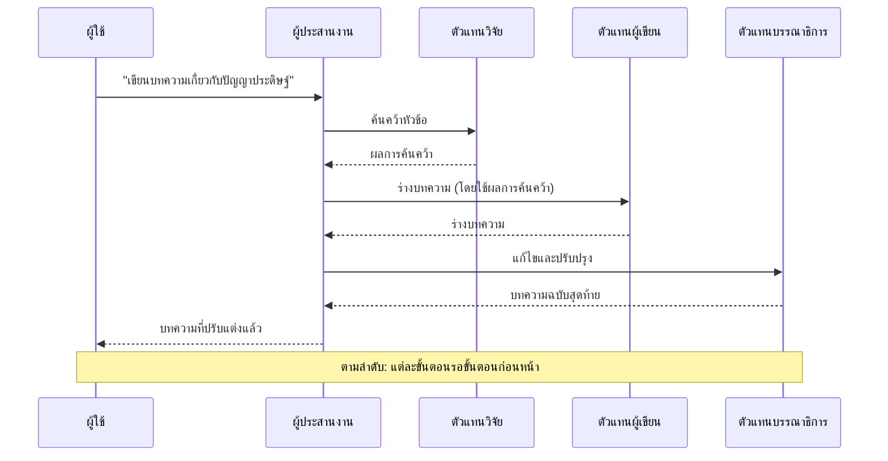
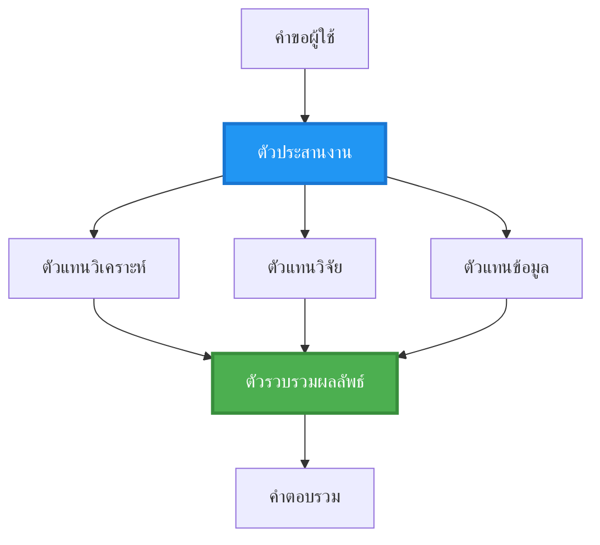
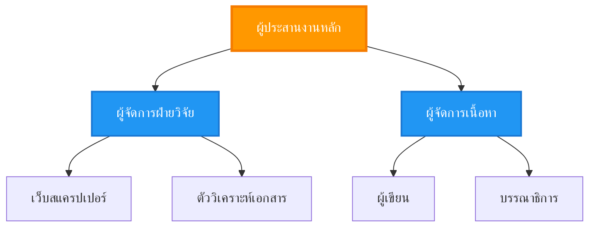
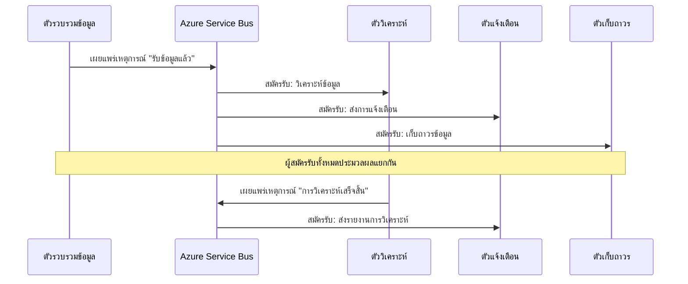
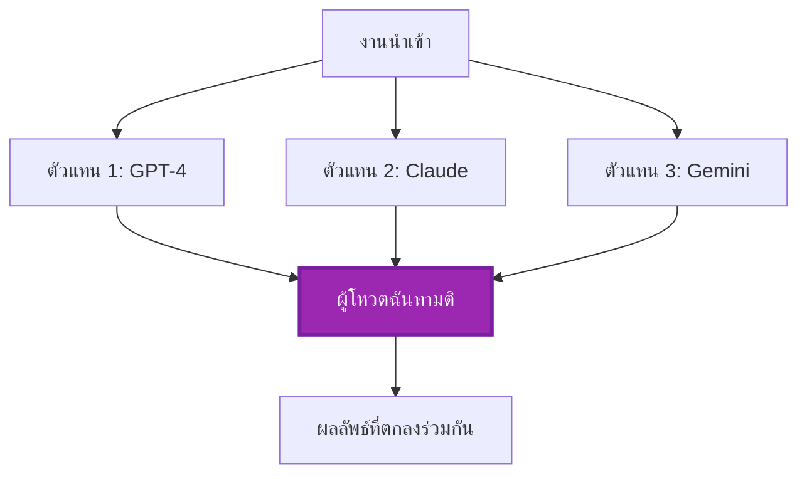
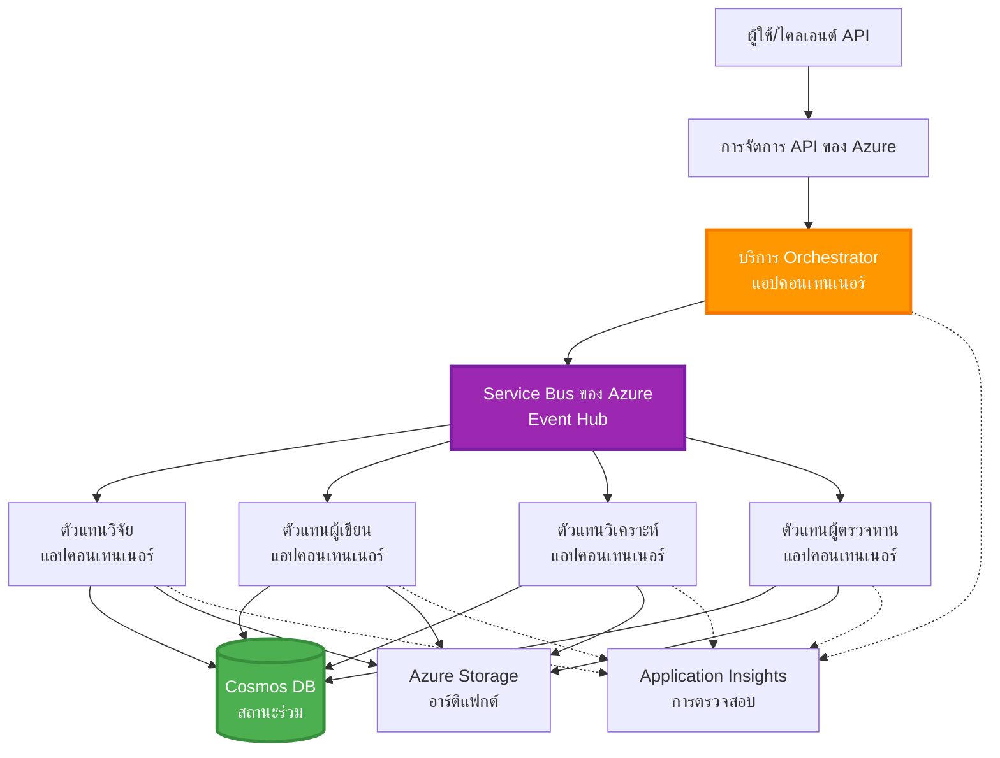

# รูปแบบการประสานงานหลายตัวแทน

⏱️ **เวลาที่คาดไว้**: 60-75 นาที | 💰 **ต้นทุนโดยประมาณ**: ~$100-300/เดือน | ⭐ **ความซับซ้อน**: ขั้นสูง

**📚 เส้นทางการเรียนรู้:**
- ← ก่อนหน้า: [การวางแผนความจุ](capacity-planning.md) - การกำหนดขนาดทรัพยากรและกลยุทธ์การปรับขนาด
- 🎯 **คุณอยู่ที่นี่**: รูปแบบการประสานงานหลายตัวแทน (การออร์เคสตรา, การสื่อสาร, การจัดการสถานะ)
- → ถัดไป: [การเลือก SKU](sku-selection.md) - การเลือกบริการ Azure ที่เหมาะสม
- 🏠 [หน้าหลักหลักสูตร](../../README.md)

---

## สิ่งที่คุณจะได้เรียนรู้

เมื่อทำบทเรียนนี้จบ คุณจะสามารถ:
- เข้าใจรูปแบบสถาปัตยกรรม **หลายตัวแทน** และเมื่อใดควรใช้
- นำรูปแบบการออร์เคสตราไปใช้ (**รวมศูนย์, กระจาย, เชิงลำดับชั้น**)
- ออกแบบกลยุทธ์การสื่อสารของตัวแทน (แบบซิงโครนัส, อะซิงโครนัส, ขับเคลื่อนด้วยเหตุการณ์)
- จัดการ **สถานะที่ใช้ร่วมกัน** ข้ามตัวแทนที่กระจายตัว
- ปรับใช้ **ระบบหลายตัวแทน** บน Azure ด้วย AZD
- ประยุกต์ **รูปแบบการประสานงาน** สำหรับสถานการณ์ AI ในโลกจริง
- ตรวจสอบและดีบักระบบตัวแทนที่กระจายตัว

## ทำไมการประสานงานหลายตัวแทนจึงสำคัญ

### วิวัฒนาการ: จากตัวแทนเดี่ยวสู่หลายตัวแทน

**ตัวแทนเดี่ยว (เรียบง่าย):**
```
User → Agent → Response
```
- ✅ เข้าใจและนำไปใช้ได้ง่าย
- ✅ รวดเร็วสำหรับงานง่าย ๆ
- ❌ ถูกจำกัดด้วยความสามารถของโมเดลเดียว
- ❌ ไม่สามารถทำงานแบบขนานสำหรับงานซับซ้อนได้
- ❌ ไม่มีความเชี่ยวชาญเฉพาะทาง

**ระบบหลายตัวแทน (ขั้นสูง):**
```
           ┌─────────────┐
           │ Orchestrator│
           └──────┬──────┘
        ┌─────────┼─────────┐
        │         │         │
    ┌───▼──┐  ┌──▼───┐  ┌──▼────┐
    │Agent1│  │Agent2│  │Agent3 │
    │(Plan)│  │(Code)│  │(Review)│
    └──────┘  └──────┘  └───────┘
```
- ✅ ตัวแทนเฉพาะทางสำหรับงานแต่ละประเภท
- ✅ การประมวลผลแบบขนานเพื่อความเร็ว
- ✅ โมดูลาร์และดูแลรักษาง่าย
- ✅ ดีกว่าสำหรับเวิร์กโฟลว์ที่ซับซ้อน
- ⚠️ ต้องการตรรกะการประสานงาน

**อนาล็อกี**: ตัวแทนเดี่ยวเหมือนคนคนเดียวที่ทำทุกอย่าง ส่วนระบบหลายตัวแทนเหมือนทีมที่สมาชิกแต่ละคนมีทักษะเฉพาะทาง (นักวิจัย, โปรแกรมเมอร์, ผู้ตรวจทาน, นักเขียน) ทำงานร่วมกัน

---

## รูปแบบการประสานงานหลัก

### รูปแบบที่ 1: การประสานงานแบบตามลำดับ (Chain of Responsibility)

**เมื่อใดควรใช้**: งานต้องเสร็จตามลำดับที่กำหนด แต่ละตัวแทนใช้ผลลัพธ์จากขั้นตอนก่อนหน้า



**ประโยชน์:**
- ✅ โฟลว์ข้อมูลชัดเจน
- ✅ ง่ายต่อการดีบัก
- ✅ ลำดับการทำงานที่คาดการณ์ได้

**ข้อจำกัด:**
- ❌ ช้ากว่า (ไม่มีการประมวลผลแบบขนาน)
- ❌ ความล้มเหลวในขั้นตอนเดียวอาจหยุดทั้งโซ่
- ❌ จัดการงานที่ต้องพึ่งพากันไม่ได้

**ตัวอย่างการใช้งาน:**
- สายงานสร้างเนื้อหา (ค้นคว้า → เขียน → แก้ไข → เผยแพร่)
- การสร้างโค้ด (วางแผน → ลงมือเขียน → ทดสอบ → ปรับใช้งาน)
- การสร้างรายงาน (เก็บข้อมูล → วิเคราะห์ → สร้างภาพ → สรุป)

---

### รูปแบบที่ 2: การประสานงานแบบขนาน (Fan-Out/Fan-In)

**เมื่อใดควรใช้**: งานที่เป็นอิสระสามารถรันพร้อมกันได้ แล้วรวมผลลัพธ์เมื่อสิ้นสุด


**ประโยชน์:**
- ✅ เร็ว (การประมวลผลแบบขนาน)
- ✅ ทนต่อข้อผิดพลาด (ผลบางส่วนยังยอมรับได้)
- ✅ ขยายได้ในแนวนอน

**ข้อจำกัด:**
- ⚠️ ผลลัพธ์อาจมาถึงไม่เป็นลำดับ
- ⚠️ ต้องมีตรรกะการรวมผล
- ⚠️ การจัดการสถานะซับซ้อน

**ตัวอย่างการใช้งาน:**
- การรวบรวมข้อมูลจากหลายแหล่ง (APIs + ฐานข้อมูล + การสแครปเว็บ)
- การวิเคราะห์แข่งขัน (หลายโมเดลสร้างคำตอบ แล้วเลือกดีที่สุด)
- บริการแปลภาษา (แปลเป็นหลายภาษาในเวลาเดียวกัน)

---

### รูปแบบที่ 3: การประสานงานเชิงลำดับชั้น (Manager-Worker)

**เมื่อใดควรใช้**: เวิร์กโฟลว์ซับซ้อนที่มีงานย่อยและต้องการการมอบหมาย


**ประโยชน์:**
- ✅ จัดการเวิร์กโฟลว์ที่ซับซ้อนได้
- ✅ โมดูลาร์และดูแลรักษาง่าย
- ✅ ขอบเขตความรับผิดชอบชัดเจน

**ข้อจำกัด:**
- ⚠️ สถาปัตยกรรมซับซ้อนขึ้น
- ⚠️ ความหน่วงสูงกว่า (มีหลายชั้นของการประสานงาน)
- ⚠️ ต้องการการออร์เคสเตรชั่นที่ซับซ้อน

**ตัวอย่างการใช้งาน:**
- การประมวลผลเอกสารระดับองค์กร (จำแนก → ส่งต่อ → ประมวลผล → เก็บถาวร)
- สายงานข้อมูลหลายขั้นตอน (รับเข้า → ทำความสะอาด → แปลง → วิเคราะห์ → รายงาน)
- เวิร์กโฟลว์อัตโนมัติซับซ้อน (วางแผน → จัดสรรทรัพยากร → ดำเนินการ → ตรวจสอบ)

---

### รูปแบบที่ 4: การประสานงานแบบขับเคลื่อนด้วยเหตุการณ์ (Publish-Subscribe)

**เมื่อใดควรใช้**: ตัวแทนต้องตอบสนองต่อเหตุการณ์ ต้องการความเชื่อมโยงหลวม


**ประโยชน์:**
- ✅ การเชื่อมโยงระหว่างตัวแทนแบบหลวม
- ✅ เพิ่มตัวแทนใหม่ได้ง่าย (แค่สมัครรับ)
- ✅ การประมวลผลแบบอะซิงโครนัส
- ✅ ทนทาน (ข้อความสามารถคงอยู่)

**ข้อจำกัด:**
- ⚠️ ความสอดคล้องแบบยุติธรรม
- ⚠️ การดีบักซับซ้อน
- ⚠️ ความท้าทายเรื่องการจัดลำดับข้อความ

**ตัวอย่างการใช้งาน:**
- ระบบตรวจสอบแบบเรียลไทม์ (การแจ้งเตือน, แดชบอร์ด, บันทึก)
- การแจ้งเตือนหลายช่องทาง (อีเมล, SMS, push, Slack)
- สายงานการประมวลผลข้อมูล (หลายผู้บริโภคของข้อมูลเดียวกัน)

---

### รูปแบบที่ 5: การประสานงานแบบอาศัยฉันทามติ (Voting/Quorum)

**เมื่อใดควรใช้**: ต้องการความเห็นชอบจากหลายตัวแทนก่อนดำเนินการต่อ


**ประโยชน์:**
- ✅ ความแม่นยำสูงขึ้น (หลายความเห็น)
- ✅ ทนทานต่อข้อผิดพลาด (ล้มเหลวเป็นส่วนน้อยยอมรับได้)
- ✅ มีการประกันคุณภาพในตัว

**ข้อจำกัด:**
- ❌ แพง (เรียกใช้งานโมเดลหลายตัว)
- ❌ ช้ากว่า (ต้องรอหลายตัวแทน)
- ⚠️ ต้องมีการแก้ไขความขัดแย้ง

**ตัวอย่างการใช้งาน:**
- การควบคุมเนื้อหา (หลายโมเดลตรวจสอบเนื้อหา)
- การตรวจสอบโค้ด (หลายตัววิเคราะห์/linters)
- การวินิจฉัยทางการแพทย์ (หลายโมเดล AI, การยืนยันจากผู้เชี่ยวชาญ)

---

## ภาพรวมสถาปัตยกรรม

### ระบบหลายตัวแทนแบบสมบูรณ์บน Azure


**ส่วนประกอบสำคัญ:**

| ส่วนประกอบ | วัตถุประสงค์ | บริการ Azure |
|-----------|---------|---------------|
| **เกตเวย์ API** | จุดเข้าใช้งาน, การจำกัดอัตรา, การยืนยันตัวตน | API Management |
| **Orchestrator** | ประสานเวิร์กโฟลว์ของตัวแทน | Container Apps |
| **Message Queue** | การสื่อสารแบบอะซิงโครนัส | Service Bus / Event Hubs |
| **ตัวแทน** | เวิร์กเกอร์ AI เฉพาะทาง | Container Apps / Functions |
| **State Store** | สถานะที่ใช้ร่วมกัน, การติดตามงาน | Cosmos DB |
| **Artifact Storage** | เอกสาร, ผลลัพธ์, บันทึก | Blob Storage |
| **Monitoring** | การติดตามแบบกระจาย, บันทึก | Application Insights |

---

## ข้อกำหนดเบื้องต้น

### เครื่องมือที่ต้องใช้

```bash
# ตรวจสอบ Azure Developer CLI
azd version
# ✅ คาดหวัง: azd เวอร์ชัน 1.0.0 หรือสูงกว่า

# ตรวจสอบ Azure CLI
az --version
# ✅ คาดหวัง: azure-cli 2.50.0 หรือสูงกว่า

# ตรวจสอบ Docker (สำหรับการทดสอบในเครื่อง)
docker --version
# ✅ คาดหวัง: Docker เวอร์ชัน 20.10 หรือสูงกว่า
```

### ข้อกำหนด Azure

- การสมัครใช้งาน Azure ที่ใช้งานอยู่
- สิทธิ์ในการสร้าง:
  - Container Apps
  - Service Bus namespaces
  - Cosmos DB accounts
  - Storage accounts
  - Application Insights

### ความรู้เบื้องต้นที่จำเป็น

คุณควรได้ทำบทเรียนต่อไปนี้ให้เสร็จแล้ว:
- [การจัดการการตั้งค่า](../chapter-03-configuration/configuration.md)
- [การพิสูจน์ตัวตน & ความปลอดภัย](../chapter-03-configuration/authsecurity.md)
- [ตัวอย่างไมโครเซอร์วิส](../../../../examples/microservices)

---

## คู่มือการใช้งาน

### โครงสร้างโปรเจกต์

```
multi-agent-system/
├── azure.yaml                    # AZD configuration
├── infra/
│   ├── main.bicep               # Main infrastructure
│   ├── core/
│   │   ├── servicebus.bicep     # Message queue
│   │   ├── cosmos.bicep         # State store
│   │   ├── storage.bicep        # Artifact storage
│   │   └── monitoring.bicep     # Application Insights
│   └── app/
│       ├── orchestrator.bicep   # Orchestrator service
│       └── agent.bicep          # Agent template
└── src/
    ├── orchestrator/            # Orchestration logic
    │   ├── app.py
    │   ├── workflows.py
    │   └── Dockerfile
    ├── agents/
    │   ├── research/            # Research agent
    │   ├── writer/              # Writer agent
    │   ├── analyst/             # Analyst agent
    │   └── reviewer/            # Reviewer agent
    └── shared/
        ├── state_manager.py     # Shared state logic
        └── message_handler.py   # Message handling
```

---

## บทเรียน 1: รูปแบบการประสานงานแบบตามลำดับ

### การประยุกต์: สายงานการสร้างเนื้อหา

มาสร้างสายงานแบบตามลำดับ: ค้นคว้า → เขียน → แก้ไข → เผยแพร่

### 1. การกำหนดค่า AZD

**ไฟล์: `azure.yaml`**

```yaml
name: content-pipeline
metadata:
  template: multi-agent-sequential@1.0.0

services:
  orchestrator:
    project: ./src/orchestrator
    language: python
    host: containerapp
  
  research-agent:
    project: ./src/agents/research
    language: python
    host: containerapp
  
  writer-agent:
    project: ./src/agents/writer
    language: python
    host: containerapp
  
  editor-agent:
    project: ./src/agents/editor
    language: python
    host: containerapp
```

### 2. โครงสร้างพื้นฐาน: Service Bus สำหรับการประสานงาน

**ไฟล์: `infra/core/servicebus.bicep`**

```bicep
param name string
param location string
param tags object = {}

resource serviceBusNamespace 'Microsoft.ServiceBus/namespaces@2022-10-01-preview' = {
  name: name
  location: location
  tags: tags
  sku: {
    name: 'Standard'
    tier: 'Standard'
  }
  properties: {
    minimumTlsVersion: '1.2'
  }
}

// Queue for orchestrator → research agent
resource researchQueue 'Microsoft.ServiceBus/namespaces/queues@2022-10-01-preview' = {
  parent: serviceBusNamespace
  name: 'research-tasks'
  properties: {
    maxDeliveryCount: 3
    lockDuration: 'PT5M'
    deadLetteringOnMessageExpiration: true
  }
}

// Queue for research agent → writer agent
resource writerQueue 'Microsoft.ServiceBus/namespaces/queues@2022-10-01-preview' = {
  parent: serviceBusNamespace
  name: 'writer-tasks'
  properties: {
    maxDeliveryCount: 3
    lockDuration: 'PT5M'
  }
}

// Queue for writer agent → editor agent
resource editorQueue 'Microsoft.ServiceBus/namespaces/queues@2022-10-01-preview' = {
  parent: serviceBusNamespace
  name: 'editor-tasks'
  properties: {
    maxDeliveryCount: 3
    lockDuration: 'PT5M'
  }
}

output namespace string = serviceBusNamespace.name
output connectionString string = listKeys('${serviceBusNamespace.id}/AuthorizationRules/RootManageSharedAccessKey', serviceBusNamespace.apiVersion).primaryConnectionString
```

### 3. ตัวจัดการสถานะที่ใช้ร่วมกัน

**ไฟล์: `src/shared/state_manager.py`**

```python
from azure.cosmos import CosmosClient, PartitionKey
from datetime import datetime
import os

class StateManager:
    """Manages shared state across agents using Cosmos DB"""
    
    def __init__(self):
        endpoint = os.environ['COSMOS_ENDPOINT']
        key = os.environ['COSMOS_KEY']
        
        self.client = CosmosClient(endpoint, key)
        self.database = self.client.get_database_client('agent-state')
        self.container = self.database.get_container_client('tasks')
    
    def create_task(self, task_id: str, task_type: str, input_data: dict):
        """Create a new task"""
        task = {
            'id': task_id,
            'type': task_type,
            'status': 'pending',
            'input': input_data,
            'created_at': datetime.utcnow().isoformat(),
            'steps': []
        }
        self.container.create_item(task)
        return task
    
    def update_task_step(self, task_id: str, step_name: str, result: dict):
        """Update task with completed step"""
        task = self.container.read_item(task_id, partition_key=task_id)
        
        task['steps'].append({
            'name': step_name,
            'completed_at': datetime.utcnow().isoformat(),
            'result': result
        })
        
        self.container.replace_item(task_id, task)
        return task
    
    def complete_task(self, task_id: str, final_result: dict):
        """Mark task as complete"""
        task = self.container.read_item(task_id, partition_key=task_id)
        task['status'] = 'completed'
        task['result'] = final_result
        task['completed_at'] = datetime.utcnow().isoformat()
        self.container.replace_item(task_id, task)
        return task
    
    def get_task(self, task_id: str):
        """Retrieve task state"""
        return self.container.read_item(task_id, partition_key=task_id)
```

### 4. บริการ Orchestrator

**ไฟล์: `src/orchestrator/app.py`**

```python
from flask import Flask, request, jsonify
from azure.servicebus import ServiceBusClient, ServiceBusMessage
import json
import uuid
import os
from shared.state_manager import StateManager

app = Flask(__name__)
state_manager = StateManager()

# การเชื่อมต่อกับ Service Bus
servicebus_connection_str = os.environ['SERVICEBUS_CONNECTION_STRING']
servicebus_client = ServiceBusClient.from_connection_string(servicebus_connection_str)

@app.route('/health', methods=['GET'])
def health():
    return jsonify({'status': 'healthy', 'service': 'orchestrator'})

@app.route('/create-content', methods=['POST'])
def create_content():
    """
    Sequential workflow: Research → Write → Edit → Publish
    """
    data = request.json
    topic = data.get('topic')
    
    if not topic:
        return jsonify({'error': 'Topic required'}), 400
    
    # สร้างงานในที่เก็บสถานะ
    task_id = str(uuid.uuid4())
    task = state_manager.create_task(
        task_id=task_id,
        task_type='content_creation',
        input_data={'topic': topic}
    )
    
    # ส่งข้อความไปยังตัวแทนวิจัย (ขั้นตอนแรก)
    sender = servicebus_client.get_queue_sender('research-tasks')
    message = ServiceBusMessage(
        body=json.dumps({
            'task_id': task_id,
            'topic': topic,
            'next_queue': 'writer-tasks'  # ส่งผลลัพธ์ไปที่ไหน
        }),
        content_type='application/json'
    )
    
    with sender:
        sender.send_messages(message)
    
    return jsonify({
        'task_id': task_id,
        'status': 'started',
        'workflow': 'sequential',
        'steps': ['research', 'write', 'edit', 'publish'],
        'message': 'Content creation pipeline initiated'
    }), 202

@app.route('/task/<task_id>', methods=['GET'])
def get_task_status(task_id):
    """Check task status"""
    try:
        task = state_manager.get_task(task_id)
        return jsonify(task)
    except Exception as e:
        return jsonify({'error': str(e)}), 404

if __name__ == '__main__':
    app.run(host='0.0.0.0', port=8080)
```

### 5. ตัวแทนค้นคว้า

**ไฟล์: `src/agents/research/app.py`**

```python
from azure.servicebus import ServiceBusClient, ServiceBusMessage
from openai import AzureOpenAI
import json
import os
import time
from shared.state_manager import StateManager

# เริ่มต้นไคลเอนต์
state_manager = StateManager()
servicebus_client = ServiceBusClient.from_connection_string(
    os.environ['SERVICEBUS_CONNECTION_STRING']
)

openai_client = AzureOpenAI(
    api_key=os.environ['AZURE_OPENAI_API_KEY'],
    api_version="2024-02-01",
    azure_endpoint=os.environ['AZURE_OPENAI_ENDPOINT']
)

def process_research_task(message_data):
    """Process research request and pass to writer"""
    task_id = message_data['task_id']
    topic = message_data['topic']
    next_queue = message_data['next_queue']
    
    print(f"🔬 Researching: {topic}")
    
    # เรียก Azure OpenAI เพื่อการวิจัย
    response = openai_client.chat.completions.create(
        model="gpt-4",
        messages=[
            {"role": "system", "content": "You are a research assistant. Provide comprehensive research on the given topic."},
            {"role": "user", "content": f"Research this topic thoroughly: {topic}"}
        ],
        max_tokens=1500
    )
    
    research_results = response.choices[0].message.content
    
    # อัปเดตสถานะ
    state_manager.update_task_step(
        task_id=task_id,
        step_name='research',
        result={'research': research_results}
    )
    
    # ส่งไปยังเอเจนต์ถัดไป (ผู้เขียน)
    sender = servicebus_client.get_queue_sender(next_queue)
    message = ServiceBusMessage(
        body=json.dumps({
            'task_id': task_id,
            'topic': topic,
            'research': research_results,
            'next_queue': 'editor-tasks'
        }),
        content_type='application/json'
    )
    
    with sender:
        sender.send_messages(message)
    
    print(f"✅ Research complete for task {task_id}")

def main():
    """Listen to research queue"""
    receiver = servicebus_client.get_queue_receiver('research-tasks')
    
    print("🔬 Research Agent started, listening for tasks...")
    
    with receiver:
        while True:
            messages = receiver.receive_messages(max_wait_time=5)
            for message in messages:
                try:
                    message_data = json.loads(str(message))
                    process_research_task(message_data)
                    receiver.complete_message(message)
                except Exception as e:
                    print(f"❌ Error processing message: {e}")
                    receiver.abandon_message(message)

if __name__ == '__main__':
    main()
```

### 6. ตัวแทนนักเขียน

**ไฟล์: `src/agents/writer/app.py`**

```python
from azure.servicebus import ServiceBusClient, ServiceBusMessage
from openai import AzureOpenAI
import json
import os
from shared.state_manager import StateManager

state_manager = StateManager()
servicebus_client = ServiceBusClient.from_connection_string(
    os.environ['SERVICEBUS_CONNECTION_STRING']
)

openai_client = AzureOpenAI(
    api_key=os.environ['AZURE_OPENAI_API_KEY'],
    api_version="2024-02-01",
    azure_endpoint=os.environ['AZURE_OPENAI_ENDPOINT']
)

def process_writing_task(message_data):
    """Write article based on research"""
    task_id = message_data['task_id']
    topic = message_data['topic']
    research = message_data['research']
    next_queue = message_data['next_queue']
    
    print(f"✍️ Writing article: {topic}")
    
    # เรียกใช้ Azure OpenAI เพื่อเขียนบทความ
    response = openai_client.chat.completions.create(
        model="gpt-4",
        messages=[
            {"role": "system", "content": "You are a professional writer. Write engaging, well-structured articles."},
            {"role": "user", "content": f"Based on this research:\n\n{research}\n\nWrite a comprehensive article about: {topic}"}
        ],
        max_tokens=2000
    )
    
    article_draft = response.choices[0].message.content
    
    # อัปเดตสถานะ
    state_manager.update_task_step(
        task_id=task_id,
        step_name='writing',
        result={'draft': article_draft}
    )
    
    # ส่งไปยังบรรณาธิการ
    sender = servicebus_client.get_queue_sender(next_queue)
    message = ServiceBusMessage(
        body=json.dumps({
            'task_id': task_id,
            'topic': topic,
            'draft': article_draft
        }),
        content_type='application/json'
    )
    
    with sender:
        sender.send_messages(message)
    
    print(f"✅ Article draft complete for task {task_id}")

def main():
    """Listen to writer queue"""
    receiver = servicebus_client.get_queue_receiver('writer-tasks')
    
    print("✍️ Writer Agent started, listening for tasks...")
    
    with receiver:
        while True:
            messages = receiver.receive_messages(max_wait_time=5)
            for message in messages:
                try:
                    message_data = json.loads(str(message))
                    process_writing_task(message_data)
                    receiver.complete_message(message)
                except Exception as e:
                    print(f"❌ Error: {e}")
                    receiver.abandon_message(message)

if __name__ == '__main__':
    main()
```

### 7. ตัวแทนบรรณาธิการ

**ไฟล์: `src/agents/editor/app.py`**

```python
from azure.servicebus import ServiceBusClient
from openai import AzureOpenAI
import json
import os
from shared.state_manager import StateManager

state_manager = StateManager()
servicebus_client = ServiceBusClient.from_connection_string(
    os.environ['SERVICEBUS_CONNECTION_STRING']
)

openai_client = AzureOpenAI(
    api_key=os.environ['AZURE_OPENAI_API_KEY'],
    api_version="2024-02-01",
    azure_endpoint=os.environ['AZURE_OPENAI_ENDPOINT']
)

def process_editing_task(message_data):
    """Edit and finalize article"""
    task_id = message_data['task_id']
    topic = message_data['topic']
    draft = message_data['draft']
    
    print(f"📝 Editing article: {topic}")
    
    # เรียก Azure OpenAI เพื่อแก้ไข
    response = openai_client.chat.completions.create(
        model="gpt-4",
        messages=[
            {"role": "system", "content": "You are an expert editor. Improve grammar, clarity, and structure."},
            {"role": "user", "content": f"Edit and improve this article:\n\n{draft}"}
        ],
        max_tokens=2000
    )
    
    final_article = response.choices[0].message.content
    
    # ทำเครื่องหมายงานว่าเสร็จ
    state_manager.complete_task(
        task_id=task_id,
        final_result={
            'topic': topic,
            'final_article': final_article,
            'word_count': len(final_article.split())
        }
    )
    
    print(f"✅ Article finalized for task {task_id}")

def main():
    """Listen to editor queue"""
    receiver = servicebus_client.get_queue_receiver('editor-tasks')
    
    print("📝 Editor Agent started, listening for tasks...")
    
    with receiver:
        while True:
            messages = receiver.receive_messages(max_wait_time=5)
            for message in messages:
                try:
                    message_data = json.loads(str(message))
                    process_editing_task(message_data)
                    receiver.complete_message(message)
                except Exception as e:
                    print(f"❌ Error: {e}")
                    receiver.abandon_message(message)

if __name__ == '__main__':
    main()
```

### 8. ปรับใช้และทดสอบ

```bash
# เริ่มต้นและปรับใช้
azd init
azd up

# รับ URL ของตัวจัดการการประสานงาน
ORCHESTRATOR_URL=$(azd env get-values | grep ORCHESTRATOR_URL | cut -d '=' -f2 | tr -d '"')

# สร้างเนื้อหา
curl -X POST $ORCHESTRATOR_URL/create-content \
  -H "Content-Type: application/json" \
  -d '{"topic": "The Future of AI in Healthcare"}'
```

**✅ ผลลัพธ์ที่คาดไว้:**
```json
{
  "task_id": "a1b2c3d4-e5f6-7890-abcd-ef1234567890",
  "status": "started",
  "workflow": "sequential",
  "steps": ["research", "write", "edit", "publish"],
  "message": "Content creation pipeline initiated"
}
```

**ตรวจสอบความคืบหน้าของงาน:**
```bash
TASK_ID="a1b2c3d4-e5f6-7890-abcd-ef1234567890"
curl $ORCHESTRATOR_URL/task/$TASK_ID
```

**✅ ผลลัพธ์ที่คาดไว้ (เสร็จสมบูรณ์):**
```json
{
  "id": "a1b2c3d4-e5f6-7890-abcd-ef1234567890",
  "type": "content_creation",
  "status": "completed",
  "steps": [
    {
      "name": "research",
      "completed_at": "2025-11-19T10:30:00Z",
      "result": {"research": "..."}
    },
    {
      "name": "writing",
      "completed_at": "2025-11-19T10:32:00Z",
      "result": {"draft": "..."}
    }
  ],
  "result": {
    "topic": "The Future of AI in Healthcare",
    "final_article": "...",
    "word_count": 1500
  }
}
```

---

## บทเรียน 2: รูปแบบการประสานงานแบบขนาน

### การประยุกต์: ตัวรวมผลการค้นคว้าจากหลายแหล่ง

มาสร้างระบบแบบขนานที่รวบรวมข้อมูลจากหลายแหล่งพร้อมกัน

### ตัวออร์เคสตราแบบขนาน

**ไฟล์: `src/orchestrator/parallel_workflow.py`**

```python
from flask import Flask, request, jsonify
from azure.servicebus import ServiceBusClient, ServiceBusMessage
import json
import uuid
import os
from shared.state_manager import StateManager

app = Flask(__name__)
state_manager = StateManager()

servicebus_client = ServiceBusClient.from_connection_string(
    os.environ['SERVICEBUS_CONNECTION_STRING']
)

@app.route('/research-parallel', methods=['POST'])
def research_parallel():
    """
    Parallel workflow: Multiple agents work simultaneously
    """
    data = request.json
    query = data.get('query')
    
    task_id = str(uuid.uuid4())
    task = state_manager.create_task(
        task_id=task_id,
        task_type='parallel_research',
        input_data={
            'query': query,
            'agents': ['web', 'academic', 'news', 'social']
        }
    )
    
    # การกระจายแบบแฟนเอาต์: ส่งไปยังตัวแทนทั้งหมดพร้อมกัน
    agents = [
        ('web-research-queue', 'web'),
        ('academic-research-queue', 'academic'),
        ('news-research-queue', 'news'),
        ('social-research-queue', 'social')
    ]
    
    for queue_name, agent_type in agents:
        sender = servicebus_client.get_queue_sender(queue_name)
        message = ServiceBusMessage(
            body=json.dumps({
                'task_id': task_id,
                'query': query,
                'agent_type': agent_type,
                'result_queue': 'aggregation-queue'
            }),
            content_type='application/json'
        )
        
        with sender:
            sender.send_messages(message)
    
    return jsonify({
        'task_id': task_id,
        'status': 'started',
        'workflow': 'parallel',
        'agents_dispatched': 4,
        'message': 'Parallel research initiated'
    }), 202

if __name__ == '__main__':
    app.run(host='0.0.0.0', port=8080)
```

### ตรรกะการรวมผล

**ไฟล์: `src/agents/aggregator/app.py`**

```python
from azure.servicebus import ServiceBusClient
import json
import os
from collections import defaultdict
from shared.state_manager import StateManager

state_manager = StateManager()
servicebus_client = ServiceBusClient.from_connection_string(
    os.environ['SERVICEBUS_CONNECTION_STRING']
)

# ติดตามผลลัพธ์ต่อภารกิจ
task_results = defaultdict(list)
expected_agents = 4  # เว็บ, วิชาการ, ข่าว, โซเชียล

def process_result(message_data):
    """Aggregate results from parallel agents"""
    task_id = message_data['task_id']
    agent_type = message_data['agent_type']
    result = message_data['result']
    
    # จัดเก็บผลลัพธ์
    task_results[task_id].append({
        'agent': agent_type,
        'data': result
    })
    
    print(f"📊 Received result from {agent_type} agent ({len(task_results[task_id])}/{expected_agents})")
    
    # ตรวจสอบว่าเอเจนต์ทั้งหมดเสร็จแล้วหรือไม่ (fan-in)
    if len(task_results[task_id]) == expected_agents:
        print(f"✅ All agents completed for task {task_id}. Aggregating...")
        
        # รวมผลลัพธ์
        aggregated = {
            'query': message_data['query'],
            'sources': task_results[task_id],
            'summary': generate_summary(task_results[task_id])
        }
        
        # ทำเครื่องหมายว่าเสร็จสมบูรณ์
        state_manager.complete_task(task_id, aggregated)
        
        # ทำความสะอาด
        del task_results[task_id]
        
        print(f"✅ Aggregation complete for task {task_id}")

def generate_summary(results):
    """Generate summary from all sources"""
    summaries = [r['data'].get('summary', '') for r in results]
    return '\n\n'.join(summaries)

def main():
    """Listen to aggregation queue"""
    receiver = servicebus_client.get_queue_receiver('aggregation-queue')
    
    print("📊 Aggregator started, listening for results...")
    
    with receiver:
        while True:
            messages = receiver.receive_messages(max_wait_time=5)
            for message in messages:
                try:
                    message_data = json.loads(str(message))
                    process_result(message_data)
                    receiver.complete_message(message)
                except Exception as e:
                    print(f"❌ Error: {e}")
                    receiver.abandon_message(message)

if __name__ == '__main__':
    main()
```

**ประโยชน์ของรูปแบบขนาน:**
- ⚡ **เร็วขึ้น 4 เท่า** (ตัวแทนทำงานพร้อมกัน)
- 🔄 **ทนต่อข้อผิดพลาด** (ผลบางส่วนยอมรับได้)
- 📈 **ขยายได้** (เพิ่มตัวแทนได้ง่าย)

---

## แบบฝึกหัดเชิงปฏิบัติ

### แบบฝึกหัด 1: เพิ่มการจัดการเวลาเกิน (Timeout) ⭐⭐ (ปานกลาง)

**เป้าหมาย**: นำตรรกะการกำหนดเวลาเกินมาใช้เพื่อไม่ให้ตัวรวมรอช้าเกินไปสำหรับตัวแทนที่ช้า

**ขั้นตอน**:

1. **เพิ่มการติดตามเวลาเกินในตัวรวมผล:**

```python
from datetime import datetime, timedelta

task_timeouts = {}  # task_id -> expiration_time

def process_result(message_data):
    task_id = message_data['task_id']
    
    # กำหนดเวลาหมดอายุสำหรับผลลัพธ์ตัวแรก
    if task_id not in task_timeouts:
        task_timeouts[task_id] = datetime.utcnow() + timedelta(seconds=30)
    
    task_results[task_id].append({
        'agent': message_data['agent_type'],
        'data': message_data['result']
    })
    
    # ตรวจสอบว่าทำเสร็จหรือหมดเวลา
    if len(task_results[task_id]) == expected_agents or \
       datetime.utcnow() > task_timeouts[task_id]:
        
        print(f"📊 Aggregating with {len(task_results[task_id])}/{expected_agents} results")
        
        aggregated = {
            'query': message_data['query'],
            'sources': task_results[task_id],
            'completed_agents': len(task_results[task_id]),
            'timed_out': len(task_results[task_id]) < expected_agents
        }
        
        state_manager.complete_task(task_id, aggregated)
        
        # ทำความสะอาด
        del task_results[task_id]
        del task_timeouts[task_id]
```

2. **ทดสอบด้วยการหน่วงเวลาจำลอง:**

```python
# ในเอเจนต์หนึ่ง ให้เพิ่มการหน่วงเวลาเพื่อจำลองการประมวลผลที่ช้า
import time
time.sleep(35)  # เกินขีดจำกัดเวลา 30 วินาที
```

3. **ปรับใช้และยืนยันผล:**

```bash
azd deploy aggregator

# ส่งงาน
curl -X POST $ORCHESTRATOR_URL/research-parallel \
  -H "Content-Type: application/json" \
  -d '{"query": "AI safety research"}'

# ตรวจผลหลังจาก 30 วินาที
curl $ORCHESTRATOR_URL/task/$TASK_ID
```

**✅ เกณฑ์ความสำเร็จ:**
- ✅ งานเสร็จหลัง 30 วินาทีแม้ว่าตัวแทนบางส่วนยังไม่เสร็จ
- ✅ การตอบกลับระบุผลบางส่วน (`"timed_out": true`)
- ✅ ผลลัพธ์ที่มีอยู่จะถูกส่งกลับ (3 ใน 4 ตัวแทน)

**เวลา**: 20-25 นาที

---

### แบบฝึกหัด 2: นำตรรกะการลองซ้ำมาใช้ (Retry) ⭐⭐⭐ (ขั้นสูง)

**เป้าหมาย**: ให้ระบบลองทำงานตัวแทนที่ล้มเหลวใหม่โดยอัตโนมัตก่อนจะยอมแพ้

**ขั้นตอน**:

1. **เพิ่มการติดตามการลองซ้ำในตัวออร์เคสตรา:**

```python
from dataclasses import dataclass
from typing import Dict

@dataclass
class RetryConfig:
    max_retries: int = 3
    backoff_seconds: int = 5

retry_counts: Dict[str, int] = {}  # message_id ไปยัง retry_count

def send_with_retry(queue_name: str, message_data: dict, retry_config: RetryConfig):
    """Send message with retry metadata"""
    message_id = message_data.get('message_id', str(uuid.uuid4()))
    message_data['message_id'] = message_id
    message_data['retry_count'] = retry_counts.get(message_id, 0)
    message_data['max_retries'] = retry_config.max_retries
    
    sender = servicebus_client.get_queue_sender(queue_name)
    message = ServiceBusMessage(
        body=json.dumps(message_data),
        content_type='application/json',
        message_id=message_id
    )
    
    with sender:
        sender.send_messages(message)
```

2. **เพิ่มตัวจัดการการลองซ้ำในตัวแทน:**

```python
def process_with_retry(message, receiver, process_func):
    """Process message with automatic retry on failure"""
    try:
        message_data = json.loads(str(message))
        
        # ประมวลผลข้อความ
        process_func(message_data)
        
        # สำเร็จ - เสร็จสมบูรณ์
        receiver.complete_message(message)
        
    except Exception as e:
        message_id = message.message_id
        retry_count = message_data.get('retry_count', 0)
        max_retries = message_data.get('max_retries', 3)
        
        if retry_count < max_retries:
            # ลองใหม่: ละทิ้งแล้วส่งกลับไปยังคิวโดยเพิ่มจำนวนการลอง
            print(f"⚠️ Retry {retry_count + 1}/{max_retries} for message {message_id}")
            
            message_data['retry_count'] = retry_count + 1
            
            # ส่งกลับไปยังคิวเดิมพร้อมหน่วงเวลา
            time.sleep(5 * (retry_count + 1))  # การหน่วงแบบทวีคูณ
            send_with_retry(queue_name, message_data, RetryConfig())
            
            receiver.complete_message(message)  # ลบต้นฉบับ
        else:
            # เกินจำนวนการลองสูงสุด - ย้ายไปยังคิวข้อความตาย
            print(f"❌ Max retries exceeded for message {message_id}")
            receiver.dead_letter_message(
                message,
                reason="MaxRetriesExceeded",
                error_description=str(e)
            )
```

3. **ตรวจสอบ dead letter queue:**

```python
def monitor_dead_letters():
    """Check dead letter queue for failed messages"""
    receiver = servicebus_client.get_queue_receiver(
        'research-queue',
        sub_queue='deadletter'
    )
    
    with receiver:
        messages = receiver.receive_messages(max_wait_time=5)
        for message in messages:
            print(f"☠️ Dead letter: {message.message_id}")
            print(f"Reason: {message.dead_letter_reason}")
            print(f"Description: {message.dead_letter_error_description}")
```

**✅ เกณฑ์ความสำเร็จ:**
- ✅ งานที่ล้มเหลวจะลองซ้ำโดยอัตโนมัติ (สูงสุด 3 ครั้ง)
- ✅ ใช้การหน่วงแบบทวีคูณระหว่างการลองซ้ำ (5s, 10s, 15s)
- ✅ หลังจากลองซ้ำครบ จะย้ายข้อความไปที่ dead letter queue
- ✅ สามารถตรวจสอบและเล่นซ้ำข้อความจาก dead letter queue ได้

**เวลา**: 30-40 นาที

---

### แบบฝึกหัด 3: นำ Circuit Breaker มาใช้ ⭐⭐⭐ (ขั้นสูง)

**เป้าหมาย**: ป้องกันการลุกลามของความล้มเหลวโดยหยุดการร้องขอไปยังตัวแทนที่ล้มเหลว

**ขั้นตอน**:

1. **สร้างคลาส circuit breaker:**

```python
from enum import Enum
from datetime import datetime, timedelta

class CircuitState(Enum):
    CLOSED = "closed"      # การทำงานปกติ
    OPEN = "open"          # ล้มเหลว, ปฏิเสธคำขอ
    HALF_OPEN = "half_open"  # กำลังทดสอบว่ากู้คืนได้หรือไม่

class CircuitBreaker:
    def __init__(self, failure_threshold=5, timeout_seconds=60):
        self.failure_threshold = failure_threshold
        self.timeout_seconds = timeout_seconds
        self.failure_count = 0
        self.last_failure_time = None
        self.state = CircuitState.CLOSED
    
    def call(self, func):
        """Execute function with circuit breaker protection"""
        if self.state == CircuitState.OPEN:
            # ตรวจสอบว่าหมดเวลาหรือไม่
            if datetime.utcnow() - self.last_failure_time > timedelta(seconds=self.timeout_seconds):
                self.state = CircuitState.HALF_OPEN
                print("🔄 Circuit breaker: HALF_OPEN (testing)")
            else:
                raise Exception(f"Circuit breaker OPEN for agent. Try again in {self.timeout_seconds}s")
        
        try:
            result = func()
            
            # สำเร็จ
            if self.state == CircuitState.HALF_OPEN:
                self.state = CircuitState.CLOSED
                self.failure_count = 0
                print("✅ Circuit breaker: CLOSED (recovered)")
            
            return result
            
        except Exception as e:
            self.failure_count += 1
            self.last_failure_time = datetime.utcnow()
            
            if self.failure_count >= self.failure_threshold:
                self.state = CircuitState.OPEN
                print(f"🔴 Circuit breaker: OPEN (too many failures)")
            
            raise e
```

2. **นำไปใช้กับการเรียกตัวแทน:**

```python
# ในตัวจัดการการประสานงาน
agent_circuits = {
    'web': CircuitBreaker(failure_threshold=5, timeout_seconds=60),
    'academic': CircuitBreaker(failure_threshold=5, timeout_seconds=60),
    'news': CircuitBreaker(failure_threshold=5, timeout_seconds=60),
    'social': CircuitBreaker(failure_threshold=5, timeout_seconds=60)
}

def send_to_agent(agent_type, message_data):
    """Send with circuit breaker protection"""
    circuit = agent_circuits[agent_type]
    
    try:
        circuit.call(lambda: send_message(agent_type, message_data))
    except Exception as e:
        print(f"⚠️ Skipping {agent_type} agent: {e}")
        # ดำเนินการต่อกับตัวแทนอื่นๆ
```

3. **ทดสอบ circuit breaker:**

```bash
# จำลองความล้มเหลวซ้ำ ๆ (หยุดเอเจนต์ตัวหนึ่ง)
az containerapp stop --name web-research-agent --resource-group rg-agents

# ส่งคำขอหลายรายการ
for i in {1..10}; do
  curl -X POST $ORCHESTRATOR_URL/research-parallel \
    -H "Content-Type: application/json" \
    -d '{"query": "test query '$i'"}'
  sleep 2
done

# ตรวจสอบบันทึก - ควรเห็นตัวตัดวงจรเปิดหลังจากเกิดความล้มเหลว 5 ครั้ง
# ใช้ Azure CLI สำหรับบันทึกของ Container App:
az containerapp logs show --name orchestrator --resource-group $RG_NAME --tail 50
```

**✅ เกณฑ์ความสำเร็จ:**
- ✅ หลังจาก 5 ความล้มเหลว วงจรเปิด (ปฏิเสธคำขอ)
- ✅ หลัง 60 วินาที วงจรเข้าสู่สถานะ half-open (ทดสอบการกู้คืน)
- ✅ ตัวแทนอื่นยังคงทำงานได้ตามปกติ
- ✅ วงจรปิดโดยอัตโนมัติเมื่อฟื้นตัว

**เวลา**: 40-50 นาที

---

## การตรวจสอบและดีบัก

### การติดตามแบบกระจายด้วย Application Insights

**ไฟล์: `src/shared/tracing.py`**

```python
from opencensus.ext.azure.log_exporter import AzureLogHandler
from opencensus.ext.azure.trace_exporter import AzureExporter
from opencensus.trace import config_integration
from opencensus.trace.tracer import Tracer
from opencensus.trace.samplers import AlwaysOnSampler
import logging
import os

# ตั้งค่าการติดตาม
config_integration.trace_integrations(['requests', 'logging'])

connection_string = os.environ.get('APPLICATIONINSIGHTS_CONNECTION_STRING')

# สร้างตัวติดตาม
tracer = Tracer(
    exporter=AzureExporter(connection_string=connection_string),
    sampler=AlwaysOnSampler()
)

# ตั้งค่าการบันทึก
logger = logging.getLogger(__name__)
logger.addHandler(AzureLogHandler(connection_string=connection_string))
logger.setLevel(logging.INFO)

def trace_agent_call(agent_name, task_id, operation):
    """Trace agent operations"""
    with tracer.span(name=f'{agent_name}.{operation}') as span:
        span.add_attribute('agent', agent_name)
        span.add_attribute('task_id', task_id)
        span.add_attribute('operation', operation)
        
        try:
            result = operation()
            span.add_attribute('status', 'success')
            return result
        except Exception as e:
            span.add_attribute('status', 'error')
            span.add_attribute('error', str(e))
            raise
```

### คิวรีใน Application Insights

**ติดตามเวิร์กโฟลว์หลายตัวแทน:**

```kusto
// Trace complete workflow for a task
traces
| where customDimensions.task_id == "a1b2c3d4-..."
| project timestamp, message, customDimensions.agent, customDimensions.operation
| order by timestamp asc
```

**การเปรียบเทียบประสิทธิภาพตัวแทน:**

```kusto
// Compare agent execution times
dependencies
| where name contains "agent"
| summarize 
    avg_duration = avg(duration),
    p95_duration = percentile(duration, 95),
    count = count()
  by agent = tostring(customDimensions.agent)
| order by avg_duration desc
```

**การวิเคราะห์ความล้มเหลว:**

```kusto
// Find which agents fail most
exceptions
| where customDimensions.agent != ""
| summarize 
    failure_count = count(),
    unique_errors = dcount(outerMessage)
  by agent = tostring(customDimensions.agent)
| order by failure_count desc
```

---

## การวิเคราะห์ต้นทุน

### ต้นทุนระบบหลายตัวแทน (ประมาณต่อเดือน)

| ส่วนประกอบ | การกำหนดค่า | ต้นทุน |
|-----------|--------------|------|
| **ตัวประสานงาน** | 1 Container App (1 vCPU, 2GB) | $30-50 |
| **ตัวแทน 4 ตัว** | 4 Container Apps (0.5 vCPU, 1GB each) | $60-120 |
| **Service Bus** | Standard tier, 10M messages | $10-20 |
| **Cosmos DB** | Serverless, 5GB storage, 1M RUs | $25-50 |
| **Blob Storage** | 10GB storage, 100K operations | $5-10 |
| **Application Insights** | 5GB ingestion | $10-15 |
| **Azure OpenAI** | GPT-4, 10M tokens | $100-300 |
| **รวม** | | **$240-565/month** |

### กลยุทธ์การลดต้นทุน

1. **Use serverless where possible:**
   ```bicep
   // Cosmos DB serverless (no minimum cost)
   properties: {
     databaseAccountOfferType: 'Standard'
     capabilities: [{ name: 'EnableServerless' }]
   }
   ```

2. **Scale agents to zero when idle:**
   ```bicep
   scale: {
     minReplicas: 0  // Scale to zero when no messages
     maxReplicas: 10
   }
   ```

3. **Use batching for Service Bus:**
   ```python
   # ส่งข้อความเป็นชุด (ถูกกว่า)
   sender.send_messages([message1, message2, message3])
   ```

4. **Cache frequently used results:**
   ```python
   # ใช้ Azure Cache for Redis
   if cache.exists(query_hash):
       return cache.get(query_hash)
   ```

---

## แนวปฏิบัติที่ดีที่สุด

### ✅ ควรทำ:

1. **ใช้การดำเนินงานแบบ idempotent**
   ```python
   # ตัวแทนสามารถประมวลผลข้อความเดียวกันได้หลายครั้งอย่างปลอดภัย
   def process_task(task_id):
       if state_manager.task_exists(task_id):
           print(f"Task {task_id} already processed, skipping")
           return
       # กำลังประมวลผลงาน...
   ```

2. **นำระบบล็อกที่ครอบคลุมมาใช้**
   ```python
   logger.info(f"Agent: {agent_name}, Task: {task_id}, Action: {action}")
   ```

3. **ใช้ Correlation IDs**
   ```python
   # ส่ง task_id ผ่านทั้งเวิร์กโฟลว์
   message_data = {
       'task_id': task_id,  # รหัสการเชื่อมโยง
       'timestamp': datetime.utcnow().isoformat()
   }
   ```

4. **ตั้งค่า TTL ของข้อความ (time-to-live)**
   ```bicep
   properties: {
     defaultMessageTimeToLive: 'PT1H'  // 1 hour max
   }
   ```

5. **ติดตาม Dead Letter Queues**
   ```python
   # การตรวจสอบอย่างสม่ำเสมอของข้อความที่ส่งไม่สำเร็จ
   monitor_dead_letters()
   ```

### ❌ ห้าม:

1. **อย่าสร้างการพึ่งพาเป็นวงกลม**
   ```python
   # ❌ ไม่ดี: Agent A → Agent B → Agent A (ลูปไม่สิ้นสุด)
   # ✅ ดี: กำหนดกราฟทิศทางแบบไม่มีวงจร (DAG) อย่างชัดเจน
   ```

2. **อย่าบล็อกเธรดของตัวแทน**
   ```python
   # ❌ ไม่ดี: การรอแบบซิงโครนัส
   while not task_complete:
       time.sleep(1)
   
   # ✅ ดี: ใช้การเรียกกลับของคิวข้อความ
   ```

3. **อย่ามองข้ามความล้มเหลวบางส่วน**
   ```python
   # ❌ ไม่ดี: ทำให้เวิร์กโฟลว์ทั้งหมดล้มเหลวหากเอเจนต์ตัวใดตัวหนึ่งล้มเหลว
   # ✅ ดี: ส่งคืนผลลัพธ์บางส่วนพร้อมตัวบ่งชี้ข้อผิดพลาด
   ```

4. **ห้ามใช้การลองซ้ำแบบไม่สิ้นสุด**
   ```python
   # ❌ ไม่ดี: พยายามใหม่ตลอดไป
   # ✅ ดี: max_retries = 3 แล้วส่งไปที่ dead letter
   ```

---
## คู่มือแก้ไขปัญหา

### ปัญหา: ข้อความค้างในคิว

**อาการ:**
- ข้อความสะสมในคิว
- เอเจนต์ไม่ประมวลผล
- สถานะงานค้างที่ "pending"

**การวินิจฉัย:**
```bash
# ตรวจสอบความลึกของคิว
az servicebus queue show \
  --namespace-name mybus \
  --name research-tasks \
  --query "countDetails"

# ตรวจสอบบันทึกของเอเจนต์โดยใช้ Azure CLI
az containerapp logs show --name research-agent --resource-group $RG_NAME --tail 50
```

**แนวทางแก้ไข:**

1. **เพิ่มจำนวน replicas ของเอเจนต์:**
   ```bash
   az containerapp update \
     --name research-agent \
     --min-replicas 3 \
     --max-replicas 10
   ```

2. **ตรวจสอบ dead letter queue:**
   ```bash
   az servicebus queue show \
     --namespace-name mybus \
     --name research-tasks \
     --query "countDetails.deadLetterMessageCount"
   ```

---

### ปัญหา: งานหมดเวลา/ไม่เสร็จสิ้น

**อาการ:**
- สถานะงานค้างที่ "in_progress"
- บางเอเจนต์เสร็จ บางเอเจนต์ไม่เสร็จ
- ไม่มีข้อความแสดงข้อผิดพลาด

**การวินิจฉัย:**
```bash
# ตรวจสอบสถานะงาน
curl $ORCHESTRATOR_URL/task/$TASK_ID

# ตรวจสอบ Application Insights
# รันคำสืบค้น: traces | where customDimensions.task_id == "..."
```

**แนวทางแก้ไข:**

1. **ตั้งค่า timeout ใน aggregator (แบบฝึกหัด 1)**

2. **ตรวจสอบความล้มเหลวของเอเจนต์โดยใช้ Azure Monitor:**
   ```bash
   # ดูบันทึกผ่าน azd monitor
   azd monitor --logs
   
   # หรือใช้ Azure CLI เพื่อตรวจสอบบันทึกของแอปคอนเทนเนอร์เฉพาะ
   az containerapp logs show --name <agent-name> --resource-group $RG_NAME --follow | grep "ERROR\|FAIL"
   ```

3. **ยืนยันว่าเอเจนต์ทั้งหมดกำลังทำงาน:**
   ```bash
   az containerapp list \
     --resource-group rg-agents \
     --query "[].{name:name, status:properties.runningStatus}"
   ```

---

## เรียนรู้เพิ่มเติม

### เอกสารอย่างเป็นทางการ
- [Azure Service Bus](https://learn.microsoft.com/azure/service-bus-messaging/service-bus-messaging-overview)
- [Cosmos DB](https://learn.microsoft.com/azure/cosmos-db/introduction)
- [Container Apps DAPR](https://learn.microsoft.com/azure/container-apps/dapr-overview)
- [Multi-Agent Design Patterns](https://learn.microsoft.com/azure/architecture/guide/ai/multi-agent-systems)

### ขั้นตอนถัดไปในคอร์สนี้
- ← ก่อนหน้า: [การวางแผนความจุ](capacity-planning.md)
- → ถัดไป: [การเลือก SKU](sku-selection.md)
- 🏠 [หน้าแรกของคอร์ส](../../README.md)

### ตัวอย่างที่เกี่ยวข้อง
- [Microservices Example](../../../../examples/microservices) - รูปแบบการสื่อสารของบริการ
- [Azure OpenAI Example](../../../../examples/azure-openai-chat) - การผสานรวม AI

---

## สรุป

**คุณได้เรียนรู้:**
- ✅ ห้าแบบแผนการประสานงาน (เชิงลำดับ, แบบขนาน, เชิงลำดับชั้น, ขับเคลื่อนด้วยเหตุการณ์, ฉันทามติ)
- ✅ สถาปัตยกรรมหลายเอเจนต์บน Azure (Service Bus, Cosmos DB, Container Apps)
- ✅ การจัดการสถานะในเอเจนต์ที่กระจาย
- ✅ การจัดการ timeout, การลองใหม่ (retries), และตัวตัดวงจร (circuit breakers)
- ✅ การตรวจสอบและดีบักระบบที่กระจาย
- ✅ กลยุทธ์การปรับให้ต้นทุนมีประสิทธิภาพ

**ประเด็นสำคัญ:**
1. **เลือกแบบแผนที่เหมาะสม** - ใช้เชิงลำดับสำหรับเวิร์กโฟลว์ที่ต้องเรียงลำดับ, แบบขนานเพื่อความเร็ว, ขับเคลื่อนด้วยเหตุการณ์เพื่อความยืดหยุ่น
2. **จัดการสถานะอย่างระมัดระวัง** - ใช้ Cosmos DB หรือระบบที่คล้ายกันสำหรับสถานะแชร์
3. **จัดการความล้มเหลวอย่างมีมารยาท** - Timeouts, การลองใหม่, ตัวตัดวงจร, คิวจดหมายตาย
4. **ตรวจสอบทุกอย่าง** - Distributed tracing มีความสำคัญสำหรับการดีบัก
5. **ปรับให้ต้นทุนมีประสิทธิภาพ** - ปรับขนาดเป็นศูนย์, ใช้ serverless, นำ caching มาใช้

**ขั้นตอนต่อไป:**
1. ทำแบบฝึกปฏิบัติให้เสร็จ
2. สร้างระบบหลายเอเจนต์สำหรับกรณีการใช้งานของคุณ
3. ศึกษา [การเลือก SKU](sku-selection.md) เพื่อปรับประสิทธิภาพและต้นทุนให้เหมาะสม

---

<!-- CO-OP TRANSLATOR DISCLAIMER START -->
ข้อจำกัดความรับผิดชอบ:
เอกสารฉบับนี้ได้รับการแปลโดยใช้บริการแปลด้วยปัญญาประดิษฐ์ Co-op Translator (https://github.com/Azure/co-op-translator) แม้เราจะพยายามให้การแปลมีความถูกต้อง โปรดทราบว่าการแปลอัตโนมัติอาจมีข้อผิดพลาดหรือความไม่ถูกต้องได้ เอกสารต้นฉบับในภาษาดั้งเดิมควรถูกถือว่าเป็นแหล่งข้อมูลที่เชื่อถือได้เป็นหลัก สำหรับข้อมูลที่มีความสำคัญ แนะนำให้ใช้การแปลโดยนักแปลมืออาชีพเป็นมนุษย์ เราจะไม่รับผิดชอบต่อความเข้าใจผิดหรือการตีความผิดอันเกิดจากการใช้การแปลฉบับนี้
<!-- CO-OP TRANSLATOR DISCLAIMER END -->