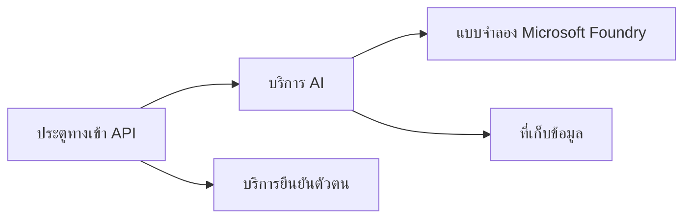

# บทที่ 8: รูปแบบการผลิต & องค์กร

**📚 คอร์ส**: [AZD สำหรับผู้เริ่มต้น](../../README.md) | **⏱️ ระยะเวลา**: 2-3 ชั่วโมง | **⭐ ความซับซ้อน**: ขั้นสูง

---

## ภาพรวม

บทนี้กล่าวถึงรูปแบบการนำไปใช้ในองค์กรที่พร้อมใช้งาน การเสริมความปลอดภัย การติดตามผล และการเพิ่มประสิทธิภาพต้นทุนสำหรับงาน AI ที่ใช้งานจริง

> ตรวจสอบความถูกต้องกับ `azd 1.27.1` ในเดือนกรกฎาคม 2026

## วัตถุประสงค์การเรียนรู้

เมื่อทำบทนี้เสร็จสิ้น คุณจะสามารถ:
- นำแอปพลิเคชันที่ทนทานหลายภูมิภาคมาใช้
- นำรูปแบบความปลอดภัยในองค์กรมาใช้
- กำหนดค่าการติดตามผลอย่างครบวงจร
- เพิ่มประสิทธิภาพต้นทุนในระดับใหญ่
- ตั้งค่าท่อ CI/CD ด้วย AZD

---

## 📚 เนื้อหา

| # | บทเรียน | คำอธิบาย | เวลา |
|---|--------|-------------|------|
| 1 | [แนวทางปฏิบัติ AI สำหรับการผลิต](production-ai-practices.md) | รูปแบบการนำไปใช้ในองค์กร | 90 นาที |

---

## 🚀 รายการตรวจสอบการผลิต

- [ ] นำไปใช้หลายภูมิภาคเพื่อความทนทาน
- [ ] ใช้ตัวตนที่จัดการสำหรับการตรวจสอบสิทธิ์ (ไม่มีคีย์)
- [ ] Application Insights สำหรับการติดตามผล
- [ ] ตั้งค่าการแจ้งเตือนและงบประมาณค่าใช้จ่าย
- [ ] เปิดใช้งานการสแกนความปลอดภัย
- [ ] การรวมท่อ CI/CD
- [ ] แผนการกู้คืนจากภัยพิบัติ

---

## 🏗️ รูปแบบสถาปัตยกรรม

### รูปแบบที่ 1: AI แบบไมโครเซอร์วิส



### รูปแบบที่ 2: AI ที่ขับเคลื่อนด้วยเหตุการณ์


---

## 🔐 แนวทางปฏิบัติที่ดีที่สุดด้านความปลอดภัย

```bicep
// Use managed identity
identity: {
  type: 'SystemAssigned'
}

// Private endpoints for AI services
properties: {
  publicNetworkAccess: 'Disabled'
  networkAcls: {
    defaultAction: 'Deny'
  }
}
```

---

## 💰 การเพิ่มประสิทธิภาพต้นทุน

| ยุทธศาสตร์ | การประหยัด |
|----------|---------|
| ปรับขนาดเป็นศูนย์ (Container Apps) | 60-80% |
| ใช้ระดับการบริโภคสำหรับการพัฒนา | 50-70% |
| การปรับขนาดตามตารางเวลา | 30-50% |
| ความจุที่สงวนไว้ | 20-40% |

```bash
# ตั้งค่าการแจ้งเตือนงบประมาณ
az consumption budget create \
  --budget-name "AI-Budget" \
  --amount 500 \
  --category Cost \
  --time-grain Monthly
```

---

## 📊 การตั้งค่าการติดตามผล

```bash
# สตรีมบันทึก
azd monitor --logs

# ตรวจสอบ Application Insights
azd monitor --overview

# ดูเมตริกส์
az monitor metrics list --resource <resource-id>
```

---

## 🔗 การนำทาง

| ทิศทาง | บทที่ |
|-----------|---------|
| **ก่อนหน้า** | [บทที่ 7: การแก้ไขปัญหา](../chapter-07-troubleshooting/README.md) |
| **จบคอร์ส** | [หน้าหลักคอร์ส](../../README.md) |

---

## 📖 แหล่งข้อมูลที่เกี่ยวข้อง

- [คู่มือเอเย่นต์ AI](../chapter-02-ai-development/agents.md)
- [Application Insights](../chapter-06-pre-deployment/application-insights.md)
- [โซลูชัน Multi-Agent](../chapter-05-multi-agent/README.md)
- [ตัวอย่างไมโครเซอร์วิส](../../examples/microservices/README.md)

---

<!-- CO-OP TRANSLATOR DISCLAIMER START -->
**ปฏิเสธความรับผิดชอบ**:
เอกสารนี้ได้รับการแปลโดยใช้บริการแปลภาษา AI [Co-op Translator](https://github.com/Azure/co-op-translator) ขณะที่เราพยายามให้ความถูกต้อง โปรดทราบว่าการแปลโดยอัตโนมัติอาจมีข้อผิดพลาดหรือความไม่ถูกต้อง เอกสารต้นฉบับในภาษาต้นทางควรถูกพิจารณาเป็นแหล่งข้อมูลที่เชื่อถือได้ สำหรับข้อมูลที่สำคัญ แนะนำให้ใช้การแปลโดยมนุษย์มืออาชีพ เราไม่รับผิดชอบต่อความเข้าใจผิดหรือการตีความที่ผิดพลาดที่เกิดขึ้นจากการใช้การแปลนี้
<!-- CO-OP TRANSLATOR DISCLAIMER END -->