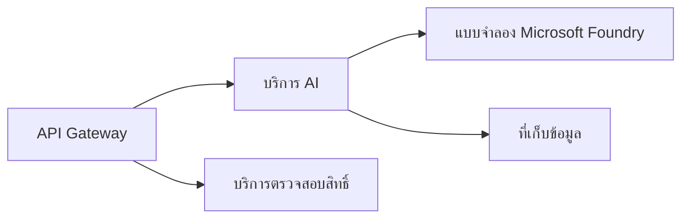
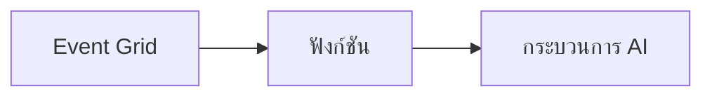

# บทที่ 8: รูปแบบการผลิตและองค์กร

**📚 หลักสูตร**: [AZD สำหรับผู้เริ่มต้น](../../README.md) | **⏱️ ระยะเวลา**: 2-3 ชั่วโมง | **⭐ ความซับซ้อน**: ขั้นสูง

---

## ภาพรวม

บทนี้ครอบคลุมรูปแบบการปรับใช้ที่พร้อมใช้งานในองค์กร การเสริมความปลอดภัย การตรวจสอบ และการเพิ่มประสิทธิภาพค่าใช้จ่ายสำหรับงาน AI ในการผลิต

## วัตถุประสงค์การเรียนรู้

เมื่อคุณเรียนจบบทนี้ คุณจะสามารถ:
- ปรับใช้แอปพลิเคชันที่ทนทานในหลายภูมิภาค
- นำรูปแบบความปลอดภัยในองค์กรมาใช้
- กำหนดค่าการตรวจสอบอย่างครอบคลุม
- ปรับค่าใช้จ่ายให้เหมาะสมในระดับใหญ่
- ตั้งค่า CI/CD pipeline ด้วย AZD

---

## 📚 บทเรียน

| # | บทเรียน | คำอธิบาย | เวลา |
|---|--------|-------------|------|
| 1 | [แนวปฏิบัติ AI ในการผลิต](production-ai-practices.md) | รูปแบบการปรับใช้ในองค์กร | 90 นาที |

---

## 🚀 รายการตรวจสอบการผลิต

- [ ] การปรับใช้ในหลายภูมิภาคเพื่อความทนทาน
- [ ] ตัวตนที่จัดการสำหรับการตรวจสอบสิทธิ์ (ไม่ใช้คีย์)
- [ ] Application Insights สำหรับการตรวจสอบ
- [ ] กำหนดงบประมาณค่าใช้จ่ายและการแจ้งเตือน
- [ ] เปิดใช้การสแกนความปลอดภัย
- [ ] การรวม CI/CD pipeline
- [ ] แผนการกู้คืนภัยพิบัติ

---

## 🏗️ รูปแบบสถาปัตยกรรม

### รูปแบบที่ 1: Microservices AI


### รูปแบบที่ 2: Event-Driven AI


---

## 🔐 แนวปฏิบัติความปลอดภัยที่ดีที่สุด

```bicep
// Use managed identity
identity: {
  type: 'SystemAssigned'
}

// Private endpoints for AI services
properties: {
  publicNetworkAccess: 'Disabled'
  networkAcls: {
    defaultAction: 'Deny'
  }
}
```

---

## 💰 การเพิ่มประสิทธิภาพค่าใช้จ่าย

| ยุทธศาสตร์ | การประหยัด |
|----------|---------|
| ปรับขนาดเป็นศูนย์ (Container Apps) | 60-80% |
| ใช้เกรดการใช้ตามการบริโภคสำหรับการพัฒนา | 50-70% |
| การปรับขนาดตามตารางเวลา | 30-50% |
| ความจุจองล่วงหน้า | 20-40% |

```bash
# ตั้งการแจ้งเตือนงบประมาณ
az consumption budget create \
  --budget-name "AI-Budget" \
  --amount 500 \
  --category Cost \
  --time-grain Monthly
```

---

## 📊 การตั้งค่าการตรวจสอบ

```bash
# สตรีมบันทึกเหตุการณ์
azd monitor --logs

# ตรวจสอบ Application Insights
azd monitor

# ดูเมตริกส์
az monitor metrics list --resource <resource-id>
```

---

## 🔗 การนำทาง

| ทิศทาง | บท |
|-----------|---------|
| **ก่อนหน้า** | [บทที่ 7: การแก้ไขปัญหา](../chapter-07-troubleshooting/README.md) |
| **จบบทเรียน** | [หน้าหลักของหลักสูตร](../../README.md) |

---

## 📖 แหล่งข้อมูลที่เกี่ยวข้อง

- [คู่มือ AI Agents](../chapter-02-ai-development/agents.md)
- [Application Insights](../chapter-06-pre-deployment/application-insights.md)
- [โซลูชัน Multi-Agent](../chapter-05-multi-agent/README.md)
- [ตัวอย่าง Microservices](../../examples/microservices/README.md)

---

<!-- CO-OP TRANSLATOR DISCLAIMER START -->
**ข้อจำกัดความรับผิดชอบ**:  
เอกสารนี้ได้รับการแปลโดยใช้บริการแปลภาษาอัตโนมัติ [Co-op Translator](https://github.com/Azure/co-op-translator) แม้เราจะพยายามอย่างดีที่สุดเพื่อความถูกต้อง แต่โปรดทราบว่าการแปลโดยอัตโนมัติอาจมีข้อผิดพลาดหรือความไม่ถูกต้อง เอกสารต้นฉบับในภาษาต้นทางควรถูกพิจารณาเป็นแหล่งที่มาที่เชื่อถือได้ สำหรับข้อมูลที่สำคัญ ขอแนะนำให้ใช้บริการแปลโดยมืออาชีพ เรายินดีรับผิดชอบต่อความเข้าใจผิดหรือการตีความผิดที่อาจเกิดขึ้นจากการใช้การแปลนี้ไม่ได้
<!-- CO-OP TRANSLATOR DISCLAIMER END -->