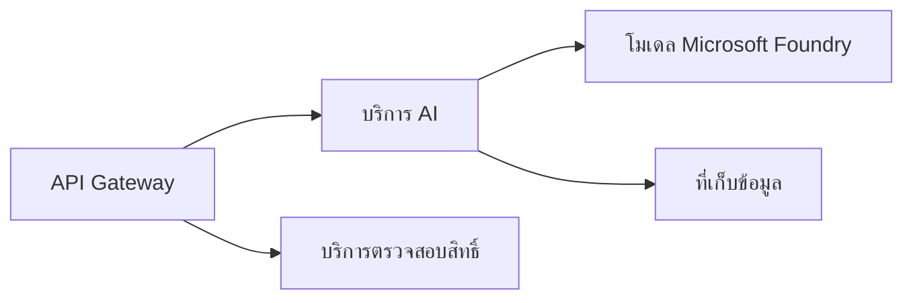

# Chapter 8: รูปแบบการผลิตและองค์กร

**📚 คอร์ส**: [AZD สำหรับผู้เริ่มต้น](../../README.md) | **⏱️ ระยะเวลา**: 2-3 ชั่วโมง | **⭐ ความซับซ้อน**: ขั้นสูง

---

## ภาพรวม

บทนี้ครอบคลุมรูปแบบการปรับใช้ที่พร้อมสำหรับองค์กร การเสริมความแข็งแกร่งด้านความปลอดภัย การตรวจสอบ และการเพิ่มประสิทธิภาพค่าใช้จ่ายสำหรับงาน AI ในการผลิต

> ได้รับการตรวจสอบแล้วกับ `azd 1.23.12` ในเดือนมีนาคม 2026

## วัตถุประสงค์การเรียนรู้

หลังจากจบบทนี้แล้ว คุณจะสามารถ:
- ปรับใช้แอปพลิเคชันที่ทนทานหลายภูมิภาค
- นำรูปแบบความปลอดภัยระดับองค์กรมาใช้
- กำหนดค่าการตรวจสอบอย่างครบถ้วน
- เพิ่มประสิทธิภาพค่าใช้จ่ายในระดับใหญ่
- ตั้งค่าท่อ CI/CD ด้วย AZD

---

## 📚 บทเรียน

| # | บทเรียน | รายละเอียด | เวลา |
|---|--------|-------------|------|
| 1 | [แนวทางปฏิบัติ AI สำหรับการผลิต](production-ai-practices.md) | รูปแบบการปรับใช้ในองค์กร | 90 นาที |

---

## 🚀 รายการตรวจสอบการผลิต

- [ ] การปรับใช้หลายภูมิภาคเพื่อความทนทาน
- [ ] ตัวตนที่จัดการสำหรับการตรวจสอบสิทธิ์ (ไม่มีคีย์)
- [ ] Application Insights สำหรับการตรวจสอบ
- [ ] ตั้งค่างบประมาณค่าใช้จ่ายและการแจ้งเตือน
- [ ] เปิดใช้งานการสแกนความปลอดภัย
- [ ] รวมท่อ CI/CD
- [ ] แผนการกู้คืนความเสียหาย

---

## 🏗️ รูปแบบสถาปัตยกรรม

### รูปแบบที่ 1: Microservices AI


### รูปแบบที่ 2: Event-Driven AI


---

## 🔐 แนวทางปฏิบัติที่ดีที่สุดด้านความปลอดภัย

```bicep
// Use managed identity
identity: {
  type: 'SystemAssigned'
}

// Private endpoints for AI services
properties: {
  publicNetworkAccess: 'Disabled'
  networkAcls: {
    defaultAction: 'Deny'
  }
}
```

---

## 💰 การเพิ่มประสิทธิภาพค่าใช้จ่าย

| กลยุทธ์ | การประหยัด |
|----------|-------------|
| ปรับขนาดเป็นศูนย์ (Container Apps) | 60-80% |
| ใช้ระดับการใช้งานตามจริงสำหรับการพัฒนา | 50-70% |
| การปรับขนาดตามตารางเวลา | 30-50% |
| ความจุที่จองไว้ | 20-40% |

```bash
# ตั้งค่าการแจ้งเตืองบประมาณ
az consumption budget create \
  --budget-name "AI-Budget" \
  --amount 500 \
  --category Cost \
  --time-grain Monthly
```

---

## 📊 การตั้งค่าการตรวจสอบ

```bash
# สตรีมบันทึก
azd monitor --logs

# ตรวจสอบ Application Insights
azd monitor --overview

# ดูเมตริกส์
az monitor metrics list --resource <resource-id>
```

---

## 🔗 การนำทาง

| ทิศทาง | บท |
|-----------|---------|
| **บทก่อนหน้า** | [บทที่ 7: การแก้ไขปัญหา](../chapter-07-troubleshooting/README.md) |
| **จบบทเรียน** | [หน้าแรกของคอร์ส](../../README.md) |

---

## 📖 แหล่งข้อมูลที่เกี่ยวข้อง

- [คู่มือ AI Agents](../chapter-02-ai-development/agents.md)
- [Application Insights](../chapter-06-pre-deployment/application-insights.md)
- [โซลูชัน Multi-Agent](../chapter-05-multi-agent/README.md)
- [ตัวอย่าง Microservices](../../examples/microservices/README.md)

---

<!-- CO-OP TRANSLATOR DISCLAIMER START -->
**ข้อจำกัดความรับผิดชอบ**:  
เอกสารฉบับนี้ได้รับการแปลโดยใช้บริการแปลภาษา AI [Co-op Translator](https://github.com/Azure/co-op-translator) แม้ว่าเราจะพยายามให้ความถูกต้องสูงสุด โปรดทราบว่าการแปลโดยอัตโนมัติอาจมีข้อผิดพลาดหรือความคลาดเคลื่อน เอกสารต้นฉบับในภาษาต้นฉบับควรถูกพิจารณาเป็นแหล่งข้อมูลที่เชื่อถือได้ สำหรับข้อมูลสำคัญ ขอแนะนำให้ใช้การแปลโดยมนุษย์มืออาชีพ เราไม่รับผิดชอบต่อความเข้าใจผิดหรือการตีความที่ผิดพลาดใด ๆ ที่เกิดจากการใช้การแปลนี้
<!-- CO-OP TRANSLATOR DISCLAIMER END -->