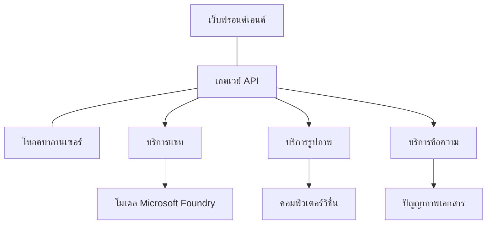

# แนวทางปฏิบัติที่ดีที่สุดสำหรับงาน AI ในการผลิตด้วย AZD

**การนำทางบทเรียน:**
- **📚 หน้าหลักคอร์ส**: [AZD สำหรับผู้เริ่มต้น](../../README.md)
- **📖 บทปัจจุบัน**: บทที่ 8 - รูปแบบการผลิตและองค์กร
- **⬅️ บทก่อนหน้า**: [บทที่ 7: การแก้ไขปัญหา](../chapter-07-troubleshooting/debugging.md)
- **⬅️ ที่เกี่ยวข้องเพิ่มเติม**: [ห้องปฏิบัติการ AI Workshop](ai-workshop-lab.md)
- **🎯 จบคอร์ส**: [AZD สำหรับผู้เริ่มต้น](../../README.md)

## ภาพรวม

คู่มือนี้ให้แนวทางปฏิบัติที่ดีที่สุดอย่างครอบคลุมสำหรับการปรับใช้ AI workloads ที่พร้อมสำหรับการผลิตโดยใช้ Azure Developer CLI (AZD) อิงจากความคิดเห็นจากชุมชน Microsoft Foundry Discord และการปรับใช้จริงของลูกค้า แนวทางเหล่านี้แก้ไขปัญหาที่พบบ่อยที่สุดในระบบ AI สำหรับการผลิต

## ความท้าทายหลักที่ได้รับการแก้ไข

จากผลการสำรวจในชุมชนของเรา ปัญหาที่นักพัฒนาพบบ่อยที่สุดคือ:

- **45%** พบปัญหาการปรับใช้ AI หลายบริการพร้อมกัน
- **38%** มีปัญหาการจัดการข้อมูลประจำตัวและความลับ  
- **35%** พบว่าการเตรียมพร้อมสำหรับผลิตและการปรับขนาดทำได้ยาก
- **32%** ต้องการกลยุทธ์เพิ่มประสิทธิภาพค่าใช้จ่ายที่ดีกว่า
- **29%** ต้องการการตรวจสอบและแก้ไขปัญหาที่ดีขึ้น

## รูปแบบสถาปัตยกรรมสำหรับ AI การผลิต

### รูปแบบที่ 1: สถาปัตยกรรม AI แบบไมโครเซอร์วิส

**เมื่อใดควรใช้**: แอป AI ที่ซับซ้อนพร้อมความสามารถหลายด้าน


**การใช้งาน AZD**:

```yaml
# azure.yaml
name: enterprise-ai-platform
services:
  web:
    project: ./web
    host: staticwebapp
  api-gateway:
    project: ./api-gateway
    host: containerapp
  chat-service:
    project: ./services/chat
    host: containerapp
  vision-service:
    project: ./services/vision
    host: containerapp
  text-service:
    project: ./services/text
    host: containerapp
```

### รูปแบบที่ 2: การประมวลผล AI ด้วยเหตุการณ์เป็นตัวขับเคลื่อน

**เมื่อใดควรใช้**: การประมวลผลแบบแบตช์, การวิเคราะห์เอกสาร, การทำงานแบบอะซิงค์

```bicep
// Event Hub for AI processing pipeline
resource eventHub 'Microsoft.EventHub/namespaces@2023-01-01-preview' = {
  name: eventHubNamespaceName
  location: location
  sku: {
    name: 'Standard'
    tier: 'Standard'
    capacity: 1
  }
}

// Service Bus for reliable message processing
resource serviceBus 'Microsoft.ServiceBus/namespaces@2022-10-01-preview' = {
  name: serviceBusNamespaceName
  location: location
  sku: {
    name: 'Premium'
    tier: 'Premium'
    capacity: 1
  }
}

// Function App for processing
resource functionApp 'Microsoft.Web/sites@2023-01-01' = {
  name: functionAppName
  location: location
  kind: 'functionapp,linux'
  properties: {
    siteConfig: {
      appSettings: [
        {
          name: 'FUNCTIONS_EXTENSION_VERSION'
          value: '~4'
        }
        {
          name: 'AZURE_OPENAI_ENDPOINT'
          value: '@Microsoft.KeyVault(VaultName=${keyVault.name};SecretName=openai-endpoint)'
        }
      ]
    }
  }
}
```

## การพิจารณาสุขภาพของ AI Agent

เมื่อแอปเว็บทั่วไปเกิดขัดข้อง อาการจะแจ่มชัด: หน้าเว็บไม่โหลด, API คืนค่าข้อผิดพลาด หรือ การปรับใช้ล้มเหลว แอป AI ที่ขับเคลื่อนด้วยปัญญาประดิษฐ์ก็สามารถล้มเหลวในวิธีเหล่านั้นได้—แต่ยังอาจมีพฤติกรรมผิดปกติที่ละเอียดอ่อนกว่าซึ่งไม่แสดงข้อความข้อผิดพลาดที่ชัดเจน

ส่วนนี้ช่วยคุณสร้างแบบจำลองความคิดในการตรวจสอบ AI workloads เพื่อให้คุณรู้ว่าจะต้องดูที่ไหนเมื่อสิ่งต่างๆ ดูไม่ถูกต้อง

### สุขภาพของ Agent แตกต่างจากสุขภาพของแอปแบบดั้งเดิมอย่างไร

แอปแบบดั้งเดิมจะใช้งานได้หรือไม่ใช้งานเลย ในขณะที่ AI agent อาจดูเหมือนทำงานแต่ให้ผลลัพธ์ที่ไม่ดี คิดถึงสุขภาพของ agent เป็นสองชั้น:

| ชั้น | สิ่งที่ต้องสังเกต | ดูที่ไหน |
|-------|-------------------|----------|
| **สุขภาพโครงสร้างพื้นฐาน** | บริการกำลังทำงานหรือไม่? มีการจัดสรรทรัพยากรหรือไม่? เข้าถึงจุดสิ้นสุดได้ไหม? | `azd monitor`, Azure Portal สุขภาพทรัพยากร, บันทึก container/app |
| **สุขภาพพฤติกรรม** | agent ตอบสนองได้ถูกต้องหรือไม่? การตอบกลับตรงเวลาไหม? เรียกใช้โมเดลถูกต้องหรือเปล่า? | Application Insights traces, เมตริกหน่วงเวลาเรียกโมเดล, บันทึกคุณภาพการตอบสนอง |

สุขภาพโครงสร้างพื้นฐานคือสิ่งที่คุ้นเคย—เหมือนกับแอป azd ทั่วไป สุขภาพพฤติกรรมเป็นชั้นใหม่ที่ AI workloads นำมา

### ดูที่ไหนเมื่อแอป AI ทำงานผิดปกติ

ถ้าแอป AI ของคุณไม่ให้ผลลัพธ์ตามที่คาดหวัง นี่คือรายการเช็คลิสต์แบบคิดภาพ:

1. **เริ่มจากพื้นฐาน**: แอปกำลังทำงานหรือไม่? สามารถเข้าถึงการขึ้นต่อได้หรือเปล่า? ตรวจสอบ `azd monitor` และสุขภาพทรัพยากรเหมือนกับแอปอื่นๆ
2. **ตรวจสอบการเชื่อมต่อโมเดล**: แอปของคุณเรียกใช้โมเดล AI สำเร็จหรือไม่? การเรียกโมเดลที่ล้มเหลวหรือล่าช้ามักเป็นสาเหตุหลักของปัญหาของแอป AI และจะแสดงในบันทึกของแอป
3. **ดูว่ามีข้อมูลอะไรส่งไปยังโมเดลบ้าง**: การตอบสนองของ AI ขึ้นอยู่กับข้อมูลนำเข้า (คำสั่งและบริบทที่นำเข้ามา) หากผลลัพธ์ผิด ปกติแล้วข้อมูลนำเข้าก็ผิด ตรวจสอบดูว่าแอปของคุณส่งข้อมูลถูกต้องไปยังโมเดลหรือไม่
4. **ตรวจสอบเวลาหน่วงการตอบกลับ**: การเรียกโมเดล AI ช้ากว่าการเรียก API ทั่วไป หากแอปรู้สึกช้า ตรวจสอบเวลาตอบสนองโมเดลที่เพิ่มขึ้น—ซึ่งอาจแสดงถึงการจำกัดความสามารถ, ขีดจำกัดความจุ หรือ ความแออัดในระดับภูมิภาค
5. **สังเกตสัญญาณค่าใช้จ่าย**: การเพิ่มขึ้นอย่างไม่คาดคิดของการใช้โทเค็นหรือการเรียก API อาจบ่งชี้ถึงลูป, คำสั่งที่ตั้งค่าผิดพลาด หรือ การลองซ้ำมากเกินไป

คุณไม่จำเป็นต้องเชี่ยวชาญเครื่องมือสังเกตการณ์ทันที สิ่งสำคัญคือแอป AI มีชั้นพฤติกรรมเพิ่มเติมให้ตรวจสอบ และ `azd monitor` ที่ติดตั้งใน AZD จะเป็นจุดเริ่มต้นที่ดีสำหรับการตรวจสอบทั้งสองชั้นนี้

---

## แนวทางปฏิบัติด้านความปลอดภัยที่ดีที่สุด

### 1. รูปแบบความปลอดภัยแบบ Zero-Trust

**กลยุทธ์การใช้งาน**:
- ไม่มีการสื่อสารบริการต่อบริการโดยไม่ผ่านการพิสูจน์ตัวตน
- การเรียก API ทั้งหมดใช้ managed identities
- การแยกเครือข่ายด้วย private endpoints
- การควบคุมการเข้าถึงแบบน้อยที่สุด

```bicep
// Managed Identity for each service
resource chatServiceIdentity 'Microsoft.ManagedIdentity/userAssignedIdentities@2023-01-31' = {
  name: 'chat-service-identity'
  location: location
}

// Role assignments with minimal permissions
resource openAIUserRole 'Microsoft.Authorization/roleAssignments@2022-04-01' = {
  scope: openAIAccount
  name: guid(openAIAccount.id, chatServiceIdentity.id, openAIUserRoleDefinitionId)
  properties: {
    roleDefinitionId: subscriptionResourceId('Microsoft.Authorization/roleDefinitions', '5e0bd9bd-7b93-4f28-af87-19fc36ad61bd')
    principalId: chatServiceIdentity.properties.principalId
    principalType: 'ServicePrincipal'
  }
}
```

### 2. การจัดการความลับอย่างปลอดภัย

**รูปแบบการเชื่อมต่อกับ Key Vault**:

```bicep
// Key Vault with proper access policies
resource keyVault 'Microsoft.KeyVault/vaults@2023-02-01' = {
  name: keyVaultName
  location: location
  properties: {
    tenantId: tenant().tenantId
    sku: {
      family: 'A'
      name: 'premium'  // Use premium for production
    }
    enableRbacAuthorization: true  // Use RBAC instead of access policies
    enablePurgeProtection: true    // Prevent accidental deletion
    enableSoftDelete: true
    softDeleteRetentionInDays: 90
  }
}

// Store all AI service credentials
resource openAIKeySecret 'Microsoft.KeyVault/vaults/secrets@2023-02-01' = {
  parent: keyVault
  name: 'openai-api-key'
  properties: {
    value: openAIAccount.listKeys().key1
    attributes: {
      enabled: true
    }
  }
}
```

### 3. ความปลอดภัยเครือข่าย

**การกำหนดค่า Private Endpoint**:

```bicep
// Virtual Network for AI services
resource virtualNetwork 'Microsoft.Network/virtualNetworks@2023-04-01' = {
  name: vnetName
  location: location
  properties: {
    addressSpace: {
      addressPrefixes: ['10.0.0.0/16']
    }
    subnets: [
      {
        name: 'ai-services-subnet'
        properties: {
          addressPrefix: '10.0.1.0/24'
          privateEndpointNetworkPolicies: 'Disabled'
        }
      }
      {
        name: 'app-services-subnet'
        properties: {
          addressPrefix: '10.0.2.0/24'
          delegations: [
            {
              name: 'Microsoft.Web/serverFarms'
              properties: {
                serviceName: 'Microsoft.Web/serverFarms'
              }
            }
          ]
        }
      }
    ]
  }
}

// Private endpoints for all AI services
resource openAIPrivateEndpoint 'Microsoft.Network/privateEndpoints@2023-04-01' = {
  name: '${openAIAccountName}-pe'
  location: location
  properties: {
    subnet: {
      id: virtualNetwork.properties.subnets[0].id
    }
    privateLinkServiceConnections: [
      {
        name: 'openai-connection'
        properties: {
          privateLinkServiceId: openAIAccount.id
          groupIds: ['account']
        }
      }
    ]
  }
}
```

## ประสิทธิภาพและการปรับขนาด

### 1. กลยุทธ์การปรับขนาดอัตโนมัติ

**การปรับขนาดอัตโนมัติของ Container Apps**:

```bicep
resource containerApp 'Microsoft.App/containerApps@2023-05-01' = {
  name: containerAppName
  location: location
  properties: {
    configuration: {
      ingress: {
        external: true
        targetPort: 8000
        transport: 'http'
      }
    }
    template: {
      scale: {
        minReplicas: 2  // Always have 2 instances minimum
        maxReplicas: 50 // Scale up to 50 for high load
        rules: [
          {
            name: 'http-scaling'
            http: {
              metadata: {
                concurrentRequests: '20'  // Scale when >20 concurrent requests
              }
            }
          }
          {
            name: 'cpu-scaling'
            custom: {
              type: 'cpu'
              metadata: {
                type: 'Utilization'
                value: '70'  // Scale when CPU >70%
              }
            }
          }
        ]
      }
    }
  }
}
```

### 2. กลยุทธ์การแคช

**Redis Cache สำหรับการตอบสนอง AI**:

```bicep
// Redis Premium for production workloads
resource redisCache 'Microsoft.Cache/redis@2023-04-01' = {
  name: redisCacheName
  location: location
  properties: {
    sku: {
      name: 'Premium'
      family: 'P'
      capacity: 1
    }
    enableNonSslPort: false
    minimumTlsVersion: '1.2'
    redisConfiguration: {
      'maxmemory-policy': 'allkeys-lru'
    }
    // Enable clustering for high availability
    redisVersion: '6.0'
    shardCount: 2
  }
}

// Cache configuration in application
var cacheConnectionString = '${redisCache.properties.hostName}:6380,password=${redisCache.listKeys().primaryKey},ssl=True,abortConnect=False'
```

### 3. การจัดสมดุลโหลดและการจัดการทราฟฟิก

**Application Gateway พร้อม WAF**:

```bicep
// Application Gateway with Web Application Firewall
resource applicationGateway 'Microsoft.Network/applicationGateways@2023-04-01' = {
  name: appGatewayName
  location: location
  properties: {
    sku: {
      name: 'WAF_v2'
      tier: 'WAF_v2'
      capacity: 2
    }
    webApplicationFirewallConfiguration: {
      enabled: true
      firewallMode: 'Prevention'
      ruleSetType: 'OWASP'
      ruleSetVersion: '3.2'
    }
    // Backend pools for AI services
    backendAddressPools: [
      {
        name: 'ai-services-pool'
        properties: {
          backendAddresses: [
            {
              fqdn: '${containerApp.properties.configuration.ingress.fqdn}'
            }
          ]
        }
      }
    ]
  }
}
```

## 💰 การเพิ่มประสิทธิภาพค่าใช้จ่าย

### 1. การกำหนดขนาดทรัพยากรให้เหมาะสม

**การกำหนดค่าสภาพแวดล้อมเฉพาะ**:

```bash
# สภาพแวดล้อมการพัฒนา
azd env new development
azd env set AZURE_OPENAI_SKU "S0"
azd env set AZURE_OPENAI_CAPACITY 10
azd env set AZURE_SEARCH_SKU "basic"
azd env set CONTAINER_CPU 0.5
azd env set CONTAINER_MEMORY 1.0

# สภาพแวดล้อมการผลิต
azd env new production
azd env set AZURE_OPENAI_SKU "S0"
azd env set AZURE_OPENAI_CAPACITY 100
azd env set AZURE_SEARCH_SKU "standard"
azd env set CONTAINER_CPU 2.0
azd env set CONTAINER_MEMORY 4.0
```

### 2. การตรวจสอบและงบประมาณค่าใช้จ่าย

```bicep
// Cost management and budgets
resource budget 'Microsoft.Consumption/budgets@2023-05-01' = {
  name: 'ai-workload-budget'
  properties: {
    timePeriod: {
      startDate: '2024-01-01'
      endDate: '2024-12-31'
    }
    timeGrain: 'Monthly'
    amount: 2000  // $2000 monthly budget
    category: 'Cost'
    notifications: {
      warning: {
        enabled: true
        operator: 'GreaterThan'
        threshold: 80
        contactEmails: [
          'finance@company.com'
          'engineering@company.com'
        ]
        contactRoles: [
          'Owner'
          'Contributor'
        ]
      }
      critical: {
        enabled: true
        operator: 'GreaterThan'
        threshold: 95
        contactEmails: [
          'cto@company.com'
        ]
      }
    }
  }
}
```

### 3. การเพิ่มประสิทธิภาพการใช้โทเค็น

**การจัดการค่าใช้จ่าย OpenAI**:

```typescript
// การเพิ่มประสิทธิภาพโทเค็นในระดับแอปพลิเคชัน
class TokenOptimizer {
  private readonly maxTokens = 4000;
  private readonly reserveTokens = 500;
  
  optimizePrompt(userInput: string, context: string): string {
    const availableTokens = this.maxTokens - this.reserveTokens;
    const estimatedTokens = this.estimateTokens(userInput + context);
    
    if (estimatedTokens > availableTokens) {
      // ตัดบริบท ไม่ใช่ข้อมูลนำเข้าของผู้ใช้
      context = this.truncateContext(context, availableTokens - this.estimateTokens(userInput));
    }
    
    return `${context}\n\nUser: ${userInput}`;
  }
  
  private estimateTokens(text: string): number {
    // ประมาณคร่าวๆ: 1 โทเค็น ≈ 4 ตัวอักษร
    return Math.ceil(text.length / 4);
  }
}
```

## การตรวจสอบและการสังเกตการณ์

### 1. Application Insights อย่างครอบคลุม

```bicep
// Application Insights with advanced features
resource applicationInsights 'Microsoft.Insights/components@2020-02-02' = {
  name: applicationInsightsName
  location: location
  kind: 'web'
  properties: {
    Application_Type: 'web'
    WorkspaceResourceId: logAnalyticsWorkspace.id
    SamplingPercentage: 100  // Full sampling for AI apps
    DisableIpMasking: false  // Enable for security
  }
}

// Custom metrics for AI operations
resource aiMetricAlerts 'Microsoft.Insights/metricAlerts@2018-03-01' = {
  name: 'ai-high-error-rate'
  location: 'global'
  properties: {
    description: 'Alert when AI service error rate is high'
    severity: 2
    enabled: true
    scopes: [
      applicationInsights.id
    ]
    evaluationFrequency: 'PT1M'
    windowSize: 'PT5M'
    criteria: {
      'odata.type': 'Microsoft.Azure.Monitor.SingleResourceMultipleMetricCriteria'
      allOf: [
        {
          name: 'high-error-rate'
          metricName: 'requests/failed'
          operator: 'GreaterThan'
          threshold: 10
          timeAggregation: 'Count'
        }
      ]
    }
  }
}
```

### 2. การตรวจสอบเฉพาะ AI

**แดชบอร์ดที่สร้างขึ้นเองสำหรับเมตริก AI**:

```json
// Dashboard configuration for AI workloads
{
  "dashboard": {
    "name": "AI Application Monitoring",
    "tiles": [
      {
        "name": "OpenAI Request Volume",
        "query": "requests | where name contains 'openai' | summarize count() by bin(timestamp, 5m)"
      },
      {
        "name": "AI Response Latency",
        "query": "requests | where name contains 'openai' | summarize avg(duration) by bin(timestamp, 5m)"
      },
      {
        "name": "Token Usage",
        "query": "customMetrics | where name == 'openai_tokens_used' | summarize sum(value) by bin(timestamp, 1h)"
      },
      {
        "name": "Cost per Hour",
        "query": "customMetrics | where name == 'openai_cost' | summarize sum(value) by bin(timestamp, 1h)"
      }
    ]
  }
}
```

### 3. การตรวจสุขภาพและการติดตามเวลาทำงาน

```bicep
// Application Insights availability tests
resource availabilityTest 'Microsoft.Insights/webtests@2022-06-15' = {
  name: 'ai-app-availability-test'
  location: location
  tags: {
    'hidden-link:${applicationInsights.id}': 'Resource'
  }
  properties: {
    SyntheticMonitorId: 'ai-app-availability-test'
    Name: 'AI Application Availability Test'
    Description: 'Tests AI application endpoints'
    Enabled: true
    Frequency: 300  // 5 minutes
    Timeout: 120    // 2 minutes
    Kind: 'ping'
    Locations: [
      {
        Id: 'us-east-2-azr'
      }
      {
        Id: 'us-west-2-azr'
      }
    ]
    Configuration: {
      WebTest: '''
        <WebTest Name="AI Health Check" 
                 Id="8d2de8d2-a2b0-4c2e-9a0d-8f9c9a0b8c8d" 
                 Enabled="True" 
                 CssProjectStructure="" 
                 CssIteration="" 
                 Timeout="120" 
                 WorkItemIds="" 
                 xmlns="http://microsoft.com/schemas/VisualStudio/TeamTest/2010" 
                 Description="" 
                 CredentialUserName="" 
                 CredentialPassword="" 
                 PreAuthenticate="True" 
                 Proxy="default" 
                 StopOnError="False" 
                 RecordedResultFile="" 
                 ResultsLocale="">
          <Items>
            <Request Method="GET" 
                     Guid="a5f10126-e4cd-570d-961c-cea43999a200" 
                     Version="1.1" 
                     Url="${webApp.properties.defaultHostName}/health" 
                     ThinkTime="0" 
                     Timeout="120" 
                     ParseDependentRequests="True" 
                     FollowRedirects="True" 
                     RecordResult="True" 
                     Cache="False" 
                     ResponseTimeGoal="0" 
                     Encoding="utf-8" 
                     ExpectedHttpStatusCode="200" 
                     ExpectedResponseUrl="" 
                     ReportingName="" 
                     IgnoreHttpStatusCode="False" />
          </Items>
        </WebTest>
      '''
    }
  }
}
```

## การกู้ภัยและความพร้อมใช้งานสูง

### 1. การปรับใช้หลายภูมิภาค

```yaml
# azure.yaml - Multi-region configuration
name: ai-app-multiregion
services:
  api-primary:
    project: ./api
    host: containerapp
    env:
      - AZURE_REGION=eastus
  api-secondary:
    project: ./api
    host: containerapp
    env:
      - AZURE_REGION=westus2
```

```bicep
// Traffic Manager for global load balancing
resource trafficManager 'Microsoft.Network/trafficManagerProfiles@2022-04-01' = {
  name: trafficManagerProfileName
  location: 'global'
  properties: {
    profileStatus: 'Enabled'
    trafficRoutingMethod: 'Priority'
    dnsConfig: {
      relativeName: trafficManagerProfileName
      ttl: 30
    }
    monitorConfig: {
      protocol: 'HTTPS'
      port: 443
      path: '/health'
      intervalInSeconds: 30
      toleratedNumberOfFailures: 3
      timeoutInSeconds: 10
    }
    endpoints: [
      {
        name: 'primary-endpoint'
        type: 'Microsoft.Network/trafficManagerProfiles/azureEndpoints'
        properties: {
          targetResourceId: primaryAppService.id
          endpointStatus: 'Enabled'
          priority: 1
        }
      }
      {
        name: 'secondary-endpoint'
        type: 'Microsoft.Network/trafficManagerProfiles/azureEndpoints'
        properties: {
          targetResourceId: secondaryAppService.id
          endpointStatus: 'Enabled'
          priority: 2
        }
      }
    ]
  }
}
```

### 2. การสำรองข้อมูลและกู้คืน

```bicep
// Backup configuration for critical data
resource backupVault 'Microsoft.DataProtection/backupVaults@2023-05-01' = {
  name: backupVaultName
  location: location
  identity: {
    type: 'SystemAssigned'
  }
  properties: {
    storageSettings: [
      {
        datastoreType: 'VaultStore'
        type: 'LocallyRedundant'
      }
    ]
  }
}

// Backup policy for AI models and data
resource backupPolicy 'Microsoft.DataProtection/backupVaults/backupPolicies@2023-05-01' = {
  parent: backupVault
  name: 'ai-data-backup-policy'
  properties: {
    policyRules: [
      {
        backupParameters: {
          backupType: 'Full'
          objectType: 'AzureBackupParams'
        }
        trigger: {
          schedule: {
            repeatingTimeIntervals: [
              'R/2024-01-01T02:00:00+00:00/P1D'  // Daily at 2 AM
            ]
          }
          objectType: 'ScheduleBasedTriggerContext'
        }
        dataStore: {
          datastoreType: 'VaultStore'
          objectType: 'DataStoreInfoBase'
        }
        name: 'BackupDaily'
        objectType: 'AzureBackupRule'
      }
    ]
  }
}
```

## การรวม DevOps และ CI/CD

### 1. เวิร์กโฟลว์ GitHub Actions

```yaml
# .github/workflows/deploy-ai-app.yml
name: Deploy AI Application

on:
  push:
    branches: [main]
  pull_request:
    branches: [main]

jobs:
  test:
    runs-on: ubuntu-latest
    steps:
      - uses: actions/checkout@v4
      
      - name: Setup Python
        uses: actions/setup-python@v4
        with:
          python-version: '3.11'
          
      - name: Install dependencies
        run: |
          pip install -r requirements.txt
          pip install pytest
          
      - name: Run tests
        run: pytest tests/
        
      - name: AI Safety Tests
        run: |
          python scripts/test_ai_safety.py
          python scripts/validate_prompts.py

  deploy-staging:
    needs: test
    if: github.event_name == 'pull_request'
    runs-on: ubuntu-latest
    steps:
      - uses: actions/checkout@v4
      
      - name: Setup AZD
        uses: Azure/setup-azd@v2
        
      - name: Login to Azure
        uses: azure/login@v1
        with:
          creds: ${{ secrets.AZURE_CREDENTIALS }}
          
      - name: Deploy to Staging
        run: |
          azd env select staging
          azd deploy

  deploy-production:
    needs: test
    if: github.ref == 'refs/heads/main'
    runs-on: ubuntu-latest
    steps:
      - uses: actions/checkout@v4
      
      - name: Setup AZD
        uses: Azure/setup-azd@v2
        
      - name: Login to Azure
        uses: azure/login@v1
        with:
          creds: ${{ secrets.AZURE_CREDENTIALS }}
          
      - name: Deploy to Production
        run: |
          azd env select production
          azd deploy
          
      - name: Run Production Health Checks
        run: |
          python scripts/health_check.py --env production
```

### 2. การตรวจสอบโครงสร้างพื้นฐาน

```bash
# scripts/validate_infrastructure.sh
#!/bin/bash

echo "Validating AI infrastructure deployment..."

# ตรวจสอบว่าบริการทั้งหมดที่จำเป็นกำลังทำงานอยู่หรือไม่
services=("openai" "search" "storage" "keyvault")
for service in "${services[@]}"; do
    echo "Checking $service..."
    if ! az resource list --resource-type "Microsoft.CognitiveServices/accounts" --query "[?contains(name, '$service')]" -o tsv; then
        echo "ERROR: $service not found"
        exit 1
    fi
done

# ตรวจสอบการติดตั้งโมเดล OpenAI
echo "Validating OpenAI model deployments..."
models=$(az cognitiveservices account deployment list --name $AZURE_OPENAI_NAME --resource-group $AZURE_RESOURCE_GROUP --query "[].name" -o tsv)
if [[ ! $models == *"gpt-4.1-mini"* ]]; then
  echo "ERROR: Required model gpt-4.1-mini not deployed"
    exit 1
fi

# ทดสอบการเชื่อมต่อบริการ AI
echo "Testing AI service connectivity..."
python scripts/test_connectivity.py

echo "Infrastructure validation completed successfully!"
```

## รายการตรวจสอบความพร้อมสำหรับการผลิต

### ความปลอดภัย ✅
- [ ] บริการทั้งหมดใช้ managed identities
- [ ] เก็บความลับใน Key Vault
- [ ] กำหนดค่า private endpoints
- [ ] ใช้ Network security groups
- [ ] RBAC ด้วยสิทธิ์น้อยที่สุด
- [ ] เปิดใช้งาน WAF บนจุดสิ้นสุดสาธารณะ

### ประสิทธิภาพ ✅
- [ ] กำหนดค่าการปรับขนาดอัตโนมัติ
- [ ] ใช้แคช
- [ ] ตั้งค่าการจัดสมดุลโหลด
- [ ] ใช้ CDN สำหรับเนื้อหาคงที่
- [ ] การรวบรวมเชื่อมต่อฐานข้อมูล
- [ ] เพิ่มประสิทธิภาพการใช้โทเค็น

### การตรวจสอบ ✅
- [ ] กำหนดค่า Application Insights
- [ ] กำหนดเมตริกที่กำหนดเอง
- [ ] ตั้งค่ากฎแจ้งเตือน
- [ ] สร้างแดชบอร์ด
- [ ] ใช้งานการตรวจสุขภาพ
- [ ] นโยบายเก็บล็อก

### ความน่าเชื่อถือ ✅
- [ ] ปรับใช้หลายภูมิภาค
- [ ] แผนสำรองและกู้คืน
- [ ] ใช้งาน circuit breakers
- [ ] กำหนดนโยบายลองซ้ำ
- [ ] การลดทอนอย่างราบรื่น
- [ ] จุดสิ้นสุดตรวจสุขภาพ

### การจัดการค่าใช้จ่าย ✅
- [ ] ตั้งค่าแจ้งเตือนงบประมาณ
- [ ] กำหนดขนาดทรัพยากรให้เหมาะสม
- [ ] ใช้ส่วนลดสำหรับการพัฒนา/ทดสอบ
- [ ] ซื้อ reserved instances
- [ ] แดชบอร์ดติดตามค่าใช้จ่าย
- [ ] ทบทวนค่าใช้จ่ายเป็นประจำ

### การปฏิบัติตามข้อกำหนด ✅
- [ ] ปฏิบัติตามข้อกำหนดที่ตั้งข้อมูล
- [ ] เปิดใช้งาน audit logging
- [ ] ใช้นโยบายการปฏิบัติตามข้อกำหนด
- [ ] บังคับใช้ baseline ด้านความปลอดภัย
- [ ] ประเมินความปลอดภัยเป็นประจำ
- [ ] มีแผนตอบสนองเหตุการณ์

## ตัวชี้วัดประสิทธิภาพ

### เมตริกการผลิตทั่วไป

| เมตริก | เป้าหมาย | การตรวจสอบ |
|--------|----------|-------------|
| **เวลาตอบสนอง** | < 2 วินาที | Application Insights |
| **ความพร้อมใช้งาน** | 99.9% | การตรวจสอบเวลาทำงาน |
| **อัตราข้อผิดพลาด** | < 0.1% | บันทึกแอป |
| **การใช้โทเค็น** | < $500/เดือน | การจัดการค่าใช้จ่าย |
| **ผู้ใช้พร้อมกัน** | 1000+ | การทดสอบโหลด |
| **เวลาการกู้คืน** | < 1 ชั่วโมง | การทดสอบกู้ภัย |

### การทดสอบโหลด

```bash
# สคริปต์ทดสอบโหลดสำหรับแอปพลิเคชัน AI
python scripts/load_test.py \
  --endpoint https://your-ai-app.azurewebsites.net \
  --concurrent-users 100 \
  --duration 300 \
  --ramp-up 60
```

## 🤝 แนวทางปฏิบัติที่ดีที่สุดของชุมชน

อ้างอิงจากความคิดเห็นของชุมชน Microsoft Foundry Discord:

### คำแนะนำหลักจากชุมชน:

1. **เริ่มทีละน้อย ขยายอย่างค่อยเป็นค่อยไป**: เริ่มด้วย SKU พื้นฐานและขยายตามการใช้งานจริง
2. **ตรวจสอบทุกอย่าง**: ตั้งค่าการตรวจสอบอย่างครอบคลุมตั้งแต่วันแรก
3. **ตั้งระบบความปลอดภัยอัตโนมัติ**: ใช้โครงสร้างพื้นฐานเป็นโค้ดเพื่อความปลอดภัยที่สอดคล้อง
4. **ทดสอบอย่างรัดกุม**: รวมการทดสอบเฉพาะ AI ใน pipeline ของคุณ
5. **วางแผนสำหรับค่าใช้จ่าย**: ตรวจสอบการใช้โทเค็นและตั้งแจ้งเตือนงบประมาณตั้งแต่ต้น

### จุดหลีกเลี่ยงที่พบบ่อย:

- ❌ การเขียน API keys ลงในโค้ดโดยตรง
- ❌ ไม่ตั้งค่าการตรวจสอบอย่างเหมาะสม
- ❌ มองข้ามการเพิ่มประสิทธิภาพค่าใช้จ่าย
- ❌ ไม่ทดสอบสถานการณ์ล้มเหลว
- ❌ ปรับใช้โดยไม่มีการตรวจสุขภาพ

## คำสั่ง AZD AI CLI และ Extensions

AZD มีชุดคำสั่งและส่วนขยายเฉพาะ AI ที่กำลังขยายเพิ่มขึ้นซึ่งช่วยทำให้งาน AI สำหรับการผลิตง่ายขึ้น เครื่องมือเหล่านี้เชื่อมช่องว่างระหว่างการพัฒนาในเครื่องกับการปรับใช้ในสภาพแวดล้อมจริง

### ส่วนขยาย AZD สำหรับ AI

AZD ใช้ระบบส่วนขยายเพื่อเพิ่มความสามารถเฉพาะ AI ติดตั้งและจัดการส่วนขยายด้วย:

```bash
# แสดงรายการส่วนขยายทั้งหมดที่มีอยู่ (รวมถึง AI)
azd extension list

# ตรวจสอบรายละเอียดส่วนขยายที่ติดตั้ง
azd extension show azure.ai.agents

# ติดตั้งส่วนขยายตัวแทน Foundry
azd extension install azure.ai.agents

# ติดตั้งส่วนขยายการปรับแต่งขั้นสูง
azd extension install azure.ai.finetune

# ติดตั้งส่วนขยายโมเดลที่กำหนดเอง
azd extension install azure.ai.models

# อัปเกรดส่วนขยายที่ติดตั้งทั้งหมด
azd extension upgrade --all
```

**ส่วนขยาย AI ที่มีให้:**

| ส่วนขยาย | จุดประสงค์ | สถานะ |
|-----------|---------|--------|
| `azure.ai.agents` | การจัดการบริการ Foundry Agent | รุ่นพรีวิว |
| `azure.ai.finetune` | การปรับแต่งโมเดล Foundry | รุ่นพรีวิว |
| `azure.ai.models` | โมเดลที่กำหนดเองใน Foundry | รุ่นพรีวิว |
| `azure.coding-agent` | การตั้งค่า coding agent | พร้อมใช้งาน |

### การเริ่มต้นโปรเจกต์ Agent ด้วย `azd ai agent init`

คำสั่ง `azd ai agent init` สร้างโครงสร้างโปรเจกต์ AI agent พร้อมสำหรับการผลิตที่ผสานกับบริการ Microsoft Foundry Agent:

```bash
# เริ่มต้นโปรเจกต์ตัวแทนใหม่จากแผนผังตัวแทน
azd ai agent init -m <manifest-path-or-uri>

# เริ่มต้นและกำหนดเป้าหมายโปรเจกต์ Foundry เฉพาะ
azd ai agent init -m agent-manifest.yaml --project-id <foundry-project-id>

# เริ่มต้นด้วยไดเรกทอรีต้นทางที่กำหนดเอง
azd ai agent init -m agent-manifest.yaml --src ./agents/my-agent

# กำหนดเป้าหมาย Container Apps เป็นโฮสต์
azd ai agent init -m agent-manifest.yaml --host containerapp
```

**แฟลกสำคัญ:**

| แฟลก | คำอธิบาย |
|------|-------------|
| `-m, --manifest` | เส้นทางหรือ URI ไปยัง agent manifest ที่จะเพิ่มในโปรเจกต์ของคุณ |
| `-p, --project-id` | Microsoft Foundry Project ID ที่มีอยู่สำหรับสภาพแวดล้อม azd ของคุณ |
| `-s, --src` | ไดเรกทอรีสำหรับดาวน์โหลดคำนิยาม agent (ค่าเริ่มต้นคือ `src/<agent-id>`) |
| `--host` | กำหนด host เอง (เช่น `containerapp`) |
| `-e, --environment` | สภาพแวดล้อม azd ที่จะใช้ |

**เคล็ดลับสำหรับการใช้งานจริง**: ใช้ `--project-id` เพื่อเชื่อมต่อโดยตรงกับโครงการ Foundry ที่มีอยู่ รักษาโค้ด agent และทรัพยากรในคลาวด์ของคุณเชื่อมโยงตั้งแต่เริ่มต้น

### โปรโตคอลบริบทโมเดล (MCP) กับ `azd mcp`

AZD มีการรองรับ MCP server ในตัว (Alpha) ช่วยให้ agent AI และเครื่องมือโต้ตอบกับทรัพยากร Azure ของคุณผ่านโปรโตคอลมาตรฐาน:

```bash
# เริ่มเซิร์ฟเวอร์ MCP สำหรับโครงการของคุณ
azd mcp start

# ตรวจสอบกฎความยินยอม Copilot ปัจจุบันสำหรับการรันเครื่องมือ
azd copilot consent list
```

เซิร์ฟเวอร์ MCP เปิดเผยบริบทโปรเจกต์ azd ของคุณ—สภาพแวดล้อม บริการ และทรัพยากร Azure—ให้กับเครื่องมือพัฒนาที่ขับเคลื่อนด้วย AI ซึ่งรองรับ:

- **การปรับใช้ด้วย AI**: ให้ coding agents สอบถามสถานะโปรเจกต์และกระตุ้นการปรับใช้
- **การค้นหาทรัพยากร**: เครื่องมือ AI สามารถค้นหาทรัพยากร Azure ที่โปรเจกต์ใช้
- **การจัดการสภาพแวดล้อม**: agents สามารถสลับระหว่างสภาพแวดล้อม dev/staging/production

### การสร้างโครงสร้างพื้นฐานด้วย `azd infra generate`

สำหรับงาน AI การผลิต คุณสามารถสร้างและปรับแต่ง Infrastructure as Code แทนการพึ่งพาการจัดสรรอัตโนมัติ:

```bash
# สร้างไฟล์ Bicep/Terraform จากคำนิยามโปรเจกต์ของคุณ
azd infra generate
```

คำสั่งนี้เขียน IaC ลงดิสก์ เพื่อให้คุณ:
- ตรวจสอบและตรวจสอบโครงสร้างพื้นฐานก่อนปรับใช้
- เพิ่มนโยบายความปลอดภัยกำหนดเอง (กฎเครือข่าย, private endpoints)
- ผสานกับกระบวนการตรวจสอบ IaC ที่มีอยู่
- ควบคุมเวอร์ชันการเปลี่ยนแปลงโครงสร้างพื้นฐานแยกต่างหากจากโค้ดแอป

### Production Lifecycle Hooks

AZD hooks ช่วยให้คุณแทรกตรรกะกำหนดเองในทุกขั้นตอนของวงจรชีวิตการปรับใช้—สิ่งจำเป็นสำหรับงาน AI การผลิต:

```yaml
# azure.yaml - Production hooks example
name: ai-production-app
hooks:
  preprovision:
    shell: sh
    run: scripts/validate-quotas.sh    # Check AI model quota before provisioning
  postprovision:
    shell: sh
    run: scripts/configure-networking.sh  # Set up private endpoints
  predeploy:
    shell: sh
    run: scripts/run-ai-safety-tests.sh  # Run prompt safety checks
  postdeploy:
    shell: sh
    run: scripts/smoke-test.sh           # Verify agent responses post-deploy
services:
  agent-api:
    project: ./src/agent
    host: containerapp
    hooks:
      predeploy:
        shell: sh
        run: scripts/validate-model-access.sh  # Per-service hook
```

```bash
# เรียกใช้ hook เฉพาะด้วยตนเองในระหว่างการพัฒนา
azd hooks run predeploy
```

**hooks ที่แนะนำสำหรับงาน AI ในการผลิต:**

| Hook | กรณีใช้งาน |
|------|-------------|
| `preprovision` | ตรวจสอบโควต้าการสมัครสมาชิกสำหรับความจุโมเดล AI |
| `postprovision` | กำหนดค่า private endpoints, ปรับใช้โมเดลเวท |
| `predeploy` | รันการทดสอบความปลอดภัย AI, ตรวจสอบเทมเพลต prompt |
| `postdeploy` | ทดสอบเบื้องต้นการตอบสนอง agent, ยืนยันการเชื่อมต่อโมเดล |

### การกำหนดค่า CI/CD Pipeline

ใช้คำสั่ง `azd pipeline config` เพื่อเชื่อมโปรเจกต์ของคุณกับ GitHub Actions หรือ Azure Pipelines พร้อมการพิสูจน์ตัวตน Azure ที่ปลอดภัย:

```bash
# กำหนดค่าท่อ CI/CD (แบบโต้ตอบ)
azd pipeline config

# กำหนดค่าด้วยผู้ให้บริการเฉพาะ
azd pipeline config --provider github
```

คำสั่งนี้:
- สร้าง service principal ด้วยสิทธิ์น้อยที่สุด
- กำหนดค่า federated credentials (ไม่มีการเก็บความลับ)
- สร้างหรืออัปเดตไฟล์นิยาม pipeline ของคุณ
- ตั้งค่าตัวแปรสภาพแวดล้อมที่จำเป็นในระบบ CI/CD ของคุณ

**เวิร์กโฟลว์การผลิตด้วย pipeline config:**

```bash
# 1. ตั้งค่าสภาพแวดล้อมการผลิต
azd env new production
azd env set AZURE_OPENAI_CAPACITY 100

# 2. กำหนดค่าท่อการทำงาน
azd pipeline config --provider github

# 3. ท่อการทำงานจะเรียกใช้ azd deploy ทุกครั้งที่มีการส่งโค้ดไปยัง main
```

### การเพิ่มคอมโพเนนต์ด้วย `azd add`

เพิ่มบริการ Azure ไปยังโปรเจกต์ที่มีอยู่ทีละส่วน:

```bash
# เพิ่มส่วนประกอบบริการใหม่แบบโต้ตอบ
azd add
```

สิ่งนี้มีประโยชน์อย่างยิ่งสำหรับการขยายแอป AI สำหรับการผลิต เช่น การเพิ่มบริการค้นหาแบบเวกเตอร์, จุดสิ้นสุด agent ใหม่, หรือคอมโพเนนต์ตรวจสอบสำหรับการปรับใช้ที่มีอยู่

## แหล่งข้อมูลเพิ่มเติม
- **กรอบงาน Azure Well-Architected**: [คำแนะนำสำหรับงาน AI](https://learn.microsoft.com/azure/well-architected/ai/)
- **เอกสาร Microsoft Foundry**: [เอกสารอย่างเป็นทางการ](https://learn.microsoft.com/azure/ai-studio/)
- **เทมเพลตจากชุมชน**: [ตัวอย่าง Azure](https://github.com/Azure-Samples)
- **ชุมชน Discord**: [ช่อง #Azure](https://discord.gg/microsoft-azure)
- **ทักษะ Agent สำหรับ Azure**: [microsoft/github-copilot-for-azure บน skills.sh](https://skills.sh/microsoft/github-copilot-for-azure) - 37 ทักษะ agent ที่เปิดใช้งานสำหรับ Azure AI, Foundry, การปรับใช้, การเพิ่มประสิทธิภาพค่าใช้จ่าย และการวินิจฉัย ติดตั้งในตัวแก้ไขของคุณ:
  ```bash
  npx skills add microsoft/github-copilot-for-azure
  ```

---

**การนำทางบท:**
- **📚 หน้าแรกหลักสูตร**: [AZD สำหรับผู้เริ่มต้น](../../README.md)
- **📖 บทปัจจุบัน**: บทที่ 8 - รูปแบบการผลิตและองค์กร
- **⬅️ บทก่อนหน้า**: [บทที่ 7: การแก้ไขปัญหา](../chapter-07-troubleshooting/debugging.md)
- **⬅️ ที่เกี่ยวข้องด้วย**: [ห้องปฏิบัติการเวิร์กช็อป AI](ai-workshop-lab.md)
- **� เสร็จสิ้นหลักสูตร**: [AZD สำหรับผู้เริ่มต้น](../../README.md)

**โปรดจำไว้**: งาน AI ในการผลิตต้องการการวางแผนอย่างรอบคอบ การตรวจสอบ และการปรับปรุงอย่างต่อเนื่อง เริ่มต้นด้วยรูปแบบเหล่านี้และปรับให้เหมาะกับข้อกำหนดเฉพาะของคุณ

---

<!-- CO-OP TRANSLATOR DISCLAIMER START -->
**ข้อจำกัดความรับผิดชอบ**:
เอกสารนี้ได้รับการแปลโดยใช้บริการแปลภาษา AI [Co-op Translator](https://github.com/Azure/co-op-translator) แม้เราจะพยายามให้ความถูกต้องสูงสุด โปรดทราบว่าการแปลอัตโนมัติอาจมีข้อผิดพลาดหรือความไม่ถูกต้อง เอกสารต้นฉบับในภาษาต้นทางควรถือเป็นแหล่งข้อมูลที่เชื่อถือได้ สำหรับข้อมูลที่สำคัญ ขอแนะนำให้ใช้บริการแปลโดยมนุษย์มืออาชีพ เราไม่รับผิดชอบต่อความเข้าใจผิดหรือการตีความผิดที่เกิดขึ้นจากการใช้การแปลนี้
<!-- CO-OP TRANSLATOR DISCLAIMER END -->