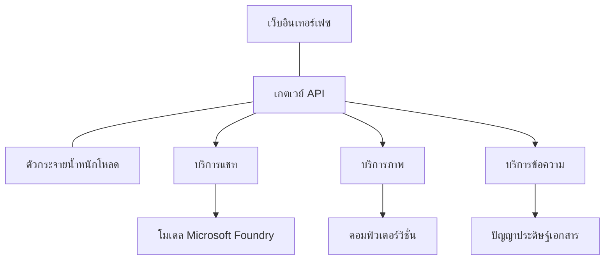

# แนวทางปฏิบัติที่ดีที่สุดสำหรับ AI Workload ในการผลิตด้วย AZD

**การนำทางบทเรียน:**
- **📚 หน้าแรกของคอร์ส**: [AZD สำหรับผู้เริ่มต้น](../../README.md)
- **📖 บทปัจจุบัน**: บทที่ 8 - รูปแบบการผลิตและองค์กร
- **⬅️ บทก่อนหน้า**: [บทที่ 7: การแก้ไขปัญหา](../chapter-07-troubleshooting/debugging.md)
- **⬅️ ที่เกี่ยวข้องเพิ่มเติม**: [ห้องปฏิบัติการเวิร์คช็อป AI](ai-workshop-lab.md)
- **🎯 คอร์สเสร็จสมบูรณ์**: [AZD สำหรับผู้เริ่มต้น](../../README.md)

## ภาพรวม

คู่มือนี้นำเสนอแนวทางปฏิบัติที่ดีที่สุดอย่างครบถ้วนสำหรับการปรับใช้ AI workload ที่พร้อมสำหรับการผลิตโดยใช้ Azure Developer CLI (AZD) โดยอิงจากข้อเสนอแนะจากชุมชน Microsoft Foundry Discord และการปรับใช้กับลูกค้าในโลกจริง แนวทางเหล่านี้ครอบคลุมความท้าทายที่พบบ่อยที่สุดในระบบ AI สำหรับการผลิต

## ความท้าทายสำคัญที่ได้รับการแก้ไข

อ้างอิงจากผลสำรวจชุมชนของเรา นี่คือความท้าทายหลักที่นักพัฒนาพบ:

- **45%** มีปัญหากับการปรับใช้ AI หลายบริการ
- **38%** มีปัญหาในการจัดการข้อมูลรับรองและความลับ  
- **35%** พบว่าการเตรียมความพร้อมสำหรับผลิตและการขยายขนาดเป็นเรื่องยาก
- **32%** ต้องการกลยุทธ์ปรับต้นทุนให้ดีขึ้น
- **29%** ต้องการการตรวจสอบและแก้ไขปัญหาที่ดีกว่า

## รูปแบบสถาปัตยกรรมสำหรับ AI ในการผลิต

### รูปแบบที่ 1: สถาปัตยกรรม Microservices AI

**เมื่อไหร่จึงใช้**: แอปพลิเคชัน AI ซับซ้อนที่มีความสามารถหลายอย่าง



**การใช้งานใน AZD**:

```yaml
# azure.yaml
name: enterprise-ai-platform
services:
  web:
    project: ./web
    host: staticwebapp
  api-gateway:
    project: ./api-gateway
    host: containerapp
  chat-service:
    project: ./services/chat
    host: containerapp
  vision-service:
    project: ./services/vision
    host: containerapp
  text-service:
    project: ./services/text
    host: containerapp
```

### รูปแบบที่ 2: การประมวลผล AI แบบขับเคลื่อนด้วยเหตุการณ์

**เมื่อไหร่จึงใช้**: การประมวลผลแบบแบตช์, การวิเคราะห์เอกสาร, การทำงานแบบอะซิงโครนัส

```bicep
// Event Hub for AI processing pipeline
resource eventHub 'Microsoft.EventHub/namespaces@2023-01-01-preview' = {
  name: eventHubNamespaceName
  location: location
  sku: {
    name: 'Standard'
    tier: 'Standard'
    capacity: 1
  }
}

// Service Bus for reliable message processing
resource serviceBus 'Microsoft.ServiceBus/namespaces@2022-10-01-preview' = {
  name: serviceBusNamespaceName
  location: location
  sku: {
    name: 'Premium'
    tier: 'Premium'
    capacity: 1
  }
}

// Function App for processing
resource functionApp 'Microsoft.Web/sites@2023-01-01' = {
  name: functionAppName
  location: location
  kind: 'functionapp,linux'
  properties: {
    siteConfig: {
      appSettings: [
        {
          name: 'FUNCTIONS_EXTENSION_VERSION'
          value: '~4'
        }
        {
          name: 'AZURE_OPENAI_ENDPOINT'
          value: '@Microsoft.KeyVault(VaultName=${keyVault.name};SecretName=openai-endpoint)'
        }
      ]
    }
  }
}
```

## การพิจารณาเกี่ยวกับสุขภาพของ AI Agent

เมื่อแอปเว็บแบบดั้งเดิมเสีย การแสดงออกมักจะคุ้นเคย: หน้าเว็บไม่โหลด, API คืนค่าข้อผิดพลาด หรือ การปรับใช้ล้มเหลว แอป AI สามารถล้มเหลวในทุกวิธีเหล่านั้นเช่นกัน — แต่ยังอาจทำงานผิดพลาดแบบละเอียดอ่อนซึ่งไม่แสดงข้อความข้อผิดพลาดชัดเจน

ส่วนนี้ช่วยให้คุณสร้างรูปแบบทางความคิดสำหรับการตรวจสอบ AI workload เพื่อที่คุณจะรู้ว่าจะดูที่ไหนเมื่อเกิดสิ่งผิดปกติ

### สุขภาพของ Agent แตกต่างจากสุขภาพของแอปแบบปกติอย่างไร

แอปแบบดั้งเดิมจะทำงานหรือไม่ทำงานเท่านั้น ส่วน AI agent อาจดูเหมือนทำงาน แต่ให้ผลลัพธ์ที่ไม่ดี คิดถึงสุขภาพของ agent ในสองชั้น:

| ชั้น | สิ่งที่สังเกต | ดูที่ไหน |
|-------|--------------|---------------|
| **สุขภาพโครงสร้างพื้นฐาน** | บริการกำลังทำงานอยู่หรือไม่? ทรัพยากรถูกจัดเตรียมหรือยัง? สามารถเข้าถึงจุดสิ้นสุดได้หรือไม่? | `azd monitor`, สุขภาพทรัพยากรใน Azure Portal, บันทึก container/app |
| **สุขภาพพฤติกรรม** | Agent ตอบสนองถูกต้องหรือไม่? การตอบสนองทันเวลาหรือไม่? เรียกใช้โมเดลอย่างถูกต้องหรือเปล่า? | ร่องรอยใน Application Insights, การวัดความหน่วงของการเรียกโมเดล, บันทึกคุณภาพการตอบสนอง |

สุขภาพโครงสร้างพื้นฐานเป็นสิ่งที่รู้จักดี — เหมือนกับแอป azd ทุกชนิด สุขภาพพฤติกรรมเป็นชั้นใหม่ที่ AI workload เพิ่มเข้ามา

### ดูที่ไหนเมื่อแอป AI ทำงานไม่เป็นไปตามที่คาด

หากแอป AI ของคุณไม่ผลิตผลลัพธ์ตามที่คาด นี่คือรายการตรวจสอบเชิงแนวคิด:

1. **เริ่มจากพื้นฐาน** แอปทำงานหรือไม่? เข้าถึงการพึ่งพิงได้ไหม? ตรวจสอบ `azd monitor` และสุขภาพทรัพยากรเหมือนกับแอปทั่วไป
2. **ตรวจสอบการเชื่อมต่อกับโมเดล** แอปเรียกใช้โมเดล AI สำเร็จหรือไม่? การเรียกโมเดลที่ล้มเหลวหรือล่าช้าคือสาเหตุที่พบบ่อยที่สุดของปัญหา AI และจะปรากฏในบันทึกแอปของคุณ
3. **ดูข้อมูลที่โมเดลได้รับ** การตอบสนองของ AI ขึ้นอยู่กับอินพุต (ข้อความชี้นำและบริบทที่นำมา) หากผลลัพธ์ผิด อินพุตมักจะผิด ตรวจสอบว่าแอปส่งข้อมูลที่ถูกต้องไปยังโมเดลหรือไม่
4. **ตรวจสอบความหน่วงการตอบสนอง** การเรียกโมเดล AI ช้ากว่าการเรียก API ทั่วไป ถ้าแอปรู้สึกช้า ให้ตรวจสอบว่าระยะเวลาการตอบสนองของโมเดลเพิ่มขึ้นหรือไม่ — นี่อาจบ่งชี้การจำกัดความจุ การจำกัดผ่าน หรือการแออัดในระดับภูมิภาค
5. **สังเกตสัญญาณค่าใช้จ่าย** การใช้โทเคนหรือการเรียก API ที่เพิ่มขึ้นโดยไม่คาดคิดอาจบ่งชี้ถึงวงจร การตั้งค่าข้อความชี้นำผิด หรือการลองใหม่ซ้ำมากเกินไป

คุณไม่จำเป็นต้องเชี่ยวชาญเครื่องมือการตรวจสอบทันที ประเด็นสำคัญคือแอป AI มีชั้นพฤติกรรมเพิ่มเติมให้ตรวจสอบ และเครื่องมือตรวจสอบในตัว azd (`azd monitor`) ให้จุดเริ่มต้นในการสืบค้นทั้งสองชั้นได้

---

## แนวทางปฏิบัติที่ดีที่สุดด้านความปลอดภัย

### 1. แบบจำลองความปลอดภัย Zero-Trust

**กลยุทธ์การใช้งาน**:
- ไม่มีการสื่อสารบริการต่อบริการโดยไม่ผ่านการยืนยันตัวตน
- การเรียก API ทั้งหมดใช้ managed identities
- การแยกเครือข่ายด้วย private endpoints
- การควบคุมสิทธิ์เข้าถึงแบบน้อยที่สุด

```bicep
// Managed Identity for each service
resource chatServiceIdentity 'Microsoft.ManagedIdentity/userAssignedIdentities@2023-01-31' = {
  name: 'chat-service-identity'
  location: location
}

// Role assignments with minimal permissions
resource openAIUserRole 'Microsoft.Authorization/roleAssignments@2022-04-01' = {
  scope: openAIAccount
  name: guid(openAIAccount.id, chatServiceIdentity.id, openAIUserRoleDefinitionId)
  properties: {
    roleDefinitionId: subscriptionResourceId('Microsoft.Authorization/roleDefinitions', '5e0bd9bd-7b93-4f28-af87-19fc36ad61bd')
    principalId: chatServiceIdentity.properties.principalId
    principalType: 'ServicePrincipal'
  }
}
```

### 2. การจัดการความลับอย่างปลอดภัย

**รูปแบบการผสานรวม Key Vault**:

```bicep
// Key Vault with proper access policies
resource keyVault 'Microsoft.KeyVault/vaults@2023-02-01' = {
  name: keyVaultName
  location: location
  properties: {
    tenantId: tenant().tenantId
    sku: {
      family: 'A'
      name: 'premium'  // Use premium for production
    }
    enableRbacAuthorization: true  // Use RBAC instead of access policies
    enablePurgeProtection: true    // Prevent accidental deletion
    enableSoftDelete: true
    softDeleteRetentionInDays: 90
  }
}

// Store all AI service credentials
resource openAIKeySecret 'Microsoft.KeyVault/vaults/secrets@2023-02-01' = {
  parent: keyVault
  name: 'openai-api-key'
  properties: {
    value: openAIAccount.listKeys().key1
    attributes: {
      enabled: true
    }
  }
}
```

### 3. ความปลอดภัยเครือข่าย

**การกำหนดค่า Private Endpoint**:

```bicep
// Virtual Network for AI services
resource virtualNetwork 'Microsoft.Network/virtualNetworks@2023-04-01' = {
  name: vnetName
  location: location
  properties: {
    addressSpace: {
      addressPrefixes: ['10.0.0.0/16']
    }
    subnets: [
      {
        name: 'ai-services-subnet'
        properties: {
          addressPrefix: '10.0.1.0/24'
          privateEndpointNetworkPolicies: 'Disabled'
        }
      }
      {
        name: 'app-services-subnet'
        properties: {
          addressPrefix: '10.0.2.0/24'
          delegations: [
            {
              name: 'Microsoft.Web/serverFarms'
              properties: {
                serviceName: 'Microsoft.Web/serverFarms'
              }
            }
          ]
        }
      }
    ]
  }
}

// Private endpoints for all AI services
resource openAIPrivateEndpoint 'Microsoft.Network/privateEndpoints@2023-04-01' = {
  name: '${openAIAccountName}-pe'
  location: location
  properties: {
    subnet: {
      id: virtualNetwork.properties.subnets[0].id
    }
    privateLinkServiceConnections: [
      {
        name: 'openai-connection'
        properties: {
          privateLinkServiceId: openAIAccount.id
          groupIds: ['account']
        }
      }
    ]
  }
}
```

## ประสิทธิภาพและการขยายตัว

### 1. กลยุทธ์การปรับขนาดอัตโนมัติ

**การปรับขนาดอัตโนมัติสำหรับ Container Apps**:

```bicep
resource containerApp 'Microsoft.App/containerApps@2023-05-01' = {
  name: containerAppName
  location: location
  properties: {
    configuration: {
      ingress: {
        external: true
        targetPort: 8000
        transport: 'http'
      }
    }
    template: {
      scale: {
        minReplicas: 2  // Always have 2 instances minimum
        maxReplicas: 50 // Scale up to 50 for high load
        rules: [
          {
            name: 'http-scaling'
            http: {
              metadata: {
                concurrentRequests: '20'  // Scale when >20 concurrent requests
              }
            }
          }
          {
            name: 'cpu-scaling'
            custom: {
              type: 'cpu'
              metadata: {
                type: 'Utilization'
                value: '70'  // Scale when CPU >70%
              }
            }
          }
        ]
      }
    }
  }
}
```

### 2. กลยุทธ์การแคช

**Redis Cache สำหรับการตอบสนอง AI**:

```bicep
// Redis Premium for production workloads
resource redisCache 'Microsoft.Cache/redis@2023-04-01' = {
  name: redisCacheName
  location: location
  properties: {
    sku: {
      name: 'Premium'
      family: 'P'
      capacity: 1
    }
    enableNonSslPort: false
    minimumTlsVersion: '1.2'
    redisConfiguration: {
      'maxmemory-policy': 'allkeys-lru'
    }
    // Enable clustering for high availability
    redisVersion: '6.0'
    shardCount: 2
  }
}

// Cache configuration in application
var cacheConnectionString = '${redisCache.properties.hostName}:6380,password=${redisCache.listKeys().primaryKey},ssl=True,abortConnect=False'
```

### 3. การจัดการโหลดและการจัดการทราฟฟิก

**Application Gateway พร้อม WAF**:

```bicep
// Application Gateway with Web Application Firewall
resource applicationGateway 'Microsoft.Network/applicationGateways@2023-04-01' = {
  name: appGatewayName
  location: location
  properties: {
    sku: {
      name: 'WAF_v2'
      tier: 'WAF_v2'
      capacity: 2
    }
    webApplicationFirewallConfiguration: {
      enabled: true
      firewallMode: 'Prevention'
      ruleSetType: 'OWASP'
      ruleSetVersion: '3.2'
    }
    // Backend pools for AI services
    backendAddressPools: [
      {
        name: 'ai-services-pool'
        properties: {
          backendAddresses: [
            {
              fqdn: '${containerApp.properties.configuration.ingress.fqdn}'
            }
          ]
        }
      }
    ]
  }
}
```

## 💰 การปรับต้นทุนให้เหมาะสม

### 1. การกำหนดขนาดทรัพยากรให้เหมาะสม

**การกำหนดค่าตามสภาพแวดล้อม**:

```bash
# สภาพแวดล้อมการพัฒนา
azd env new development
azd env set AZURE_OPENAI_SKU "S0"
azd env set AZURE_OPENAI_CAPACITY 10
azd env set AZURE_SEARCH_SKU "basic"
azd env set CONTAINER_CPU 0.5
azd env set CONTAINER_MEMORY 1.0

# สภาพแวดล้อมการผลิต
azd env new production
azd env set AZURE_OPENAI_SKU "S0"
azd env set AZURE_OPENAI_CAPACITY 100
azd env set AZURE_SEARCH_SKU "standard"
azd env set CONTAINER_CPU 2.0
azd env set CONTAINER_MEMORY 4.0
```

### 2. การตรวจสอบต้นทุนและงบประมาณ

```bicep
// Cost management and budgets
resource budget 'Microsoft.Consumption/budgets@2023-05-01' = {
  name: 'ai-workload-budget'
  properties: {
    timePeriod: {
      startDate: '2024-01-01'
      endDate: '2024-12-31'
    }
    timeGrain: 'Monthly'
    amount: 2000  // $2000 monthly budget
    category: 'Cost'
    notifications: {
      warning: {
        enabled: true
        operator: 'GreaterThan'
        threshold: 80
        contactEmails: [
          'finance@company.com'
          'engineering@company.com'
        ]
        contactRoles: [
          'Owner'
          'Contributor'
        ]
      }
      critical: {
        enabled: true
        operator: 'GreaterThan'
        threshold: 95
        contactEmails: [
          'cto@company.com'
        ]
      }
    }
  }
}
```

### 3. การเพิ่มประสิทธิภาพการใช้โทเคน

**การจัดการต้นทุน OpenAI**:

```typescript
// การปรับแต่งโทเค็นระดับแอปพลิเคชัน
class TokenOptimizer {
  private readonly maxTokens = 4000;
  private readonly reserveTokens = 500;
  
  optimizePrompt(userInput: string, context: string): string {
    const availableTokens = this.maxTokens - this.reserveTokens;
    const estimatedTokens = this.estimateTokens(userInput + context);
    
    if (estimatedTokens > availableTokens) {
      // ตัดบริบท ไม่ใช่ข้อมูลป้อนของผู้ใช้
      context = this.truncateContext(context, availableTokens - this.estimateTokens(userInput));
    }
    
    return `${context}\n\nUser: ${userInput}`;
  }
  
  private estimateTokens(text: string): number {
    // การประมาณคร่าวๆ: 1 โทเค็น ≈ 4 ตัวอักษร
    return Math.ceil(text.length / 4);
  }
}
```

## การตรวจสอบและการสังเกตการณ์

### 1. Application Insights แบบครบวงจร

```bicep
// Application Insights with advanced features
resource applicationInsights 'Microsoft.Insights/components@2020-02-02' = {
  name: applicationInsightsName
  location: location
  kind: 'web'
  properties: {
    Application_Type: 'web'
    WorkspaceResourceId: logAnalyticsWorkspace.id
    SamplingPercentage: 100  // Full sampling for AI apps
    DisableIpMasking: false  // Enable for security
  }
}

// Custom metrics for AI operations
resource aiMetricAlerts 'Microsoft.Insights/metricAlerts@2018-03-01' = {
  name: 'ai-high-error-rate'
  location: 'global'
  properties: {
    description: 'Alert when AI service error rate is high'
    severity: 2
    enabled: true
    scopes: [
      applicationInsights.id
    ]
    evaluationFrequency: 'PT1M'
    windowSize: 'PT5M'
    criteria: {
      'odata.type': 'Microsoft.Azure.Monitor.SingleResourceMultipleMetricCriteria'
      allOf: [
        {
          name: 'high-error-rate'
          metricName: 'requests/failed'
          operator: 'GreaterThan'
          threshold: 10
          timeAggregation: 'Count'
        }
      ]
    }
  }
}
```

### 2. การตรวจสอบเฉพาะ AI

**แดชบอร์ดที่ปรับแต่งสำหรับเมตริก AI**:

```json
// Dashboard configuration for AI workloads
{
  "dashboard": {
    "name": "AI Application Monitoring",
    "tiles": [
      {
        "name": "OpenAI Request Volume",
        "query": "requests | where name contains 'openai' | summarize count() by bin(timestamp, 5m)"
      },
      {
        "name": "AI Response Latency",
        "query": "requests | where name contains 'openai' | summarize avg(duration) by bin(timestamp, 5m)"
      },
      {
        "name": "Token Usage",
        "query": "customMetrics | where name == 'openai_tokens_used' | summarize sum(value) by bin(timestamp, 1h)"
      },
      {
        "name": "Cost per Hour",
        "query": "customMetrics | where name == 'openai_cost' | summarize sum(value) by bin(timestamp, 1h)"
      }
    ]
  }
}
```

### 3. การตรวจสอบสุขภาพและการเฝ้าระวังเวลาทำงาน

```bicep
// Application Insights availability tests
resource availabilityTest 'Microsoft.Insights/webtests@2022-06-15' = {
  name: 'ai-app-availability-test'
  location: location
  tags: {
    'hidden-link:${applicationInsights.id}': 'Resource'
  }
  properties: {
    SyntheticMonitorId: 'ai-app-availability-test'
    Name: 'AI Application Availability Test'
    Description: 'Tests AI application endpoints'
    Enabled: true
    Frequency: 300  // 5 minutes
    Timeout: 120    // 2 minutes
    Kind: 'ping'
    Locations: [
      {
        Id: 'us-east-2-azr'
      }
      {
        Id: 'us-west-2-azr'
      }
    ]
    Configuration: {
      WebTest: '''
        <WebTest Name="AI Health Check" 
                 Id="8d2de8d2-a2b0-4c2e-9a0d-8f9c9a0b8c8d" 
                 Enabled="True" 
                 CssProjectStructure="" 
                 CssIteration="" 
                 Timeout="120" 
                 WorkItemIds="" 
                 xmlns="http://microsoft.com/schemas/VisualStudio/TeamTest/2010" 
                 Description="" 
                 CredentialUserName="" 
                 CredentialPassword="" 
                 PreAuthenticate="True" 
                 Proxy="default" 
                 StopOnError="False" 
                 RecordedResultFile="" 
                 ResultsLocale="">
          <Items>
            <Request Method="GET" 
                     Guid="a5f10126-e4cd-570d-961c-cea43999a200" 
                     Version="1.1" 
                     Url="${webApp.properties.defaultHostName}/health" 
                     ThinkTime="0" 
                     Timeout="120" 
                     ParseDependentRequests="True" 
                     FollowRedirects="True" 
                     RecordResult="True" 
                     Cache="False" 
                     ResponseTimeGoal="0" 
                     Encoding="utf-8" 
                     ExpectedHttpStatusCode="200" 
                     ExpectedResponseUrl="" 
                     ReportingName="" 
                     IgnoreHttpStatusCode="False" />
          </Items>
        </WebTest>
      '''
    }
  }
}
```

## การกู้คืนจากภัยพิบัติและความพร้อมใช้งานสูง

### 1. การปรับใช้หลายภูมิภาค

```yaml
# azure.yaml - Multi-region configuration
name: ai-app-multiregion
services:
  api-primary:
    project: ./api
    host: containerapp
    env:
      - AZURE_REGION=eastus
  api-secondary:
    project: ./api
    host: containerapp
    env:
      - AZURE_REGION=westus2
```

```bicep
// Traffic Manager for global load balancing
resource trafficManager 'Microsoft.Network/trafficManagerProfiles@2022-04-01' = {
  name: trafficManagerProfileName
  location: 'global'
  properties: {
    profileStatus: 'Enabled'
    trafficRoutingMethod: 'Priority'
    dnsConfig: {
      relativeName: trafficManagerProfileName
      ttl: 30
    }
    monitorConfig: {
      protocol: 'HTTPS'
      port: 443
      path: '/health'
      intervalInSeconds: 30
      toleratedNumberOfFailures: 3
      timeoutInSeconds: 10
    }
    endpoints: [
      {
        name: 'primary-endpoint'
        type: 'Microsoft.Network/trafficManagerProfiles/azureEndpoints'
        properties: {
          targetResourceId: primaryAppService.id
          endpointStatus: 'Enabled'
          priority: 1
        }
      }
      {
        name: 'secondary-endpoint'
        type: 'Microsoft.Network/trafficManagerProfiles/azureEndpoints'
        properties: {
          targetResourceId: secondaryAppService.id
          endpointStatus: 'Enabled'
          priority: 2
        }
      }
    ]
  }
}
```

### 2. การสำรองข้อมูลและการกู้คืน

```bicep
// Backup configuration for critical data
resource backupVault 'Microsoft.DataProtection/backupVaults@2023-05-01' = {
  name: backupVaultName
  location: location
  identity: {
    type: 'SystemAssigned'
  }
  properties: {
    storageSettings: [
      {
        datastoreType: 'VaultStore'
        type: 'LocallyRedundant'
      }
    ]
  }
}

// Backup policy for AI models and data
resource backupPolicy 'Microsoft.DataProtection/backupVaults/backupPolicies@2023-05-01' = {
  parent: backupVault
  name: 'ai-data-backup-policy'
  properties: {
    policyRules: [
      {
        backupParameters: {
          backupType: 'Full'
          objectType: 'AzureBackupParams'
        }
        trigger: {
          schedule: {
            repeatingTimeIntervals: [
              'R/2024-01-01T02:00:00+00:00/P1D'  // Daily at 2 AM
            ]
          }
          objectType: 'ScheduleBasedTriggerContext'
        }
        dataStore: {
          datastoreType: 'VaultStore'
          objectType: 'DataStoreInfoBase'
        }
        name: 'BackupDaily'
        objectType: 'AzureBackupRule'
      }
    ]
  }
}
```

## การบูรณาการ DevOps และ CI/CD

### 1. GitHub Actions Workflow

```yaml
# .github/workflows/deploy-ai-app.yml
name: Deploy AI Application

on:
  push:
    branches: [main]
  pull_request:
    branches: [main]

jobs:
  test:
    runs-on: ubuntu-latest
    steps:
      - uses: actions/checkout@v4
      
      - name: Setup Python
        uses: actions/setup-python@v4
        with:
          python-version: '3.11'
          
      - name: Install dependencies
        run: |
          pip install -r requirements.txt
          pip install pytest
          
      - name: Run tests
        run: pytest tests/
        
      - name: AI Safety Tests
        run: |
          python scripts/test_ai_safety.py
          python scripts/validate_prompts.py

  deploy-staging:
    needs: test
    if: github.event_name == 'pull_request'
    runs-on: ubuntu-latest
    steps:
      - uses: actions/checkout@v4
      
      - name: Setup AZD
        uses: Azure/setup-azd@v2
        
      - name: Login to Azure
        uses: azure/login@v1
        with:
          creds: ${{ secrets.AZURE_CREDENTIALS }}
          
      - name: Deploy to Staging
        run: |
          azd env select staging
          azd deploy

  deploy-production:
    needs: test
    if: github.ref == 'refs/heads/main'
    runs-on: ubuntu-latest
    steps:
      - uses: actions/checkout@v4
      
      - name: Setup AZD
        uses: Azure/setup-azd@v2
        
      - name: Login to Azure
        uses: azure/login@v1
        with:
          creds: ${{ secrets.AZURE_CREDENTIALS }}
          
      - name: Deploy to Production
        run: |
          azd env select production
          azd deploy
          
      - name: Run Production Health Checks
        run: |
          python scripts/health_check.py --env production
```

### 2. การตรวจสอบโครงสร้างพื้นฐาน

```bash
# scripts/validate_infrastructure.sh
#!/bin/bash

echo "Validating AI infrastructure deployment..."

# ตรวจสอบว่าบริการที่จำเป็นทั้งหมดกำลังทำงานหรือไม่
services=("openai" "search" "storage" "keyvault")
for service in "${services[@]}"; do
    echo "Checking $service..."
    if ! az resource list --resource-type "Microsoft.CognitiveServices/accounts" --query "[?contains(name, '$service')]" -o tsv; then
        echo "ERROR: $service not found"
        exit 1
    fi
done

# ตรวจสอบความถูกต้องของการติดตั้งโมเดล OpenAI
echo "Validating OpenAI model deployments..."
models=$(az cognitiveservices account deployment list --name $AZURE_OPENAI_NAME --resource-group $AZURE_RESOURCE_GROUP --query "[].name" -o tsv)
if [[ ! $models == *"gpt-4.1-mini"* ]]; then
  echo "ERROR: Required model gpt-4.1-mini not deployed"
    exit 1
fi

# ทดสอบการเชื่อมต่อบริการ AI
echo "Testing AI service connectivity..."
python scripts/test_connectivity.py

echo "Infrastructure validation completed successfully!"
```

## รายการตรวจสอบความพร้อมสำหรับการผลิต

### ความปลอดภัย ✅
- [ ] บริการทั้งหมดใช้ managed identities
- [ ] ความลับเก็บใน Key Vault
- [ ] กำหนดค่า private endpoints
- [ ] ใช้งานกลุ่มความปลอดภัยเครือข่าย
- [ ] RBAC ด้วยสิทธิ์น้อยที่สุด
- [ ] เปิดใช้งาน WAF บน endpoints สาธารณะ

### ประสิทธิภาพ ✅
- [ ] กำหนดค่าการปรับขนาดอัตโนมัติ
- [ ] ใช้งานการแคช
- [ ] ตั้งค่าโหลดบาลานซ์
- [ ] ใช้ CDN สำหรับเนื้อหาคงที่
- [ ] การจัดกลุ่มการเชื่อมต่อฐานข้อมูล
- [ ] การเพิ่มประสิทธิภาพการใช้โทเคน

### การตรวจสอบ ✅
- [ ] ตั้งค่า Application Insights
- [ ] กำหนดเมตริกแบบกำหนดเอง
- [ ] ตั้งค่ากฎแจ้งเตือน
- [ ] สร้างแดชบอร์ด
- [ ] การตรวจสอบสุขภาพ
- [ ] นโยบายการเก็บบันทึก

### ความเชื่อถือได้ ✅
- [ ] การปรับใช้หลายภูมิภาค
- [ ] แผนการสำรองและกู้คืน
- [ ] การติดตั้ง circuit breakers
- [ ] การกำหนดนโยบาย retry
- [ ] การลดทอนที่เหมาะสม
- [ ] จุดสิ้นสุดตรวจสอบสุขภาพ

### การจัดการต้นทุน ✅
- [ ] กำหนดแจ้งเตือนงบประมาณ
- [ ] การกำหนดขนาดทรัพยากรให้เหมาะสม
- [ ] ส่วนลดสำหรับการพัฒนา/ทดสอบ
- [ ] การซื้อ reserved instances
- [ ] แดชบอร์ดการตรวจสอบต้นทุน
- [ ] การทบทวนต้นทุนเป็นประจำ

### การปฏิบัติตามข้อกำหนด ✅
- [ ] ปฏิบัติตามข้อกำหนดสถานที่เก็บข้อมูล
- [ ] เปิดใช้งานบันทึกการตรวจสอบ
- [ ] ใช้นโยบายการปฏิบัติตาม
- [ ] การตั้งค่ามาตรฐานความปลอดภัย
- [ ] การประเมินความปลอดภัยเป็นประจำ
- [ ] แผนตอบสนองต่อเหตุการณ์

## มาตรฐานประสิทธิภาพ

### เมตริกการผลิตทั่วไป

| เมตริก | เป้าหมาย | การตรวจสอบ |
|--------|--------|------------|
| **เวลาตอบสนอง** | < 2 วินาที | Application Insights |
| **ความพร้อมใช้งาน** | 99.9% | การตรวจสอบเวลาทำงาน |
| **อัตราข้อผิดพลาด** | < 0.1% | บันทึกแอป |
| **การใช้โทเคน** | < 500 ดอลลาร์/เดือน | การจัดการต้นทุน |
| **ผู้ใช้งานพร้อมกัน** | 1000+ | การทดสอบโหลด |
| **เวลาฟื้นตัว** | < 1 ชั่วโมง | การทดสอบกู้คืนจากภัยพิบัติ |

### การทดสอบโหลด

```bash
# สคริปต์ทดสอบประสิทธิภาพสำหรับแอปพลิเคชัน AI
python scripts/load_test.py \
  --endpoint https://your-ai-app.azurewebsites.net \
  --concurrent-users 100 \
  --duration 300 \
  --ramp-up 60
```

## 🤝 แนวทางปฏิบัติที่ดีที่สุดจากชุมชน

อ้างอิงจากข้อเสนอแนะของชุมชน Microsoft Foundry Discord:

### คำแนะนำยอดนิยมจากชุมชน:

1. **เริ่มเล็ก ขยายอย่างค่อยเป็นค่อยไป**: เริ่มจาก SKU พื้นฐานและขยายตามการใช้งานจริง
2. **ตรวจสอบทุกอย่าง**: ตั้งค่าการตรวจสอบอย่างครบถ้วนตั้งแต่วันแรก
3. **ทำให้ความปลอดภัยอัตโนมัติ**: ใช้โครงสร้างพื้นฐานเป็นโค้ดสำหรับความปลอดภัยที่สม่ำเสมอ
4. **ทดสอบอย่างละเอียด**: รวมการทดสอบที่เฉพาะเจาะจงสำหรับ AI ใน pipeline
5. **วางแผนต้นทุน**: ตรวจสอบการใช้โทเคนและตั้งการแจ้งเตือนงบประมาณตั้งแต่เนิ่นๆ

### กับดักที่ควรหลีกเลี่ยง:

- ❌ การฝังกุญแจ API ไว้ในโค้ด
- ❌ ไม่ตั้งค่าการตรวจสอบที่เหมาะสม
- ❌ มองข้ามการปรับต้นทุนให้เหมาะสม
- ❌ ไม่ทดสอบสถานการณ์ล้มเหลว
- ❌ ปรับใช้โดยไม่มีการตรวจสอบสุขภาพ

## คำสั่งและส่วนขยาย AZD AI CLI

AZD มีชุดคำสั่งและส่วนขยายเฉพาะ AI ที่พัฒนาอย่างต่อเนื่องเพื่อช่วยให้ workflow AI ในการผลิตราบรื่น เครื่องมือเหล่านี้เชื่อมช่องว่างระหว่างการพัฒนาท้องถิ่นกับการปรับใช้ในผลิตสำหรับ AI workload

### ส่วนขยาย AZD สำหรับ AI

AZD ใช้ระบบส่วนขยายเพื่อเพิ่มความสามารถเฉพาะ AI ติดตั้งและจัดการส่วนขยายด้วย:

```bash
# แสดงรายการส่วนขยายทั้งหมดที่มี (รวมถึง AI)
azd extension list

# ตรวจสอบรายละเอียดส่วนขยายที่ติดตั้งแล้ว
azd extension show azure.ai.agents

# ติดตั้งส่วนขยายตัวแทน Foundry
azd extension install azure.ai.agents

# ติดตั้งส่วนขยายการปรับแต่งละเอียด
azd extension install azure.ai.finetune

# ติดตั้งส่วนขยายโมเดลกำหนดเอง
azd extension install azure.ai.models

# อัปเกรดส่วนขยายที่ติดตั้งทั้งหมด
azd extension upgrade --all
```

**ส่วนขยาย AI ที่มีอยู่:**

| ส่วนขยาย | จุดประสงค์ | สถานะ |
|-----------|---------|--------|
| `azure.ai.agents` | การจัดการ Foundry Agent Service | Preview |
| `azure.ai.skills` | ทักษะ agent ที่ใช้ซ้ำได้ | Preview |
| `azure.ai.connections` | การเชื่อมต่อ Foundry (แหล่งข้อมูล, เครื่องมือ) | Preview |
| `azure.ai.finetune` | การปรับแต่งโมเดล Foundry | Preview |
| `azure.ai.models` | โมเดลเฉพาะของ Foundry | Preview |
| `azure.coding-agent` | การตั้งค่า coding agent | พร้อมใช้งาน |

> ส่วนขยาย `azure.ai.agents` พัฒนาอย่างรวดเร็ว คอร์สนี้ตรวจสอบกับเวอร์ชัน `0.1.40-preview` ใช้คำสั่ง `azd extension upgrade --all` เพื่อนำคำสั่งล่าสุดเข้ามา และ `azd extension show azure.ai.agents` เพื่อยืนยันเวอร์ชันที่ติดตั้ง

**ส่วนขยาย `skills` และ `connections` ใหม่ๆ คืออะไร?**

มีสองส่วนขยายในสถานะพรีวิวมาพร้อมกับเครื่องมือ agent ที่น่าสนใจสำหรับผู้เริ่มต้น:

- **`azure.ai.skills`** — **ทักษะ** คือความสามารถที่ใช้ซ้ำได้ (เครื่องมือหรือพฤติกรรมที่บรรจุไว้) ที่สามารถแนบให้กับ agent หนึ่งตัวหรือหลายตัวแทนที่จะทำซ้ำโค้ดหลายครั้ง คิดเหมือนบล็อกก่อสร้างที่ใช้ซ้ำได้: กำหนดทักษะ "ค้นหาเอกสาร" หรือ "ตรวจสอบคำสั่งซื้อ" ครั้งเดียว แล้วนำไปใช้ซ้ำในหลาย agent วิธีนี้ช่วยให้ระบบหลาย agent (บทที่ 5) สอดคล้องกันและหลีกเลี่ยงการคัดลอกวางโค้ด
- **`azure.ai.connections`** — **การเชื่อมต่อ** คือการลิงก์ที่จัดการจากโครงการ Foundry ของคุณไปยังทรัพยากรภายนอกที่ agent ต้องการ — แหล่งข้อมูล (เช่น Azure AI Search), จุดสิ้นสุดเครื่องมือ หรือบริการอื่นๆ การเชื่อมต่อนี้จัดการสถานที่และวิธีที่ agent เข้าถึงข้อมูลไว้ในที่เดียวอย่างเก็บรักษาควบคุม แทนที่จะกระจายข้อมูลรับรองและ endpoints ทั่วไปในโค้ด

คุณไม่จำเป็นต้องใช้ส่วนขยายเหล่านี้ในการปรับใช้ agent แรก เริ่มต้นด้วย `azure.ai.agents` ขณะเรียนรู้ หันไปใช้ `skills` เมื่อคุณพบว่าต้องทำซ้ำเครื่องมือเดิมหลาย agent และใช้ `connections` เมื่อ agent หลายตัวใช้แหล่งข้อมูลเดียวกัน

### การเริ่มต้นโปรเจกต์ Agent ด้วย `azd ai agent init`

คำสั่ง `azd ai agent init` สร้างโครงงาน AI agent พร้อมสำหรับการผลิตที่รวมกับ Microsoft Foundry Agent Service:

```bash
# เริ่มต้นโปรเจกต์เอเจนต์ใหม่จากตัวบ่งชี้เอเจนต์
azd ai agent init -m <manifest-path-or-uri>

# เริ่มต้นและตั้งเป้าไปที่โปรเจกต์ Foundry ที่ระบุ
azd ai agent init -m agent-manifest.yaml --project-id <foundry-project-id>

# เริ่มต้นด้วยไดเรกทอรีต้นทางที่กำหนดเอง
azd ai agent init -m agent-manifest.yaml --src ./agents/my-agent

# ตั้งเป้า Container Apps เป็นโฮสต์
azd ai agent init -m agent-manifest.yaml --host containerapp
```

**แฟลกสำคัญ:**

| แฟลก | คำอธิบาย |
|------|-------------|
| `-m, --manifest` | เส้นทางหรือ URI ของ agent manifest ที่จะเพิ่มในโปรเจกต์ของคุณ |
| `-p, --project-id` | รหัสโครงการ Microsoft Foundry ที่มีอยู่สำหรับสภาพแวดล้อม azd ของคุณ |
| `-s, --src` | โฟลเดอร์สำหรับดาวน์โหลดคำนิยาม agent (ค่าพื้นฐานเป็น `src/<agent-id>`) |
| `--host` | ตั้งค่า host เองแทนค่าเริ่มต้น (เช่น `containerapp`) |
| `-e, --environment` | สภาพแวดล้อม azd ที่จะใช้ |

**ทิปสำหรับการผลิต**: ใช้ `--project-id` เพื่อเชื่อมต่อโดยตรงกับโครงการ Foundry ที่มีอยู่ รักษาโค้ดของ agent และทรัพยากรคลาวด์ให้เชื่อมโยงกันตั้งแต่เริ่มต้น

### การจัดการวงจรชีวิตของ Agent

นอกเหนือจาก `init` ส่วนขยาย `azure.ai.agents` มีคำสั่งสำหรับวงจรชีวิตเต็มรูปแบบของ agent ที่โฮสต์—ทดสอบ, ประเมิน, ปรับปรุง, และถอดถอน:

```bash
# เรียกใช้งานเอเย่นต์ที่ปรับใช้แล้วและดูเวลาตอบสนองของเซิร์ฟเวอร์
# (ค่าความหน่วงรวมและเวลาถึงไบต์แรก)
azd ai agent invoke

# แสดงการกำหนดค่าจุดสิ้นสุดแบบสดก่อนเปลี่ยนแปลง
azd ai agent endpoint show

# สร้างชุดข้อมูลประเมินผลสำหรับเอเย่นต์
azd ai agent eval generate --dataset ./eval/dataset.jsonl

# ปรับแต่งคำสั่งเอเย่นต์ตามข้อมูลประเมินของคุณ
# (ต้องการ optimization_model ในโปรเจกต์เอเย่นต์)
azd ai agent optimize

# ดาวน์โหลดซอร์สที่ปรับใช้ของเอเย่นต์ที่โฮสต์ด้วยโค้ด
# (พร้อมการยืนยัน SHA-256)
azd ai agent code download

# ลบเอเย่นต์ที่โฮสต์และเวอร์ชันทั้งหมดของมัน
# (--force จะยุติการใช้งานเซสชันที่กำลังทำงาน)
azd ai agent delete --force
```

**วงจรชีวิตโดยสังเขป:**

| ขั้นตอน | คำสั่ง | การใช้งานจริง |
|-------|---------|----------------|
| ทดสอบ | `azd ai agent invoke` | ตรวจสอบการตอบสนองและวัดความหน่วงก่อนปล่อย |
| ตรวจสอบ | `azd ai agent endpoint show` | ดูการยืนยันตัวตนและการตั้งค่าจุดสิ้นสุด; ตรวจจับการเปลี่ยนแปลงล่วงหน้า |
| วัดผล | `azd ai agent eval generate` | สร้างชุดประเมินซ้ำได้จากร่องรอยจริง |
| ปรับปรุง | `azd ai agent optimize` | ปรับคำสั่งให้เหมาะสมตามคุณภาพที่วัดได้ |
| กู้คืน | `azd ai agent code download` | ดึงซอร์สโค้ดที่ปรับใช้จริงสำหรับตรวจสอบ/ย้อนกลับ |
| เลิกใช้ | `azd ai agent delete --force` | ลบ agent และเวอร์ชันอย่างสะอาด |

> คำสั่งเหล่านี้อยู่ในสถานะพรีวิวและอาจมีการเปลี่ยนแปลงระหว่างการอัปเดตส่วนขยาย ใช้ `azd ai agent --help` เพื่อดูคำสั่งย่อยที่มีในเวอร์ชันที่คุณติดตั้ง

### โปรโตคอล Model Context (MCP) ด้วย `azd mcp`
AZD รวมการสนับสนุนเซิร์ฟเวอร์ MCP ในตัว (Alpha) ซึ่งช่วยให้อุปกรณ์และเครื่องมือ AI สามารถโต้ตอบกับทรัพยากร Azure ของคุณผ่านโปรโตคอลมาตรฐาน:

```bash
# เริ่มเซิร์ฟเวอร์ MCP สำหรับโครงการของคุณ
azd mcp start

# ตรวจสอบกฎการยินยอม Copilot ปัจจุบันสำหรับการเรียกใช้เครื่องมือ
azd copilot consent list
```

เซิร์ฟเวอร์ MCP เปิดเผยบริบทโครงการ azd ของคุณ—สภาพแวดล้อม บริการ และทรัพยากร Azure—ให้กับเครื่องมือพัฒนา AI ที่ขับเคลื่อนด้วย AI ซึ่งช่วยให้:

- **การปรับใช้ที่ช่วยด้วย AI**: ให้เอเจนต์เขียนโค้ดสอบถามสถานะโครงการของคุณและเปิดใช้งานการปรับใช้
- **การค้นพบทรัพยากร**: เครื่องมือ AI สามารถค้นหาทรัพยากร Azure ที่โครงการของคุณใช้
- **การจัดการสภาพแวดล้อม**: เอเจนต์สามารถสลับระหว่างสภาพแวดล้อม dev/staging/production

### การสร้างโครงสร้างพื้นฐานด้วย `azd infra generate`

สำหรับเวิร์กโหลด AI ในการผลิต คุณสามารถสร้างและปรับแต่ง Infrastructure as Code แทนที่จะพึ่งพาการจัดหาอัตโนมัติ:

```bash
# สร้างไฟล์ Bicep/Terraform จากการกำหนดโปรเจกต์ของคุณ
azd infra generate
```

สิ่งนี้จะเขียน IaC ลงบนดิสก์เพื่อให้คุณ:
- ตรวจสอบและตรวจสอบโครงสร้างพื้นฐานก่อนปรับใช้
- เพิ่มนโยบายความปลอดภัยที่กำหนดเอง (กฎเครือข่าย, private endpoints)
- รวมเข้ากับกระบวนการตรวจสอบ IaC ที่มีอยู่
- ควบคุมเวอร์ชันของการเปลี่ยนแปลงโครงสร้างพื้นฐานแยกจากโค้ดแอปพลิเคชัน

### ตะขอสถานะวงจรการผลิต

ตะขอ AZD ช่วยให้คุณแทรกตรรกะที่กำหนดเองในทุกขั้นตอนของวงจรการปรับใช้—ซึ่งสำคัญสำหรับเวิร์กโฟลว์ AI ในการผลิต:

```yaml
# azure.yaml - Production hooks example
name: ai-production-app
hooks:
  preprovision:
    shell: sh
    run: scripts/validate-quotas.sh    # Check AI model quota before provisioning
  postprovision:
    shell: sh
    run: scripts/configure-networking.sh  # Set up private endpoints
  predeploy:
    shell: sh
    run: scripts/run-ai-safety-tests.sh  # Run prompt safety checks
  postdeploy:
    shell: sh
    run: scripts/smoke-test.sh           # Verify agent responses post-deploy
services:
  agent-api:
    project: ./src/agent
    host: containerapp
    hooks:
      predeploy:
        shell: sh
        run: scripts/validate-model-access.sh  # Per-service hook
```

```bash
# เรียกใช้งาน hook เฉพาะเจาะจงด้วยตนเองในระหว่างการพัฒนา
azd hooks run predeploy
```

**ตะขอแนะนำสำหรับเวิร์กโหลด AI ในการผลิต:**

| ตะขอ | กรณีการใช้งาน |
|------|----------|
| `preprovision` | ตรวจสอบโควต้าการสมัครเพื่อรองรับความจุโมเดล AI |
| `postprovision` | กำหนดค่า private endpoints, ปรับใช้น้ำหนักโมเดล |
| `predeploy` | รันการทดสอบความปลอดภัย AI, ตรวจสอบเทมเพลต prompt |
| `postdeploy` | ทดสอบอาการตอบสนองของเอเจนต์, ตรวจสอบการเชื่อมต่อโมเดล |

### การกำหนดค่าท่อ CI/CD

ใช้ `azd pipeline config` เพื่อเชื่อมต่อโปรเจกต์ของคุณกับ GitHub Actions หรือ Azure Pipelines โดยใช้การรับรองความถูกต้อง Azure อย่างปลอดภัย:

```bash
# กำหนดค่า pipeline CI/CD (แบบโต้ตอบ)
azd pipeline config

# กำหนดค่าด้วยผู้ให้บริการเฉพาะ
azd pipeline config --provider github
```

คำสั่งนี้:
- สร้าง service principal ที่มีสิทธิ์น้อยที่สุด
- กำหนดค่าข้อมูลประจำตัวแบบรวมกลุ่ม (federated credentials) (ไม่มีการจัดเก็บความลับ)
- สร้างหรืออัปเดตไฟล์คำจำกัดความท่อของคุณ
- กำหนดค่าตัวแปรสภาพแวดล้อมที่จำเป็นในระบบ CI/CD ของคุณ

#### ทีละขั้นตอน: ท่อ GitHub Actions ครั้งแรกของคุณ

นี่คือการแนะนำเต็มรูปแบบจากโปรเจกต์ azd ที่ใช้งานได้จนถึงการปรับใช้อัตโนมัติทุกครั้งที่มีการ push

**1. ตรวจสอบให้แน่ใจว่าโปรเจกต์ของคุณอยู่บน GitHub**

```bash
git init
git add .
git commit -m "Initial azd project"
gh repo create my-ai-app --private --source=. --push
```

**2. รันคำสั่ง pipeline config**

```bash
azd pipeline config --provider github
```

azd จะทำงานแบบอินเทอร์แอกทีฟ:
- ถามว่าต้องการใช้งาน Azure subscription และ environment ตัวใด
- สร้างการลงทะเบียนแอปพลิเคชัน Entra **พร้อม service principal** สำหรับท่อ
- ตั้งค่า **federated credentials (OIDC)** เพื่อให้ GitHub รับรองความถูกต้องกับ Azure ด้วย token ชั่วคราว และ **ไม่มีการจัดเก็บความลับ**
- ส่งผ่าน **ตัวแปร** ที่จำเป็นไปยังรีโปของ GitHub (`AZURE_CLIENT_ID`, `AZURE_TENANT_ID`, `AZURE_SUBSCRIPTION_ID`, `AZURE_ENV_NAME`, `AZURE_LOCATION`)

**3. ทำความเข้าใจเวิร์กโฟลว์ที่สร้างขึ้น**

azd จะเพิ่ม `.github/workflows/azure-dev.yml` ส่วนสำคัญมีลักษณะดังนี้:

```yaml
# .github/workflows/azure-dev.yml
on:
  push:
    branches: [ main ]
  workflow_dispatch:        # lets you run it manually too

permissions:
  id-token: write           # required for OIDC federated login
  contents: read

jobs:
  build:
    runs-on: ubuntu-latest
    env:
      AZURE_CLIENT_ID: ${{ vars.AZURE_CLIENT_ID }}
      AZURE_TENANT_ID: ${{ vars.AZURE_TENANT_ID }}
      AZURE_SUBSCRIPTION_ID: ${{ vars.AZURE_SUBSCRIPTION_ID }}
      AZURE_ENV_NAME: ${{ vars.AZURE_ENV_NAME }}
      AZURE_LOCATION: ${{ vars.AZURE_LOCATION }}
    steps:
      - uses: actions/checkout@v4
      - name: Install azd
        uses: Azure/setup-azd@v2
      - name: Log in with OIDC
        run: azd auth login --client-id "$AZURE_CLIENT_ID" --federated-credential-provider "github" --tenant-id "$AZURE_TENANT_ID"
      - name: Provision infrastructure
        run: azd provision --no-prompt
      - name: Deploy application
        run: azd deploy --no-prompt
```

**4. ยืนยันว่ามันทำงาน**

```bash
# ดันการเปลี่ยนแปลงเพื่อกระตุ้นการทำงานของไพป์ไลน์
git commit -am "Trigger pipeline" --allow-empty
git push
```

เปิดแท็บ **Actions** ในรีโป GitHub ของคุณและดูเวิร์กโฟลว์ทำงานคำสั่ง `azd provision` และ `azd deploy` โดยอัตโนมัติ

> **เหตุผลที่ federated credentials สำคัญ:** ท่อ Older เก็บความลับของ client ไว้ใน GitHub OIDC federated credentials ลบความลับนั้นออกโดยสิ้นเชิง—GitHub จะขอ token ชั่วคราวในเวลารัน ซึ่งปลอดภัยกว่าและไม่ต้องหมุนหรือเปิดเผย ความปลอดภัยนี้เป็นค่าปริยายที่ `azd pipeline config` ตั้งค่าให้

> **ความลับกับตัวแปร:** ตัวระบุที่ไม่ละเอียดอ่อน (`AZURE_CLIENT_ID` เป็นต้น) จะอยู่ในตัวแปรรีโป หากแอปของคุณต้องการความลับจริงๆ ในเวลาคอมไพล์ ให้เพิ่มใน GitHub **secret** และอ้างอิงด้วย `${{ secrets.NAME }}`—แต่ควรใช้ Key Vault + managed identity ในเวลารัน (ดู [บทที่ 3](../chapter-03-configuration/authsecurity.md))

**เวิร์กโฟลว์การผลิตด้วย pipeline config:**

```bash
# 1. ตั้งค่าสภาพแวดล้อมการผลิต
azd env new production
azd env set AZURE_OPENAI_CAPACITY 100

# 2. กำหนดค่าท่อส่งข้อมูล
azd pipeline config --provider github

# 3. ท่อส่งข้อมูลจะรัน azd deploy ทุกครั้งที่มีการ push ไปที่ main
```

#### ทีละขั้นตอน: Azure DevOps Pipelines

ชอบใช้ Azure DevOps มากกว่า GitHub Actions หรือไม่? azd สนับสนุนโดยตรงด้วยผู้ให้บริการ `azdo` กระบวนการเหมือนกัน—azd สร้างไฟล์ท่อ สร้างการเชื่อมต่อบริการ และตั้งค่าการรับรองความถูกต้อง

**1. ตรวจสอบให้แน่ใจว่าคุณมีโปรเจกต์ Azure DevOps**

คุณต้องมีองค์กรและโปรเจกต์ที่ `https://dev.azure.com/<your-org>` สร้าง Personal Access Token (PAT) ที่มีขอบเขต **Build (Read & execute)**, **Code (Read & write)** และ **Service Connections (Read, query & manage)** — azd จะถามคุณในขั้นตอนนี้

**2. กำหนดค่าท่อ**

```bash
azd pipeline config --provider azdo
```

azd จะ:
- ถามเกี่ยวกับองค์กรและโปรเจกต์ Azure DevOps ของคุณ
- สร้าง (หรือนำมาใช้ซ้ำ) **service connection** ไปยัง Azure โดยใช้ service principal
- กำหนดค่า **workload identity federation (OIDC)** เพื่อไม่ให้มีการจัดเก็บความลับ client
- คอมมิตไฟล์คำจำกัดความท่อ `azure-dev.yml` ลงในรีโปของคุณ

**3. ตรวจสอบ `azure-dev.yml` ที่สร้างขึ้น**

azd สร้างท่อที่ปรับใช้และจัดเตรียมทุกครั้งที่ push ไปยัง `main`:

```yaml
# azure-dev.yml
trigger:
  - main

pool:
  vmImage: ubuntu-latest

steps:
  - task: setup-azd@1
    displayName: Install azd

  - script: azd provision --no-prompt
    displayName: Provision Infrastructure
    env:
      AZURE_SUBSCRIPTION_ID: $(AZURE_SUBSCRIPTION_ID)
      AZURE_ENV_NAME: $(AZURE_ENV_NAME)
      AZURE_LOCATION: $(AZURE_LOCATION)

  - script: azd deploy --no-prompt
    displayName: Deploy Application
    env:
      AZURE_SUBSCRIPTION_ID: $(AZURE_SUBSCRIPTION_ID)
      AZURE_ENV_NAME: $(AZURE_ENV_NAME)
      AZURE_LOCATION: $(AZURE_LOCATION)
```

**4. ตัวแปรมาจากไหน**

azd เก็บค่าสภาพแวดล้อม (`AZURE_ENV_NAME`, `AZURE_LOCATION`, `AZURE_SUBSCRIPTION_ID`) เป็น **variable group** ใน Azure DevOps เพื่อให้ท่อสามารถอ่านค่าได้ คุณสามารถดูและแก้ไขได้ที่ **Pipelines → Library**

> **ประโยชน์ OIDC เหมือน GitHub:** ผู้ให้บริการ `azdo` ยังตั้งค่า workload identity federation โดยปริยายเช่นกัน จึงไม่มีการเก็บความลับ client ใน service connection — Azure DevOps แลกเปลี่ยนโทเค็นชั่วคราวในเวลารัน ส่ง `--auth-type client-credentials` เฉพาะเมื่อองค์กรของคุณยังไม่สามารถใช้ OIDC ได้

**5. รันมัน**

```bash
git commit -am "Add Azure DevOps pipeline" --allow-empty
git push
```

เปิด **Pipelines** ใน Azure DevOps เพื่อดูคำสั่ง `azd provision` และ `azd deploy` ทำงาน

### การเพิ่มคอมโพเนนต์ด้วย `azd add`

เพิ่มบริการ Azure ในโปรเจกต์ที่มีอยู่ทีละน้อย:

```bash
# เพิ่มคอมโพเนนต์บริการใหม่แบบโต้ตอบ
azd add
```

นี่มีประโยชน์มากสำหรับการขยายแอปพลิเคชัน AI สำหรับการผลิต เช่น การเพิ่มบริการค้นหาเวกเตอร์, จุดสิ้นสุดเอเจนต์ใหม่, หรือคอมโพเนนต์การตรวจสอบในโครงการที่ปรับใช้แล้ว

## แหล่งข้อมูลเพิ่มเติม

- **Azure Well-Architected Framework**: [แนวทางเวิร์กโหลด AI](https://learn.microsoft.com/azure/well-architected/ai/)
- **เอกสาร Microsoft Foundry**: [เอกสารอย่างเป็นทางการ](https://learn.microsoft.com/azure/ai-studio/)
- **เทมเพลตชุมชน**: [ตัวอย่างของ Azure](https://github.com/Azure-Samples)
- **ชุมชน Discord**: [ช่อง #Azure](https://discord.gg/microsoft-azure)
- **Agent Skills สำหรับ Azure**: [microsoft/github-copilot-for-azure บน skills.sh](https://skills.sh/microsoft/github-copilot-for-azure) – 37 สกิลเอเจนต์เปิดสำหรับ Azure AI, Foundry, การปรับใช้, การเพิ่มประสิทธิภาพค่าใช้จ่าย และการวินิจฉัย ติดตั้งในตัวแก้ไขของคุณ:
  ```bash
  npx skills add microsoft/github-copilot-for-azure
  ```

---

**การนำทางบท:**
- **📚 หน้าแรกหลักสูตร**: [AZD สำหรับผู้เริ่มต้น](../../README.md)
- **📖 บทปัจจุบัน**: บทที่ 8 - รูปแบบการผลิตและองค์กร
- **⬅️ บทก่อนหน้า**: [บทที่ 7: การแก้ไขปัญหา](../chapter-07-troubleshooting/debugging.md)
- **⬅️ ที่เกี่ยวข้องเพิ่มเติม**: [ห้องปฏิบัติการเวิร์กช็อป AI](ai-workshop-lab.md)
- **� หลักสูตรสมบูรณ์**: [AZD สำหรับผู้เริ่มต้น](../../README.md)

**โปรดจำไว้**: เวิร์กโหลด AI สำหรับการผลิตต้องการการวางแผนอย่างรอบคอบ การตรวจสอบ และการปรับแต่งอย่างต่อเนื่อง เริ่มต้นด้วยรูปแบบเหล่านี้และปรับแต่งตามความต้องการเฉพาะของคุณเอง

---

<!-- CO-OP TRANSLATOR DISCLAIMER START -->
**ปฏิเสธความรับผิดชอบ**:
เอกสารนี้ได้รับการแปลโดยใช้บริการแปลภาษา AI [Co-op Translator](https://github.com/Azure/co-op-translator) ขณะที่เราพยายามให้ความถูกต้อง โปรดทราบว่าการแปลโดยอัตโนมัติอาจมีข้อผิดพลาดหรือความไม่ถูกต้อง เอกสารต้นฉบับในภาษาต้นทางควรถูกพิจารณาเป็นแหล่งข้อมูลที่เชื่อถือได้ สำหรับข้อมูลที่สำคัญ แนะนำให้ใช้การแปลโดยมนุษย์มืออาชีพ เราไม่รับผิดชอบต่อความเข้าใจผิดหรือการตีความที่ผิดพลาดที่เกิดขึ้นจากการใช้การแปลนี้
<!-- CO-OP TRANSLATOR DISCLAIMER END -->