# AZD Basics - ทำความเข้าใจ Azure Developer CLI

# AZD Basics - แนวคิดและพื้นฐานสำคัญ

**การนำทางบทเรียน:**
- **📚 หน้าแรกของคอร์ส**: [AZD สำหรับผู้เริ่มต้น](../../README.md)
- **📖 บทเรียนปัจจุบัน**: บทที่ 1 - พื้นฐานและเริ่มต้นใช้งาน
- **⬅️ ก่อนหน้า**: [ภาพรวมของคอร์ส](../../README.md#-chapter-1-foundation--quick-start)
- **➡️ ถัดไป**: [การติดตั้งและตั้งค่า](installation.md)
- **🚀 บทเรียนถัดไป**: [บทที่ 2: การพัฒนาโดยเน้น AI](../microsoft-foundry/microsoft-foundry-integration.md)

## บทนำ

บทเรียนนี้จะแนะนำคุณให้รู้จักกับ Azure Developer CLI (azd) ซึ่งเป็นเครื่องมือบรรทัดคำสั่งที่ทรงพลังที่ช่วยเร่งกระบวนการจากการพัฒนาในเครื่องไปจนถึงการปรับใช้บน Azure คุณจะได้เรียนรู้แนวคิดพื้นฐาน ฟีเจอร์สำคัญ และเข้าใจว่า azd ช่วยให้การปรับใช้แอปพลิเคชันแบบ cloud-native ง่ายขึ้นได้อย่างไร

## เป้าหมายการเรียนรู้

เมื่อจบบทเรียนนี้ คุณจะ:
- เข้าใจว่า Azure Developer CLI คืออะไรและมีวัตถุประสงค์หลักอย่างไร
- เรียนรู้แนวคิดหลักเกี่ยวกับเทมเพลต สภาพแวดล้อม และบริการ
- สำรวจฟีเจอร์สำคัญ เช่น การพัฒนาที่ขับเคลื่อนด้วยเทมเพลตและ Infrastructure as Code
- เข้าใจโครงสร้างและเวิร์กโฟลว์ของโปรเจกต์ azd
- เตรียมพร้อมสำหรับการติดตั้งและตั้งค่า azd ในสภาพแวดล้อมการพัฒนาของคุณ

## ผลลัพธ์การเรียนรู้

หลังจากจบบทเรียนนี้ คุณจะสามารถ:
- อธิบายบทบาทของ azd ในเวิร์กโฟลว์การพัฒนาบนคลาวด์ยุคใหม่
- ระบุองค์ประกอบของโครงสร้างโปรเจกต์ azd
- อธิบายว่าเทมเพลต สภาพแวดล้อม และบริการทำงานร่วมกันอย่างไร
- เข้าใจประโยชน์ของ Infrastructure as Code ด้วย azd
- รู้จักคำสั่ง azd ต่าง ๆ และวัตถุประสงค์ของแต่ละคำสั่ง

## Azure Developer CLI (azd) คืออะไร?

Azure Developer CLI (azd) เป็นเครื่องมือบรรทัดคำสั่งที่ออกแบบมาเพื่อเร่งกระบวนการจากการพัฒนาในเครื่องไปจนถึงการปรับใช้บน Azure มันช่วยให้การสร้าง ปรับใช้ และจัดการแอปพลิเคชันแบบ cloud-native บน Azure ง่ายขึ้น

### 🎯 ทำไมต้องใช้ AZD? เปรียบเทียบกับโลกจริง

ลองเปรียบเทียบการปรับใช้เว็บแอปง่าย ๆ พร้อมฐานข้อมูล:

#### ❌ ไม่มี AZD: การปรับใช้ Azure แบบแมนนวล (30+ นาที)

```bash
# ขั้นตอนที่ 1: สร้างกลุ่มทรัพยากร
az group create --name myapp-rg --location eastus

# ขั้นตอนที่ 2: สร้างแผนบริการแอป
az appservice plan create --name myapp-plan \
  --resource-group myapp-rg \
  --sku B1 --is-linux

# ขั้นตอนที่ 3: สร้างเว็บแอป
az webapp create --name myapp-web-unique123 \
  --resource-group myapp-rg \
  --plan myapp-plan \
  --runtime "NODE:18-lts"

# ขั้นตอนที่ 4: สร้างบัญชี Cosmos DB (ใช้เวลา 10-15 นาที)
az cosmosdb create --name myapp-cosmos-unique123 \
  --resource-group myapp-rg \
  --kind MongoDB

# ขั้นตอนที่ 5: สร้างฐานข้อมูล
az cosmosdb mongodb database create \
  --account-name myapp-cosmos-unique123 \
  --resource-group myapp-rg \
  --name tododb

# ขั้นตอนที่ 6: สร้างคอลเลกชัน
az cosmosdb mongodb collection create \
  --account-name myapp-cosmos-unique123 \
  --resource-group myapp-rg \
  --database-name tododb \
  --name todos

# ขั้นตอนที่ 7: รับสตริงการเชื่อมต่อ
CONN_STR=$(az cosmosdb keys list \
  --name myapp-cosmos-unique123 \
  --resource-group myapp-rg \
  --type connection-strings \
  --query "connectionStrings[0].connectionString" -o tsv)

# ขั้นตอนที่ 8: กำหนดค่าการตั้งค่าแอป
az webapp config appsettings set \
  --name myapp-web-unique123 \
  --resource-group myapp-rg \
  --settings MONGODB_URI="$CONN_STR"

# ขั้นตอนที่ 9: เปิดใช้งานการบันทึก
az webapp log config --name myapp-web-unique123 \
  --resource-group myapp-rg \
  --application-logging filesystem \
  --detailed-error-messages true

# ขั้นตอนที่ 10: ตั้งค่า Application Insights
az monitor app-insights component create \
  --app myapp-insights \
  --location eastus \
  --resource-group myapp-rg

# ขั้นตอนที่ 11: เชื่อมโยง App Insights กับเว็บแอป
INSTRUMENTATION_KEY=$(az monitor app-insights component show \
  --app myapp-insights \
  --resource-group myapp-rg \
  --query "instrumentationKey" -o tsv)

az webapp config appsettings set \
  --name myapp-web-unique123 \
  --resource-group myapp-rg \
  --settings APPINSIGHTS_INSTRUMENTATIONKEY="$INSTRUMENTATION_KEY"

# ขั้นตอนที่ 12: สร้างแอปพลิเคชันในเครื่อง
npm install
npm run build

# ขั้นตอนที่ 13: สร้างแพ็กเกจการปรับใช้
zip -r app.zip . -x "*.git*" "node_modules/*"

# ขั้นตอนที่ 14: ปรับใช้แอปพลิเคชัน
az webapp deployment source config-zip \
  --resource-group myapp-rg \
  --name myapp-web-unique123 \
  --src app.zip

# ขั้นตอนที่ 15: รอและภาวนาให้มันทำงาน 🙏
# (ไม่มีการตรวจสอบอัตโนมัติ ต้องทดสอบด้วยตนเอง)
```

**ปัญหา:**
- ❌ ต้องจำและรันคำสั่งมากกว่า 15 คำสั่ง
- ❌ ใช้เวลาทำงานแมนนวล 30-45 นาที
- ❌ มีโอกาสเกิดข้อผิดพลาดง่าย (พิมพ์ผิด, พารามิเตอร์ผิด)
- ❌ สตริงการเชื่อมต่อถูกเปิดเผยในประวัติเทอร์มินัล
- ❌ ไม่มีการย้อนกลับอัตโนมัติหากเกิดข้อผิดพลาด
- ❌ ยากต่อการทำซ้ำสำหรับสมาชิกทีม
- ❌ ผลลัพธ์แตกต่างกันทุกครั้ง (ไม่สามารถทำซ้ำได้)

#### ✅ มี AZD: การปรับใช้อัตโนมัติ (5 คำสั่ง, 10-15 นาที)

```bash
# ขั้นตอนที่ 1: เริ่มต้นจากเทมเพลต
azd init --template todo-nodejs-mongo

# ขั้นตอนที่ 2: ยืนยันตัวตน
azd auth login

# ขั้นตอนที่ 3: สร้างสภาพแวดล้อม
azd env new dev

# ขั้นตอนที่ 4: ดูตัวอย่างการเปลี่ยนแปลง (ไม่จำเป็นแต่แนะนำ)
azd provision --preview

# ขั้นตอนที่ 5: ปรับใช้ทุกอย่าง
azd up

# ✨ เสร็จสิ้น! ทุกอย่างถูกปรับใช้ กำหนดค่า และตรวจสอบแล้ว
```

**ประโยชน์:**
- ✅ **5 คำสั่ง** เทียบกับขั้นตอนแมนนวลมากกว่า 15 ขั้นตอน
- ✅ **10-15 นาที** เวลารวม (ส่วนใหญ่รอ Azure)
- ✅ **ไม่มีข้อผิดพลาด** - อัตโนมัติและผ่านการทดสอบ
- ✅ **จัดการความลับอย่างปลอดภัย** ผ่าน Key Vault
- ✅ **ย้อนกลับอัตโนมัติ** เมื่อเกิดข้อผิดพลาด
- ✅ **ทำซ้ำได้เต็มที่** - ผลลัพธ์เหมือนกันทุกครั้ง
- ✅ **พร้อมสำหรับทีม** - ใครก็สามารถปรับใช้ด้วยคำสั่งเดียวกัน
- ✅ **Infrastructure as Code** - เทมเพลต Bicep ที่ควบคุมด้วยเวอร์ชัน
- ✅ **การตรวจสอบในตัว** - Application Insights ถูกตั้งค่าอัตโนมัติ

### 📊 การลดเวลาและข้อผิดพลาด

| เมตริก | การปรับใช้แบบแมนนวล | การปรับใช้ด้วย AZD | การปรับปรุง |
|:-------|:------------------|:---------------|:------------|
| **คำสั่ง** | 15+ | 5 | ลดลง 67% |
| **เวลา** | 30-45 นาที | 10-15 นาที | เร็วขึ้น 60% |
| **อัตราข้อผิดพลาด** | ~40% | <5% | ลดลง 88% |
| **ความสม่ำเสมอ** | ต่ำ (แมนนวล) | 100% (อัตโนมัติ) | สมบูรณ์แบบ |
| **การเริ่มต้นทีม** | 2-4 ชั่วโมง | 30 นาที | เร็วขึ้น 75% |
| **เวลาย้อนกลับ** | 30+ นาที (แมนนวล) | 2 นาที (อัตโนมัติ) | เร็วขึ้น 93% |

## แนวคิดหลัก

### เทมเพลต
เทมเพลตเป็นพื้นฐานของ azd ซึ่งประกอบด้วย:
- **โค้ดแอปพลิเคชัน** - โค้ดต้นฉบับและ dependencies ของคุณ
- **การกำหนดโครงสร้างพื้นฐาน** - ทรัพยากร Azure ที่กำหนดใน Bicep หรือ Terraform
- **ไฟล์การตั้งค่า** - การตั้งค่าและตัวแปรสภาพแวดล้อม
- **สคริปต์การปรับใช้** - เวิร์กโฟลว์การปรับใช้อัตโนมัติ

### สภาพแวดล้อม
สภาพแวดล้อมแสดงถึงเป้าหมายการปรับใช้ที่แตกต่างกัน:
- **Development** - สำหรับการทดสอบและพัฒนา
- **Staging** - สภาพแวดล้อมก่อนการผลิต
- **Production** - สภาพแวดล้อมการผลิตจริง

แต่ละสภาพแวดล้อมมีการจัดการของตัวเอง:
- กลุ่มทรัพยากร Azure
- การตั้งค่าการกำหนดค่า
- สถานะการปรับใช้

### บริการ
บริการเป็นส่วนประกอบของแอปพลิเคชันของคุณ:
- **Frontend** - เว็บแอปพลิเคชัน, SPAs
- **Backend** - APIs, microservices
- **Database** - โซลูชันการจัดเก็บข้อมูล
- **Storage** - การจัดเก็บไฟล์และ blob

## ฟีเจอร์สำคัญ

### 1. การพัฒนาที่ขับเคลื่อนด้วยเทมเพลต
```bash
# เรียกดูเทมเพลตที่มีอยู่
azd template list

# เริ่มต้นจากเทมเพลต
azd init --template <template-name>
```

### 2. Infrastructure as Code
- **Bicep** - ภาษาที่เฉพาะเจาะจงของ Azure
- **Terraform** - เครื่องมือโครงสร้างพื้นฐานแบบ multi-cloud
- **ARM Templates** - เทมเพลต Azure Resource Manager

### 3. เวิร์กโฟลว์ที่บูรณาการ
```bash
# เสร็จสิ้นกระบวนการทำงานการปรับใช้
azd up            # การจัดเตรียม + การปรับใช้ เป็นการตั้งค่าแบบอัตโนมัติสำหรับการตั้งค่าครั้งแรก

# 🧪 ใหม่: แสดงตัวอย่างการเปลี่ยนแปลงโครงสร้างพื้นฐานก่อนการปรับใช้ (ปลอดภัย)
azd provision --preview    # จำลองการปรับใช้โครงสร้างพื้นฐานโดยไม่ทำการเปลี่ยนแปลง

azd provision     # สร้างทรัพยากร Azure หากคุณอัปเดตโครงสร้างพื้นฐานใช้สิ่งนี้
azd deploy        # ปรับใช้โค้ดแอปพลิเคชันหรือปรับใช้โค้ดแอปพลิเคชันอีกครั้งเมื่ออัปเดต
azd down          # ล้างทรัพยากร
```

#### 🛡️ การวางแผนโครงสร้างพื้นฐานอย่างปลอดภัยด้วย Preview
คำสั่ง `azd provision --preview` เป็นตัวเปลี่ยนเกมสำหรับการปรับใช้อย่างปลอดภัย:
- **การวิเคราะห์แบบ dry-run** - แสดงสิ่งที่จะถูกสร้าง แก้ไข หรือลบ
- **ไม่มีความเสี่ยง** - ไม่มีการเปลี่ยนแปลงจริงในสภาพแวดล้อม Azure ของคุณ
- **การทำงานร่วมกันในทีม** - แชร์ผลลัพธ์ preview ก่อนการปรับใช้
- **การประมาณค่าใช้จ่าย** - เข้าใจค่าใช้จ่ายทรัพยากรก่อนการตัดสินใจ

```bash
# ตัวอย่างการทำงานของการแสดงตัวอย่าง
azd provision --preview           # ดูว่าจะมีการเปลี่ยนแปลงอะไร
# ตรวจสอบผลลัพธ์ พูดคุยกับทีม
azd provision                     # ใช้การเปลี่ยนแปลงด้วยความมั่นใจ
```

### 📊 ภาพรวม: เวิร์กโฟลว์การพัฒนา AZD

```mermaid
graph LR
    A[azd init] -->|เริ่มต้นโปรเจกต์| B[azd auth login]
    B -->|ยืนยันตัวตน| C[azd env new]
    C -->|สร้างสภาพแวดล้อม| D{การปรับใช้ครั้งแรก?}
    D -->|ใช่| E[azd up]
    D -->|ไม่| F[azd provision --preview]
    F -->|ตรวจสอบการเปลี่ยนแปลง| G[azd provision]
    E -->|จัดเตรียมและปรับใช้| H[ทรัพยากรทำงานอยู่]
    G -->|อัปเดตโครงสร้างพื้นฐาน| H
    H -->|ตรวจสอบ| I[azd monitor]
    I -->|แก้ไขโค้ด| J[azd deploy]
    J -->|ปรับใช้โค้ดใหม่เท่านั้น| H
    H -->|ล้างข้อมูล| K[azd down]
    
    style A fill:#e1f5fe
    style E fill:#c8e6c9
    style F fill:#fff9c4
    style H fill:#c5e1a5
    style K fill:#ffcdd2
```


**คำอธิบายเวิร์กโฟลว์:**
1. **Init** - เริ่มต้นด้วยเทมเพลตหรือโปรเจกต์ใหม่
2. **Auth** - รับรองความถูกต้องกับ Azure
3. **Environment** - สร้างสภาพแวดล้อมการปรับใช้อิสระ
4. **Preview** - 🆕 ดูการเปลี่ยนแปลงโครงสร้างพื้นฐานก่อนเสมอ (แนวปฏิบัติที่ปลอดภัย)
5. **Provision** - สร้าง/อัปเดตทรัพยากร Azure
6. **Deploy** - ส่งโค้ดแอปพลิเคชันของคุณ
7. **Monitor** - สังเกตประสิทธิภาพของแอปพลิเคชัน
8. **Iterate** - ทำการเปลี่ยนแปลงและปรับใช้โค้ดใหม่
9. **Cleanup** - ลบทรัพยากรเมื่อเสร็จสิ้น

### 4. การจัดการสภาพแวดล้อม
```bash
# สร้างและจัดการสภาพแวดล้อม
azd env new <environment-name>
azd env select <environment-name>
azd env list
```

## 📁 โครงสร้างโปรเจกต์

โครงสร้างโปรเจกต์ azd ทั่วไป:
```
my-app/
├── .azd/                    # azd configuration
│   └── config.json
├── .azure/                  # Azure deployment artifacts
├── .devcontainer/          # Development container config
├── .github/workflows/      # GitHub Actions
├── .vscode/               # VS Code settings
├── infra/                 # Infrastructure code
│   ├── main.bicep        # Main infrastructure template
│   ├── main.parameters.json
│   └── modules/          # Reusable modules
├── src/                  # Application source code
│   ├── api/             # Backend services
│   └── web/             # Frontend application
├── azure.yaml           # azd project configuration
└── README.md
```

## 🔧 ไฟล์การตั้งค่า

### azure.yaml
ไฟล์การตั้งค่าโปรเจกต์หลัก:
```yaml
name: my-awesome-app
metadata:
  template: my-template@1.0.0

services:
  web:
    project: ./src/web
    language: js
    host: appservice
  api:
    project: ./src/api
    language: js
    host: appservice

hooks:
  preprovision:
    shell: pwsh
    run: echo "Preparing to provision..."
```

### .azure/config.json
การตั้งค่าที่เฉพาะเจาะจงสำหรับสภาพแวดล้อม:
```json
{
  "version": 1,
  "defaultEnvironment": "dev",
  "environments": {
    "dev": {
      "subscriptionId": "your-subscription-id",
      "location": "eastus"
    }
  }
}
```

## 🎪 เวิร์กโฟลว์ทั่วไปพร้อมแบบฝึกหัด

> **💡 เคล็ดลับการเรียนรู้:** ทำตามแบบฝึกหัดเหล่านี้ตามลำดับเพื่อพัฒนาทักษะ AZD ของคุณอย่างต่อเนื่อง

### 🎯 แบบฝึกหัด 1: เริ่มต้นโปรเจกต์แรกของคุณ

**เป้าหมาย:** สร้างโปรเจกต์ AZD และสำรวจโครงสร้างของมัน

**ขั้นตอน:**
```bash
# ใช้เทมเพลตที่ได้รับการพิสูจน์แล้ว
azd init --template todo-nodejs-mongo

# สำรวจไฟล์ที่สร้างขึ้น
ls -la  # ดูไฟล์ทั้งหมดรวมถึงไฟล์ที่ซ่อนอยู่

# ไฟล์สำคัญที่ถูกสร้างขึ้น:
# - azure.yaml (การตั้งค่าหลัก)
# - infra/ (โค้ดโครงสร้างพื้นฐาน)
# - src/ (โค้ดแอปพลิเคชัน)
```

**✅ ความสำเร็จ:** คุณมี azure.yaml, infra/, และ src/ ไดเรกทอรี

---

### 🎯 แบบฝึกหัด 2: ปรับใช้บน Azure

**เป้าหมาย:** ทำการปรับใช้อย่างครบวงจร

**ขั้นตอน:**
```bash
# 1. ตรวจสอบสิทธิ์
az login && azd auth login

# 2. สร้างสภาพแวดล้อม
azd env new dev
azd env set AZURE_LOCATION eastus

# 3. ดูตัวอย่างการเปลี่ยนแปลง (แนะนำ)
azd provision --preview

# 4. ปรับใช้ทุกอย่าง
azd up

# 5. ตรวจสอบการปรับใช้
azd show    # ดู URL ของแอปของคุณ
```

**เวลาที่คาดหวัง:** 10-15 นาที  
**✅ ความสำเร็จ:** URL แอปพลิเคชันเปิดในเบราว์เซอร์

---

### 🎯 แบบฝึกหัด 3: สภาพแวดล้อมหลายแบบ

**เป้าหมาย:** ปรับใช้ใน dev และ staging

**ขั้นตอน:**
```bash
# มี dev แล้ว สร้าง staging
azd env new staging
azd env set AZURE_LOCATION westus2
azd up

# สลับระหว่างพวกมัน
azd env list
azd env select dev
```

**✅ ความสำเร็จ:** กลุ่มทรัพยากรสองกลุ่มแยกกันใน Azure Portal

---

### 🛡️ เริ่มต้นใหม่: `azd down --force --purge`

เมื่อคุณต้องการรีเซ็ตอย่างสมบูรณ์:

```bash
azd down --force --purge
```

**สิ่งที่มันทำ:**
- `--force`: ไม่มีการยืนยัน
- `--purge`: ลบสถานะในเครื่องและทรัพยากร Azure ทั้งหมด

**ใช้เมื่อ:**
- การปรับใช้ล้มเหลวกลางทาง
- เปลี่ยนโปรเจกต์
- ต้องการเริ่มต้นใหม่

---

## 🎪 อ้างอิงเวิร์กโฟลว์ดั้งเดิม

### การเริ่มต้นโปรเจกต์ใหม่
```bash
# วิธีที่ 1: ใช้เทมเพลตที่มีอยู่
azd init --template todo-nodejs-mongo

# วิธีที่ 2: เริ่มต้นใหม่จากศูนย์
azd init

# วิธีที่ 3: ใช้ไดเรกทอรีปัจจุบัน
azd init .
```

### วงจรการพัฒนา
```bash
# ตั้งค่าสภาพแวดล้อมการพัฒนา
azd auth login
azd env new dev
azd env select dev

# ปรับใช้ทุกอย่าง
azd up

# ทำการเปลี่ยนแปลงและปรับใช้ใหม่
azd deploy

# ทำความสะอาดเมื่อเสร็จสิ้น
azd down --force --purge # คำสั่งใน Azure Developer CLI เป็น **การรีเซ็ตแบบสมบูรณ์** สำหรับสภาพแวดล้อมของคุณ—มีประโยชน์อย่างยิ่งเมื่อคุณกำลังแก้ไขปัญหาการปรับใช้ที่ล้มเหลว, ทำความสะอาดทรัพยากรที่ถูกทิ้งไว้, หรือเตรียมสำหรับการปรับใช้ใหม่
```

## ทำความเข้าใจ `azd down --force --purge`
คำสั่ง `azd down --force --purge` เป็นวิธีที่ทรงพลังในการลบสภาพแวดล้อม azd และทรัพยากรที่เกี่ยวข้องทั้งหมดอย่างสมบูรณ์ นี่คือการแยกย่อยของสิ่งที่แต่ละ flag ทำ:
```
--force
```
- ข้ามการยืนยัน
- มีประโยชน์สำหรับการทำงานอัตโนมัติหรือการเขียนสคริปต์ที่ไม่ต้องการการป้อนข้อมูลด้วยมือ
- รับรองว่าการลบจะดำเนินการโดยไม่มีการหยุดชะงัก แม้ว่า CLI จะตรวจพบความไม่สอดคล้องกัน

```
--purge
```
ลบ **เมตาดาตาที่เกี่ยวข้องทั้งหมด** รวมถึง:
สถานะสภาพแวดล้อม
โฟลเดอร์ `.azure` ในเครื่อง
ข้อมูลการปรับใช้ที่แคชไว้
ป้องกันไม่ให้ azd "จำ" การปรับใช้ก่อนหน้า ซึ่งอาจทำให้เกิดปัญหา เช่น กลุ่มทรัพยากรที่ไม่ตรงกันหรือการอ้างอิงรีจิสทรีที่ล้าสมัย

### ทำไมต้องใช้ทั้งสองอย่าง?
เมื่อคุณเจอปัญหากับ `azd up` เนื่องจากสถานะที่ค้างหรือการปรับใช้บางส่วน คำสั่งนี้ช่วยให้คุณเริ่มต้นใหม่ได้อย่างสมบูรณ์

มันมีประโยชน์อย่างยิ่งหลังจากการลบทรัพยากรด้วยมือใน Azure Portal หรือเมื่อเปลี่ยนเทมเพลต สภาพแวดล้อม หรือการตั้งชื่อกลุ่มทรัพยากร

### การจัดการสภาพแวดล้อมหลายแบบ
```bash
# สร้างสภาพแวดล้อมการทดสอบ
azd env new staging
azd env select staging
azd up

# สลับกลับไปที่การพัฒนา
azd env select dev

# เปรียบเทียบสภาพแวดล้อม
azd env list
```

## 🔐 การรับรองความถูกต้องและข้อมูลรับรอง

การทำความเข้าใจการรับรองความถูกต้องเป็นสิ่งสำคัญสำหรับการปรับใช้ azd ที่ประสบความสำเร็จ Azure ใช้วิธีการรับรองความถูกต้องหลายวิธี และ azd ใช้ credential chain เดียวกันกับเครื่องมือ Azure อื่น ๆ

### การรับรองความถูกต้องด้วย Azure CLI (`az login`)

ก่อนใช้ azd คุณต้องรับรองความถูกต้องกับ Azure วิธีที่พบมากที่สุดคือการใช้ Azure CLI:

```bash
# ล็อกอินแบบโต้ตอบ (เปิดเบราว์เซอร์)
az login

# ล็อกอินด้วยผู้เช่าที่เฉพาะเจาะจง
az login --tenant <tenant-id>

# ล็อกอินด้วยตัวแทนบริการ
az login --service-principal -u <app-id> -p <password> --tenant <tenant-id>

# ตรวจสอบสถานะการล็อกอินปัจจุบัน
az account show

# แสดงรายการการสมัครใช้งานที่มีอยู่
az account list --output table

# ตั้งค่าการสมัครใช้งานเริ่มต้น
az account set --subscription <subscription-id>
```

### กระบวนการรับรองความถูกต้อง
1. **Interactive Login**: เปิดเบราว์เซอร์เริ่มต้นของคุณเพื่อรับรองความถูกต้อง
2. **Device Code Flow**: สำหรับสภาพแวดล้อมที่ไม่มีการเข้าถึงเบราว์เซอร์
3. **Service Principal**: สำหรับสถานการณ์อัตโนมัติและ CI/CD
4. **Managed Identity**: สำหรับแอปพลิเคชันที่โฮสต์บน Azure

### DefaultAzureCredential Chain

`DefaultAzureCredential` เป็นประเภท credential ที่ให้ประสบการณ์การรับรองความถูกต้องที่ง่ายขึ้นโดยพยายามใช้แหล่ง credential หลายแหล่งในลำดับที่เฉพาะเจาะจง:

#### ลำดับ chain credential

```mermaid
graph TD
    A[DefaultAzureCredential] --> B[ตัวแปรสภาพแวดล้อม]
    B --> C[Workload Identity]
    C --> D[Managed Identity]
    D --> E[Visual Studio]
    E --> F[Visual Studio Code]
    F --> G[Azure CLI]
    G --> H[Azure PowerShell]
    H --> I[เบราว์เซอร์แบบโต้ตอบ]
```

#### 1. ตัวแปรสภาพแวดล้อม
```bash
# ตั้งค่าตัวแปรสภาพแวดล้อมสำหรับ Service Principal
export AZURE_CLIENT_ID="<app-id>"
export AZURE_CLIENT_SECRET="<password>"
export AZURE_TENANT_ID="<tenant-id>"
```

#### 2. Workload Identity (Kubernetes/GitHub Actions)
ใช้โดยอัตโนมัติใน:
- Azure Kubernetes Service (AKS) พร้อม Workload Identity
- GitHub Actions พร้อม OIDC federation
- สถานการณ์ federated identity อื่น ๆ

#### 3. Managed Identity
สำหรับทรัพยากร Azure เช่น:
- Virtual Machines
- App Service
- Azure Functions
- Container Instances

```bash
# ตรวจสอบว่ากำลังทำงานบนทรัพยากร Azure ด้วยตัวตนที่จัดการ
az account show --query "user.type" --output tsv
# ส่งคืน: "servicePrincipal" หากใช้ตัวตนที่จัดการ
```

#### 4. การบูรณาการเครื่องมือสำหรับนักพัฒนา
- **Visual Studio**: ใช้บัญชีที่ลงชื่อเข้าใช้อัตโนมัติ
- **VS Code**: ใช้ข้อมูลรับรองจากส่วนขยาย Azure Account
- **Azure CLI**: ใช้ข้อมูลรับรอง `az login` (พบมากที่สุดสำหรับการพัฒนาในเครื่อง)

### การตั้งค่าการรับรองความถูกต้องของ AZD

```bash
# วิธีที่ 1: ใช้ Azure CLI (แนะนำสำหรับการพัฒนา)
az login
azd auth login  # ใช้ข้อมูลรับรอง Azure CLI ที่มีอยู่แล้ว

# วิธีที่ 2: การรับรองความถูกต้องโดยตรง azd
azd auth login --use-device-code  # สำหรับสภาพแวดล้อมที่ไม่มีส่วนหัว

# วิธีที่ 3: ตรวจสอบสถานะการรับรองความถูกต้อง
azd auth login --check-status

# วิธีที่ 4: ออกจากระบบและรับรองความถูกต้องใหม่
azd auth logout
azd auth login
```

### แนวปฏิบัติที่ดีที่สุดสำหรับการรับรองความถูกต้อง

#### สำหรับการพัฒนาในเครื่อง
```bash
# 1. เข้าสู่ระบบด้วย Azure CLI
az login

# 2. ตรวจสอบการสมัครสมาชิกที่ถูกต้อง
az account show
az account set --subscription "Your Subscription Name"

# 3. ใช้ azd กับข้อมูลรับรองที่มีอยู่
azd auth login
```

#### สำหรับ CI/CD Pipelines
```yaml
# GitHub Actions example
- name: Azure Login
  uses: azure/login@v1
  with:
    creds: ${{ secrets.AZURE_CREDENTIALS }}

- name: Deploy with azd
  run: |
    azd auth login --client-id ${{ secrets.AZURE_CLIENT_ID }} \
                    --client-secret ${{ secrets.AZURE_CLIENT_SECRET }} \
                    --tenant-id ${{ secrets.AZURE_TENANT_ID }}
    azd up --no-prompt
```

#### สำหรับสภาพแวดล้อมการผลิต
- ใช้ **Managed Identity** เมื่อรันบนทรัพยากร Azure
- ใช้ **Service Principal** สำหรับสถานการณ์อัตโนมัติ
- หลีกเลี่ยงการจัดเก็บข้อมูลรับรองในโค้ดหรือไฟล์การตั้งค่า
- ใช้ **Azure Key Vault** สำหรับการตั้งค่าที่สำคัญ

### ปัญหาการรับรองความถูกต้องทั่วไปและวิธีแก้ไข

#### ปัญหา: "ไม่พบ subscription"
```bash
# วิธีแก้ไข: ตั้งค่าการสมัครสมาชิกเริ่มต้น
az account list --output table
az account set --subscription "<subscription-id>"
azd env set AZURE_SUBSCRIPTION_ID "<subscription-id>"
```

#### ปัญหา: "สิทธิ์ไม่เพียงพอ"
```bash
# วิธีแก้ไข: ตรวจสอบและกำหนดบทบาทที่จำเป็น
az role assignment list --assignee $(az account show --query user.name --output tsv)

# บทบาทที่จำเป็นทั่วไป:
# - ผู้สนับสนุน (สำหรับการจัดการทรัพยากร)
# - ผู้ดูแลการเข้าถึงผู้ใช้ (สำหรับการกำหนดบทบาท)
```

#### ปัญหา: "Token หมดอายุ"
```bash
# วิธีแก้ไข: ตรวจสอบสิทธิ์อีกครั้ง
az logout
az login
azd auth logout
azd auth login
```

### การรับรองความถูกต้องในสถานการณ์ต่าง ๆ

#### การพัฒนาในเครื่อง
```bash
# บัญชีพัฒนาตนเอง
az login
azd auth login
```

#### การพัฒนาทีม
```bash
# ใช้ผู้เช่าที่เฉพาะเจาะจงสำหรับองค์กร
az login --tenant contoso.onmicrosoft.com
azd auth login
```

#### สถานการณ์ Multi-tenant
```bash
# สลับระหว่างผู้เช่า
az login --tenant tenant1.onmicrosoft.com
# ปรับใช้ไปยังผู้เช่า 1
azd up

az login --tenant tenant2.onmicrosoft.com  
# ปรับใช้ไปยังผู้เช่า 2
azd up
```

### การพิจารณาด้านความปลอดภัย

1. **การจัดเก็บข้อมูลรับรอง**: อย่าเก็บข้อมูลรับรองในโค้ดต้นฉบับ
2. **การจำกัดขอบเขต**: ใช้หลักการ least-privilege สำหรับ service principals
3. **การหมุนเวียน token**: หมุนเวียน secret ของ service principal เป็นประจำ
4. **Audit Trail**: ตรวจสอบกิจกรรมการรับรองความถูกต้องและการปรับใช้
5.
- [การติดตั้งและการตั้งค่า](installation.md) - ติดตั้งและตั้งค่า azd
- [โปรเจกต์แรกของคุณ](first-project.md) - บทเรียนแบบลงมือทำ
- [คู่มือการตั้งค่า](configuration.md) - ตัวเลือกการตั้งค่าขั้นสูง

**🎯 พร้อมสำหรับบทถัดไปหรือยัง?**
- [บทที่ 2: การพัฒนาแบบ AI-First](../microsoft-foundry/microsoft-foundry-integration.md) - เริ่มสร้างแอปพลิเคชัน AI

## แหล่งข้อมูลเพิ่มเติม

- [ภาพรวม Azure Developer CLI](https://learn.microsoft.com/en-us/azure/developer/azure-developer-cli/)
- [แกลเลอรีเทมเพลต](https://azure.github.io/awesome-azd/)
- [ตัวอย่างจากชุมชน](https://github.com/Azure-Samples)

---

## 🙋 คำถามที่พบบ่อย

### คำถามทั่วไป

**ถาม: AZD ต่างจาก Azure CLI อย่างไร?**

ตอบ: Azure CLI (`az`) ใช้จัดการทรัพยากร Azure ทีละรายการ ส่วน AZD (`azd`) ใช้จัดการแอปพลิเคชันทั้งหมด:

```bash
# Azure CLI - การจัดการทรัพยากรระดับต่ำ
az webapp create --name myapp --resource-group rg
az sql server create --name myserver --resource-group rg
# ...ต้องการคำสั่งเพิ่มเติมอีกมาก

# AZD - การจัดการในระดับแอปพลิเคชัน
azd up  # ปรับใช้แอปทั้งหมดพร้อมทรัพยากรทั้งหมด
```

**ลองคิดแบบนี้:**
- `az` = การทำงานกับตัวต่อเลโก้ทีละชิ้น
- `azd` = การทำงานกับชุดเลโก้ที่สมบูรณ์

---

**ถาม: ฉันต้องรู้จัก Bicep หรือ Terraform เพื่อใช้ AZD หรือไม่?**

ตอบ: ไม่จำเป็น! เริ่มต้นด้วยเทมเพลต:
```bash
# ใช้เทมเพลตที่มีอยู่ - ไม่จำเป็นต้องมีความรู้ IaC
azd init --template todo-nodejs-mongo
azd up
```

คุณสามารถเรียนรู้ Bicep ในภายหลังเพื่อปรับแต่งโครงสร้างพื้นฐาน เทมเพลตมีตัวอย่างที่ใช้งานได้ให้เรียนรู้

---

**ถาม: ค่าใช้จ่ายในการใช้งานเทมเพลต AZD เท่าไหร่?**

ตอบ: ค่าใช้จ่ายขึ้นอยู่กับเทมเพลต ส่วนใหญ่เทมเพลตสำหรับการพัฒนามีค่าใช้จ่ายประมาณ $50-150/เดือน:

```bash
# ดูค่าใช้จ่ายก่อนการใช้งาน
azd provision --preview

# ทำความสะอาดเสมอเมื่อไม่ได้ใช้งาน
azd down --force --purge  # ลบทรัพยากรทั้งหมด
```

**เคล็ดลับ:** ใช้ระดับฟรีเมื่อมีให้:
- App Service: ระดับ F1 (ฟรี)
- Azure OpenAI: ฟรี 50,000 โทเค็น/เดือน
- Cosmos DB: ระดับฟรี 1000 RU/s

---

**ถาม: ฉันสามารถใช้ AZD กับทรัพยากร Azure ที่มีอยู่แล้วได้หรือไม่?**

ตอบ: ได้ แต่เริ่มต้นใหม่จะง่ายกว่า AZD ทำงานได้ดีที่สุดเมื่อจัดการวงจรชีวิตทั้งหมด สำหรับทรัพยากรที่มีอยู่:

```bash
# ตัวเลือกที่ 1: นำเข้าทรัพยากรที่มีอยู่ (ขั้นสูง)
azd init
# จากนั้นแก้ไข infra/ เพื่ออ้างอิงทรัพยากรที่มีอยู่

# ตัวเลือกที่ 2: เริ่มต้นใหม่ (แนะนำ)
azd init --template matching-your-stack
azd up  # สร้างสภาพแวดล้อมใหม่
```

---

**ถาม: ฉันจะแบ่งปันโปรเจกต์กับทีมได้อย่างไร?**

ตอบ: คอมมิตโปรเจกต์ AZD ไปยัง Git (แต่ไม่ใช่โฟลเดอร์ .azure):

```bash
# อยู่ใน .gitignore โดยค่าเริ่มต้น
.azure/        # มีข้อมูลลับและข้อมูลสภาพแวดล้อม
*.env          # ตัวแปรสภาพแวดล้อม

# สมาชิกทีมในตอนนั้น:
git clone <your-repo>
azd auth login
azd env new <their-name>-dev
azd up
```

ทุกคนจะได้รับโครงสร้างพื้นฐานที่เหมือนกันจากเทมเพลตเดียวกัน

---

### คำถามเกี่ยวกับการแก้ไขปัญหา

**ถาม: "azd up" ล้มเหลวกลางทาง ฉันควรทำอย่างไร?**

ตอบ: ตรวจสอบข้อผิดพลาด แก้ไข แล้วลองใหม่:

```bash
# ดูบันทึกรายละเอียด
azd show

# การแก้ไขทั่วไป:

# 1. หากเกินโควตา:
azd env set AZURE_LOCATION "westus2"  # ลองใช้ภูมิภาคอื่น

# 2. หากชื่อทรัพยากรขัดแย้ง:
azd down --force --purge  # เริ่มต้นใหม่
azd up  # ลองอีกครั้ง

# 3. หากการรับรองหมดอายุ:
az login
azd auth login
azd up
```

**ปัญหาที่พบบ่อยที่สุด:** เลือกการสมัครใช้งาน Azure ผิด
```bash
az account list --output table
az account set --subscription "<correct-subscription>"
```

---

**ถาม: ฉันจะปรับใช้เฉพาะการเปลี่ยนแปลงโค้ดโดยไม่ต้องจัดเตรียมใหม่ได้อย่างไร?**

ตอบ: ใช้ `azd deploy` แทน `azd up`:

```bash
azd up          # ครั้งแรก: การจัดเตรียม + การปรับใช้ (ช้า)

# ทำการเปลี่ยนแปลงโค้ด...

azd deploy      # ครั้งต่อไป: การปรับใช้เท่านั้น (เร็ว)
```

เปรียบเทียบความเร็ว:
- `azd up`: 10-15 นาที (จัดเตรียมโครงสร้างพื้นฐาน)
- `azd deploy`: 2-5 นาที (เฉพาะโค้ด)

---

**ถาม: ฉันสามารถปรับแต่งเทมเพลตโครงสร้างพื้นฐานได้หรือไม่?**

ตอบ: ได้! แก้ไขไฟล์ Bicep ใน `infra/`:

```bash
# หลังจาก azd init
cd infra/
code main.bicep  # แก้ไขใน VS Code

# ดูตัวอย่างการเปลี่ยนแปลง
azd provision --preview

# ใช้การเปลี่ยนแปลง
azd provision
```

**เคล็ดลับ:** เริ่มต้นเล็ก ๆ - เปลี่ยน SKUs ก่อน:
```bicep
// infra/main.bicep
sku: {
  name: 'B1'  // Change to 'P1V2' for production
}
```

---

**ถาม: ฉันจะลบทุกอย่างที่ AZD สร้างขึ้นได้อย่างไร?**

ตอบ: คำสั่งเดียวลบทรัพยากรทั้งหมด:

```bash
azd down --force --purge

# นี่จะลบ:
# - ทรัพยากร Azure ทั้งหมด
# - กลุ่มทรัพยากร
# - สถานะสภาพแวดล้อมในเครื่อง
# - ข้อมูลการปรับใช้ที่แคชไว้
```

**ควรทำสิ่งนี้เมื่อ:**
- ทดสอบเทมเพลตเสร็จสิ้น
- เปลี่ยนไปยังโปรเจกต์อื่น
- ต้องการเริ่มต้นใหม่

**ประหยัดค่าใช้จ่าย:** ลบทรัพยากรที่ไม่ได้ใช้งาน = ไม่มีค่าใช้จ่าย

---

**ถาม: ถ้าฉันลบทรัพยากรใน Azure Portal โดยไม่ได้ตั้งใจจะเกิดอะไรขึ้น?**

ตอบ: สถานะ AZD อาจไม่ตรงกัน ใช้วิธีเริ่มต้นใหม่:

```bash
# 1. ลบสถานะท้องถิ่น
azd down --force --purge

# 2. เริ่มต้นใหม่
azd up

# ทางเลือก: ให้ AZD ตรวจจับและแก้ไข
azd provision  # จะสร้างทรัพยากรที่ขาดหายไป
```

---

### คำถามขั้นสูง

**ถาม: ฉันสามารถใช้ AZD ใน CI/CD pipelines ได้หรือไม่?**

ตอบ: ได้! ตัวอย่าง GitHub Actions:

```yaml
# .github/workflows/deploy.yml
name: Deploy with AZD

on:
  push:
    branches: [main]

jobs:
  deploy:
    runs-on: ubuntu-latest
    steps:
      - uses: actions/checkout@v2
      
      - name: Install azd
        run: curl -fsSL https://aka.ms/install-azd.sh | bash
      
      - name: Azure Login
        run: |
          azd auth login \
            --client-id ${{ secrets.AZURE_CLIENT_ID }} \
            --client-secret ${{ secrets.AZURE_CLIENT_SECRET }} \
            --tenant-id ${{ secrets.AZURE_TENANT_ID }}
      
      - name: Deploy
        run: azd up --no-prompt
```

---

**ถาม: ฉันจะจัดการข้อมูลลับและข้อมูลที่สำคัญได้อย่างไร?**

ตอบ: AZD ผสานรวมกับ Azure Key Vault โดยอัตโนมัติ:

```bash
# ความลับถูกเก็บไว้ใน Key Vault ไม่ใช่ในโค้ด
azd env set DATABASE_PASSWORD "$(openssl rand -base64 32)"

# AZD ทำงานโดยอัตโนมัติ:
# 1. สร้าง Key Vault
# 2. เก็บความลับ
# 3. ให้สิทธิ์แอปผ่าน Managed Identity
# 4. ฉีดในระหว่างการทำงาน
```

**อย่าคอมมิต:**
- โฟลเดอร์ `.azure` (มีข้อมูลสภาพแวดล้อม)
- ไฟล์ `.env` (ข้อมูลลับในเครื่อง)
- สตริงการเชื่อมต่อ

---

**ถาม: ฉันสามารถปรับใช้ไปยังหลายภูมิภาคได้หรือไม่?**

ตอบ: ได้ สร้างสภาพแวดล้อมต่อภูมิภาค:

```bash
# สภาพแวดล้อมฝั่งตะวันออกของสหรัฐอเมริกา
azd env new prod-eastus
azd env set AZURE_LOCATION eastus
azd up

# สภาพแวดล้อมฝั่งยุโรปตะวันตก
azd env new prod-westeurope
azd env set AZURE_LOCATION westeurope
azd up

# แต่ละสภาพแวดล้อมเป็นอิสระ
azd env list
```

สำหรับแอปพลิเคชันหลายภูมิภาคจริง ๆ ปรับแต่งเทมเพลต Bicep เพื่อปรับใช้ไปยังหลายภูมิภาคพร้อมกัน

---

**ถาม: ฉันจะขอความช่วยเหลือได้จากที่ไหนถ้าติดปัญหา?**

1. **เอกสาร AZD:** https://learn.microsoft.com/azure/developer/azure-developer-cli/
2. **GitHub Issues:** https://github.com/Azure/azure-dev/issues
3. **Discord:** [Azure Discord](https://discord.gg/microsoft-azure) - ช่อง #azure-developer-cli
4. **Stack Overflow:** ใช้แท็ก `azure-developer-cli`
5. **คอร์สนี้:** [คู่มือการแก้ไขปัญหา](../troubleshooting/common-issues.md)

**เคล็ดลับ:** ก่อนถามคำถาม ให้รัน:
```bash
azd show       # แสดงสถานะปัจจุบัน
azd version    # แสดงเวอร์ชันของคุณ
```
รวมข้อมูลนี้ในคำถามของคุณเพื่อรับความช่วยเหลือเร็วขึ้น

---

## 🎓 ขั้นตอนต่อไป?

ตอนนี้คุณเข้าใจพื้นฐานของ AZD แล้ว เลือกเส้นทางของคุณ:

### 🎯 สำหรับผู้เริ่มต้น:
1. **ถัดไป:** [การติดตั้งและการตั้งค่า](installation.md) - ติดตั้ง AZD บนเครื่องของคุณ
2. **จากนั้น:** [โปรเจกต์แรกของคุณ](first-project.md) - ปรับใช้แอปแรกของคุณ
3. **ฝึกฝน:** ทำแบบฝึกหัดทั้ง 3 ในบทเรียนนี้ให้ครบ

### 🚀 สำหรับนักพัฒนา AI:
1. **ข้ามไปที่:** [บทที่ 2: การพัฒนาแบบ AI-First](../microsoft-foundry/microsoft-foundry-integration.md)
2. **ปรับใช้:** เริ่มต้นด้วย `azd init --template get-started-with-ai-chat`
3. **เรียนรู้:** สร้างในขณะที่คุณปรับใช้

### 🏗️ สำหรับนักพัฒนาที่มีประสบการณ์:
1. **ทบทวน:** [คู่มือการตั้งค่า](configuration.md) - การตั้งค่าขั้นสูง
2. **สำรวจ:** [โครงสร้างพื้นฐานเป็นโค้ด](../deployment/provisioning.md) - เจาะลึก Bicep
3. **สร้าง:** สร้างเทมเพลตที่กำหนดเองสำหรับสแต็กของคุณ

---

**การนำทางบท:**
- **📚 หน้าแรกของคอร์ส**: [AZD สำหรับผู้เริ่มต้น](../../README.md)
- **📖 บทปัจจุบัน**: บทที่ 1 - พื้นฐานและเริ่มต้นอย่างรวดเร็ว  
- **⬅️ ก่อนหน้า**: [ภาพรวมคอร์ส](../../README.md#-chapter-1-foundation--quick-start)
- **➡️ ถัดไป**: [การติดตั้งและการตั้งค่า](installation.md)
- **🚀 บทถัดไป**: [บทที่ 2: การพัฒนาแบบ AI-First](../microsoft-foundry/microsoft-foundry-integration.md)

---

<!-- CO-OP TRANSLATOR DISCLAIMER START -->
**ข้อจำกัดความรับผิดชอบ**:  
เอกสารนี้ได้รับการแปลโดยใช้บริการแปลภาษา AI [Co-op Translator](https://github.com/Azure/co-op-translator) แม้ว่าเราจะพยายามให้การแปลมีความถูกต้อง แต่โปรดทราบว่าการแปลอัตโนมัติอาจมีข้อผิดพลาดหรือความไม่ถูกต้อง เอกสารต้นฉบับในภาษาดั้งเดิมควรถือเป็นแหล่งข้อมูลที่เชื่อถือได้ สำหรับข้อมูลที่สำคัญ ขอแนะนำให้ใช้บริการแปลภาษามืออาชีพ เราไม่รับผิดชอบต่อความเข้าใจผิดหรือการตีความผิดที่เกิดจากการใช้การแปลนี้
<!-- CO-OP TRANSLATOR DISCLAIMER END -->