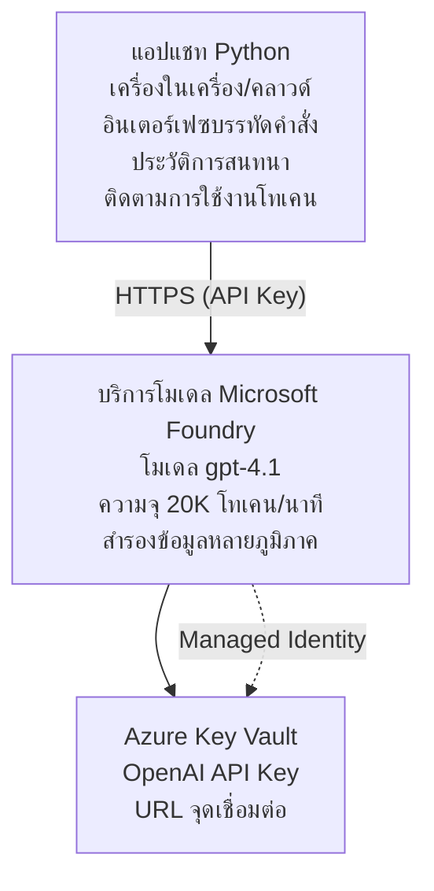

# แอปพลิเคชันแชท Microsoft Foundry Models

**เส้นทางการเรียนรู้:** ระดับกลาง ⭐⭐ | **เวลา:** 35-45 นาที | **ค่าใช้จ่าย:** $50-200/เดือน

แอปพลิเคชันแชท Microsoft Foundry Models ครบวงจรที่ติดตั้งโดยใช้ Azure Developer CLI (azd) ตัวอย่างนี้สาธิตการติดตั้ง gpt-4.1 การเข้าถึง API อย่างปลอดภัย และอินเทอร์เฟซแชทที่เรียบง่าย

## 🎯 สิ่งที่คุณจะได้เรียนรู้

- ติดตั้ง Microsoft Foundry Models Service ด้วยโมเดล gpt-4.1  
- ปกป้องคีย์ API ของ OpenAI ด้วย Key Vault  
- สร้างอินเทอร์เฟซแชทง่ายๆ ด้วย Python  
- ตรวจสอบการใช้งานโทเค็นและค่าใช้จ่าย  
- นำการจำกัดอัตราและการจัดการข้อผิดพลาดมาใช้  

## 📦 สิ่งที่รวมอยู่

✅ **Microsoft Foundry Models Service** - การติดตั้งโมเดล gpt-4.1  
✅ **Python Chat App** - อินเทอร์เฟซแชทแบบคำสั่งเรียบง่าย  
✅ **การผสานรวม Key Vault** - การจัดเก็บคีย์ API อย่างปลอดภัย  
✅ **เทมเพลต ARM** - โครงสร้างพื้นฐานครบถ้วนในรูปแบบโค้ด  
✅ **การตรวจสอบค่าใช้จ่าย** - การติดตามการใช้โทเค็น  
✅ **การจำกัดอัตรา** - ป้องกันการใช้โควต้าเกิน  

## สถาปัตยกรรม


## ความต้องการเบื้องต้น

### สิ่งที่ต้องมี

- **Azure Developer CLI (azd)** - [คู่มือการติดตั้ง](https://learn.microsoft.com/azure/developer/azure-developer-cli/install-azd)  
- **การสมัครสมาชิก Azure** ที่มีการเข้าถึง OpenAI - [ขอการเข้าถึง](https://aka.ms/oai/access)  
- **Python 3.9 ขึ้นไป** - [ติดตั้ง Python](https://www.python.org/downloads/)  

### ตรวจสอบความพร้อม

```bash
# ตรวจสอบเวอร์ชัน azd (ต้อง 1.5.0 หรือสูงกว่า)
azd version

# ตรวจสอบการเข้าสู่ระบบ Azure
azd auth login

# ตรวจสอบเวอร์ชัน Python
python --version  # หรือ python3 --version

# ตรวจสอบการเข้าถึง OpenAI (ตรวจสอบใน Azure Portal)
az cognitiveservices account list-skus \
  --kind OpenAI \
  --location eastus
```

> **⚠️ สำคัญ:** Microsoft Foundry Models ต้องได้รับการอนุมัติแอปพลิเคชัน หากคุณยังไม่ได้สมัคร โปรดไปที่ [aka.ms/oai/access](https://aka.ms/oai/access) โดยปกติจะใช้เวลาการอนุมัติ 1-2 วันทำการ

## ⏱️ ระยะเวลาดำเนินการติดตั้ง

| ขั้นตอน | ระยะเวลา | สิ่งที่จะเกิดขึ้น |
|-------|----------|--------------|
| ตรวจสอบความพร้อม | 2-3 นาที | ตรวจสอบโควต้าการใช้ OpenAI |
| ติดตั้งโครงสร้างพื้นฐาน | 8-12 นาที | สร้าง OpenAI, Key Vault, การติดตั้งโมเดล |
| กำหนดค่าแอปพลิเคชัน | 2-3 นาที | ตั้งค่าสภาพแวดล้อมและการติดตั้ง |
| **รวม** | **12-18 นาที** | พร้อมใช้งานแชทกับ gpt-4.1 |

**หมายเหตุ:** การติดตั้ง OpenAI ครั้งแรกอาจใช้เวลานานขึ้นเนื่องจากการจัดเตรียมโมเดล  

## เริ่มต้นอย่างรวดเร็ว

```bash
# นำทางไปยังตัวอย่าง
cd examples/azure-openai-chat

# เริ่มต้นสภาพแวดล้อม
azd env new myopenai

# ปรับใช้ทุกอย่าง (โครงสร้างพื้นฐาน + การกำหนดค่า)
azd up
# คุณจะได้รับแจ้งให้:
# 1. เลือกการสมัครสมาชิก Azure
# 2. เลือกตำแหน่งที่มี OpenAI ให้บริการ (เช่น eastus, eastus2, westus)
# 3. รอ 12-18 นาทีสำหรับการปรับใช้

# ติดตั้ง dependencies ของ Python
pip install -r requirements.txt

# เริ่มแชทได้เลย!
python chat.py
```

**ผลลัพธ์ที่คาดหวัง:**  
```
🤖 Microsoft Foundry Models Chat Application
Connected to: gpt-4.1 (eastus)
Type your message (or 'quit' to exit)

You: Hello! Tell me about Microsoft Foundry Models.
Assistant: Microsoft Foundry Models Service provides REST API access to OpenAI's powerful language models including gpt-4.1, GPT-3.5-Turbo, and Embeddings...

[Tokens used: 145 | Estimated cost: $0.0044]
```

## ✅ ตรวจสอบการติดตั้ง

### ขั้นตอนที่ 1: ตรวจสอบทรัพยากร Azure

```bash
# ดูทรัพยากรที่ถูกปรับใช้
azd show

# ผลลัพธ์ที่คาดหวังแสดง:
# - บริการ OpenAI: (ชื่อทรัพยากร)
# - Key Vault: (ชื่อทรัพยากร)
# - การปรับใช้: gpt-4.1
# - ที่ตั้ง: eastus (หรือภูมิภาคที่คุณเลือก)
```

### ขั้นตอนที่ 2: ทดสอบ OpenAI API

```bash
# รับจุดเชื่อมต่อ OpenAI และคีย์
OPENAI_ENDPOINT=$(azd env get-value AZURE_OPENAI_ENDPOINT)
OPENAI_KEY=$(azd env get-value AZURE_OPENAI_API_KEY)

# ทดสอบการเรียกใช้ API
curl "$OPENAI_ENDPOINT/openai/deployments/gpt-4.1/chat/completions?api-version=2024-08-01-preview" \
  -H "Content-Type: application/json" \
  -H "api-key: $OPENAI_KEY" \
  -d '{
    "messages": [{"role": "user", "content": "Say hello!"}],
    "max_tokens": 50
  }'
```

**ผลตอบกลับที่คาดหวัง:**  
```json
{
  "choices": [
    {
      "message": {
        "role": "assistant",
        "content": "Hello! How can I assist you today?"
      }
    }
  ],
  "usage": {
    "prompt_tokens": 8,
    "completion_tokens": 9,
    "total_tokens": 17
  }
}
```

### ขั้นตอนที่ 3: ตรวจสอบการเข้าถึง Key Vault

```bash
# แสดงรายการความลับใน Key Vault
KV_NAME=$(azd env get-value AZURE_KEY_VAULT_NAME)

az keyvault secret list \
  --vault-name $KV_NAME \
  --query "[].name" \
  --output table
```

**ความลับที่คาดหวัง:**  
- `openai-api-key`  
- `openai-endpoint`  

**เกณฑ์ความสำเร็จ:**  
- ✅ บริการ OpenAI ถูกติดตั้งด้วย gpt-4.1  
- ✅ การเรียก API คืนค่าสำเร็จ  
- ✅ ความลับถูกเก็บใน Key Vault  
- ✅ การติดตามการใช้โทเค็นทำงานได้  

## โครงสร้างโปรเจกต์

```
azure-openai-chat/
├── README.md                   ✅ This guide
├── azure.yaml                  ✅ AZD configuration
├── infra/                      ✅ Infrastructure as Code
│   ├── main.bicep             ✅ Main Bicep template
│   ├── main.parameters.json   ✅ Parameters
│   └── openai.bicep           ✅ OpenAI resource definition
├── src/                        ✅ Application code
│   ├── chat.py                ✅ Chat interface
│   ├── config.py              ✅ Configuration loader
│   └── requirements.txt       ✅ Python dependencies
└── .gitignore                  ✅ Git ignore rules
```

## คุณสมบัติของแอปพลิเคชัน

### อินเทอร์เฟซแชท (`chat.py`)

แอปพลิเคชันแชทประกอบด้วย:

- **ประวัติการสนทนา** - รักษาบริบทข้ามข้อความ  
- **การนับโทเค็น** - ติดตามการใช้งานและประมาณค่าใช้จ่าย  
- **การจัดการข้อผิดพลาด** - จัดการอย่างเรียบร้อยกับข้อจำกัดอัตราและข้อผิดพลาดของ API  
- **การประมาณค่าใช้จ่าย** - คำนวณค่าใช้จ่ายตามเวลาจริงต่อข้อความ  
- **สนับสนุนการสตรีม** - ตัวเลือกสำหรับการตอบสนองแบบสตรีม  

### คำสั่ง

ขณะสนทนา คุณสามารถใช้:  
- `quit` หรือ `exit` - สิ้นสุดการใช้งาน  
- `clear` - ล้างประวัติการสนทนา  
- `tokens` - แสดงจำนวนการใช้โทเค็นรวม  
- `cost` - แสดงค่าใช้จ่ายโดยประมาณรวม  

### การกำหนดค่า (`config.py`)

โหลดการตั้งค่าจากตัวแปรสภาพแวดล้อม:  
```python
AZURE_OPENAI_ENDPOINT  # จาก Key Vault
AZURE_OPENAI_API_KEY   # จาก Key Vault
AZURE_OPENAI_MODEL     # ค่าเริ่มต้น: gpt-4.1
AZURE_OPENAI_MAX_TOKENS # ค่าเริ่มต้น: 800
```

## ตัวอย่างการใช้งาน

### แชทง่ายๆ

```bash
python chat.py
```

### แชทกับโมเดลที่กำหนดเอง

```bash
export AZURE_OPENAI_MODEL=gpt-35-turbo
python chat.py
```

### แชทแบบสตรีม

```bash
python chat.py --stream
```

### ตัวอย่างการสนทนา

```
You: Explain Microsoft Foundry Models Service in 3 sentences.
Assistant: Microsoft Foundry Models Service is Microsoft Azure's cloud platform offering 
that provides access to OpenAI's powerful language models. It enables developers 
to integrate capabilities like gpt-4.1 into their applications with enterprise-grade 
security and compliance. The service includes features for content filtering, 
abuse monitoring, and responsible AI practices.

[Tokens used: 89 | Estimated cost: $0.0027]

You: What models are available?
Assistant: Microsoft Foundry Models Service offers several model families including gpt-4.1 
(most capable), GPT-3.5-Turbo (faster and cost-effective), and Embeddings models 
for vector search. Each model has different capabilities, pricing, and token limits.

[Tokens used: 67 | Estimated cost: $0.0020]

Total session: 156 tokens | $0.0047
```

## การจัดการค่าใช้จ่าย

### ราคาต่อโทเค็น (gpt-4.1)

| โมเดล | ขาเข้า (ต่อ 1K โทเค็น) | ขาออก (ต่อ 1K โทเค็น) |
|-------|----------------------|------------------------|
| gpt-4.1 | $0.03 | $0.06 |
| GPT-3.5-Turbo | $0.0015 | $0.002 |

### ค่าใช้จ่ายต่อเดือนโดยประมาณ

ขึ้นอยู่กับรูปแบบการใช้งาน:

| ระดับการใช้งาน | ข้อความ/วัน | โทเค็น/วัน | ค่าใช้จ่ายรายเดือน |
|-------------|--------------|------------|--------------|
| **เบา** | 20 ข้อความ | 3,000 โทเค็น | $3-5 |
| **ปานกลาง** | 100 ข้อความ | 15,000 โทเค็น | $15-25 |
| **หนัก** | 500 ข้อความ | 75,000 โทเค็น | $75-125 |

**ค่าโครงสร้างพื้นฐานพื้นฐาน:** $1-2/เดือน (Key Vault + คอมพิวต์ขั้นต่ำ)

### เคล็ดลับการเพิ่มประสิทธิภาพค่าใช้จ่าย

```bash
# 1. ใช้ GPT-3.5-Turbo สำหรับงานที่ง่ายกว่า (ถูกกว่าถึง 20 เท่า)
export AZURE_OPENAI_MODEL=gpt-35-turbo

# 2. ลดจำนวนโทเค็นสูงสุดเพื่อให้คำตอบสั้นลง
export AZURE_OPENAI_MAX_TOKENS=400

# 3. ตรวจสอบการใช้โทเค็น
python chat.py --show-tokens

# 4. ตั้งค่าการแจ้งเตือนงบประมาณ
az consumption budget create \
  --budget-name "openai-budget" \
  --amount 50 \
  --time-grain Monthly
```

## การตรวจสอบ

### ดูการใช้งานโทเค็น

```bash
# ใน Azure Portal:
# OpenAI Resource → Metrics → เลือก "Token Transaction"

# หรือผ่าน Azure CLI:
az monitor metrics list \
  --resource $(azd env get-value AZURE_OPENAI_RESOURCE_ID) \
  --metric "TokenTransaction" \
  --start-time $(date -u -d '1 hour ago' '+%Y-%m-%dT%H:%M:%S') \
  --interval PT1M
```

### ดูบันทึก API

```bash
# สตรีมบันทึกการวินิจฉัย
az monitor diagnostic-settings create \
  --resource $(azd env get-value AZURE_OPENAI_RESOURCE_ID) \
  --name openai-logs \
  --logs '[{"category": "Audit", "enabled": true}]' \
  --workspace $(azd env get-value LOG_ANALYTICS_WORKSPACE_ID)

# บันทึกการสืบค้น
az monitor log-analytics query \
  --workspace $(azd env get-value LOG_ANALYTICS_WORKSPACE_ID) \
  --analytics-query "AzureDiagnostics | where Category == 'Audit' | top 10 by TimeGenerated"
```

## การแก้ไขปัญหา

### ปัญหา: "เข้าถึงถูกปฏิเสธ"

**อาการ:** 403 Forbidden เมื่อเรียก API

**วิธีแก้ไข:**  
```bash
# 1. ตรวจสอบการอนุมัติการเข้าถึง OpenAI
az cognitiveservices account show \
  --name $(azd env get-value AZURE_OPENAI_NAME) \
  --resource-group $(azd env get-value AZURE_RESOURCE_GROUP)

# 2. ตรวจสอบว่า API key ถูกต้อง
azd env get-value AZURE_OPENAI_API_KEY

# 3. ตรวจสอบรูปแบบ URL ของ endpoint
azd env get-value AZURE_OPENAI_ENDPOINT
# ควรเป็น: https://[name].openai.azure.com/
```

### ปัญหา: "เกินขีดจำกัดอัตรา"

**อาการ:** 429 Too Many Requests

**วิธีแก้ไข:**  
```bash
# 1. ตรวจสอบโควต้าในปัจจุบัน
az cognitiveservices account deployment show \
  --name $(azd env get-value AZURE_OPENAI_NAME) \
  --resource-group $(azd env get-value AZURE_RESOURCE_GROUP) \
  --deployment-name gpt-4.1

# 2. ขอเพิ่มโควต้า (ถ้าจำเป็น)
# ไปที่ Azure Portal → แหล่งข้อมูล OpenAI → โควต้า → ขอเพิ่ม

# 3. ใช้ตรรกะการลองใหม่ (มีใน chat.py แล้ว)
# แอปพลิเคชันจะลองใหม่โดยอัตโนมัติด้วยการหน่วงเวลาที่เพิ่มขึ้นแบบเอ็กซ์โพเนนเชียล
```

### ปัญหา: "ไม่พบโมเดล"

**อาการ:** ข้อผิดพลาด 404 สำหรับการติดตั้ง

**วิธีแก้ไข:**  
```bash
# 1. แสดงรายการการติดตั้งที่มีอยู่
az cognitiveservices account deployment list \
  --name $(azd env get-value AZURE_OPENAI_NAME) \
  --resource-group $(azd env get-value AZURE_RESOURCE_GROUP)

# 2. ตรวจสอบชื่อโมเดลในสภาพแวดล้อม
echo $AZURE_OPENAI_MODEL

# 3. อัปเดตเป็นชื่อการติดตั้งที่ถูกต้อง
export AZURE_OPENAI_MODEL=gpt-4.1  # หรือ gpt-35-turbo
```

### ปัญหา: ความหน่วงสูง

**อาการ:** เวลาในการตอบสนองช้า (>5 วินาที)

**วิธีแก้ไข:**  
```bash
# 1. ตรวจสอบความล่าช้าตามภูมิภาค
# โพสต์ไปยังภูมิภาคที่อยู่ใกล้ผู้ใช้ที่สุด

# 2. ลด max_tokens เพื่อการตอบสนองที่รวดเร็วขึ้น
export AZURE_OPENAI_MAX_TOKENS=400

# 3. ใช้การสตรีมเพื่อประสบการณ์ผู้ใช้ที่ดีขึ้น
python chat.py --stream
```

## แนวทางปฏิบัติด้านความปลอดภัยที่ดีที่สุด

### 1. ปกป้องคีย์ API

```bash
# อย่าบันทึกคีย์ลงในระบบควบคุมเวอร์ชัน
# ใช้ Key Vault (ตั้งค่าไว้แล้ว)

# หมุนเวียนคีย์เป็นประจำ
az cognitiveservices account keys regenerate \
  --name $(azd env get-value AZURE_OPENAI_NAME) \
  --resource-group $(azd env get-value AZURE_RESOURCE_GROUP) \
  --key-name key1
```

### 2. นำนโยบายกรองเนื้อหาไปใช้

```python
# Microsoft Foundry Models มีการกรองเนื้อหาในตัว
# กำหนดค่าใน Azure Portal:
# OpenAI Resource → ตัวกรองเนื้อหา → สร้างตัวกรองที่กำหนดเอง

# หมวดหมู่: เกลียดชัง, ทางเพศ, ความรุนแรง, การทำร้ายตัวเอง
# ระดับ: การกรองต่ำ, กลาง, สูง
```

### 3. ใช้ Managed Identity (สำหรับการใช้งานจริง)

```bash
# สำหรับการใช้งานจริง ให้ใช้ Managed Identity
# แทนการใช้ API Keys (ต้องโฮสต์แอปบน Azure)

# อัปเดต infra/openai.bicep ให้รวม:
# identity: { type: 'SystemAssigned' }
```

## การพัฒนา

### รันในเครื่อง

```bash
# ติดตั้ง dependencies
pip install -r src/requirements.txt

# ตั้งค่าตัวแปรแวดล้อม
export AZURE_OPENAI_ENDPOINT="https://[name].openai.azure.com/"
export AZURE_OPENAI_API_KEY="your-api-key"
export AZURE_OPENAI_MODEL="gpt-4.1"

# รันแอปพลิเคชัน
python src/chat.py
```

### รันทดสอบ

```bash
# ติดตั้ง dependencies สำหรับการทดสอบ
pip install pytest pytest-cov

# รันการทดสอบ
pytest tests/ -v

# พร้อมการวัดความครอบคลุม
pytest tests/ --cov=src --cov-report=html
```

### อัปเดตการติดตั้งโมเดล

```bash
# ปล่อยใช้งานเวอร์ชันของโมเดลที่แตกต่างกัน
az cognitiveservices account deployment create \
  --name $(azd env get-value AZURE_OPENAI_NAME) \
  --resource-group $(azd env get-value AZURE_RESOURCE_GROUP) \
  --deployment-name gpt-35-turbo \
  --model-name gpt-35-turbo \
  --model-version "0613" \
  --model-format OpenAI \
  --sku-capacity 20 \
  --sku-name "Standard"
```

## การล้างระบบ

```bash
# ลบทรัพยากร Azure ทั้งหมด
azd down --force --purge

# สิ่งนี้จะลบ:
# - บริการ OpenAI
# - Key Vault (พร้อมการลบแบบนุ่มนวล 90 วัน)
# - กลุ่มทรัพยากร
# - การปรับใช้และการตั้งค่าทั้งหมด
```

## ขั้นตอนถัดไป

### ขยายตัวอย่างนี้

1. **เพิ่มอินเทอร์เฟซเว็บ** - สร้าง frontend ด้วย React/Vue  
   ```bash
   # เพิ่มบริการ frontend ลงในไฟล์ azure.yaml
   # นำไปใช้กับ Azure Static Web Apps
   ```

2. **ดำเนินการ RAG** - เพิ่มการค้นหาเอกสารด้วย Azure AI Search  
   ```python
   # รวม Azure Cognitive Search
   # อัปโหลดเอกสารและสร้างดัชนีเวกเตอร์
   ```

3. **เพิ่มการเรียกฟังก์ชัน** - เปิดใช้งานการใช้เครื่องมือ  
   ```python
   # กำหนดฟังก์ชันใน chat.py
   # ให้ gpt-4.1 เรียกใช้ API ภายนอก
   ```

4. **รองรับโมเดลหลายตัว** - ติดตั้งโมเดลหลายตัวพร้อมกัน  
   ```bash
   # เพิ่มโมเดล gpt-35-turbo และ embeddings
   # ดำเนินการตรรกะการเปลี่ยนเส้นทางโมเดล
   ```

### ตัวอย่างที่เกี่ยวข้อง

- **[Retail Multi-Agent](../retail-scenario.md)** - สถาปัตยกรรมตัวแทนหลายตัวขั้นสูง  
- **[Database App](../../../../examples/database-app)** - เพิ่มที่จัดเก็บข้อมูลถาวร  
- **[Container Apps](../../../../examples/container-app)** - ติดตั้งเป็นบริการคอนเทนเนอร์  

### แหล่งเรียนรู้

- 📚 [หลักสูตร AZD สำหรับผู้เริ่มต้น](../../README.md) - หน้าหลักหลักสูตร  
- 📚 [เอกสาร Microsoft Foundry Models](https://learn.microsoft.com/azure/ai-services/openai/) - เอกสารอย่างเป็นทางการ  
- 📚 [เอกสารอ้างอิง OpenAI API](https://platform.openai.com/docs/api-reference) - รายละเอียด API  
- 📚 [AI มีความรับผิดชอบ](https://www.microsoft.com/ai/responsible-ai) - แนวทางปฏิบัติที่ดีที่สุด  

## แหล่งข้อมูลเพิ่มเติม

### เอกสาร
- **[Microsoft Foundry Models Service](https://learn.microsoft.com/azure/ai-services/openai/)** - คู่มือครบถ้วน  
- **[โมเดล gpt-4.1](https://learn.microsoft.com/azure/ai-services/openai/concepts/models)** - ความสามารถโมเดล  
- **[กรองเนื้อหา](https://learn.microsoft.com/azure/ai-services/openai/concepts/content-filter)** - ฟีเจอร์ความปลอดภัย  
- **[Azure Developer CLI](https://learn.microsoft.com/azure/developer/azure-developer-cli/)** - คู่มือ azd  

### บทแนะนำ
- **[เริ่มต้นใช้งาน OpenAI อย่างรวดเร็ว](https://learn.microsoft.com/azure/ai-services/openai/quickstart)** - การติดตั้งครั้งแรก  
- **[การสร้างแชทคอมพลีชัน](https://learn.microsoft.com/azure/ai-services/openai/how-to/chatgpt)** - การสร้างแอปแชท  
- **[การเรียกฟังก์ชัน](https://learn.microsoft.com/azure/ai-services/openai/how-to/function-calling)** - ฟีเจอร์ขั้นสูง  

### เครื่องมือ
- **[Microsoft Foundry Models Studio](https://oai.azure.com/)** - สนามทดลองบนเว็บ  
- **[คู่มือออกแบบพรอมต์](https://platform.openai.com/docs/guides/prompt-engineering)** - เขียนพรอมต์ที่ดียิ่งขึ้น  
- **[เครื่องคิดเลขโทเค็น](https://platform.openai.com/tokenizer)** - ประมาณการการใช้โทเค็น  

### ชุมชน
- **[Discord Azure AI](https://discord.gg/azure)** - ขอความช่วยเหลือจากชุมชน  
- **[GitHub Discussions](https://github.com/Azure-Samples/openai/discussions)** - ฟอรัมถามตอบ  
- **[บล็อก Azure](https://azure.microsoft.com/blog/tag/azure-openai-service/)** - ข่าวสารล่าสุด  

---

**🎉 สำเร็จ!** คุณได้ติดตั้ง Microsoft Foundry Models และสร้างแอปพลิเคชันแชทที่ใช้งานได้ เริ่มต้นสำรวจความสามารถของ gpt-4.1 และทดลองใช้พรอมต์และกรณีการใช้งานต่างๆ

**มีคำถาม?** [เปิด issue](https://github.com/microsoft/AZD-for-beginners/issues) หรือดู [คำถามที่พบบ่อย](../../resources/faq.md)

**แจ้งเตือนค่าใช้จ่าย:** อย่าลืมรัน `azd down` เมื่อทดสอบเสร็จเพื่อหลีกเลี่ยงค่าใช้จ่ายต่อเนื่อง (~$50-100/เดือนสำหรับการใช้งานที่เปิดใช้งาน)

---

<!-- CO-OP TRANSLATOR DISCLAIMER START -->
**ข้อจำกัดความรับผิดชอบ**:
เอกสารนี้ได้รับการแปลโดยใช้บริการแปลภาษา AI [Co-op Translator](https://github.com/Azure/co-op-translator) แม้เราจะพยายามให้มีความถูกต้อง แต่โปรดทราบว่าการแปลอัตโนมัติอาจมีข้อผิดพลาดหรือความไม่แม่นยำ เอกสารต้นฉบับในภาษาดั้งเดิมถือเป็นแหล่งข้อมูลที่น่าเชื่อถือ สำหรับข้อมูลที่สำคัญ แนะนำให้ใช้บริการแปลโดยมนุษย์มืออาชีพ เราไม่รับผิดชอบต่อความเข้าใจผิดหรือการตีความผิดใด ๆ ที่เกิดขึ้นจากการใช้การแปลนี้
<!-- CO-OP TRANSLATOR DISCLAIMER END -->