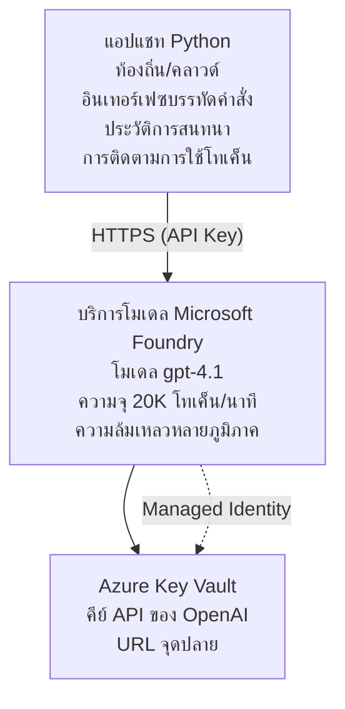

# แอปพลิเคชันแชท Microsoft Foundry Models

**เส้นทางการเรียนรู้:** ระดับกลาง ⭐⭐ | **เวลา:** 35-45 นาที | **ค่าใช้จ่าย:** $50-200/เดือน

แอปพลิเคชันแชท Microsoft Foundry Models แบบครบวงจรที่ปรับใช้โดยใช้ Azure Developer CLI (azd) ตัวอย่างนี้สาธิตการปรับใช้ gpt-4.1 การเข้าถึง API อย่างปลอดภัย และอินเทอร์เฟซแชทที่ง่าย

## 🎯 สิ่งที่จะได้เรียนรู้

- ปรับใช้บริการ Microsoft Foundry Models ด้วยโมเดล gpt-4.1  
- ปกป้องคีย์ API OpenAI ด้วย Key Vault  
- สร้างอินเทอร์เฟซแชทง่าย ๆ ด้วย Python  
- ตรวจสอบการใช้งานโทเค็นและค่าใช้จ่าย  
- ใช้งานการจำกัดอัตราและจัดการข้อผิดพลาด  

## 📦 สิ่งที่รวมมาในนี้

✅ **บริการ Microsoft Foundry Models** - การปรับใช้โมเดล gpt-4.1  
✅ **แอปแชท Python** - อินเทอร์เฟซแชทแบบบรรทัดคำสั่งง่าย ๆ  
✅ **การผสานรวม Key Vault** - การจัดเก็บคีย์ API อย่างปลอดภัย  
✅ **แม่แบบ ARM** - โครงสร้างพื้นฐานสมบูรณ์แบบในรูปแบบโค้ด  
✅ **การตรวจสอบค่าใช้จ่าย** - ติดตามการใช้โทเค็น  
✅ **การจำกัดอัตรา** - ป้องกันการใช้โควต้าเกิน  

## สถาปัตยกรรม



## ข้อกำหนดเบื้องต้น

### จำเป็นต้องมี

- **Azure Developer CLI (azd)** - [คู่มือการติดตั้ง](https://learn.microsoft.com/azure/developer/azure-developer-cli/install-azd)  
- **บัญชีสมาชิก Azure** ที่มีสิทธิ์เข้าถึง OpenAI - [ขอสิทธิ์เข้าถึง](https://aka.ms/oai/access)  
- **Python 3.9+** - [ติดตั้ง Python](https://www.python.org/downloads/)  

### ตรวจสอบข้อกำหนดเบื้องต้น

```bash
# ตรวจสอบเวอร์ชัน azd (ต้องเป็น 1.5.0 หรือสูงกว่า)
azd version

# ตรวจสอบการเข้าสู่ระบบ Azure
azd auth login

# ตรวจสอบเวอร์ชัน Python
python --version  # หรือ python3 --version

# ตรวจสอบการเข้าถึง OpenAI (ตรวจสอบใน Azure Portal)
az cognitiveservices account list-skus \
  --kind OpenAI \
  --location eastus
```

> **⚠️ สำคัญ:** Microsoft Foundry Models ต้องได้รับการอนุมัติแอปพลิเคชัน หากยังไม่ได้สมัคร ให้ไปที่ [aka.ms/oai/access](https://aka.ms/oai/access) การอนุมัติมักใช้เวลาประมาณ 1-2 วันทำการ

## ⏱️ ระยะเวลาในการปรับใช้

| ขั้นตอน | ระยะเวลา | สิ่งที่จะเกิดขึ้น |
|---------|----------|-------------------|
| ตรวจสอบข้อกำหนดเบื้องต้น | 2-3 นาที | ตรวจสอบโควต้า OpenAI ที่มีอยู่ |
| ปรับใช้โครงสร้างพื้นฐาน | 8-12 นาที | สร้าง OpenAI, Key Vault, การปรับใช้โมเดล |
| กำหนดค่าของแอปพลิเคชัน | 2-3 นาที | ตั้งค่าสภาพแวดล้อมและไลบรารี |
| **รวมทั้งหมด** | **12-18 นาที** | พร้อมสำหรับการแชทด้วย gpt-4.1 |

**หมายเหตุ:** การปรับใช้ OpenAI เป็นครั้งแรกอาจใช้เวลานานขึ้นเนื่องจากต้องจัดสรรโมเดล

## เริ่มต้นอย่างรวดเร็ว

```bash
# นำทางไปยังตัวอย่าง
cd examples/azure-openai-chat

# เริ่มต้นสภาพแวดล้อม
azd env new myopenai

# ติดตั้งทุกอย่าง (โครงสร้างพื้นฐาน + การกำหนดค่า)
azd up
# คุณจะถูกถามให้:
# 1. เลือกการสมัครใช้งาน Azure
# 2. เลือกตำแหน่งที่มี OpenAI ให้บริการ (เช่น eastus, eastus2, westus)
# 3. รอ 12-18 นาทีสำหรับการติดตั้ง

# ติดตั้งไลบรารี Python ที่จำเป็น
pip install -r requirements.txt

# เริ่มแชทได้เลย!
python chat.py
```

**ผลลัพธ์ที่คาดหวัง:**  
```
🤖 Microsoft Foundry Models Chat Application
Connected to: gpt-4.1 (eastus)
Type your message (or 'quit' to exit)

You: Hello! Tell me about Microsoft Foundry Models.
Assistant: Microsoft Foundry Models Service provides REST API access to OpenAI's powerful language models including gpt-4.1, GPT-3.5-Turbo, and Embeddings...

[Tokens used: 145 | Estimated cost: $0.0044]
```

## ✅ ตรวจสอบการปรับใช้

### ขั้นตอนที่ 1: ตรวจสอบทรัพยากร Azure

```bash
# ดูทรัพยากรที่ถูกปรับใช้
azd show

# เอาต์พุตที่คาดหวังแสดง:
# - บริการ OpenAI: (ชื่อทรัพยากร)
# - Key Vault: (ชื่อทรัพยากร)
# - การปรับใช้: gpt-4.1
# - ตำแหน่ง: eastus (หรือภูมิภาคที่คุณเลือก)
```

### ขั้นตอนที่ 2: ทดสอบ OpenAI API

```bash
# รับจุดสิ้นสุดและคีย์ของ OpenAI
OPENAI_ENDPOINT=$(azd env get-value AZURE_OPENAI_ENDPOINT)
OPENAI_KEY=$(azd env get-value AZURE_OPENAI_API_KEY)

# ทดสอบการเรียก API
curl "$OPENAI_ENDPOINT/openai/deployments/gpt-4.1/chat/completions?api-version=2024-08-01-preview" \
  -H "Content-Type: application/json" \
  -H "api-key: $OPENAI_KEY" \
  -d '{
    "messages": [{"role": "user", "content": "Say hello!"}],
    "max_tokens": 50
  }'
```

**ผลการตอบสนองที่คาดหวัง:**  
```json
{
  "choices": [
    {
      "message": {
        "role": "assistant",
        "content": "Hello! How can I assist you today?"
      }
    }
  ],
  "usage": {
    "prompt_tokens": 8,
    "completion_tokens": 9,
    "total_tokens": 17
  }
}
```

### ขั้นตอนที่ 3: ตรวจสอบการเข้าถึง Key Vault

```bash
# แสดงรายการความลับใน Key Vault
KV_NAME=$(azd env get-value AZURE_KEY_VAULT_NAME)

az keyvault secret list \
  --vault-name $KV_NAME \
  --query "[].name" \
  --output table
```

**ความลับที่คาดว่าจะพบ:**  
- `openai-api-key`  
- `openai-endpoint`  

**เกณฑ์ความสำเร็จ:**  
- ✅ บริการ OpenAI ปรับใช้พร้อมโมเดล gpt-4.1  
- ✅ การเรียก API ส่งคืนผลลัพธ์ที่ถูกต้อง  
- ✅ ค่าลับถูกจัดเก็บใน Key Vault  
- ✅ การติดตามการใช้โทเค็นทำงานได้  

## โครงสร้างโปรเจกต์

```
azure-openai-chat/
├── README.md                   ✅ This guide
├── azure.yaml                  ✅ AZD configuration
├── infra/                      ✅ Infrastructure as Code
│   ├── main.bicep             ✅ Main Bicep template
│   ├── main.parameters.json   ✅ Parameters
│   └── openai.bicep           ✅ OpenAI resource definition
├── src/                        ✅ Application code
│   ├── chat.py                ✅ Chat interface
│   ├── config.py              ✅ Configuration loader
│   └── requirements.txt       ✅ Python dependencies
└── .gitignore                  ✅ Git ignore rules
```

## ฟีเจอร์ของแอปพลิเคชัน

### อินเทอร์เฟซแชท (`chat.py`)

แอปแชทประกอบด้วย:

- **ประวัติสนทนา** - รักษาบริบทข้ามข้อความ  
- **การนับโทเค็น** - ติดตามการใช้งานและประมาณค่าใช้จ่าย  
- **การจัดการข้อผิดพลาด** - จัดการอย่างนุ่มนวลกับการจำกัดอัตราและข้อผิดพลาดของ API  
- **การประเมินค่าใช้จ่าย** - คำนวณค่าใช้จ่ายแบบเรียลไทม์ต่อข้อความ  
- **รองรับการสตรีม** - ตัวเลือกสำหรับการตอบกลับแบบสตรีม  

### คำสั่ง

ขณะสนทนา คุณสามารถใช้:  
- `quit` หรือ `exit` - สิ้นสุดเซสชัน  
- `clear` - ล้างประวัติการสนทนา  
- `tokens` - แสดงจำนวนโทเค็นที่ใช้ทั้งหมด  
- `cost` - แสดงประมาณค่าค่าใช้จ่ายทั้งหมด  

### การกำหนดค่า (`config.py`)

โหลดการกำหนดค่าจากตัวแปรสภาพแวดล้อม:  
```python
AZURE_OPENAI_ENDPOINT  # จาก Key Vault
AZURE_OPENAI_API_KEY   # จาก Key Vault
AZURE_OPENAI_MODEL     # ค่าเริ่มต้น: gpt-4.1
AZURE_OPENAI_MAX_TOKENS # ค่าเริ่มต้น: 800
```

## ตัวอย่างการใช้งาน

### แชทพื้นฐาน

```bash
python chat.py
```

### แชทกับโมเดลกำหนดเอง

```bash
export AZURE_OPENAI_MODEL=gpt-35-turbo
python chat.py
```

### แชทแบบสตรีม

```bash
python chat.py --stream
```

### ตัวอย่างบทสนทนา

```
You: Explain Microsoft Foundry Models Service in 3 sentences.
Assistant: Microsoft Foundry Models Service is Microsoft Azure's cloud platform offering 
that provides access to OpenAI's powerful language models. It enables developers 
to integrate capabilities like gpt-4.1 into their applications with enterprise-grade 
security and compliance. The service includes features for content filtering, 
abuse monitoring, and responsible AI practices.

[Tokens used: 89 | Estimated cost: $0.0027]

You: What models are available?
Assistant: Microsoft Foundry Models Service offers several model families including gpt-4.1 
(most capable), GPT-3.5-Turbo (faster and cost-effective), and Embeddings models 
for vector search. Each model has different capabilities, pricing, and token limits.

[Tokens used: 67 | Estimated cost: $0.0020]

Total session: 156 tokens | $0.0047
```

## การจัดการค่าใช้จ่าย

### ราคาต่อโทเค็น (gpt-4.1)

| โมเดล | การป้อนข้อมูล (ต่อ 1K โทเค็น) | การส่งออก (ต่อ 1K โทเค็น) |
|-------|-------------------------------|-----------------------------|
| gpt-4.1 | $0.03 | $0.06 |
| GPT-3.5-Turbo | $0.0015 | $0.002 |

### ค่าใช้จ่ายโดยประมาณต่อเดือน

อิงจากรูปแบบการใช้งาน:

| ระดับการใช้งาน | ข้อความต่อวัน | โทเค็นต่อวัน | ค่าใช้จ่ายรายเดือน |
|-----------------|---------------|---------------|--------------------|
| **เบา** | 20 ข้อความ | 3,000 โทเค็น | $3-5 |
| **ปานกลาง** | 100 ข้อความ | 15,000 โทเค็น | $15-25 |
| **หนัก** | 500 ข้อความ | 75,000 โทเค็น | $75-125 |

**ค่าใช้จ่ายพื้นฐานโครงสร้างพื้นฐาน:** $1-2/เดือน (Key Vault + กำลังประมวลผลขั้นต่ำ)

### เคล็ดลับการเพิ่มประสิทธิภาพค่าใช้จ่าย

```bash
# 1. ใช้ GPT-3.5-Turbo สำหรับงานที่ง่ายกว่า (ถูกกว่าถึง 20 เท่า)
export AZURE_OPENAI_MODEL=gpt-35-turbo

# 2. ลดจำนวนโทเค็นสูงสุดเพื่อคำตอบที่สั้นลง
export AZURE_OPENAI_MAX_TOKENS=400

# 3. ตรวจสอบการใช้โทเค็น
python chat.py --show-tokens

# 4. ตั้งค่าการแจ้งเตือนงบประมาณ
az consumption budget create \
  --budget-name "openai-budget" \
  --amount 50 \
  --time-grain Monthly
```

## การตรวจสอบ

### ดูการใช้โทเค็น

```bash
# ใน Azure Portal:
# แหล่งข้อมูล OpenAI → เมตริก → เลือก "Token Transaction"

# หรือผ่าน Azure CLI:
az monitor metrics list \
  --resource $(azd env get-value AZURE_OPENAI_RESOURCE_ID) \
  --metric "TokenTransaction" \
  --start-time $(date -u -d '1 hour ago' '+%Y-%m-%dT%H:%M:%S') \
  --interval PT1M
```

### ดูบันทึก API

```bash
# สตรีมบันทึกวินิจฉัย
az monitor diagnostic-settings create \
  --resource $(azd env get-value AZURE_OPENAI_RESOURCE_ID) \
  --name openai-logs \
  --logs '[{"category": "Audit", "enabled": true}]' \
  --workspace $(azd env get-value LOG_ANALYTICS_WORKSPACE_ID)

# บันทึกการสอบถาม
az monitor log-analytics query \
  --workspace $(azd env get-value LOG_ANALYTICS_WORKSPACE_ID) \
  --analytics-query "AzureDiagnostics | where Category == 'Audit' | top 10 by TimeGenerated"
```

## การแก้ไขปัญหา

### ปัญหา: ข้อความ "Access Denied"

**อาการ:** 403 Forbidden เมื่อเรียก API

**วิธีแก้ปัญหา:**  
```bash
# 1. ตรวจสอบการอนุมัติการเข้าถึง OpenAI
az cognitiveservices account show \
  --name $(azd env get-value AZURE_OPENAI_NAME) \
  --resource-group $(azd env get-value AZURE_RESOURCE_GROUP)

# 2. ตรวจสอบว่า API key ถูกต้อง
azd env get-value AZURE_OPENAI_API_KEY

# 3. ตรวจสอบรูปแบบ URL ของ endpoint
azd env get-value AZURE_OPENAI_ENDPOINT
# ควรเป็น: https://[name].openai.azure.com/
```

### ปัญหา: "Rate Limit Exceeded"

**อาการ:** 429 จำนวนคำร้องขอมากเกินไป

**วิธีแก้ปัญหา:**  
```bash
# 1. ตรวจสอบโควตาปัจจุบัน
az cognitiveservices account deployment show \
  --name $(azd env get-value AZURE_OPENAI_NAME) \
  --resource-group $(azd env get-value AZURE_RESOURCE_GROUP) \
  --deployment-name gpt-4.1

# 2. ขอเพิ่มโควตา (ถ้าจำเป็น)
# ไปที่ Azure Portal → OpenAI Resource → Quotas → Request Increase

# 3. ดำเนินการตรรกะการลองใหม่ (มีอยู่แล้วใน chat.py)
# แอปพลิเคชันทำการลองใหม่โดยอัตโนมัติด้วยการหน่วงเวลาขยายตัว
```

### ปัญหา: "Model Not Found"

**อาการ:** ข้อผิดพลาด 404 สำหรับการปรับใช้

**วิธีแก้ปัญหา:**  
```bash
# 1. แสดงรายการดีพลอยเมนต์ที่มีอยู่
az cognitiveservices account deployment list \
  --name $(azd env get-value AZURE_OPENAI_NAME) \
  --resource-group $(azd env get-value AZURE_RESOURCE_GROUP)

# 2. ตรวจสอบชื่อโมเดลในสภาพแวดล้อม
echo $AZURE_OPENAI_MODEL

# 3. อัปเดตเป็นชื่อดีพลอยเมนต์ที่ถูกต้อง
export AZURE_OPENAI_MODEL=gpt-4.1  # หรือ gpt-35-turbo
```

### ปัญหา: ความหน่วงสูง

**อาการ:** ตอบสนองช้า (>5 วินาที)

**วิธีแก้ปัญหา:**  
```bash
# 1. ตรวจสอบความหน่วงของภูมิภาค
# ปรับใช้ในภูมิภาคที่ใกล้ผู้ใช้ที่สุด

# 2. ลด max_tokens เพื่อการตอบสนองที่รวดเร็วขึ้น
export AZURE_OPENAI_MAX_TOKENS=400

# 3. ใช้การสตรีมเพื่อประสบการณ์ผู้ใช้ที่ดีขึ้น
python chat.py --stream
```

## แนวทางปฏิบัติด้านความปลอดภัย

### 1. ปกป้องคีย์ API

```bash
# อย่าทำการคอมมิตกุญแจไปยังระบบควบคุมซอร์สโค้ด
# ใช้ Key Vault (ตั้งค่าไว้แล้ว)

# หมุนกุญแจเป็นประจำ
az cognitiveservices account keys regenerate \
  --name $(azd env get-value AZURE_OPENAI_NAME) \
  --resource-group $(azd env get-value AZURE_RESOURCE_GROUP) \
  --key-name key1
```

### 2. นำการกรองเนื้อหาไปใช้

```python
# Microsoft Foundry Models รวมการกรองเนื้อหาในตัว
# กำหนดค่าใน Azure Portal:
# OpenAI Resource → ตัวกรองเนื้อหา → สร้างตัวกรองกำหนดเอง

# หมวดหมู่: ความเกลียดชัง, เพศ, ความรุนแรง, ทำร้ายตัวเอง
# ระดับ: การกรองต่ำ, กลาง, สูง
```

### 3. ใช้ Managed Identity (สำหรับการผลิต)

```bash
# สำหรับการใช้งานในสภาพแวดล้อมจริง ให้ใช้ Managed Identity
# แทนการใช้ API keys (จำเป็นต้องโฮสต์แอปบน Azure)

# ปรับปรุงไฟล์ infra/openai.bicep ให้รวม:
# identity: { type: 'SystemAssigned' }
```

## การพัฒนา

### รันในเครื่อง

```bash
# ติดตั้ง dependencies
pip install -r src/requirements.txt

# ตั้งค่าตัวแปรสภาพแวดล้อม
export AZURE_OPENAI_ENDPOINT="https://[name].openai.azure.com/"
export AZURE_OPENAI_API_KEY="your-api-key"
export AZURE_OPENAI_MODEL="gpt-4.1"

# รันแอปพลิเคชัน
python src/chat.py
```

### ทดสอบโปรแกรม

```bash
# ติดตั้ง dependencies สำหรับการทดสอบ
pip install pytest pytest-cov

# รันการทดสอบ
pytest tests/ -v

# พร้อมตรวจสอบการครอบคลุม
pytest tests/ --cov=src --cov-report=html
```

### อัปเดตการปรับใช้โมเดล

```bash
# ปล่อยใช้งานเวอร์ชันโมเดลที่แตกต่างกัน
az cognitiveservices account deployment create \
  --name $(azd env get-value AZURE_OPENAI_NAME) \
  --resource-group $(azd env get-value AZURE_RESOURCE_GROUP) \
  --deployment-name gpt-35-turbo \
  --model-name gpt-35-turbo \
  --model-version "0613" \
  --model-format OpenAI \
  --sku-capacity 20 \
  --sku-name "Standard"
```

## การล้างข้อมูล

```bash
# ลบทรัพยากร Azure ทั้งหมด
azd down --force --purge

# สิ่งนี้ลบ:
# - บริการ OpenAI
# - Key Vault (พร้อมการลบแบบนุ่มนวล 90 วัน)
# - กลุ่มทรัพยากร
# - การปรับใช้และการตั้งค่าทั้งหมด
```

## ขั้นตอนถัดไป

### ขยายตัวอย่างนี้

1. **เพิ่มเว็บอินเทอร์เฟซ** - สร้าง frontend ด้วย React/Vue  
   ```bash
   # เพิ่มบริการ frontend ลงใน azure.yaml
   # ปล่อยไปยัง Azure Static Web Apps
   ```

2. **นำ RAG มาใช้** - เพิ่มการค้นหาข้อมูลด้วย Azure AI Search  
   ```python
   # รวม Azure AI Search
   # อัปโหลดเอกสารและสร้างดัชนีเวกเตอร์
   ```

3. **เพิ่มการเรียกฟังก์ชัน** - เปิดใช้งานการใช้เครื่องมือ  
   ```python
   # กำหนดฟังก์ชันในไฟล์ chat.py
   # ให้ gpt-4.1 เรียกใช้ API ภายนอกได้
   ```

4. **รองรับหลายโมเดล** - ปรับใช้โมเดลหลายตัว  
   ```bash
   # เพิ่มโมเดล gpt-35-turbo และ embeddings
   # ดำเนินการตรรกะการกำหนดเส้นทางของโมเดล
   ```

### ตัวอย่างที่เกี่ยวข้อง

- **[Retail Multi-Agent](../retail-scenario.md)** - สถาปัตยกรรมมัลติเอเจนต์ขั้นสูง  
- **[Database App](../../../../examples/database-app)** - เพิ่มการจัดเก็บข้อมูลถาวร  
- **[Container Apps](../../../../examples/container-app)** - ปรับใช้ในรูปแบบบริการคอนเทนเนอร์  

### แหล่งเรียนรู้

- 📚 [หลักสูตร AZD สำหรับผู้เริ่มต้น](../../README.md) - หน้าแรกหลักสูตร  
- 📚 [เอกสาร Microsoft Foundry Models](https://learn.microsoft.com/azure/ai-services/openai/) - เอกสารอย่างเป็นทางการ  
- 📚 [อ้างอิง OpenAI API](https://platform.openai.com/docs/api-reference) - รายละเอียด API  
- 📚 [Responsible AI](https://www.microsoft.com/ai/responsible-ai) - แนวทางปฏิบัติที่ดีที่สุด  

## แหล่งข้อมูลเพิ่มเติม

### เอกสาร  
- **[บริการ Microsoft Foundry Models](https://learn.microsoft.com/azure/ai-services/openai/)** - คู่มือครบถ้วน  
- **[โมเดล gpt-4.1](https://learn.microsoft.com/azure/ai-services/openai/concepts/models)** - ความสามารถของโมเดล  
- **[การกรองเนื้อหา](https://learn.microsoft.com/azure/ai-services/openai/concepts/content-filter)** - คุณสมบัติความปลอดภัย  
- **[Azure Developer CLI](https://learn.microsoft.com/azure/developer/azure-developer-cli/)** - เอกสารอ้างอิง azd  

### บทช่วยสอน  
- **[OpenAI Quickstart](https://learn.microsoft.com/azure/ai-services/openai/quickstart)** - การปรับใช้ครั้งแรก  
- **[Chat Completions](https://learn.microsoft.com/azure/ai-services/openai/how-to/chatgpt)** - การสร้างแอปแชท  
- **[Function Calling](https://learn.microsoft.com/azure/ai-services/openai/how-to/function-calling)** - ฟีเจอร์ขั้นสูง  

### เครื่องมือ  
- **[Microsoft Foundry Models Studio](https://oai.azure.com/)** - สนามเด็กเล่นออนไลน์  
- **[คู่มือ Prompt Engineering](https://platform.openai.com/docs/guides/prompt-engineering)** - การเขียนพรอมต์ที่ดียิ่งขึ้น  
- **[เครื่องคำนวณโทเค็น](https://platform.openai.com/tokenizer)** - ประเมินการใช้โทเค็น  

### ชุมชน  
- **[Azure AI Discord](https://discord.gg/azure)** - ขอความช่วยเหลือจากชุมชน  
- **[GitHub Discussions](https://github.com/Azure-Samples/openai/discussions)** - ฟอรัมถามตอบ  
- **[บล็อก Azure](https://azure.microsoft.com/blog/tag/azure-openai-service/)** - การอัปเดตล่าสุด  

---

**🎉 สำเร็จ!** คุณได้ปรับใช้ Microsoft Foundry Models และสร้างแอปแชทที่ใช้งานได้แล้ว เริ่มสำรวจความสามารถของ gpt-4.1 และทดลองใช้งานพรอมต์และกรณีใช้งานที่หลากหลาย

**มีคำถาม?** [เปิดปัญหา](https://github.com/microsoft/AZD-for-beginners/issues) หรือดูใน [คำถามที่พบบ่อย](../../resources/faq.md)

**แจ้งเตือนค่าใช้จ่าย:** อย่าลืมรัน `azd down` เมื่อตรวจสอบเสร็จเพื่อหลีกเลี่ยงค่าธรรมเนียมที่เกิดขึ้นอย่างต่อเนื่อง (~$50-100/เดือนสำหรับการใช้งานจริง)

---

<!-- CO-OP TRANSLATOR DISCLAIMER START -->
**ปฏิเสธความรับผิดชอบ**:
เอกสารนี้ได้รับการแปลโดยใช้บริการแปลภาษา AI [Co-op Translator](https://github.com/Azure/co-op-translator) ขณะที่เราพยายามให้ความถูกต้อง โปรดทราบว่าการแปลโดยอัตโนมัติอาจมีข้อผิดพลาดหรือความไม่ถูกต้อง เอกสารต้นฉบับในภาษาต้นทางควรถูกพิจารณาเป็นแหล่งข้อมูลที่เชื่อถือได้ สำหรับข้อมูลที่สำคัญ แนะนำให้ใช้การแปลโดยมนุษย์มืออาชีพ เราไม่รับผิดชอบต่อความเข้าใจผิดหรือการตีความที่ผิดพลาดที่เกิดขึ้นจากการใช้การแปลนี้
<!-- CO-OP TRANSLATOR DISCLAIMER END -->