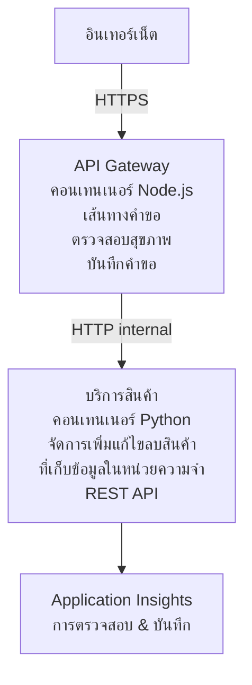

# สถาปัตยกรรมไมโครเซอร์วิส - ตัวอย่าง Container App

⏱️ **เวลาที่คาดการณ์**: 25-35 นาที | 💰 **ค่าใช้จ่ายโดยประมาณ**: ~$50-100/เดือน | ⭐ **ความซับซ้อน**: ขั้นสูง

สถาปัตยกรรมไมโครเซอร์วิส **ที่เรียบง่ายแต่ใช้งานได้จริง** ซึ่งถูกปรับใช้บน Azure Container Apps โดยใช้ AZD CLI ตัวอย่างนี้สาธิตการสื่อสารระหว่างบริการ การจัดการคอนเทนเนอร์ และการตรวจสอบพร้อมกับการตั้งค่าที่ใช้งานได้จริงของ 2 บริการ

> **📚 วิธีการเรียนรู้**: ตัวอย่างนี้เริ่มต้นด้วยสถาปัตยกรรม 2 บริการขั้นต่ำ (API Gateway + Backend Service) ที่คุณสามารถนำไปปรับใช้และเรียนรู้ได้จริง หลังจากเข้าใจพื้นฐานนี้แล้ว เราจะให้คำแนะนำสำหรับการขยายไปสู่ระบบไมโครเซอร์วิสเต็มรูปแบบ

## สิ่งที่คุณจะได้เรียนรู้

เมื่อทำตัวอย่างนี้จบ คุณจะสามารถ:
- ปรับใช้คอนเทนเนอร์หลายตัวบน Azure Container Apps
- ดำเนินการสื่อสารระหว่างบริการด้วยเครือข่ายภายใน
- กำหนดค่า scaling ตามสภาพแวดล้อมและตรวจสอบสุขภาพ
- ตรวจสอบแอปพลิเคชันแบบกระจายด้วย Application Insights
- เข้าใจรูปแบบการปรับใช้ไมโครเซอร์วิสและแนวทางที่ดีที่สุด
- เรียนรู้การขยายตัวแบบก้าวหน้า จากสถาปัตยกรรมง่ายๆ ไปสู่สถาปัตยกรรมที่ซับซ้อน

## สถาปัตยกรรม

### ระยะที่ 1: สิ่งที่เรากำลังสร้าง (รวมในตัวอย่างนี้)


**ทำไมเริ่มจากของง่าย?**
- ✅ ปรับใช้และเข้าใจได้อย่างรวดเร็ว (25-35 นาที)
- ✅ เรียนรู้รูปแบบไมโครเซอร์วิสหลักๆ โดยไม่ซับซ้อน
- ✅ โค้ดที่ทำงานได้จริงที่คุณสามารถแก้ไขและทดลองได้
- ✅ ค่าใช้จ่ายต่ำสำหรับการเรียนรู้ (~$50-100/เดือน เทียบกับ $300-1400/เดือน)
- ✅ สร้างความมั่นใจก่อนเพิ่มฐานข้อมูลและคิวข้อความ

**อุปมาอุปไมย**: คิดเหมือนกับการเรียนขับรถ คุณเริ่มจากลานจอดรถว่างเปล่า (2 บริการ), เชี่ยวชาญพื้นฐาน จากนั้นจึงก้าวไปสู่การขับในเมือง (5+ บริการพร้อมฐานข้อมูล)

### ระยะที่ 2: การขยายในอนาคต (สถาปัตยกรรมอ้างอิง)

หลังจากที่คุณเข้าใจสถาปัตยกรรม 2 บริการนี้ คุณสามารถขยายไปสู่:

```
Full Architecture (Not Included - For Reference)
├── API Gateway (✅ Included)
├── Product Service (✅ Included)
├── Order Service (🔜 Add next)
├── User Service (🔜 Add next)
├── Notification Service (🔜 Add last)
├── Azure Service Bus (🔜 For async communication)
├── Cosmos DB (🔜 For product persistence)
├── Azure SQL (🔜 For order management)
└── Azure Storage (🔜 For file storage)
```

ดูที่ส่วน "Expansion Guide" ท้ายเอกสารสำหรับคำแนะนำทีละขั้นตอน

## คุณสมบัติที่รวมในตัวอย่างนี้

✅ **การค้นพบบริการ**: ค้นหาบริการแบบ DNS อัตโนมัติระหว่างคอนเทนเนอร์  
✅ **การกระจายโหลด**: การกระจายโหลดในตัวระหว่างรีพลิกา  
✅ **การสเกลอัตโนมัติ**: สเกลแยกกันตาม HTTP request ของแต่ละบริการ  
✅ **การตรวจสอบสุขภาพ**: การตรวจสอบสถานะ liveness และ readiness สำหรับทั้งสองบริการ  
✅ **การบันทึกแบบกระจาย**: บันทึกข้อมูลรวมศูนย์ด้วย Application Insights  
✅ **เครือข่ายภายใน**: การสื่อสารระหว่างบริการที่ปลอดภัย  
✅ **การจัดการคอนเทนเนอร์**: การปรับใช้และสเกลอัตโนมัติ  
✅ **อัปเดตแบบไม่มี Downtime**: อัปเดตแบบ rolling พร้อมการจัดการรีวิชัน  

## ข้อกำหนดเบื้องต้น

### เครื่องมือที่ต้องมี

ก่อนเริ่ม ให้ตรวจสอบว่าคุณติดตั้งเครื่องมือเหล่านี้แล้ว:

1. **[Azure Developer CLI (azd)](https://learn.microsoft.com/azure/developer/azure-developer-cli/install-azd)** (เวอร์ชัน 1.0.0 หรือสูงกว่า)  
   ```bash
   azd version
   # ผลลัพธ์ที่คาดหวัง: azd เวอร์ชัน 1.0.0 หรือสูงกว่า
   ```
  
2. **[Azure CLI](https://learn.microsoft.com/cli/azure/install-azure-cli)** (เวอร์ชัน 2.50.0 หรือสูงกว่า)  
   ```bash
   az --version
   # ผลลัพธ์ที่คาดไว้: azure-cli 2.50.0 หรือสูงกว่า
   ```
  
3. **[Docker](https://www.docker.com/get-started)** (สำหรับพัฒนา/ทดสอบภายในเครื่อง - ไม่จำเป็น)  
   ```bash
   docker --version
   # ผลลัพธ์ที่คาดไว้: Docker เวอร์ชัน 20.10 หรือสูงกว่า
   ```
  
### ข้อกำหนดของ Azure

- ต้องมี **subscription ของ Azure ที่ใช้งานอยู่** ([สร้างบัญชีฟรี](https://azure.microsoft.com/free/))  
- สิทธิ์ในการสร้างทรัพยากรในซับสคริปชันของคุณ  
- บทบาท **Contributor** บนซับสคริปชันหรือ Resource Group  

### ความรู้เบื้องต้น

ตัวอย่างนี้ระดับ **ขั้นสูง** คุณควรมี:
- เคยทำตัวอย่าง [Simple Flask API](../../../../../examples/container-app/simple-flask-api)  
- เข้าใจพื้นฐานสถาปัตยกรรมไมโครเซอร์วิส  
- คุ้นเคยกับ REST API และ HTTP  
- เข้าใจแนวคิดของคอนเทนเนอร์  

**เพิ่งเริ่มกับ Container Apps?** เริ่มจากตัวอย่าง [Simple Flask API](../../../../../examples/container-app/simple-flask-api) ก่อนเพื่อเรียนรู้พื้นฐาน

## เริ่มต้นอย่างรวดเร็ว (ทีละขั้นตอน)

### ขั้นตอนที่ 1: โคลนและเข้าไปที่โฟลเดอร์โปรเจค

```bash
git clone https://github.com/microsoft/AZD-for-beginners.git
cd AZD-for-beginners/examples/container-app/microservices
```
  
**✓ ตรวจสอบความสำเร็จ**: ตรวจสอบว่าคุณเห็นไฟล์ `azure.yaml`  
```bash
ls
# ที่คาดไว้: README.md, azure.yaml, infra/, src/
```
  
### ขั้นตอนที่ 2: ทำการล็อกอินกับ Azure

```bash
azd auth login
```
  
จะเปิดเบราว์เซอร์เพื่อล็อกอิน Azure ด้วยบัญชีของคุณ

**✓ ตรวจสอบความสำเร็จ**: คุณควรเห็น:  
```
Logged in to Azure.
```
  
### ขั้นตอนที่ 3: เริ่มต้นตั้งค่าสภาพแวดล้อม

```bash
azd init
```
  
**คำถามที่คุณจะเห็น**:  
- **ชื่อสภาพแวดล้อม**: กรอกชื่อสั้นๆ (เช่น `microservices-dev`)  
- **subscription ของ Azure**: เลือกซับสคริปชันของคุณ  
- **ภูมิภาค Azure**: เลือกภูมิภาค (เช่น `eastus`, `westeurope`)  

**✓ ตรวจสอบความสำเร็จ**: คุณควรเห็น:  
```
SUCCESS: New project initialized!
```
  
### ขั้นตอนที่ 4: ปรับใช้โครงสร้างพื้นฐานและบริการ

```bash
azd up
```
  
**เกิดอะไรขึ้น** (ใช้เวลาประมาณ 8-12 นาที):  
1. สร้าง Container Apps environment  
2. สร้าง Application Insights สำหรับการตรวจสอบ  
3. สร้างคอนเทนเนอร์ API Gateway (Node.js)  
4. สร้างคอนเทนเนอร์ Product Service (Python)  
5. ปรับใช้คอนเทนเนอร์ทั้งสองไปยัง Azure  
6. ตั้งค่าเครือข่ายและตรวจสอบสุขภาพ  
7. ตั้งค่าการตรวจสอบและบันทึกข้อมูล  

**✓ ตรวจสอบความสำเร็จ**: คุณควรเห็น:  
```
SUCCESS: Your application was deployed to Azure in X minutes Y seconds.
Endpoint: https://api-gateway-<unique-id>.azurecontainerapps.io
```
  
**⏱️ เวลา**: 8-12 นาที  

### ขั้นตอนที่ 5: ทดสอบการปรับใช้

```bash
# ดึงข้อมูลจุดสิ้นสุดเกตเวย์
GATEWAY_URL=$(azd env get-values | grep API_GATEWAY_URL | cut -d '=' -f2 | tr -d '"')

# ทดสอบสุขภาพ API Gateway
curl $GATEWAY_URL/health

# ผลลัพธ์ที่คาดหวัง:
# {"status":"healthy","service":"api-gateway","timestamp":"2025-11-19T10:30:00Z"}
```
  
**ทดสอบบริการผลิตภัณฑ์ผ่านเกตเวย์**:  
```bash
# รายการสินค้า
curl $GATEWAY_URL/api/products

# ผลลัพธ์ที่คาดไว้:
# [
#   {"id":1,"name":"แล็ปท็อป","price":999.99,"stock":50},
#   {"id":2,"name":"เมาส์","price":29.99,"stock":200},
#   {"id":3,"name":"คีย์บอร์ด","price":79.99,"stock":150}
# ]
```
  
**✓ ตรวจสอบความสำเร็จ**: ทั้งสอง endpoint ส่งคืนข้อมูล JSON โดยไม่มีข้อผิดพลาด

---

**🎉 ยินดีด้วย!** คุณได้ปรับใช้สถาปัตยกรรมไมโครเซอร์วิสบน Azure เรียบร้อยแล้ว!

## โครงสร้างโปรเจค

ไฟล์ทั้งหมดที่ใช้ในการทำงานรวมอยู่ในนี้ — เป็นตัวอย่างที่สมบูรณ์และใช้งานได้:

```
microservices/
│
├── README.md                         # This file
├── azure.yaml                        # AZD configuration
├── .gitignore                        # Git ignore patterns
│
├── infra/                           # Infrastructure as Code (Bicep)
│   ├── main.bicep                   # Main orchestration
│   ├── abbreviations.json           # Naming conventions
│   ├── core/                        # Shared infrastructure
│   │   ├── container-apps-environment.bicep  # Container environment + registry
│   │   └── monitor.bicep            # Application Insights + Log Analytics
│   └── app/                         # Service definitions
│       ├── api-gateway.bicep        # API Gateway container app
│       └── product-service.bicep    # Product Service container app
│
└── src/                             # Application source code
    ├── api-gateway/                 # Node.js API Gateway
    │   ├── app.js                   # Express server with routing
    │   ├── package.json             # Node dependencies
    │   └── Dockerfile               # Container definition
    └── product-service/             # Python Product Service
        ├── main.py                  # Flask API with product data
        ├── requirements.txt         # Python dependencies
        └── Dockerfile               # Container definition
```
  
**แต่ละส่วนทำหน้าที่อะไร:**

**โครงสร้างพื้นฐาน (infra/)**:  
- `main.bicep`: จัดการทรัพยากร Azure ทั้งหมดและความสัมพันธ์  
- `core/container-apps-environment.bicep`: สร้างสภาพแวดล้อม Container Apps และ Azure Container Registry  
- `core/monitor.bicep`: ตั้งค่า Application Insights เพื่อบันทึกข้อมูลแบบกระจาย  
- `app/*.bicep`: คำนิยามแต่ละ container app พร้อมการสเกลและตรวจสอบสุขภาพ  

**API Gateway (src/api-gateway/)**:  
- บริการสาธารณะที่ส่งคำขอไปยัง backend services  
- บันทึกข้อมูล จัดการข้อผิดพลาด และส่งต่อคำขอ  
- สาธิตการสื่อสาร HTTP ระหว่างบริการ  

**Product Service (src/product-service/)**:  
- บริการภายในที่มีแคตตาล็อกสินค้า (เก็บในหน่วยความจำเพื่อความง่าย)  
- REST API พร้อมตรวจสอบสุขภาพ  
- ตัวอย่างรูปแบบไมโครเซอร์วิส backend  

## ภาพรวมบริการ

### API Gateway (Node.js/Express)

**Port**: 8080  
**การเข้าถึง**: สาธารณะ (external ingress)  
**วัตถุประสงค์**: ส่งต่อคำขอที่เข้ามายังบริการ backend ที่เหมาะสม  

**Endpoints**:  
- `GET /` - ข้อมูลบริการ  
- `GET /health` - จุดตรวจสอบสุขภาพ  
- `GET /api/products` - ส่งต่อไปยังบริการผลิตภัณฑ์ (รายการทั้งหมด)  
- `GET /api/products/:id` - ส่งต่อไปยังบริการผลิตภัณฑ์ (ค้นหาตาม ID)  

**คุณสมบัติหลัก**:  
- การส่งต่อคำขอด้วย axios  
- การบันทึกข้อมูลรวมศูนย์  
- การจัดการข้อผิดพลาดและการตั้งเวลาหมดเวลา  
- การค้นหาบริการผ่านตัวแปรสภาพแวดล้อม  
- การผสานกับ Application Insights  

**ตัวอย่างโค้ด** (`src/api-gateway/app.js`):  
```javascript
// การสื่อสารภายในบริการ
app.get('/api/products', async (req, res) => {
  const response = await axios.get(`${PRODUCT_SERVICE_URL}/products`);
  res.json(response.data);
});
```
  
### Product Service (Python/Flask)

**Port**: 8000  
**การเข้าถึง**: ภายในเท่านั้น (ไม่มี external ingress)  
**วัตถุประสงค์**: จัดการแคตตาล็อกสินค้าด้วยข้อมูลในหน่วยความจำ  

**Endpoints**:  
- `GET /` - ข้อมูลบริการ  
- `GET /health` - จุดตรวจสอบสุขภาพ  
- `GET /products` - แสดงรายการสินค้าทั้งหมด  
- `GET /products/<id>` - ค้นหาสินค้าตาม ID  

**คุณสมบัติหลัก**:  
- RESTful API ด้วย Flask  
- เก็บข้อมูลสินค้าภายในหน่วยความจำ (ง่าย ไม่ต้องใช้ฐานข้อมูล)  
- การตรวจสอบสุขภาพด้วย probes  
- การบันทึกแบบมีโครงสร้าง  
- การผสานกับ Application Insights  

**โมเดลข้อมูล**:  
```python
{
  "id": 1,
  "name": "Laptop",
  "description": "High-performance laptop",
  "price": 999.99,
  "stock": 50
}
```
  
**ทำไมต้องภายในเท่านั้น?**  
บริการผลิตภัณฑ์ไม่ได้เปิดเผยสู่สาธารณะ คำขอทั้งหมดต้องผ่าน API Gateway ซึ่งให้:  
- ความปลอดภัย: จุดเข้าถึงที่ควบคุม  
- ความยืดหยุ่น: เปลี่ยน backend ได้โดยไม่กระทบลูกค้า  
- การตรวจสอบ: การบันทึกคำขอรวมศูนย์  

## ทำความเข้าใจการสื่อสารระหว่างบริการ

### บริการสื่อสารกันอย่างไร

ในตัวอย่างนี้ API Gateway จะสื่อสารกับ Product Service โดยใช้ **HTTP ภายใน**:

```javascript
// เกตเวย์ API (src/api-gateway/app.js)
const PRODUCT_SERVICE_URL = process.env.PRODUCT_SERVICE_URL;

// ทำการร้องขอ HTTP ภายใน
const response = await axios.get(`${PRODUCT_SERVICE_URL}/products`);
```
  
**จุดสำคัญ**:  

1. **การค้นหาบริการด้วย DNS**: Container Apps จัดเตรียม DNS อัตโนมัติสำหรับบริการภายใน  
   - FQDN ของ Product Service: `product-service.internal.<environment>.azurecontainerapps.io`  
   - สามารถใช้ชื่อย่อเป็น: `http://product-service` (Container Apps จะจัดการให้)  

2. **ไม่มีการเปิดเผยสู่สาธารณะ**: Product Service กำหนด `external: false` ใน Bicep  
   - สามารถเข้าถึงได้เฉพาะในสภาพแวดล้อม Container Apps เท่านั้น  
   - ไม่สามารถเข้าถึงจากอินเทอร์เน็ตโดยตรง  

3. **ตัวแปรสภาพแวดล้อม**: URL ของบริการถูกแทรกตอนปรับใช้  
   - Bicep ส่ง FQDN ภายในให้ gateway  
   - ไม่มีการเขียน URL คงที่ในโค้ดแอป  

**อุปมา**: คิดเหมือนกับห้องในสำนักงาน API Gateway คือแผนกรับเรื่อง (สาธารณะ) ส่วน Product Service คือห้องทำงาน (ภายในเท่านั้น) ผู้มาต้องผ่านแผนกรับเรื่องก่อนถึงห้องทำงานทุกห้อง

## ตัวเลือกการปรับใช้

### ปรับใช้อย่างครบถ้วน (แนะนำ)

```bash
# ติดตั้งโครงสร้างพื้นฐานและทั้งสองบริการ
azd up
```
  
การปรับใช้รวม:  
1. Container Apps environment  
2. Application Insights  
3. Container Registry  
4. คอนเทนเนอร์ API Gateway  
5. คอนเทนเนอร์ Product Service  

**เวลา**: 8-12 นาที

### ปรับใช้แยกบริการ

```bash
# ติดตั้งเพียงบริการเดียว (หลังจาก azd up ครั้งแรก)
azd deploy api-gateway

# หรือติดตั้งบริการผลิตภัณฑ์
azd deploy product-service
```
  
**กรณีใช้งาน**: เมื่อคุณอัปเดตโค้ดในบริการใดบริการหนึ่งและต้องการปรับใช้เฉพาะบริการนั้น

### อัปเดตการตั้งค่า

```bash
# เปลี่ยนพารามิเตอร์การปรับขนาด
azd env set GATEWAY_MAX_REPLICAS 30

# ติดตั้งใหม่ด้วยการกำหนดค่าที่ใหม่
azd up
```
  
## การตั้งค่า

### การตั้งค่า Scaling

ทั้งสองบริการกำหนดการสเกลแบบอัตโนมัติบน HTTP ภายในไฟล์ Bicep:

**API Gateway**:  
- รีพลิกาขั้นต่ำ: 2 (อย่างน้อย 2 ตัวเพื่อความพร้อมใช้งาน)  
- รีพลิกาขั้นสูงสุด: 20  
- ตัวกระตุ้นสเกล: 50 คำขอพร้อมกันต่อรีพลิกา  

**Product Service**:  
- รีพลิกาขั้นต่ำ: 1 (สามารถสเกลลงเป็นศูนย์ได้ถ้าต้องการ)  
- รีพลิกาขั้นสูงสุด: 10  
- ตัวกระตุ้นสเกล: 100 คำขอพร้อมกันต่อรีพลิกา  

**ปรับแต่งการสเกล** (ใน `infra/app/*.bicep`):  
```bicep
scale: {
  minReplicas: 1
  maxReplicas: 10
  rules: [
    {
      name: 'http-scale-rule'
      http: {
        metadata: {
          concurrentRequests: '100'  // Adjust this
        }
      }
    }
  ]
}
```
  
### การจัดสรรทรัพยากร

**API Gateway**:  
- CPU: 1.0 vCPU  
- หน่วยความจำ: 2 GiB  
- เหตุผล: รับภาระการจราจรภายนอกทั้งหมด  

**Product Service**:  
- CPU: 0.5 vCPU  
- หน่วยความจำ: 1 GiB  
- เหตุผล: ใช้งานเบาในหน่วยความจำ  

### การตรวจสอบสุขภาพ

ทั้งสองบริการมี probes แบบ liveness และ readiness:

```bicep
probes: [
  {
    type: 'Liveness'
    httpGet: {
      path: '/health'
      port: 8080
    }
    initialDelaySeconds: 10
    periodSeconds: 30
  }
  {
    type: 'Readiness'
    httpGet: {
      path: '/health'
      port: 8080
    }
    initialDelaySeconds: 5
    periodSeconds: 10
  }
]
```
  
**ความหมายคือ**:  
- **Liveness**: หากตรวจสอบสุขภาพล้มเหลว Container Apps จะรีสตาร์ทคอนเทนเนอร์  
- **Readiness**: หากยังไม่พร้อม Container Apps จะหยุดส่งทราฟฟิกไปยังรีพลิกานั้น  

## การตรวจสอบและการสังเกตการณ์

### ดูบันทึกของบริการ

```bash
# ดูบันทึกโดยใช้ azd monitor
azd monitor --logs

# หรือใช้ Azure CLI สำหรับ Container Apps เฉพาะ:
# ส่งสตรีมบันทึกจาก API Gateway
az containerapp logs show --name api-gateway --resource-group $RG_NAME --follow

# ดูบันทึกล่าสุดของบริการสินค้า
az containerapp logs show --name product-service --resource-group $RG_NAME --tail 100
```
  
**ผลลัพธ์ที่คาดหวัง**:  
```
[api-gateway] API Gateway listening on port 8080
[api-gateway] Product Service URL: http://product-service
[api-gateway] GET /api/products 200 - 45ms
[product-service] Retrieved 5 products
```
  
### คิวรีใน Application Insights

เข้าใช้งาน Application Insights ใน Azure Portal แล้วรันคิวรีเหล่านี้:

**ค้นหาคำขอล่าช้า**:  
```kusto
requests
| where timestamp > ago(1h)
| where duration > 1000  // Requests taking >1 second
| summarize count() by name, cloud_RoleName
| order by count_ desc
```
  
**ติดตามการโทรระหว่างบริการ**:  
```kusto
dependencies
| where timestamp > ago(1h)
| where type == "Http"
| project timestamp, name, target, duration, success
| order by timestamp desc
```
  
**อัตราข้อผิดพลาดแยกตามบริการ**:  
```kusto
exceptions
| where timestamp > ago(24h)
| summarize errorCount = count() by cloud_RoleName, type
| order by errorCount desc
```
  
**ปริมาณคำขอตามเวลา**:  
```kusto
requests
| where timestamp > ago(1h)
| summarize requestCount = count() by bin(timestamp, 5m), cloud_RoleName
| render timechart
```
  
### เข้าถึงแดชบอร์ดการตรวจสอบ

```bash
# รับรายละเอียด Application Insights
azd env get-values | grep APPLICATIONINSIGHTS

# เปิดการตรวจสอบพอร์ทัล Azure
az monitor app-insights component show \
  --app $(azd env get-values | grep APPLICATIONINSIGHTS_CONNECTION_STRING | cut -d '=' -f2) \
  --resource-group $(azd env get-values | grep AZURE_RESOURCE_GROUP | cut -d '=' -f2) \
  --query "appId" -o tsv
```
  
### เมตริกแบบเรียลไทม์

1. ไปที่ Application Insights ใน Azure Portal  
2. คลิก "Live Metrics"  
3. ดูคำขอจริง, ความล้มเหลว และประสิทธิภาพแบบเรียลไทม์  
4. ทดสอบด้วยการรัน: `curl $(azd env get-values | grep API_GATEWAY_URL | cut -d '=' -f2 | tr -d '"')/api/products`  

## แบบฝึกหัดปฏิบัติ

[หมายเหตุ: ดูแบบฝึกหัดทั้งหมดในส่วน "Practical Exercises" ด้านบน สำหรับรายละเอียดขั้นตอนการทดสอบการปรับใช้ การแก้ไขข้อมูล การทดสอบการสเกลอัตโนมัติ การจัดการข้อผิดพลาด และการเพิ่มบริการที่สาม]

## การวิเคราะห์ค่าใช้จ่าย

### ค่าใช้จ่ายรายเดือนโดยประมาณ (สำหรับตัวอย่าง 2 บริการนี้)

| ทรัพยากร | การตั้งค่า | ค่าใช้จ่ายโดยประมาณ |
|----------|--------------|----------------|
| API Gateway | 2-20 รีพลิกา, 1 vCPU, 2GB RAM | $30-150 |
| Product Service | 1-10 รีพลิกา, 0.5 vCPU, 1GB RAM | $15-75 |
| Container Registry | ระดับพื้นฐาน | $5 |
| Application Insights | 1-2 GB/เดือน | $5-10 |
| Log Analytics | 1 GB/เดือน | $3 |
| **รวม** | | **$58-243/เดือน** |

**แยกตามการใช้งาน**:  
- **จราจรเบา** (ทดสอบ/เรียนรู้): ~$60/เดือน  
- **จราจรปานกลาง** (โปรดักชันขนาดเล็ก): ~$120/เดือน  
- **จราจรสูง** (ช่วงเวลาคับคั่ง): ~$240/เดือน  

### เคล็ดลับการประหยัดค่าใช้จ่าย

1. **สเกลลงเป็นศูนย์ในช่วงพัฒนา**:  
   ```bicep
   scale: {
     minReplicas: 0  // Save $30-40/month when not in use
     maxReplicas: 10
   }
   ```
  
2. **ใช้ Consumption Plan กับ Cosmos DB** (เมื่อคุณเพิ่ม):  
   - จ่ายเฉพาะที่ใช้จริง  
   - ไม่มีค่าขั้นต่ำ  

3. **ตั้ง Sampling ใน Application Insights**:  
   ```javascript
   appInsights.defaultClient.config.samplingPercentage = 50; // ตัวอย่างคำขอ 50%
   ```
  
4. **ล้างทรัพยากรเมื่อไม่ใช้งาน**:  
   ```bash
   azd down
   ```
  
### ตัวเลือกระดับฟรี

สำหรับการเรียนรู้/ทดสอบ ให้พิจารณา:
- ใช้เครดิตฟรีของ Azure (30 วันแรก)
- ใช้จำนวนรีพลิก้าที่น้อยที่สุด
- ลบหลังทดสอบเสร็จ (ไม่มีค่าใช้จ่ายต่อเนื่อง)

---

## การล้างข้อมูล

เพื่อหลีกเลี่ยงค่าใช้จ่ายต่อเนื่อง ให้ลบทรัพยากรทั้งหมด:

```bash
azd down --force --purge
```

**ยืนยันคำสั่ง**:
```
? Total resources to delete: 6, are you sure you want to continue? (y/N)
```

พิมพ์ `y` เพื่อยืนยัน

**สิ่งที่จะถูกลบ**:
- Container Apps Environment
- Container Apps ทั้งสอง (gateway & product service)
- Container Registry
- Application Insights
- Log Analytics Workspace
- Resource Group

**✓ ตรวจสอบการล้างข้อมูล**:
```bash
az group list --query "[?starts_with(name,'rg-microservices')]" --output table
```

ควรคืนค่าว่างเปล่า

---

## คู่มือการขยาย: จาก 2 เป็น 5+ บริการ

เมื่อคุณเชี่ยวชาญสถาปัตยกรรม 2 บริการนี้แล้ว นี่คือวิธีขยาย:

### ขั้นตอนที่ 1: เพิ่มการเก็บข้อมูลฐานข้อมูล (ขั้นตอนถัดไป)

**เพิ่ม Cosmos DB สำหรับ Product Service**:

1. สร้าง `infra/core/cosmos.bicep`:
   ```bicep
   resource cosmosAccount 'Microsoft.DocumentDB/databaseAccounts@2023-04-15' = {
     name: name
     location: location
     kind: 'GlobalDocumentDB'
     properties: {
       databaseAccountOfferType: 'Standard'
       locations: [{ locationName: location, failoverPriority: 0 }]
     }
   }
   ```

2. อัปเดต product service ให้ใช้ Cosmos DB แทนข้อมูลในหน่วยความจำ

3. ค่าใช้จ่ายเพิ่มเติมโดยประมาณ: ~25 ดอลลาร์/เดือน (แบบ serverless)

### ขั้นตอนที่ 2: เพิ่มบริการที่สาม (การจัดการคำสั่งซื้อ)

**สร้าง Order Service**:

1. โฟลเดอร์ใหม่: `src/order-service/` (Python/Node.js/C#)
2. Bicep ใหม่: `infra/app/order-service.bicep`
3. อัปเดต API Gateway ให้เส้นทาง `/api/orders`
4. เพิ่ม Azure SQL Database สำหรับเก็บข้อมูลคำสั่งซื้อ

**สถาปัตยกรรมจะเป็น**:
```
API Gateway → Product Service (Cosmos DB)
           → Order Service (Azure SQL)
```

### ขั้นตอนที่ 3: เพิ่มการสื่อสารแบบ Async (Service Bus)

**นำสถาปัตยกรรมแบบ Event-Driven มาใช้**:

1. เพิ่ม Azure Service Bus: `infra/core/servicebus.bicep`
2. Product Service เผยแพร่อีเวนต์ "ProductCreated"
3. Order Service สมัครรับอีเวนต์สินค้า
4. เพิ่ม Notification Service เพื่อประมวลผลอีเวนต์

**รูปแบบ**: Request/Response (HTTP) + Event-Driven (Service Bus)

### ขั้นตอนที่ 4: เพิ่มการตรวจสอบผู้ใช้

**สร้าง User Service**:

1. สร้าง `src/user-service/` (Go/Node.js)
2. เพิ่ม Azure AD B2C หรือใช้การตรวจสอบ JWT แบบกำหนดเอง
3. API Gateway ตรวจสอบโทเค็น
4. บริการตรวจสอบสิทธิ์ของผู้ใช้

### ขั้นตอนที่ 5: พร้อมสำหรับการผลิต (Production)

**เพิ่มส่วนประกอบเหล่านี้**:
- Azure Front Door (บาลานซ์โหลดทั่วโลก)
- Azure Key Vault (จัดการความลับ)
- Azure Monitor Workbooks (แดชบอร์ดกำหนดเอง)
- CI/CD Pipeline (GitHub Actions)
- Blue-Green Deployments
- Managed Identity สำหรับทุกบริการ

**ค่าทั้งหมดของสถาปัตยกรรมสำหรับการผลิต**: ประมาณ 300-1,400 ดอลลาร์/เดือน

---

## เรียนรู้เพิ่มเติม

### เอกสารที่เกี่ยวข้อง
- [เอกสาร Azure Container Apps](https://learn.microsoft.com/azure/container-apps/)
- [คู่มือสถาปัตยกรรมไมโครเซอร์วิส](https://learn.microsoft.com/azure/architecture/guide/architecture-styles/microservices)
- [Application Insights สำหรับการติดตามแบบกระจาย](https://learn.microsoft.com/azure/azure-monitor/app/distributed-tracing)
- [เอกสาร Azure Developer CLI](https://learn.microsoft.com/azure/developer/azure-developer-cli/)

### ขั้นตอนถัดไปในคอร์สนี้
- ← ก่อนหน้า: [Simple Flask API](../../../../../examples/container-app/simple-flask-api) - ตัวอย่างคอนเทนเนอร์เดียวสำหรับผู้เริ่มต้น
- → ถัดไป: [AI Integration Guide](../../../../../examples/docs/ai-foundry) - เพิ่มความสามารถ AI
- 🏠 [หน้าหลักคอร์ส](../../README.md)

### การเปรียบเทียบ: เมื่อไหร่ควรใช้แบบไหน

**Single Container App** (ตัวอย่าง Simple Flask API):
- ✅ แอปพลิเคชันง่าย ๆ
- ✅ สถาปัตยกรรมมอนอลิธิก
- ✅ การดีพลอยรวดเร็ว
- ❌ จำกัดการขยายตัว
- **ค่าใช้จ่าย**: ประมาณ 15-50 ดอลลาร์/เดือน

**ไมโครเซอร์วิส** (ตัวอย่างนี้):
- ✅ แอปพลิเคชันซับซ้อน
- ✅ สามารถขยายแยกแต่ละบริการได้
- ✅ ทีมทำงานอิสระ (หลายบริการ หลายทีม)
- ❌ การจัดการซับซ้อนขึ้น
- **ค่าใช้จ่าย**: ประมาณ 60-250 ดอลลาร์/เดือน

**Kubernetes (AKS)**:
- ✅ ควบคุมและความยืดหยุ่นสูงสุด
- ✅ พกพาข้ามคลาวด์ได้
- ✅ เครือข่ายขั้นสูง
- ❌ ต้องมีความเชี่ยวชาญ Kubernetes
- **ค่าใช้จ่าย**: ขั้นต่ำประมาณ 150-500 ดอลลาร์/เดือน

**คำแนะนำ**: เริ่มจาก Container Apps (ตัวอย่างนี้) แล้วค่อยไป AKS ถ้าต้องการฟีเจอร์เฉพาะของ Kubernetes

---

## คำถามที่พบบ่อย

**ถาม: ทำไมถึงมีแค่ 2 บริการ ไม่ใช่ 5+?**  
ตอบ: เพื่อการเรียนรู้เป็นลำดับขั้น ฝึกพื้นฐาน (สื่อสารระหว่างบริการ, การตรวจสอบ, การขยาย) ด้วยตัวอย่างง่าย ก่อนเพิ่มความซับซ้อน รูปแบบที่คุณเรียนรู้ที่นี่ใช้ได้กับสถาปัตยกรรม 100 บริการ

**ถาม: ฉันเพิ่มบริการเองได้ไหม?**  
ตอบ: ได้แน่นอน! ทำตามคู่มือการขยายด้านบน บริการใหม่แต่ละตัวใช้รูปแบบเดียวกัน: สร้างโฟลเดอร์ src, สร้างไฟล์ Bicep, อัปเดต azure.yaml, ดีพลอย

**ถาม: นี่พร้อมใช้งานจริงหรือเปล่า?**  
ตอบ: ถือเป็นฐานที่มั่นคง สำหรับใช้งานจริง ให้เพิ่ม: managed identity, Key Vault, ฐานข้อมูลถาวร, CI/CD pipeline, การแจ้งเตือนการตรวจสอบ และกลยุทธ์สำรองข้อมูล

**ถาม: ทำไมไม่ใช้ Dapr หรือ service mesh อื่น?**  
ตอบ: เพื่อความง่ายในการเรียนรู้ เมื่อเข้าใจเครือข่าย Container Apps แล้วคุณสามารถเพิ่ม Dapr ในสถานการณ์ขั้นสูงได้

**ถาม: ฉันดีบักแบบ local ได้ยังไง?**  
ตอบ: รันบริการแบบ local ด้วย Docker:
```bash
cd src/api-gateway
docker build -t local-gateway .
docker run -p 8080:8080 -e PRODUCT_SERVICE_URL=http://localhost:8000 local-gateway
```

**ถาม: ใช้ภาษาโปรแกรมอื่นได้ไหม?**  
ตอบ: ได้! ตัวอย่างนี้ใช้ Node.js (gateway) + Python (product service) คุณสามารถผสมภาษาใด ๆ ที่รันในคอนเทนเนอร์ได้

**ถาม: ถ้าไม่มีเครดิต Azure ล่ะ?**  
ตอบ: ใช้ชั้นฟรีของ Azure (30 วันแรกสำหรับบัญชีใหม่) หรือดีพลอยเพื่อทดสอบระยะสั้นแล้วลบทันที

---

> **🎓 สรุปเส้นทางการเรียนรู้**: คุณได้เรียนรู้การดีพลอยสถาปัตยกรรมหลายบริการที่มีการปรับสเกลอัตโนมัติ, เครือข่ายภายใน, การตรวจสอบแบบรวมศูนย์ และรูปแบบพร้อมใช้งานจริง พื้นฐานนี้เตรียมคุณสำหรับระบบแบบกระจายซับซ้อนและสถาปัตยกรรมไมโครเซอร์วิสระดับองค์กร

**📚 การนำทางคอร์ส:**
- ← ก่อนหน้า: [Simple Flask API](../../../../../examples/container-app/simple-flask-api)
- → ถัดไป: [Database Integration Example](../../../../../examples/database-app)
- 🏠 [หน้าหลักคอร์ส](../../../README.md)
- 📖 [แนวทางปฏิบัติที่ดีที่สุดของ Container Apps](../../../docs/chapter-04-infrastructure/deployment-guide.md)

---

<!-- CO-OP TRANSLATOR DISCLAIMER START -->
**ข้อจำกัดความรับผิดชอบ**:  
เอกสารฉบับนี้ได้รับการแปลโดยใช้บริการแปลภาษาอัตโนมัติ [Co-op Translator](https://github.com/Azure/co-op-translator) แม้เราจะพยายามให้มีความถูกต้อง แต่โปรดทราบว่าการแปลโดยอัตโนมัติอาจมีข้อผิดพลาดหรือความไม่แม่นยำ เอกสารต้นฉบับในภาษาต้นฉบับถือเป็นแหล่งข้อมูลที่น่าเชื่อถือที่สุด สำหรับข้อมูลที่สำคัญ ขอแนะนำให้ใช้บริการแปลโดยมนุษย์มืออาชีพ เราไม่รับผิดชอบต่อความเข้าใจผิดหรือการตีความผิดใด ๆ ที่เกิดจากการใช้การแปลนี้
<!-- CO-OP TRANSLATOR DISCLAIMER END -->