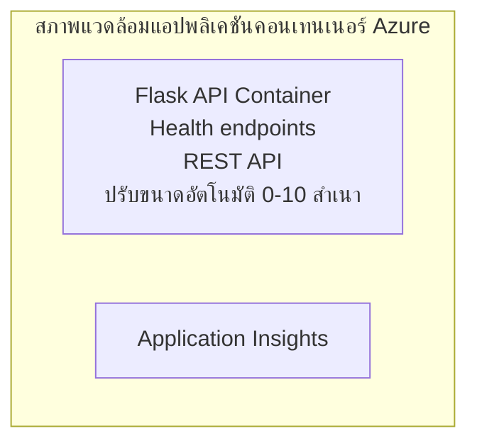

# Simple Flask API - ตัวอย่างแอป Container

**เส้นทางการเรียนรู้:** ผู้เริ่มต้น ⭐ | **เวลา:** 25-35 นาที | **ค่าใช้จ่าย:** 0-15 เหรียญ/เดือน

API Python Flask REST ที่สมบูรณ์และทำงานได้จริง พร้อมปรับใช้บน Azure Container Apps โดยใช้ Azure Developer CLI (azd) ตัวอย่างนี้แสดงการปรับใช้ container, การปรับขนาดอัตโนมัติ และพื้นฐานการตรวจสอบ

## 🎯 สิ่งที่คุณจะได้เรียนรู้

- ปรับใช้แอป Python ที่บรรจุไว้ใน container สู่ Azure  
- กำหนดการปรับขนาดอัตโนมัติพร้อมฟีเจอร์ scale-to-zero  
- ใช้งาน health probes และ readiness checks  
- ตรวจสอบบันทึกและเมตริกของแอป  
- ใช้ Azure Developer CLI เพื่อการปรับใช้ที่รวดเร็ว  

## 📦 สิ่งที่รวมอยู่ในตัวอย่างนี้

✅ **แอป Flask** - REST API ครบถ้วนพร้อม CRUD operations (`src/app.py`)  
✅ **Dockerfile** - การตั้งค่า container พร้อมใช้งานจริง  
✅ **โครงสร้างพื้นฐาน Bicep** - สภาพแวดล้อม Container Apps และปรับใช้ API  
✅ **การตั้งค่า AZD** - การตั้งค่าปรับใช้ด้วยคำสั่งเดียว  
✅ **Health Probes** - กำหนดค่า liveness และ readiness checks  
✅ **การปรับขนาดอัตโนมัติ** - 0-10 ตัวอย่างตามโหลด HTTP  

## สถาปัตยกรรม


## สิ่งที่ต้องเตรียม

### สิ่งที่จำเป็น
- **Azure Developer CLI (azd)** - [คู่มือการติดตั้ง](https://learn.microsoft.com/azure/developer/azure-developer-cli/install-azd)  
- **บัญชี Azure** - [บัญชีฟรี](https://azure.microsoft.com/free/)  
- **Docker Desktop** - [ติดตั้ง Docker](https://www.docker.com/products/docker-desktop/) (สำหรับทดสอบในเครื่อง)

### ตรวจสอบความพร้อม

```bash
# ตรวจสอบเวอร์ชัน azd (ต้องใช้ 1.5.0 หรือสูงกว่า)
azd version

# ยืนยันการเข้าสู่ระบบ Azure
azd auth login

# ตรวจสอบ Docker (ไม่บังคับ สำหรับการทดสอบภายในเครื่อง)
docker --version
```

## ⏱️ เวลาที่ใช้ในการปรับใช้

| ขั้นตอน | ระยะเวลา | กิจกรรม |
|-------|----------|--------------||
| ตั้งค่าสภาพแวดล้อม | 30 วินาที | สร้างสภาพแวดล้อม azd |
| สร้าง container | 2-3 นาที | สร้าง Docker image สำหรับแอป Flask |
| เตรียมโครงสร้างพื้นฐาน | 3-5 นาที | สร้าง Container Apps, registry, ระบบตรวจสอบ |
| ปรับใช้แอป | 2-3 นาที | ส่งภาพและปรับใช้ไปยัง Container Apps |
| **รวมทั้งหมด** | **8-12 นาที** | ปรับใช้เสร็จสมบูรณ์พร้อมใช้งาน |

## เริ่มต้นอย่างรวดเร็ว

```bash
# ไปยังตัวอย่าง
cd examples/container-app/simple-flask-api

# เริ่มต้นสภาพแวดล้อม (เลือกชื่อที่ไม่ซ้ำ)
azd env new myflaskapi

# ติดตั้งทั้งหมด (โครงสร้างพื้นฐาน + แอปพลิเคชัน)
azd up
# คุณจะได้รับแจ้งให้:
# 1. เลือกการสมัครใช้งาน Azure
# 2. เลือกตำแหน่งที่ตั้ง (เช่น eastus2)
# 3. รอ 8-12 นาทีสำหรับการติดตั้ง

# รับจุดสิ้นสุด API ของคุณ
azd env get-values

# ทดสอบ API
curl $(azd env get-value API_ENDPOINT)/health
```

**ผลลัพธ์ที่คาดหวัง:**  
```json
{
  "status": "healthy",
  "timestamp": "2025-11-19T10:30:00Z",
  "service": "simple-flask-api",
  "version": "1.0.0"
}
```

## ✅ ตรวจสอบการปรับใช้

### ขั้นตอนที่ 1: ตรวจสอบสถานะการปรับใช้

```bash
# ดูบริการที่ถูกปรับใช้
azd show

# ผลลัพธ์ที่คาดว่าจะเห็น:
# - บริการ: api
# - จุดสิ้นสุด: https://ca-api-[env].xxx.azurecontainerapps.io
# - สถานะ: กำลังทำงาน
```

### ขั้นตอนที่ 2: ทดสอบ API Endpoints

```bash
# รับ API endpoint
API_URL=$(azd env get-value API_ENDPOINT)

# ทดสอบสถานะสุขภาพ
curl $API_URL/health

# ทดสอบ root endpoint
curl $API_URL/

# สร้างรายการ
curl -X POST $API_URL/api/items \
  -H "Content-Type: application/json" \
  -d '{"name": "Test Item", "description": "My first item"}'

# รับรายการทั้งหมด
curl $API_URL/api/items
```

**เกณฑ์ความสำเร็จ:**  
- ✅ endpoint สุขภาพตอบกลับ HTTP 200  
- ✅ endpoint รากแสดงข้อมูล API  
- ✅ POST สร้างไอเท็มและตอบกลับ HTTP 201  
- ✅ GET คืนค่ารายการไอเท็มที่สร้าง  

### ขั้นตอนที่ 3: ดูบันทึก

```bash
# สตรีมบันทึกสดโดยใช้ azd monitor
azd monitor --logs

# หรือใช้ Azure CLI:
az containerapp logs show --name api --resource-group $RG_NAME --follow

# คุณควรเห็น:
# - ข้อความเริ่มต้น Gunicorn
# - บันทึกคำขอ HTTP
# - บันทึกข้อมูลแอปพลิเคชัน
```

## โครงสร้างโปรเจกต์

```
simple-flask-api/
├── azure.yaml              # AZD configuration
├── infra/
│   ├── main.bicep         # Main infrastructure
│   ├── main.parameters.json
│   └── app/
│       ├── container-env.bicep
│       └── api.bicep
└── src/
    ├── app.py             # Flask application
    ├── requirements.txt
    └── Dockerfile
```

## API Endpoints

| จุดเชื่อมต่อ | วิธีการ | คำอธิบาย |
|----------|--------|-------------|
| `/health` | GET | ตรวจสอบสุขภาพระบบ |
| `/api/items` | GET | แสดงรายการไอเท็มทั้งหมด |
| `/api/items` | POST | สร้างไอเท็มใหม่ |
| `/api/items/{id}` | GET | ดึงข้อมูลไอเท็มเฉพาะ |
| `/api/items/{id}` | PUT | อัปเดตไอเท็ม |
| `/api/items/{id}` | DELETE | ลบไอเท็ม |

## การตั้งค่า

### ตัวแปรสภาพแวดล้อม

```bash
# ตั้งค่าการกำหนดค่าที่กำหนดเอง
azd env set PORT 8000
azd env set LOG_LEVEL info
azd env set MAX_REPLICAS 20
```

### การกำหนดการปรับขนาด

API จะปรับขนาดอัตโนมัติตามการจราจร HTTP:  
- **จำนวนตัวอย่างขั้นต่ำ**: 0 (ปรับขนาดเป็นศูนย์เมื่อไม่มีการใช้งาน)  
- **จำนวนตัวอย่างสูงสุด**: 10  
- **คำขอพร้อมกันต่อหนึ่งตัวอย่าง**: 50  

## การพัฒนา

### รันในเครื่อง

```bash
# ติดตั้ง dependencies
cd src
pip install -r requirements.txt

# รันแอป
python app.py

# ทดสอบในเครื่อง
curl http://localhost:8000/health
```

### สร้างและทดสอบ container

```bash
# สร้างอิมเมจ Docker
docker build -t flask-api:local ./src

# รันคอนเทนเนอร์ในเครื่อง
docker run -p 8000:8000 flask-api:local

# ทดสอบคอนเทนเนอร์
curl http://localhost:8000/health
```

## การปรับใช้

### ปรับใช้เต็มรูปแบบ

```bash
# ปรับใช้โครงสร้างพื้นฐานและแอปพลิเคชัน
azd up
```

### ปรับใช้เฉพาะโค้ด

```bash
# ส่งมอบเฉพาะโค้ดแอปพลิเคชัน (โครงสร้างพื้นฐานไม่เปลี่ยนแปลง)
azd deploy api
```

### อัปเดตกำหนดค่า

```bash
# อัปเดตตัวแปรสภาพแวดล้อม
azd env set API_KEY "new-api-key"

# นำกลับมาใช้งานใหม่ด้วยการกำหนดค่าที่ใหม่
azd deploy api
```

## การตรวจสอบ

### ดูบันทึก

```bash
# สตรีมบันทึกสดโดยใช้ azd monitor
azd monitor --logs

# หรือใช้ Azure CLI สำหรับ Container Apps:
az containerapp logs show --name api --resource-group $RG_NAME --follow

# ดูบรรทัดล่าสุด 100 บรรทัด
az containerapp logs show --name api --resource-group $RG_NAME --tail 100
```

### ติดตามเมตริก

```bash
# เปิดแดชบอร์ด Azure Monitor
azd monitor --overview

# ดูเมตริกเฉพาะรายการ
az monitor metrics list \
  --resource $(azd show --output json | jq -r '.services.api.resourceId') \
  --metric "Requests,ResponseTime"
```

## การทดสอบ

### ตรวจสอบสุขภาพ

```bash
curl $(azd show --output json | jq -r '.services.api.endpoint')/health
```

ผลลัพธ์ที่คาดหวัง:  
```json
{
  "status": "healthy",
  "timestamp": "2025-11-19T10:30:00Z"
}
```

### สร้างไอเท็ม

```bash
curl -X POST $(azd show --output json | jq -r '.services.api.endpoint')/api/items \
  -H "Content-Type: application/json" \
  -d '{"name": "Test Item", "description": "A test item"}'
```

### ดึงข้อมูลไอเท็มทั้งหมด

```bash
curl $(azd show --output json | jq -r '.services.api.endpoint')/api/items
```

## การเพิ่มประสิทธิภาพค่าใช้จ่าย

การปรับใช้นี้ใช้ฟีเจอร์ scale-to-zero จึงจ่ายเงินเฉพาะเมื่อ API กำลังประมวลผลคำขอ:  

- **ค่าใช้จ่ายขณะพัก:** ประมาณ 0 เหรียญ/เดือน (ปรับขนาดเป็นศูนย์)  
- **ค่าใช้จ่ายขณะใช้งาน:** ประมาณ $0.000024/วินาที ต่อหนึ่งตัวอย่าง  
- **ค่าใช้จ่ายรายเดือนที่คาดหวัง** (การใช้งานเบา): 5-15 เหรียญ  

### ลดค่าใช้จ่ายเพิ่มเติม

```bash
# ลดจำนวนสำเนาสูงสุดสำหรับการพัฒนา
azd env set MAX_REPLICAS 3

# ใช้เวลาหมดเวลา idle ที่สั้นลง
azd env set SCALE_TO_ZERO_TIMEOUT 300  # 5 นาที
```

## แก้ไขปัญหา

### Container ไม่เริ่มทำงาน

```bash
# ตรวจสอบบันทึกของคอนเทนเนอร์โดยใช้ Azure CLI
az containerapp logs show --name api --resource-group $RG_NAME --tail 100

# ตรวจสอบการสร้างอิมเมจ Docker บนเครื่องท้องถิ่น
docker build -t test ./src
```

### ไม่สามารถเข้าถึง API

```bash
# ตรวจสอบว่า ingress เป็นภายนอกหรือไม่
az containerapp show --name api --resource-group rg-simple-flask-api \
  --query properties.configuration.ingress.external
```

### เวลาตอบสนองสูง

```bash
# ตรวจสอบการใช้งาน CPU/หน่วยความจำ
az monitor metrics list \
  --resource $(azd show --output json | jq -r '.services.api.resourceId') \
  --metric "CPUPercentage,MemoryPercentage"

# ขยายทรัพยากรหากจำเป็น
az containerapp update --name api --resource-group rg-simple-flask-api \
  --cpu 1.0 --memory 2Gi
```

## ล้างข้อมูล

```bash
# ลบทรัพยากรทั้งหมด
azd down --force --purge
```

## ขั้นตอนถัดไป

### ขยายตัวอย่างนี้

1. **เพิ่มฐานข้อมูล** - ผสาน Azure Cosmos DB หรือ SQL Database  
   ```bash
   # เพิ่มโมดูล Cosmos DB ไปที่ infra/main.bicep
   # อัปเดต app.py พร้อมการเชื่อมต่อฐานข้อมูล
   ```

2. **เพิ่มระบบยืนยันตัวตน** - ใช้ Azure AD หรือ API keys  
   ```python
   # เพิ่มมิดเดิลแวร์การตรวจสอบสิทธิ์ไปยัง app.py
   from functools import wraps
   ```

3. **ตั้งค่า CI/CD** - ใช้ workflow ของ GitHub Actions  
   ```yaml
   # Create .github/workflows/deploy.yml
   name: Deploy to Azure
   on: [push]
   ```

4. **เพิ่ม Managed Identity** - ป้องกันการเข้าถึงบริการ Azure  
   ```bicep
   # Update infra/app/api.bicep
   identity: { type: 'SystemAssigned' }
   ```

### ตัวอย่างที่เกี่ยวข้อง

- **[แอปฐานข้อมูล](../../../../../examples/database-app)** - ตัวอย่างครบถ้วนพร้อม SQL Database  
- **[ไมโครเซอร์วิส](../../../../../examples/container-app/microservices)** - สถาปัตยกรรมหลายบริการ  
- **[คู่มือหลัก Container Apps](../README.md)** - รูปแบบ container ทั้งหมด  

### แหล่งเรียนรู้

- 📚 [คอร์ส AZD สำหรับมือใหม่](../../../README.md) - หน้าหลักคอร์ส  
- 📚 [รูปแบบ Container Apps](../README.md) - รูปแบบการปรับใช้เพิ่มเติม  
- 📚 [แกลเลอรีแม่แบบ AZD](https://azure.github.io/awesome-azd/) - แม่แบบจากชุมชน  

## แหล่งข้อมูลเพิ่มเติม

### เอกสาร
- **[เอกสาร Flask](https://flask.palletsprojects.com/)** - คู่มือเฟรมเวิร์ก Flask  
- **[Azure Container Apps](https://learn.microsoft.com/azure/container-apps/)** - เอกสารอย่างเป็นทางการของ Azure  
- **[Azure Developer CLI](https://learn.microsoft.com/azure/developer/azure-developer-cli/)** - เอกสารคำสั่ง azd  

### บทช่วยสอน
- **[เริ่มใช้ Container Apps](https://learn.microsoft.com/azure/container-apps/quickstart-portal)** - ปรับใช้แอปแรกของคุณ  
- **[Python บน Azure](https://learn.microsoft.com/azure/developer/python/)** - คู่มือการพัฒนา Python  
- **[ภาษา Bicep](https://learn.microsoft.com/azure/azure-resource-manager/bicep/)** - โครงสร้างพื้นฐานแบบ Infrastructure as code  

### เครื่องมือ
- **[พอร์ทัล Azure](https://portal.azure.com)** - จัดการทรัพยากรด้วยภาพ  
- **[ส่วนขยาย VS Code สำหรับ Azure](https://marketplace.visualstudio.com/items?itemName=ms-azuretools.vscode-azurecontainerapps)** - การผสาน IDE  

---

**🎉 ขอแสดงความยินดี!** คุณได้ปรับใช้ Flask API สำหรับใช้งานจริงบน Azure Container Apps พร้อมฟีเจอร์ปรับขนาดอัตโนมัติและตรวจสอบแล้ว

**มีคำถาม?** [เปิดประเด็นใหม่](https://github.com/microsoft/AZD-for-beginners/issues) หรือตรวจสอบ [คำถามที่พบบ่อย](../../../resources/faq.md)

---

<!-- CO-OP TRANSLATOR DISCLAIMER START -->
**ข้อจำกัดความรับผิดชอบ**:  
เอกสารนี้ถูกแปลโดยใช้บริการแปลภาษาอัตโนมัติ [Co-op Translator](https://github.com/Azure/co-op-translator) แม้ว่าเราจะพยายามให้ความถูกต้องมากที่สุด แต่โปรดทราบว่าการแปลโดยอัตโนมัติอาจมีข้อผิดพลาดหรือความไม่ถูกต้อง เอกสารต้นฉบับในภาษาต้นทางควรถูกถือเป็นแหล่งข้อมูลที่น่าเชื่อถือ สำหรับข้อมูลที่มีความสำคัญแนะนำให้ใช้บริการแปลโดยมนุษย์มืออาชีพ เราจะไม่รับผิดชอบต่อความเข้าใจผิดหรือการตีความที่ผิดพลาดที่เกิดขึ้นจากการใช้การแปลนี้
<!-- CO-OP TRANSLATOR DISCLAIMER END -->