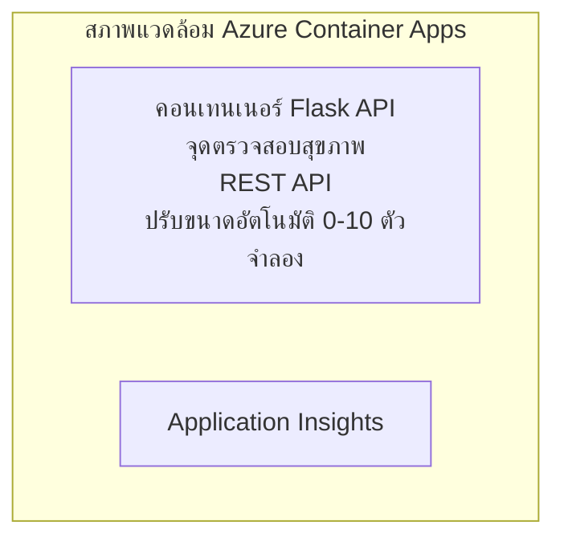

# ตัวอย่างแอป Container API Flask ง่ายๆ

**เส้นทางการเรียนรู้:** ผู้เริ่มต้น ⭐ | **เวลา:** 25-35 นาที | **ค่าใช้จ่าย:** $0-15/เดือน

ตัวอย่าง API REST Python Flask ที่สมบูรณ์และใช้งานได้จริง ถูกปรับใช้บน Azure Container Apps โดยใช้ Azure Developer CLI (azd) ตัวอย่างนี้แสดงการปรับใช้ container, การปรับขนาดอัตโนมัติ และพื้นฐานการตรวจสอบ

## 🎯 สิ่งที่คุณจะได้เรียนรู้

- ปรับใช้แอป Python ที่รันใน container ไปยัง Azure
- ตั้งค่าการปรับขนาดอัตโนมัติแบบสเกลเป็นศูนย์
- ใช้ health probes และ readiness checks
- ตรวจสอบบันทึกและเมตริกของแอป
- ใช้ Azure Developer CLI เพื่อการปรับใช้อย่างรวดเร็ว

## 📦 สิ่งที่รวมอยู่ในนี้

✅ **แอป Flask** - API REST ที่สมบูรณ์พร้อมฟังก์ชัน CRUD (`src/app.py`)  
✅ **Dockerfile** - กำหนดคอนฟิก container พร้อมใช้งานจริง  
✅ **โครงสร้างพื้นฐาน Bicep** - สภาพแวดล้อม Container Apps และการปรับใช้ API  
✅ **การคอนฟิก AZD** - ตั้งค่าการปรับใช้ด้วยคำสั่งเดียว  
✅ **Health Probes** - การตรวจสอบ liveness และ readiness  
✅ **การปรับขนาดอัตโนมัติ** - ตั้งค่า 0-10 ตัวทำซ้ำตามโหลด HTTP  

## สถาปัตยกรรม



## ข้อกำหนดเบื้องต้น

### ที่ต้องมี
- **Azure Developer CLI (azd)** - [คู่มือการติดตั้ง](https://learn.microsoft.com/azure/developer/azure-developer-cli/install-azd)
- **บัญชี Azure** - [บัญชีใช้ฟรี](https://azure.microsoft.com/free/)
- **Docker Desktop** - [ติดตั้ง Docker](https://www.docker.com/products/docker-desktop/) (สำหรับการทดสอบในเครื่อง)

### ตรวจสอบข้อกำหนด

```bash
# ตรวจสอบเวอร์ชัน azd (ต้องเป็น 1.5.0 ขึ้นไป)
azd version

# ยืนยันการเข้าสู่ระบบ Azure
azd auth login

# ตรวจสอบ Docker (ไม่จำเป็น, สำหรับทดสอบในเครื่อง)
docker --version
```

## ⏱️ ไทม์ไลน์การปรับใช้

| ขั้นตอน | ระยะเวลา | สิ่งที่จะเกิดขึ้น |
|---------|-----------|-----------------||
| การตั้งค่าสภาพแวดล้อม | 30 วินาที | สร้างสภาพแวดล้อม azd |
| สร้าง container | 2-3 นาที | Docker สร้างแอป Flask |
| สร้างโครงสร้างพื้นฐาน | 3-5 นาที | สร้าง Container Apps, registry, การตรวจสอบ |
| ปรับใช้แอป | 2-3 นาที | ส่งอิมเมจและปรับใช้ที่ Container Apps |
| **รวมทั้งหมด** | **8-12 นาที** | ปรับใช้เสร็จสมบูรณ์พร้อมใช้งาน |

## เริ่มต้นอย่างรวดเร็ว

```bash
# ไปที่ตัวอย่าง
cd examples/container-app/simple-flask-api

# เริ่มต้นสภาพแวดล้อม (เลือกชื่อที่ไม่ซ้ำ)
azd env new myflaskapi

# ติดตั้งทุกอย่าง (โครงสร้างพื้นฐาน + แอปพลิเคชัน)
azd up
# คุณจะได้รับการแจ้งให้:
# 1. เลือกการสมัคร Azure
# 2. เลือกสถานที่ (เช่น eastus2)
# 3. รอ 8-12 นาทีสำหรับการติดตั้ง

# รับจุดสิ้นสุด API ของคุณ
azd env get-values

# ทดสอบ API
curl $(azd env get-value API_ENDPOINT)/health
```

**ผลลัพธ์ที่คาดหวัง:**
```json
{
  "status": "healthy",
  "timestamp": "2025-11-19T10:30:00Z",
  "service": "simple-flask-api",
  "version": "1.0.0"
}
```

## ✅ ตรวจสอบการปรับใช้

### ขั้นตอนที่ 1: ตรวจสอบสถานะการปรับใช้

```bash
# ดูบริการที่ถูกติดตั้งแล้ว
azd show

# ผลลัพธ์ที่คาดว่าจะเห็น:
# - บริการ: api
# - จุดเชื่อมต่อ: https://ca-api-[env].xxx.azurecontainerapps.io
# - สถานะ: กำลังทำงาน
```

### ขั้นตอนที่ 2: ทดสอบ API Endpoints

```bash
# ดึงจุดเชื่อมต่อ API
API_URL=$(azd env get-value API_ENDPOINT)

# ทดสอบสถานะระบบ
curl $API_URL/health

# ทดสอบจุดเชื่อมต่อราก
curl $API_URL/

# สร้างไอเท็ม
curl -X POST $API_URL/api/items \
  -H "Content-Type: application/json" \
  -d '{"name": "Test Item", "description": "My first item"}'

# ดึงไอเท็มทั้งหมด
curl $API_URL/api/items
```

**เกณฑ์ความสำเร็จ:**
- ✅ Endpoint สุขภาพส่งคืน HTTP 200
- ✅ Endpoint หลักแสดงข้อมูล API
- ✅ POST สร้างรายการใหม่และส่งคืน HTTP 201
- ✅ GET ดึงรายการที่สร้างไว้

### ขั้นตอนที่ 3: ดูบันทึก

```bash
# สตรีมบันทึกสดโดยใช้ azd monitor
azd monitor --logs

# หรือใช้ Azure CLI:
az containerapp logs show --name api --resource-group $RG_NAME --follow

# คุณควรเห็น:
# - ข้อความเริ่มต้นของ Gunicorn
# - บันทึกคำขอ HTTP
# - บันทึกข้อมูลแอปพลิเคชัน
```

## โครงสร้างโปรเจกต์

```
simple-flask-api/
├── azure.yaml              # AZD configuration
├── infra/
│   ├── main.bicep         # Main infrastructure
│   ├── main.parameters.json
│   └── app/
│       ├── container-env.bicep
│       └── api.bicep
└── src/
    ├── app.py             # Flask application
    ├── requirements.txt
    └── Dockerfile
```

## API Endpoints

| Endpoint | วิธีการ | คำอธิบาย |
|----------|---------|-----------|
| `/health` | GET | ตรวจสอบสุขภาพ |
| `/api/items` | GET | แสดงรายการทั้งหมด |
| `/api/items` | POST | สร้างรายการใหม่ |
| `/api/items/{id}` | GET | ดึงรายการเฉพาะ |
| `/api/items/{id}` | PUT | อัปเดตรายการ |
| `/api/items/{id}` | DELETE | ลบรายการ |

## การตั้งค่า

### ตัวแปรสภาพแวดล้อม

```bash
# ตั้งค่าการตั้งค่าที่กำหนดเอง
azd env set PORT 8000
azd env set LOG_LEVEL info
azd env set MAX_REPLICAS 20
```

### การตั้งค่าการปรับขนาด

API จะปรับขนาดอัตโนมัติตามการรับส่งข้อมูล HTTP:  
- **จำนวนสำเนาขั้นต่ำ**: 0 (สเกลเป็นศูนย์เมื่อไม่มีงาน)  
- **จำนวนสำเนาขั้นสูงสุด**: 10  
- **คำขอพร้อมกันต่อสำเนา**: 50  

## การพัฒนา

### รันในเครื่อง

```bash
# ติดตั้งส่วนประกอบที่จำเป็น
cd src
pip install -r requirements.txt

# รันแอป
python app.py

# ทดสอบในเครื่อง
curl http://localhost:8000/health
```

### สร้างและทดสอบ Container

```bash
# สร้างอิมเมจ Docker
docker build -t flask-api:local ./src

# รันคอนเทนเนอร์ในเครื่อง
docker run -p 8000:8000 flask-api:local

# ทดสอบคอนเทนเนอร์
curl http://localhost:8000/health
```

## การปรับใช้

### ปรับใช้เต็มรูปแบบ

```bash
# ติดตั้งโครงสร้างพื้นฐานและแอปพลิเคชัน
azd up
```

### ปรับใช้เฉพาะโค้ด

```bash
# ดีพลอยเฉพาะโค้ดแอปพลิเคชัน (โครงสร้างพื้นฐานไม่เปลี่ยนแปลง)
azd deploy api
```

### อัปเดตการตั้งค่า

```bash
# อัปเดตตัวแปรแวดล้อม
azd env set API_KEY "new-api-key"

# ปรับปรุงการใช้งานใหม่ด้วยการตั้งค่ากำหนดใหม่
azd deploy api
```

## การตรวจสอบ

### ดูบันทึก

```bash
# สตรีมบันทึกสดโดยใช้ azd monitor
azd monitor --logs

# หรือใช้ Azure CLI สำหรับ Container Apps:
az containerapp logs show --name api --resource-group $RG_NAME --follow

# ดู 100 บรรทัดล่าสุด
az containerapp logs show --name api --resource-group $RG_NAME --tail 100
```

### ตรวจสอบเมตริก

```bash
# เปิดแดชบอร์ด Azure Monitor
azd monitor --overview

# ดูเมตริกเฉพาะเจาะจง
az monitor metrics list \
  --resource $(azd show --output json | jq -r '.services.api.resourceId') \
  --metric "Requests,ResponseTime"
```

## การทดสอบ

### ตรวจสอบสุขภาพ

```bash
curl $(azd show --output json | jq -r '.services.api.endpoint')/health
```

ผลลัพธ์ที่คาดหวัง:  
```json
{
  "status": "healthy",
  "timestamp": "2025-11-19T10:30:00Z"
}
```

### สร้างรายการ

```bash
curl -X POST $(azd show --output json | jq -r '.services.api.endpoint')/api/items \
  -H "Content-Type: application/json" \
  -d '{"name": "Test Item", "description": "A test item"}'
```

### ดึงรายการทั้งหมด

```bash
curl $(azd show --output json | jq -r '.services.api.endpoint')/api/items
```

## การเพิ่มประสิทธิภาพค่าใช้จ่าย

การปรับใช้นี้ใช้การสเกลเป็นศูนย์ ดังนั้นคุณจะจ่ายเฉพาะเมื่อ API กำลังประมวลผลคำขอ:

- **ค่าใช้จ่ายเมื่อว่าง**: ประมาณ 0 ดอลลาร์/เดือน (สเกลเป็นศูนย์)  
- **ค่าใช้จ่ายเมื่อใช้งาน**: ประมาณ 0.000024 ดอลลาร์/วินาทีต่อสำเนา  
- **ค่าใช้จ่ายรายเดือนที่คาดหวัง** (ใช้งานเบา): 5-15 ดอลลาร์  

### ลดค่าใช้จ่ายเพิ่มเติม

```bash
# ลดจำนวนสำเนาสูงสุดสำหรับการพัฒนา
azd env set MAX_REPLICAS 3

# ใช้เวลาหมดเวลาว่างที่สั้นลง
azd env set SCALE_TO_ZERO_TIMEOUT 300  # 5 นาที
```

## การแก้ไขปัญหา

### Container ไม่เริ่มทำงาน

```bash
# ตรวจสอบบันทึกคอนเทนเนอร์โดยใช้ Azure CLI
az containerapp logs show --name api --resource-group $RG_NAME --tail 100

# ยืนยันการสร้างอิมเมจ Docker ในเครื่อง
docker build -t test ./src
```

### API เข้าถึงไม่ได้

```bash
# ตรวจสอบว่า ingress เป็นภายนอกหรือไม่
az containerapp show --name api --resource-group rg-simple-flask-api \
  --query properties.configuration.ingress.external
```

### เวลาตอบสนองสูง

```bash
# ตรวจสอบการใช้งาน CPU/หน่วยความจำ
az monitor metrics list \
  --resource $(azd show --output json | jq -r '.services.api.resourceId') \
  --metric "CPUPercentage,MemoryPercentage"

# เพิ่มทรัพยากรหากจำเป็น
az containerapp update --name api --resource-group rg-simple-flask-api \
  --cpu 1.0 --memory 2Gi
```

## การล้างข้อมูล

```bash
# ลบทรัพยากรทั้งหมด
azd down --force --purge
```

## ขั้นตอนถัดไป

### ขยายตัวอย่างนี้

1. **เพิ่มฐานข้อมูล** - รวม Azure Cosmos DB หรือ SQL Database  
   ```bash
   # เพิ่มโมดูล Cosmos DB ไปที่ infra/main.bicep
   # อัปเดต app.py พร้อมการเชื่อมต่อฐานข้อมูล
   ```

2. **เพิ่มระบบพิสูจน์ตัวตน** - ใช้ Microsoft Entra ID หรือ API keys  
   ```python
   # เพิ่มตัวกลางตรวจสอบสิทธิ์ใน app.py
   from functools import wraps
   ```

3. **ตั้งค่า CI/CD** - ใช้ GitHub Actions workflow  
   ```yaml
   # Create .github/workflows/deploy.yml
   name: Deploy to Azure
   on: [push]
   ```

4. **เพิ่ม Managed Identity** - เข้าถึงบริการ Azure อย่างปลอดภัย  
   ```bicep
   # Update infra/app/api.bicep
   identity: { type: 'SystemAssigned' }
   ```

### ตัวอย่างที่เกี่ยวข้อง

- **[แอปฐานข้อมูล](../../../../../examples/database-app)** - ตัวอย่างสมบูรณ์พร้อม SQL Database  
- **[ไมโครเซอร์วิส](../../../../../examples/container-app/microservices)** - สถาปัตยกรรมหลายบริการ  
- **[คู่มือ Container Apps ครบถ้วน](../README.md)** - รูปแบบ container ทั้งหมด  

### แหล่งเรียนรู้

- 📚 [คอร์ส AZD สำหรับผู้เริ่มต้น](../../../README.md) - หน้าหลักคอร์ส  
- 📚 [รูปแบบ Container Apps](../README.md) - รูปแบบการปรับใช้เพิ่มเติม  
- 📚 [แกลเลอรีเทมเพลต AZD](https://azure.github.io/awesome-azd/) - เทมเพลตจากชุมชน  

## แหล่งข้อมูลเพิ่มเติม

### เอกสาร
- **[เอกสาร Flask](https://flask.palletsprojects.com/)** - คู่มือเฟรมเวิร์ก Flask  
- **[Azure Container Apps](https://learn.microsoft.com/azure/container-apps/)** - เอกสารทางการของ Azure  
- **[Azure Developer CLI](https://learn.microsoft.com/azure/developer/azure-developer-cli/)** - เอกสารคำสั่ง azd  

### บทเรียน
- **[เริ่มต้น Container Apps อย่างรวดเร็ว](https://learn.microsoft.com/azure/container-apps/quickstart-portal)** - ปรับใช้แอปแรกของคุณ  
- **[Python บน Azure](https://learn.microsoft.com/azure/developer/python/)** - คู่มือพัฒนา Python  
- **[ภาษา Bicep](https://learn.microsoft.com/azure/azure-resource-manager/bicep/)** - Infrastructure as code  

### เครื่องมือ
- **[Azure Portal](https://portal.azure.com)** - จัดการทรัพยากรผ่าน UI  
- **[ส่วนขยาย VS Code Azure](https://marketplace.visualstudio.com/items?itemName=ms-azuretools.vscode-azurecontainerapps)** - การผนวก IDE  

---

**🎉 ยินดีด้วย!** คุณได้ปรับใช้ Flask API พร้อมใช้งานจริงบน Azure Container Apps พร้อมระบบสเกลอัตโนมัติและการตรวจสอบแล้ว

**สงสัยหรือต้องการความช่วยเหลือ?** [เปิด issue](https://github.com/microsoft/AZD-for-beginners/issues) หรือตรวจสอบ [คำถามที่พบบ่อย](../../../resources/faq.md)

---

<!-- CO-OP TRANSLATOR DISCLAIMER START -->
**ปฏิเสธความรับผิดชอบ**:
เอกสารนี้ได้รับการแปลโดยใช้บริการแปลภาษา AI [Co-op Translator](https://github.com/Azure/co-op-translator) ขณะที่เราพยายามให้ความถูกต้อง โปรดทราบว่าการแปลโดยอัตโนมัติอาจมีข้อผิดพลาดหรือความไม่ถูกต้อง เอกสารต้นฉบับในภาษาต้นทางควรถูกพิจารณาเป็นแหล่งข้อมูลที่เชื่อถือได้ สำหรับข้อมูลที่สำคัญ แนะนำให้ใช้การแปลโดยมนุษย์มืออาชีพ เราไม่รับผิดชอบต่อความเข้าใจผิดหรือการตีความที่ผิดพลาดที่เกิดขึ้นจากการใช้การแปลนี้
<!-- CO-OP TRANSLATOR DISCLAIMER END -->