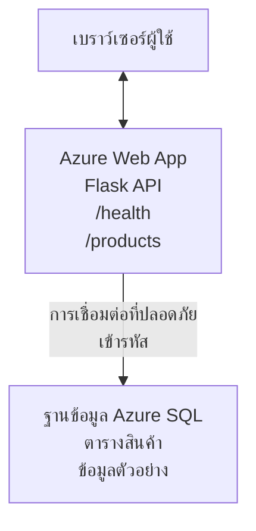

# การปรับใช้ฐานข้อมูล Microsoft SQL และเว็บแอปด้วย AZD

⏱️ **เวลาประเมิน**: 20-30 นาที | 💰 **ค่าประมาณ**: ~$15-25/เดือน | ⭐ **ความซับซ้อน**: ปานกลาง

**ตัวอย่างสมบูรณ์และทำงานได้จริงนี้** แสดงวิธีใช้ [Azure Developer CLI (azd)](https://learn.microsoft.com/azure/developer/azure-developer-cli/) เพื่อปรับใช้เว็บแอป Python Flask ที่มีฐานข้อมูล Microsoft SQL ไปยัง Azure โค้ดทั้งหมดถูกรวมและทดสอบแล้ว — ไม่มีการพึ่งพาภายนอก

## สิ่งที่คุณจะได้เรียนรู้

โดยการทำตัวอย่างนี้ คุณจะ:
- ปรับใช้แอปพลิเคชันหลายชั้น (เว็บแอป + ฐานข้อมูล) โดยใช้โครงสร้างพื้นฐานเป็นโค้ด
- กำหนดค่าการเชื่อมต่อฐานข้อมูลอย่างปลอดภัยโดยไม่ต้องเขียนความลับไว้ในโค้ด
- ตรวจสอบสุขภาพของแอปพลิเคชันด้วย Application Insights
- จัดการทรัพยากร Azure อย่างมีประสิทธิภาพด้วย AZD CLI
- ปฏิบัติตามแนวทางที่ดีที่สุดของ Azure สำหรับความปลอดภัย การเพิ่มประสิทธิภาพต้นทุน และการสังเกต

## ภาพรวมสถานการณ์
- **เว็บแอป**: Python Flask REST API ที่เชื่อมต่อฐานข้อมูล
- **ฐานข้อมูล**: Azure SQL Database พร้อมข้อมูลตัวอย่าง
- **โครงสร้างพื้นฐาน**: จัดเตรียมด้วย Bicep (เทมเพลตแบบแยกส่วน ใช้ซ้ำได้)
- **การปรับใช้**: อัตโนมัติเต็มรูปแบบด้วยคำสั่ง `azd`
- **การตรวจสอบ**: Application Insights สำหรับบันทึกและโทรเมตริก

## ความต้องการเบื้องต้น

### เครื่องมือที่จำเป็น

ก่อนเริ่ม ตรวจสอบให้แน่ใจว่าคุณมีเครื่องมือเหล่านี้ติดตั้งแล้ว:

1. **[Azure CLI](https://learn.microsoft.com/cli/azure/install-azure-cli)** (เวอร์ชัน 2.50.0 หรือสูงกว่า)
   ```sh
   az --version
   # ผลลัพธ์ที่คาดหวัง: azure-cli 2.50.0 หรือสูงกว่า
   ```

2. **[Azure Developer CLI (azd)](https://learn.microsoft.com/azure/developer/azure-developer-cli/install-azd)** (เวอร์ชัน 1.0.0 หรือสูงกว่า)
   ```sh
   azd version
   # ผลลัพธ์ที่คาดหวัง: azd เวอร์ชัน 1.0.0 หรือสูงกว่า
   ```

3. **[Python 3.8+](https://www.python.org/downloads/)** (สำหรับการพัฒนาในเครื่อง)
   ```sh
   python --version
   # ผลลัพธ์ที่คาดไว้: Python 3.8 หรือสูงกว่า
   ```

4. **[Docker](https://www.docker.com/get-started)** (ไม่บังคับ สำหรับการพัฒนาด้วยคอนเทนเนอร์ในเครื่อง)
   ```sh
   docker --version
   # ผลลัพธ์ที่คาดหวัง: Docker เวอร์ชัน 20.10 หรือสูงกว่า
   ```

### ความต้องการของ Azure

- ต้องมี **Subscription Azure ที่ใช้งานอยู่** ([สร้างบัญชีฟรี](https://azure.microsoft.com/free/))
- สิทธิ์ในการสร้างทรัพยากรใน Subscription ของคุณ
- มีบทบาท **Owner** หรือ **Contributor** ใน Subscription หรือกลุ่มทรัพยากร

### ความรู้เบื้องต้น

นี่คือตัวอย่างระดับ **ปานกลาง** คุณควรคุ้นเคยกับ:
- การใช้งานบรรทัดคำสั่งพื้นฐาน
- แนวคิดคลาวด์พื้นฐาน (ทรัพยากร, กลุ่มทรัพยากร)
- ความเข้าใจพื้นฐานเกี่ยวกับเว็บแอปและฐานข้อมูล

**ยังไม่เคยใช้ AZD มาก่อน?** เริ่มต้นด้วย [คู่มือเริ่มต้น](../../docs/chapter-01-foundation/azd-basics.md) ก่อน

## สถาปัตยกรรม

ตัวอย่างนี้ปรับใช้สถาปัตยกรรมสองชั้นด้วยเว็บแอปและฐานข้อมูล SQL:


**การปรับใช้ทรัพยากร:**
- **Resource Group**: กล่องเก็บทรัพยากรทั้งหมด
- **App Service Plan**: โฮสต์บน Linux (ระดับ B1 สำหรับประหยัดต้นทุน)
- **Web App**: รันไทม์ Python 3.11 พร้อมเว็บแอป Flask
- **SQL Server**: เซิร์ฟเวอร์ฐานข้อมูลที่จัดการด้วย TLS 1.2 ขั้นต่ำ
- **SQL Database**: ระดับ Basic (2GB เหมาะสำหรับการพัฒนา/ทดสอบ)
- **Application Insights**: การตรวจสอบและบันทึก
- **Log Analytics Workspace**: ที่เก็บบันทึกแบบรวมศูนย์

**อุปมา**: ลองคิดเหมือนร้านอาหาร (เว็บแอป) ที่มีตู้แช่แข็ง (ฐานข้อมูล) ลูกค้าสั่งจากเมนู (API endpoints) และครัว (แอป Flask) ดึงวัตถุดิบ (ข้อมูล) จากตู้แช่แข็ง ผู้จัดการร้าน (Application Insights) ติดตามทุกอย่างที่เกิดขึ้น

## โครงสร้างโฟลเดอร์

ไฟล์ทั้งหมดถูกรวมในตัวอย่างนี้ ไม่มีการพึ่งพาภายนอก:

```
examples/database-app/
│
├── README.md                    # This file
├── azure.yaml                   # AZD configuration file
├── .env.sample                  # Sample environment variables
├── .gitignore                   # Git ignore patterns
│
├── infra/                       # Infrastructure as Code (Bicep)
│   ├── main.bicep              # Main orchestration template
│   ├── abbreviations.json      # Azure naming conventions
│   └── resources/              # Modular resource templates
│       ├── sql-server.bicep    # SQL Server configuration
│       ├── sql-database.bicep  # Database configuration
│       ├── app-service-plan.bicep  # Hosting plan
│       ├── app-insights.bicep  # Monitoring setup
│       └── web-app.bicep       # Web application
│
└── src/
    └── web/                    # Application source code
        ├── app.py              # Flask REST API
        ├── requirements.txt    # Python dependencies
        └── Dockerfile          # Container definition
```

**ไฟล์แต่ละไฟล์ทำหน้าที่ดังนี้:**
- **azure.yaml**: บอก AZD ว่าจะปรับใช้และที่ไหน
- **infra/main.bicep**: ควบคุมทรัพยากร Azure ทั้งหมด
- **infra/resources/*.bicep**: นิยามทรัพยากรแต่ละตัว (แยกส่วนสำหรับใช้ซ้ำ)
- **src/web/app.py**: แอป Flask กับตรรก ะฐานข้อมูล
- **requirements.txt**: รายการแพ็กเกจ Python ที่ต้องใช้
- **Dockerfile**: คำสั่งสำหรับสร้างคอนเทนเนอร์เพื่อปรับใช้

## เริ่มต้นอย่างรวดเร็ว (ทีละขั้นตอน)

### ขั้นตอนที่ 1: โคลนและไปยังไดเรกทอรี

```sh
git clone https://github.com/microsoft/AZD-for-beginners.git
cd AZD-for-beginners/examples/database-app
```

**✓ ตรวจสอบความสำเร็จ**: ตรวจสอบว่าคุณเห็น `azure.yaml` และโฟลเดอร์ `infra/`:
```sh
ls
# คาดว่า: README.md, azure.yaml, infra/, src/
```

### ขั้นตอนที่ 2: ยืนยันตัวตนกับ Azure

```sh
azd auth login
```

จะเปิดเบราว์เซอร์เพื่อเข้าสู่ระบบ Azure ลงชื่อด้วยข้อมูลประจำตัวของคุณ

**✓ ตรวจสอบความสำเร็จ**: คุณควรเห็น:
```
Logged in to Azure.
```

### ขั้นตอนที่ 3: เริ่มต้นสภาพแวดล้อม

```sh
azd init
```

**เกิดอะไรขึ้น**: AZD สร้างการตั้งค่าท้องถิ่นสำหรับการปรับใช้ของคุณ

**ข้อมูลที่ระบบถาม**:
- **ชื่อสภาพแวดล้อม**: ป้อนชื่อสั้น ๆ (เช่น `dev`, `myapp`)
- **Subscription Azure**: เลือก Subscription ของคุณจากรายการ
- **ตำแหน่ง Azure**: เลือกภาค (เช่น `eastus`, `westeurope`)

**✓ ตรวจสอบความสำเร็จ**: คุณควรเห็น:
```
SUCCESS: New project initialized!
```

### ขั้นตอนที่ 4: จัดเตรียมทรัพยากร Azure

```sh
azd provision
```

**เกิดอะไรขึ้น**: AZD ปรับใช้โครงสร้างพื้นฐานทั้งหมด (ใช้เวลา 5-8 นาที):
1. สร้างกลุ่มทรัพยากร
2. สร้าง SQL Server และฐานข้อมูล
3. สร้างแผนบริการแอป (App Service Plan)
4. สร้างเว็บแอป
5. สร้าง Application Insights
6. กำหนดค่าการเชื่อมต่อและความปลอดภัย

**ระบบจะถามคุณ**:
- **ชื่อผู้ดูแล SQL**: กรอกชื่อผู้ใช้ (เช่น `sqladmin`)
- **รหัสผ่านผู้ดูแล SQL**: กรอกรหัสผ่านที่แข็งแรง (บันทึกไว้ด้วย!)

**✓ ตรวจสอบความสำเร็จ**: คุณควรเห็น:
```
SUCCESS: Your application was provisioned in Azure in X minutes Y seconds.
You can view the resources created under the resource group rg-<env-name> in Azure Portal:
https://portal.azure.com/#@/resource/subscriptions/.../resourceGroups/rg-<env-name>
```

**⏱️ เวลา**: 5-8 นาที

### ขั้นตอนที่ 5: ปรับใช้แอปพลิเคชัน

```sh
azd deploy
```

**เกิดอะไรขึ้น**: AZD สร้างและปรับใช้แอป Flask ของคุณ:
1. แพ็กเกจแอป Python
2. สร้างคอนเทนเนอร์ Docker
3. ส่งขึ้นไปยัง Azure Web App
4. เริ่มต้นฐานข้อมูลด้วยข้อมูลตัวอย่าง
5. เริ่มแอปพลิเคชัน

**✓ ตรวจสอบความสำเร็จ**: คุณควรเห็น:
```
SUCCESS: Your application was deployed to Azure in X minutes Y seconds.
You can view the resources created under the resource group rg-<env-name> in Azure Portal:
https://portal.azure.com/#@/resource/subscriptions/.../resourceGroups/rg-<env-name>
```

**⏱️ เวลา**: 3-5 นาที

### ขั้นตอนที่ 6: เปิดเว็บแอป

```sh
azd browse
```

จะเปิดเว็บแอปที่ปรับใช้ของคุณในเบราว์เซอร์ที่ `https://app-<unique-id>.azurewebsites.net`

**✓ ตรวจสอบความสำเร็จ**: คุณควรเห็น JSON ผลลัพธ์:
```json
{
  "message": "Welcome to the Database App API",
  "endpoints": {
    "/": "This help message",
    "/health": "Health check endpoint",
    "/products": "List all products",
    "/products/<id>": "Get product by ID"
  }
}
```

### ขั้นตอนที่ 7: ทดสอบ API Endpoints

**ตรวจสอบสุขภาพ** (เช็คการเชื่อมต่อฐานข้อมูล):
```sh
curl https://app-<your-id>.azurewebsites.net/health
```

**การตอบกลับที่คาดหวัง**:
```json
{
  "status": "healthy",
  "database": "connected"
}
```

**แสดงรายการสินค้า** (ข้อมูลตัวอย่าง):
```sh
curl https://app-<your-id>.azurewebsites.net/products
```

**การตอบกลับที่คาดหวัง**:
```json
[
  {
    "id": 1,
    "name": "Laptop",
    "description": "High-performance laptop",
    "price": 1299.99,
    "created_at": "2025-11-19T10:30:00"
  },
  ...
]
```

**ดึงสินค้ารายการเดียว**:
```sh
curl https://app-<your-id>.azurewebsites.net/products/1
```

**✓ ตรวจสอบความสำเร็จ**: ทุก endpoint ส่งคืนข้อมูล JSON โดยไม่มีข้อผิดพลาด

---

**🎉 ยินดีด้วย!** คุณได้ปรับใช้เว็บแอปพร้อมฐานข้อมูลบน Azure สำเร็จด้วย AZD

## การตั้งค่าลึก

### ตัวแปรสภาพแวดล้อม

ความลับถูกจัดการอย่างปลอดภัยผ่านการตั้งค่า Azure App Service — **ห้ามฝังในโค้ด**

**จัดการโดยอัตโนมัติด้วย AZD**:
- `SQL_CONNECTION_STRING`: สตริงการเชื่อมต่อฐานข้อมูลที่เข้ารหัสข้อมูลรับรอง
- `APPLICATIONINSIGHTS_CONNECTION_STRING`: จุดปลายโทรเมตริกของการตรวจสอบ
- `SCM_DO_BUILD_DURING_DEPLOYMENT`: เปิดใช้งานการติดตั้ง dependency อัตโนมัติ

**ที่เก็บความลับ**:
1. ขณะ `azd provision` คุณป้อนข้อมูลรับรอง SQL ผ่านคำถามที่ปลอดภัย
2. AZD เก็บไว้ในไฟล์ `.azure/<env-name>/.env` ในเครื่อง (ถูกละเว้นจาก Git)
3. AZD ฉีดข้อมูลนี้เข้าสู่การตั้งค่า Azure App Service (เข้ารหัสในที่เก็บ)
4. แอปอ่านผ่าน `os.getenv()` ขณะรันไทม์

### การพัฒนาในเครื่อง

สำหรับทดสอบในเครื่อง สร้างไฟล์ `.env` จากตัวอย่าง:

```sh
cp .env.sample .env
# แก้ไข .env ด้วยการเชื่อมต่อฐานข้อมูลท้องถิ่นของคุณ
```

**เวิร์กโฟลว์พัฒนาในเครื่อง**:
```sh
# ติดตั้งส่วนประกอบที่จำเป็น
cd src/web
pip install -r requirements.txt

# ตั้งค่าตัวแปรสภาพแวดล้อม
export SQL_CONNECTION_STRING="your-local-connection-string"

# รันแอปพลิเคชัน
python app.py
```

**ทดสอบในเครื่อง**:
```sh
curl http://localhost:8000/health
# ที่คาดไว้: {"status": "healthy", "database": "connected"}
```

### โครงสร้างพื้นฐานเป็นโค้ด

ทรัพยากร Azure ทั้งหมดนิยามใน **เทมเพลต Bicep** (`infra/`):

- **ออกแบบแบบแยกส่วน**: ทรัพยากรแต่ละชนิดแยกไฟล์สำหรับใช้ซ้ำ
- **มีพารามิเตอร์**: ปรับแต่ง SKU, ภูมิภาค, การตั้งชื่อได้
- **แนวทางปฏิบัติที่ดีที่สุด**: ปฏิบัติตามมาตรฐานการตั้งชื่อและความปลอดภัยของ Azure
- **ควบคุมเวอร์ชัน**: การเปลี่ยนแปลงโครงสร้างพื้นฐานถูกติดตามใน Git

**ตัวอย่างการปรับแต่ง**:
หากต้องการเปลี่ยนชั้นฐานข้อมูล ให้แก้ไขใน `infra/resources/sql-database.bicep`:
```bicep
sku: {
  name: 'Standard'  // Changed from 'Basic'
  tier: 'Standard'
  capacity: 10
}
```

## แนวทางปฏิบัติด้านความปลอดภัยที่ดีที่สุด

ตัวอย่างนี้ปฏิบัติตามแนวทาง Azure ด้านความปลอดภัยดังนี้:

### 1. **ไม่เก็บความลับในโค้ดต้นฉบับ**
- ✅ ข้อมูลรับรองเก็บใน Azure App Service Configuration (เข้ารหัส)
- ✅ ไฟล์ `.env` ถูกละเว้นใน Git (.gitignore)
- ✅ ส่งความลับผ่านพารามิเตอร์ปลอดภัยตอนตั้งค่า

### 2. **เชื่อมต่อเข้ารหัส**
- ✅ ใช้ TLS 1.2 ขั้นต่ำสำหรับ SQL Server
- ✅ บังคับ HTTPS เท่านั้นสำหรับเว็บแอป
- ✅ การเชื่อมต่อฐานข้อมูลผ่านช่องทางเข้ารหัส

### 3. **ความปลอดภัยเครือข่าย**
- ✅ ไฟร์วอลล์ SQL Server กำหนดให้บริการ Azure เท่านั้นที่เข้าถึงได้
- ✅ จำกัดการเข้าถึงเครือข่ายสาธารณะ (สามารถล็อกได้เพิ่มเติมด้วย Private Endpoints)
- ✅ ปิดใช้งาน FTPS บนเว็บแอป

### 4. **การตรวจสอบสิทธิ์และการอนุญาต**
- ⚠️ **ปัจจุบัน**: ใช้วิธีตรวจสอบสิทธิ์ SQL (ชื่อผู้ใช้/รหัสผ่าน)
- ✅ **แนะนำสำหรับผลิตจริง**: ใช้ Azure Managed Identity เพื่อล็อกอินแบบไม่ใช้รหัสผ่าน

**วิธีอัปเกรดเป็น Managed Identity** (สำหรับผลิตจริง):
1. เปิดใช้งาน managed identity บนเว็บแอป
2. มอบสิทธิ์ SQL ให้ identity นั้น
3. ปรับสตริงการเชื่อมต่อไปใช้ managed identity
4. ยกเลิกการตรวจสอบสิทธิ์แบบรหัสผ่าน

### 5. **การตรวจสอบและการปฏิบัติตามข้อกำหนด**
- ✅ Application Insights บันทึกคำขอและข้อผิดพลาดทั้งหมด
- ✅ เปิดใช้งานการตรวจสอบ SQL Database (ตั้งค่าเพื่อความสอดคล้องได้)
- ✅ ทรัพยากรทั้งหมดมีแท็กสำหรับการกำกับดูแล

**รายการตรวจสอบความปลอดภัยก่อนผลิต**:
- [ ] เปิดใช้ Azure Defender สำหรับ SQL
- [ ] ตั้งค่า Private Endpoints สำหรับ SQL Database
- [ ] เปิดใช้งาน Web Application Firewall (WAF)
- [ ] ใช้ Azure Key Vault สำหรับการหมุนเวียนความลับ
- [ ] ตั้งค่าการตรวจสอบสิทธิ์ Azure AD
- [ ] เปิดใช้งานการบันทึกข้อมูลวินิจฉัยสำหรับทรัพยากรทั้งหมด

## การเพิ่มประสิทธิภาพต้นทุน

**ค่าประมาณรายเดือน** (ณ พฤศจิกายน 2025):

| ทรัพยากร | SKU/ระดับ | ค่าประมาณ |
|----------|----------|------------|
| App Service Plan | B1 (Basic) | ~$13/เดือน |
| SQL Database | Basic (2GB) | ~$5/เดือน |
| Application Insights | จ่ายตามการใช้งาน | ~$2/เดือน (ปริมาณน้อย) |
| **รวมทั้งหมด** | | **~$20/เดือน** |

**💡 เคล็ดลับประหยัดค่าใช้จ่าย**:

1. **ใช้ระดับฟรีสำหรับเรียนรู้**:
   - App Service: ระดับ F1 (ฟรี จำกัดชั่วโมง)
   - SQL Database: ใช้ Azure SQL Database แบบ serverless
   - Application Insights: รับข้อมูล 5GB/เดือน ฟรี

2. **ปิดใช้งานทรัพยากรเมื่อไม่ใช้งาน**:
   ```sh
   # หยุดแอปเว็บ (ฐานข้อมูลยังคงคิดค่าบริการ)
   az webapp stop --name <app-name> --resource-group <rg-name>
   
   # เริ่มใหม่เมื่อจำเป็น
   az webapp start --name <app-name> --resource-group <rg-name>
   ```

3. **ลบทุกอย่างหลังทดสอบเสร็จ**:
   ```sh
   azd down
   ```
   จะลบทรัพยากรทั้งหมดและหยุดค่าใช้จ่าย

4. **SKU ระหว่างพัฒนาและผลิต**:
   - **พัฒนา**: ระดับ Basic (ตัวอย่างนี้ใช้)
   - **ผลิต**: ระดับ Standard/Premium มีระบบสำรองข้อมูล

**การตรวจสอบค่าใช้จ่าย**:
- ดูค่าใช้จ่ายใน [Azure Cost Management](https://portal.azure.com/#view/Microsoft_Azure_CostManagement)
- ตั้งค่าแจ้งเตือนค่าใช้จ่ายเพื่อไม่ให้ตกใจ
- แท็กทรัพยากรทั้งหมดด้วย `azd-env-name` เพื่อติดตาม

**ทางเลือกระดับฟรี**:
สำหรับการเรียนรู้ คุณสามารถปรับ `infra/resources/app-service-plan.bicep`:
```bicep
sku: {
  name: 'F1'  // Free tier
  tier: 'Free'
}
```
**หมายเหตุ**: ระดับฟรีมีข้อจำกัด (CPU 60 นาทีต่อวัน ไม่มี always-on)

## การตรวจสอบและการสังเกตการณ์

### การผสาน Application Insights

ตัวอย่างนี้รวม **Application Insights** สำหรับการตรวจสอบครบถ้วน:

**ตรวจสอบอะไรบ้าง**:
- ✅ คำขอ HTTP (ความหน่วง, รหัสสถานะ, endpoints)
- ✅ ข้อผิดพลาดและข้อยกเว้นในแอป
- ✅ การบันทึกแบบกำหนดเองจากแอป Flask
- ✅ สุขภาพการเชื่อมต่อฐานข้อมูล
- ✅ ตัวชี้วัดประสิทธิภาพ (CPU, หน่วยความจำ)

**เข้าถึง Application Insights**:
1. เปิด [Azure Portal](https://portal.azure.com)
2. ไปที่กลุ่มทรัพยากรของคุณ (`rg-<env-name>`)
3. คลิกที่ทรัพยากร Application Insights (`appi-<unique-id>`)

**คำสั่งค้นหาที่มีประโยชน์** (Application Insights → Logs):

**ดูคำขอทั้งหมด**:
```kusto
requests
| where timestamp > ago(1h)
| order by timestamp desc
| project timestamp, name, url, resultCode, duration
```

**ค้นหาข้อผิดพลาด**:
```kusto
exceptions
| where timestamp > ago(24h)
| order by timestamp desc
| project timestamp, type, outerMessage, operation_Name
```

**ตรวจสอบ endpoint สุขภาพ**:
```kusto
requests
| where name contains "health"
| summarize count() by resultCode, bin(timestamp, 1h)
```

### การตรวจสอบ SQL Database

**เปิดใช้งาน audit SQL Database** เพื่อเก็บข้อมูล:
- รูปแบบการเข้าถึงฐานข้อมูล
- การพยายามเข้าสู่ระบบล้มเหลว
- การเปลี่ยนแปลงสคีมา
- การเข้าถึงข้อมูล (สำหรับการปฏิบัติตามกฎระเบียบ)

**เข้าถึงบันทึก audit**:
1. เข้า Azure Portal → SQL Database → Auditing
2. ดูบันทึกใน Log Analytics workspace

### การตรวจสอบแบบเรียลไทม์

**ดูตัวชี้วัดสด**:
1. Application Insights → Live Metrics
2. ดูคำขอ ความล้มเหลว และประสิทธิภาพแบบเรียลไทม์

**ตั้งค่าแจ้งเตือน**:
สร้างแจ้งเตือนสำหรับเหตุการณ์สำคัญ:
- ข้อผิดพลาด HTTP 500 มากกว่า 5 ครั้งใน 5 นาที
- การเชื่อมต่อฐานข้อมูลล้มเหลว
- เวลาตอบสนองสูง (>2 วินาที)

**ตัวอย่างการสร้างแจ้งเตือน**:
```sh
az monitor metrics alert create \
  --name "High-Response-Time" \
  --resource-group <rg-name> \
  --scopes <app-insights-resource-id> \
  --condition "avg requests/duration > 2000" \
  --description "Alert when response time exceeds 2 seconds"
```

## การแก้ไขปัญหา
### ปัญหาทั่วไปและวิธีแก้ไข

#### 1. `azd provision` ผิดพลาดพร้อมข้อความ "Location not available"

**อาการ**:  
```
Error: The subscription is not registered for the resource type 'components' in the location 'centralus'.
```
  
**วิธีแก้ไข**:  
เลือกภูมิภาค Azure อื่น หรือ ลงทะเบียน resource provider:  
```sh
az provider register --namespace Microsoft.Insights
```
  
#### 2. การเชื่อมต่อ SQL ล้มเหลวในระหว่างการดีพลอย

**อาการ**:  
```
pyodbc.OperationalError: ('08001', '[08001] [Microsoft][ODBC Driver 18 for SQL Server]TCP Provider...')
```
  
**วิธีแก้ไข**:  
- ตรวจสอบว่าไฟร์วอลล์ของ SQL Server อนุญาตให้บริการ Azure (ตั้งค่าอัตโนมัติ)  
- ตรวจสอบรหัสผ่านผู้ดูแล SQL ถูกป้อนอย่างถูกต้องใน `azd provision`  
- ตรวจสอบให้แน่ใจว่า SQL Server ถูก provision เต็มที่แล้ว (อาจใช้เวลา 2-3 นาที)  

**ตรวจสอบการเชื่อมต่อ**:  
```sh
# จาก Azure Portal ไปที่ SQL Database → ตัวแก้ไขคำสั่ง
# ลองเชื่อมต่อด้วยข้อมูลประจำตัวของคุณ
```
  
#### 3. เว็บแอปแสดงข้อความ "Application Error"

**อาการ**:  
เบราว์เซอร์แสดงหน้าแสดงข้อผิดพลาดทั่วไป  

**วิธีแก้ไข**:  
ตรวจสอบบันทึกแอปพลิเคชัน:  
```sh
# ดูบันทึกล่าสุด
az webapp log tail --name <app-name> --resource-group <rg-name>
```
  
**สาเหตุทั่วไป**:  
- ตัวแปรสภาพแวดล้อมขาดหาย (ตรวจสอบที่ App Service → Configuration)  
- การติดตั้งแพ็กเกจ Python ล้มเหลว (ตรวจสอบบันทึกการดีพลอย)  
- ข้อผิดพลาดในกระบวนการเริ่มต้นฐานข้อมูล (ตรวจสอบการเชื่อมต่อ SQL)  

#### 4. `azd deploy` ผิดพลาดพร้อมข้อความ "Build Error"

**อาการ**:  
```
Error: Failed to build project
```
  
**วิธีแก้ไข**:  
- ตรวจสอบว่า `requirements.txt` ไม่มีข้อผิดพลาดทางไวยากรณ์  
- ตรวจสอบว่า Python 3.11 ถูกระบุใน `infra/resources/web-app.bicep`  
- ตรวจสอบ Dockerfile ว่ามีภาพฐานที่ถูกต้องหรือไม่  

**ดีบั๊กในเครื่อง**:  
```sh
cd src/web
docker build -t test-app .
docker run -p 8000:8000 test-app
```
  
#### 5. ข้อความ "Unauthorized" เมื่อรันคำสั่ง AZD

**อาการ**:  
```
ERROR: (Unauthorized) The client '<id>' with object id '<id>' does not have authorization
```
  
**วิธีแก้ไข**:  
ล็อกอิน Azure ใหม่:  
```sh
azd auth login
az login
```
  
ตรวจสอบว่าคุณมีสิทธิ์ที่เหมาะสม (บทบาท Contributor) ใน subscription  

#### 6. ค่าใช้จ่ายฐานข้อมูลสูง

**อาการ**:  
ค่าใช้จ่าย Azure เกินคาด  

**วิธีแก้ไข**:  
- ตรวจสอบว่าคุณลืมรัน `azd down` หลังการทดสอบหรือไม่  
- ตรวจสอบว่า SQL Database ใช้ระดับ Basic (ไม่ใช่ Premium)  
- ตรวจสอบค่าใช้จ่ายใน Azure Cost Management  
- ตั้งค่าการแจ้งเตือนค่าใช้จ่าย  

### การขอความช่วยเหลือ

**ดูตัวแปรสภาพแวดล้อม AZD ทั้งหมด**:  
```sh
azd env get-values
```
  
**ตรวจสอบสถานะการดีพลอย**:  
```sh
az webapp show --name <app-name> --resource-group <rg-name> --query state
```
  
**เข้าถึงบันทึกแอปพลิเคชัน**:  
```sh
az webapp log download --name <app-name> --resource-group <rg-name> --log-file app-logs.zip
```
  
**ต้องการความช่วยเหลือเพิ่มเติม?**  
- [คู่มือแก้ไขปัญหา AZD](../../docs/chapter-07-troubleshooting/common-issues.md)  
- [แก้ไขปัญหา Azure App Service](https://learn.microsoft.com/azure/app-service/troubleshoot-diagnostic-logs)  
- [แก้ไขปัญหา Azure SQL](https://learn.microsoft.com/azure/azure-sql/database/troubleshoot-common-errors-issues)  

## แบบฝึกหัดใช้งานจริง

### แบบฝึกหัด 1: ตรวจสอบการดีพลอย (ระดับเริ่มต้น)

**เป้าหมาย**: ยืนยันว่าแหล่งข้อมูลทั้งหมดถูกดีพลอยและแอปพลิเคชันทำงานได้  

**ขั้นตอน**:  
1. แสดงรายการแหล่งข้อมูลทั้งหมดใน resource group ของคุณ:  
   ```sh
   az resource list --resource-group rg-<env-name> --output table
   ```
  
  **ที่คาดหวัง**: มี 6-7 แหล่งข้อมูล (Web App, SQL Server, SQL Database, App Service Plan, Application Insights, Log Analytics)  

2. ทดสอบ API endpoints ทั้งหมด:  
   ```sh
   curl https://app-<your-id>.azurewebsites.net/
   curl https://app-<your-id>.azurewebsites.net/health
   curl https://app-<your-id>.azurewebsites.net/products
   curl https://app-<your-id>.azurewebsites.net/products/1
   ```
  
  **ที่คาดหวัง**: ทุก endpoint คืนค่า JSON ที่ถูกต้องและไม่มีข้อผิดพลาด  

3. ตรวจสอบ Application Insights:  
   - ไปที่ Application Insights ใน Azure Portal  
   - ไปที่ "Live Metrics"  
   - รีเฟรชเบราว์เซอร์บนเว็บแอป  
   **ที่คาดหวัง**: เห็นคำร้องขอแสดงผลแบบเรียลไทม์  

**เกณฑ์ความสำเร็จ**: มีแหล่งข้อมูล 6-7 รายการครบถ้วน ทุก endpoint คืนข้อมูล และ Live Metrics แสดงกิจกรรม  

---

### แบบฝึกหัด 2: เพิ่ม API Endpoint ใหม่ (ระดับกลาง)

**เป้าหมาย**: ขยายฟังก์ชันในแอป Flask ด้วย endpoint ใหม่  

**โค้ดตัวอย่างเริ่มต้น**: endpoints ปัจจุบันใน `src/web/app.py`  

**ขั้นตอน**:  
1. แก้ไข `src/web/app.py` และเพิ่ม endpoint ใหม่หลังฟังก์ชัน `get_product()` :  
   ```python
   @app.route('/products/search/<keyword>')
   def search_products(keyword):
       """Search products by name or description."""
       try:
           conn = get_db_connection()
           cursor = conn.cursor()
           cursor.execute(
               "SELECT id, name, description, price, created_at FROM products WHERE name LIKE ? OR description LIKE ?",
               (f'%{keyword}%', f'%{keyword}%')
           )
           
           products = []
           for row in cursor.fetchall():
               products.append({
                   'id': row[0],
                   'name': row[1],
                   'description': row[2],
                   'price': float(row[3]) if row[3] else None,
                   'created_at': row[4].isoformat() if row[4] else None
               })
           
           cursor.close()
           conn.close()
           
           logger.info(f"Search for '{keyword}' returned {len(products)} results")
           return jsonify(products), 200
           
       except Exception as e:
           logger.error(f"Error searching products: {str(e)}")
           return jsonify({'error': str(e)}), 500
   ```
  
2. ดีพลอยแอปพลิเคชันที่อัพเดตแล้ว:  
   ```sh
   azd deploy
   ```
  
3. ทดสอบ endpoint ใหม่:  
   ```sh
   curl https://app-<your-id>.azurewebsites.net/products/search/laptop
   ```
  
  **ที่คาดหวัง**: คืนค่าผลิตภัณฑ์ที่ตรงกับคำว่า "laptop"  

**เกณฑ์ความสำเร็จ**: Endpoint ใหม่ทำงาน ถูกกรองตามคำที่ค้นหา และแสดงในบันทึก Application Insights  

---

### แบบฝึกหัด 3: เพิ่มการติดตามและการแจ้งเตือน (ขั้นสูง)

**เป้าหมาย**: ตั้งค่าการติดตามและแจ้งเตือนล่วงหน้า  

**ขั้นตอน**:  
1. สร้างการแจ้งเตือนสำหรับข้อผิดพลาด HTTP 500:  
   ```sh
   # รับรหัสทรัพยากร Application Insights
   AI_ID=$(az monitor app-insights component show \
     --app appi-<your-id> \
     --resource-group rg-<env-name> \
     --query id -o tsv)
   
   # สร้างการแจ้งเตือน
   az monitor metrics alert create \
     --name "High-Error-Rate" \
     --resource-group rg-<env-name> \
     --scopes $AI_ID \
     --condition "count requests/failed > 5" \
     --window-size 5m \
     --evaluation-frequency 1m \
     --description "Alert when >5 failed requests in 5 minutes"
   ```
  
2. กระตุ้นการแจ้งเตือนโดยทำให้เกิดข้อผิดพลาด:  
   ```sh
   # ขอสินค้าที่ไม่มีอยู่จริง
   for i in {1..10}; do curl https://app-<your-id>.azurewebsites.net/products/999; done
   ```
  
3. ตรวจสอบว่าการแจ้งเตือนทำงานหรือไม่:  
   - เข้าสู่ Azure Portal → Alerts → Alert Rules  
   - ตรวจสอบอีเมลของคุณ (ถ้ามีการตั้งค่า)  

**เกณฑ์ความสำเร็จ**: กฎแจ้งเตือนถูกสร้าง ทำงานเมื่อเกิดข้อผิดพลาด และได้รับการแจ้งเตือน   

---

### แบบฝึกหัด 4: เปลี่ยนแปลงโครงสร้างฐานข้อมูล (ขั้นสูง)

**เป้าหมาย**: เพิ่มตารางใหม่และปรับแอปพลิเคชันให้ใช้ตารางนั้น  

**ขั้นตอน**:  
1. เชื่อมต่อกับ SQL Database ผ่าน Azure Portal Query Editor  

2. สร้างตาราง `categories` ใหม่:  
   ```sql
   CREATE TABLE categories (
       id INT PRIMARY KEY IDENTITY(1,1),
       name NVARCHAR(50) NOT NULL,
       description NVARCHAR(200)
   );
   
   INSERT INTO categories (name, description) VALUES
   ('Electronics', 'Electronic devices and accessories'),
   ('Office Supplies', 'Office equipment and supplies');
   
   -- Add category to products table
   ALTER TABLE products ADD category_id INT;
   UPDATE products SET category_id = 1; -- Set all to Electronics
   ```
  
3. อัพเดต `src/web/app.py` เพื่อรวมข้อมูลประเภทสินค้าในคำตอบ  

4. ดีพลอยและทดสอบ  

**เกณฑ์ความสำเร็จ**: ตารางใหม่มีอยู่ ผลิตภัณฑ์แสดงข้อมูลประเภท และแอปยังทำงานได้  

---

### แบบฝึกหัด 5: ติดตั้งแคช (ระดับเชี่ยวชาญ)

**เป้าหมาย**: เพิ่ม Azure Redis Cache เพื่อปรับปรุงประสิทธิภาพ  

**ขั้นตอน**:  
1. เพิ่ม Redis Cache ใน `infra/main.bicep`  
2. อัพเดต `src/web/app.py` เพื่อแคชคำค้นหาสินค้า  
3. วัดผลปรับปรุงประสิทธิภาพด้วย Application Insights  
4. เปรียบเทียบเวลาตอบสนใจก่อนและหลังแคช  

**เกณฑ์ความสำเร็จ**: Redis ถูกดีพลอย แคชทำงานได้ และเวลาตอบสนองดีขึ้น >50%  

**คำแนะนำ**: เริ่มต้นที่ [Azure Cache for Redis documentation](https://learn.microsoft.com/azure/azure-cache-for-redis/)  

---

## ล้างข้อมูล

เพื่อหลีกเลี่ยงการเก็บค่าใช้จ่ายต่อเนื่อง ให้ลบแหล่งข้อมูลทั้งหมดเมื่อเสร็จสิ้น:  

```sh
azd down
```
  
**คำยืนยัน**:  
```
? Total resources to delete: 7, are you sure you want to continue? (y/N)
```
  
พิมพ์ `y` เพื่อยืนยัน  

**✓ ตรวจสอบความสำเร็จ**:  
- แหล่งข้อมูลทั้งหมดถูกลบใน Azure Portal  
- ไม่มีค่าใช้จ่ายที่ยังคงดำเนินอยู่  
- โฟลเดอร์ local `.azure/<env-name>` สามารถลบได้  

**ทางเลือก** (เก็บโครงสร้างพื้นฐาน, ลบข้อมูล):  
```sh
# ลบเฉพาะกลุ่มทรัพยากร (เก็บการตั้งค่า AZD ไว้)
az group delete --name rg-<env-name> --yes
```
## เรียนรู้เพิ่มเติม

### เอกสารที่เกี่ยวข้อง
- [เอกสาร Azure Developer CLI](https://learn.microsoft.com/azure/developer/azure-developer-cli/)  
- [เอกสารฐานข้อมูล Azure SQL](https://learn.microsoft.com/azure/azure-sql/database/)  
- [เอกสาร Azure App Service](https://learn.microsoft.com/azure/app-service/)  
- [เอกสาร Application Insights](https://learn.microsoft.com/azure/azure-monitor/app/app-insights-overview)  
- [เอกสารอ้างอิงภาษา Bicep](https://learn.microsoft.com/azure/azure-resource-manager/bicep/)  

### ขั้นตอนต่อไปในคอร์สนี้
- **[ตัวอย่าง Container Apps](../../../../examples/container-app)**: ดีพลอยไมโครเซอร์วิสด้วย Azure Container Apps  
- **[คู่มือการรวม AI](../../../../docs/ai-foundry)**: เพิ่มความสามารถ AI ในแอปของคุณ  
- **[แนวทางปฏิบัติที่ดีที่สุดสำหรับการดีพลอย](../../docs/chapter-04-infrastructure/deployment-guide.md)**: รูปแบบการดีพลอยโปรดักชัน  

### หัวข้อขั้นสูง
- **Managed Identity**: ลบรหัสผ่านและใช้การยืนยันตัวตน Azure AD  
- **Private Endpoints**: รักษาความปลอดภัยการเชื่อมต่อฐานข้อมูลในเครือข่ายเสมือน  
- **การรวม CI/CD**: อัตโนมัติดีพลอยด้วย GitHub Actions หรือ Azure DevOps  
- **หลายสภาพแวดล้อม**: ตั้งค่าสภาพแวดล้อม dev, staging และ production  
- **การย้ายฐานข้อมูล**: ใช้ Alembic หรือ Entity Framework สำหรับการจัดการเวอร์ชันของ schema  

### การเปรียบเทียบกับวิธีอื่นๆ

**AZD vs. ARM Templates**:  
- ✅ AZD: ระดับนามธรรมสูงขึ้น, คำสั่งง่าย  
- ⚠️ ARM: รายละเอียดมาก, ควบคุมละเอียด  

**AZD vs. Terraform**:  
- ✅ AZD: เนทีฟ Azure, ผสานกับบริการ Azure  
- ⚠️ Terraform: รองรับหลายคลาวด์, ระบบนิเวศใหญ่  

**AZD vs. Azure Portal**:  
- ✅ AZD: ทำซ้ำได้, ควบคุมเวอร์ชัน, อัตโนมัติ  
- ⚠️ Portal: คลิกด้วยมือ, ยากต่อการทำซ้ำ  

**คิดถึง AZD เหมือน**: Docker Compose สำหรับ Azure — การตั้งค่าง่ายสำหรับการดีพลอยที่ซับซ้อน  

---

## คำถามที่พบบ่อย

**ถาม: ฉันใช้ภาษาโปรแกรมอื่นได้ไหม?**  
ตอบ: ได้! แทนที่ `src/web/` ด้วย Node.js, C#, Go หรือภาษาใดก็ได้ อัพเดต `azure.yaml` และ Bicep ตามนั้น  

**ถาม: ฉันจะเพิ่มฐานข้อมูลมากขึ้นได้อย่างไร?**  
ตอบ: เพิ่มโมดูล SQL Database ใน `infra/main.bicep` หรือใช้ PostgreSQL/MySQL จากบริการฐานข้อมูล Azure  

**ถาม: ฉันจะใช้สำหรับโปรดักชันได้ไหม?**  
ตอบ: นี่เป็นจุดเริ่มต้น สำหรับโปรดักชัน เพิ่ม managed identity, private endpoints, redundancy, นโยบายสำรองข้อมูล, WAF และการติดตามขั้นสูง  

**ถาม: ถ้าฉันต้องการใช้ container แทนการดีพลอยโค้ดล่ะ?**  
ตอบ: ดูตัวอย่าง [Container Apps Example](../../../../examples/container-app) ที่ใช้ Docker containers ตลอดทั้งระบบ  

**ถาม: ฉันจะเชื่อมต่อฐานข้อมูลจากเครื่องท้องถิ่นได้อย่างไร?**  
ตอบ: เพิ่ม IP ของคุณในไฟร์วอลล์ SQL Server:  
```sh
az sql server firewall-rule create \
  --resource-group rg-<env-name> \
  --server sql-<unique-id> \
  --name AllowMyIP \
  --start-ip-address <your-ip> \
  --end-ip-address <your-ip>
```
  

**ถาม: ฉันจะใช้ฐานข้อมูลที่มีอยู่แล้วแทนการสร้างใหม่ได้ไหม?**  
ตอบ: ได้ ปรับ `infra/main.bicep` ให้ชี้ไปที่ SQL Server ที่มีอยู่ และเปลี่ยนพารามิเตอร์การเชื่อมต่อ  

---

> **หมายเหตุ:** ตัวอย่างนี้สาธิตแนวทางปฏิบัติที่ดีที่สุดสำหรับการดีพลอยเว็บแอปที่มีฐานข้อมูลด้วย AZD รวมโค้ดที่ทำงานได้ เอกสารครบถ้วน และแบบฝึกหัดเพื่อเสริมการเรียนรู้ สำหรับการดีพลอยโปรดักชัน ควรพิจารณาด้านความปลอดภัย การขยายตัว การปฏิบัติตามข้อกำหนด และค่าใช้จ่ายเฉพาะขององค์กรคุณ  

**📚 การนำทางคอร์ส:**  
- ← ก่อนหน้า: [ตัวอย่าง Container Apps](../../../../examples/container-app)  
- → ถัดไป: [คู่มือการรวม AI](../../../../docs/ai-foundry)  
- 🏠 [หน้าหลักคอร์ส](../../README.md)

---

<!-- CO-OP TRANSLATOR DISCLAIMER START -->
**ข้อจำกัดความรับผิดชอบ**:
เอกสารนี้ได้รับการแปลโดยใช้บริการแปลภาษาด้วย AI [Co-op Translator](https://github.com/Azure/co-op-translator) แม้เราจะพยายามให้มีความถูกต้อง โปรดทราบว่าการแปลโดยอัตโนมัติอาจมีข้อผิดพลาดหรือความไม่ถูกต้องได้ เอกสารต้นฉบับในภาษาดั้งเดิมควรถูกพิจารณาเป็นแหล่งข้อมูลที่เชื่อถือได้ สำหรับข้อมูลที่สำคัญ ขอแนะนำให้ใช้การแปลโดยผู้เชี่ยวชาญมนุษย์เป็นหลัก เราไม่มีส่วนรับผิดชอบต่อความเข้าใจผิดหรือการตีความที่ผิดพลาดซึ่งเกิดจากการใช้การแปลนี้
<!-- CO-OP TRANSLATOR DISCLAIMER END -->