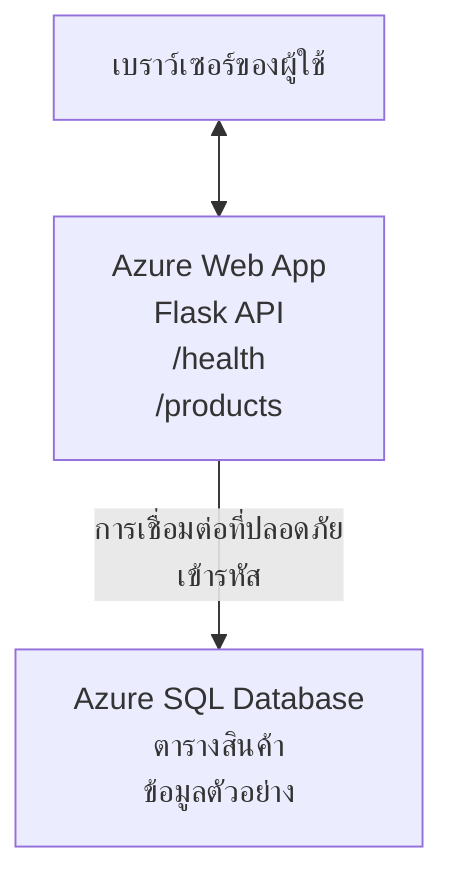

# การปรับใช้ฐานข้อมูล Microsoft SQL และเว็บแอปด้วย AZD

⏱️ **เวลาประมาณ**: 20-30 นาที | 💰 **ค่าใช้จ่ายโดยประมาณ**: ~$15-25/เดือน | ⭐ **ความซับซ้อน**: ระดับกลาง

**ตัวอย่างสมบูรณ์และใช้งานได้จริงนี้** แสดงวิธีใช้ [Azure Developer CLI (azd)](https://learn.microsoft.com/azure/developer/azure-developer-cli/) เพื่อปรับใช้เว็บแอป Python Flask ร่วมกับฐานข้อมูล Microsoft SQL บน Azure โค้ดทั้งหมดรวมอยู่และผ่านการทดสอบ—ไม่ต้องพึ่งพาภายนอก

## สิ่งที่คุณจะได้เรียนรู้

เมื่อทำตัวอย่างนี้สำเร็จ คุณจะได้:
- ปรับใช้แอปหลายชั้น (เว็บแอป + ฐานข้อมูล) โดยใช้โครงสร้างพื้นฐานในรูปแบบโค้ด
- กำหนดการเชื่อมต่อฐานข้อมูลอย่างปลอดภัยโดยไม่ต้องเขียนข้อมูลลับลงโค้ด
- ติดตามสุขภาพแอปพลิเคชันด้วย Application Insights
- จัดการทรัพยากร Azure อย่างมีประสิทธิภาพด้วย AZD CLI
- ปฏิบัติตามแนวทางปฏิบัติที่ดีที่สุดของ Azure ในเรื่องความปลอดภัย การประหยัดต้นทุน และการสังเกตการณ์

## ภาพรวมสถานการณ์
- **เว็บแอป**: Python Flask REST API พร้อมการเชื่อมต่อฐานข้อมูล
- **ฐานข้อมูล**: Azure SQL Database พร้อมข้อมูลตัวอย่าง
- **โครงสร้างพื้นฐาน**: กำหนดด้วย Bicep (เทมเพลตแบบโมดูลและใช้ซ้ำได้)
- **การปรับใช้**: ทำงานอัตโนมัติเต็มรูปแบบด้วยคำสั่ง `azd`
- **การติดตาม**: Application Insights สำหรับบันทึกและเทเลเมทรี

## ข้อกำหนดเบื้องต้น

### เครื่องมือที่ต้องมี

ก่อนเริ่ม ให้ตรวจสอบว่าคุณติดตั้งเครื่องมือเหล่านี้แล้ว:

1. **[Azure CLI](https://learn.microsoft.com/cli/azure/install-azure-cli)** (เวอร์ชัน 2.50.0 หรือสูงกว่า)
   ```sh
   az --version
   # ผลลัพธ์ที่คาดหวัง: azure-cli 2.50.0 หรือสูงกว่า
   ```

2. **[Azure Developer CLI (azd)](https://learn.microsoft.com/azure/developer/azure-developer-cli/install-azd)** (เวอร์ชัน 1.0.0 หรือสูงกว่า)
   ```sh
   azd version
   # ผลลัพธ์ที่คาดหวัง: azd เวอร์ชัน 1.0.0 หรือสูงกว่า
   ```

3. **[Python 3.8+](https://www.python.org/downloads/)** (สำหรับพัฒนาท้องถิ่น)
   ```sh
   python --version
   # ผลลัพธ์ที่คาดไว้: Python 3.8 หรือสูงกว่า
   ```

4. **[Docker](https://www.docker.com/get-started)** (ไม่บังคับ สำหรับการพัฒนาแบบคอนเทนเนอร์ในเครื่อง)
   ```sh
   docker --version
   # ผลลัพธ์ที่คาดไว้: Docker เวอร์ชัน 20.10 หรือสูงกว่า
   ```

### ข้อกำหนดของ Azure

- มี **บัญชี Azure ที่ใช้งานได้** ([สร้างบัญชีฟรี](https://azure.microsoft.com/free/))
- มีสิทธิ์ในการสร้างทรัพยากรในบัญชีของคุณ
- ได้รับบทบาท **Owner** หรือ **Contributor** บน subscription หรือ resource group

### ความรู้พื้นฐานที่ควรมี

ตัวอย่างนี้เป็นระดับ **กลาง** คุณควรคุ้นเคยกับ:
- การใช้งานคำสั่งพื้นฐานบนบรรทัดคำสั่ง
- แนวคิดพื้นฐานเกี่ยวกับคลาวด์ (ทรัพยากร, resource groups)
- ความเข้าใจพื้นฐานเกี่ยวกับเว็บแอปและฐานข้อมูล

**ยังใหม่กับ AZD?** เริ่มต้นด้วย [คู่มือเริ่มต้น](../../docs/chapter-01-foundation/azd-basics.md) ก่อน

## สถาปัตยกรรม

ตัวอย่างนี้ใช้สถาปัตยกรรมสองชั้น ประกอบด้วยเว็บแอปและฐานข้อมูล SQL:


**การปรับใช้ทรัพยากร:**
- **Resource Group**: ที่เก็บทรัพยากรทั้งหมด
- **App Service Plan**: โฮสติ้งบน Linux (ระดับ B1 เพื่อประหยัดต้นทุน)
- **Web App**: รันไทม์ Python 3.11 พร้อมแอป Flask
- **SQL Server**: เซิร์ฟเวอร์ฐานข้อมูลแบบจัดการ พร้อม TLS 1.2 เป็นขั้นต่ำ
- **SQL Database**: ระดับ Basic (2GB เหมาะสำหรับการพัฒนา/ทดสอบ)
- **Application Insights**: สำหรับการติดตามและบันทึก
- **Log Analytics Workspace**: ที่เก็บบันทึกแบบรวมศูนย์

**อุปมา**: คิดว่าเหมือนร้านอาหาร (เว็บแอป) ที่มีช่องแช่แข็งเดินเข้าได้ (ฐานข้อมูล) ลูกค้าสั่งจากเมนู (API endpoints) แล้วครัว (แอป Flask) ก็หยิบวัตถุดิบ (ข้อมูล) จากช่องแช่แข็ง ผู้จัดการร้าน (Application Insights) จะตรวจสอบทุกสิ่งที่เกิดขึ้น

## โครงสร้างโฟลเดอร์

ไฟล์ทั้งหมดรวมอยู่ในตัวอย่างนี้—ไม่ต้องพึ่งพาภายนอก:

```
examples/database-app/
│
├── README.md                    # This file
├── azure.yaml                   # AZD configuration file
├── .env.sample                  # Sample environment variables
├── .gitignore                   # Git ignore patterns
│
├── infra/                       # Infrastructure as Code (Bicep)
│   ├── main.bicep              # Main orchestration template
│   ├── abbreviations.json      # Azure naming conventions
│   └── resources/              # Modular resource templates
│       ├── sql-server.bicep    # SQL Server configuration
│       ├── sql-database.bicep  # Database configuration
│       ├── app-service-plan.bicep  # Hosting plan
│       ├── app-insights.bicep  # Monitoring setup
│       └── web-app.bicep       # Web application
│
└── src/
    └── web/                    # Application source code
        ├── app.py              # Flask REST API
        ├── requirements.txt    # Python dependencies
        └── Dockerfile          # Container definition
```

**ไฟล์แต่ละไฟล์ทำหน้าที่:**
- **azure.yaml**: บอก AZD ว่าจะปรับใช้และที่ไหน
- **infra/main.bicep**: จัดการทรัพยากร Azure ทั้งหมด
- **infra/resources/*.bicep**: คำนิยามทรัพยากรแต่ละตัว (แยกโมดูลเพื่อใช้ซ้ำ)
- **src/web/app.py**: แอป Flask พร้อมโลจิกฐานข้อมูล
- **requirements.txt**: รายการแพ็กเกจ Python ที่ต้องใช้
- **Dockerfile**: คำสั่งคอนเทนเนอร์สำหรับการปรับใช้

## เริ่มต้นอย่างรวดเร็ว (ขั้นตอนทีละขั้นตอน)

### ขั้นตอนที่ 1: โคลนและไปยังโฟลเดอร์โปรเจค

```sh
git clone https://github.com/microsoft/AZD-for-beginners.git
cd AZD-for-beginners/examples/database-app
```

**✓ ตรวจสอบความสำเร็จ**: ตรวจสอบว่าคุณเห็นไฟล์ `azure.yaml` และโฟลเดอร์ `infra/`:
```sh
ls
# ที่คาดไว้: README.md, azure.yaml, infra/, src/
```

### ขั้นตอนที่ 2: ลงชื่อเข้าใช้ Azure

```sh
azd auth login
```

จะเปิดเบราว์เซอร์สำหรับการเข้าสู่ระบบ Azure ลงชื่อเข้าใช้ด้วยบัญชี Azure ของคุณ

**✓ ตรวจสอบความสำเร็จ**: คุณควรเห็น:
```
Logged in to Azure.
```

### ขั้นตอนที่ 3: เริ่มต้นสภาพแวดล้อม

```sh
azd init
```

**สิ่งที่จะเกิดขึ้น**: AZD สร้างการตั้งค่าท้องถิ่นสำหรับการปรับใช้ของคุณ

**คำถามที่คุณจะเห็น**:
- **ชื่อสภาพแวดล้อม**: ใส่ชื่อสั้น ๆ (เช่น `dev`, `myapp`)
- **Azure subscription**: เลือก subscription ของคุณจากรายการ
- **Azure location**: เลือกภูมิภาค (เช่น `eastus`, `westeurope`)

**✓ ตรวจสอบความสำเร็จ**: คุณควรเห็น:
```
SUCCESS: New project initialized!
```

### ขั้นตอนที่ 4: จัดเตรียมทรัพยากร Azure

```sh
azd provision
```

**สิ่งที่จะเกิดขึ้น**: AZD ปรับใช้โครงสร้างพื้นฐานทั้งหมด (ใช้เวลาประมาณ 5-8 นาที):
1. สร้าง resource group
2. สร้าง SQL Server และฐานข้อมูล
3. สร้าง App Service Plan
4. สร้าง Web App
5. สร้าง Application Insights
6. กำหนดค่าเครือข่ายและความปลอดภัย

**คุณจะถูกถาม**:
- **ชื่อผู้ดูแลระบบ SQL**: ใส่ชื่อผู้ใช้ (เช่น `sqladmin`)
- **รหัสผ่านผู้ดูแลระบบ SQL**: ใส่รหัสผ่านที่แข็งแรง (โปรดบันทึก!)

**✓ ตรวจสอบความสำเร็จ**: คุณควรเห็น:
```
SUCCESS: Your application was provisioned in Azure in X minutes Y seconds.
You can view the resources created under the resource group rg-<env-name> in Azure Portal:
https://portal.azure.com/#@/resource/subscriptions/.../resourceGroups/rg-<env-name>
```

**⏱️ เวลา**: 5-8 นาที

### ขั้นตอนที่ 5: ปรับใช้แอปพลิเคชัน

```sh
azd deploy
```

**สิ่งที่จะเกิดขึ้น**: AZD สร้างและปรับใช้แอป Flask ของคุณ:
1. แพ็กเกจแอป Python
2. สร้างคอนเทนเนอร์ Docker
3. ดันขึ้นไปยัง Azure Web App
4. เริ่มต้นฐานข้อมูลพร้อมข้อมูลตัวอย่าง
5. เริ่มรันแอปพลิเคชัน

**✓ ตรวจสอบความสำเร็จ**: คุณควรเห็น:
```
SUCCESS: Your application was deployed to Azure in X minutes Y seconds.
You can view the resources created under the resource group rg-<env-name> in Azure Portal:
https://portal.azure.com/#@/resource/subscriptions/.../resourceGroups/rg-<env-name>
```

**⏱️ เวลา**: 3-5 นาที

### ขั้นตอนที่ 6: เปิดเว็บแอป

```sh
azd browse
```

จะเปิดเว็บแอปที่คุณปรับใช้ในเบราว์เซอร์ผ่าน URL `https://app-<unique-id>.azurewebsites.net`

**✓ ตรวจสอบความสำเร็จ**: คุณควรเห็นผลลัพธ์ JSON:
```json
{
  "message": "Welcome to the Database App API",
  "endpoints": {
    "/": "This help message",
    "/health": "Health check endpoint",
    "/products": "List all products",
    "/products/<id>": "Get product by ID"
  }
}
```

### ขั้นตอนที่ 7: ทดสอบ API Endpoints

**ตรวจสอบสุขภาพ** (เช็คการเชื่อมต่อฐานข้อมูล):
```sh
curl https://app-<your-id>.azurewebsites.net/health
```

**ผลลัพธ์ที่คาดหวัง**:
```json
{
  "status": "healthy",
  "database": "connected"
}
```

**รายการสินค้า** (ข้อมูลตัวอย่าง):
```sh
curl https://app-<your-id>.azurewebsites.net/products
```

**ผลลัพธ์ที่คาดหวัง**:
```json
[
  {
    "id": 1,
    "name": "Laptop",
    "description": "High-performance laptop",
    "price": 1299.99,
    "created_at": "2025-11-19T10:30:00"
  },
  ...
]
```

**ดูสินค้าเดี่ยว**:
```sh
curl https://app-<your-id>.azurewebsites.net/products/1
```

**✓ ตรวจสอบความสำเร็จ**: ทุก endpoint คืนข้อมูล JSON โดยไม่มีข้อผิดพลาด

---

**🎉 ยินดีด้วย!** คุณปรับใช้เว็บแอปพร้อมฐานข้อมูลบน Azure ด้วย AZD สำเร็จแล้ว

## เจาะลึกการตั้งค่า

### ตัวแปรสภาพแวดล้อม

การจัดการความลับทำอย่างปลอดภัยผ่านการตั้งค่า Azure App Service—**ไม่เคยเขียนข้อมูลลับลงในซอร์สโค้ด**

**ตั้งค่าระบบอัตโนมัติโดย AZD**:
- `SQL_CONNECTION_STRING`: สตริงเชื่อมต่อฐานข้อมูลพร้อมข้อมูลรับรองเข้ารหัส
- `APPLICATIONINSIGHTS_CONNECTION_STRING`: จุดเชื่อมต่อเทเลเมทรีสำหรับการติดตาม
- `SCM_DO_BUILD_DURING_DEPLOYMENT`: เปิดใช้งานการติดตั้ง dependencies อัตโนมัติเมื่อปรับใช้

**ที่เก็บความลับ**:
1. ขณะรัน `azd provision` คุณจะให้ข้อมูลรับรอง SQL ผ่านการป้อนข้อมูลแบบปลอดภัย
2. AZD เก็บไว้ในไฟล์ `.azure/<env-name>/.env` ในเครื่อง (ไม่ถูกบันทึกใน Git)
3. AZD ฉีดข้อมูลนี้ลงในการตั้งค่า Azure App Service (เข้ารหัสเมื่อพักข้อมูล)
4. แอปพลิเคชันอ่านค่าด้วย `os.getenv()` ในขณะรันไทม์

### การพัฒนาท้องถิ่น

สำหรับการทดสอบในเครื่อง ให้สร้างไฟล์ `.env` จากตัวอย่าง:

```sh
cp .env.sample .env
# แก้ไข .env ด้วยการเชื่อมต่อฐานข้อมูลท้องถิ่นของคุณ
```

**ขั้นตอนการพัฒนาท้องถิ่น**:
```sh
# ติดตั้ง dependencies
cd src/web
pip install -r requirements.txt

# ตั้งค่าตัวแปรแวดล้อม
export SQL_CONNECTION_STRING="your-local-connection-string"

# เรียกใช้งานแอปพลิเคชัน
python app.py
```

**ทดสอบในเครื่อง**:
```sh
curl http://localhost:8000/health
# คาดว่า: {"status": "healthy", "database": "connected"}
```

### โครงสร้างพื้นฐานในรูปแบบโค้ด

ทรัพยากร Azure ทั้งหมดกำหนดไว้ใน **เทมเพลต Bicep** (`infra/`):

- **ออกแบบแบบโมดูลาร์**: แต่ละประเภททรัพยากรมีไฟล์แยกเพื่อให้ใช้ซ้ำได้
- **รองรับพารามิเตอร์**: ปรับแต่ง SKU, ภูมิภาค, นามแฝงง่าย
- **แนวปฏิบัติที่ดีที่สุด**: ปฏิบัติตามมาตรฐานชื่อของ Azure และตั้งค่าความปลอดภัยเริ่มต้น
- **ควบคุมเวอร์ชัน**: การเปลี่ยนแปลงโครงสร้างพื้นฐานถูกติดตามใน Git

**ตัวอย่างการปรับแต่ง**:
ถ้าต้องการเปลี่ยนระดับฐานข้อมูล แก้ไขที่ `infra/resources/sql-database.bicep`:
```bicep
sku: {
  name: 'Standard'  // Changed from 'Basic'
  tier: 'Standard'
  capacity: 10
}
```

## แนวทางปฏิบัติด้านความปลอดภัยที่ดีที่สุด

ตัวอย่างนี้ปฏิบัติตามแนวทางความปลอดภัยของ Azure ดังนี้:

### 1. **ไม่มีข้อมูลลับในซอร์สโค้ด**
- ✅ ข้อมูลรับรองเก็บในการตั้งค่า Azure App Service (เข้ารหัส)
- ✅ ไฟล์ `.env` ถูกละเว้นใน Git ผ่าน `.gitignore`
- ✅ ความลับถูกส่งผ่านพารามิเตอร์ปลอดภัยขณะ provision

### 2. **เชื่อมต่อเข้ารหัส**
- ✅ TLS 1.2 อย่างต่ำสำหรับ SQL Server
- ✅ บังคับ HTTPS อย่างเดียวสำหรับเว็บแอป
- ✅ การเชื่อมต่อฐานข้อมูลใช้ช่องทางเข้ารหัส

### 3. **ความปลอดภัยเครือข่าย**
- ✅ กำหนดค่าไฟร์วอลล์ SQL Server ให้อนุญาตบริการ Azure เท่านั้น
- ✅ จำกัดการเข้าถึงเครือข่ายสาธารณะ (สามารถล็อกเพิ่มด้วย Private Endpoints)
- ✅ ปิด FTPS บนเว็บแอป

### 4. **การตรวจสอบสิทธิ์และการอนุญาต**
- ⚠️ **ปัจจุบัน**: การตรวจสอบสิทธิ์ SQL แบบ username/password
- ✅ **คำแนะนำสำหรับโปรดักชัน**: ใช้ Azure Managed Identity เพื่อลดการใช้รหัสผ่าน

**เพื่ออัปเกรดเป็น Managed Identity** (สำหรับโปรดักชัน):
1. เปิดใช้งาน managed identity บนเว็บแอป
2. ให้สิทธิ์ SQL กับ identity นั้น
3. อัปเดตสตริงเชื่อมต่อเพื่อใช้ managed identity
4. ลบการตรวจสอบสิทธิ์ด้วยรหัสผ่านออก

### 5. **การตรวจสอบและความสอดคล้อง**
- ✅ Application Insights บันทึกคำขอและข้อผิดพลาดทั้งหมด
- ✅ เปิดใช้งานการตรวจสอบ SQL Database (ตั้งค่าได้สำหรับความสอดคล้อง)
- ✅ ติดแท็กทรัพยากรทั้งหมดเพื่อบังคับใช้การบริหาร

**รายการตรวจสอบความปลอดภัยก่อนโปรดักชัน**:
- [ ] เปิดใช้งาน Azure Defender for SQL
- [ ] ตั้งค่า Private Endpoints สำหรับฐานข้อมูล SQL
- [ ] เปิดใช้งาน Web Application Firewall (WAF)
- [ ] ใช้งาน Azure Key Vault สำหรับการหมุนเวียนความลับ
- [ ] ตั้งค่าการตรวจสอบสิทธิ์ Azure AD
- [ ] เปิดใช้งานการบันทึกวินิจฉัยสำหรับทรัพยากรทั้งหมด

## การประหยัดต้นทุน

**ค่าใช้จ่ายโดยประมาณรายเดือน** (พฤศจิกายน 2025):

| ทรัพยากร | SKU/ระดับ | ค่าใช้จ่ายโดยประมาณ |
|----------|----------|----------------|
| App Service Plan | B1 (Basic) | ~$13/เดือน |
| SQL Database | Basic (2GB) | ~$5/เดือน |
| Application Insights | จ่ายตามการใช้งาน | ~$2/เดือน (ปริมาณน้อย) |
| **รวม** | | **~$20/เดือน** |

**💡 เคล็ดลับประหยัดค่าใช้จ่าย**:

1. **ใช้ระดับฟรีสำหรับการเรียนรู้**:
   - App Service: ระดับ F1 (ฟรี จำกัดชั่วโมง)
   - SQL Database: ใช้ Azure SQL Database แบบ serverless
   - Application Insights: ฟรี 5GB/เดือน สำหรับการดูดซึมข้อมูล

2. **ปิดทรัพยากรเมื่อไม่ได้ใช้งาน**:
   ```sh
   # หยุดเว็บแอพ (ฐานข้อมูลยังคงคิดค่าใช้จ่าย)
   az webapp stop --name <app-name> --resource-group <rg-name>
   
   # เริ่มใหม่เมื่อจำเป็น
   az webapp start --name <app-name> --resource-group <rg-name>
   ```

3. **ลบทั้งหมดหลังทดสอบเสร็จ**:
   ```sh
   azd down
   ```
   จะลบทรัพยากรทั้งหมดและหยุดค่าใช้จ่าย

4. **SKU สำหรับการพัฒนากับโปรดักชัน**:
   - **พัฒนา**: Basic tier (ตัวอย่างนี้ใช้)
   - **โปรดักชัน**: ระดับ Standard/Premium พร้อมความทนทาน

**การติดตามค่าใช้จ่าย**:
- ดูค่าใช้จ่ายใน [Azure Cost Management](https://portal.azure.com/#view/Microsoft_Azure_CostManagement)
- ตั้งค่าการแจ้งเตือนค่าใช้จ่ายเพื่อป้องกันค่าใช้จ่ายเกิน
- ติดแท็กรายการทรัพยากรด้วย `azd-env-name` เพื่อการติดตาม

**ทางเลือกระดับฟรี**:
สำหรับการเรียนรู้ สามารถแก้ไขที่ `infra/resources/app-service-plan.bicep`:
```bicep
sku: {
  name: 'F1'  // Free tier
  tier: 'Free'
}
```
**หมายเหตุ**: ระดับฟรีมีข้อจำกัด (CPU 60 นาที/วัน, ไม่มี always-on)

## การติดตามและสังเกตการณ์

### การรวม Application Insights

ตัวอย่างนี้รวม **Application Insights** เพื่อการติดตามแบบครบวงจร:

**สิ่งที่ติดตาม**:
- ✅ คำขอ HTTP (ความหน่วง, รหัสสถานะ, endpoints)
- ✅ ข้อผิดพลาดและข้อยกเว้นของแอป
- ✅ การบันทึกแบบกำหนดเองจากแอป Flask
- ✅ สุขภาพการเชื่อมต่อฐานข้อมูล
- ✅ เมตริกประสิทธิภาพ (CPU, หน่วยความจำ)

**เข้าถึง Application Insights**:
1. เปิด [Azure Portal](https://portal.azure.com)
2. ไปยัง resource group ของคุณ (`rg-<env-name>`)
3. คลิกที่ทรัพยากร Application Insights (`appi-<unique-id>`)

**คำสั่งค้นหาที่มีประโยชน์** (Application Insights → Logs):

**ดูคำขอทั้งหมด**:
```kusto
requests
| where timestamp > ago(1h)
| order by timestamp desc
| project timestamp, name, url, resultCode, duration
```

**ค้นหาข้อผิดพลาด**:
```kusto
exceptions
| where timestamp > ago(24h)
| order by timestamp desc
| project timestamp, type, outerMessage, operation_Name
```

**ตรวจสอบ Health Endpoint**:
```kusto
requests
| where name contains "health"
| summarize count() by resultCode, bin(timestamp, 1h)
```

### การตรวจสอบ SQL Database

**เปิดใช้งานการตรวจสอบ SQL Database** เพื่อติดตาม:
- รูปแบบการเข้าถึงฐานข้อมูล
- ความพยายามเข้าระบบที่ล้มเหลว
- การเปลี่ยนแปลงโครงสร้าง
- การเข้าถึงข้อมูล (สำหรับมาตรฐานความสอดคล้อง)

**เข้าถึงบันทึกการตรวจสอบ**:
1. Azure Portal → SQL Database → Auditing
2. ดูบันทึกใน Log Analytics workspace

### การติดตามแบบเรียลไทม์

**ดู Metrics สด**:
1. Application Insights → Live Metrics
2. ดูคำขอ, การล้มเหลว, และประสิทธิภาพแบบเรียลไทม์

**ตั้งค่าการแจ้งเตือน**:
สร้างการแจ้งเตือนสำหรับเหตุการณ์สำคัญ:
- HTTP 500 เกิน 5 ครั้งใน 5 นาที
- การเชื่อมต่อฐานข้อมูลล้มเหลว
- ระยะเวลาตอบสนองสูง (>2 วินาที)

**ตัวอย่างการสร้างการแจ้งเตือน**:
```sh
az monitor metrics alert create \
  --name "High-Response-Time" \
  --resource-group <rg-name> \
  --scopes <app-insights-resource-id> \
  --condition "avg requests/duration > 2000" \
  --description "Alert when response time exceeds 2 seconds"
```

## การแก้ปัญหา
### ปัญหาทั่วไปและวิธีแก้ไข

#### 1. `azd provision` ล้มเหลวพร้อมข้อความ "Location not available"

**อาการ**:  
```
Error: The subscription is not registered for the resource type 'components' in the location 'centralus'.
```
  
**วิธีแก้ไข**:  
เลือกภูมิภาค Azure อื่นหรือลงทะเบียนผู้ให้บริการทรัพยากร:  
```sh
az provider register --namespace Microsoft.Insights
```
  
#### 2. การเชื่อมต่อ SQL ล้มเหลวระหว่างการดีพลอย

**อาการ**:  
```
pyodbc.OperationalError: ('08001', '[08001] [Microsoft][ODBC Driver 18 for SQL Server]TCP Provider...')
```
  
**วิธีแก้ไข**:  
- ตรวจสอบว่าไฟร์วอลล์ของ SQL Server อนุญาตให้บริการ Azure เข้าถึงได้ (ตั้งค่าให้อัตโนมัติ)  
- ตรวจสอบว่ารหัสผ่านผู้ดูแลระบบ SQL ถูกป้อนไว้ถูกต้องในระหว่าง `azd provision`  
- ตรวจสอบว่า SQL Server ถูกตั้งค่าเสร็จสมบูรณ์ (อาจใช้เวลาประมาณ 2-3 นาที)  

**ตรวจสอบการเชื่อมต่อ**:  
```sh
# จาก Azure Portal ไปที่ SQL Database → Query editor
# ลองเชื่อมต่อด้วยข้อมูลประจำตัวของคุณ
```
  
#### 3. เว็บแอปแสดงข้อความ "Application Error"

**อาการ**:  
เบราว์เซอร์แสดงหน้าแสดงข้อผิดพลาดทั่วไป  

**วิธีแก้ไข**:  
ตรวจสอบบันทึกของแอปพลิเคชัน:  
```sh
# ดูบันทึกล่าสุด
az webapp log tail --name <app-name> --resource-group <rg-name>
```
  
**สาเหตุทั่วไป**:  
- ตัวแปรสภาพแวดล้อมหายไป (ตรวจสอบที่ App Service → Configuration)  
- การติดตั้งแพ็กเกจ Python ล้มเหลว (ตรวจสอบบันทึกการดีพลอย)  
- ข้อผิดพลาดการเริ่มต้นใช้งานฐานข้อมูล (ตรวจสอบการเชื่อมต่อ SQL)  

#### 4. `azd deploy` ล้มเหลวพร้อมข้อความ "Build Error"

**อาการ**:  
```
Error: Failed to build project
```
  
**วิธีแก้ไข**:  
- ตรวจสอบว่า `requirements.txt` ไม่มีข้อผิดพลาดทางไวยากรณ์  
- ตรวจสอบให้แน่ใจว่า Python 3.11 ถูกระบุใน `infra/resources/web-app.bicep`  
- ตรวจสอบว่า Dockerfile ใช้ base image ที่ถูกต้อง  

**ดีบักในเครื่อง**:  
```sh
cd src/web
docker build -t test-app .
docker run -p 8000:8000 test-app
```
  
#### 5. "Unauthorized" เมื่อรันคำสั่ง AZD

**อาการ**:  
```
ERROR: (Unauthorized) The client '<id>' with object id '<id>' does not have authorization
```
  
**วิธีแก้ไข**:  
เข้าสู่ระบบ Azure ใหม่:  
```sh
# จำเป็นสำหรับเวิร์กโฟลว์ AZD
azd auth login

# เป็นทางเลือกหากคุณใช้คำสั่ง Azure CLI โดยตรงด้วย
az login
```
  
ตรวจสอบว่าคุณมีสิทธิ์ที่ถูกต้อง (บทบาท Contributor) ในการสมัครใช้งาน  

#### 6. ค่าใช้จ่ายฐานข้อมูลสูง

**อาการ**:  
บิล Azure เกิดขึ้นโดยไม่คาดคิด  

**วิธีแก้ไข**:  
- ตรวจสอบว่าคุณลืมรัน `azd down` หลังการทดสอบหรือไม่  
- ตรวจสอบว่า SQL Database ใช้ระดับ Basic (ไม่ใช่ Premium)  
- ตรวจสอบค่าใช้จ่ายใน Azure Cost Management  
- ตั้งค่าการแจ้งเตือนค่าใช้จ่าย  

### การขอความช่วยเหลือ

**ดูตัวแปรสภาพแวดล้อม AZD ทั้งหมด**:  
```sh
azd env get-values
```
  
**ตรวจสอบสถานะการดีพลอย**:  
```sh
az webapp show --name <app-name> --resource-group <rg-name> --query state
```
  
**เข้าถึงบันทึกแอปพลิเคชัน**:  
```sh
az webapp log download --name <app-name> --resource-group <rg-name> --log-file app-logs.zip
```
  
**ต้องการความช่วยเหลือเพิ่มเติม?**  
- [คู่มือแก้ไขปัญหา AZD](../../docs/chapter-07-troubleshooting/common-issues.md)  
- [การแก้ไขปัญหา Azure App Service](https://learn.microsoft.com/azure/app-service/troubleshoot-diagnostic-logs)  
- [การแก้ไขปัญหา Azure SQL](https://learn.microsoft.com/azure/azure-sql/database/troubleshoot-common-errors-issues)  

## แบบฝึกหัดภาคปฏิบัติ

### แบบฝึกหัด 1: ยืนยันการดีพลอยของคุณ (ระดับเริ่มต้น)

**เป้าหมาย**: ยืนยันว่าทรัพยากรทั้งหมดถูกดีพลอยและแอปพลิเคชันทำงานได้  

**ขั้นตอน**:  
1. แสดงรายการทรัพยากรทั้งหมดในกลุ่มทรัพยากรของคุณ:  
   ```sh
   az resource list --resource-group rg-<env-name> --output table
   ```
   **คาดหวัง**: มีทรัพยากร 6-7 รายการ (Web App, SQL Server, SQL Database, App Service Plan, Application Insights, Log Analytics)  

2. ทดสอบ endpoints ทั้งหมดของ API:  
   ```sh
   curl https://app-<your-id>.azurewebsites.net/
   curl https://app-<your-id>.azurewebsites.net/health
   curl https://app-<your-id>.azurewebsites.net/products
   curl https://app-<your-id>.azurewebsites.net/products/1
   ```
   **คาดหวัง**: ทุก endpoints ส่งคืน JSON ที่ถูกต้องโดยไม่มีข้อผิดพลาด  

3. ตรวจสอบ Application Insights:  
   - ไปที่ Application Insights ใน Azure Portal  
   - เข้าไปที่ "Live Metrics"  
   - รีเฟรชเบราว์เซอร์ของคุณบนเว็บแอป  
   **คาดหวัง**: เห็นคำขอปรากฏเป็นเวลาจริง  

**เกณฑ์ความสำเร็จ**: มีทรัพยากรทั้งหมด 6-7 รายการ, endpoints ทุกตัวส่งคืนข้อมูล, Live Metrics แสดงการทำงาน  

---

### แบบฝึกหัด 2: เพิ่ม API Endpoint ใหม่ (ระดับกลาง)

**เป้าหมาย**: ขยายแอป Flask ด้วย endpoint ใหม่  

**โค้ดเริ่มต้น**: endpoints ปัจจุบันใน `src/web/app.py`  

**ขั้นตอน**:  
1. แก้ไข `src/web/app.py` และเพิ่ม endpoint ใหม่หลังฟังก์ชัน `get_product()`:  
   ```python
   @app.route('/products/search/<keyword>')
   def search_products(keyword):
       """Search products by name or description."""
       try:
           conn = get_db_connection()
           cursor = conn.cursor()
           cursor.execute(
               "SELECT id, name, description, price, created_at FROM products WHERE name LIKE ? OR description LIKE ?",
               (f'%{keyword}%', f'%{keyword}%')
           )
           
           products = []
           for row in cursor.fetchall():
               products.append({
                   'id': row[0],
                   'name': row[1],
                   'description': row[2],
                   'price': float(row[3]) if row[3] else None,
                   'created_at': row[4].isoformat() if row[4] else None
               })
           
           cursor.close()
           conn.close()
           
           logger.info(f"Search for '{keyword}' returned {len(products)} results")
           return jsonify(products), 200
           
       except Exception as e:
           logger.error(f"Error searching products: {str(e)}")
           return jsonify({'error': str(e)}), 500
   ```
  
2. ดีพลอยแอปพลิเคชันที่ปรับปรุงแล้ว:  
   ```sh
   azd deploy
   ```
  
3. ทดสอบ endpoint ใหม่:  
   ```sh
   curl https://app-<your-id>.azurewebsites.net/products/search/laptop
   ```
   **คาดหวัง**: ส่งคืนสินค้าที่ตรงกับ "laptop"  

**เกณฑ์ความสำเร็จ**: endpoint ใหม่ทำงาน, ส่งคืนผลลัพธ์ที่กรองแล้ว, ปรากฏในบันทึก Application Insights  

---

### แบบฝึกหัด 3: เพิ่มการติดตามและแจ้งเตือน (ระดับสูง)

**เป้าหมาย**: ตั้งค่าการติดตามอย่างรอบคอบพร้อมแจ้งเตือน  

**ขั้นตอน**:  
1. สร้างการแจ้งเตือนสำหรับข้อผิดพลาด HTTP 500:  
   ```sh
   # รับรหัสทรัพยากร Application Insights
   AI_ID=$(az monitor app-insights component show \
     --app appi-<your-id> \
     --resource-group rg-<env-name> \
     --query id -o tsv)
   
   # สร้างการแจ้งเตือน
   az monitor metrics alert create \
     --name "High-Error-Rate" \
     --resource-group rg-<env-name> \
     --scopes $AI_ID \
     --condition "count requests/failed > 5" \
     --window-size 5m \
     --evaluation-frequency 1m \
     --description "Alert when >5 failed requests in 5 minutes"
   ```
  
2. ทริกเกอร์การแจ้งเตือนด้วยการสร้างข้อผิดพลาด:  
   ```sh
   # ขอสินค้าที่ไม่มีอยู่จริง
   for i in {1..10}; do curl https://app-<your-id>.azurewebsites.net/products/999; done
   ```
  
3. ตรวจสอบว่าการแจ้งเตือนออกทำงาน:  
   - Azure Portal → Alerts → Alert Rules  
   - ตรวจสอบอีเมลของคุณ (ถ้าตั้งค่าไว้)  

**เกณฑ์ความสำเร็จ**: สร้างกฎแจ้งเตือนแล้ว, แจ้งเตือนเมื่อเกิดข้อผิดพลาด, ได้รับการแจ้งเตือน  

---

### แบบฝึกหัด 4: การเปลี่ยนแปลงโครงสร้างฐานข้อมูล (ระดับสูง)

**เป้าหมาย**: เพิ่มตารางใหม่และปรับแอปให้ใช้ข้อมูลนั้น  

**ขั้นตอน**:  
1. เชื่อมต่อกับ SQL Database ผ่าน Azure Portal Query Editor  

2. สร้างตาราง `categories` ใหม่:  
   ```sql
   CREATE TABLE categories (
       id INT PRIMARY KEY IDENTITY(1,1),
       name NVARCHAR(50) NOT NULL,
       description NVARCHAR(200)
   );
   
   INSERT INTO categories (name, description) VALUES
   ('Electronics', 'Electronic devices and accessories'),
   ('Office Supplies', 'Office equipment and supplies');
   
   -- Add category to products table
   ALTER TABLE products ADD category_id INT;
   UPDATE products SET category_id = 1; -- Set all to Electronics
   ```
  
3. อัปเดต `src/web/app.py` เพื่อรวมข้อมูลประเภทสินค้าในคำตอบ  

4. ดีพลอยและทดสอบ  

**เกณฑ์ความสำเร็จ**: ตารางใหม่มีอยู่, ผลิตภัณฑ์แสดงข้อมูลประเภท, แอปยังทำงานได้  

---

### แบบฝึกหัด 5: นำแคชมาใช้ (ระดับเชี่ยวชาญ)

**เป้าหมาย**: เพิ่ม Azure Redis Cache เพื่อปรับปรุงประสิทธิภาพ  

**ขั้นตอน**:  
1. เพิ่ม Redis Cache ใน `infra/main.bicep`  
2. อัปเดต `src/web/app.py` เพื่อแคชคำค้นหาสินค้า  
3. วัดการปรับปรุงประสิทธิภาพด้วย Application Insights  
4. เปรียบเทียบเวลาตอบสนองก่อนและหลังใช้แคช  

**เกณฑ์ความสำเร็จ**: Redis ถูกดีพลอย, การแคชชิ่งทำงาน, เวลาตอบสนองดีขึ้นกว่าเดิม >50%  

**คำแนะนำ**: เริ่มต้นที่ [เอกสาร Azure Cache for Redis](https://learn.microsoft.com/azure/azure-cache-for-redis/)  

---

## การล้างข้อมูล

เพื่อหลีกเลี่ยงค่าใช้จ่ายที่เกิดขึ้นต่อเนื่อง ให้ลบทรัพยากรทั้งหมดเมื่อเสร็จสิ้น:

```sh
azd down
```
  
**พรอมต์ยืนยัน**:  
```
? Total resources to delete: 7, are you sure you want to continue? (y/N)
```
  
พิมพ์ `y` เพื่อยืนยัน  

**✓ ตรวจสอบความสำเร็จ**:  
- ทรัพยากรถูกลบออกทั้งหมดใน Azure Portal  
- ไม่มีค่าใช้จ่ายเกิดขึ้นต่อเนื่อง  
- โฟลเดอร์ `.azure/<env-name>` ในเครื่องสามารถลบได้  

**ทางเลือก** (เก็บโครงสร้างพื้นฐาน, ลบข้อมูล):  
```sh
# ลบเฉพาะกลุ่มทรัพยากร (เก็บการตั้งค่า AZD ไว้)
az group delete --name rg-<env-name> --yes
```
## เรียนรู้เพิ่มเติม

### เอกสารที่เกี่ยวข้อง  
- [เอกสาร Azure Developer CLI](https://learn.microsoft.com/azure/developer/azure-developer-cli/)  
- [เอกสาร Azure SQL Database](https://learn.microsoft.com/azure/azure-sql/database/)  
- [เอกสาร Azure App Service](https://learn.microsoft.com/azure/app-service/)  
- [เอกสาร Application Insights](https://learn.microsoft.com/azure/azure-monitor/app/app-insights-overview)  
- [ข้อมูลอ้างอิงภาษา Bicep](https://learn.microsoft.com/azure/azure-resource-manager/bicep/)  

### ขั้นตอนถัดไปในหลักสูตรนี้  
- **[ตัวอย่าง Container Apps](../../../../examples/container-app)**: ดีพลอยไมโครเซอร์วิสด้วย Azure Container Apps  
- **[คู่มือการรวม AI](../../../../docs/ai-foundry)**: เพิ่มความสามารถ AI ให้แอปของคุณ  
- **[แนวทางปฏิบัติที่ดีที่สุดในการดีพลอย](../../docs/chapter-04-infrastructure/deployment-guide.md)**: รูปแบบการดีพลอยในโปรดักชัน  

### หัวข้อขั้นสูง  
- **Managed Identity**: ลบรหัสผ่านและใช้การพิสูจน์ตัวตน Azure AD  
- **Private Endpoints**: ปกป้องการเชื่อมต่อฐานข้อมูลภายในโครงข่ายเสมือน  
- **การผสาน CI/CD**: อัตโนมัติการดีพลอยด้วย GitHub Actions หรือ Azure DevOps  
- **หลายสภาพแวดล้อม**: ตั้งค่าสภาพแวดล้อม dev, staging, production  
- **ฐานข้อมูลย้ายเวอร์ชัน**: ใช้ Alembic หรือ Entity Framework สำหรับการจัดการเวอร์ชันโครงสร้างฐานข้อมูล  

### เปรียบเทียบกับแนวทางอื่น

**AZD กับ ARM Templates**:  
- ✅ AZD: ระดับนามธรรมสูงกว่า, คำสั่งง่ายกว่า  
- ⚠️ ARM: รายละเอียดมาก, ควบคุมแบบละเอียด  

**AZD กับ Terraform**:  
- ✅ AZD: เป็นเนทีฟ Azure, ผสานกับบริการ Azure  
- ⚠️ Terraform: รองรับหลายคลาวด์, ระบบนิเวศใหญ่กว่า  

**AZD กับ Azure Portal**:  
- ✅ AZD: ทำซ้ำได้, ควบคุมเวอร์ชัน, อัตโนมัติได้  
- ⚠️ Portal: คลิกด้วยมือ, ยากต่อการทำซ้ำ  

**คิดถึง AZD เหมือน**: Docker Compose สำหรับ Azure—การตั้งค่าที่ง่ายสำหรับการดีพลอยที่ซับซ้อน  

---

## คำถามที่พบบ่อย

**ถาม: ฉันใช้ภาษาโปรแกรมอื่นได้ไหม?**  
ตอบ: ได้! แค่แทนที่ `src/web/` ด้วย Node.js, C#, Go หรือภาษาอื่น ๆ อัปเดต `azure.yaml` และ Bicep ตามนั้น  

**ถาม: ฉันจะเพิ่มฐานข้อมูลมากขึ้นได้อย่างไร?**  
ตอบ: เพิ่มโมดูล SQL Database อื่นใน `infra/main.bicep` หรือใช้ PostgreSQL/MySQL จากบริการ Azure Database  

**ถาม: ฉันจะใช้ในโปรดักชันได้ไหม?**  
ตอบ: นี่เป็นจุดเริ่มต้น สำหรับโปรดักชัน เพิ่ม: managed identity, private endpoints, ความทนทาน, กลยุทธ์แบ็คอัป, WAF และการติดตามขั้นสูง  

**ถาม: ถ้าฉันอยากใช้คอนเทนเนอร์แทนการดีพลอยโค้ดล่ะ?**  
ตอบ: ดู [ตัวอย่าง Container Apps](../../../../examples/container-app) ซึ่งใช้คอนเทนเนอร์ Docker ตลอดกระบวนการ  

**ถาม: ฉันจะเชื่อมต่อกับฐานข้อมูลจากเครื่องท้องถิ่นได้อย่างไร?**  
ตอบ: เพิ่ม IP ของคุณในไฟร์วอลล์ SQL Server:  
```sh
az sql server firewall-rule create \
  --resource-group rg-<env-name> \
  --server sql-<unique-id> \
  --name AllowMyIP \
  --start-ip-address <your-ip> \
  --end-ip-address <your-ip>
```
  
**ถาม: ฉันจะใช้ฐานข้อมูลที่มีอยู่แทนสร้างใหม่ได้ไหม?**  
ตอบ: ได้ แก้ไข `infra/main.bicep` ให้ชี้ไปยัง SQL Server ที่มีอยู่ และอัปเดตพารามิเตอร์สตริงเชื่อมต่อ  

---

> **หมายเหตุ:** ตัวอย่างนี้แสดงแนวทางปฏิบัติที่ดีที่สุดสำหรับการดีพลอยเว็บแอปพร้อมฐานข้อมูลโดยใช้ AZD รวมโค้ดที่ทำงานได้ เอกสารครบถ้วน และแบบฝึกหัดภาคปฏิบัติเพื่อเสริมการเรียนรู้ สำหรับการดีพลอยโปรดักชัน ควรทบทวนเรื่องความปลอดภัย, การปรับขนาด, การปฏิบัติตามข้อกำหนด และข้อกำหนดด้านค่าใช้จ่ายเฉพาะขององค์กรคุณ  

**📚 การนำทางหลักสูตร:**  
- ← ก่อนหน้า: [ตัวอย่าง Container Apps](../../../../examples/container-app)  
- → ถัดไป: [คู่มือการรวม AI](../../../../docs/ai-foundry)  
- 🏠 [หน้าหลักหลักสูตร](../../README.md)

---

<!-- CO-OP TRANSLATOR DISCLAIMER START -->
**ข้อจำกัดความรับผิดชอบ**:  
เอกสารนี้ได้รับการแปลโดยใช้บริการแปลภาษาด้วย AI [Co-op Translator](https://github.com/Azure/co-op-translator) แม้ว่าเราจะพยายามให้ข้อมูลที่ถูกต้อง โปรดทราบว่าการแปลอัตโนมัติอาจมีข้อผิดพลาดหรือความไม่ถูกต้อง เอกสารต้นฉบับในภาษาดั้งเดิมควรถือเป็นแหล่งข้อมูลที่น่าเชื่อถือ สำหรับข้อมูลที่สำคัญแนะนำให้ใช้การแปลโดยมืออาชีพที่เป็นมนุษย์ เราไม่รับผิดชอบต่อความเข้าใจผิดหรือการตีความผิดใด ๆ ที่เกิดจากการใช้การแปลนี้
<!-- CO-OP TRANSLATOR DISCLAIMER END -->