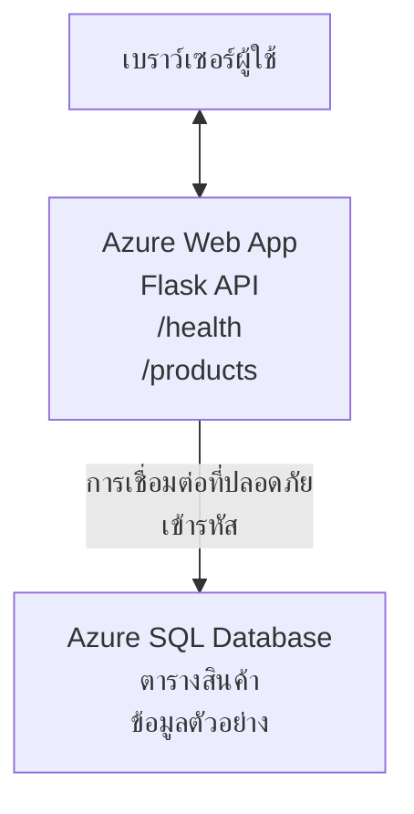

# การปรับใช้ฐานข้อมูล Microsoft SQL และเว็บแอปด้วย AZD

⏱️ **เวลาที่ประมาณ**: 20-30 นาที | 💰 **ต้นทุนโดยประมาณ**: ~$15-25/เดือน | ⭐ **ความซับซ้อน**: ระดับกลาง

**ตัวอย่างที่สมบูรณ์และใช้งานได้จริงนี้** แสดงวิธีใช้ [Azure Developer CLI (azd)](https://learn.microsoft.com/azure/developer/azure-developer-cli/) ในการปรับใช้เว็บแอป Python Flask พร้อมฐานข้อมูล Microsoft SQL ไปยัง Azure โค้ดทั้งหมดรวมอยู่และผ่านการทดสอบเรียบร้อย — ไม่มีความต้องการภายนอก

## สิ่งที่คุณจะได้เรียนรู้

โดยผ่านตัวอย่างนี้ คุณจะได้:
- ปรับใช้แอปหลายชั้น (เว็บแอป + ฐานข้อมูล) โดยใช้โครงสร้างพื้นฐานเป็นโค้ด
- กำหนดค่าการเชื่อมต่อฐานข้อมูลอย่างปลอดภัยโดยไม่ต้องเขียนข้อมูลลับลงในโค้ด
- ตรวจสอบสุขภาพแอปด้วย Application Insights
- จัดการทรัพยากร Azure อย่างมีประสิทธิภาพด้วย AZD CLI
- ปฏิบัติตามแนวปฏิบัติที่ดีที่สุดของ Azure ด้านความปลอดภัย การประหยัดต้นทุน และการสังเกตการณ์

## ภาพรวมสถานการณ์
- **เว็บแอป**: Python Flask REST API ที่เชื่อมต่อฐานข้อมูล
- **ฐานข้อมูล**: Azure SQL Database พร้อมข้อมูลตัวอย่าง
- **โครงสร้างพื้นฐาน**: จัดเตรียมด้วย Bicep (เทมเพลตแบบโมดูลและนำกลับมาใช้ซ้ำได้)
- **การปรับใช้**: อัตโนมัติเต็มรูปแบบด้วยคำสั่ง `azd`
- **การตรวจสอบ**: Application Insights สำหรับบันทึกและเทเลเมทรี

## ข้อกำหนดเบื้องต้น

### เครื่องมือที่ต้องมี

ก่อนเริ่มต้น ให้ตรวจสอบว่าคุณมีเครื่องมือเหล่านี้ติดตั้ง:

1. **[Azure CLI](https://learn.microsoft.com/cli/azure/install-azure-cli)** (เวอร์ชัน 2.50.0 หรือสูงกว่า)
   ```sh
   az --version
   # ผลลัพธ์ที่คาดหวัง: azure-cli 2.50.0 หรือสูงกว่า
   ```

2. **[Azure Developer CLI (azd)](https://learn.microsoft.com/azure/developer/azure-developer-cli/install-azd)** (เวอร์ชัน 1.0.0 หรือสูงกว่า)
   ```sh
   azd version
   # คาดหวังผลลัพธ์: azd รุ่น 1.0.0 หรือสูงกว่า
   ```

3. **[Python 3.8+](https://www.python.org/downloads/)** (สำหรับการพัฒนาแบบโลคอล)
   ```sh
   python --version
   # ผลลัพธ์ที่คาดไว้: Python 3.8 หรือสูงกว่า
   ```

4. **[Docker](https://www.docker.com/get-started)** (ตัวเลือกเสริม สำหรับการพัฒนาในคอนเทนเนอร์แบบโลคอล)
   ```sh
   docker --version
   # ผลลัพธ์ที่คาดหวัง: Docker เวอร์ชัน 20.10 หรือสูงกว่า
   ```

### ข้อกำหนดของ Azure

- มี **บัญชีผู้ใช้ Azure ที่ใช้งานได้** ([สร้างบัญชีฟรี](https://azure.microsoft.com/free/))
- สิทธิ์ในการสร้างทรัพยากรในบัญชีของคุณ
- บทบาท **Owner** หรือ **Contributor** บน subscription หรือ resource group

### ความรู้พื้นฐานที่ต้องมี

ตัวอย่างนี้อยู่ในระดับ **กลาง** คุณควรมีความคุ้นเคยกับ:
- การใช้งานบรรทัดคำสั่งพื้นฐาน
- แนวคิดพื้นฐานเกี่ยวกับคลาวด์ (ทรัพยากร, resource groups)
- ความเข้าใจพื้นฐานเกี่ยวกับเว็บแอปและฐานข้อมูล

**ถ้าใหม่กับ AZD?** เริ่มที่ [คู่มือเริ่มต้น](../../docs/chapter-01-foundation/azd-basics.md) ก่อน

## สถาปัตยกรรม

ตัวอย่างนี้ปรับใช้สถาปัตยกรรมสองชั้นประกอบด้วยเว็บแอปและฐานข้อมูล SQL:



**การปรับใช้ทรัพยากร:**
- **Resource Group**: ตัวบรรจุทรัพยากรทั้งหมด
- **App Service Plan**: โฮสติ้งบน Linux (ชั้น B1 เพื่อประหยัดต้นทุน)
- **Web App**: รันไทม์ Python 3.11 พร้อมแอป Flask
- **SQL Server**: เซิร์ฟเวอร์ฐานข้อมูลที่จัดการพร้อม TLS 1.2 ขั้นต่ำ
- **SQL Database**: ชั้น Basic (2GB เหมาะสำหรับการพัฒนา/ทดสอบ)
- **Application Insights**: การตรวจสอบและบันทึก
- **Log Analytics Workspace**: ที่เก็บบันทึกแบบรวมศูนย์

**เปรียบเทียบ**: นึกถึงเหมือนร้านอาหาร (เว็บแอป) ที่มีตู้เย็นแช่แข็ง (ฐานข้อมูล) ลูกค้าสั่งอาหารจากเมนู (API endpoints) และครัว (แอป Flask) นำวัตถุดิบ (ข้อมูล) จากตู้เย็น ผู้จัดการร้าน (Application Insights) คอยติดตามทุกอย่างที่เกิดขึ้น

## โครงสร้างโฟลเดอร์

ไฟล์ทั้งหมดรวมอยู่ในตัวอย่างนี้ — ไม่มีความต้องการภายนอก:

```
examples/database-app/
│
├── README.md                    # This file
├── azure.yaml                   # AZD configuration file
├── .env.sample                  # Sample environment variables
├── .gitignore                   # Git ignore patterns
│
├── infra/                       # Infrastructure as Code (Bicep)
│   ├── main.bicep              # Main orchestration template
│   ├── abbreviations.json      # Azure naming conventions
│   └── resources/              # Modular resource templates
│       ├── sql-server.bicep    # SQL Server configuration
│       ├── sql-database.bicep  # Database configuration
│       ├── app-service-plan.bicep  # Hosting plan
│       ├── app-insights.bicep  # Monitoring setup
│       └── web-app.bicep       # Web application
│
└── src/
    └── web/                    # Application source code
        ├── app.py              # Flask REST API
        ├── requirements.txt    # Python dependencies
        └── Dockerfile          # Container definition
```

**แต่ละไฟล์ทำหน้าที่อะไร:**
- **azure.yaml**: กำหนดสิ่งที่ AZD จะปรับใช้และตำแหน่ง
- **infra/main.bicep**: ควบคุมทุกทรัพยากร Azure
- **infra/resources/*.bicep**: กำหนดทรัพยากรแต่ละชนิด (โมดูลสำหรับนำกลับมาใช้ซ้ำ)
- **src/web/app.py**: เว็บแอป Flask พร้อมตรรกะฐานข้อมูล
- **requirements.txt**: รายการ dependency ของ Python
- **Dockerfile**: คำสั่งสำหรับบรรจุแอปในคอนเทนเนอร์เพื่อการปรับใช้

## เริ่มต้นอย่างรวดเร็ว (ขั้นตอนทีละขั้น)

### ขั้นตอนที่ 1: โคลนและเข้าสู่โฟลเดอร์

```sh
git clone https://github.com/microsoft/AZD-for-beginners.git
cd AZD-for-beginners/examples/database-app
```

**✓ ตรวจสอบความสำเร็จ**: ยืนยันว่าคุณเห็นไฟล์ `azure.yaml` และโฟลเดอร์ `infra/`:
```sh
ls
# คาดหวัง: README.md, azure.yaml, infra/, src/
```

### ขั้นตอนที่ 2: ยืนยันตัวตนกับ Azure

```sh
azd auth login
```

จะเปิดเบราว์เซอร์ให้คุณลงชื่อเข้าใช้ด้วยข้อมูล Azure ของคุณ

**✓ ตรวจสอบความสำเร็จ**: คุณควรเห็น:
```
Logged in to Azure.
```

### ขั้นตอนที่ 3: เริ่มต้นสภาพแวดล้อม

```sh
azd init
```

**เกิดอะไรขึ้น**: AZD สร้างการตั้งค่าโลคอลสำหรับการปรับใช้ของคุณ

**พร้อมท์ที่คุณจะเห็น**:
- **ชื่อสภาพแวดล้อม**: กรอกชื่อสั้นๆ (เช่น `dev`, `myapp`)
- **Azure subscription**: เลือก subscription ของคุณจากรายการ
- **ตำแหน่ง Azure**: เลือกภูมิภาค (เช่น `eastus`, `westeurope`)

**✓ ตรวจสอบความสำเร็จ**: คุณควรเห็น:
```
SUCCESS: New project initialized!
```

### ขั้นตอนที่ 4: จัดเตรียมทรัพยากร Azure

```sh
azd provision
```

**เกิดอะไรขึ้น**: AZD ปรับใช้โครงสร้างพื้นฐานทั้งหมด (ใช้เวลาประมาณ 5-8 นาที):
1. สร้าง resource group
2. สร้าง SQL Server และฐานข้อมูล
3. สร้าง App Service Plan
4. สร้าง Web App
5. สร้าง Application Insights
6. กำหนดค่าเครือข่ายและความปลอดภัย

**คุณจะถูกถามสำหรับ**:
- **ชื่อผู้ใช้ admin SQL**: กรอกชื่อผู้ใช้ (เช่น `sqladmin`)
- **รหัสผ่าน admin SQL**: กรอกรหัสผ่านที่ปลอดภัย (เก็บรหัสนี้ไว้ให้ดี!)

**✓ ตรวจสอบความสำเร็จ**: คุณควรเห็น:
```
SUCCESS: Your application was provisioned in Azure in X minutes Y seconds.
You can view the resources created under the resource group rg-<env-name> in Azure Portal:
https://portal.azure.com/#@/resource/subscriptions/.../resourceGroups/rg-<env-name>
```

**⏱️ เวลา**: 5-8 นาที

### ขั้นตอนที่ 5: ปรับใช้แอปพลิเคชัน

```sh
azd deploy
```

**เกิดอะไรขึ้น**: AZD สร้างและปรับใช้แอป Flask ของคุณ:
1. แพ็กเกจแอป Python
2. สร้างคอนเทนเนอร์ Docker
3. ดันไปยัง Azure Web App
4. เริ่มต้นฐานข้อมูลด้วยข้อมูลตัวอย่าง
5. เริ่มแอปพลิเคชัน

**✓ ตรวจสอบความสำเร็จ**: คุณควรเห็น:
```
SUCCESS: Your application was deployed to Azure in X minutes Y seconds.
You can view the resources created under the resource group rg-<env-name> in Azure Portal:
https://portal.azure.com/#@/resource/subscriptions/.../resourceGroups/rg-<env-name>
```

**⏱️ เวลา**: 3-5 นาที

### ขั้นตอนที่ 6: ท่องเว็บแอป

```sh
azd browse
```

จะเปิดเว็บแอปที่ปรับใช้ของคุณในเบราว์เซอร์ที่ `https://app-<unique-id>.azurewebsites.net`

**✓ ตรวจสอบความสำเร็จ**: คุณควรเห็นผลลัพธ์แบบ JSON:
```json
{
  "message": "Welcome to the Database App API",
  "endpoints": {
    "/": "This help message",
    "/health": "Health check endpoint",
    "/products": "List all products",
    "/products/<id>": "Get product by ID"
  }
}
```

### ขั้นตอนที่ 7: ทดสอบ API Endpoints

**ตรวจสอบสุขภาพ** (ยืนยันการเชื่อมต่อฐานข้อมูล):
```sh
curl https://app-<your-id>.azurewebsites.net/health
```

**คำตอบที่คาดหวัง**:
```json
{
  "status": "healthy",
  "database": "connected"
}
```

**รายการสินค้า** (ข้อมูลตัวอย่าง):
```sh
curl https://app-<your-id>.azurewebsites.net/products
```

**คำตอบที่คาดหวัง**:
```json
[
  {
    "id": 1,
    "name": "Laptop",
    "description": "High-performance laptop",
    "price": 1299.99,
    "created_at": "2025-11-19T10:30:00"
  },
  ...
]
```

**ดูรายละเอียดสินค้ารายตัว**:
```sh
curl https://app-<your-id>.azurewebsites.net/products/1
```

**✓ ตรวจสอบความสำเร็จ**: ทุก endpoints ส่งคืนข้อมูล JSON โดยไม่มีข้อผิดพลาด

---

**🎉 ยินดีด้วย!** คุณปรับใช้เว็บแอปพร้อมฐานข้อมูลไปยัง Azure สำเร็จด้วย AZD

## การกำหนดค่าลึก

### ตัวแปรสภาพแวดล้อม

ข้อมูลลับถูกจัดการอย่างปลอดภัยผ่านการตั้งค่า Azure App Service — **ไม่เขียนลงในซอร์สโค้ดโดยตรง**

**กำหนดค่าโดยอัตโนมัติผ่าน AZD**:
- `SQL_CONNECTION_STRING`: สายการเชื่อมต่อฐานข้อมูลพร้อมข้อมูลรับรองเข้ารหัส
- `APPLICATIONINSIGHTS_CONNECTION_STRING`: จุดปลายสำหรับเทเลเมทรี
- `SCM_DO_BUILD_DURING_DEPLOYMENT`: เปิดใช้งานการติดตั้ง dependencies อัตโนมัติ

**ข้อมูลลับเก็บไว้ที่ไหน**:
1. ในระหว่าง `azd provision` คุณให้ข้อมูลรับรอง SQL ผ่านการพร้อมท์ที่ปลอดภัย
2. AZD เก็บข้อมูลนี้ไว้ในไฟล์โลคอล `.azure/<env-name>/.env` (ถูกละเว้นใน git)
3. AZD ฉีดข้อมูลลงในการตั้งค่า Azure App Service (เข้ารหัสเมื่อเก็บ)
4. แอปพลิเคชันอ่านข้อมูลผ่าน `os.getenv()` ในขณะรันไทม์

### การพัฒนาโลคอล

สำหรับการทดสอบในเครื่อง สร้างไฟล์ `.env` จากตัวอย่าง:

```sh
cp .env.sample .env
# แก้ไข .env ด้วยการเชื่อมต่อฐานข้อมูลท้องถิ่นของคุณ
```

**เวิร์กโฟลว์การพัฒนาโลคอล**:
```sh
# ติดตั้ง dependencies
cd src/web
pip install -r requirements.txt

# ตั้งค่าตัวแปรสภาพแวดล้อม
export SQL_CONNECTION_STRING="your-local-connection-string"

# รันแอปพลิเคชัน
python app.py
```

**ทดสอบในโลคอล**:
```sh
curl http://localhost:8000/health
# คาดว่า: {"status": "healthy", "database": "connected"}
```

### โครงสร้างพื้นฐานเป็นโค้ด

ทรัพยากร Azure ทั้งหมดถูกกำหนดใน **เทมเพลต Bicep** (ในโฟลเดอร์ `infra/`):

- **การออกแบบแบบโมดูลาร์**: ทรัพยากรแต่ละประเภทมีไฟล์แยกเพื่อใช้งานซ้ำ
- **พารามิเตอร์ได้**: ปรับแต่ง SKU, เขต, และการตั้งชื่อได้
- **แนวปฏิบัติที่ดีที่สุด**: เป็นไปตามมาตรฐานการตั้งชื่อและความปลอดภัยของ Azure
- **ควบคุมเวอร์ชัน**: การเปลี่ยนแปลงโครงสร้างพื้นฐานติดตามด้วย Git

**ตัวอย่างปรับแต่ง**:
หากต้องการเปลี่ยนชั้นฐานข้อมูล ให้แก้ไข `infra/resources/sql-database.bicep`:
```bicep
sku: {
  name: 'Standard'  // Changed from 'Basic'
  tier: 'Standard'
  capacity: 10
}
```

## แนวทางปฏิบัติด้านความปลอดภัยที่ดีที่สุด

ตัวอย่างนี้ปฏิบัติตามแนวทางด้านความปลอดภัยของ Azure:

### 1. **ไม่มีข้อมูลลับในซอร์สโค้ด**
- ✅ ข้อมูลรับรองถูกเก็บในการตั้งค่า Azure App Service (เข้ารหัส)
- ✅ ไฟล์ `.env` ถูกละเว้นใน Git ด้วย `.gitignore`
- ✅ ข้อมูลลับถูกส่งผ่านพารามิเตอร์ที่ปลอดภัยระหว่าง provisioning

### 2. **การเชื่อมต่อแบบเข้ารหัส**
- ✅ ใช้ TLS 1.2 ขั้นต่ำสำหรับ SQL Server
- ✅ บังคับใช้ https เท่านั้นสำหรับ Web App
- ✅ การเชื่อมต่อฐานข้อมูลใช้ช่องทางเข้ารหัส

### 3. **ความปลอดภัยของเครือข่าย**
- ✅ กำหนด firewall SQL Server เพื่ออนุญาตเฉพาะบริการ Azure เท่านั้น
- ✅ จำกัดการเข้าถึงเครือข่ายสาธารณะ (สามารถล็อคเพิ่มด้วย Private Endpoints)
- ✅ ปิดใช้งาน FTPS ใน Web App

### 4. **การยืนยันตัวตนและการอนุญาต**
- ⚠️ **ปัจจุบัน**: ใช้การยืนยันตัวตน SQL แบบ username/password
- ✅ **คำแนะนำสำหรับใช้งานจริง**: ใช้ Managed Identity ของ Azure สำหรับการยืนยันตัวตนแบบไม่ใช้รหัสผ่าน

**วิธีอัปเกรดเป็น Managed Identity** (สำหรับใช้งานจริง):
1. เปิดใช้งาน managed identity บน Web App
2. มอบสิทธิ์ SQL กับ identity
3. อัปเดตสายการเชื่อมต่อให้ใช้ managed identity
4. ลบการยืนยันตัวตนด้วยรหัสผ่านออก

### 5. **การตรวจสอบและการปฏิบัติตามข้อกำหนด**
- ✅ Application Insights บันทึกคำขอและข้อผิดพลาดทั้งหมด
- ✅ เปิดใช้การตรวจสอบ SQL Database (สามารถตั้งค่าตาม compliance)
- ✅ ติดแท็กทรัพยากรทั้งหมดเพื่อการจัดการ

**เช็คลิสต์ความปลอดภัยก่อนใช้งานจริง**:
- [ ] เปิดใช้ Azure Defender สำหรับ SQL
- [ ] กำหนดค่า Private Endpoints สำหรับ SQL Database
- [ ] เปิดใช้ Web Application Firewall (WAF)
- [ ] ใช้ Azure Key Vault สำหรับการหมุนเวียนความลับ
- [ ] กำหนดค่า Microsoft Entra ID สำหรับการยืนยันตัวตน
- [ ] เปิดใช้งานการบันทึกวินิจฉัยสำหรับทรัพยากรทั้งหมด

## การประหยัดต้นทุน

**ค่าใช้จ่ายโดยประมาณรายเดือน** (ณ พฤศจิกายน 2025):

| ทรัพยากร | SKU/ชั้น | ค่าใช้จ่ายโดยประมาณ |
|----------|----------|----------------|
| App Service Plan | B1 (Basic) | ~$13/เดือน |
| SQL Database | Basic (2GB) | ~$5/เดือน |
| Application Insights | จ่ายตามการใช้งาน | ~$2/เดือน (ปริมาณน้อย) |
| **รวม** | | **~$20/เดือน** |

**💡 เคล็ดลับประหยัดค่าใช้จ่าย**:

1. **ใช้ชั้นฟรีสำหรับการเรียนรู้**:
   - App Service: ชั้น F1 (ฟรี, ชั่วโมงจำกัด)
   - SQL Database: ใช้ Azure SQL Database แบบ serverless
   - Application Insights: ฟรี 5GB/เดือนสำหรับการเก็บข้อมูล

2. **ปิดการใช้งานทรัพยากรเมื่อไม่ใช้งาน**:
   ```sh
   # หยุดเว็บแอป (ฐานข้อมูลยังคงคิดค่าบริการ)
   az webapp stop --name <app-name> --resource-group <rg-name>
   
   # รีสตาร์ทเมื่อจำเป็น
   az webapp start --name <app-name> --resource-group <rg-name>
   ```

3. **ลบทุกอย่างเมื่อทดสอบเสร็จ**:
   ```sh
   azd down
   ```
   เพื่อลบทรัพยากรทั้งหมดและหยุดการเรียกเก็บเงิน

4. **SKU สำหรับพัฒนาและใช้งานจริง**:
   - **พัฒนา**: ชั้น Basic (ใช้ในตัวอย่างนี้)
   - **ใช้งานจริง**: ชั้น Standard/Premium พร้อมความซ้ำซ้อน

**การตรวจสอบค่าใช้จ่าย**:
- ดูค่าใช้จ่ายใน [Azure Cost Management](https://portal.azure.com/#view/Microsoft_Azure_CostManagement)
- ตั้งค่าการแจ้งเตือนค่าใช้จ่ายเพื่อป้องกันค่าใช้จ่ายเกินคาด
- ติดแท็กรายการทรัพยากรด้วย `azd-env-name` เพื่อติดตาม

**ทางเลือกชั้นฟรี**:
เพื่อการเรียนรู้ คุณสามารถแก้ไข `infra/resources/app-service-plan.bicep`:
```bicep
sku: {
  name: 'F1'  // Free tier
  tier: 'Free'
}
```
**หมายเหตุ**: ชั้นฟรีมีข้อจำกัด (CPU 60 นาที/วัน, ไม่มี always-on)

## การตรวจสอบและการสังเกตการณ์

### การผสาน Application Insights

ตัวอย่างนี้รวม **Application Insights** สำหรับการตรวจสอบแบบครบวงจร:

**สิ่งที่ตรวจสอบ**:
- ✅ คำขอ HTTP (เวลาแฝง, รหัสสถานะ, endpoints)
- ✅ ข้อผิดพลาดและข้อยกเว้นของแอป
- ✅ การบันทึกแบบกำหนดเองจากแอป Flask
- ✅ สุขภาพการเชื่อมต่อฐานข้อมูล
- ✅ ตัวชี้วัดประสิทธิภาพ (CPU, หน่วยความจำ)

**การเข้าถึง Application Insights**:
1. เปิด [Azure Portal](https://portal.azure.com)
2. ไปยัง resource group ของคุณ (`rg-<env-name>`)
3. คลิกที่ทรัพยากร Application Insights (`appi-<unique-id>`)

**คำสืบค้นที่มีประโยชน์** (Application Insights → Logs):

**ดูคำขอทั้งหมด**:
```kusto
requests
| where timestamp > ago(1h)
| order by timestamp desc
| project timestamp, name, url, resultCode, duration
```

**ค้นหาข้อผิดพลาด**:
```kusto
exceptions
| where timestamp > ago(24h)
| order by timestamp desc
| project timestamp, type, outerMessage, operation_Name
```

**เช็ค health endpoint**:
```kusto
requests
| where name contains "health"
| summarize count() by resultCode, bin(timestamp, 1h)
```

### การตรวจสอบฐานข้อมูล SQL

**เปิดใช้งานการตรวจสอบ SQL Database** เพื่อติดตาม:
- รูปแบบการเข้าถึงฐานข้อมูล
- ความพยายามเข้าสู่ระบบที่ล้มเหลว
- การเปลี่ยนแปลงโครงสร้าง
- การเข้าถึงข้อมูล (เพื่อความสอดคล้อง)

**การเข้าถึงบันทึกการตรวจสอบ**:
1. Azure Portal → SQL Database → การตรวจสอบ
2. ดูบันทึกใน Log Analytics workspace

### การตรวจสอบแบบเรียลไทม์

**ดูตัวชี้วัดแบบสด**:
1. Application Insights → Live Metrics
2. ดูคำขอ ความล้มเหลว และประสิทธิภาพแบบเรียลไทม์

**ตั้งค่าการแจ้งเตือน**:
สร้างการแจ้งเตือนสำหรับเหตุการณ์สำคัญ:
- ข้อผิดพลาด HTTP 500 มากกว่า 5 ครั้งใน 5 นาที
- การเชื่อมต่อฐานข้อมูลล้มเหลว
- เวลาตอบสนองสูง (>2 วินาที)

**ตัวอย่างการสร้างการแจ้งเตือน**:
```sh
az monitor metrics alert create \
  --name "High-Response-Time" \
  --resource-group <rg-name> \
  --scopes <app-insights-resource-id> \
  --condition "avg requests/duration > 2000" \
  --description "Alert when response time exceeds 2 seconds"
```

## การแก้ปัญหา
### ปัญหาทั่วไปและแนวทางแก้ไข

#### 1. `azd provision` ล้มเหลวพร้อมข้อความ "Location not available"

**อาการ**:
```
Error: The subscription is not registered for the resource type 'components' in the location 'centralus'.
```

**แนวทางแก้ไข**:
เลือกภูมิภาค Azure ที่แตกต่างหรือสมัครใช้งานผู้ให้บริการทรัพยากร:
```sh
az provider register --namespace Microsoft.Insights
```

#### 2. การเชื่อมต่อ SQL ล้มเหลวระหว่างการดีพลอย

**อาการ**:
```
pyodbc.OperationalError: ('08001', '[08001] [Microsoft][ODBC Driver 18 for SQL Server]TCP Provider...')
```

**แนวทางแก้ไข**:
- ตรวจสอบว่าไฟร์วอลล์ของ SQL Server อนุญาตบริการ Azure (ตั้งค่าอัตโนมัติ)
- ตรวจสอบรหัสผ่านผู้ดูแลระบบ SQL ว่ากรอกถูกต้องในระหว่าง `azd provision`
- ตรวจสอบว่า SQL Server ได้ถูกตั้งค่าพร้อมใช้งานเต็มที่แล้ว (อาจใช้เวลาประมาณ 2-3 นาที)

**ตรวจสอบการเชื่อมต่อ**:
```sh
# จาก Azure Portal ไปที่ SQL Database → ตัวแก้ไข Query
# ลองเชื่อมต่อด้วยข้อมูลประจำตัวของคุณ
```

#### 3. เว็บแอปแสดงข้อความ "Application Error"

**อาการ**:
เบราว์เซอร์แสดงหน้าข้อผิดพลาดทั่วไป

**แนวทางแก้ไข**:
ตรวจสอบบันทึกแอป:
```sh
# ดูบันทึกล่าสุด
az webapp log tail --name <app-name> --resource-group <rg-name>
```

**สาเหตุทั่วไป**:
- ตัวแปรสภาพแวดล้อมหายไป (ตรวจสอบ App Service → Configuration)
- การติดตั้งแพ็กเกจ Python ล้มเหลว (ตรวจสอบบันทึกการดีพลอย)
- ข้อผิดพลาดในการเริ่มต้นฐานข้อมูล (ตรวจสอบการเชื่อมต่อ SQL)

#### 4. `azd deploy` ล้มเหลวพร้อมข้อความ "Build Error"

**อาการ**:
```
Error: Failed to build project
```

**แนวทางแก้ไข**:
- ตรวจสอบว่าไฟล์ `requirements.txt` ไม่มีข้อผิดพลาดทางไวยากรณ์
- ตรวจสอบว่า Python 3.11 ถูกระบุใน `infra/resources/web-app.bicep`
- ยืนยันว่า Dockerfile ใช้ภาพฐานที่ถูกต้อง

**ดีบั๊กในเครื่อง**:
```sh
cd src/web
docker build -t test-app .
docker run -p 8000:8000 test-app
```

#### 5. "Unauthorized" เมื่อรันคำสั่ง AZD

**อาการ**:
```
ERROR: (Unauthorized) The client '<id>' with object id '<id>' does not have authorization
```

**แนวทางแก้ไข**:
เข้าสู่ระบบใหม่กับ Azure:
```sh
# จำเป็นสำหรับเวิร์กโฟลว์ AZD
azd auth login

# ตัวเลือกถ้าคุณใช้คำสั่ง Azure CLI โดยตรงด้วยเช่นกัน
az login
```

ตรวจสอบว่าคุณมีสิทธิ์ที่ถูกต้อง (บทบาท Contributor) ในการสมัครใช้งาน

#### 6. ค่าใช้จ่ายฐานข้อมูลสูง

**อาการ**:
ค่าใช้จ่าย Azure ที่ไม่คาดคิด

**แนวทางแก้ไข**:
- ตรวจสอบว่าคุณลืมรัน `azd down` หลังการทดสอบหรือไม่
- ยืนยันว่า SQL Database ใช้ระดับ Basic (ไม่ใช่ Premium)
- ตรวจสอบค่าใช้จ่ายใน Azure Cost Management
- ตั้งค่าการแจ้งเตือนค่าใช้จ่าย

### การขอความช่วยเหลือ

**ดูตัวแปรสภาพแวดล้อม AZD ทั้งหมด**:
```sh
azd env get-values
```

**ตรวจสอบสถานะการดีพลอย**:
```sh
az webapp show --name <app-name> --resource-group <rg-name> --query state
```

**เข้าถึงบันทึกแอปพลิเคชัน**:
```sh
az webapp log download --name <app-name> --resource-group <rg-name> --log-file app-logs.zip
```

**ต้องการความช่วยเหลือเพิ่ม?**
- [คู่มือแก้ไขปัญหา AZD](../../docs/chapter-07-troubleshooting/common-issues.md)
- [การแก้ไขปัญหา Azure App Service](https://learn.microsoft.com/azure/app-service/troubleshoot-diagnostic-logs)
- [การแก้ไขปัญหา Azure SQL](https://learn.microsoft.com/azure/azure-sql/database/troubleshoot-common-errors-issues)

## แบบฝึกหัดภาคปฏิบัติ

### แบบฝึกหัด 1: ตรวจสอบการดีพลอยของคุณ (ระดับเริ่มต้น)

**เป้าหมาย**: ยืนยันว่าทรัพยากรถูกดีพลอยทั้งหมดและแอปพลิเคชันทำงานได้

**ขั้นตอน**:
1. แสดงรายการทรัพยากรทั้งหมดในกลุ่มทรัพยากรของคุณ:
   ```sh
   az resource list --resource-group rg-<env-name> --output table
   ```
   **คาดหวัง**: มีทรัพยากร 6-7 รายการ (Web App, SQL Server, SQL Database, App Service Plan, Application Insights, Log Analytics)

2. ทดสอบทุก API endpoint:
   ```sh
   curl https://app-<your-id>.azurewebsites.net/
   curl https://app-<your-id>.azurewebsites.net/health
   curl https://app-<your-id>.azurewebsites.net/products
   curl https://app-<your-id>.azurewebsites.net/products/1
   ```
   **คาดหวัง**: ทุก endpoint คืนค่า JSON ที่ถูกต้องไม่มีข้อผิดพลาด

3. ตรวจสอบ Application Insights:
   - ไปที่ Application Insights ใน Azure Portal
   - ไปที่ "Live Metrics"
   - รีเฟรชเบราว์เซอร์ที่เว็บแอป
   **คาดหวัง**: เห็นคำขอปรากฏขึ้นแบบเรียลไทม์

**เกณฑ์ผ่าน**: ทรัพยากรทั้งหมด 6-7 รายการมีอยู่, ทุก endpoint คืนข้อมูล, Live Metrics แสดงกิจกรรม

---

### แบบฝึกหัด 2: เพิ่ม API Endpoint ใหม่ (ระดับกลาง)

**เป้าหมาย**: ขยายแอป Flask ด้วย endpoint ใหม่

**โค้ดเริ่มต้น**: endpoint ปัจจุบันใน `src/web/app.py`

**ขั้นตอน**:
1. แก้ไข `src/web/app.py` และเพิ่ม endpoint ใหม่หลังฟังก์ชัน `get_product()`:
   ```python
   @app.route('/products/search/<keyword>')
   def search_products(keyword):
       """Search products by name or description."""
       try:
           conn = get_db_connection()
           cursor = conn.cursor()
           cursor.execute(
               "SELECT id, name, description, price, created_at FROM products WHERE name LIKE ? OR description LIKE ?",
               (f'%{keyword}%', f'%{keyword}%')
           )
           
           products = []
           for row in cursor.fetchall():
               products.append({
                   'id': row[0],
                   'name': row[1],
                   'description': row[2],
                   'price': float(row[3]) if row[3] else None,
                   'created_at': row[4].isoformat() if row[4] else None
               })
           
           cursor.close()
           conn.close()
           
           logger.info(f"Search for '{keyword}' returned {len(products)} results")
           return jsonify(products), 200
           
       except Exception as e:
           logger.error(f"Error searching products: {str(e)}")
           return jsonify({'error': str(e)}), 500
   ```

2. ดีพลอยแอปพลิเคชันที่อัปเดต:
   ```sh
   azd deploy
   ```

3. ทดสอบ endpoint ใหม่:
   ```sh
   curl https://app-<your-id>.azurewebsites.net/products/search/laptop
   ```
   **คาดหวัง**: คืนค่าผลิตภัณฑ์ที่ตรงกับ "laptop"

**เกณฑ์ผ่าน**: Endpoint ใหม่ทำงาน, คืนค่าผลลัพธ์ที่กรองแล้ว, ปรากฏในบันทึก Application Insights

---

### แบบฝึกหัด 3: เพิ่มการติดตามและแจ้งเตือน (ระดับสูง)

**เป้าหมาย**: ตั้งค่าการติดตามเชิงรุกพร้อมแจ้งเตือน

**ขั้นตอน**:
1. สร้างการแจ้งเตือนสำหรับข้อผิดพลาด HTTP 500:
   ```sh
   # รับรหัสทรัพยากร Application Insights
   AI_ID=$(az monitor app-insights component show \
     --app appi-<your-id> \
     --resource-group rg-<env-name> \
     --query id -o tsv)
   
   # สร้างการแจ้งเตือน
   az monitor metrics alert create \
     --name "High-Error-Rate" \
     --resource-group rg-<env-name> \
     --scopes $AI_ID \
     --condition "count requests/failed > 5" \
     --window-size 5m \
     --evaluation-frequency 1m \
     --description "Alert when >5 failed requests in 5 minutes"
   ```

2. กระตุ้นการแจ้งเตือนด้วยการสร้างข้อผิดพลาด:
   ```sh
   # ขอสินค้าที่ไม่มีอยู่จริง
   for i in {1..10}; do curl https://app-<your-id>.azurewebsites.net/products/999; done
   ```

3. ตรวจสอบว่าการแจ้งเตือนทำงาน:
   - Azure Portal → Alerts → Alert Rules
   - ตรวจสอบอีเมลของคุณ (หากตั้งค่าไว้)

**เกณฑ์ผ่าน**: กฎการแจ้งเตือนถูกสร้าง, ทริกเกอร์ตอนเกิดข้อผิดพลาด, รับแจ้งเตือน

---

### แบบฝึกหัด 4: การเปลี่ยนแปลงโครงสร้างฐานข้อมูล (ระดับสูง)

**เป้าหมาย**: เพิ่มตารางใหม่และปรับแอปให้ใช้งาน

**ขั้นตอน**:
1. เชื่อมต่อกับ SQL Database ผ่าน Azure Portal Query Editor

2. สร้างตาราง `categories` ใหม่:
   ```sql
   CREATE TABLE categories (
       id INT PRIMARY KEY IDENTITY(1,1),
       name NVARCHAR(50) NOT NULL,
       description NVARCHAR(200)
   );
   
   INSERT INTO categories (name, description) VALUES
   ('Electronics', 'Electronic devices and accessories'),
   ('Office Supplies', 'Office equipment and supplies');
   
   -- Add category to products table
   ALTER TABLE products ADD category_id INT;
   UPDATE products SET category_id = 1; -- Set all to Electronics
   ```

3. อัปเดต `src/web/app.py` เพื่อรวมข้อมูลหมวดหมู่ในผลลัพธ์

4. ดีพลอยและทดสอบ

**เกณฑ์ผ่าน**: ตารางใหม่มีอยู่, ผลิตภัณฑ์แสดงข้อมูลหมวดหมู่, แอปยังทำงานได้

---

### แบบฝึกหัด 5: ใช้งานแคช (ระดับเชี่ยวชาญ)

**เป้าหมาย**: เพิ่ม Azure Redis Cache เพื่อปรับปรุงประสิทธิภาพ

**ขั้นตอน**:
1. เพิ่ม Redis Cache ใน `infra/main.bicep`
2. อัปเดต `src/web/app.py` เพื่อแคชคำค้นผลิตภัณฑ์
3. วัดการปรับปรุงประสิทธิภาพด้วย Application Insights
4. เปรียบเทียบเวลาตอบสนองก่อนและหลังแคช

**เกณฑ์ผ่าน**: Redis ถูกดีพลอย, แคชชิงทำงาน, เวลาตอบสนองดีขึ้น >50%

**คำแนะนำ**: เริ่มจาก [เอกสาร Azure Cache for Redis](https://learn.microsoft.com/azure/azure-cache-for-redis/)

---

## การล้างข้อมูล

เพื่อหลีกเลี่ยงค่าใช้จ่ายที่เกิดขึ้นต่อเนื่อง ให้ลบทรัพยากรทั้งหมดเมื่อเสร็จสิ้น:

```sh
azd down
```

**คำถามยืนยัน**:
```
? Total resources to delete: 7, are you sure you want to continue? (y/N)
```

พิมพ์ `y` เพื่อยืนยัน

**✓ ตรวจสอบความสำเร็จ**:  
- ทรัพยากรถูกลบทั้งหมดจาก Azure Portal  
- ไม่มีค่าใช้จ่ายต่อเนื่อง  
- โฟลเดอร์ `.azure/<env-name>` ในเครื่องสามารถลบได้

**ทางเลือก** (เก็บโครงสร้างพื้นฐาน, ลบข้อมูล):
```sh
# ลบเฉพาะกลุ่มทรัพยากร (เก็บค่ากำหนด AZD ไว้)
az group delete --name rg-<env-name> --yes
```
## เรียนรู้เพิ่มเติม

### เอกสารที่เกี่ยวข้อง
- [เอกสาร Azure Developer CLI](https://learn.microsoft.com/azure/developer/azure-developer-cli/)
- [เอกสาร Azure SQL Database](https://learn.microsoft.com/azure/azure-sql/database/)
- [เอกสาร Azure App Service](https://learn.microsoft.com/azure/app-service/)
- [เอกสาร Application Insights](https://learn.microsoft.com/azure/azure-monitor/app/app-insights-overview)
- [เอกสารอ้างอิงภาษา Bicep](https://learn.microsoft.com/azure/azure-resource-manager/bicep/)

### ขั้นตอนถัดไปในหลักสูตรนี้
- **[ตัวอย่าง Container Apps](../../../../examples/container-app)**: ดีพลอยไมโครเซอร์วิสด้วย Azure Container Apps
- **[คู่มือการผสาน AI](../../../../docs/ai-foundry)**: เพิ่มความสามารถ AI ในแอปของคุณ
- **[แนวทางปฏิบัติการดีพลอย](../../docs/chapter-04-infrastructure/deployment-guide.md)**: รูปแบบการดีพลอยในโปรดักชัน

### หัวข้อขั้นสูง
- ** Managed Identity **: ลบรหัสผ่านและใช้การยืนยันตัวตน Microsoft Entra ID
- ** Private Endpoints **: ปรับความปลอดภัยการเชื่อมต่อฐานข้อมูลภายในเครือข่ายเสมือน
- ** การผสาน CI/CD **: อัตโนมัติดีพลอยด้วย GitHub Actions หรือ Azure DevOps
- ** สภาพแวดล้อมหลายตัว **: ตั้งค่าสภาพแวดล้อม dev, staging และ production
- ** การย้ายฐานข้อมูล **: ใช้ Alembic หรือ Entity Framework สำหรับการกำหนดเวอร์ชันโครงสร้าง

### เปรียบเทียบกับวิธีอื่น ๆ

**AZD vs. ARM Templates**:
- ✅ AZD: ระดับสูงกว่า ใช้งานง่ายขึ้นโดยคำสั่งที่เรียบง่าย
- ⚠️ ARM: รายละเอียดมากกว่า ควบคุมได้ละเอียด

**AZD vs. Terraform**:
- ✅ AZD: เนทีฟ Azure บูรณาการกับบริการ Azure
- ⚠️ Terraform: รองรับหลายคลาวด์ ระบบนิเวศขนาดใหญ่

**AZD vs. Azure Portal**:
- ✅ AZD: ทำซ้ำได้ ควบคุมเวอร์ชัน อัตโนมัติได้
- ⚠️ Portal: คลิกด้วยมือ ยากที่จะทำซ้ำ

**คิดถึง AZD เช่น**: Docker Compose สำหรับ Azure—การกำหนดค่าที่ง่ายสำหรับการดีพลอยที่ซับซ้อน

---

## คำถามที่พบบ่อย

**ถาม: ฉันสามารถใช้ภาษาโปรแกรมอื่นได้ไหม?**  
ตอบ: ได้! เปลี่ยน `src/web/` เป็น Node.js, C#, Go หรือภาษาใดก็ได้ อัปเดต `azure.yaml` และ Bicep ตามนั้น

**ถาม: ฉันจะเพิ่มฐานข้อมูลมากขึ้นได้อย่างไร?**  
ตอบ: เพิ่มโมดูล SQL Database อีกตัวใน `infra/main.bicep` หรือใช้ PostgreSQL/MySQL จากบริการฐานข้อมูล Azure

**ถาม: ฉันใช้สำหรับโปรดักชันได้ไหม?**  
ตอบ: นี่คือจุดเริ่มต้น สำหรับโปรดักชัน ให้เพิ่ม: managed identity, private endpoints, ความซ้ำซ้อน, แผนสำรอง, WAF และการติดตามขั้นสูง

**ถาม: ถ้าฉันต้องการใช้คอนเทนเนอร์แทนการดีพลอยโค้ดได้ไหม?**  
ตอบ: ดูตัวอย่าง [Container Apps Example](../../../../examples/container-app) ซึ่งใช้คอนเทนเนอร์ Docker ตลอด

**ถาม: ฉันจะเชื่อมต่อฐานข้อมูลจากเครื่องในท้องถิ่นได้อย่างไร?**  
ตอบ: เพิ่ม IP ของคุณในไฟร์วอลล์ SQL Server:  
```sh
az sql server firewall-rule create \
  --resource-group rg-<env-name> \
  --server sql-<unique-id> \
  --name AllowMyIP \
  --start-ip-address <your-ip> \
  --end-ip-address <your-ip>
```

**ถาม: ฉันจะใช้ฐานข้อมูลที่มีอยู่แทนการสร้างใหม่ได้ไหม?**  
ตอบ: ได้ แก้ไข `infra/main.bicep` ให้อ้างอิง SQL Server ที่มีอยู่และอัปเดตพารามิเตอร์สตริงการเชื่อมต่อ

---

> **หมายเหตุ:** ตัวอย่างนี้แสดงแนวปฏิบัติที่ดีที่สุดสำหรับการดีพลอยเว็บแอปมีฐานข้อมูลด้วย AZD ประกอบด้วยโค้ดที่ใช้งานได้จริง เอกสารครบถ้วน และแบบฝึกหัดปฏิบัติเพื่อเสริมการเรียนรู้ สำหรับการดีพลอยในโปรดักชัน ควรทบทวนด้านความปลอดภัย การปรับขนาด การทำตามข้อกำหนด และค่าใช้จ่ายที่เฉพาะกับองค์กรของคุณ

**📚 การนำทางหลักสูตร:**  
- ← ก่อนหน้า: [ตัวอย่าง Container Apps](../../../../examples/container-app)  
- → ถัดไป: [คู่มือการผสาน AI](../../../../docs/ai-foundry)  
- 🏠 [หน้าหลักหลักสูตร](../../README.md)

---

<!-- CO-OP TRANSLATOR DISCLAIMER START -->
**ปฏิเสธความรับผิดชอบ**:
เอกสารนี้ได้รับการแปลโดยใช้บริการแปลภาษา AI [Co-op Translator](https://github.com/Azure/co-op-translator) ขณะที่เราพยายามให้ความถูกต้อง โปรดทราบว่าการแปลโดยอัตโนมัติอาจมีข้อผิดพลาดหรือความไม่ถูกต้อง เอกสารต้นฉบับในภาษาต้นทางควรถูกพิจารณาเป็นแหล่งข้อมูลที่เชื่อถือได้ สำหรับข้อมูลที่สำคัญ แนะนำให้ใช้การแปลโดยมนุษย์มืออาชีพ เราไม่รับผิดชอบต่อความเข้าใจผิดหรือการตีความที่ผิดพลาดที่เกิดขึ้นจากการใช้การแปลนี้
<!-- CO-OP TRANSLATOR DISCLAIMER END -->