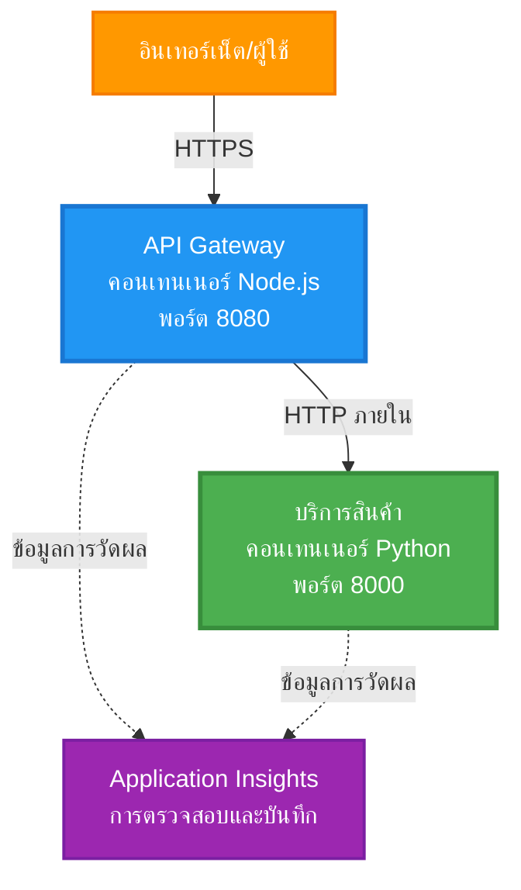
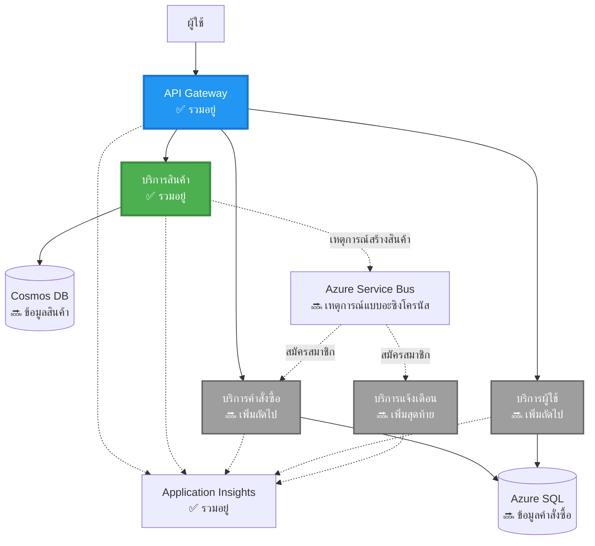
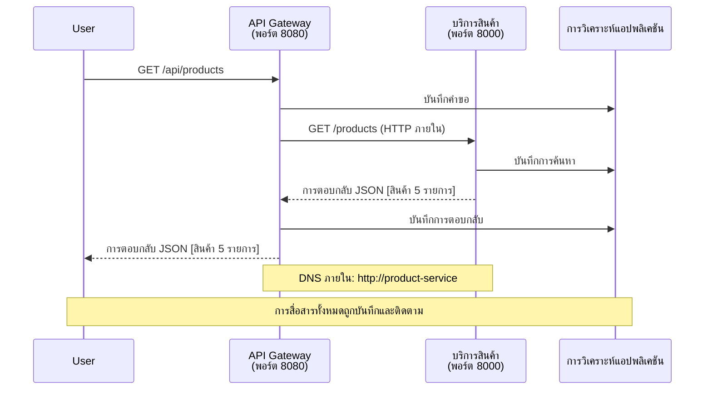

# สถาปัตยกรรม Microservices - ตัวอย่างแอปพลิเคชันคอนเทนเนอร์

⏱️ **เวลาที่คาดการณ์**: 25-35 นาที | 💰 **ค่าใช้จ่ายที่คาดการณ์**: ~$50-100/เดือน | ⭐ **ความซับซ้อน**: ระดับสูง

**📚 เส้นทางการเรียนรู้:**
- ← ก่อนหน้า: [Simple Flask API](../../../../examples/container-app/simple-flask-api) - พื้นฐานของคอนเทนเนอร์เดี่ยว
- 🎯 **คุณอยู่ที่นี่**: สถาปัตยกรรม Microservices (พื้นฐาน 2 บริการ)
- → ถัดไป: [AI Integration](../../../../docs/ai-foundry) - เพิ่มความฉลาดให้กับบริการของคุณ
- 🏠 [หน้าแรกของคอร์ส](../../README.md)

---

สถาปัตยกรรม **microservices ที่เรียบง่ายแต่ใช้งานได้จริง** ซึ่งถูกปรับใช้ใน Azure Container Apps โดยใช้ AZD CLI ตัวอย่างนี้แสดงการสื่อสารระหว่างบริการ การจัดการคอนเทนเนอร์ และการตรวจสอบด้วยการตั้งค่าบริการ 2 ตัวที่ใช้งานได้จริง

> **📚 วิธีการเรียนรู้**: ตัวอย่างนี้เริ่มต้นด้วยสถาปัตยกรรม 2 บริการที่เรียบง่าย (API Gateway + Backend Service) ที่คุณสามารถปรับใช้และเรียนรู้ได้จริง หลังจากเข้าใจพื้นฐานนี้แล้ว เราจะให้คำแนะนำสำหรับการขยายไปยังระบบ microservices ที่สมบูรณ์

## สิ่งที่คุณจะได้เรียนรู้

เมื่อทำตัวอย่างนี้เสร็จ คุณจะ:
- ปรับใช้คอนเทนเนอร์หลายตัวใน Azure Container Apps
- ใช้การสื่อสารระหว่างบริการด้วยเครือข่ายภายใน
- กำหนดค่าการปรับขนาดตามสภาพแวดล้อมและการตรวจสอบสุขภาพ
- ตรวจสอบแอปพลิเคชันแบบกระจายด้วย Application Insights
- เข้าใจรูปแบบการปรับใช้ microservices และแนวปฏิบัติที่ดีที่สุด
- เรียนรู้การขยายจากสถาปัตยกรรมง่ายไปสู่สถาปัตยกรรมที่ซับซ้อน

## สถาปัตยกรรม

### เฟส 1: สิ่งที่เรากำลังสร้าง (รวมอยู่ในตัวอย่างนี้)


**รายละเอียดของส่วนประกอบ:**

| ส่วนประกอบ | วัตถุประสงค์ | การเข้าถึง | ทรัพยากร |
|------------|--------------|------------|-----------|
| **API Gateway** | เส้นทางคำขอภายนอกไปยังบริการ backend | สาธารณะ (HTTPS) | 1 vCPU, 2GB RAM, 2-20 replicas |
| **Product Service** | จัดการแคตตาล็อกสินค้าโดยใช้ข้อมูลในหน่วยความจำ | ภายในเท่านั้น | 0.5 vCPU, 1GB RAM, 1-10 replicas |
| **Application Insights** | การบันทึกและการติดตามแบบกระจายศูนย์กลาง | Azure Portal | 1-2 GB/เดือนสำหรับการนำเข้าข้อมูล |

**ทำไมต้องเริ่มต้นแบบง่าย?**
- ✅ ปรับใช้และเข้าใจได้อย่างรวดเร็ว (25-35 นาที)
- ✅ เรียนรู้รูปแบบ microservices หลักโดยไม่ซับซ้อน
- ✅ โค้ดที่ใช้งานได้จริงที่คุณสามารถปรับแต่งและทดลองได้
- ✅ ค่าใช้จ่ายต่ำสำหรับการเรียนรู้ (~$50-100/เดือน เทียบกับ $300-1400/เดือน)
- ✅ สร้างความมั่นใจก่อนเพิ่มฐานข้อมูลและ message queues

**เปรียบเทียบ**: คิดว่านี่เหมือนการเรียนขับรถ คุณเริ่มต้นในลานจอดรถว่างเปล่า (2 บริการ) เรียนรู้พื้นฐาน แล้วค่อยก้าวไปสู่การขับในเมือง (5+ บริการพร้อมฐานข้อมูล)

### เฟส 2: การขยายในอนาคต (สถาปัตยกรรมอ้างอิง)

เมื่อคุณเชี่ยวชาญสถาปัตยกรรม 2 บริการแล้ว คุณสามารถขยายไปยัง:


ดูส่วน "คู่มือการขยาย" ที่ท้ายเอกสารสำหรับคำแนะนำทีละขั้นตอน

## คุณสมบัติที่รวมอยู่

✅ **การค้นหาบริการ**: การค้นหา DNS อัตโนมัติระหว่างคอนเทนเนอร์  
✅ **การกระจายโหลด**: การกระจายโหลดใน replicas  
✅ **การปรับขนาดอัตโนมัติ**: การปรับขนาดแต่ละบริการตามคำขอ HTTP  
✅ **การตรวจสอบสุขภาพ**: การตรวจสอบ liveness และ readiness สำหรับทั้งสองบริการ  
✅ **การบันทึกแบบกระจาย**: การบันทึกศูนย์กลางด้วย Application Insights  
✅ **เครือข่ายภายใน**: การสื่อสารระหว่างบริการที่ปลอดภัย  
✅ **การจัดการคอนเทนเนอร์**: การปรับใช้และการปรับขนาดอัตโนมัติ  
✅ **การอัปเดตแบบไม่มี downtime**: การอัปเดตแบบ rolling พร้อมการจัดการ revision  

## ข้อกำหนดเบื้องต้น

### เครื่องมือที่จำเป็น

ก่อนเริ่มต้น ตรวจสอบว่าคุณติดตั้งเครื่องมือเหล่านี้แล้ว:

1. **[Azure Developer CLI (azd)](https://learn.microsoft.com/azure/developer/azure-developer-cli/install-azd)** (เวอร์ชัน 1.0.0 หรือสูงกว่า)
   ```bash
   azd version
   # ผลลัพธ์ที่คาดหวัง: azd เวอร์ชัน 1.0.0 หรือสูงกว่า
   ```

2. **[Azure CLI](https://learn.microsoft.com/cli/azure/install-azure-cli)** (เวอร์ชัน 2.50.0 หรือสูงกว่า)
   ```bash
   az --version
   # ผลลัพธ์ที่คาดหวัง: azure-cli 2.50.0 หรือสูงกว่า
   ```

3. **[Docker](https://www.docker.com/get-started)** (สำหรับการพัฒนา/ทดสอบในเครื่อง - ไม่บังคับ)
   ```bash
   docker --version
   # ผลลัพธ์ที่คาดหวัง: Docker เวอร์ชัน 20.10 หรือสูงกว่า
   ```

### ตรวจสอบการตั้งค่าของคุณ

รันคำสั่งเหล่านี้เพื่อยืนยันว่าคุณพร้อม:

```bash
# ตรวจสอบ Azure Developer CLI
azd version
# ✅ ที่คาดไว้: azd เวอร์ชัน 1.0.0 หรือสูงกว่า

# ตรวจสอบ Azure CLI
az --version
# ✅ ที่คาดไว้: azure-cli เวอร์ชัน 2.50.0 หรือสูงกว่า

# ตรวจสอบ Docker (ไม่บังคับ)
docker --version
# ✅ ที่คาดไว้: Docker เวอร์ชัน 20.10 หรือสูงกว่า
```

**เกณฑ์ความสำเร็จ**: คำสั่งทั้งหมดแสดงหมายเลขเวอร์ชันที่ตรงหรือสูงกว่าขั้นต่ำ

### ข้อกำหนดของ Azure

- การสมัครสมาชิก **Azure** ที่ใช้งานอยู่ ([สร้างบัญชีฟรี](https://azure.microsoft.com/free/))
- สิทธิ์ในการสร้างทรัพยากรในบัญชีของคุณ
- บทบาท **Contributor** ในบัญชีหรือกลุ่มทรัพยากร

### ความรู้ที่จำเป็น

นี่คือตัวอย่างระดับ **ขั้นสูง** คุณควรมี:
- ทำตัวอย่าง [Simple Flask API](../../../../examples/container-app/simple-flask-api) เสร็จแล้ว
- ความเข้าใจพื้นฐานเกี่ยวกับสถาปัตยกรรม microservices
- ความคุ้นเคยกับ REST APIs และ HTTP
- ความเข้าใจเกี่ยวกับแนวคิดของคอนเทนเนอร์

**ใหม่กับ Container Apps?** เริ่มต้นด้วยตัวอย่าง [Simple Flask API](../../../../examples/container-app/simple-flask-api) ก่อนเพื่อเรียนรู้พื้นฐาน

## เริ่มต้นอย่างรวดเร็ว (ทีละขั้นตอน)

### ขั้นตอนที่ 1: โคลนและนำทาง

```bash
git clone https://github.com/microsoft/AZD-for-beginners.git
cd AZD-for-beginners/examples/microservices
```

**✓ การตรวจสอบความสำเร็จ**: ยืนยันว่าคุณเห็น `azure.yaml`:
```bash
ls
# คาดหวัง: README.md, azure.yaml, infra/, src/
```

### ขั้นตอนที่ 2: ยืนยันตัวตนกับ Azure

```bash
azd auth login
```

สิ่งนี้จะเปิดเบราว์เซอร์ของคุณเพื่อยืนยันตัวตนกับ Azure ลงชื่อเข้าใช้ด้วยข้อมูลรับรอง Azure ของคุณ

**✓ การตรวจสอบความสำเร็จ**: คุณควรเห็น:
```
Logged in to Azure.
```

### ขั้นตอนที่ 3: เริ่มต้นสภาพแวดล้อม

```bash
azd init
```

**คำถามที่คุณจะเห็น**:
- **ชื่อสภาพแวดล้อม**: ใส่ชื่อสั้นๆ (เช่น `microservices-dev`)
- **การสมัครสมาชิก Azure**: เลือกการสมัครสมาชิกของคุณ
- **ตำแหน่ง Azure**: เลือกภูมิภาค (เช่น `eastus`, `westeurope`)

**✓ การตรวจสอบความสำเร็จ**: คุณควรเห็น:
```
SUCCESS: New project initialized!
```

### ขั้นตอนที่ 4: ปรับใช้โครงสร้างพื้นฐานและบริการ

```bash
azd up
```

**สิ่งที่เกิดขึ้น** (ใช้เวลา 8-12 นาที):

```mermaid
graph LR
    A[azd up] --> B[สร้าง Resource Group]
    B --> C[ปรับใช้ Container Registry]
    C --> D[ปรับใช้ Log Analytics]
    D --> E[ปรับใช้ App Insights]
    E --> F[สร้าง Container Environment]
    F --> G[สร้างภาพ API Gateway]
    F --> H[สร้างภาพ Product Service]
    G --> I[ส่งไปยัง Registry]
    H --> I
    I --> J[ปรับใช้ API Gateway]
    I --> K[ปรับใช้ Product Service]
    J --> L[กำหนดค่า Ingress & ตรวจสอบสุขภาพ]
    K --> L
    L --> M[การปรับใช้เสร็จสมบูรณ์ ✓]
    
    style A fill:#2196F3,stroke:#1976D2,stroke-width:3px,color:#fff
    style M fill:#4CAF50,stroke:#388E3C,stroke-width:3px,color:#fff
```


**✓ การตรวจสอบความสำเร็จ**: คุณควรเห็น:
```
SUCCESS: Your application was deployed to Azure in X minutes Y seconds.
Endpoint: https://api-gateway-<unique-id>.azurecontainerapps.io
```

**⏱️ เวลา**: 8-12 นาที

### ขั้นตอนที่ 5: ทดสอบการปรับใช้

```bash
# รับจุดเชื่อมต่อเกตเวย์
GATEWAY_URL=$(azd env get-values | grep API_GATEWAY_URL | cut -d '=' -f2 | tr -d '"')

# ทดสอบสุขภาพของ API Gateway
curl $GATEWAY_URL/health
```

**✅ ผลลัพธ์ที่คาดหวัง:**
```json
{
  "status": "healthy",
  "service": "api-gateway",
  "timestamp": "2025-11-19T10:30:00Z"
}
```

**ทดสอบบริการสินค้าโดยผ่านเกตเวย์**:
```bash
# แสดงรายการสินค้า
curl $GATEWAY_URL/api/products
```

**✅ ผลลัพธ์ที่คาดหวัง:**
```json
[
  {"id":1,"name":"Laptop","price":999.99,"stock":50},
  {"id":2,"name":"Mouse","price":29.99,"stock":200},
  {"id":3,"name":"Keyboard","price":79.99,"stock":150}
]
```

**✓ การตรวจสอบความสำเร็จ**: ทั้งสอง endpoint คืนข้อมูล JSON โดยไม่มีข้อผิดพลาด

---

**🎉 ยินดีด้วย!** คุณได้ปรับใช้สถาปัตยกรรม microservices ไปยัง Azure แล้ว!

## โครงสร้างโครงการ

ไฟล์การใช้งานทั้งหมดถูกรวมไว้—นี่คือตัวอย่างที่สมบูรณ์และใช้งานได้:

```
microservices/
│
├── README.md                         # This file
├── azure.yaml                        # AZD configuration
├── .gitignore                        # Git ignore patterns
│
├── infra/                           # Infrastructure as Code (Bicep)
│   ├── main.bicep                   # Main orchestration
│   ├── abbreviations.json           # Naming conventions
│   ├── core/                        # Shared infrastructure
│   │   ├── container-apps-environment.bicep  # Container environment + registry
│   │   └── monitor.bicep            # Application Insights + Log Analytics
│   └── app/                         # Service definitions
│       ├── api-gateway.bicep        # API Gateway container app
│       └── product-service.bicep    # Product Service container app
│
└── src/                             # Application source code
    ├── api-gateway/                 # Node.js API Gateway
    │   ├── app.js                   # Express server with routing
    │   ├── package.json             # Node dependencies
    │   └── Dockerfile               # Container definition
    └── product-service/             # Python Product Service
        ├── main.py                  # Flask API with product data
        ├── requirements.txt         # Python dependencies
        └── Dockerfile               # Container definition
```

**สิ่งที่แต่ละส่วนประกอบทำ:**

**โครงสร้างพื้นฐาน (infra/)**:
- `main.bicep`: จัดการทรัพยากร Azure ทั้งหมดและการพึ่งพาของพวกมัน
- `core/container-apps-environment.bicep`: สร้างสภาพแวดล้อม Container Apps และ Azure Container Registry
- `core/monitor.bicep`: ตั้งค่า Application Insights สำหรับการบันทึกแบบกระจาย
- `app/*.bicep`: คำจำกัดความของคอนเทนเนอร์แอปแต่ละตัวพร้อมการปรับขนาดและการตรวจสอบสุขภาพ

**API Gateway (src/api-gateway/)**:
- บริการที่เผชิญหน้าสาธารณะซึ่งเส้นทางคำขอไปยังบริการ backend
- ใช้การบันทึก การจัดการข้อผิดพลาด และการส่งต่อคำขอ
- แสดงการสื่อสาร HTTP ระหว่างบริการ

**Product Service (src/product-service/)**:
- บริการภายในที่มีแคตตาล็อกสินค้า (ในหน่วยความจำเพื่อความเรียบง่าย)
- REST API พร้อมการตรวจสอบสุขภาพ
- ตัวอย่างรูปแบบ backend microservice

## ภาพรวมของบริการ

### API Gateway (Node.js/Express)

**พอร์ต**: 8080  
**การเข้าถึง**: สาธารณะ (external ingress)  
**วัตถุประสงค์**: เส้นทางคำขอที่เข้ามาไปยังบริการ backend ที่เหมาะสม  

**Endpoints**:
- `GET /` - ข้อมูลบริการ
- `GET /health` - Endpoint การตรวจสอบสุขภาพ
- `GET /api/products` - ส่งต่อไปยังบริการสินค้า (แสดงทั้งหมด)
- `GET /api/products/:id` - ส่งต่อไปยังบริการสินค้า (แสดงตาม ID)

**คุณสมบัติหลัก**:
- การส่งต่อคำขอด้วย axios
- การบันทึกศูนย์กลาง
- การจัดการข้อผิดพลาดและ timeout
- การค้นหาบริการผ่าน environment variables
- การรวม Application Insights

**ไฮไลต์โค้ด** (`src/api-gateway/app.js`):
```javascript
// การสื่อสารระหว่างบริการภายใน
app.get('/api/products', async (req, res) => {
  const response = await axios.get(`${PRODUCT_SERVICE_URL}/products`, {
    timeout: 5000
  });
  res.json(response.data);
});
```

### Product Service (Python/Flask)

**พอร์ต**: 8000  
**การเข้าถึง**: ภายในเท่านั้น (ไม่มี external ingress)  
**วัตถุประสงค์**: จัดการแคตตาล็อกสินค้าด้วยข้อมูลในหน่วยความจำ  

**Endpoints**:
- `GET /` - ข้อมูลบริการ
- `GET /health` - Endpoint การตรวจสอบสุขภาพ
- `GET /products` - แสดงสินค้าทั้งหมด
- `GET /products/<id>` - แสดงสินค้าตาม ID

**คุณสมบัติหลัก**:
- RESTful API ด้วย Flask
- ร้านค้าสินค้าในหน่วยความจำ (ง่าย ไม่มีฐานข้อมูล)
- การตรวจสอบสุขภาพด้วย probes
- การบันทึกแบบมีโครงสร้าง
- การรวม Application Insights

**โมเดลข้อมูล**:
```python
{
  "id": 1,
  "name": "Laptop",
  "description": "High-performance laptop",
  "price": 999.99,
  "stock": 50
}
```

**ทำไมต้องภายในเท่านั้น?**
บริการสินค้าไม่ได้เปิดเผยต่อสาธารณะ คำขอทั้งหมดต้องผ่าน API Gateway ซึ่งให้:
- ความปลอดภัย: จุดเข้าถึงที่ควบคุมได้
- ความยืดหยุ่น: สามารถเปลี่ยน backend โดยไม่กระทบกับลูกค้า
- การตรวจสอบ: การบันทึกคำขอศูนย์กลาง

## การทำความเข้าใจการสื่อสารระหว่างบริการ

### วิธีที่บริการพูดคุยกัน


ในตัวอย่างนี้ API Gateway สื่อสารกับ Product Service โดยใช้ **การเรียก HTTP ภายใน**:

```javascript
// เกตเวย์ API (src/api-gateway/app.js)
const PRODUCT_SERVICE_URL = process.env.PRODUCT_SERVICE_URL;

// ทำการร้องขอ HTTP ภายใน
const response = await axios.get(`${PRODUCT_SERVICE_URL}/products`);
```

**จุดสำคัญ**:

1. **การค้นหาด้วย DNS**: Container Apps ให้ DNS สำหรับบริการภายในโดยอัตโนมัติ
   - FQDN ของ Product Service: `product-service.internal.<environment>.azurecontainerapps.io`
   - ย่อเป็น: `http://product-service` (Container Apps จะ resolve ให้)

2. **ไม่มีการเปิดเผยสาธารณะ**: Product Service มี `external: false` ใน Bicep
   - เข้าถึงได้เฉพาะในสภาพแวดล้อม Container Apps
   - ไม่สามารถเข้าถึงได้จากอินเทอร์เน็ต

3. **Environment Variables**: URL ของบริการจะถูก inject ตอนปรับใช้
   - Bicep ส่งผ่าน FQDN ภายในไปยัง gateway
   - ไม่มี URL ที่ hardcoded ในโค้ดแอปพลิเคชัน

**เปรียบเทียบ**: คิดว่านี่เหมือนห้องในสำนักงาน API Gateway เป็นโต๊ะประชาสัมพันธ์ (เผชิญหน้าสาธารณะ) และ Product Service เป็นห้องในสำนักงาน (ภายในเท่านั้น) ผู้เยี่ยมชมต้องผ่านประชาสัมพันธ์เพื่อเข้าถึงห้องใดๆ

## ตัวเลือกการปรับใช้

### การปรับใช้เต็มรูปแบบ (แนะนำ)

```bash
# ปรับใช้โครงสร้างพื้นฐานและบริการทั้งสอง
azd up
```

สิ่งนี้จะปรับใช้:
1. สภาพแวดล้อม Container Apps
2. Application Insights
3. Container Registry
4. คอนเทนเนอร์ API Gateway
5. คอนเทนเนอร์ Product Service

**เวลา**: 8-12 นาที

### ปรับใช้บริการเดี่ยว

```bash
# ปรับใช้เพียงหนึ่งบริการ (หลังจาก azd up ครั้งแรก)
azd deploy api-gateway

# หรือปรับใช้บริการผลิตภัณฑ์
azd deploy product-service
```

**กรณีการใช้งาน**: เมื่อคุณอัปเดตโค้ดในบริการหนึ่งและต้องการปรับใช้เฉพาะบริการนั้น

### อัปเดตการกำหนดค่า

```bash
# เปลี่ยนพารามิเตอร์การปรับขนาด
azd env set GATEWAY_MAX_REPLICAS 30

# ปรับใช้ใหม่ด้วยการกำหนดค่าที่อัปเดต
azd up
```

## การกำหนดค่า

### การกำหนดค่าการปรับขนาด

ทั้งสองบริการถูกกำหนดค่าด้วยการปรับขนาดอัตโนมัติตาม HTTP ในไฟล์ Bicep ของพวกเขา:

**API Gateway**:
- Min replicas: 2 (อย่างน้อย 2 เสมอเพื่อความพร้อมใช้งาน)
- Max replicas: 20
- ทริกเกอร์การปรับขนาด: 50 คำขอพร้อมกันต่อ replica

**Product Service**:
- Min replicas: 1 (สามารถปรับขนาดเป็นศูนย์ได้หากจำเป็น)
- Max replicas: 10
- ทริกเกอร์การปรับขนาด: 100 คำขอพร้อมกันต่อ replica

**ปรับแต่งการปรับขนาด** (ใน `infra/app/*.bicep`):
```bicep
scale: {
  minReplicas: 1
  maxReplicas: 10
  rules: [
    {
      name: 'http-scale-rule'
      http: {
        metadata: {
          concurrentRequests: '100'  // Adjust this
        }
      }
    }
  ]
}
```

### การจัดสรรทรัพยากร

**API Gateway**:
- CPU: 1.0 vCPU
- หน่วยความจำ: 2 GiB
- เหตุผล: จัดการทราฟฟิกภายนอกทั้งหมด

**Product Service**:
- CPU: 0.5 vCPU
- หน่วยความจำ: 1 GiB
- เหตุผล: การดำเนินการในหน่วยความจำที่เบา

### การตรวจสอบสุขภาพ

ทั้งสองบริการรวม liveness และ readiness probes:

```bicep
probes: [
  {
    type: 'Liveness'
    httpGet: {
      path: '/health'
      port: 8080
    }
    initialDelaySeconds: 10
    periodSeconds: 30
  }
  {
    type: 'Readiness'
    httpGet: {
      path: '/health'
      port: 8080
    }
    initialDelaySeconds: 5
    periodSeconds: 10
  }
]
```

**สิ่งที่หมายถึง**:
- **Liveness**: หากการตรวจสอบสุขภาพล้มเหลว Container Apps จะรีสตาร์ทคอนเทนเนอร์
- **Readiness**: หากไม่พร้อม Container Apps จะหยุดการส่งทราฟฟิกไปยัง replica นั้น

## การตรวจสอบและการสังเกตการณ์

### ดูบันทึกบริการ

```bash
# สตรีมบันทึกจาก API Gateway
azd logs api-gateway --follow

# ดูบันทึกบริการผลิตภัณฑ์ล่าสุด
azd logs product-service --tail 100

# ดูบันทึกทั้งหมดจากทั้งสองบริการ
azd logs --follow
```

**ผลลัพธ์ที่คาดหวัง**:
```
[api-gateway] API Gateway listening on port 8080
[api-gateway] Product Service URL: http://product-service
[api-gateway] GET /api/products 200 - 45ms
[product-service] Retrieved 5 products
```

### คำสั่ง Application Insights

เข้าถึง Application Insights ใน Azure Portal จากนั้นรันคำสั่งเหล่านี้:

**ค้นหาคำขอที่ช้า**:
```kusto
requests
| where timestamp > ago(1h)
| where duration > 1000  // Requests taking >1 second
| summarize count() by name, cloud_RoleName
| order by count_ desc
```

**ติดตามการเรียกบริการต่อบริการ**:
```kusto
dependencies
| where timestamp > ago(1h)
| where type == "Http"
| project timestamp, name, target, duration, success
| order by timestamp desc
```

**อัตราข้อผิดพลาดตามบริการ**:
```kusto
exceptions
| where timestamp > ago(24h)
| summarize errorCount = count() by cloud_RoleName, type
| order by errorCount desc
```

**ปริมาณคำขอตามเวลา**:
```kusto
requests
| where timestamp > ago(1h)
| summarize requestCount = count() by bin(timestamp, 5m), cloud_RoleName
| render timechart
```

### เข้าถึงแดชบอร์ดการตรวจสอบ

```bash
# รับรายละเอียด Application Insights
azd env get-values | grep APPLICATIONINSIGHTS

# เปิดการตรวจสอบ Azure Portal
az monitor app-insights component show \
  --app $(azd env get-values | grep APPLICATIONINSIGHTS_CONNECTION_STRING | cut -d '=' -f2) \
  --resource-group $(azd env get-values | grep AZURE_RESOURCE_GROUP | cut -d '=' -f2) \
  --query "appId" -o tsv
```

### เมตริกแบบเรียลไทม์

1. ไปที่ Application Insights ใน Azure Portal
2. คลิก "Live Metrics"
3. ดูคำขอ ข้อผิดพลาด และประสิทธิภาพแบบเรียลไทม์
4. ทดสอบโดยรัน: `curl $(azd env get-values | grep API_GATEWAY_URL | cut -d '=' -f2 | tr -d '"')/api/products`

## แบบฝึกหัดปฏิบัติ

### แบบฝึกหัด 1: เพิ่ม Endpoint สินค้าใหม่ ⭐ (ง่าย)

**เป้
3. ปรับใช้บริการทั้งสองอีกครั้ง:

```bash
azd deploy product-service
azd deploy api-gateway
```

4. ทดสอบจุดเชื่อมต่อใหม่:

```bash
GATEWAY_URL=$(azd env get-values | grep API_GATEWAY_URL | cut -d '=' -f2 | tr -d '"')

# สร้างผลิตภัณฑ์ใหม่
curl -X POST $GATEWAY_URL/api/products \
  -H "Content-Type: application/json" \
  -d '{"name":"USB Cable","price":9.99,"stock":500}'
```

**✅ ผลลัพธ์ที่คาดหวัง:**
```json
{"id":6,"name":"USB Cable","description":"","price":9.99,"stock":500}
```

5. ตรวจสอบว่าปรากฏในรายการ:

```bash
curl $GATEWAY_URL/api/products
# ควรแสดงผลิตภัณฑ์ 6 รายการรวมถึงสาย USB ใหม่
```

**เกณฑ์ความสำเร็จ**:
- ✅ คำขอ POST ส่งคืน HTTP 201
- ✅ ผลิตภัณฑ์ใหม่ปรากฏในรายการ GET /api/products
- ✅ ผลิตภัณฑ์มี ID ที่เพิ่มขึ้นอัตโนมัติ

**เวลา**: 10-15 นาที

---

### แบบฝึกหัด 2: ปรับกฎ Autoscaling ⭐⭐ (ระดับกลาง)

**เป้าหมาย**: เปลี่ยน Product Service ให้ปรับขนาดได้อย่างรวดเร็วขึ้น

**จุดเริ่มต้น**: `infra/app/product-service.bicep`

**ขั้นตอน**:

1. เปิด `infra/app/product-service.bicep` และค้นหาบล็อก `scale` (ประมาณบรรทัดที่ 95)

2. เปลี่ยนจาก:
```bicep
scale: {
  minReplicas: 1
  maxReplicas: 10
  rules: [
    {
      name: 'http-scale-rule'
      http: {
        metadata: {
          concurrentRequests: '100'  // OLD
        }
      }
    }
  ]
}
```

เป็น:
```bicep
scale: {
  minReplicas: 2  // Always have 2 running
  maxReplicas: 20  // Allow more scaling
  rules: [
    {
      name: 'http-scale-rule'
      http: {
        metadata: {
          concurrentRequests: '20'  // Scale at lower threshold
        }
      }
    }
  ]
}
```

3. ปรับใช้โครงสร้างพื้นฐานอีกครั้ง:

```bash
azd up
```

4. ตรวจสอบการตั้งค่าการปรับขนาดใหม่:

```bash
az containerapp show \
  --name $(azd env get-values | grep PRODUCT_SERVICE | head -1 | cut -d '/' -f5) \
  --resource-group $(azd env get-values | grep AZURE_RESOURCE_GROUP | cut -d '=' -f2 | tr -d '"') \
  --query "properties.template.scale" -o json
```

**✅ ผลลัพธ์ที่คาดหวัง:**
```json
{
  "minReplicas": 2,
  "maxReplicas": 20,
  "rules": [...]
}
```

5. ทดสอบการปรับขนาดอัตโนมัติด้วยโหลด:

```bash
# สร้างคำขอพร้อมกัน
for i in {1..500}; do curl $GATEWAY_URL/api/products & done

# ดูการปรับขนาดเกิดขึ้น
azd logs product-service --follow
# มองหา: เหตุการณ์การปรับขนาดของ Container Apps
```

**เกณฑ์ความสำเร็จ**:
- ✅ Product Service ทำงานอย่างน้อย 2 replicas เสมอ
- ✅ ภายใต้โหลด ปรับขนาดมากกว่า 2 replicas
- ✅ Azure Portal แสดงกฎการปรับขนาดใหม่

**เวลา**: 15-20 นาที

---

### แบบฝึกหัด 3: เพิ่ม Query การตรวจสอบแบบกำหนดเอง ⭐⭐ (ระดับกลาง)

**เป้าหมาย**: สร้าง Query Application Insights แบบกำหนดเองเพื่อติดตามประสิทธิภาพ API ของผลิตภัณฑ์

**ขั้นตอน**:

1. ไปที่ Application Insights ใน Azure Portal:
   - ไปที่ Azure Portal
   - ค้นหากลุ่มทรัพยากรของคุณ (rg-microservices-*)
   - คลิกที่ทรัพยากร Application Insights

2. คลิก "Logs" ในเมนูด้านซ้าย

3. สร้าง Query นี้:

```kusto
requests
| where timestamp > ago(1h)
| where name contains "products"
| summarize 
    RequestCount = count(),
    AvgDuration = avg(duration),
    P95Duration = percentile(duration, 95),
    SuccessRate = 100.0 * countif(success == true) / count()
  by bin(timestamp, 5m)
| render timechart
```

4. คลิก "Run" เพื่อเรียกใช้ Query

5. บันทึก Query:
   - คลิก "Save"
   - ตั้งชื่อ: "Product API Performance"
   - หมวดหมู่: "Performance"

6. สร้างการจราจรทดสอบ:

```bash
for i in {1..100}; do curl $GATEWAY_URL/api/products; sleep 1; done
```

7. รีเฟรช Query เพื่อดูข้อมูล

**✅ ผลลัพธ์ที่คาดหวัง:**
- กราฟแสดงจำนวนคำขอในช่วงเวลา
- ระยะเวลาเฉลี่ย < 500ms
- อัตราความสำเร็จ = 100%
- ช่วงเวลา 5 นาที

**เกณฑ์ความสำเร็จ**:
- ✅ Query แสดงคำขอ 100+ ครั้ง
- ✅ อัตราความสำเร็จ 100%
- ✅ ระยะเวลาเฉลี่ย < 500ms
- ✅ กราฟแสดงช่วงเวลา 5 นาที

**ผลลัพธ์การเรียนรู้**: เข้าใจวิธีการตรวจสอบประสิทธิภาพบริการด้วย Query แบบกำหนดเอง

**เวลา**: 10-15 นาที

---

### แบบฝึกหัด 4: เพิ่มตรรกะ Retry ⭐⭐⭐ (ขั้นสูง)

**เป้าหมาย**: เพิ่มตรรกะ Retry ใน API Gateway เมื่อ Product Service ไม่พร้อมใช้งานชั่วคราว

**จุดเริ่มต้น**: `src/api-gateway/app.js`

**ขั้นตอน**:

1. ติดตั้งไลบรารี Retry:

```bash
cd src/api-gateway
npm install axios-retry --save
cd ../..
```

2. อัปเดต `src/api-gateway/app.js` (เพิ่มหลังจากการนำเข้า axios):

```javascript
const axiosRetry = require('axios-retry');

// กำหนดค่าตรรกะการลองใหม่
axiosRetry(axios, {
  retries: 3,
  retryDelay: (retryCount) => {
    return retryCount * 1000; // 1วินาที, 2วินาที, 3วินาที
  },
  retryCondition: (error) => {
    // ลองใหม่เมื่อเกิดข้อผิดพลาดเครือข่ายหรือการตอบกลับ 5xx
    return axiosRetry.isNetworkOrIdempotentRequestError(error) ||
           (error.response && error.response.status >= 500);
  }
});

console.log('Retry logic configured: 3 retries with exponential backoff');
```

3. ปรับใช้ API Gateway อีกครั้ง:

```bash
azd deploy api-gateway
```

4. ทดสอบพฤติกรรม Retry โดยจำลองการล้มเหลวของบริการ:

```bash
# ปรับบริการผลิตภัณฑ์เป็น 0 (จำลองความล้มเหลว)
az containerapp update \
  --name $(azd env get-values | grep PRODUCT_SERVICE | head -1 | cut -d '/' -f5) \
  --resource-group $(azd env get-values | grep AZURE_RESOURCE_GROUP | cut -d '=' -f2 | tr -d '"') \
  --min-replicas 0 \
  --max-replicas 0

# ลองเข้าถึงผลิตภัณฑ์ (จะลองใหม่ 3 ครั้ง)
time curl -v $GATEWAY_URL/api/products
# สังเกต: การตอบสนองใช้เวลาประมาณ ~6 วินาที (1วินาที + 2วินาที + 3วินาที ลองใหม่)

# คืนค่าบริการผลิตภัณฑ์
az containerapp update \
  --name $(azd env get-values | grep PRODUCT_SERVICE | head -1 | cut -d '/' -f5) \
  --resource-group $(azd env get-values | grep AZURE_RESOURCE_GROUP | cut -d '=' -f2 | tr -d '"') \
  --min-replicas 1 \
  --max-replicas 10
```

5. ดูบันทึก Retry:

```bash
azd logs api-gateway --tail 50
# มองหา: ข้อความพยายามลองใหม่
```

**✅ พฤติกรรมที่คาดหวัง:**
- คำขอ Retry 3 ครั้งก่อนล้มเหลว
- แต่ละ Retry รอเวลานานขึ้น (1s, 2s, 3s)
- คำขอสำเร็จหลังจากบริการเริ่มต้นใหม่
- บันทึกแสดงความพยายาม Retry

**เกณฑ์ความสำเร็จ**:
- ✅ คำขอ Retry 3 ครั้งก่อนล้มเหลว
- ✅ แต่ละ Retry รอเวลานานขึ้น (Exponential Backoff)
- ✅ คำขอสำเร็จหลังจากบริการเริ่มต้นใหม่
- ✅ บันทึกแสดงความพยายาม Retry

**ผลลัพธ์การเรียนรู้**: เข้าใจรูปแบบความยืดหยุ่นใน Microservices (Circuit Breakers, Retries, Timeouts)

**เวลา**: 20-25 นาที

---

## จุดตรวจสอบความรู้

หลังจากทำตัวอย่างนี้เสร็จสิ้น ตรวจสอบความเข้าใจของคุณ:

### 1. การสื่อสารระหว่างบริการ ✓

ทดสอบความรู้ของคุณ:
- [ ] คุณสามารถอธิบายได้ว่า API Gateway ค้นหา Product Service ได้อย่างไร? (การค้นหาบริการแบบ DNS)
- [ ] เกิดอะไรขึ้นถ้า Product Service ล่ม? (Gateway ส่งคืนข้อผิดพลาด 503)
- [ ] คุณจะเพิ่มบริการที่สามได้อย่างไร? (สร้างไฟล์ Bicep ใหม่ เพิ่มใน main.bicep สร้างโฟลเดอร์ src)

**การตรวจสอบแบบลงมือทำ**:
```bash
# จำลองการล้มเหลวของบริการ
az containerapp update --name <product-service-name> --min-replicas 0 --max-replicas 0
curl $GATEWAY_URL/api/products
# ✅ ที่คาดไว้: 503 บริการไม่พร้อมใช้งาน

# กู้คืนบริการ
az containerapp update --name <product-service-name> --min-replicas 1 --max-replicas 10
```

### 2. การตรวจสอบและการสังเกตการณ์ ✓

ทดสอบความรู้ของคุณ:
- [ ] คุณดูบันทึกแบบกระจายได้ที่ไหน? (Application Insights ใน Azure Portal)
- [ ] คุณติดตามคำขอที่ช้าได้อย่างไร? (Kusto Query: `requests | where duration > 1000`)
- [ ] คุณสามารถระบุบริการที่ทำให้เกิดข้อผิดพลาดได้หรือไม่? (ตรวจสอบฟิลด์ `cloud_RoleName` ในบันทึก)

**การตรวจสอบแบบลงมือทำ**:
```bash
# สร้างการจำลองคำขอที่ช้า
curl "$GATEWAY_URL/api/products?delay=2000"

# สอบถามข้อมูล Application Insights สำหรับคำขอที่ช้า
# ไปที่ Azure Portal → Application Insights → Logs
# รัน: requests | where duration > 1000 | project timestamp, name, duration, cloud_RoleName
```

### 3. การปรับขนาดและประสิทธิภาพ ✓

ทดสอบความรู้ของคุณ:
- [ ] อะไรเป็นตัวกระตุ้นการปรับขนาดอัตโนมัติ? (กฎคำขอ HTTP พร้อมกัน: 50 สำหรับ Gateway, 100 สำหรับ Product)
- [ ] ตอนนี้มี replicas กี่ตัวที่กำลังทำงานอยู่? (ตรวจสอบด้วย `az containerapp revision list`)
- [ ] คุณจะปรับขนาด Product Service เป็น 5 replicas ได้อย่างไร? (อัปเดต minReplicas ใน Bicep)

**การตรวจสอบแบบลงมือทำ**:
```bash
# สร้างโหลดเพื่อทดสอบการปรับขนาดอัตโนมัติ
for i in {1..1000}; do curl $GATEWAY_URL/api/products & done

# ดูจำนวนสำเนาเพิ่มขึ้น
azd logs api-gateway --follow
# ✅ ที่คาดไว้: เห็นเหตุการณ์การปรับขนาดในบันทึก
```

**เกณฑ์ความสำเร็จ**: คุณสามารถตอบคำถามทั้งหมดและตรวจสอบด้วยคำสั่งแบบลงมือทำ

---

## การวิเคราะห์ต้นทุน

### ค่าใช้จ่ายรายเดือนโดยประมาณ (สำหรับตัวอย่าง 2 บริการนี้)

| ทรัพยากร | การกำหนดค่า | ค่าใช้จ่ายโดยประมาณ |
|----------|--------------|----------------|
| API Gateway | 2-20 replicas, 1 vCPU, 2GB RAM | $30-150 |
| Product Service | 1-10 replicas, 0.5 vCPU, 1GB RAM | $15-75 |
| Container Registry | ระดับ Basic | $5 |
| Application Insights | 1-2 GB/เดือน | $5-10 |
| Log Analytics | 1 GB/เดือน | $3 |
| **รวม** | | **$58-243/เดือน** |

### การแบ่งต้นทุนตามการใช้งาน

**การจราจรเบา** (การทดสอบ/การเรียนรู้): ~$60/เดือน
- API Gateway: 2 replicas × 24/7 = $30
- Product Service: 1 replica × 24/7 = $15
- การตรวจสอบ + Registry = $13

**การจราจรปานกลาง** (การผลิตขนาดเล็ก): ~$120/เดือน
- API Gateway: 5 replicas เฉลี่ย = $75
- Product Service: 3 replicas เฉลี่ย = $45
- การตรวจสอบ + Registry = $13

**การจราจรสูง** (ช่วงเวลาที่มีงานยุ่ง): ~$240/เดือน
- API Gateway: 15 replicas เฉลี่ย = $225
- Product Service: 8 replicas เฉลี่ย = $120
- การตรวจสอบ + Registry = $13

### เคล็ดลับการเพิ่มประสิทธิภาพต้นทุน

1. **ปรับขนาดเป็นศูนย์สำหรับการพัฒนา**:
   ```bicep
   scale: {
     minReplicas: 0  // Save $30-40/month when not in use
     maxReplicas: 10
   }
   ```

2. **ใช้ Consumption Plan สำหรับ Cosmos DB** (เมื่อคุณเพิ่มมัน):
   - จ่ายเฉพาะสิ่งที่คุณใช้
   - ไม่มีค่าใช้จ่ายขั้นต่ำ

3. **ตั้งค่า Sampling สำหรับ Application Insights**:
   ```javascript
   appInsights.defaultClient.config.samplingPercentage = 50; // ตัวอย่าง 50% ของคำขอ
   ```

4. **ล้างข้อมูลเมื่อไม่จำเป็น**:
   ```bash
   azd down --force --purge
   ```

### ตัวเลือกระดับฟรี

สำหรับการเรียนรู้/การทดสอบ พิจารณา:
- ✅ ใช้เครดิตฟรีของ Azure ($200 สำหรับ 30 วันแรกกับบัญชีใหม่)
- ✅ รักษา replicas ให้น้อยที่สุด (ประหยัด ~50% ของต้นทุน)
- ✅ ลบหลังการทดสอบ (ไม่มีค่าใช้จ่ายต่อเนื่อง)
- ✅ ปรับขนาดเป็นศูนย์ระหว่างช่วงการเรียนรู้

**ตัวอย่าง**: การเรียกใช้ตัวอย่างนี้ 2 ชั่วโมง/วัน × 30 วัน = ~$5/เดือน แทนที่จะเป็น $60/เดือน

---

## อ้างอิงการแก้ไขปัญหาอย่างรวดเร็ว

### ปัญหา: `azd up` ล้มเหลวพร้อมข้อความ "Subscription not found"

**วิธีแก้ไข**:
```bash
# เข้าสู่ระบบอีกครั้งด้วยการสมัครสมาชิกที่ชัดเจน
az account set --subscription <your-subscription-id>
azd env set AZURE_SUBSCRIPTION_ID <your-subscription-id>
azd up
```

### ปัญหา: API Gateway ส่งคืน 503 "Product service unavailable"

**วินิจฉัย**:
```bash
# ตรวจสอบบันทึกการให้บริการผลิตภัณฑ์
azd logs product-service --tail 50

# ตรวจสอบสุขภาพการให้บริการผลิตภัณฑ์
az containerapp show \
  --name $(azd env get-values | grep PRODUCT_SERVICE | head -1 | cut -d '/' -f5) \
  --resource-group $(azd env get-values | grep AZURE_RESOURCE_GROUP | cut -d '=' -f2 | tr -d '"') \
  --query "properties.runningStatus"
```

**สาเหตุทั่วไป**:
1. Product Service ไม่เริ่มต้น (ตรวจสอบบันทึกข้อผิดพลาด Python)
2. Health Check ล้มเหลว (ตรวจสอบว่า `/health` endpoint ใช้งานได้)
3. การสร้างภาพคอนเทนเนอร์ล้มเหลว (ตรวจสอบ Registry สำหรับภาพ)

### ปัญหา: Autoscaling ไม่ทำงาน

**วินิจฉัย**:
```bash
# ตรวจสอบจำนวนสำเนาปัจจุบัน
az containerapp revision list \
  --name $(azd env get-values | grep API_GATEWAY | head -1 | cut -d '/' -f5) \
  --resource-group $(azd env get-values | grep AZURE_RESOURCE_GROUP | cut -d '=' -f2 | tr -d '"') \
  --query "[].properties.replicas"

# สร้างโหลดเพื่อทดสอบ
for i in {1..1000}; do curl $GATEWAY_URL/api/products & done

# เฝ้าดูเหตุการณ์การปรับขนาด
azd logs api-gateway --follow | grep -i scale
```

**สาเหตุทั่วไป**:
1. โหลดไม่สูงพอที่จะกระตุ้นกฎการปรับขนาด (ต้องการคำขอพร้อมกัน >50)
2. ถึงจำนวน replicas สูงสุดแล้ว (ตรวจสอบการกำหนดค่า Bicep)
3. กฎการปรับขนาดกำหนดค่าไม่ถูกต้องใน Bicep (ตรวจสอบค่าของ concurrentRequests)

### ปัญหา: Application Insights ไม่แสดงบันทึก

**วินิจฉัย**:
```bash
# ตรวจสอบว่าได้ตั้งค่าข้อความการเชื่อมต่อแล้ว
azd env get-values | grep APPLICATIONINSIGHTS

# ตรวจสอบว่าบริการกำลังส่งข้อมูลโทรมาตร
az monitor app-insights component show \
  --app $(azd env get-values | grep APPLICATIONINSIGHTS_NAME | cut -d '=' -f2 | tr -d '"') \
  --resource-group $(azd env get-values | grep AZURE_RESOURCE_GROUP | cut -d '=' -f2 | tr -d '"') \
  --query "properties.InstrumentationKey"
```

**สาเหตุทั่วไป**:
1. ไม่ได้ส่ง Connection String ไปยังคอนเทนเนอร์ (ตรวจสอบตัวแปรสภาพแวดล้อม)
2. SDK ของ Application Insights ไม่ได้กำหนดค่า (ตรวจสอบการนำเข้าในโค้ด)
3. Firewall บล็อก Telemetry (พบได้น้อย ตรวจสอบกฎเครือข่าย)

### ปัญหา: การสร้าง Docker ล้มเหลวในเครื่อง

**วินิจฉัย**:
```bash
# ทดสอบการสร้าง API Gateway
cd src/api-gateway
docker build -t test-gateway .

# ทดสอบการสร้างบริการผลิตภัณฑ์
cd ../product-service
docker build -t test-product .
```

**สาเหตุทั่วไป**:
1. ขาด Dependencies ใน package.json/requirements.txt
2. ข้อผิดพลาดไวยากรณ์ใน Dockerfile
3. ปัญหาเครือข่ายในการดาวน์โหลด Dependencies

**ยังติดปัญหาอยู่?** ดู [คู่มือปัญหาทั่วไป](../../docs/troubleshooting/common-issues.md) หรือ [การแก้ไขปัญหา Azure Container Apps](https://learn.microsoft.com/azure/container-apps/troubleshooting)

---

## การล้างข้อมูล

เพื่อหลีกเลี่ยงค่าใช้จ่ายต่อเนื่อง ลบทรัพยากรทั้งหมด:

```bash
azd down --force --purge
```

**ข้อความยืนยัน**:
```
? Total resources to delete: 6, are you sure you want to continue? (y/N)
```

พิมพ์ `y` เพื่อยืนยัน

**สิ่งที่ถูกลบ**:
- Container Apps Environment
- Container Apps ทั้งสอง (Gateway & Product Service)
- Container Registry
- Application Insights
- Log Analytics Workspace
- Resource Group

**✓ ตรวจสอบการล้างข้อมูล**:
```bash
az group list --query "[?starts_with(name,'rg-microservices')]" --output table
```

ควรส่งคืนว่างเปล่า

---

## คู่มือการขยาย: จาก 2 เป็น 5+ บริการ

เมื่อคุณเชี่ยวชาญสถาปัตยกรรม 2 บริการนี้แล้ว นี่คือวิธีการขยาย:

### เฟส 1: เพิ่มการจัดเก็บข้อมูลในฐานข้อมูล (ขั้นตอนถัดไป)

**เพิ่ม Cosmos DB สำหรับ Product Service**:

1. สร้าง `infra/core/cosmos.bicep`:
   ```bicep
   resource cosmosAccount 'Microsoft.DocumentDB/databaseAccounts@2023-04-15' = {
     name: name
     location: location
     kind: 'GlobalDocumentDB'
     properties: {
       databaseAccountOfferType: 'Standard'
       consistencyPolicy: { defaultConsistencyLevel: 'Session' }
       locations: [{ locationName: location, failoverPriority: 0 }]
     }
   }
   ```

2. อัปเดต Product Service เพื่อใช้ Azure Cosmos DB Python SDK แทนข้อมูลในหน่วยความจำ

3. ค่าใช้จ่ายเพิ่มเติมโดยประมาณ: ~$25/เดือน (Serverless)

### เฟส 2: เพิ่มบริการที่สาม (Order Management)

**สร้าง Order Service**:

1. โฟลเดอร์ใหม่: `src/order-service/` (Python/Node.js/C#)
2. Bicep ใหม่: `infra/app/order-service.bicep`
3. อัปเดต API Gateway เพื่อกำหนดเส้นทาง `/api/orders`
4. เพิ่ม Azure SQL Database สำหรับการจัดเก็บคำสั่งซื้อ

**สถาปัตยกรรมกลายเป็น**:
```
API Gateway → Product Service (Cosmos DB)
           → Order Service (Azure SQL)
```

### เฟส 3: เพิ่มการสื่อสารแบบ Async (Service Bus)

**ใช้สถาปัตยกรรม Event-Driven**:

1. เพิ่ม Azure Service Bus: `infra/core/servicebus.bicep`
2. Product Service เผยแพร่เหตุการณ์ "ProductCreated"
3. Order Service สมัครรับเหตุการณ์ผลิตภัณฑ์
4. เพิ่ม Notification Service เพื่อประมวลผลเหตุการณ์

**รูปแบบ**: Request/Response (HTTP) + Event-Driven (Service Bus)

### เฟส 4: เพิ่มการตรวจสอบสิทธิ์ผู้ใช้

**ใช้ User Service**:

1. สร้าง `src/user-service/` (Go/Node.js)
2. เพิ่ม Azure AD B2C หรือการตรวจสอบสิทธิ์ JWT แบบกำหนดเอง
3. API Gateway ตรวจสอบโทเค็นก่อนกำหนดเส้นทาง
4. บริการตรวจสอบสิทธิ์ผู้ใช้

### เฟส 5: ความพร้อมใช้งานในระดับการผลิต

**เพิ่มส่วนประกอบเหล่านี้**:
- ✅ Azure Front Door (การกระจายโหลดทั่วโลก)
- ✅ Azure Key Vault (การจัดการความลับ)
- ✅ Azure Monitor Workbooks (แดชบอร์ดแบบกำหนดเอง)
- ✅ CI/CD Pipeline (GitHub Actions)
- ✅ Blue-Green Deployments
- ✅ Managed Identity สำหรับบริการทั้งหมด

**ค่าใช้จ่ายสถาปัตยกรรมการผลิตเต็มรูปแบบ**: ~$300-1,400/เดือน

---

## เรียนรู้เพิ่มเติม

### เอกสารที่เกี่ยวข้อง
- [เอกสาร Azure Container Apps](https://learn.microsoft.com/azure/container-apps/)
- [คู่มือสถาปัตยกรรม Microservices](https://learn.microsoft.com/azure/architecture/guide/architecture-styles/microservices)
- [Application Insights สำหรับ Distributed Tracing](https://learn.microsoft.com/azure/azure-monitor/app/distributed-tracing)
- [เอกสาร Azure Developer CLI](https://learn.microsoft.com/azure/developer/azure-developer-cli/)

### ขั้นตอนถัดไปในหลักสูตรนี้
- ← ก่อนหน้า: [Simple Flask API](../../../../examples/container-app/simple-flask-api) - ตัวอย่างคอนเทนเนอร์เดียวสำหรับผู้เริ่มต้น
- → ถัดไป: [AI Integration Guide](../../../../docs/ai-foundry) - เพิ่มความสามารถ AI
- 🏠 [หน้าแรกของหลักสูตร](../../README.md)

### การเปรียบเทียบ: ใช้สิ่งใดเมื่อใด

| คุณสมบัติ | คอนเทนเนอร์เดียว | Microservices (นี้) | Kubernetes (AKS) |
|---------|-----------------|---------------------|------------------|
| **กรณีการใช้งาน** | แอปง่ายๆ | แอปซับซ้อน | แอปองค์กร |
| **ความสามารถในการปรับขนาด** | บริการเดียว | การปรับขนาดต่อบริการ | ความยืดหยุ่นสูงสุด |
| **ความซับซ้อน** | ต่ำ | ปานกลาง | สูง |
| **ขนาดทีม** | 1-3 นักพัฒนา | 3-10 นักพัฒนา | 10+ นักพัฒนา |
| **ค่าใช้จ่าย** | ~$15-50/เดือน | ~$60-250/เดือน | ~$150-500/เดือน |
| **เวลาในการปรับใช้** | 5-10 นาที | 8-12 นาที | 15-30 นาที |
| **เหมาะสำหรับ** | MVPs, prototypes | แอปพลิเคชันสำหรับการใช้งานจริง | Multi-cloud, advanced networking |

**คำแนะนำ**: เริ่มต้นด้วย Container Apps (ตัวอย่างนี้) และเปลี่ยนไปใช้ AKS หากคุณต้องการฟีเจอร์เฉพาะของ Kubernetes

---

## คำถามที่พบบ่อย

**ถาม: ทำไมมีแค่ 2 บริการแทนที่จะเป็น 5+?**  
ตอบ: เพื่อการเรียนรู้ที่เป็นขั้นตอน เรียนรู้พื้นฐาน (การสื่อสารระหว่างบริการ, การตรวจสอบ, การปรับขนาด) ด้วยตัวอย่างที่เรียบง่ายก่อนที่จะเพิ่มความซับซ้อน รูปแบบที่คุณเรียนรู้ที่นี่สามารถนำไปใช้กับสถาปัตยกรรมที่มี 100 บริการได้

**ถาม: ฉันสามารถเพิ่มบริการอื่นเองได้ไหม?**  
ตอบ: ได้แน่นอน! ทำตามคู่มือการขยายด้านบน บริการใหม่แต่ละบริการจะมีรูปแบบเดียวกัน: สร้างโฟลเดอร์ src, สร้างไฟล์ Bicep, อัปเดต azure.yaml, และทำการ deploy

**ถาม: นี่พร้อมสำหรับการใช้งานจริงหรือยัง?**  
ตอบ: เป็นพื้นฐานที่มั่นคง สำหรับการใช้งานจริงควรเพิ่ม: managed identity, Key Vault, ฐานข้อมูลแบบถาวร, CI/CD pipeline, การแจ้งเตือนการตรวจสอบ และกลยุทธ์การสำรองข้อมูล

**ถาม: ทำไมไม่ใช้ Dapr หรือ service mesh อื่น ๆ?**  
ตอบ: เพื่อความเรียบง่ายในการเรียนรู้ เมื่อคุณเข้าใจการเชื่อมต่อเครือข่ายของ Container Apps แล้ว คุณสามารถเพิ่ม Dapr สำหรับสถานการณ์ขั้นสูง (การจัดการสถานะ, pub/sub, bindings)

**ถาม: ฉันจะดีบักในเครื่องได้อย่างไร?**  
ตอบ: รันบริการในเครื่องด้วย Docker:  
```bash
cd src/api-gateway
docker build -t local-gateway .
docker run -p 8080:8080 -e PRODUCT_SERVICE_URL=http://localhost:8000 local-gateway
```


**ถาม: ฉันสามารถใช้ภาษาโปรแกรมอื่นได้ไหม?**  
ตอบ: ได้! ตัวอย่างนี้แสดง Node.js (gateway) + Python (product service) คุณสามารถผสมภาษาใดก็ได้ที่รันใน container เช่น C#, Go, Java, Ruby, PHP เป็นต้น

**ถาม: ถ้าฉันไม่มีเครดิต Azure ล่ะ?**  
ตอบ: ใช้ Azure free tier (บัญชีใหม่ใน 30 วันแรกจะได้รับเครดิต $200) หรือ deploy เพื่อทดสอบในระยะสั้นและลบออกทันที ตัวอย่างนี้มีค่าใช้จ่ายประมาณ ~$2/วัน

**ถาม: สิ่งนี้แตกต่างจาก Azure Kubernetes Service (AKS) อย่างไร?**  
ตอบ: Container Apps ใช้งานง่ายกว่า (ไม่ต้องมีความรู้ Kubernetes) แต่มีความยืดหยุ่นน้อยกว่า AKS ให้คุณควบคุม Kubernetes ได้เต็มที่แต่ต้องมีความเชี่ยวชาญมากขึ้น เริ่มต้นด้วย Container Apps และเปลี่ยนไปใช้ AKS หากจำเป็น

**ถาม: ฉันสามารถใช้สิ่งนี้ร่วมกับบริการ Azure ที่มีอยู่ได้ไหม?**  
ตอบ: ได้! คุณสามารถเชื่อมต่อกับฐานข้อมูลที่มีอยู่, บัญชี storage, Service Bus เป็นต้น อัปเดตไฟล์ Bicep เพื่ออ้างอิงทรัพยากรที่มีอยู่แทนการสร้างใหม่

---

> **🎓 สรุปเส้นทางการเรียนรู้**: คุณได้เรียนรู้การ deploy สถาปัตยกรรมหลายบริการที่มีการปรับขนาดอัตโนมัติ, เครือข่ายภายใน, การตรวจสอบแบบรวมศูนย์ และรูปแบบที่พร้อมสำหรับการใช้งานจริง พื้นฐานนี้เตรียมคุณสำหรับระบบกระจายที่ซับซ้อนและสถาปัตยกรรม microservices ระดับองค์กร

**📚 การนำทางหลักสูตร:**
- ← ก่อนหน้า: [Simple Flask API](../../../../examples/container-app/simple-flask-api)
- → ถัดไป: [Database Integration Example](../../../../database-app)
- 🏠 [หน้าแรกของหลักสูตร](../../README.md)
- 📖 [Container Apps Best Practices](../../docs/deployment/deployment-guide.md)

---

**✨ ยินดีด้วย!** คุณได้ทำตัวอย่าง microservices เสร็จสมบูรณ์แล้ว ตอนนี้คุณเข้าใจวิธีสร้าง, deploy, และตรวจสอบแอปพลิเคชันแบบกระจายบน Azure Container Apps พร้อมที่จะเพิ่มความสามารถ AI แล้วหรือยัง? ดู [AI Integration Guide](../../../../docs/ai-foundry)!

---

<!-- CO-OP TRANSLATOR DISCLAIMER START -->
**ข้อจำกัดความรับผิดชอบ**:  
เอกสารนี้ได้รับการแปลโดยใช้บริการแปลภาษา AI [Co-op Translator](https://github.com/Azure/co-op-translator) แม้ว่าเราจะพยายามให้การแปลมีความถูกต้อง แต่โปรดทราบว่าการแปลโดยอัตโนมัติอาจมีข้อผิดพลาดหรือความไม่ถูกต้อง เอกสารต้นฉบับในภาษาดั้งเดิมควรถือเป็นแหล่งข้อมูลที่เชื่อถือได้ สำหรับข้อมูลที่สำคัญ ขอแนะนำให้ใช้บริการแปลภาษามืออาชีพ เราไม่รับผิดชอบต่อความเข้าใจผิดหรือการตีความผิดที่เกิดจากการใช้การแปลนี้
<!-- CO-OP TRANSLATOR DISCLAIMER END -->