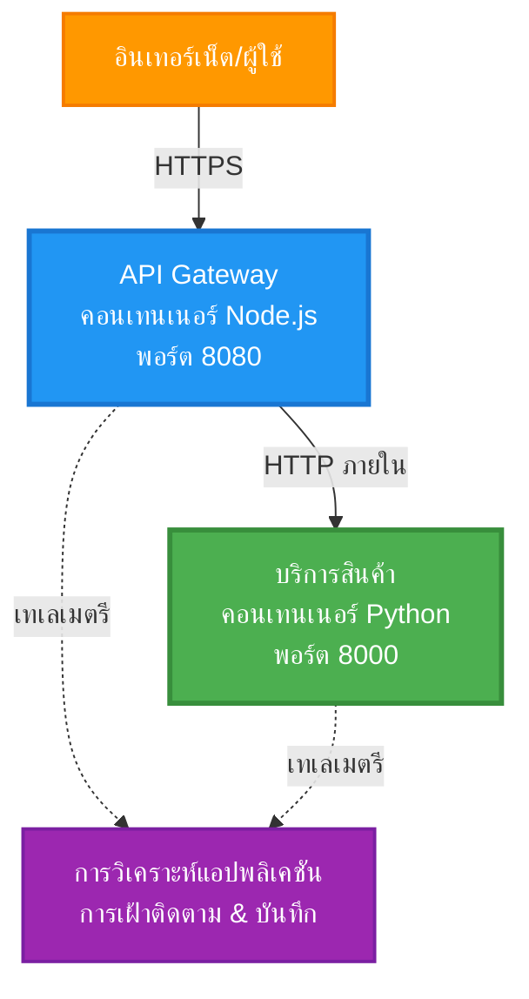
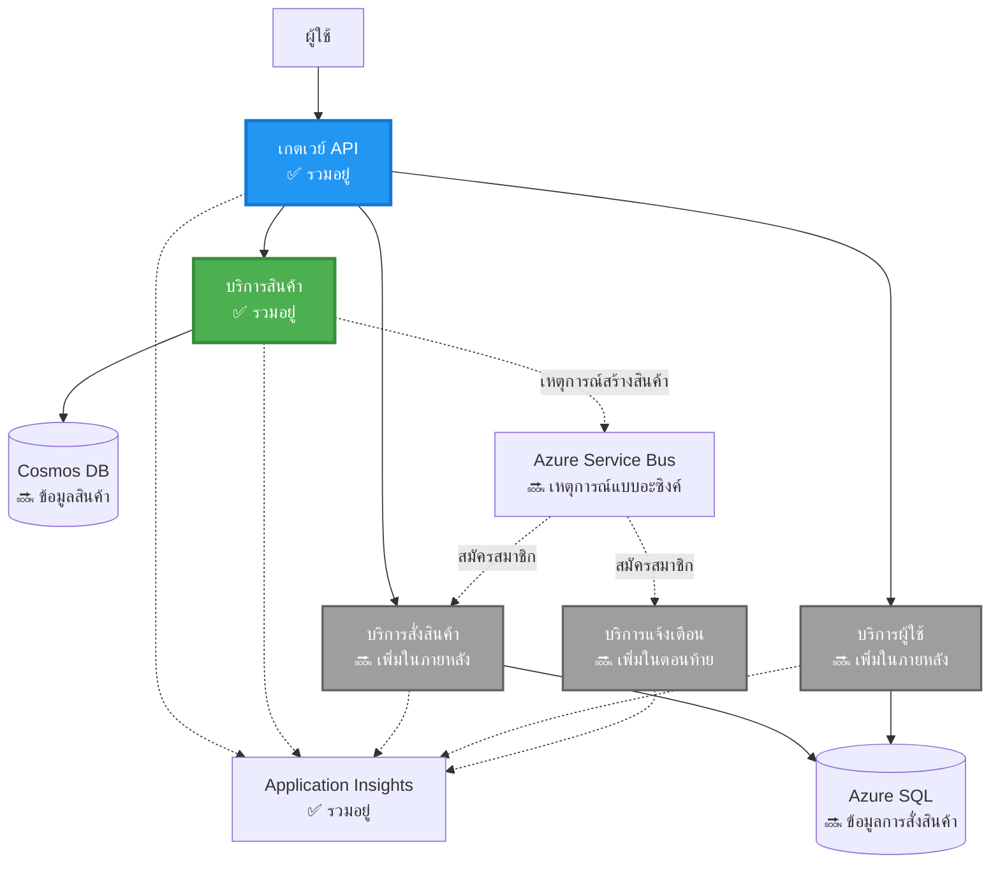
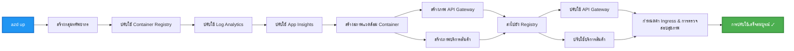
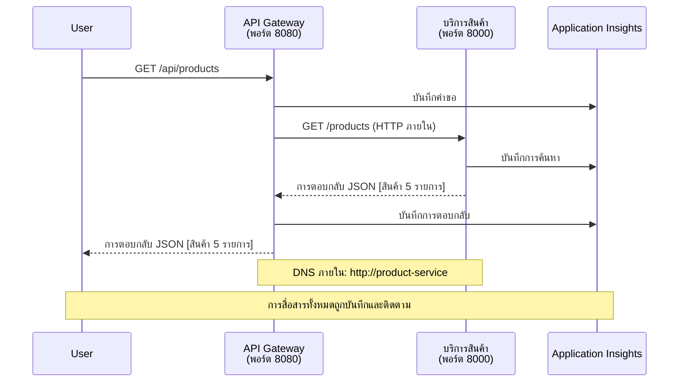

# สถาปัตยกรรมไมโครเซอร์วิส - ตัวอย่าง Container App

⏱️ **ระยะเวลาประมาณ**: 25-35 นาที | 💰 **ค่าใช้จ่ายประมาณ**: ~$50-100/เดือน | ⭐ **ความซับซ้อน**: ขั้นสูง

**📚 เส้นทางการเรียนรู้:**
- ← ก่อนหน้า: [Simple Flask API](../../../../examples/container-app/simple-flask-api) - พื้นฐานคอนเทนเนอร์เดี่ยว
- 🎯 **คุณอยู่ที่นี่**: สถาปัตยกรรมไมโครเซอร์วิส (พื้นฐาน 2 บริการ)
- → ถัดไป: [AI Integration](../../../../docs/ai-foundry) - เพิ่มความฉลาดให้บริการของคุณ
- 🏠 [หน้าหลักคอร์ส](../../README.md)

---

สถาปัตยกรรมไมโครเซอร์วิส **ที่เรียบง่ายแต่ใช้งานได้จริง** ถูกปรับใช้บน Azure Container Apps โดยใช้ AZD CLI ตัวอย่างนี้แสดงให้เห็นการสื่อสารระหว่างบริการ การจัดการคอนเทนเนอร์ และการตรวจสอบด้วยการตั้งค่าจริงสองบริการ

> **📚 วิธีการเรียนรู้**: ตัวอย่างนี้เริ่มต้นด้วยสถาปัตยกรรมสองบริการที่น้อยที่สุด (API Gateway + Backend Service) ที่คุณสามารถปรับใช้และเรียนรู้ได้จริง หลังจากคุณเข้าใจพื้นฐานนี้ เราจะให้แนวทางสำหรับการขยายสู่ระบบไมโครเซอร์วิสเต็มรูปแบบ

## สิ่งที่คุณจะได้เรียนรู้

เมื่อลงมือทำตัวอย่างนี้จนเสร็จ คุณจะสามารถ:
- ปรับใช้หลายคอนเทนเนอร์ใน Azure Container Apps
- ใช้สื่อสารบริการต่อบริการผ่านเครือข่ายภายใน
- กำหนดการปรับขนาดและตรวจสอบสุขภาพตามสภาพแวดล้อม
- ตรวจสอบแอปพลิเคชันแบบกระจายด้วย Application Insights
- เข้าใจรูปแบบการปรับใช้ไมโครเซอร์วิสและแนวปฏิบัติที่ดีที่สุด
- เรียนรู้การขยายตัวแบบก้าวหน้า จากสถาปัตยกรรมง่ายไปสู่ซับซ้อน

## สถาปัตยกรรม

### ระยะที่ 1: สิ่งที่เรากำลังสร้าง (รวมในตัวอย่างนี้)


```mermaid
graph TB
    Internet[อินเทอร์เน็ต/ผู้ใช้]
    Gateway[API Gateway<br/>คอนเทนเนอร์ Node.js<br/>พอร์ต 8080]
    Product[บริการสินค้า<br/>คอนเทนเนอร์ Python<br/>พอร์ต 8000]
    AppInsights[การวิเคราะห์แอปพลิเคชัน<br/>การเฝ้าติดตาม & บันทึก]
    
    Internet -->|HTTPS| Gateway
    Gateway -->|HTTP ภายใน| Product
    Gateway -.->|เทเลเมตรี| AppInsights
    Product -.->|เทเลเมตรี| AppInsights
    
    style Gateway fill:#2196F3,stroke:#1976D2,stroke-width:3px,color:#fff
    style Product fill:#4CAF50,stroke:#388E3C,stroke-width:3px,color:#fff
    style Internet fill:#FF9800,stroke:#F57C00,stroke-width:2px,color:#fff
    style AppInsights fill:#9C27B0,stroke:#7B1FA2,stroke-width:2px,color:#fff
```
**รายละเอียดส่วนประกอบ:**

| ส่วนประกอบ | วัตถุประสงค์ | การเข้าถึง | ทรัพยากร |
|-----------|---------|--------|-----------|
| **API Gateway** | เส้นทางคำขอภายนอกไปยังบริการ backend | สาธารณะ (HTTPS) | 1 vCPU, 2GB RAM, 2-20 ตัวทำซ้ำ |
| **บริการสินค้า** | จัดการแคตตาล็อกสินค้าแบบเก็บข้อมูลในหน่วยความจำ | ภายในเท่านั้น | 0.5 vCPU, 1GB RAM, 1-10 ตัวทำซ้ำ |
| **Application Insights** | การบันทึกและติดตามแบบกระจายแบบรวมศูนย์ | Azure Portal | การดึงข้อมูล 1-2 GB/เดือน |

**ทำไมต้องเริ่มที่เรียบง่าย?**
- ✅ ปรับใช้และเข้าใจได้อย่างรวดเร็ว (25-35 นาที)
- ✅ เรียนรู้รูปแบบไมโครเซอร์วิสหลักโดยไม่มีความซับซ้อน
- ✅ โค้ดที่ใช้งานได้จริง คุณสามารถแก้ไขและทดลองได้
- ✅ ค่าใช้จ่ายต่ำกว่าเพื่อการเรียนรู้ (~$50-100/เดือน เทียบกับ $300-1400/เดือน)
- ✅ สร้างความมั่นใจก่อนเพิ่มฐานข้อมูลและคิวข้อความ

**อุปมา**: คิดเหมือนการเรียนขับรถ เริ่มด้วยลานจอดรถว่าง (สองบริการ) ฝึกพื้นฐาน แล้วค่อยเข้าสู่การขับขี่ในเมือง (5+ บริการพร้อมฐานข้อมูล)

### ระยะที่ 2: การขยายในอนาคต (สถาปัตยกรรมอ้างอิง)

หลังจากคุณเข้าใจสถาปัตยกรรมสองบริการนี้แล้ว คุณสามารถขยายไปสู่:


```mermaid
graph TB
    User[ผู้ใช้]
    Gateway[เกตเวย์ API<br/>✅ รวมอยู่]
    Product[บริการสินค้า<br/>✅ รวมอยู่]
    Order[บริการสั่งสินค้า<br/>🔜 เพิ่มในภายหลัง]
    UserSvc[บริการผู้ใช้<br/>🔜 เพิ่มในภายหลัง]
    Notify[บริการแจ้งเตือน<br/>🔜 เพิ่มในตอนท้าย]
    
    CosmosDB[(Cosmos DB<br/>🔜 ข้อมูลสินค้า)]
    AzureSQL[(Azure SQL<br/>🔜 ข้อมูลการสั่งสินค้า)]
    ServiceBus[Azure Service Bus<br/>🔜 เหตุการณ์แบบอะซิงค์]
    AppInsights[Application Insights<br/>✅ รวมอยู่]
    
    User --> Gateway
    Gateway --> Product
    Gateway --> Order
    Gateway --> UserSvc
    
    Product --> CosmosDB
    Order --> AzureSQL
    UserSvc --> AzureSQL
    
    Product -.->|เหตุการณ์สร้างสินค้า| ServiceBus
    ServiceBus -.->|สมัครสมาชิก| Notify
    ServiceBus -.->|สมัครสมาชิก| Order
    
    Gateway -.-> AppInsights
    Product -.-> AppInsights
    Order -.-> AppInsights
    UserSvc -.-> AppInsights
    Notify -.-> AppInsights
    
    style Product fill:#4CAF50,stroke:#388E3C,stroke-width:3px,color:#fff
    style Gateway fill:#2196F3,stroke:#1976D2,stroke-width:3px,color:#fff
    style Order fill:#9E9E9E,stroke:#616161,stroke-width:2px,color:#fff
    style UserSvc fill:#9E9E9E,stroke:#616161,stroke-width:2px,color:#fff
    style Notify fill:#9E9E9E,stroke:#616161,stroke-width:2px,color:#fff
```
ดูส่วน "Expansion Guide" ท้ายเอกสารสำหรับคำแนะนำทีละขั้นตอน

## ฟีเจอร์ที่รวมอยู่

✅ **การค้นหาบริการ**: การค้นหา DNS อัตโนมัติระหว่างคอนเทนเนอร์  
✅ **การกระจายโหลด**: ระบบกระจายโหลดในตัวข้ามตัวทำซ้ำ  
✅ **การปรับขนาดอัตโนมัติ**: ปรับขนาดอิสระต่อบริการตามคำขอ HTTP  
✅ **การตรวจสอบสุขภาพ**: โพรบสำหรับตรวจสอบสถานะและความพร้อมสำหรับทั้งสองบริการ  
✅ **การบันทึกแบบกระจาย**: การบันทึกรวมศูนย์ด้วย Application Insights  
✅ **เครือข่ายภายใน**: การสื่อสารบริการต่อบริการที่ปลอดภัย  
✅ **การจัดการคอนเทนเนอร์**: การปรับใช้และปรับขนาดอัตโนมัติ  
✅ **อัพเดตแบบไม่มีเวลาหยุดทำงาน**: อัพเดตแบบเลื่อนพร้อมจัดการเวอร์ชัน  

## สิ่งที่ต้องมีล่วงหน้า

### เครื่องมือที่จำเป็น

ก่อนเริ่ม ตรวจสอบว่าคุณติดตั้งเครื่องมือต่อไปนี้แล้ว:

1. **[Azure Developer CLI (azd)](https://learn.microsoft.com/azure/developer/azure-developer-cli/install-azd)** (เวอร์ชัน 1.0.0 หรือสูงกว่า)
   ```bash
   azd version
   # ผลลัพธ์ที่คาดหวัง: azd เวอร์ชัน 1.0.0 หรือสูงกว่า
   ```

2. **[Azure CLI](https://learn.microsoft.com/cli/azure/install-azure-cli)** (เวอร์ชัน 2.50.0 หรือสูงกว่า)
   ```bash
   az --version
   # ผลลัพธ์ที่คาดหวัง: azure-cli 2.50.0 หรือสูงกว่า
   ```

3. **[Docker](https://www.docker.com/get-started)** (สำหรับพัฒนา/ทดสอบในเครื่อง - ไม่บังคับ)
   ```bash
   docker --version
   # ผลลัพธ์ที่คาดไว้: Docker เวอร์ชัน 20.10 หรือสูงกว่า
   ```

### ตรวจสอบการตั้งค่าของคุณ

รันคำสั่งเหล่านี้เพื่อยืนยันว่าคุณพร้อม:

```bash
# ตรวจสอบ Azure Developer CLI
azd version
# ✅ คาดหวัง: azd เวอร์ชัน 1.0.0 ขึ้นไป

# ตรวจสอบ Azure CLI
az --version
# ✅ คาดหวัง: azure-cli 2.50.0 ขึ้นไป

# ตรวจสอบ Docker (ไม่จำเป็น)
docker --version
# ✅ คาดหวัง: Docker เวอร์ชัน 20.10 ขึ้นไป
```

**เกณฑ์ความสำเร็จ**: คำสั่งทั้งหมดแสดงหมายเลขเวอร์ชันตรงหรือมากกว่าที่กำหนด

### ข้อกำหนดของ Azure

- สมัครสมาชิก **Azure** ที่ยังใช้งานอยู่ ([สร้างบัญชีฟรี](https://azure.microsoft.com/free/))
- สิทธิ์ในการสร้างทรัพยากรในบัญชีของคุณ
- บทบาท **Contributor** ในการสมัครหรือกลุ่มทรัพยากร

### ความรู้เบื้องต้น

นี่เป็นตัวอย่างระดับ **ขั้นสูง** คุณควร:
- ผ่านตัวอย่าง [Simple Flask API](../../../../examples/container-app/simple-flask-api)  
- เข้าใจพื้นฐานสถาปัตยกรรมไมโครเซอร์วิส
- คุ้นเคยกับ REST APIs และ HTTP
- เข้าใจแนวคิดคอนเทนเนอร์

**ใหม่กับ Container Apps?** เริ่มจากตัวอย่าง [Simple Flask API](../../../../examples/container-app/simple-flask-api) ก่อนเพื่อเรียนรู้พื้นฐาน

## เริ่มต้นอย่างรวดเร็ว (ทีละขั้นตอน)

### ขั้นตอนที่ 1: โคลนและเปลี่ยนไดเรกทอรี

```bash
git clone https://github.com/microsoft/AZD-for-beginners.git
cd AZD-for-beginners/examples/microservices
```

**✓ ตรวจสอบความสำเร็จ**: ยืนยันว่าคุณเห็น `azure.yaml`:
```bash
ls
# ที่คาดไว้: README.md, azure.yaml, infra/, src/
```

### ขั้นตอนที่ 2: ลงชื่อเข้าใช้ Azure

```bash
azd auth login
```

จะเปิดเบราว์เซอร์เพื่อเข้าสู่ระบบ Azure ลงชื่อด้วยข้อมูลบัญชี Azure ของคุณ

**✓ ตรวจสอบความสำเร็จ**: คุณควรเห็น:
```
Logged in to Azure.
```

### ขั้นตอนที่ 3: เริ่มต้นสภาพแวดล้อม

```bash
azd init
```

**ข้อความแจ้งที่คุณจะเห็น**:
- **ชื่อสภาพแวดล้อม**: กรอกชื่อสั้นๆ เช่น `microservices-dev`
- **บัญชี Azure**: เลือกบัญชีของคุณ
- **ตำแหน่ง Azure**: เลือกภูมิภาค เช่น `eastus`, `westeurope`

**✓ ตรวจสอบความสำเร็จ**: คุณควรเห็น:
```
SUCCESS: New project initialized!
```

### ขั้นตอนที่ 4: ปรับใช้โครงสร้างพื้นฐานและบริการ

```bash
azd up
```

**สิ่งที่จะเกิดขึ้น** (ใช้เวลา 8-12 นาที):


```mermaid
graph LR
    A[azd up] --> B[สร้างกลุ่มทรัพยากร]
    B --> C[ปรับใช้ Container Registry]
    C --> D[ปรับใช้ Log Analytics]
    D --> E[ปรับใช้ App Insights]
    E --> F[สร้างสภาพแวดล้อม Container]
    F --> G[สร้างภาพ API Gateway]
    F --> H[สร้างภาพบริการสินค้า]
    G --> I[ส่งไปยัง Registry]
    H --> I
    I --> J[ปรับใช้ API Gateway]
    I --> K[ปรับใช้บริการสินค้า]
    J --> L[กำหนดค่า Ingress & การตรวจสอบสุขภาพ]
    K --> L
    L --> M[การปรับใช้เสร็จสมบูรณ์ ✓]
    
    style A fill:#2196F3,stroke:#1976D2,stroke-width:3px,color:#fff
    style M fill:#4CAF50,stroke:#388E3C,stroke-width:3px,color:#fff
```
**✓ ตรวจสอบความสำเร็จ**: คุณควรเห็น:
```
SUCCESS: Your application was deployed to Azure in X minutes Y seconds.
Endpoint: https://api-gateway-<unique-id>.azurecontainerapps.io
```

**⏱️ เวลา**: 8-12 นาที

### ขั้นตอนที่ 5: ทดสอบการปรับใช้

```bash
# รับจุดสิ้นสุดเกตเวย์
GATEWAY_URL=$(azd env get-values | grep API_GATEWAY_URL | cut -d '=' -f2 | tr -d '"')

# ทดสอบสุขภาพ API Gateway
curl $GATEWAY_URL/health
```

**✅ ผลลัพธ์ที่คาดหวัง:**
```json
{
  "status": "healthy",
  "service": "api-gateway",
  "timestamp": "2025-11-19T10:30:00Z"
}
```

**ทดสอบบริการสินค้า ผ่าน gateway**:
```bash
# รายการสินค้า
curl $GATEWAY_URL/api/products
```

**✅ ผลลัพธ์ที่คาดหวัง:**
```json
[
  {"id":1,"name":"Laptop","price":999.99,"stock":50},
  {"id":2,"name":"Mouse","price":29.99,"stock":200},
  {"id":3,"name":"Keyboard","price":79.99,"stock":150}
]
```

**✓ ตรวจสอบความสำเร็จ**: ทั้งสอง endpoints คืนข้อมูล JSON ไม่มีข้อผิดพลาด

---

**🎉 ยินดีด้วย!** คุณได้ปรับใช้สถาปัตยกรรมไมโครเซอร์วิสบน Azure แล้ว!

## โครงสร้างโปรเจกต์

ไฟล์ทั้งหมดสำหรับการใช้งานถูกรวมไว้แล้ว—นี่คือตัวอย่างที่สมบูรณ์และใช้งานได้จริง:

```
microservices/
│
├── README.md                         # This file
├── azure.yaml                        # AZD configuration
├── .gitignore                        # Git ignore patterns
│
├── infra/                           # Infrastructure as Code (Bicep)
│   ├── main.bicep                   # Main orchestration
│   ├── abbreviations.json           # Naming conventions
│   ├── core/                        # Shared infrastructure
│   │   ├── container-apps-environment.bicep  # Container environment + registry
│   │   └── monitor.bicep            # Application Insights + Log Analytics
│   └── app/                         # Service definitions
│       ├── api-gateway.bicep        # API Gateway container app
│       └── product-service.bicep    # Product Service container app
│
└── src/                             # Application source code
    ├── api-gateway/                 # Node.js API Gateway
    │   ├── app.js                   # Express server with routing
    │   ├── package.json             # Node dependencies
    │   └── Dockerfile               # Container definition
    └── product-service/             # Python Product Service
        ├── main.py                  # Flask API with product data
        ├── requirements.txt         # Python dependencies
        └── Dockerfile               # Container definition
```

**ส่วนประกอบแต่ละส่วนทำหน้าที่อย่างไร:**

**โครงสร้างพื้นฐาน (infra/):**
- `main.bicep`: จัดการทรัพยากร Azure ทั้งหมดและความสัมพันธ์
- `core/container-apps-environment.bicep`: สร้างสภาพแวดล้อม Container Apps และ Azure Container Registry
- `core/monitor.bicep`: ตั้งค่า Application Insights สำหรับการบันทึกแบบกระจาย
- `app/*.bicep`: คอนเทนเนอร์แอปแต่ละตัวพร้อมการปรับขนาดและตรวจสอบสุขภาพ

**API Gateway (src/api-gateway/):**
- บริการหน้าสาธารณะที่ส่งคำขอไปยังบริการ backend
- ใช้งานการบันทึก การจัดการข้อผิดพลาด และการรีไดเรกต์คำขอ
- แสดงการสื่อสารแบบ HTTP ระหว่างบริการ

**บริการสินค้า (src/product-service/):**
- บริการภายในที่มีแคตตาล็อกสินค้า (เก็บข้อมูลในหน่วยความจำเพื่อความง่าย)
- REST API พร้อมโพรบตรวจสอบสุขภาพ
- ตัวอย่างรูปแบบไมโครเซอร์วิสฝั่ง backend

## ภาพรวมของบริการ

### API Gateway (Node.js/Express)

**พอร์ต**: 8080  
**การเข้าถึง**: สาธารณะ (โปรโตคอล ingress ภายนอก)  
**วัตถุประสงค์**: ส่งคำขอที่เข้ามาไปยังบริการ backend ที่เหมาะสม  

**Endpoints**:
- `GET /` - ข้อมูลบริการ
- `GET /health` - ตรวจสอบสุขภาพ
- `GET /api/products` - ส่งต่อไปยังบริการสินค้า (แสดงรายการทั้งหมด)
- `GET /api/products/:id` - ส่งต่อไปยังบริการสินค้า (รับ ID)

**ฟีเจอร์หลัก**:
- การส่งเส้นทางคำขอด้วย axios
- บันทึกแบบรวมศูนย์
- การจัดการข้อผิดพลาดและการหมดเวลา
- การค้นหาบริการผ่านตัวแปรสภาพแวดล้อม
- อินทิเกรชันกับ Application Insights

**โค้ดไฮไลต์** (`src/api-gateway/app.js`):
```javascript
// การสื่อสารบริการภายใน
app.get('/api/products', async (req, res) => {
  const response = await axios.get(`${PRODUCT_SERVICE_URL}/products`, {
    timeout: 5000
  });
  res.json(response.data);
});
```

### บริการสินค้า (Python/Flask)

**พอร์ต**: 8000  
**การเข้าถึง**: ภายในเท่านั้น (ไม่มี ingress ภายนอก)  
**วัตถุประสงค์**: จัดการแคตตาล็อกสินค้าโดยเก็บข้อมูลในหน่วยความจำ  

**Endpoints**:
- `GET /` - ข้อมูลบริการ
- `GET /health` - ตรวจสอบสุขภาพ
- `GET /products` - แสดงรายการสินค้าทั้งหมด
- `GET /products/<id>` - ดึงข้อมูลสินค้าตาม ID

**ฟีเจอร์หลัก**:
- RESTful API ด้วย Flask
- ร้านค้าเก็บสินค้าในหน่วยความจำ (ง่าย ไม่ต้องใช้ฐานข้อมูล)
- การตรวจสอบสุขภาพด้วยโพรบ
- บันทึกแบบมีโครงสร้าง
- เชื่อมต่อกับ Application Insights

**โมเดลข้อมูล**:
```python
{
  "id": 1,
  "name": "Laptop",
  "description": "High-performance laptop",
  "price": 999.99,
  "stock": 50
}
```

**ทำไมถึงภายในเท่านั้น?**
บริการสินค้าไม่ถูกเปิดเผยต่อสาธารณะ คำขอทั้งหมดต้องผ่าน API Gateway ซึ่งให้:
- ความปลอดภัย: จุดการเข้าถึงที่ควบคุม
- ความยืดหยุ่น: เปลี่ยน backend ได้โดยไม่กระทบลูกค้า
- การตรวจสอบ: บันทึกคำขอแบบรวมศูนย์

## เข้าใจการสื่อสารระหว่างบริการ

### วิธีการที่บริการสื่อสารกัน


```mermaid
sequenceDiagram
    participant User
    participant Gateway as API Gateway<br/>(พอร์ต 8080)
    participant Product as บริการสินค้า<br/>(พอร์ต 8000)
    participant AI as Application Insights
    
    User->>Gateway: GET /api/products
    Gateway->>AI: บันทึกคำขอ
    Gateway->>Product: GET /products (HTTP ภายใน)
    Product->>AI: บันทึกการค้นหา
    Product-->>Gateway: การตอบกลับ JSON [สินค้า 5 รายการ]
    Gateway->>AI: บันทึกการตอบกลับ
    Gateway-->>User: การตอบกลับ JSON [สินค้า 5 รายการ]
    
    Note over Gateway,Product: DNS ภายใน: http://product-service
    Note over User,AI: การสื่อสารทั้งหมดถูกบันทึกและติดตาม
```
ในตัวอย่างนี้ API Gateway สื่อสารกับบริการสินค้าโดยใช้ **HTTP ภายใน**:

```javascript
// เกตเวย์ API (src/api-gateway/app.js)
const PRODUCT_SERVICE_URL = process.env.PRODUCT_SERVICE_URL;

// ทำคำขอ HTTP ภายใน
const response = await axios.get(`${PRODUCT_SERVICE_URL}/products`);
```

**ประเด็นสำคัญ**:

1. **การค้นหา DNS อัตโนมัติ**: Container Apps ให้ DNS ภายในบริการอัตโนมัติ  
   - ชื่อ FQDN ของบริการสินค้า: `product-service.internal.<environment>.azurecontainerapps.io`  
   - เรียกง่ายเป็น: `http://product-service` (Container Apps แปลงชื่อให้)

2. **ไม่มีการเปิดเผยสู่สาธารณะ**: บริการสินค้ามีค่า `external: false` ใน Bicep  
   - เข้าถึงได้เฉพาะในสภาพแวดล้อม Container Apps  
   - ไม่สามารถเข้าถึงจากอินเทอร์เน็ต

3. **ตัวแปรสภาพแวดล้อม**: URL บริการถูกส่งตอนปรับใช้  
   - Bicep ส่ง FQDN ภายในไปยัง gateway  
   - ไม่มี URL ฝังในโค้ดแอปพลิเคชัน

**อุปมา**: คิดเหมือนสำนักงาน API Gateway คือจุดต้อนรับ (สาธารณะ) และบริการสินค้าคือห้องสำนักงาน (ภายใน) ผู้มาติดต่อจะต้องผ่านจุดต้อนรับก่อนถึงห้องใดๆ

## ตัวเลือกการปรับใช้

### ปรับใช้เต็มรูปแบบ (แนะนำ)

```bash
# ปรับใช้โครงสร้างพื้นฐานและบริการทั้งสอง
azd up
```

นี้จะปรับใช้:
1. สภาพแวดล้อม Container Apps
2. Application Insights
3. Container Registry
4. คอนเทนเนอร์ API Gateway
5. คอนเทนเนอร์บริการสินค้า

**เวลา**: 8-12 นาที

### ปรับใช้บริการเดี่ยว

```bash
# ปล่อยใช้งานเพียงบริการเดียว (หลังจาก azd up เริ่มต้น)
azd deploy api-gateway

# หรือปล่อยใช้งานบริการผลิตภัณฑ์
azd deploy product-service
```

**กรณีใช้งาน**: เมื่อคุณแก้ไขโค้ดบริการใดบริการหนึ่งและต้องการปรับใช้อีกครั้งเฉพาะบริการนั้น

### อัปเดตการตั้งค่า

```bash
# เปลี่ยนพารามิเตอร์การปรับขนาด
azd env set GATEWAY_MAX_REPLICAS 30

# ปรับใช้ใหม่ด้วยการกำหนดค่าที่ใหม่
azd up
```

## การกำหนดค่า

### การกำหนดค่าการปรับขนาด

ทั้งสองบริการตั้งค่าการปรับขนาดอัตโนมัติด้วย HTTP ในไฟล์ Bicep ของแต่ละตัว:

**API Gateway**:
- ตัวทำซ้ำขั้นต่ำ: 2 (มีอย่างน้อย 2 เพื่อความพร้อมใช้งาน)
- ตัวทำซ้ำสูงสุด: 20
- ตัวกระตุ้นการปรับขนาด: 50 คำขอพร้อมกันต่อหนึ่งตัวทำซ้ำ

**บริการสินค้า**:
- ตัวทำซ้ำขั้นต่ำ: 1 (สามารถปรับเป็น 0 ได้หากจำเป็น)
- ตัวทำซ้ำสูงสุด: 10
- ตัวกระตุ้นการปรับขนาด: 100 คำขอพร้อมกันต่อหนึ่งตัวทำซ้ำ

**ปรับแต่งการปรับขนาด** (ใน `infra/app/*.bicep`):
```bicep
scale: {
  minReplicas: 1
  maxReplicas: 10
  rules: [
    {
      name: 'http-scale-rule'
      http: {
        metadata: {
          concurrentRequests: '100'  // Adjust this
        }
      }
    }
  ]
}
```

### การจัดสรรทรัพยากร

**API Gateway**:
- CPU: 1.0 vCPU
- หน่วยความจำ: 2 GiB
- เหตุผล: จัดการการรับส่งข้อมูลภายนอกทั้งหมด

**บริการสินค้า**:
- CPU: 0.5 vCPU
- หน่วยความจำ: 1 GiB
- เหตุผล: การทำงานเบาๆ ในหน่วยความจำ

### โพรบตรวจสอบสุขภาพ

ทั้งสองบริการมีโพรบตรวจสอบสถานะและความพร้อม:

```bicep
probes: [
  {
    type: 'Liveness'
    httpGet: {
      path: '/health'
      port: 8080
    }
    initialDelaySeconds: 10
    periodSeconds: 30
  }
  {
    type: 'Readiness'
    httpGet: {
      path: '/health'
      port: 8080
    }
    initialDelaySeconds: 5
    periodSeconds: 10
  }
]
```

**หมายความว่าอย่างไร**:
- **Liveness**: ถ้าตรวจสอบสุขภาพล้มเหลว Container Apps จะรีสตาร์ทคอนเทนเนอร์นั้น
- **Readiness**: ถ้าไม่พร้อม Container Apps จะหยุดส่งทราฟฟิกไปยังตัวทำซ้ำตัวนั้น

## การตรวจสอบและสังเกตการณ์

### ดูบันทึกของบริการ

```bash
# ดูบันทึกโดยใช้ azd monitor
azd monitor --logs

# หรือใช้ Azure CLI สำหรับ Container Apps เฉพาะ:
# สตรีมบันทึกจาก API Gateway
az containerapp logs show --name api-gateway --resource-group $RG_NAME --follow

# ดูบันทึกล่าสุดของบริการผลิตภัณฑ์
az containerapp logs show --name product-service --resource-group $RG_NAME --tail 100
```

**ผลลัพธ์ที่คาดหวัง**:
```
[api-gateway] API Gateway listening on port 8080
[api-gateway] Product Service URL: http://product-service
[api-gateway] GET /api/products 200 - 45ms
[product-service] Retrieved 5 products
```

### คิวรีใน Application Insights

เข้าถึง Application Insights ใน Azure Portal จากนั้นรันคำสั่งดังนี้:

**หาคำขอช้า**:
```kusto
requests
| where timestamp > ago(1h)
| where duration > 1000  // Requests taking >1 second
| summarize count() by name, cloud_RoleName
| order by count_ desc
```

**ติดตามการโทรบริการต่อบริการ**:
```kusto
dependencies
| where timestamp > ago(1h)
| where type == "Http"
| project timestamp, name, target, duration, success
| order by timestamp desc
```

**อัตราข้อผิดพลาดแยกตามบริการ**:
```kusto
exceptions
| where timestamp > ago(24h)
| summarize errorCount = count() by cloud_RoleName, type
| order by errorCount desc
```

**ปริมาณคำขอเมื่อเวลาผ่านไป**:
```kusto
requests
| where timestamp > ago(1h)
| summarize requestCount = count() by bin(timestamp, 5m), cloud_RoleName
| render timechart
```

### เข้าถึงแดชบอร์ดการตรวจสอบ

```bash
# รับรายละเอียด Application Insights
azd env get-values | grep APPLICATIONINSIGHTS

# เปิดการตรวจสอบ Azure Portal
az monitor app-insights component show \
  --app $(azd env get-values | grep APPLICATIONINSIGHTS_CONNECTION_STRING | cut -d '=' -f2) \
  --resource-group $(azd env get-values | grep AZURE_RESOURCE_GROUP | cut -d '=' -f2) \
  --query "appId" -o tsv
```

### เมตริกสด

1. ไปที่ Application Insights ใน Azure Portal  
2. คลิก "Live Metrics"  
3. ดูคำขอแบบเรียลไทม์, ความล้มเหลว, และประสิทธิภาพ  
4. ทดสอบโดยรัน: `curl $(azd env get-values | grep API_GATEWAY_URL | cut -d '=' -f2 | tr -d '"')/api/products`

## แบบฝึกหัดเชิงปฏิบัติ

### แบบฝึกหัด 1: เพิ่ม Endpoint สินค้าใหม่ ⭐ (ง่าย)

**เป้าหมาย**: เพิ่ม endpoint POST เพื่อสร้างสินค้าใหม่

**จุดเริ่มต้น**: `src/product-service/main.py`

**ขั้นตอน**:

1. เพิ่ม endpoint นี้หลังฟังก์ชัน `get_product` ใน `main.py`:

```python
@app.route('/products', methods=['POST'])
def create_product():
    """Create a new product"""
    data = request.get_json()
    
    # ตรวจสอบฟิลด์ที่จำเป็น
    if not data or 'name' not in data or 'price' not in data:
        return jsonify({'error': 'Missing required fields: name, price'}), 400
    
    new_id = max(p['id'] for p in products) + 1
    new_product = {
        'id': new_id,
        'name': data['name'],
        'description': data.get('description', ''),
        'price': float(data['price']),
        'stock': int(data.get('stock', 0))
    }
    products.append(new_product)
    logger.info(f"Created product {new_id}")
    return jsonify(new_product), 201
```

2. เพิ่มเส้นทาง POST ใน API Gateway (`src/api-gateway/app.js`):

```javascript
// เพิ่มสิ่งนี้หลังจากเส้นทาง GET /api/products
app.post('/api/products', async (req, res) => {
  try {
    console.log(`Forwarding POST request to ${PRODUCT_SERVICE_URL}/products`);
    const response = await axios.post(`${PRODUCT_SERVICE_URL}/products`, req.body, {
      timeout: 5000
    });
    res.status(201).json(response.data);
  } catch (error) {
    console.error('Error calling product service:', error.message);
    res.status(503).json({
      error: 'Product service unavailable',
      message: error.message
    });
  }
});
```

3. ปรับใช้บริการทั้งสองใหม่:

```bash
azd deploy product-service
azd deploy api-gateway
```

4. ทดสอบ endpoint ใหม่:

```bash
GATEWAY_URL=$(azd env get-values | grep API_GATEWAY_URL | cut -d '=' -f2 | tr -d '"')

# สร้างผลิตภัณฑ์ใหม่
curl -X POST $GATEWAY_URL/api/products \
  -H "Content-Type: application/json" \
  -d '{"name":"USB Cable","price":9.99,"stock":500}'
```

**✅ ผลลัพธ์ที่คาดหวัง:**
```json
{"id":6,"name":"USB Cable","description":"","price":9.99,"stock":500}
```

5. ตรวจสอบว่าแสดงในรายการ:

```bash
curl $GATEWAY_URL/api/products
# ควรแสดงสินค้า 6 รายการรวมถึงสาย USB ใหม่ตอนนี้
```

**เกณฑ์ความสำเร็จ**:
- ✅ คำขอ POST คืนค่า HTTP 201
- ✅ ผลิตภัณฑ์ใหม่แสดงในรายการ GET /api/products
- ✅ ผลิตภัณฑ์มี ID เพิ่มขึ้นอัตโนมัติ

**เวลา**: 10-15 นาที

---

### แบบฝึกหัด 2: แก้ไขกฎการปรับขนาดอัตโนมัติ ⭐⭐ (ระดับปานกลาง)

**เป้าหมาย**: เปลี่ยน Product Service ให้ปรับขนาดอย่างรุนแรงขึ้น

**จุดเริ่มต้น**: `infra/app/product-service.bicep`

**ขั้นตอน**:

1. เปิดไฟล์ `infra/app/product-service.bicep` และหาบล็อก `scale` (ประมาณบรรทัด 95)

2. เปลี่ยนจาก:
```bicep
scale: {
  minReplicas: 1
  maxReplicas: 10
  rules: [
    {
      name: 'http-scale-rule'
      http: {
        metadata: {
          concurrentRequests: '100'  // OLD
        }
      }
    }
  ]
}
```

เป็น:
```bicep
scale: {
  minReplicas: 2  // Always have 2 running
  maxReplicas: 20  // Allow more scaling
  rules: [
    {
      name: 'http-scale-rule'
      http: {
        metadata: {
          concurrentRequests: '20'  // Scale at lower threshold
        }
      }
    }
  ]
}
```

3. ปรับใช้โครงสร้างพื้นฐานใหม่:

```bash
azd up
```

4. ตรวจสอบการตั้งค่าการปรับขนาดใหม่:

```bash
az containerapp show \
  --name $(azd env get-values | grep PRODUCT_SERVICE | head -1 | cut -d '/' -f5) \
  --resource-group $(azd env get-values | grep AZURE_RESOURCE_GROUP | cut -d '=' -f2 | tr -d '"') \
  --query "properties.template.scale" -o json
```

**✅ ผลลัพธ์ที่คาดหวัง:**
```json
{
  "minReplicas": 2,
  "maxReplicas": 20,
  "rules": [...]
}
```

5. ทดสอบการปรับขนาดอัตโนมัติโดยมีภาระ:

```bash
# สร้างคำขอพร้อมกัน
for i in {1..500}; do curl $GATEWAY_URL/api/products & done

# ดูการปรับขนาดที่เกิดขึ้นโดยใช้ Azure CLI
az containerapp logs show --name product-service --resource-group $RG_NAME --follow
# มองหากิจกรรมการปรับขนาด Container Apps
```

**เกณฑ์ความสำเร็จ**:
- ✅ Product Service รันอย่างน้อย 2 รีพลิกตลอดเวลา
- ✅ ภายใต้ภาระ ปรับขนาดเป็นมากกว่า 2 รีพลิก
- ✅ Azure Portal แสดงกฎการปรับขนาดใหม่

**เวลา**: 15-20 นาที

---

### แบบฝึกหัด 3: เพิ่มแบบสอบถามการตรวจสอบแบบกำหนดเอง ⭐⭐ (ระดับปานกลาง)

**เป้าหมาย**: สร้างแบบสอบถาม Application Insights แบบกำหนดเองเพื่อติดตามประสิทธิภาพของ API ผลิตภัณฑ์

**ขั้นตอน**:

1. ไปที่ Application Insights ใน Azure Portal:
   - ไปที่ Azure Portal
   - หา resource group ของคุณ (rg-microservices-*)
   - คลิกที่ทรัพยากร Application Insights

2. คลิก "Logs" ในเมนูด้านซ้าย

3. สร้างแบบสอบถามนี้:

```kusto
requests
| where timestamp > ago(1h)
| where name contains "products"
| summarize 
    RequestCount = count(),
    AvgDuration = avg(duration),
    P95Duration = percentile(duration, 95),
    SuccessRate = 100.0 * countif(success == true) / count()
  by bin(timestamp, 5m)
| render timechart
```

4. คลิก "Run" เพื่อรันแบบสอบถาม

5. บันทึกแบบสอบถาม:
   - คลิก "Save"
   - ตั้งชื่อ: "Product API Performance"
   - หมวดหมู่: "Performance"

6. สร้างการทดสอบการรับส่งข้อมูล:

```bash
for i in {1..100}; do curl $GATEWAY_URL/api/products; sleep 1; done
```

7. รีเฟรชแบบสอบถามเพื่อดูข้อมูล

**✅ ผลลัพธ์ที่คาดหวัง:**
- กราฟแสดงจำนวนคำขอตามเวลา
- ระยะเวลาเฉลี่ย < 500ms
- อัตราความสำเร็จ = 100%
- ช่วงเวลาเป็นบล็อก 5 นาที

**เกณฑ์ความสำเร็จ**:
- ✅ แบบสอบถามแสดงคำขอ 100+ รายการ
- ✅ อัตราความสำเร็จ 100%
- ✅ ระยะเวลาเฉลี่ย < 500ms
- ✅ กราฟแสดงช่วงเวลา 5 นาที

**ผลการเรียนรู้**: เข้าใจวิธีตรวจสอบประสิทธิภาพบริการด้วยแบบสอบถามกำหนดเอง

**เวลา**: 10-15 นาที

---

### แบบฝึกหัด 4: นำตรรกะการลองใหม่มาใช้ ⭐⭐⭐ (ขั้นสูง)

**เป้าหมาย**: เพิ่มตรรกะการลองใหม่ให้ API Gateway เมื่อ Product Service ไม่พร้อมใช้งานชั่วคราว

**จุดเริ่มต้น**: `src/api-gateway/app.js`

**ขั้นตอน**:

1. ติดตั้งไลบรารี retry:

```bash
cd src/api-gateway
npm install axios-retry --save
cd ../..
```

2. อัปเดต `src/api-gateway/app.js` (เพิ่มหลังการนำเข้า axios):

```javascript
const axiosRetry = require('axios-retry');

// กำหนดตรรกะการลองใหม่
axiosRetry(axios, {
  retries: 3,
  retryDelay: (retryCount) => {
    return retryCount * 1000; // 1วินาที, 2วินาที, 3วินาที
  },
  retryCondition: (error) => {
    // ลองใหม่เมื่อเกิดข้อผิดพลาดของเครือข่ายหรือการตอบกลับ 5xx
    return axiosRetry.isNetworkOrIdempotentRequestError(error) ||
           (error.response && error.response.status >= 500);
  }
});

console.log('Retry logic configured: 3 retries with exponential backoff');
```

3. ปรับใช้ API Gateway ใหม่:

```bash
azd deploy api-gateway
```

4. ทดสอบพฤติกรรมการลองใหม่โดยจำลองความล้มเหลวของบริการ:

```bash
# ปรับขนาดบริการสินค้าเป็น 0 (จำลองความล้มเหลว)
az containerapp update \
  --name $(azd env get-values | grep PRODUCT_SERVICE | head -1 | cut -d '/' -f5) \
  --resource-group $(azd env get-values | grep AZURE_RESOURCE_GROUP | cut -d '=' -f2 | tr -d '"') \
  --min-replicas 0 \
  --max-replicas 0

# พยายามเข้าถึงสินค้า (จะลองใหม่ 3 ครั้ง)
time curl -v $GATEWAY_URL/api/products
# สังเกต: การตอบสนองใช้เวลาประมาณ 6 วินาที (1วินาที + 2วินาที + 3วินาทีในการลองใหม่)

# กู้คืนบริการสินค้า
az containerapp update \
  --name $(azd env get-values | grep PRODUCT_SERVICE | head -1 | cut -d '/' -f5) \
  --resource-group $(azd env get-values | grep AZURE_RESOURCE_GROUP | cut -d '=' -f2 | tr -d '"') \
  --min-replicas 1 \
  --max-replicas 10
```

5. ดูบันทึกการลองใหม่:

```bash
az containerapp logs show --name api-gateway --resource-group $RG_NAME --tail 50
# มองหา: ข้อความพยายามลองใหม่
```

**✅ พฤติกรรมที่คาดหวัง:**
- คำขอพยายาม 3 ครั้งก่อนล้มเหลว
- แต่ละครั้งรอเวลานานขึ้น (1วินาที, 2วินาที, 3วินาที)
- คำขอสำเร็จหลังจากบริการรีสตาร์ท
- บันทึกแสดงความพยายามการลองใหม่

**เกณฑ์ความสำเร็จ**:
- ✅ คำขอพยายาม 3 ครั้งก่อนล้มเหลว
- ✅ แต่ละครั้งรอเวลานานขึ้น (exponential backoff)
- ✅ คำขอสำเร็จหลังบริการรีสตาร์ท
- ✅ บันทึกแสดงความพยายามการลองใหม่

**ผลการเรียนรู้**: เข้าใจรูปแบบความทนทานในไมโครเซอร์วิส (circuit breakers, retries, timeouts)

**เวลา**: 20-25 นาที

---

## จุดตรวจสอบความรู้

หลังจากทำตัวอย่างนี้เสร็จแล้ว ให้ตรวจสอบความเข้าใจของคุณ:

### 1. การสื่อสารระหว่างบริการ ✓

ทดสอบความรู้:
- [ ] อธิบายได้ไหมว่า API Gateway ค้นหา Product Service อย่างไร? (ใช้ DNS-based service discovery)
- [ ] จะเกิดอะไรขึ้นถ้า Product Service ไม่ทำงาน? (Gateway คืนค่า error 503)
- [ ] จะเพิ่มบริการที่สามอย่างไร? (สร้างไฟล์ Bicep ใหม่, เพิ่มใน main.bicep, สร้างโฟลเดอร์ src)

**การตรวจสอบด้วยตนเอง:**
```bash
# จำลองความล้มเหลวของบริการ
az containerapp update --name <product-service-name> --min-replicas 0 --max-replicas 0
curl $GATEWAY_URL/api/products
# ✅ คาดการณ์: 503 บริการไม่พร้อมใช้งาน

# กู้คืนบริการ
az containerapp update --name <product-service-name> --min-replicas 1 --max-replicas 10
```

### 2. การตรวจสอบและการสังเกต ✓

ทดสอบความรู้:
- [ ] ดูบันทึกแบบกระจายได้ที่ไหน? (Application Insights ใน Azure Portal)
- [ ] จะติดตามคำขอล่าช้าอย่างไร? (Kusto query: `requests | where duration > 1000`)
- [ ] ระบุได้ไหมว่าบริการไหนเป็นต้นเหตุของข้อผิดพลาด? (ตรวจสอบฟิลด์ `cloud_RoleName` ในบันทึก)

**การตรวจสอบด้วยตนเอง:**
```bash
# สร้างการจำลองคำขอที่ช้า
curl "$GATEWAY_URL/api/products?delay=2000"

# ค้นหา Application Insights สำหรับคำขอที่ช้า
# ไปที่ Azure Portal → Application Insights → Logs
# รัน: requests | where duration > 1000 | project timestamp, name, duration, cloud_RoleName
```

### 3. การปรับขนาดและประสิทธิภาพ ✓

ทดสอบความรู้:
- [ ] อะไรเป็นตัวกระตุ้นการปรับขนาดอัตโนมัติ? (กฎคำขอ HTTP พร้อมกัน: 50 สำหรับ gateway, 100 สำหรับ product)
- [ ] มีรีพลิกกี่ตัวที่รันตอนนี้? (ตรวจสอบด้วย `az containerapp revision list`)
- [ ] จะปรับ Product Service เป็น 5 รีพลิกอย่างไร? (อัปเดต minReplicas ใน Bicep)

**การตรวจสอบด้วยตนเอง:**
```bash
# สร้างโหลดเพื่อทดสอบการปรับขนาดอัตโนมัติ
for i in {1..1000}; do curl $GATEWAY_URL/api/products & done

# ดูการเพิ่มขึ้นของตัวทำซ้ำโดยใช้ Azure CLI
az containerapp logs show --name api-gateway --resource-group $RG_NAME --follow
# ✅ คาดหวัง: เห็นเหตุการณ์การปรับขนาดในบันทึกเหตุการณ์
```

**เกณฑ์ความสำเร็จ**: คุณสามารถตอบคำถามทั้งหมดและตรวจสอบด้วยคำสั่งจริง

---

## การวิเคราะห์ต้นทุน

### ต้นทุนรายเดือนโดยประมาณ (สำหรับตัวอย่าง 2 บริการนี้)

| ทรัพยากร | การตั้งค่า | ต้นทุนโดยประมาณ |
|----------|--------------|----------------|
| API Gateway | 2-20 รีพลิก, 1 vCPU, 2GB RAM | $30-150 |
| Product Service | 1-10 รีพลิก, 0.5 vCPU, 1GB RAM | $15-75 |
| Container Registry | ระดับ Basic | $5 |
| Application Insights | 1-2 GB/เดือน | $5-10 |
| Log Analytics | 1 GB/เดือน | $3 |
| **รวม** | | **$58-243/เดือน** |

### การแยกรายจ่ายตามการใช้งาน

**ทราฟฟิกเบา** (ทดสอบ/เรียนรู้): ~$60/เดือน
- API Gateway: 2 รีพลิก × 24/7 = $30
- Product Service: 1 รีพลิก × 24/7 = $15
- การตรวจสอบ + Registry = $13

**ทราฟฟิกปานกลาง** (โปรดักชันขนาดเล็ก): ~$120/เดือน
- API Gateway: 5 รีพลิกเฉลี่ย = $75
- Product Service: 3 รีพลิกเฉลี่ย = $45
- การตรวจสอบ + Registry = $13

**ทราฟฟิกสูง** (ช่วงเวลาคับคั่ง): ~$240/เดือน
- API Gateway: 15 รีพลิกเฉลี่ย = $225
- Product Service: 8 รีพลิกเฉลี่ย = $120
- การตรวจสอบ + Registry = $13

### เคล็ดลับการปรับต้นทุน

1. **ปรับขนาดเป็นศูนย์ในช่วงพัฒนา**:
   ```bicep
   scale: {
     minReplicas: 0  // Save $30-40/month when not in use
     maxReplicas: 10
   }
   ```

2. **ใช้แผน Consumption สำหรับ Cosmos DB** (เมื่อเพิ่ม):
   - จ่ายเฉพาะที่ใช้
   - ไม่มีค่าขั้นต่ำ

3. **ตั้งค่า Sampling ใน Application Insights**:
   ```javascript
   appInsights.defaultClient.config.samplingPercentage = 50; // ตัวอย่าง 50% ของคำขอ
   ```

4. **ลบทรัพยากรเมื่อไม่ใช้งานแล้ว**:
   ```bash
   azd down --force --purge
   ```

### ตัวเลือกระดับฟรี

สำหรับเรียนรู้/ทดสอบ พิจารณา:
- ✅ ใช้เครดิต Azure ฟรี ($200 สำหรับ 30 วันแรกกับบัญชีใหม่)
- ✅ รักษารีพลิกขั้นต่ำ (ช่วยประหยัด ~50% ต้นทุน)
- ✅ ลบหลังทดสอบเสร็จ (ไม่คิดค่าบริการต่อเนื่อง)
- ✅ ปรับเป็นศูนย์ระหว่างช่วงเรียนรู้

**ตัวอย่าง**: รันตัวอย่างนี้ 2 ชม./วัน × 30 วัน = ~$5/เดือน แทนที่จะเป็น $60/เดือน

---

## คู่มือแก้ไขปัญหาอย่างรวดเร็ว

### ปัญหา: `azd up` ล้มเหลวพร้อมข้อความ "Subscription not found"

**วิธีแก้:**
```bash
# เข้าสู่ระบบอีกครั้งโดยใช้การสมัครสมาชิกที่ชัดเจน
az account set --subscription <your-subscription-id>
azd env set AZURE_SUBSCRIPTION_ID <your-subscription-id>
azd up
```

### ปัญหา: API Gateway คืนค่า 503 "Product service unavailable"

**วิเคราะห์:**
```bash
# ตรวจสอบบันทึกบริการผลิตภัณฑ์โดยใช้ Azure CLI
az containerapp logs show --name product-service --resource-group $RG_NAME --tail 50

# ตรวจสอบสถานะสุขภาพของบริการผลิตภัณฑ์
az containerapp show \
  --name $(azd env get-values | grep PRODUCT_SERVICE | head -1 | cut -d '/' -f5) \
  --resource-group $(azd env get-values | grep AZURE_RESOURCE_GROUP | cut -d '=' -f2 | tr -d '"') \
  --query "properties.runningStatus"
```

**สาเหตุทั่วไป**:
1. บริการผลิตภัณฑ์ไม่เริ่มทำงาน (ตรวจสอบบันทึกข้อผิดพลาด Python)
2. การตรวจสอบสุขภาพล้มเหลว (ตรวจสอบว่า endpoint `/health` ใช้งานได้)
3. การสร้างภาพคอนเทนเนอร์ล้มเหลว (ตรวจสอบใน registry)

### ปัญหา: การปรับขนาดอัตโนมัติไม่ทำงาน

**วิเคราะห์:**
```bash
# ตรวจสอบจำนวนรีพลิกาปัจจุบัน
az containerapp revision list \
  --name $(azd env get-values | grep API_GATEWAY | head -1 | cut -d '/' -f5) \
  --resource-group $(azd env get-values | grep AZURE_RESOURCE_GROUP | cut -d '=' -f2 | tr -d '"') \
  --query "[].properties.replicas"

# สร้างภาระงานเพื่อทดสอบ
for i in {1..1000}; do curl $GATEWAY_URL/api/products & done

# ดูเหตุการณ์การปรับขนาดโดยใช้ Azure CLI
az containerapp logs show --name api-gateway --resource-group $RG_NAME --follow | grep -i scale
```

**สาเหตุทั่วไป**:
1. ภาระงานไม่สูงพอที่จะกระตุ้นกฎการปรับขนาด (ต้องมากกว่า 50 คำขอพร้อมกัน)
2. ถึงจำนวนรีพลิกสูงสุดแล้ว (ตรวจสอบการตั้งค่า Bicep)
3. กฎการปรับขนาดตั้งค่าไม่ถูกต้องใน Bicep (ตรวจสอบค่า concurrentRequests)

### ปัญหา: Application Insights ไม่แสดงบันทึก

**วิเคราะห์:**
```bash
# ตรวจสอบว่าได้ตั้งสายการเชื่อมต่อแล้ว
azd env get-values | grep APPLICATIONINSIGHTS

# ตรวจสอบว่าบริการกำลังส่งข้อมูลเทเลเมทรีหรือไม่
az monitor app-insights component show \
  --app $(azd env get-values | grep APPLICATIONINSIGHTS_NAME | cut -d '=' -f2 | tr -d '"') \
  --resource-group $(azd env get-values | grep AZURE_RESOURCE_GROUP | cut -d '=' -f2 | tr -d '"') \
  --query "properties.InstrumentationKey"
```

**สาเหตุทั่วไป**:
1. ไม่ได้ส่ง connection string ไปยังคอนเทนเนอร์ (ตรวจสอบตัวแปรสภาพแวดล้อม)
2. ไม่ได้ตั้งค่า SDK ของ Application Insights (ตรวจสอบการนำเข้าในโค้ด)
3. ไฟร์วอลล์บล็อกข้อมูล telemetry (พบได้น้อย ตรวจสอบกฎเครือข่าย)

### ปัญหา: การสร้าง Docker ล้มเหลวในเครื่องท้องถิ่น

**วิเคราะห์:**
```bash
# ทดสอบการสร้าง API Gateway
cd src/api-gateway
docker build -t test-gateway .

# ทดสอบการสร้างบริการผลิตภัณฑ์
cd ../product-service
docker build -t test-product .
```

**สาเหตุทั่วไป**:
1. ขาด dependencies ใน package.json/requirements.txt
2. ไวยากรณ์ Dockerfile ผิดพลาด
3. ปัญหาเครือข่ายในการดาวน์โหลด dependencies

**ยังติดขัด?** ดู [คู่มือปัญหาทั่วไป](../../docs/chapter-07-troubleshooting/common-issues.md) หรือ [แก้ไขปัญหา Azure Container Apps](https://learn.microsoft.com/azure/container-apps/troubleshooting)

---

## การล้างข้อมูล

เพื่อหลีกเลี่ยงการคิดค่าบริการต่อเนื่อง ให้ลบทรัพยากรทั้งหมด:

```bash
azd down --force --purge
```

**ข้อความยืนยัน**:
```
? Total resources to delete: 6, are you sure you want to continue? (y/N)
```

พิมพ์ `y` เพื่อยืนยัน

**สิ่งที่จะถูกลบ**:
- สภาพแวดล้อม Container Apps
- Container Apps ทั้งสอง (gateway & product service)
- Container Registry
- Application Insights
- Log Analytics Workspace
- Resource Group

**✓ ตรวจสอบการล้างข้อมูล**:
```bash
az group list --query "[?starts_with(name,'rg-microservices')]" --output table
```

ควรจะคืนค่าที่ว่างเปล่า

---

## คู่มือขยาย: จาก 2 เป็น 5+ บริการ

เมื่อคุณชำนาญสถาปัตยกรรม 2 บริการนี้แล้ว ต่อไปนี้คือวิธีขยาย:

### ระยะที่ 1: เพิ่มการจัดเก็บข้อมูลฐานข้อมูล (ขั้นตอนต่อไป)

**เพิ่ม Cosmos DB สำหรับ Product Service**:

1. สร้างไฟล์ `infra/core/cosmos.bicep`:
   ```bicep
   resource cosmosAccount 'Microsoft.DocumentDB/databaseAccounts@2023-04-15' = {
     name: name
     location: location
     kind: 'GlobalDocumentDB'
     properties: {
       databaseAccountOfferType: 'Standard'
       consistencyPolicy: { defaultConsistencyLevel: 'Session' }
       locations: [{ locationName: location, failoverPriority: 0 }]
     }
   }
   ```

2. อัปเดต Product Service ให้ใช้ Azure Cosmos DB Python SDK แทนข้อมูลในหน่วยความจำ

3. ต้นทุนเพิ่มเติมโดยประมาณ: ~$25/เดือน (serverless)

### ระยะที่ 2: เพิ่มบริการที่สาม (การจัดการคำสั่งซื้อ)

**สร้าง Order Service**:

1. โฟลเดอร์ใหม่: `src/order-service/` (Python/Node.js/C#)
2. Bicep ใหม่: `infra/app/order-service.bicep`
3. อัปเดต API Gateway เพื่อเส้นทาง `/api/orders`
4. เพิ่ม Azure SQL Database สำหรับการเก็บคำสั่งซื้อ

**โครงสร้างจะเป็น:**
```
API Gateway → Product Service (Cosmos DB)
           → Order Service (Azure SQL)
```

### ระยะที่ 3: เพิ่มการสื่อสารแบบอะซิงโครนัส (Service Bus)

**นำสถาปัตยกรรมแบบขับเคลื่อนเหตุการณ์มาใช้**:

1. เพิ่ม Azure Service Bus: `infra/core/servicebus.bicep`
2. Product Service เผยแพร่เหตุการณ์ "ProductCreated"
3. Order Service สมัครสมาชิกเหตุการณ์ผลิตภัณฑ์
4. เพิ่ม Notification Service เพื่อประมวลผลเหตุการณ์

**รูปแบบ**: Request/Response (HTTP) + Event-Driven (Service Bus)

### ระยะที่ 4: เพิ่มการยืนยันตัวตนผู้ใช้

**สร้าง User Service**:

1. สร้าง `src/user-service/` (Go/Node.js)
2. เพิ่ม Azure AD B2C หรือการยืนยันตัวตน JWT แบบกำหนดเอง
3. API Gateway ตรวจสอบ token ก่อนการเส้นทาง
4. บริการตรวจสอบสิทธิ์ผู้ใช้

### ระยะที่ 5: พร้อมใช้งานในโปรดักชัน

**เพิ่มองค์ประกอบเหล่านี้**:
- ✅ Azure Front Door (บาลานซ์โหลดทั่วโลก)
- ✅ Azure Key Vault (จัดการความลับ)
- ✅ Azure Monitor Workbooks (แดชบอร์ดกำหนดเอง)
- ✅ CI/CD Pipeline (GitHub Actions)
- ✅ Blue-Green Deployments
- ✅ Managed Identity สำหรับบริการทั้งหมด

**ต้นทุนสถาปัตยกรรมโปรดักชันเต็มรูปแบบ**: ~$300-1,400/เดือน

---

## เรียนรู้เพิ่มเติม

### เอกสารที่เกี่ยวข้อง
- [เอกสาร Azure Container Apps](https://learn.microsoft.com/azure/container-apps/)
- [คู่มือสถาปัตยกรรมไมโครเซอร์วิส](https://learn.microsoft.com/azure/architecture/guide/architecture-styles/microservices)
- [Application Insights สำหรับการติดตามแบบกระจาย](https://learn.microsoft.com/azure/azure-monitor/app/distributed-tracing)
- [เอกสาร Azure Developer CLI](https://learn.microsoft.com/azure/developer/azure-developer-cli/)

### ขั้นตอนถัดไปในหลักสูตรนี้
- ← ก่อนหน้า: [Simple Flask API](../../../../examples/container-app/simple-flask-api) - ตัวอย่างคอนเทนเนอร์เดี่ยวสำหรับผู้เริ่มต้น
- → ถัดไป: [คู่มือการรวม AI](../../../../docs/ai-foundry) - เพิ่มความสามารถ AI
- 🏠 [หน้าหลักของหลักสูตร](../../README.md)

### การเปรียบเทียบ: ใช้เมื่อใดอย่างไร

| ฟีเจอร์ | คอนเทนเนอร์เดี่ยว | ไมโครเซอร์วิส (แบบนี้) | Kubernetes (AKS) |
|---------|-----------------|---------------------|------------------|
| **กรณีการใช้งาน** | แอปง่ายๆ | แอปซับซ้อน | แอปองค์กร |
| **การปรับขนาด** | ปรับขนาดบริการเดียว | ปรับขนาดแยกบริการ | มีความยืดหยุ่นสูงสุด |
| **ความซับซ้อน** | ต่ำ | กลาง | สูง |
| **ขนาดทีม** | นักพัฒนา 1-3 คน | นักพัฒนา 3-10 คน | นักพัฒนา 10+ คน |
| **ค่าใช้จ่าย** | ~$15-50/เดือน | ~$60-250/เดือน | ~$150-500/เดือน |
| **เวลาปรับใช้** | 5-10 นาที | 8-12 นาที | 15-30 นาที |
| **เหมาะสำหรับ** | MVP, ตัวต้นแบบ | แอปพลิเคชันในผลิตจริง | Multi-cloud, เครือข่ายขั้นสูง |

**คำแนะนำ**: เริ่มต้นด้วย Container Apps (ตัวอย่างนี้) แล้วย้ายไปยัง AKS ก็ต่อเมื่อคุณต้องการฟีเจอร์เฉพาะของ Kubernetes

---

## คำถามที่พบบ่อย

**ถาม: ทำไมมีแค่ 2 บริการแทนที่จะเป็น 5 บริการขึ้นไป?**  
ตอบ: เพื่อการเรียนรู้แบบก้าวต่อเนื่อง ฝึกฝนพื้นฐาน (การสื่อสารระหว่างบริการ, การตรวจสอบ, การปรับขนาด) ด้วยตัวอย่างง่าย ๆ ก่อนเพิ่มความซับซ้อน รูปแบบที่คุณเรียนรู้ที่นี่ใช้ได้กับสถาปัตยกรรมที่มีบริการเกิน 100 ตัว

**ถาม: ฉันสามารถเพิ่มบริการเองได้ไหม?**  
ตอบ: ได้แน่นอน! ทำตามคู่มือการขยายข้างบน บริการใหม่แต่ละบริการทำตามรูปแบบเดียวกัน: สร้างโฟลเดอร์ src, สร้างไฟล์ Bicep, อัปเดต azure.yaml, และ deploy

**ถาม: ตัวอย่างนี้พร้อมสำหรับใช้งานจริงไหม?**  
ตอบ: เป็นรากฐานที่มั่นคง สำหรับการใช้งานจริงให้เพิ่ม: managed identity, Key Vault, ฐานข้อมูลแบบถาวร, pipeline CI/CD, การแจ้งเตือนตรวจสอบ และกลยุทธ์สำรองข้อมูล

**ถาม: ทำไมไม่ใช้ Dapr หรือ service mesh อื่น?**  
ตอบ: เพื่อความเรียบง่ายสำหรับการเรียนรู้ เมื่อคุณเข้าใจระบบเครือข่ายของ Container Apps แล้ว คุณสามารถใช้งาน Dapr สำหรับสถานการณ์ขั้นสูงได้ (การจัดการสถานะ, pub/sub, bindings)

**ถาม: ฉันจะดีบักในเครื่องได้อย่างไร?**  
ตอบ: รันบริการในเครื่องด้วย Docker:  
```bash
cd src/api-gateway
docker build -t local-gateway .
docker run -p 8080:8080 -e PRODUCT_SERVICE_URL=http://localhost:8000 local-gateway
```
  
**ถาม: ฉันใช้ภาษาโปรแกรมต่างกันได้ไหม?**  
ตอบ: ได้! ตัวอย่างนี้แสดง Node.js (gateway) + Python (บริการสินค้า) คุณสามารถผสมภาษาใดก็ได้ที่รันใน container เช่น C#, Go, Java, Ruby, PHP เป็นต้น

**ถาม: ถ้าฉันไม่มีเครดิต Azure จะทำอย่างไร?**  
ตอบ: ใช้ระดับฟรีของ Azure (30 วันแรกสำหรับบัญชีใหม่ได้รับเครดิต $200) หรือ deploy เพื่อทดสอบระยะสั้นแล้วลบทันที ตัวอย่างนี้มีค่าใช้จ่ายประมาณ $2/วัน

**ถาม: ตัวอย่างนี้ต่างจาก Azure Kubernetes Service (AKS) อย่างไร?**  
ตอบ: Container Apps ใช้ง่ายกว่า (ไม่ต้องรู้ Kubernetes) แต่มีความยืดหยุ่นน้อยกว่า AKS ให้การควบคุม Kubernetes เต็มรูปแบบแต่ต้องมีความชำนาญมากขึ้น เริ่มต้นด้วย Container Apps แล้วค่อยเรียนรู้ไปยัง AKS ถ้าจำเป็น

**ถาม: ฉันสามารถใช้ร่วมกับบริการ Azure ที่มีอยู่แล้วได้ไหม?**  
ตอบ: ได้! คุณสามารถเชื่อมต่อกับฐานข้อมูล, บัญชีเก็บข้อมูล, Service Bus ที่มีอยู่แล้วได้ โดยอัปเดตไฟล์ Bicep เพื่ออ้างอิงกับทรัพยากรที่มีอยู่ แทนการสร้างใหม่

---

> **🎓 สรุปเส้นทางการเรียนรู้**: คุณได้เรียนรู้การ deploy สถาปัตยกรรมหลายบริการที่มีการปรับขนาดอัตโนมัติ, เครือข่ายภายใน, การตรวจสอบแบบรวมศูนย์ และรูปแบบพร้อมใช้งานจริง รากฐานนี้จะเตรียมคุณสำหรับระบบกระจายที่ซับซ้อนและสถาปัตยกรรมไมโครเซอร์วิสสำหรับองค์กร

**📚 เมนูหลักของคอร์ส:**  
- ← ก่อนหน้า: [Simple Flask API](../../../../examples/container-app/simple-flask-api)  
- → ถัดไป: [ตัวอย่างการผนวกฐานข้อมูล](../../../../database-app)  
- 🏠 [หน้าหลักคอร์ส](../../README.md)  
- 📖 [แนวทางปฏิบัติที่ดีที่สุดสำหรับ Container Apps](../../docs/chapter-04-infrastructure/deployment-guide.md)  

---

**✨ ขอแสดงความยินดี!** คุณทำตัวอย่างไมโครเซอร์วิสนี้สำเร็จแล้ว ตอนนี้คุณเข้าใจวิธีสร้าง, deploy และตรวจสอบแอปพลิเคชันกระจายบน Azure Container Apps พร้อมที่จะเพิ่มความสามารถ AI แล้วหรือยัง? ดูได้ที่ [คู่มือการผนวก AI](../../../../docs/ai-foundry)!

---

<!-- CO-OP TRANSLATOR DISCLAIMER START -->
**ข้อจำกัดความรับผิดชอบ**:  
เอกสารนี้ได้รับการแปลโดยใช้บริการแปลภาษา AI [Co-op Translator](https://github.com/Azure/co-op-translator) แม้เราจะพยายามรักษาความถูกต้อง แต่โปรดทราบว่าการแปลอัตโนมัติอาจมีข้อผิดพลาดหรือความไม่ถูกต้อง เอกสารต้นฉบับในภาษาต้นทางควรถูกพิจารณาเป็นแหล่งข้อมูลที่เชื่อถือได้ สำหรับข้อมูลที่สำคัญ เราขอแนะนำให้ใช้บริการแปลโดยมืออาชีพ เราไม่รับผิดชอบต่อความเข้าใจผิดหรือการตีความผิดใด ๆ ที่เกิดจากการใช้การแปลนี้
<!-- CO-OP TRANSLATOR DISCLAIMER END -->