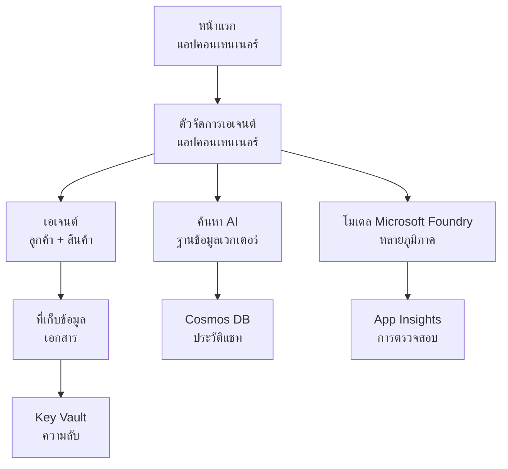

# แบบจำลองโครงสร้างพื้นฐานหลายตัวแทนสำหรับค้าปลีก

**บทที่ 5: แพ็กเกจการปรับใช้ในระบบจริง**  
- **📚 หน้าแรกของหลักสูตร**: [AZD สำหรับผู้เริ่มต้น](../../README.md)  
- **📖 บทที่เกี่ยวข้อง**: [บทที่ 5: โซลูชัน AI หลายตัวแทน](../../README.md#-chapter-5-multi-agent-ai-solutions-advanced)  
- **📝 คู่มือสถานการณ์**: [สถาปัตยกรรมสมบูรณ์](../retail-scenario.md)  
- **🎯 การปรับใช้ด่วน**: [การปรับใช้คลิกเดียว](../../../../examples/retail-multiagent-arm-template)  

> **⚠️ แบบจำลองโครงสร้างพื้นฐานเท่านั้น**  
> เทมเพลต ARM นี้จะปรับใช้ **ทรัพยากร Azure** สำหรับระบบหลายตัวแทน  
>  
> **สิ่งที่จะถูกปรับใช้ (15-25 นาที):**  
> - ✅ บริการ Microsoft Foundry Models (gpt-4.1, gpt-4.1-mini, embeddings ใน 3 ภูมิภาค)  
> - ✅ บริการ AI Search (เปล่า พร้อมสำหรับการสร้างดัชนี)  
> - ✅ Container Apps (ภาพแทนที่ พร้อมสำหรับโค้ดของคุณ)  
> - ✅ Storage, Cosmos DB, Key Vault, Application Insights  
>  
> **สิ่งที่ไม่รวม (ต้องพัฒนาเพิ่มเติม):**  
> - ❌ โค้ดการใช้งานตัวแทน (Customer Agent, Inventory Agent)  
> - ❌ ตรรกะการกำหนดเส้นทางและ API endpoints  
> - ❌ UI แชทส่วนหน้า  
> - ❌ สคีมาและท่อข้อมูลดัชนีค้นหา  
> - ❌ **ประมาณเวลาการพัฒนา: 80-120 ชั่วโมง**  
>  
> **ใช้เทมเพลตนี้หาก:**  
> - ✅ คุณต้องการจัดเตรียมโครงสร้างพื้นฐาน Azure สำหรับโครงการหลายตัวแทน  
> - ✅ คุณวางแผนจะพัฒนาโค้ดตัวแทนแยกต่างหาก  
> - ✅ คุณต้องการโครงสร้างพื้นฐานพร้อมใช้งานในระบบจริง  
>  
> **อย่าใช้ถ้า:**  
> - ❌ คุณต้องการตัวอย่างการสาธิตหลายตัวแทนที่ใช้งานได้ทันที  
> - ❌ คุณกำลังมองหาโค้ดตัวอย่างแอปพลิเคชันสมบูรณ์  

## ภาพรวม

ไดเรกทอรีนี้มีเทมเพลต Azure Resource Manager (ARM) ครบถ้วนสำหรับปรับใช้ **โครงสร้างพื้นฐานพื้นฐาน** ของระบบสนับสนุนลูกค้าหลายตัวแทน เทมเพลตนี้จะจัดเตรียมบริการ Azure ทั้งหมดที่จำเป็น กำหนดค่าที่ถูกต้องและเชื่อมโยงกัน พร้อมสำหรับการพัฒนาแอปพลิเคชันของคุณ

**หลังจากปรับใช้ คุณจะมี:** โครงสร้างพื้นฐาน Azure พร้อมใช้งานในระบบจริง  
**เพื่อทำระบบให้สมบูรณ์ คุณต้องมี:** โค้ดตัวแทน, UI ส่วนหน้า และการกำหนดค่าข้อมูล (ดู [คู่มือสถาปัตยกรรม](../retail-scenario.md))  

## 🎯 สิ่งที่จะถูกปรับใช้

### โครงสร้างพื้นฐานหลัก (สถานะหลังการปรับใช้)

✅ **บริการ Microsoft Foundry Models** (พร้อมเรียก API)  
  - ภูมิภาคหลัก: การปรับใช้ gpt-4.1 (ความจุ 20K TPM)  
  - ภูมิภาครอง: การปรับใช้ gpt-4.1-mini (ความจุ 10K TPM)  
  - ภูมิภาคที่สาม: แบบจำลอง text embeddings (ความจุ 30K TPM)  
  - ภูมิภาคประเมิน: แบบจำลอง gpt-4.1 grader (ความจุ 15K TPM)  
  - **สถานะ:** ทำงานเต็มที่ - สามารถเรียก API ได้ทันที  

✅ **Azure AI Search** (ว่างเปล่า - พร้อมสำหรับการกำหนดค่า)  
  - เปิดใช้งานฟีเจอร์ค้นหาแบบเวกเตอร์  
  - ระดับมาตรฐาน พร้อมพาร์ติชัน 1 และรีพลิกา 1 ตัว  
  - **สถานะ:** บริการกำลังทำงาน แต่ต้องสร้างดัชนี  
  - **ต้องทำ:** สร้างดัชนีค้นหาด้วยสคีมาของคุณ  

✅ **Azure Storage Account** (ว่างเปล่า - พร้อมอัปโหลด)  
  - คอนเทนเนอร์บล็อบ: `documents`, `uploads`  
  - การตั้งค่าความปลอดภัย (HTTPS เท่านั้น, ไม่อนุญาตการเข้าถึงสาธารณะ)  
  - **สถานะ:** พร้อมรับไฟล์  
  - **ต้องทำ:** อัปโหลดข้อมูลสินค้าและเอกสารของคุณ  

⚠️ **Container Apps Environment** (ภาพแทนถูกปรับใช้)  
  - แอปตัวกำหนดเส้นทางตัวแทน (ภาพ nginx เริ่มต้น)  
  - แอปส่วนหน้า (ภาพ nginx เริ่มต้น)  
  - ตั้งค่าอัตโนมัติปรับขนาด (0-10 อินสแตนซ์)  
  - **สถานะ:** กำลังรันคอนเทนเนอร์แทนที่  
  - **ต้องทำ:** สร้างและปรับใช้แอปตัวแทนของคุณ  

✅ **Azure Cosmos DB** (ว่างเปล่า - พร้อมข้อมูล)  
  - กำหนดค่าฐานข้อมูลและคอนเทนเนอร์ล่วงหน้า  
  - ปรับแต่งให้เหมาะสมกับการทำงานแบบหน่วงต่ำ  
  - เปิดใช้งาน TTL สำหรับล้างข้อมูลอัตโนมัติ  
  - **สถานะ:** พร้อมเก็บประวัติแชท  

✅ **Azure Key Vault** (ตัวเลือก - พร้อมความลับ)  
  - เปิดใช้งาน Soft delete  
  - กำหนด RBAC สำหรับ managed identities  
  - **สถานะ:** พร้อมเก็บคีย์ API และสตริงการเชื่อมต่อ  

✅ **Application Insights** (ตัวเลือก - การตรวจสอบทำงาน)  
  - เชื่อมต่อกับ Log Analytics workspace  
  - กำหนดเมตริกและการแจ้งเตือนแบบกำหนดเอง  
  - **สถานะ:** พร้อมรับข้อมูล telemetry จากแอป  

✅ **Document Intelligence** (พร้อมเรียก API)  
  - ระดับ S0 สำหรับงานระบบจริง  
  - **สถานะ:** พร้อมประมวลผลเอกสารที่อัปโหลด  

✅ **Bing Search API** (พร้อมเรียก API)  
  - ระดับ S1 สำหรับการค้นหาแบบเรียลไทม์  
  - **สถานะ:** พร้อมรองรับการค้นหาเว็บ  

### โหมดการปรับใช้

| โหมด | ความจุ OpenAI | อินสแตนซ์ Container | ระดับการค้นหา | ความทนทานของ Storage | เหมาะสำหรับ |
|------|---------------|---------------------|---------------|-----------------------|-------------|
| **น้อยที่สุด** | 10K-20K TPM | 0-2 รีพลิกา | พื้นฐาน | LRS (ภายในพื้นที่) | การพัฒนา/ทดสอบ, เรียนรู้, พิสูจน์แนวคิด |
| **มาตรฐาน** | 30K-60K TPM | 2-5 รีพลิกา | มาตรฐาน | ZRS (โซน) | ระบบจริง, ปริมาณผู้ใช้ปานกลาง (<10K) |
| **พรีเมียม** | 80K-150K TPM | 5-10 รีพลิกา, โซนทนทาน | พรีเมียม | GRS (ภูมิภาค) | องค์กร, ปริมาณผู้ใช้สูง (>10K), SLA 99.99% |

**ผลกระทบด้านค่าใช้จ่าย:**  
- **น้อยที่สุด → มาตรฐาน:** ค่าใช้จ่ายเพิ่มประมาณ 4 เท่า ($100-370/เดือน → $420-1,450/เดือน)  
- **มาตรฐาน → พรีเมียม:** ค่าใช้จ่ายเพิ่มประมาณ 3 เท่า ($420-1,450/เดือน → $1,150-3,500/เดือน)  
- **เลือกตาม:** โหลดที่คาดการณ์, ความต้องการ SLA, งบประมาณ  

**การวางแผนความจุ:**  
- **TPM (Tokens Per Minute):** ทั้งหมดจากการปรับใช้แบบจำลอง  
- **อินสแตนซ์ Container:** ช่วงอัตโนมัติปรับขนาด (ขั้นต่ำ-สูงสุด รีพลิกา)  
- **ระดับการค้นหา:** มีผลต่อประสิทธิภาพการค้นหาและขนาดดัชนีสูงสุด  

## 📋 ความต้องการเบื้องต้น

### เครื่องมือที่ต้องใช้  
1. **Azure CLI** (เวอร์ชัน 2.50.0 ขึ้นไป)  
   ```bash
   az --version  # ตรวจสอบเวอร์ชัน
   az login      # ตรวจสอบสิทธิ์
   ```
  
2. **บัญชี Azure ที่ใช้งานจริง** พร้อมสิทธิ์ Owner หรือ Contributor  
   ```bash
   az account show  # ยืนยันการสมัครสมาชิก
   ```
  
### โควต้า Azure ที่ต้องมี  

ก่อนปรับใช้ ตรวจสอบว่าโควต้ามีเพียงพอในภูมิภาคเป้าหมายของคุณ:  

```bash
# ตรวจสอบความพร้อมใช้งานของโมเดล Microsoft Foundry ในภูมิภาคของคุณ
az cognitiveservices account list-skus \
  --kind OpenAI \
  --location eastus2

# ตรวจสอบโควต้า OpenAI (ตัวอย่างสำหรับ gpt-4.1)
az cognitiveservices usage list \
  --location eastus2 \
  --query "[?name.value=='OpenAI.Standard.gpt-4.1']"

# ตรวจสอบโควต้าของ Container Apps
az provider show \
  --namespace Microsoft.App \
  --query "resourceTypes[?resourceType=='managedEnvironments'].locations"
```
  
**โควต้าขั้นต่ำที่ต้องการ:**  
- **Microsoft Foundry Models:** 3-4 การปรับใช้แบบจำลองในภูมิภาคต่าง ๆ  
  - gpt-4.1: 20K TPM (Tokens Per Minute)  
  - gpt-4.1-mini: 10K TPM  
  - text-embedding-ada-002: 30K TPM  
  - **หมายเหตุ:** gpt-4.1 อาจมีรายการรอในบางภูมิภาค — ตรวจสอบ [สถานะแบบจำลอง](https://learn.microsoft.com/azure/ai-services/openai/concepts/models)  
- **Container Apps:** สภาพแวดล้อมที่จัดการ + 2-10 อินสแตนซ์คอนเทนเนอร์  
- **AI Search:** ระดับมาตรฐาน (ระดับพื้นฐานไม่เพียงพอสำหรับการค้นหาแบบเวกเตอร์)  
- **Cosmos DB:** ความเร็วผ่านมาตรฐานที่จัดเตรียมไว้  

**ถ้าโควต้าไม่เพียงพอ:**  
1. ไปที่ Azure Portal → Quotas → ขอเพิ่มโควต้า  
2. หรือใช้ Azure CLI:  
   ```bash
   az support tickets create \
     --ticket-name "OpenAI-Quota-Increase" \
     --severity "minimal" \
     --description "Request quota increase for Microsoft Foundry Models gpt-4.1 in eastus2"
   ```
3. พิจารณาใช้ภูมิภาคอื่นที่พร้อมใช้งาน  

## 🚀 การปรับใช้ด่วน

### ตัวเลือกที่ 1: ใช้ Azure CLI  

```bash
# โคลนหรือลงไฟล์เทมเพลต
git clone <repository-url>
cd examples/retail-multiagent-arm-template

# ทำให้สคริปต์การติดตั้งสามารถเรียกใช้งานได้
chmod +x deploy.sh

# ติดตั้งด้วยการตั้งค่าเริ่มต้น
./deploy.sh -g myResourceGroup

# ติดตั้งสำหรับการผลิตพร้อมคุณสมบัติเพิ่มเติมแบบพรีเมียม
./deploy.sh -g myProdRG -e prod -m premium -l eastus2
```
  
### ตัวเลือกที่ 2: ใช้ Azure Portal  

[](https://portal.azure.com/#create/Microsoft.Template/uri/https%3A%2F%2Fraw.githubusercontent.com%2Fmicrosoft%2Fazd-for-beginners%2Fmain%2Fexamples%2Fretail-multiagent-arm-template%2Fazuredeploy.json)  

### ตัวเลือกที่ 3: ใช้ Azure CLI โดยตรง  

```bash
# สร้างกลุ่มทรัพยากร
az group create --name myResourceGroup --location eastus2

# ปรับใช้แม่แบบ
az deployment group create \
  --resource-group myResourceGroup \
  --template-file azuredeploy.json \
  --parameters azuredeploy.parameters.json
```
  
## ⏱️ กำหนดเวลาการปรับใช้  

### สิ่งที่คาดว่าจะเกิดขึ้น

| ขั้นตอน | ระยะเวลา | สิ่งที่เกิดขึ้น |
|---------|----------|-----------------||
| **การตรวจสอบเทมเพลต** | 30-60 วินาที | Azure ตรวจสอบไวยากรณ์และพารามิเตอร์ ARM เทมเพลต |
| **การตั้งค่ากลุ่มทรัพยากร** | 10-20 วินาที | สร้างกลุ่มทรัพยากร (ถ้ายังไม่มี) |
| **การจัดสรร OpenAI** | 5-8 นาที | สร้างบัญชี OpenAI 3-4 บัญชี และปรับใช้แบบจำลอง |
| **Container Apps** | 3-5 นาที | สร้างสภาพแวดล้อมและปรับใช้คอนเทนเนอร์แทนที่ |
| **Search & Storage** | 2-4 นาที | จัดเตรียมบริการ AI Search และบัญชีเก็บข้อมูล |
| **Cosmos DB** | 2-3 นาที | สร้างฐานข้อมูลและตั้งค่าคอนเทนเนอร์ |
| **การตั้งค่าการตรวจสอบ** | 2-3 นาที | ติดตั้ง Application Insights และ Log Analytics |
| **การกำหนดค่า RBAC** | 1-2 นาที | กำหนด managed identities และสิทธิ์การเข้าถึง |
| **รวมเวลาการปรับใช้** | **15-25 นาที** | โครงสร้างพื้นฐานสมบูรณ์พร้อมใช้งาน |

**หลังปรับใช้:**  
- ✅ **โครงสร้างพื้นฐานพร้อมใช้งาน:** บริการ Azure ทั้งหมดถูกปรับใช้และกำลังทำงาน  
- ⏱️ **การพัฒนาแอปพลิเคชัน:** 80-120 ชั่วโมง (ความรับผิดชอบของคุณ)  
- ⏱️ **การกำหนดค่าอินเด็กซ์:** 15-30 นาที (ต้องใช้สคีมของคุณ)  
- ⏱️ **การอัปโหลดข้อมูล:** แตกต่างตามขนาดชุดข้อมูล  
- ⏱️ **การทดสอบและตรวจสอบ:** 2-4 ชั่วโมง  

---

## ✅ ตรวจสอบความสำเร็จของการปรับใช้  

### ขั้นตอนที่ 1: ตรวจสอบการจัดเตรียมทรัพยากร (2 นาที)  

```bash
# ตรวจสอบว่าแหล่งข้อมูลทั้งหมดถูกปรับใช้เรียบร้อยแล้ว
az resource list \
  --resource-group myResourceGroup \
  --query "[?provisioningState!='Succeeded'].{Name:name, Status:provisioningState, Type:type}" \
  --output table
```
  
**ที่คาดหวัง:** ตารางว่าง (ทรัพยากรทั้งหมดแสดงสถานะ "Succeeded")  

### ขั้นตอนที่ 2: ตรวจสอบการปรับใช้ Microsoft Foundry Models (3 นาที)  

```bash
# แสดงรายชื่อบัญชี OpenAI ทั้งหมด
az cognitiveservices account list \
  --resource-group myResourceGroup \
  --query "[?kind=='OpenAI'].{Name:name, Location:location, Status:properties.provisioningState}" \
  --output table

# ตรวจสอบการปรับใช้โมเดลสำหรับภูมิภาคหลัก
OPENAI_NAME=$(az cognitiveservices account list \
  --resource-group myResourceGroup \
  --query "[?kind=='OpenAI'] | [0].name" -o tsv)

az cognitiveservices account deployment list \
  --name $OPENAI_NAME \
  --resource-group myResourceGroup \
  --output table
```
  
**ที่คาดหวัง:**  
- 3-4 บัญชี OpenAI (ภูมิภาคหลัก รอง ที่สาม และประเมิน)  
- 1-2 แบบจำลองต่อบัญชี (gpt-4.1, gpt-4.1-mini, text-embedding-ada-002)  

### ขั้นตอนที่ 3: ทดสอบ endpoints โครงสร้างพื้นฐาน (5 นาที)  

```bash
# รับ URL ของ Container App
az containerapp list \
  --resource-group myResourceGroup \
  --query "[].{Name:name, URL:properties.configuration.ingress.fqdn, Status:properties.runningStatus}" \
  --output table

# ทดสอบจุดเชื่อมต่อเราเตอร์ (จะตอบกลับด้วยภาพตัวอย่าง)
ROUTER_URL=$(az containerapp show \
  --name retail-router \
  --resource-group myResourceGroup \
  --query "properties.configuration.ingress.fqdn" -o tsv)

echo "Testing: https://$ROUTER_URL"
curl -I https://$ROUTER_URL || echo "Container running (placeholder image - expected)"
```
  
**ที่คาดหวัง:**  
- Container Apps แสดงสถานะ "Running"  
- nginx แทนที่ตอบกลับ HTTP 200 หรือ 404 (ยังไม่มีโค้ดแอปจริง)  

### ขั้นตอนที่ 4: ตรวจสอบการเข้าถึง API Microsoft Foundry Models (3 นาที)  

```bash
# รับข้อมูล endpoint และ key ของ OpenAI
OPENAI_ENDPOINT=$(az cognitiveservices account show \
  --name $OPENAI_NAME \
  --resource-group myResourceGroup \
  --query "properties.endpoint" -o tsv)

OPENAI_KEY=$(az cognitiveservices account keys list \
  --name $OPENAI_NAME \
  --resource-group myResourceGroup \
  --query "key1" -o tsv)

# ทดสอบการใช้งานการปรับใช้ gpt-4.1
curl "${OPENAI_ENDPOINT}openai/deployments/gpt-4.1/chat/completions?api-version=2024-08-01-preview" \
  -H "Content-Type: application/json" \
  -H "api-key: $OPENAI_KEY" \
  -d '{
    "messages": [{"role": "user", "content": "Say hello"}],
    "max_tokens": 10
  }'
```
  
**ที่คาดหวัง:** การตอบสนอง JSON พร้อมการเติมเต็มการสนทนา (ยืนยันว่า OpenAI ใช้งานได้)  

### สิ่งที่ทำงานกับสิ่งที่ยังไม่ทำงาน  

**✅ ทำงานหลังปรับใช้:**  
- แบบจำลอง Microsoft Foundry Models ถูกปรับใช้และรับคำสั่ง API  
- บริการ AI Search ทำงาน (ว่างเปล่า ยังไม่มีดัชนี)  
- Container Apps ทำงาน (ภาพ nginx แทนที่)  
- บัญชี Storage เข้าถึงและพร้อมอัปโหลด  
- Cosmos DB พร้อมสำหรับการเก็บข้อมูล  
- Application Insights รวบรวม telemetry โครงสร้างพื้นฐาน  
- Key Vault พร้อมเก็บความลับ  

**❌ ยังไม่ทำงาน (ต้องพัฒนา):**  
- จุดเชื่อมต่อของ agent (ยังไม่มีโค้ดแอปพลิเคชันปรับใช้)  
- ฟังก์ชันแชท (ต้อง frontend + backend เพิ่มเติม)  
- คำค้นหา (ยังไม่มีการสร้างดัชนี)  
- ระบบประมวลผลเอกสาร (ยังไม่มีข้อมูลอัปโหลด)  
- Telemetry แบบกำหนดเอง (ต้องติดตั้งเครื่องมือแอป)  

**ขั้นตอนถัดไป:** ดู [การกำหนดค่าหลังการปรับใช้](../../../../examples/retail-multiagent-arm-template) เพื่อพัฒนาและปรับใช้แอปของคุณ  

---

## ⚙️ ตัวเลือกการกำหนดค่า  

### พารามิเตอร์เทมเพลต  

| พารามิเตอร์ | ประเภท | เริ่มต้น | คำอธิบาย |
|--------------|---------|---------|-----------|
| `projectName` | string  | "retail" | คำนำหน้าชื่อทรัพยากรทั้งหมด |
| `location` | string | ตำแหน่งกลุ่มทรัพยากร | ภูมิภาคหลักสำหรับการปรับใช้ |
| `secondaryLocation` | string | "westus2" | ภูมิภาครองสำหรับการปรับใช้หลายภูมิภาค |
| `tertiaryLocation` | string | "francecentral" | ภูมิภาคสำหรับแบบจำลอง embeddings |
| `environmentName` | string | "dev" | ชื่อสภาพแวดล้อม (dev/staging/prod) |
| `deploymentMode` | string | "standard" | การกำหนดค่าการปรับใช้ (minimal/standard/premium) |
| `enableMultiRegion` | bool | true | เปิดใช้งานการปรับใช้หลายภูมิภาค |
| `enableMonitoring` | bool | true | เปิดใช้งาน Application Insights และการบันทึกล็อก |
| `enableSecurity` | bool | true | เปิดใช้งาน Key Vault และความปลอดภัยเสริม |

### การปรับแต่งพารามิเตอร์  

แก้ไขไฟล์ `azuredeploy.parameters.json`:  

```json
{
  "$schema": "https://schema.management.azure.com/schemas/2019-04-01/deploymentParameters.json#",
  "contentVersion": "1.0.0.0",
  "parameters": {
    "projectName": {
      "value": "mycompany"
    },
    "environmentName": {
      "value": "prod"
    },
    "deploymentMode": {
      "value": "premium"
    },
    "location": {
      "value": "eastus2"
    }
  }
}
```
  
## 🏗️ ภาพรวมสถาปัตยกรรม  


## 📖 การใช้งานสคริปต์ปรับใช้  

สคริปต์ `deploy.sh` ให้ประสบการณ์การปรับใช้อย่างโต้ตอบ:  

```bash
# แสดงความช่วยเหลือ
./deploy.sh --help

# การปรับใช้พื้นฐาน
./deploy.sh -g myResourceGroup

# การปรับใช้ขั้นสูงพร้อมการตั้งค่าที่กำหนดเอง
./deploy.sh \
  -g myProductionRG \
  -p companyname \
  -e prod \
  -m premium \
  -l eastus2

# การปรับใช้สำหรับการพัฒนาโดยไม่ใช้หลายภูมิภาค
./deploy.sh \
  -g myDevRG \
  -e dev \
  -m minimal \
  --no-multi-region \
  --no-security
```
  
### คุณสมบัติของสคริปต์  

- ✅ **การตรวจสอบความพร้อมใช้งาน** (Azure CLI, สถานะล็อกอิน, ไฟล์เทมเพลต)  
- ✅ **การจัดการกลุ่มทรัพยากร** (สร้างถ้ายังไม่มี)  
- ✅ **การตรวจสอบเทมเพลต** ก่อนปรับใช้  
- ✅ **การติดตามความคืบหน้า** พร้อมแสดงสี  
- ✅ **แสดงผลลัพธ์การปรับใช้**  
- ✅ **คำแนะนำหลังการปรับใช้**  

## 📊 การตรวจสอบการปรับใช้  

### ตรวจสอบสถานะการปรับใช้  

```bash
# แสดงรายการการปรับใช้
az deployment group list --resource-group myResourceGroup --output table

# ดึงรายละเอียดการปรับใช้
az deployment group show \
  --resource-group myResourceGroup \
  --name retail-deployment-YYYYMMDD-HHMMSS

# ติดตามความคืบหน้าการปรับใช้
az deployment group create \
  --resource-group myResourceGroup \
  --template-file azuredeploy.json \
  --parameters azuredeploy.parameters.json \
  --verbose
```
  
### ผลลัพธ์การปรับใช้  

หลังจากการปรับใช้สำเร็จ มีผลลัพธ์ดังนี้:  

- **Frontend URL:** จุดเชื่อมต่อสาธารณะสำหรับอินเทอร์เฟซเว็บ  
- **Router URL:** API endpoint สำหรับตัวกำหนดเส้นทางตัวแทน  
- **OpenAI Endpoints:** จุดเชื่อมต่อบริการ OpenAI หลักและรอง  
- **Search Service:** จุดเชื่อมต่อบริการ Azure AI Search  
- **Storage Account:** ชื่อบัญชีเก็บข้อมูลสำหรับเอกสาร  
- **Key Vault:** ชื่อ Key Vault (ถ้าเปิดใช้งาน)  
- **Application Insights:** ชื่อบริการตรวจสอบ (ถ้าเปิดใช้งาน)  

## 🔧 หลังการปรับใช้: ขั้นตอนต่อไป  
> **📝 สำคัญ:** โครงสร้างพื้นฐานถูกปรับใช้แล้ว แต่คุณต้องพัฒนาและปรับใช้โค้ดแอปพลิเคชัน

### ขั้นตอนที่ 1: พัฒนาแอปพลิเคชันตัวแทน (ความรับผิดชอบของคุณ)

เทมเพลต ARM สร้าง **Container Apps ว่างเปล่า** พร้อมด้วยภาพ nginx แทนที่ คุณต้อง:

**การพัฒนาที่จำเป็น:**
1. **การใช้งานตัวแทน** (30-40 ชั่วโมง)
   - ตัวแทนบริการลูกค้าพร้อมการรวม gpt-4.1
   - ตัวแทนนับสินค้าพร้อมการรวม gpt-4.1-mini
   - ตรรกะการกำหนดเส้นทางตัวแทน

2. **การพัฒนาด้านหน้า** (20-30 ชั่วโมง)
   - UI ส่วนต่อประสานการแชท (React/Vue/Angular)
   - ฟังก์ชันการอัปโหลดไฟล์
   - การแสดงและจัดรูปแบบการตอบกลับ

3. **บริการด้านหลัง** (12-16 ชั่วโมง)
   - FastAPI หรือ Express router
   - มิดเดิลแวร์การตรวจสอบสิทธิ์
   - การรวมเทเลเมทรี

**ดู:** [Architecture Guide](../retail-scenario.md) สำหรับแพตเทิร์นการดำเนินการและตัวอย่างโค้ดโดยละเอียด

### ขั้นตอนที่ 2: กำหนดค่าดัชนีการค้นหา AI (15-30 นาที)

สร้างดัชนีการค้นหาที่ตรงกับโมเดลข้อมูลของคุณ:

```bash
# รับรายละเอียดบริการค้นหา
SEARCH_NAME=$(az search service list \
  --resource-group myResourceGroup \
  --query "[0].name" -o tsv)

SEARCH_KEY=$(az search admin-key show \
  --service-name $SEARCH_NAME \
  --resource-group myResourceGroup \
  --query "primaryKey" -o tsv)

# สร้างดัชนีด้วยโครงสร้างข้อมูลของคุณ (ตัวอย่าง)
curl -X POST "https://${SEARCH_NAME}.search.windows.net/indexes?api-version=2023-11-01" \
  -H "Content-Type: application/json" \
  -H "api-key: ${SEARCH_KEY}" \
  -d '{
    "name": "products",
    "fields": [
      {"name": "id", "type": "Edm.String", "key": true},
      {"name": "title", "type": "Edm.String", "searchable": true},
      {"name": "content", "type": "Edm.String", "searchable": true},
      {"name": "category", "type": "Edm.String", "filterable": true},
      {"name": "content_vector", "type": "Collection(Edm.Single)", 
       "searchable": true, "dimensions": 1536, "vectorSearchProfile": "default"}
    ],
    "vectorSearch": {
      "algorithms": [{"name": "default", "kind": "hnsw"}],
      "profiles": [{"name": "default", "algorithm": "default"}]
    }
  }'
```

**แหล่งข้อมูล:**
- [AI Search Index Schema Design](https://learn.microsoft.com/azure/search/search-what-is-an-index)
- [Vector Search Configuration](https://learn.microsoft.com/azure/search/vector-search-how-to-create-index)

### ขั้นตอนที่ 3: อัปโหลดข้อมูลของคุณ (เวลาขึ้นอยู่กับปริมาณ)

เมื่อคุณมีข้อมูลผลิตภัณฑ์และเอกสาร:

```bash
# รับรายละเอียดบัญชีจัดเก็บข้อมูล
STORAGE_NAME=$(az storage account list \
  --resource-group myResourceGroup \
  --query "[0].name" -o tsv)

STORAGE_KEY=$(az storage account keys list \
  --account-name $STORAGE_NAME \
  --resource-group myResourceGroup \
  --query "[0].value" -o tsv)

# อัปโหลดเอกสารของคุณ
az storage blob upload-batch \
  --destination documents \
  --source /path/to/your/product/docs \
  --account-name $STORAGE_NAME \
  --account-key $STORAGE_KEY

# ตัวอย่าง: อัปโหลดไฟล์เดียว
az storage blob upload \
  --container-name documents \
  --name "product-manual.pdf" \
  --file /path/to/product-manual.pdf \
  --account-name $STORAGE_NAME \
  --account-key $STORAGE_KEY
```

### ขั้นตอนที่ 4: สร้างและปรับใช้แอปพลิเคชันของคุณ (8-12 ชั่วโมง)

เมื่อคุณพัฒนาโค้ดตัวแทนเสร็จแล้ว:

```bash
# 1. สร้าง Azure Container Registry (ถ้าจำเป็น)
az acr create \
  --name myregistry \
  --resource-group myResourceGroup \
  --sku Basic

# 2. สร้างและส่งภาพเอเจนต์เราท์เตอร์
docker build -t myregistry.azurecr.io/agent-router:v1 /path/to/your/router/code
az acr login --name myregistry
docker push myregistry.azurecr.io/agent-router:v1

# 3. สร้างและส่งภาพส่วนหน้า
docker build -t myregistry.azurecr.io/frontend:v1 /path/to/your/frontend/code
docker push myregistry.azurecr.io/frontend:v1

# 4. อัปเดต Container Apps ด้วยภาพของคุณ
az containerapp update \
  --name retail-router \
  --resource-group myResourceGroup \
  --image myregistry.azurecr.io/agent-router:v1

az containerapp update \
  --name retail-frontend \
  --resource-group myResourceGroup \
  --image myregistry.azurecr.io/frontend:v1

# 5. กำหนดตัวแปรสภาพแวดล้อม
az containerapp update \
  --name retail-router \
  --resource-group myResourceGroup \
  --set-env-vars \
    OPENAI_ENDPOINT=secretref:openai-endpoint \
    OPENAI_KEY=secretref:openai-key \
    SEARCH_ENDPOINT=secretref:search-endpoint \
    SEARCH_KEY=secretref:search-key
```

### ขั้นตอนที่ 5: ทดสอบแอปพลิเคชันของคุณ (2-4 ชั่วโมง)

```bash
# รับ URL ของแอปพลิเคชันของคุณ
ROUTER_URL=$(az containerapp show \
  --name retail-router \
  --resource-group myResourceGroup \
  --query "properties.configuration.ingress.fqdn" -o tsv)

# ทดสอบปลายทางเอเย่นต์ (เมื่อโค้ดของคุณถูกติดตั้งแล้ว)
curl -X POST "https://${ROUTER_URL}/chat" \
  -H "Content-Type: application/json" \
  -d '{
    "message": "Hello, I need help with my order",
    "agent": "customer"
  }'

# ตรวจสอบบันทึกแอปพลิเคชัน
az containerapp logs show \
  --name retail-router \
  --resource-group myResourceGroup \
  --follow
```

### แหล่งข้อมูลการใช้งาน

**สถาปัตยกรรม & การออกแบบ:**
- 📖 [Complete Architecture Guide](../retail-scenario.md) - แพตเทิร์นการดำเนินการอย่างละเอียด
- 📖 [Multi-Agent Design Patterns](https://learn.microsoft.com/azure/architecture/ai-ml/guide/multi-agent-systems)

**ตัวอย่างโค้ด:**
- 🔗 [Microsoft Foundry Models Chat Sample](https://github.com/Azure-Samples/azure-search-openai-demo) - แพตเทิร์น RAG
- 🔗 [Semantic Kernel](https://github.com/microsoft/semantic-kernel) - เฟรมเวิร์กตัวแทน (C#)
- 🔗 [LangChain Azure](https://github.com/langchain-ai/langchain) - การประสานงานตัวแทน (Python)
- 🔗 [AutoGen](https://github.com/microsoft/autogen) - การสนทนาแบบหลายตัวแทน

**ประมาณการรวมความพยายาม:**
- การปรับใช้โครงสร้างพื้นฐาน: 15-25 นาที (✅ เสร็จสมบูรณ์)
- การพัฒนาแอปพลิเคชัน: 80-120 ชั่วโมง (🔨 งานของคุณ)
- การทดสอบและปรับแต่ง: 15-25 ชั่วโมง (🔨 งานของคุณ)

## 🛠️ การแก้ไขปัญหา

### ปัญหาทั่วไป

#### 1. ควอต้าของ Microsoft Foundry Models เกิน

```bash
# ตรวจสอบการใช้งานโควตาปัจจุบัน
az cognitiveservices usage list --location eastus2

# ขอเพิ่มโควต้า
az support tickets create \
  --ticket-name "OpenAI-Quota-Increase" \
  --severity "minimal" \
  --description "Request quota increase for Microsoft Foundry Models in region X"
```

#### 2. การปรับใช้ Container Apps ล้มเหลว

```bash
# ตรวจสอบบันทึกแอปคอนเทนเนอร์
az containerapp logs show \
  --name retail-router \
  --resource-group myResourceGroup \
  --follow

# รีสตาร์ทแอปคอนเทนเนอร์
az containerapp revision restart \
  --name retail-router \
  --resource-group myResourceGroup
```

#### 3. การเริ่มต้นบริการค้นหา

```bash
# ตรวจสอบสถานะบริการค้นหา
az search service show \
  --name <search-service-name> \
  --resource-group myResourceGroup

# ทดสอบการเชื่อมต่อบริการค้นหา
curl -X GET "https://<search-service-name>.search.windows.net/indexes?api-version=2023-11-01" \
  -H "api-key: <search-admin-key>"
```

### การตรวจสอบการปรับใช้

```bash
# ตรวจสอบให้แน่ใจว่าทรัพยากรทั้งหมดถูกสร้างขึ้น
az resource list \
  --resource-group myResourceGroup \
  --output table

# ตรวจสอบสุขภาพของทรัพยากร
az resource list \
  --resource-group myResourceGroup \
  --query "[?provisioningState!='Succeeded'].{Name:name, Status:provisioningState, Type:type}" \
  --output table
```

## 🔐 การพิจารณาด้านความปลอดภัย

### การจัดการคีย์
- ความลับทั้งหมดถูกเก็บใน Azure Key Vault (เมื่อเปิดใช้งาน)
- แอปพลิเคชันคอนเทนเนอร์ใช้ managed identity สำหรับการตรวจสอบสิทธิ์
- บัญชีเก็บข้อมูลมีค่าเริ่มต้นที่ปลอดภัย (HTTPS เท่านั้น ไม่มีการเข้าถึง blob สาธารณะ)

### ความปลอดภัยของเครือข่าย
- แอปพลิเคชันคอนเทนเนอร์ใช้เครือข่ายภายในตามที่เป็นไปได้
- บริการค้นหากำหนดค่าพร้อมตัวเลือกส่วนปลายทางแบบส่วนตัว
- Cosmos DB กำหนดค่าด้วยสิทธิ์ขั้นต่ำที่จำเป็น

### การกำหนดค่า RBAC
```bash
# กำหนดบทบาทที่จำเป็นสำหรับตัวตนที่จัดการ
az role assignment create \
  --assignee <container-app-managed-identity> \
  --role "Cognitive Services OpenAI User" \
  --scope <openai-resource-id>
```

## 💰 การเพิ่มประสิทธิภาพค่าใช้จ่าย

### การประมาณค่าใช้จ่าย (รายเดือน, USD)

| โหมด | OpenAI | Container Apps | Search | Storage | รวมโดยประมาณ |
|------|--------|----------------|--------|---------|------------|
| ขั้นต่ำ | $50-200 | $20-50 | $25-100 | $5-20 | $100-370 |
| มาตรฐาน | $200-800 | $100-300 | $100-300 | $20-50 | $420-1450 |
| พรีเมียม | $500-2000 | $300-800 | $300-600 | $50-100 | $1150-3500 |

### การติดตามค่าใช้จ่าย

```bash
# ตั้งค่าการแจ้งเตือนงบประมาณ
az consumption budget create \
  --account-name <subscription-id> \
  --budget-name "retail-budget" \
  --amount 500 \
  --time-grain Monthly \
  --start-date 2024-01-01 \
  --end-date 2024-12-31
```

## 🔄 การอัปเดตและบำรุงรักษา

### การอัปเดตเทมเพลต
- ควบคุมเวอร์ชันของไฟล์เทมเพลต ARM
- ทดสอบการเปลี่ยนแปลงในสภาพแวดล้อมการพัฒนาก่อน
- ใช้โหมดการปรับใช้อย่างเพิ่มเติมเพื่อการอัปเดต

### การอัปเดตทรัพยากร
```bash
# อัปเดตด้วยพารามิเตอร์ใหม่
az deployment group create \
  --resource-group myResourceGroup \
  --template-file azuredeploy.json \
  --parameters azuredeploy.parameters.json \
  --mode Incremental
```

### การสำรองข้อมูลและกู้คืน
- เปิดใช้งานการสำรองข้อมูลอัตโนมัติของ Cosmos DB
- เปิดใช้งานการลบแบบซอฟต์ของ Key Vault
- เก็บทบทวนแอปคอนเทนเนอร์เพื่อย้อนกลับ

## 📞 การสนับสนุน

- **ปัญหาเกี่ยวกับเทมเพลต:** [GitHub Issues](https://github.com/microsoft/azd-for-beginners/issues)
- **สนับสนุน Azure:** [Azure Support Portal](https://portal.azure.com/#blade/Microsoft_Azure_Support/HelpAndSupportBlade)
- **ชุมชน:** [Azure AI Discord](https://discord.gg/microsoft-azure)

---

**⚡ พร้อมปรับใช้โซลูชันหลายตัวแทนของคุณแล้วหรือยัง?**

เริ่มด้วย: `./deploy.sh -g myResourceGroup`

---

<!-- CO-OP TRANSLATOR DISCLAIMER START -->
**ข้อจำกัดความรับผิดชอบ**:  
เอกสารฉบับนี้ได้รับการแปลโดยใช้บริการแปลภาษาอัตโนมัติ [Co-op Translator](https://github.com/Azure/co-op-translator) แม้ว่าเราจะพยายามให้มีความถูกต้องสูงสุด แต่โปรดทราบว่าการแปลอัตโนมัติอาจมีข้อผิดพลาดหรือความคลาดเคลื่อนได้ เอกสารต้นฉบับในภาษาดั้งเดิมควรถูกพิจารณาเป็นแหล่งข้อมูลที่เชื่อถือได้ สำหรับข้อมูลที่มีความสำคัญ แนะนำให้ใช้บริการแปลโดยมืออาชีพที่เป็นมนุษย์ ทางเราจะไม่รับผิดชอบต่อความเข้าใจผิดหรือการตีความที่ผิดพลาดที่เกิดขึ้นจากการใช้การแปลฉบับนี้
<!-- CO-OP TRANSLATOR DISCLAIMER END -->