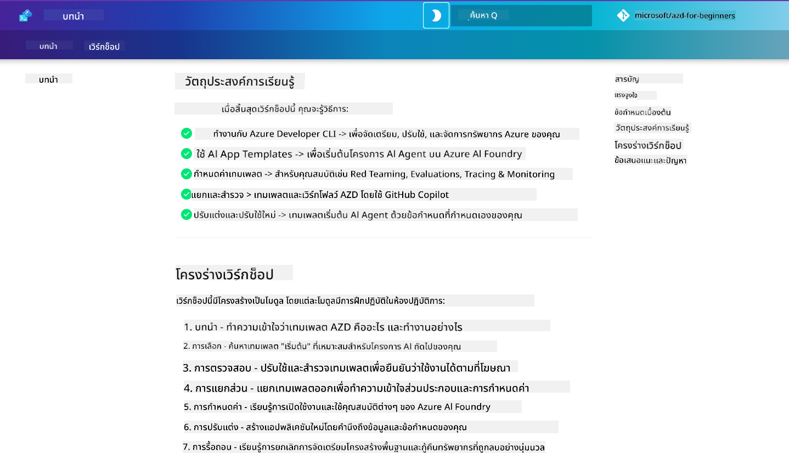

<!--
CO_OP_TRANSLATOR_METADATA:
{
  "original_hash": "9cc966416ab431c38b2ab863884b196c",
  "translation_date": "2025-09-24T21:18:15+00:00",
  "source_file": "workshop/README.md",
  "language_code": "th"
}
-->
# AZD สำหรับเวิร์กช็อปนักพัฒนา AI

ยินดีต้อนรับสู่เวิร์กช็อปแบบลงมือปฏิบัติสำหรับการเรียนรู้ Azure Developer CLI (AZD) โดยเน้นการปรับใช้แอปพลิเคชัน AI เวิร์กช็อปนี้จะช่วยให้คุณเข้าใจการใช้งานเทมเพลต AZD ใน 3 ขั้นตอน:

1. **ค้นหา** - เลือกเทมเพลตที่เหมาะกับคุณ
1. **ปรับใช้** - ปรับใช้และตรวจสอบว่าใช้งานได้
1. **ปรับแต่ง** - แก้ไขและปรับเปลี่ยนให้เหมาะกับคุณ!

ในระหว่างเวิร์กช็อปนี้ คุณจะได้เรียนรู้เครื่องมือและกระบวนการทำงานสำหรับนักพัฒนา เพื่อช่วยให้การพัฒนาของคุณตั้งแต่ต้นจนจบเป็นไปอย่างราบรื่น

<br/>

## คู่มือบนเบราว์เซอร์

บทเรียนในเวิร์กช็อปนี้อยู่ในรูปแบบ Markdown คุณสามารถเรียกดูได้โดยตรงใน GitHub หรือเปิดดูตัวอย่างบนเบราว์เซอร์ตามภาพด้านล่าง



หากต้องการใช้ตัวเลือกนี้ ให้ fork repository ไปยังโปรไฟล์ของคุณ และเปิด GitHub Codespaces เมื่อเทอร์มินัล VS Code พร้อมใช้งาน ให้พิมพ์คำสั่งนี้:

```bash title="" linenums="0"
mkdocs serve > /dev/null 2>&1 &
```

ในไม่กี่วินาที คุณจะเห็นหน้าต่างป๊อปอัป เลือกตัวเลือก `Open in browser` คู่มือบนเว็บจะเปิดในแท็บเบราว์เซอร์ใหม่ ข้อดีของตัวอย่างนี้:

1. **ค้นหาในตัว** - ค้นหาคำสำคัญหรือบทเรียนได้อย่างรวดเร็ว
1. **ไอคอนคัดลอก** - วางเมาส์เหนือบล็อกโค้ดเพื่อดูตัวเลือกนี้
1. **สลับธีม** - เปลี่ยนระหว่างธีมมืดและสว่าง
1. **ขอความช่วยเหลือ** - คลิกไอคอน Discord ในส่วนท้ายเพื่อเข้าร่วม!

<br/>

## ภาพรวมเวิร์กช็อป

**ระยะเวลา:** 3-4 ชั่วโมง  
**ระดับ:** ผู้เริ่มต้นถึงระดับกลาง  
**ข้อกำหนดเบื้องต้น:** มีความคุ้นเคยกับ Azure, แนวคิด AI, VS Code และเครื่องมือบรรทัดคำสั่ง

นี่คือเวิร์กช็อปแบบลงมือปฏิบัติที่คุณจะได้เรียนรู้ผ่านการทำงานจริง เมื่อคุณทำแบบฝึกหัดเสร็จแล้ว เราแนะนำให้ทบทวนหลักสูตร AZD สำหรับผู้เริ่มต้นเพื่อเรียนรู้เพิ่มเติมเกี่ยวกับแนวทางปฏิบัติที่ดีที่สุดด้านความปลอดภัยและประสิทธิภาพ

| เวลา | โมดูล  | วัตถุประสงค์ |
|:---|:---|:---|
| 15 นาที | [บทนำ](docs/instructions/0-Introduction.md) | ตั้งเป้าหมายและเข้าใจเป้าหมาย |
| 30 นาที | [เลือกเทมเพลต AI](docs/instructions/1-Select-AI-Template.md) | สำรวจตัวเลือกและเลือกเทมเพลตเริ่มต้น | 
| 30 นาที | [ตรวจสอบเทมเพลต AI](docs/instructions/2-Validate-AI-Template.md) | ปรับใช้โซลูชันเริ่มต้นไปยัง Azure |
| 30 นาที | [แยกโครงสร้างเทมเพลต AI](docs/instructions/3-Deconstruct-AI-Template.md) | สำรวจโครงสร้างและการตั้งค่า |
| 30 นาที | [ตั้งค่าเทมเพลต AI](docs/instructions/4-Configure-AI-Template.md) | เปิดใช้งานและทดลองใช้ฟีเจอร์ที่มีอยู่ |
| 30 นาที | [ปรับแต่งเทมเพลต AI](docs/instructions/5-Customize-AI-Template.md) | ปรับเทมเพลตให้เหมาะกับความต้องการของคุณ |
| 30 นาที | [ลบโครงสร้างพื้นฐาน](docs/instructions/6-Teardown-Infrastructure.md) | ทำความสะอาดและปล่อยทรัพยากร |
| 15 นาที | [สรุปและขั้นตอนถัดไป](docs/instructions/7-Wrap-up.md) | แหล่งข้อมูลการเรียนรู้และความท้าทายในเวิร์กช็อป |

<br/>

## สิ่งที่คุณจะได้เรียนรู้

คิดว่าเทมเพลต AZD เป็นพื้นที่ทดลองเรียนรู้เพื่อสำรวจความสามารถและเครื่องมือต่างๆ สำหรับการพัฒนาบน Azure AI Foundry ตั้งแต่ต้นจนจบ เมื่อจบเวิร์กช็อปนี้ คุณจะมีความเข้าใจที่ชัดเจนเกี่ยวกับเครื่องมือและแนวคิดต่างๆ ในบริบทนี้

| แนวคิด  | วัตถุประสงค์ |
|:---|:---|
| **Azure Developer CLI** | เข้าใจคำสั่งและกระบวนการทำงานของเครื่องมือ|
| **เทมเพลต AZD**| เข้าใจโครงสร้างและการตั้งค่าโครงการ|
| **Azure AI Agent**| จัดเตรียมและปรับใช้โครงการ Azure AI Foundry |
| **Azure AI Search**| เปิดใช้งานการออกแบบบริบทด้วยเอเจนต์ |
| **การสังเกตการณ์**| สำรวจการติดตาม การตรวจสอบ และการประเมินผล |
| **Red Teaming**| สำรวจการทดสอบเชิงรุกและการลดความเสี่ยง |

<br/>

## โครงสร้างเวิร์กช็อป

เวิร์กช็อปนี้ถูกออกแบบมาเพื่อพาคุณเดินทางจากการค้นหาเทมเพลต ไปจนถึงการปรับใช้ การแยกโครงสร้าง และการปรับแต่ง โดยใช้เทมเพลตเริ่มต้น [Getting Started with AI Agents](https://github.com/Azure-Samples/get-started-with-ai-agents) เป็นพื้นฐาน

### [โมดูล 1: เลือกเทมเพลต AI](docs/instructions/1-Select-AI-Template.md) (30 นาที)

- เทมเพลต AI คืออะไร?
- ฉันจะหาเทมเพลต AI ได้ที่ไหน?
- ฉันจะเริ่มต้นสร้าง AI Agents ได้อย่างไร?
- **Lab**: เริ่มต้นใช้งาน GitHub Codespaces

### [โมดูล 2: ตรวจสอบเทมเพลต AI](docs/instructions/2-Validate-AI-Template.md) (30 นาที)

- สถาปัตยกรรมของเทมเพลต AI คืออะไร?
- กระบวนการพัฒนา AZD คืออะไร?
- ฉันจะขอความช่วยเหลือเกี่ยวกับการพัฒนา AZD ได้อย่างไร?
- **Lab**: ปรับใช้และตรวจสอบเทมเพลต AI Agents

### [โมดูล 3: แยกโครงสร้างเทมเพลต AI](docs/instructions/3-Deconstruct-AI-Template.md) (30 นาที)

- สำรวจสภาพแวดล้อมใน `.azure/` 
- สำรวจการตั้งค่าทรัพยากรใน `infra/` 
- สำรวจการตั้งค่า AZD ใน `azure.yaml`
- **Lab**: แก้ไขตัวแปรสภาพแวดล้อมและปรับใช้ใหม่

### [โมดูล 4: ตั้งค่าเทมเพลต AI](docs/instructions/4-Configure-AI-Template.md) (30 นาที)
- สำรวจ: Retrieval Augmented Generation
- สำรวจ: การประเมินเอเจนต์และ Red Teaming
- สำรวจ: การติดตามและการตรวจสอบ
- **Lab**: สำรวจ AI Agent + การสังเกตการณ์ 

### [โมดูล 5: ปรับแต่งเทมเพลต AI](docs/instructions/5-Customize-AI-Template.md) (30 นาที)
- กำหนด: PRD ด้วยข้อกำหนดของสถานการณ์
- ตั้งค่า: ตัวแปรสภาพแวดล้อมสำหรับ AZD
- ดำเนินการ: Lifecycle Hooks สำหรับงานเพิ่มเติม
- **Lab**: ปรับแต่งเทมเพลตให้เหมาะกับสถานการณ์ของฉัน

### [โมดูล 6: ลบโครงสร้างพื้นฐาน](docs/instructions/6-Teardown-Infrastructure.md) (30 นาที)
- ทบทวน: เทมเพลต AZD คืออะไร?
- ทบทวน: ทำไมต้องใช้ Azure Developer CLI?
- ขั้นตอนถัดไป: ลองใช้เทมเพลตอื่น!
- **Lab**: ลบโครงสร้างพื้นฐานและทำความสะอาด

<br/>

## ความท้าทายในเวิร์กช็อป

อยากท้าทายตัวเองให้ทำมากขึ้น? นี่คือข้อเสนอแนะสำหรับโปรเจกต์ หรือแบ่งปันไอเดียของคุณกับเรา!!

| โปรเจกต์ | คำอธิบาย |
|:---|:---|
|1. **แยกโครงสร้างเทมเพลต AI ที่ซับซ้อน** | ใช้กระบวนการและเครื่องมือที่เราแนะนำ และลองปรับใช้ ตรวจสอบ และปรับแต่งเทมเพลตโซลูชัน AI อื่นๆ _คุณได้เรียนรู้อะไร?_|
|2. **ปรับแต่งด้วยสถานการณ์ของคุณ**  | ลองเขียน PRD (Product Requirements Document) สำหรับสถานการณ์อื่น จากนั้นใช้ GitHub Copilot ใน repo เทมเพลตของคุณใน Agent Model และขอให้มันสร้างกระบวนการปรับแต่งสำหรับคุณ _คุณได้เรียนรู้อะไร? คุณจะปรับปรุงคำแนะนำเหล่านี้ได้อย่างไร?_|
| | |

## มีความคิดเห็น?

1. โพสต์ปัญหาใน repo นี้ - ติดแท็ก `Workshop` เพื่อความสะดวก
1. เข้าร่วม Azure AI Foundry Discord - เชื่อมต่อกับเพื่อนร่วมงานของคุณ!

| | | 
|:---|:---|
| **📚 หน้าแรกของหลักสูตร**| [AZD สำหรับผู้เริ่มต้น](../README.md)|
| **📖 เอกสารประกอบ** | [เริ่มต้นกับเทมเพลต AI](https://learn.microsoft.com/en-us/azure/ai-foundry/how-to/develop/ai-template-get-started)|
| **🛠️ เทมเพลต AI** | [เทมเพลต Azure AI Foundry](https://ai.azure.com/templates) |
|**🚀 ขั้นตอนถัดไป** | [รับความท้าทาย](../../../workshop) |
| | |

<br/>

---

**ก่อนหน้า:** [คู่มือแก้ไขปัญหา AI](../docs/troubleshooting/ai-troubleshooting.md) | **ถัดไป:** เริ่มต้นด้วย [Lab 1: AZD Basics](../../../workshop/lab-1-azd-basics)

**พร้อมที่จะเริ่มสร้างแอปพลิเคชัน AI ด้วย AZD แล้วหรือยัง?**

[เริ่มต้น Lab 1: AZD Foundations →](./lab-1-azd-basics/README.md)

---

