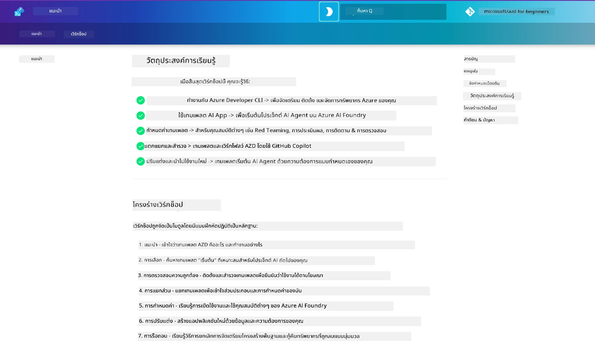

<div align="center">
  <div style="background: linear-gradient(135deg, #0078d4, #106ebe); border-radius: 10px; padding: 20px; margin: 20px 0; box-shadow: 0 4px 15px rgba(0, 120, 212, 0.3); border: 2px solid #005a9e;">
    <h2 style="color: white; margin: 0; font-size: 24px; text-shadow: 1px 1px 2px rgba(0,0,0,0.3);">
      🎯 เวิร์กช็อป AZD สำหรับนักพัฒนา AI
    </h2>
    <p style="color: white; margin: 10px 0 0 0; font-size: 16px; text-shadow: 1px 1px 2px rgba(0,0,0,0.3);">
      <strong>เวิร์กช็อปแบบลงมือทำสำหรับการสร้างแอปพลิเคชัน AI ด้วย Azure Developer CLI.</strong><br>
      ทำครบ 7 โมดูลเพื่อเก่งในเทมเพลต AZD และเวิร์กโฟลว์การปรับใช้ AI
    </p>
    <div style="margin-top: 15px;">
      <span style="background: rgba(255,255,255,0.2); padding: 5px 10px; border-radius: 15px; color: white; font-size: 14px;">
        📅 ปรับปรุงล่าสุด: มีนาคม 2026
      </span>
    </div>
  </div>
</div>

# เวิร์กช็อป AZD สำหรับนักพัฒนา AI

ยินดีต้อนรับสู่เวิร์กช็อปแบบลงมือทำสำหรับการเรียนรู้ Azure Developer CLI (AZD) โดยเน้นการปรับใช้แอปพลิเคชัน AI เวิร์กช็อปนี้จะช่วยให้คุณเข้าใจการใช้งานเทมเพลต AZD ใน 3 ขั้นตอน:

1. **ค้นหา** - ค้นหาเทมเพลตที่เหมาะสมกับคุณ
1. **ปรับใช้** - ปรับใช้และตรวจสอบว่าใช้งานได้จริง
1. **ปรับแต่ง** - แก้ไขและปรับปรุงให้เป็นของคุณเอง!

ตลอดระยะเวลาเวิร์กช็อปนี้ คุณจะได้รู้จักกับเครื่องมือและเวิร์กโฟลว์หลักของนักพัฒนา เพื่อช่วยให้คุณทำงานพัฒนาแบบครบวงจรได้อย่างราบรื่น

<br/>

## คู่มือบนเบราว์เซอร์

บทเรียนในเวิร์กช็อปเป็นแบบ Markdown คุณสามารถเข้าถึงบทเรียนเหล่านี้ได้โดยตรงบน GitHub หรือเปิดดูตัวอย่างบนเบราว์เซอร์ได้ตามภาพตัวอย่างด้านล่าง



หากต้องการใช้ตัวเลือกนี้ ให้ทำการฟอร์กโค้ดรีโพซิทอรีไปยังโปรไฟล์ของคุณ แล้วเปิดใช้งาน GitHub Codespaces เมื่อเปิดเทอร์มินัล VS Code แล้ว ให้พิมพ์คำสั่งนี้:

การดูตัวอย่างบนเบราว์เซอร์นี้ใช้งานได้ทั้งใน GitHub Codespaces, dev containers หรือโคลนในเครื่องที่ติดตั้ง Python และ MkDocs แล้ว

```bash title="" linenums="0"
mkdocs serve > /dev/null 2>&1 &
```


ในไม่กี่วินาที คุณจะเห็นหน้าต่างป๊อปอัพ ให้เลือกตัวเลือก `Open in browser` คู่มือแบบเว็บก็จะเปิดในแท็บเบราว์เซอร์ใหม่ คุณสมบัติบางอย่างของการดูตัวอย่างนี้คือ:

1. **ค้นหาในตัว** - ค้นหาคำหรือบทเรียนได้รวดเร็ว
1. **ไอคอนคัดลอก** - นำเมาส์ไปวางบนโค้ดบล็อกเพื่อเห็นตัวเลือกนี้
1. **สลับธีม** - สลับระหว่างธีมมืดและสว่าง
1. **รับความช่วยเหลือ** - คลิกไอคอน Discord ที่ส่วนท้ายเพื่อเข้าร่วม!

<br/>

## ภาพรวมเวิร์กช็อป

**ระยะเวลา:** 3-4 ชั่วโมง  
**ระดับ:** เบื้องต้น ถึง ปานกลาง  
**ความรู้พื้นฐาน:** คุ้นเคยกับ Azure, แนวคิด AI, VS Code และเครื่องมือคอมมานด์ไลน์

นี่คือเวิร์กช็อปแบบลงมือทำที่คุณเรียนรู้โดยการทำ เมื่อทำแบบฝึกหัดเสร็จแล้ว เราแนะนำให้ทบทวนหลักสูตร AZD For Beginners เพื่อเรียนรู้ต่อเนื่องเกี่ยวกับแนวปฏิบัติด้านความปลอดภัยและประสิทธิภาพการทำงานที่ดีที่สุด

| เวลา| โมดูล  | วัตถุประสงค์ |
|:---|:---|:---|
| 15 นาที | [บทนำ](docs/instructions/0-Introduction.md) | ปูพื้นฐานและทำความเข้าใจเป้าหมาย |
| 30 นาที | [เลือกเทมเพลต AI](docs/instructions/1-Select-AI-Template.md) | สำรวจตัวเลือกและเลือกจุดเริ่มต้น | 
| 30 นาที | [ตรวจสอบเทมเพลต AI](docs/instructions/2-Validate-AI-Template.md) | ปรับใช้โซลูชันเริ่มต้นไปยัง Azure |
| 30 นาที | [แยกส่วนเทมเพลต AI](docs/instructions/3-Deconstruct-AI-Template.md) | สำรวจโครงสร้างและการตั้งค่า |
| 30 นาที | [กำหนดค่าเทมเพลต AI](docs/instructions/4-Configure-AI-Template.md) | เปิดใช้งานและทดลองฟีเจอร์ที่มี |
| 30 นาที | [ปรับแต่งเทมเพลต AI](docs/instructions/5-Customize-AI-Template.md) | ปรับเทมเพลตตามความต้องการของคุณ |
| 30 นาที | [จัดเก็บโครงสร้างพื้นฐาน](docs/instructions/6-Teardown-Infrastructure.md) | ทำความสะอาดและปล่อยทรัพยากร |
| 15 นาที | [สรุป & ก้าวต่อไป](docs/instructions/7-Wrap-up.md) | แหล่งเรียนรู้และความท้าทายของเวิร์กช็อป |

<br/>

## สิ่งที่คุณจะได้เรียนรู้

ให้มองเทมเพลต AZD เป็นแซนด์บ็อกซ์สำหรับเรียนรู้เพื่อสำรวจความสามารถและเครื่องมือต่างๆ สำหรับการพัฒนาแบบครบวงจรบน Microsoft Foundry เมื่อจบเวิร์กช็อปนี้ คุณจะมีความเข้าใจสัญชาตญาณเกี่ยวกับเครื่องมือและแนวคิดต่างๆ ในบริบทนี้

| แนวคิด  | วัตถุประสงค์ |
|:---|:---|
| **Azure Developer CLI** | เข้าใจคำสั่งเครื่องมือและเวิร์กโฟลว์ |
| **AZD Templates**| เข้าใจโครงสร้างโปรเจ็กต์และการตั้งค่า |
| **Azure AI Agent**| จัดเตรียมและปรับใช้โปรเจ็กต์ Microsoft Foundry |
| **Azure AI Search**| เปิดใช้งานวิศวกรรมบริบทด้วยเอเจนต์ |
| **Observability**| สำรวจการติดตาม, การตรวจสอบ และการประเมินผล |
| **Red Teaming**| สำรวจการทดสอบเชิงปฏิบัติการและการป้องกัน |

<br/>

## โครงสร้างเวิร์กช็อป

เวิร์กช็อปนี้ถูกออกแบบให้คุณเดินทางจากการค้นหาเทมเพลตไปสู่การปรับใช้ การแยกส่วน และการปรับแต่ง โดยใช้เทมเพลตเริ่มต้นอย่างเป็นทางการ [Getting Started with AI Agents](https://github.com/Azure-Samples/get-started-with-ai-agents) เป็นฐาน

### [โมดูล 1: เลือกเทมเพลต AI](docs/instructions/1-Select-AI-Template.md) (30 นาที)

- เทมเพลต AI คืออะไร?
- จะหาเทมเพลต AI ได้จากที่ไหน?
- เริ่มต้นสร้าง AI Agents อย่างไร?
- **แลป**: เริ่มต้นใช้งานอย่างรวดเร็วใน Codespaces หรือ dev container

### [โมดูล 2: ตรวจสอบเทมเพลต AI](docs/instructions/2-Validate-AI-Template.md) (30 นาที)

- สถาปัตยกรรมเทมเพลต AI คืออะไร?
- เวิร์กโฟลว์พัฒนา AZD คืออะไร?
- วิธีขอความช่วยเหลือในการพัฒนา AZD
- **แลป**: ปรับใช้และตรวจสอบเทมเพลต AI Agents

### [โมดูล 3: แยกส่วนเทมเพลต AI](docs/instructions/3-Deconstruct-AI-Template.md) (30 นาที)

- สำรวจสภาพแวดล้อมที่ `.azure/`
- สำรวจการตั้งค่าใน `infra/`
- สำรวจการตั้งค่า AZD ในไฟล์ `azure.yaml`
- **แลป**: แก้ไข Environment Variables และปรับใช้ใหม่

### [โมดูล 4: กำหนดค่าเทมเพลต AI](docs/instructions/4-Configure-AI-Template.md) (30 นาที)
- สำรวจ: การสร้างแบบเสริม Retrieval Augmented Generation
- สำรวจ: การประเมิน Agent & Red Teaming
- สำรวจ: การติดตามและตรวจสอบ
- **แลป**: สำรวจ AI Agent + Observability

### [โมดูล 5: ปรับแต่งเทมเพลต AI](docs/instructions/5-Customize-AI-Template.md) (30 นาที)
- กำหนด: PRD กับข้อกำหนดของสถานการณ์
- กำหนดค่า: Environment Variables สำหรับ AZD
- นำไปใช้: Lifecycle Hooks สำหรับงานเพิ่มเติม
- **แลป**: ปรับแต่งเทมเพลตให้เหมาะกับสถานการณ์ของฉัน

### [โมดูล 6: จัดเก็บโครงสร้างพื้นฐาน](docs/instructions/6-Teardown-Infrastructure.md) (30 นาที)
- ทบทวน: เทมเพลต AZD คืออะไร?
- ทบทวน: ทำไมต้องใช้ Azure Developer CLI?
- ก้าวต่อไป: ลองใช้เทมเพลตอื่น!
- **แลป**: ยกเลิกการจัดสรรโครงสร้างพื้นฐานและทำความสะอาด

<br/>

## ความท้าทายของเวิร์กช็อป

ต้องการท้าทายตัวเองให้ทำมากกว่านี้หรือไม่? นี่คือข้อเสนอแนะโครงการ - หรือแชร์ไอเดียของคุณกับเรา!!

| โครงการ | คำอธิบาย |
|:---|:---|
|1. **แยกส่วนเทมเพลต AI ที่ซับซ้อน** | ใช้เวิร์กโฟลว์และเครื่องมือที่เราแนะนำและลองปรับใช้ ตรวจสอบ และปรับแต่งเทมเพลตโซลูชัน AI อื่น _คุณได้เรียนรู้อะไร?_|
|2. **ปรับแต่งตามสถานการณ์ของคุณ**  | ลองเขียน PRD (เอกสารข้อกำหนดผลิตภัณฑ์) สำหรับสถานการณ์ต่างๆ จากนั้นใช้ GitHub Copilot ในรีโพเทมเพลตของคุณในโหมด Agent Model แล้วขอให้สร้างเวิร์กโฟลว์การปรับแต่งให้ _คุณได้เรียนรู้อะไร? จะปรับปรุงคำแนะนำเหล่านี้ได้อย่างไร?_|
| | |

## มีความคิดเห็น?

1. โพสต์ปัญหาในรีโพนี้ - ติดแท็ก `Workshop` เพื่อความสะดวก
1. เข้าร่วม Discord ของ Microsoft Foundry - เชื่อมต่อกับเพื่อนร่วมงานของคุณ!

| | | 
|:---|:---|
| **📚 หน้าแรกหลักสูตร**| [AZD For Beginners](../README.md)|
| **📖 เอกสาร** | [เริ่มต้นใช้งานเทมเพลต AI](https://learn.microsoft.com/en-us/azure/ai-foundry/how-to/develop/ai-template-get-started)|
| **🛠️เทมเพลต AI** | [เทมเพลต Microsoft Foundry](https://ai.azure.com/templates) |
|**🚀 ก้าวต่อไป** | [เริ่มเวิร์กช็อป](#ภาพรวมเวิร์กช็อป) |
| | |

<br/>

---

**การนำทาง:** [หลักสูตรหลัก](../README.md) | [บทนำ](docs/instructions/0-Introduction.md) | [โมดูล 1: เลือกเทมเพลต](docs/instructions/1-Select-AI-Template.md)

**พร้อมเริ่มสร้างแอปพลิเคชัน AI ด้วย AZD หรือยัง?**

[เริ่มเวิร์กช็อป: บทนำ →](docs/instructions/0-Introduction.md)

---

<!-- CO-OP TRANSLATOR DISCLAIMER START -->
**ข้อจำกัดความรับผิดชอบ**:  
เอกสารนี้ได้รับการแปลโดยใช้บริการแปลภาษา AI [Co-op Translator](https://github.com/Azure/co-op-translator) แม้ว่าเราจะพยายามให้ความถูกต้องสูงสุด กรุณาทราบว่าการแปลอัตโนมัติอาจมีข้อผิดพลาดหรือความไม่ถูกต้อง เอกสารต้นฉบับในภาษาต้นฉบับควรถูกพิจารณาเป็นแหล่งข้อมูลที่เชื่อถือได้ สำหรับข้อมูลสำคัญ ขอแนะนำให้ใช้การแปลโดยผู้เชี่ยวชาญมนุษย์เป็นหลัก เราไม่รับผิดชอบต่อความเข้าใจผิดหรือการตีความผิดที่เกิดขึ้นจากการใช้การแปลนี้
<!-- CO-OP TRANSLATOR DISCLAIMER END -->