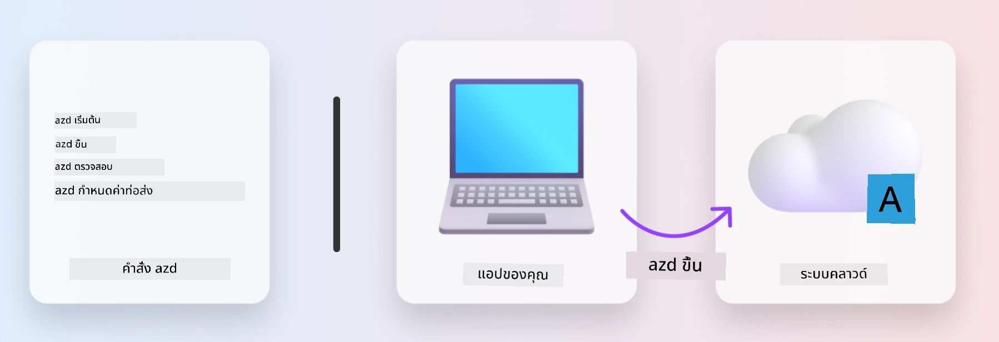
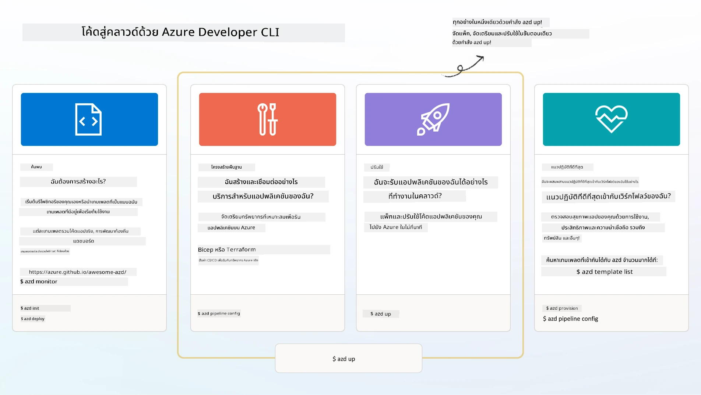

# 1. เลือกเทมเพลต

!!! tip "เมื่อสิ้นสุดโมดูลนี้ คุณจะสามารถ"

    - [ ] อธิบายว่าเทมเพลต AZD คืออะไร
    - [ ] ค้นหาและใช้เทมเพลต AZD สำหรับ AI
    - [ ] เริ่มต้นด้วยเทมเพลต AI Agents
    - [ ] **แล็บ 1:** เริ่มต้นใช้งาน AZD ใน Codespaces หรือ dev container

---

## 1. อุปมาอุปไมยของผู้สร้าง

การสร้างแอปพลิเคชัน AI สำหรับองค์กรสมัยใหม่ _ตั้งแต่เริ่มต้น_ อาจเป็นเรื่องที่ท้าทาย นั่นคล้ายกับการสร้างบ้านใหม่ของคุณเอง ทีละก้อนอิฐ ใช่ มันทำได้! แต่ไม่ใช่วิธีที่มีประสิทธิภาพที่สุดที่จะได้ผลลัพธ์ที่ต้องการ!

แทนที่จะเป็นเช่นนั้น เรามักจะเริ่มต้นด้วย _แบบแปลนการออกแบบ_ ที่มีอยู่แล้ว และทำงานร่วมกับสถาปนิกเพื่อปรับแต่งให้ตรงกับความต้องการส่วนบุคคลของเรา และนั่นคือแนวทางที่ต้องใช้เมื่อสร้างแอปพลิเคชันอัจฉริยะ ก่อนอื่น หาแบบแปลนการออกแบบที่ดีซึ่งเหมาะกับปัญหาของคุณ จากนั้นทำงานร่วมกับสถาปนิกโซลูชันเพื่อปรับแต่งและพัฒนาโซลูชันสำหรับสถานการณ์เฉพาะของคุณ

แต่เราจะหาแบบแปลนการออกแบบเหล่านี้ได้จากที่ไหน? และจะหาใครสักคนที่ยินดีสอนเราให้ปรับแต่งและปรับใช้งานแบบแปลนเหล่านี้ด้วยตนเองได้อย่างไร? ในเวิร์กช็อปนี้ เราจะตอบคำถามเหล่านั้นโดยแนะนำคุณให้รู้จักกับเทคโนโลยีสามอย่าง:

1. [Azure Developer CLI](https://aka.ms/azd) - เครื่องมือโอเพนซอร์สที่เร่งเส้นทางนักพัฒนาในการเปลี่ยนจากการพัฒนาในเครื่อง (build) ไปสู่การปรับใช้บนคลาวด์ (ship)
1. [Microsoft Foundry Templates](https://ai.azure.com/templates) - ที่เก็บโอเพนซอร์สมาตรฐานซึ่งประกอบด้วยโค้ดตัวอย่าง ไฟล์โครงสร้างพื้นฐาน และไฟล์การกำหนดค่าสำหรับปรับใช้สถาปัตยกรรมโซลูชัน AI
1. [GitHub Copilot Agent Mode](https://code.visualstudio.com/docs/copilot/chat/chat-agent-mode) - ตัวแทนโค้ดที่มีฐานความรู้ Azure ที่สามารถแนะนำเราในการนำทางฐานโค้ดและทำการเปลี่ยนแปลงได้ด้วยภาษาธรรมชาติ

ด้วยเครื่องมือเหล่านี้ในมือ เราสามารถ _ค้นหา_ เทมเพลตที่เหมาะสม, _ปรับใช้_ เพื่อยืนยันว่าใช้งานได้, และ _ปรับแต่ง_ ให้เหมาะกับสถานการณ์ของเราได้แล้ว มาเรียนรู้วิธีการทำงานของสิ่งเหล่านี้กันเถอะ

---

## 2. Azure Developer CLI

[Azure Developer CLI](https://learn.microsoft.com/en-us/azure/developer/azure-developer-cli/) (หรือ `azd`) เป็นเครื่องมือบรรทัดคำสั่งโอเพนซอร์สที่ช่วยเร่งเส้นทางการเปลี่ยนโค้ดเป็นคลาวด์ด้วยชุดคำสั่งที่เป็นมิตรกับนักพัฒนาและทำงานอย่างสม่ำเสมอทั้งใน IDE (การพัฒนา) และสภาพแวดล้อม CI/CD (devops)

ด้วย `azd` การเดินทางปรับใช้งานของคุณจะง่ายเหมือนกับ:

- `azd init` - เริ่มต้นโปรเจกต์ AI ใหม่จากเทมเพลต AZD ที่มีอยู่
- `azd up` - จัดเตรียมโครงสร้างพื้นฐานและปรับใช้แอปพลิเคชันในขั้นตอนเดียว
- `azd monitor` - รับการตรวจสอบและวินิจฉัยแบบเรียลไทม์สำหรับแอปพลิเคชันที่ปรับใช้แล้วของคุณ
- `azd pipeline config` - ตั้งค่า pipeline CI/CD เพื่อทำงานปรับใช้โดยอัตโนมัติบน Azure

**🎯 | แบบฝึกหัด**: <br/> สำรวจเครื่องมือบรรทัดคำสั่ง `azd` ในสภาพแวดล้อมเวิร์กช็อปปัจจุบันของคุณได้เลย อาจจะเป็น GitHub Codespaces, dev container หรือโคลนในเครื่องที่ติดตั้งข้อกำหนดล่วงหน้าไว้แล้ว เริ่มโดยพิมพ์คำสั่งนี้เพื่อดูว่าเครื่องมือนี้ทำอะไรได้บ้าง:

```bash title="" linenums="0"
azd help
```



---

## 3. เทมเพลต AZD

เพื่อให้ `azd` ทำงานได้ตามนี้ มันจำเป็นต้องรู้ข้อมูลว่าโครงสร้างพื้นฐานอะไรที่ต้องจัดเตรียม, การตั้งค่ากำหนดค่าอะไรที่ต้องบังคับใช้, และแอปพลิเคชันอะไรที่ต้องปรับใช้ นี่คือที่มาของ [เทมเพลต AZD](https://learn.microsoft.com/en-us/azure/developer/azure-developer-cli/azd-templates?tabs=csharp)

เทมเพลต AZD คือที่เก็บโอเพนซอร์สที่รวมโค้ดตัวอย่างกับไฟล์โครงสร้างพื้นฐานและไฟล์กำหนดค่าที่จำเป็นสำหรับการปรับใช้สถาปัตยกรรมโซลูชัน  
โดยใช้แนวทาง _Infrastructure-as-Code_ (IaC) ซึ่งอนุญาตให้มีการควบคุมเวอร์ชันทั้งการกำหนดทรัพยากรในเทมเพลตและการตั้งค่ากำหนดค่า (เช่นเดียวกับซอร์สโค้ดแอป) — จึงสร้างเวิร์กโฟลว์ที่นำกลับมาใช้ซ้ำได้และสม่ำเสมอสำหรับผู้ใช้โปรเจกต์นั้น ๆ

เมื่อสร้างหรือใช้เทมเพลต AZD สำหรับสถานการณ์ของ _คุณ_ ให้พิจารณาคำถามต่อไปนี้:

1. คุณกำลังสร้างอะไร? → มีเทมเพลตที่มีโค้ดเริ่มต้นสำหรับสถานการณ์นั้นหรือไม่?
1. โซลูชันของคุณออกแบบอย่างไร? → มีเทมเพลตที่มีทรัพยากรที่จำเป็นหรือไม่?
1. โซลูชันของคุณปรับใช้อย่างไร? → คิดถึงคำสั่ง `azd deploy` พร้อม hooks ก่อนและหลังการประมวลผล!
1. คุณจะปรับปรุงประสิทธิภาพได้อย่างไร? → คิดถึงระบบตรวจสอบในตัวและ pipeline อัตโนมัติ!

**🎯 | แบบฝึกหัด**: <br/>  
เยี่ยมชมแกลเลอรี [Awesome AZD](https://azure.github.io/awesome-azd/) และใช้ตัวกรองเพื่อสำรวจเทมเพลตกว่า 250 เทมเพลตที่มีอยู่ในปัจจุบัน ดูว่าคุณสามารถหาเทมเพลตที่ตรงกับความต้องการสถานการณ์ _ของคุณ_ ได้หรือไม่



---

## 4. เทมเพลตแอป AI

สำหรับแอปพลิเคชันที่ขับเคลื่อนด้วย AI, Microsoft มีเทมเพลตเฉพาะที่มาพร้อมกับ **Microsoft Foundry** และ **Foundry Agents** เทมเพลตเหล่านี้ช่วยเร่งเส้นทางการสร้างแอปพลิเคชันอัจฉริยะที่พร้อมใช้งานจริง

### เทมเพลต Microsoft Foundry & Foundry Agents

เลือกเทมเพลตด้านล่างเพื่อปรับใช้ เทมเพลตแต่ละแบบมีอยู่ใน [Awesome AZD](https://azure.github.io/awesome-azd/) และสามารถเริ่มต้นได้ด้วยคำสั่งเดียว

| เทมเพลต | คำอธิบาย | คำสั่งปรับใช้ |
|----------|-------------|----------------|
| **[AI Chat with RAG](https://azure.github.io/awesome-azd/?tags=ai&tags=rag)** | แอปแชทด้วย Retrieval Augmented Generation ใช้ Microsoft Foundry | `azd init -t azure-samples/azure-search-openai-demo` |
| **[Foundry Agent Service Starter](https://azure.github.io/awesome-azd/?tags=ai&tags=agents)** | สร้างเอเย่นต์ AI ด้วย Foundry Agents สำหรับการทำงานอัตโนมัติ | `azd init -t azure-samples/foundry-agent-service-starter` |
| **[Multi-Agent Orchestration](https://azure.github.io/awesome-azd/?tags=ai&tags=agents)** | ประสานงานหลายเอเย่นต์ Foundry สำหรับฟลูว์งานซับซ้อน | `azd init -t azure-samples/multi-agent-orchestration` |
| **[AI Document Intelligence](https://azure.github.io/awesome-azd/?tags=ai&tags=document)** | ดึงข้อมูลและวิเคราะห์เอกสารด้วยโมเดล Microsoft Foundry | `azd init -t azure-samples/ai-document-processing` |
| **[Conversational AI Bot](https://azure.github.io/awesome-azd/?tags=ai&tags=bot)** | สร้างแชทบอทอัจฉริยะด้วยการรวม Microsoft Foundry | `azd init -t azure-samples/ai-chat-protocol` |
| **[AI Image Generation](https://azure.github.io/awesome-azd/?tags=ai&tags=dalle)** | สร้างภาพด้วย DALL-E ผ่าน Microsoft Foundry | `azd init -t azure-samples/ai-image-generation` |
| **[Semantic Kernel Agent](https://azure.github.io/awesome-azd/?tags=ai&tags=semantic-kernel)** | เอเย่นต์ AI ใช้ Semantic Kernel ร่วมกับ Foundry Agents | `azd init -t azure-samples/semantic-kernel-agent` |
| **[AutoGen Multi-Agent](https://azure.github.io/awesome-azd/?tags=ai&tags=autogen)** | ระบบหลายเอเย่นต์โดยใช้เฟรมเวิร์ก AutoGen | `azd init -t azure-samples/autogen-multi-agent` |

### เริ่มต้นอย่างรวดเร็ว

1. **เรียกดูเทมเพลต**: เยี่ยมชม [https://azure.github.io/awesome-azd/](https://azure.github.io/awesome-azd/) และกรองตาม `AI`, `Agents`, หรือ `Microsoft Foundry`
2. **เลือกเทมเพลตของคุณ**: เลือกเทมเพลตที่ตรงกับกรณีใช้งานของคุณ
3. **เริ่มต้น**: รันคำสั่ง `azd init` สำหรับเทมเพลตที่เลือก
4. **ปรับใช้**: รัน `azd up` เพื่อจัดเตรียมและปรับใช้

**🎯 | แบบฝึกหัด**: <br/>
เลือกเทมเพลตหนึ่งจากด้านบนตามสถานการณ์ของคุณ:

- **กำลังสร้างแชทบอท?** → เริ่มด้วย **AI Chat with RAG** หรือ **Conversational AI Bot**
- **ต้องการเอเย่นต์อัตโนมัติ?** → ลอง **Foundry Agent Service Starter** หรือ **Multi-Agent Orchestration**
- **ประมวลผลเอกสาร?** → ใช้ **AI Document Intelligence**
- **ต้องการความช่วยเหลือเขียนโค้ด AI?** → สำรวจ **Semantic Kernel Agent** หรือ **AutoGen Multi-Agent**

```bash title="Example: Deploy the AI Chat with RAG template" linenums="0"
azd init -t azure-samples/azure-search-openai-demo
azd up
```

!!! info "สำรวจเทมเพลตเพิ่มเติม"
    แกลเลอรี [Awesome AZD](https://azure.github.io/awesome-azd/) มีเทมเพลตกว่า 250 รายการ ใช้ตัวกรองเพื่อค้นหาเทมเพลตที่ตรงกับความต้องการเฉพาะของคุณทั้งภาษา, เฟรมเวิร์ก และบริการของ Azure

---

<!-- CO-OP TRANSLATOR DISCLAIMER START -->
**ข้อจำกัดความรับผิดชอบ**:  
เอกสารนี้ได้รับการแปลโดยใช้บริการแปลด้วย AI [Co-op Translator](https://github.com/Azure/co-op-translator) แม้เราจะพยายามให้ความถูกต้อง โปรดทราบว่าการแปลอัตโนมัติอาจมีข้อผิดพลาดหรือความไม่ถูกต้อง เอกสารต้นฉบับในภาษาต้นทางควรถูกพิจารณาเป็นแหล่งอ้างอิงที่น่าเชื่อถือ สำหรับข้อมูลที่สำคัญ ขอแนะนำให้ใช้บริการแปลโดยมนุษย์มืออาชีพ เราไม่รับผิดชอบต่อความเข้าใจผิดหรือการตีความที่ผิดพลาดใด ๆ ที่เกิดจากการใช้การแปลนี้
<!-- CO-OP TRANSLATOR DISCLAIMER END -->