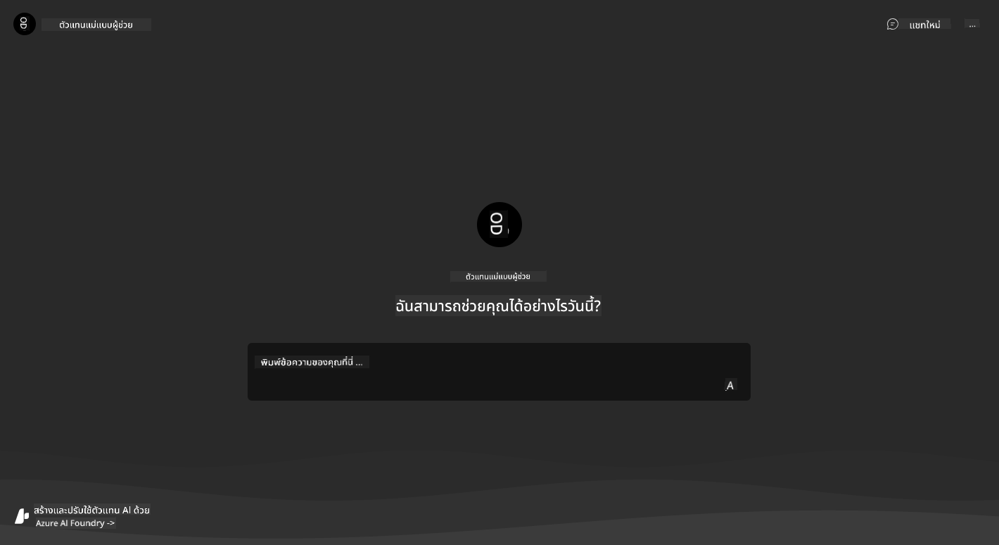
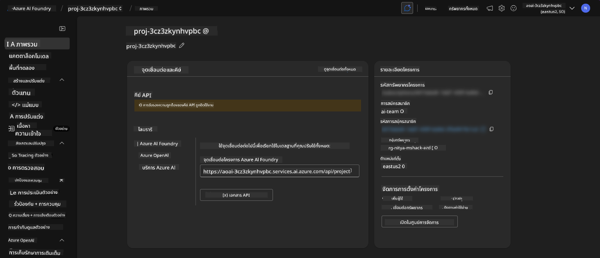
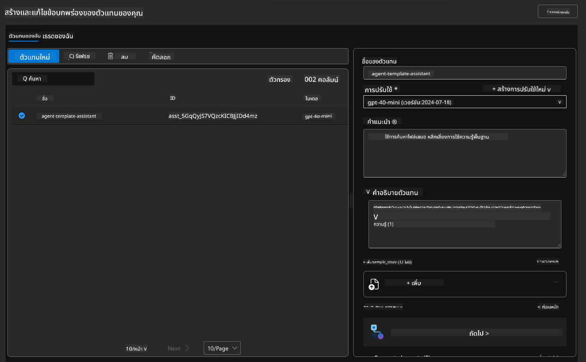
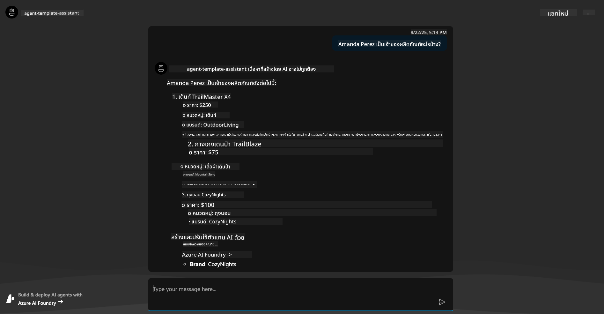
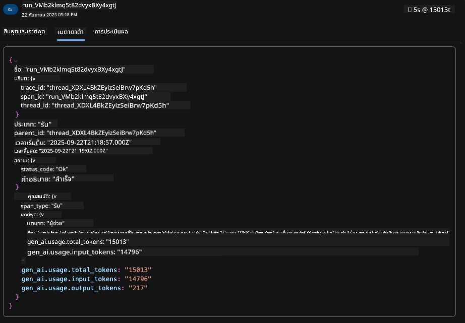
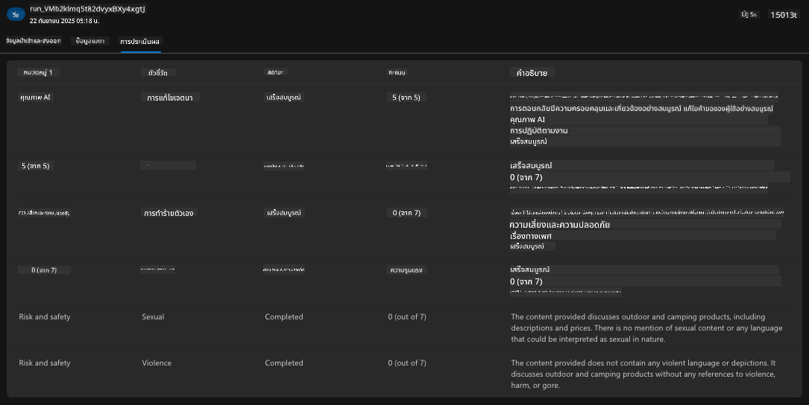

<!--
CO_OP_TRANSLATOR_METADATA:
{
  "original_hash": "7816c6ec50c694c331e7c6092371be4d",
  "translation_date": "2025-09-24T21:36:02+00:00",
  "source_file": "workshop/docs/instructions/2-Validate-AI-Template.md",
  "language_code": "th"
}
-->
# 2. ตรวจสอบความถูกต้องของเทมเพลต

!!! tip "เมื่อจบโมดูลนี้ คุณจะสามารถ"

    - [ ] วิเคราะห์สถาปัตยกรรมโซลูชัน AI
    - [ ] เข้าใจขั้นตอนการทำงานของการปรับใช้ AZD
    - [ ] ใช้ GitHub Copilot เพื่อขอความช่วยเหลือเกี่ยวกับการใช้งาน AZD
    - [ ] **Lab 2:** ปรับใช้และตรวจสอบความถูกต้องของเทมเพลต AI Agents

---

## 1. บทนำ

[Azure Developer CLI](https://learn.microsoft.com/en-us/azure/developer/azure-developer-cli/) หรือ `azd` เป็นเครื่องมือบรรทัดคำสั่งแบบโอเพ่นซอร์สที่ช่วยให้การทำงานของนักพัฒนาง่ายขึ้นเมื่อสร้างและปรับใช้แอปพลิเคชันไปยัง Azure

[AZD Templates](https://learn.microsoft.com/azure/developer/azure-developer-cli/azd-templates) เป็นที่เก็บข้อมูลมาตรฐานที่รวมโค้ดตัวอย่างของแอปพลิเคชัน, _infrastructure as code_ และไฟล์การตั้งค่าของ `azd` เพื่อสร้างสถาปัตยกรรมโซลูชันที่ครบวงจร การจัดเตรียมโครงสร้างพื้นฐานสามารถทำได้ง่ายเพียงใช้คำสั่ง `azd provision` - และการใช้ `azd up` จะช่วยให้คุณจัดเตรียมโครงสร้างพื้นฐาน **และ** ปรับใช้แอปพลิเคชันในครั้งเดียว!

ดังนั้น การเริ่มต้นกระบวนการพัฒนาแอปพลิเคชันของคุณสามารถทำได้ง่ายๆ เพียงค้นหา _AZD Starter template_ ที่เหมาะสมกับความต้องการของแอปพลิเคชันและโครงสร้างพื้นฐานของคุณ จากนั้นปรับแต่งที่เก็บข้อมูลให้เหมาะสมกับความต้องการของคุณ

ก่อนที่เราจะเริ่มต้น มาตรวจสอบให้แน่ใจว่าคุณได้ติดตั้ง Azure Developer CLI แล้ว

1. เปิดเทอร์มินัลใน VS Code และพิมพ์คำสั่งนี้:

      ```bash title="" linenums="0"
      azd version
      ```

1. คุณควรเห็นบางอย่างเช่นนี้!

      ```bash title="" linenums="0"
      azd version 1.19.0 (commit b3d68cea969b2bfbaa7b7fa289424428edb93e97)
      ```

**ตอนนี้คุณพร้อมที่จะเลือกและปรับใช้เทมเพลตด้วย azd แล้ว**

---

## 2. การเลือกเทมเพลต

แพลตฟอร์ม Azure AI Foundry มาพร้อมกับ [ชุดเทมเพลต AZD ที่แนะนำ](https://learn.microsoft.com/en-us/azure/ai-foundry/how-to/develop/ai-template-get-started) ซึ่งครอบคลุมสถานการณ์โซลูชันยอดนิยม เช่น _การทำงานอัตโนมัติของเวิร์กโฟลว์หลายตัวแทน_ และ _การประมวลผลเนื้อหาหลายรูปแบบ_ คุณยังสามารถค้นหาเทมเพลตเหล่านี้ได้โดยไปที่พอร์ทัล Azure AI Foundry

1. ไปที่ [https://ai.azure.com/templates](https://ai.azure.com/templates)
1. เข้าสู่ระบบพอร์ทัล Azure AI Foundry เมื่อได้รับการแจ้งเตือน - คุณจะเห็นบางอย่างเช่นนี้


**ตัวเลือกพื้นฐาน** คือเทมเพลตเริ่มต้นของคุณ:

1. [ ] [Get Started with AI Chat](https://github.com/Azure-Samples/get-started-with-ai-chat) ที่ปรับใช้แอปพลิเคชันแชทพื้นฐาน _พร้อมข้อมูลของคุณ_ ไปยัง Azure Container Apps ใช้สิ่งนี้เพื่อสำรวจสถานการณ์ AI chatbot พื้นฐาน
1. [X] [Get Started with AI Agents](https://github.com/Azure-Samples/get-started-with-ai-agents) ที่ปรับใช้ AI Agent มาตรฐาน (พร้อมบริการ Azure AI Agent) ใช้สิ่งนี้เพื่อทำความคุ้นเคยกับโซลูชัน AI แบบตัวแทนที่เกี่ยวข้องกับเครื่องมือและโมเดล

ไปที่ลิงก์ที่สองในแท็บเบราว์เซอร์ใหม่ (หรือคลิก `Open in GitHub` สำหรับการ์ดที่เกี่ยวข้อง) คุณควรเห็นที่เก็บข้อมูลสำหรับเทมเพลต AZD นี้ ใช้เวลาสักครู่เพื่อสำรวจ README สถาปัตยกรรมแอปพลิเคชันมีลักษณะดังนี้:


---

## 3. การเปิดใช้งานเทมเพลต

ลองปรับใช้เทมเพลตนี้และตรวจสอบให้แน่ใจว่ามันถูกต้อง เราจะปฏิบัติตามแนวทางในส่วน [Getting Started](https://github.com/Azure-Samples/get-started-with-ai-agents?tab=readme-ov-file#getting-started)

1. คลิก [ลิงก์นี้](https://github.com/codespaces/new/Azure-Samples/get-started-with-ai-agents) - ยืนยันการดำเนินการเริ่มต้นเพื่อ `Create codespace`
1. สิ่งนี้จะเปิดแท็บเบราว์เซอร์ใหม่ - รอให้เซสชัน GitHub Codespaces โหลดเสร็จสมบูรณ์
1. เปิดเทอร์มินัล VS Code ใน Codespaces - พิมพ์คำสั่งต่อไปนี้:

   ```bash title="" linenums="0"
   azd up
   ```

ทำตามขั้นตอนการทำงานที่คำสั่งนี้จะเรียกใช้:

1. คุณจะได้รับการแจ้งเตือนให้เข้าสู่ระบบ Azure - ทำตามคำแนะนำเพื่อยืนยันตัวตน
1. ป้อนชื่อสภาพแวดล้อมที่ไม่ซ้ำกันสำหรับคุณ - เช่น ฉันใช้ `nitya-mshack-azd`
1. สิ่งนี้จะสร้างโฟลเดอร์ `.azure/` - คุณจะเห็นโฟลเดอร์ย่อยที่มีชื่อสภาพแวดล้อม
1. คุณจะได้รับการแจ้งเตือนให้เลือกชื่อการสมัครใช้งาน - เลือกค่าเริ่มต้น
1. คุณจะได้รับการแจ้งเตือนสำหรับตำแหน่งที่ตั้ง - ใช้ `East US 2`

ตอนนี้รอให้การจัดเตรียมเสร็จสมบูรณ์ **ใช้เวลา 10-15 นาที**

1. เมื่อเสร็จสิ้น คอนโซลของคุณจะแสดงข้อความ SUCCESS เช่นนี้:
      ```bash title="" linenums="0"
      SUCCESS: Your up workflow to provision and deploy to Azure completed in 10 minutes 17 seconds.
      ```
1. พอร์ทัล Azure ของคุณจะมีกลุ่มทรัพยากรที่จัดเตรียมไว้พร้อมชื่อสภาพแวดล้อมนั้น:

      

1. **ตอนนี้คุณพร้อมที่จะตรวจสอบโครงสร้างพื้นฐานและแอปพลิเคชันที่ปรับใช้แล้ว**

---

## 4. การตรวจสอบความถูกต้องของเทมเพลต

1. ไปที่หน้า [Resource Groups](https://portal.azure.com/#browse/resourcegroups) ในพอร์ทัล Azure - เข้าสู่ระบบเมื่อได้รับการแจ้งเตือน
1. คลิกที่ RG สำหรับชื่อสภาพแวดล้อมของคุณ - คุณจะเห็นหน้าเหมือนด้านบน

      - คลิกที่ทรัพยากร Azure Container Apps
      - คลิกที่ Application Url ในส่วน _Essentials_ (ด้านขวาบน)

1. คุณควรเห็น UI ส่วนหน้าของแอปพลิเคชันที่โฮสต์ไว้ เช่นนี้:

   

1. ลองถามคำถามตัวอย่าง [sample questions](https://github.com/Azure-Samples/get-started-with-ai-agents/blob/main/docs/sample_questions.md)

      1. ถาม: ```What is the capital of France?``` 
      1. ถาม: ```What's the best tent under $200 for two people, and what features does it include?```

1. คุณควรได้รับคำตอบที่คล้ายกับที่แสดงด้านล่าง _แต่มันทำงานอย่างไร?_ 

      

---

## 5. การตรวจสอบตัวแทน

Azure Container App ปรับใช้ endpoint ที่เชื่อมต่อกับ AI Agent ที่จัดเตรียมไว้ในโครงการ Azure AI Foundry สำหรับเทมเพลตนี้ มาดูกันว่ามันหมายถึงอะไร

1. กลับไปที่หน้า _Overview_ ของกลุ่มทรัพยากรในพอร์ทัล Azure

1. คลิกที่ทรัพยากร `Azure AI Foundry` ในรายการนั้น

1. คุณควรเห็นสิ่งนี้ คลิกปุ่ม `Go to Azure AI Foundry Portal` 
   

1. คุณควรเห็นหน้าโครงการ Foundry สำหรับแอปพลิเคชัน AI ของคุณ
   

1. คลิกที่ `Agents` - คุณจะเห็นตัวแทนเริ่มต้นที่จัดเตรียมไว้ในโครงการของคุณ
   

1. เลือกมัน - และคุณจะเห็นรายละเอียดของตัวแทน สังเกตสิ่งต่อไปนี้:

      - ตัวแทนใช้ File Search โดยค่าเริ่มต้น (เสมอ)
      - `Knowledge` ของตัวแทนระบุว่ามีไฟล์ 32 ไฟล์ที่อัปโหลด (สำหรับการค้นหาไฟล์)
      

1. มองหาเมนู `Data+indexes` ทางด้านซ้ายและคลิกเพื่อดูรายละเอียด

      - คุณควรเห็นไฟล์ข้อมูล 32 ไฟล์ที่อัปโหลดสำหรับความรู้
      - สิ่งเหล่านี้จะสอดคล้องกับไฟล์ลูกค้า 12 ไฟล์และไฟล์ผลิตภัณฑ์ 20 ไฟล์ใน `src/files` 
      

**คุณตรวจสอบการทำงานของตัวแทนแล้ว!**

1. คำตอบของตัวแทนมีพื้นฐานมาจากความรู้ในไฟล์เหล่านั้น
1. ตอนนี้คุณสามารถถามคำถามที่เกี่ยวข้องกับข้อมูลนั้นและได้รับคำตอบที่มีพื้นฐาน
1. ตัวอย่าง: `customer_info_10.json` อธิบายการซื้อ 3 รายการที่ทำโดย "Amanda Perez"

กลับไปที่แท็บเบราว์เซอร์ที่มี endpoint ของ Container App และถาม: `What products does Amanda Perez own?` คุณควรเห็นบางอย่างเช่นนี้:



---

## 6. สนามทดลองของตัวแทน

มาสร้างความเข้าใจเพิ่มเติมเกี่ยวกับความสามารถของ Azure AI Foundry โดยลองใช้ตัวแทนในสนามทดลองของตัวแทน

1. กลับไปที่หน้า `Agents` ใน Azure AI Foundry - เลือกตัวแทนเริ่มต้น
1. คลิกตัวเลือก `Try in Playground` - คุณควรได้รับ UI สนามทดลอง เช่นนี้
1. ถามคำถามเดียวกัน: `What products does Amanda Perez own?`

    

คุณได้รับคำตอบเดียวกัน (หรือคล้ายกัน) - แต่คุณยังได้รับข้อมูลเพิ่มเติมที่คุณสามารถใช้เพื่อทำความเข้าใจคุณภาพ ค่าใช้จ่าย และประสิทธิภาพของแอปพลิเคชัน AI ของคุณ ตัวอย่างเช่น:

1. สังเกตว่าคำตอบอ้างถึงไฟล์ข้อมูลที่ใช้ "อ้างอิง" คำตอบ
1. เลื่อนเมาส์ไปที่ป้ายไฟล์ใดๆ - ข้อมูลตรงกับคำถามและคำตอบที่แสดงหรือไม่?

คุณยังเห็นแถว _stats_ ด้านล่างคำตอบ

1. เลื่อนเมาส์ไปที่เมตริกใดๆ - เช่น Safety คุณจะเห็นบางอย่างเช่นนี้
1. การประเมินที่ได้รับตรงกับความเข้าใจของคุณเกี่ยวกับระดับความปลอดภัยของคำตอบหรือไม่?

      

---x

## 7. การสังเกตการณ์ในตัว

การสังเกตการณ์เกี่ยวกับการติดตั้งแอปพลิเคชันของคุณเพื่อสร้างข้อมูลที่สามารถใช้เพื่อทำความเข้าใจ แก้ไขปัญหา และปรับปรุงการทำงานของมัน เพื่อให้เข้าใจสิ่งนี้:

1. คลิกปุ่ม `View Run Info` - คุณควรเห็นมุมมองนี้ นี่คือตัวอย่างของ [Agent tracing](https://learn.microsoft.com/en-us/azure/ai-foundry/how-to/develop/trace-agents-sdk#view-trace-results-in-the-azure-ai-foundry-agents-playground) ในการทำงาน _คุณยังสามารถดูมุมมองนี้ได้โดยคลิก Thread Logs ในเมนูระดับบนสุด_

   - ทำความเข้าใจขั้นตอนการทำงานและเครื่องมือที่ตัวแทนใช้
   - เข้าใจจำนวน Token ทั้งหมด (เทียบกับการใช้งาน Token สำหรับผลลัพธ์) สำหรับคำตอบ
   - เข้าใจความล่าช้าและเวลาที่ใช้ในแต่ละขั้นตอนของการดำเนินการ

      

1. คลิกแท็บ `Metadata` เพื่อดูคุณลักษณะเพิ่มเติมสำหรับการทำงาน ซึ่งอาจให้บริบทที่เป็นประโยชน์สำหรับการแก้ไขปัญหาในภายหลัง   

      

1. คลิกแท็บ `Evaluations` เพื่อดูการประเมินอัตโนมัติที่ทำเกี่ยวกับคำตอบของตัวแทน ซึ่งรวมถึงการประเมินความปลอดภัย (เช่น Self-harm) และการประเมินเฉพาะตัวแทน (เช่น Intent resolution, Task adherence)

      

1. สุดท้าย คลิกแท็บ `Monitoring` ในเมนูด้านข้าง

      - เลือกแท็บ `Resource usage` ในหน้าที่แสดง - และดูเมตริก
      - ติดตามการใช้งานแอปพลิเคชันในแง่ของค่าใช้จ่าย (tokens) และโหลด (requests)
      - ติดตามความล่าช้าของแอปพลิเคชันตั้งแต่ byte แรก (การประมวลผล input) ถึง byte สุดท้าย (การประมวลผล output)

      

---

## 8. ตัวแปรสภาพแวดล้อม

จนถึงตอนนี้ เราได้เดินผ่านการปรับใช้ในเบราว์เซอร์ - และตรวจสอบว่าโครงสร้างพื้นฐานของเราถูกจัดเตรียมและแอปพลิเคชันทำงานได้ แต่เพื่อทำงานกับแอปพลิเคชัน _code-first_ เราจำเป็นต้องกำหนดค่าการพัฒนาสภาพแวดล้อมในเครื่องของเราด้วยตัวแปรที่เกี่ยวข้องที่จำเป็นสำหรับการทำงานกับทรัพยากรเหล่านี้ การใช้ `azd` ทำให้สิ่งนี้ง่ายขึ้น

1. Azure Developer CLI [ใช้ตัวแปรสภาพแวดล้อม](https://learn.microsoft.com/en-us/azure/developer/azure-developer-cli/manage-environment-variables?tabs=bash) เพื่อจัดเก็บและจัดการการตั้งค่าการกำหนดค่าสำหรับการปรับใช้แอปพลิเคชัน

1. ตัวแปรสภาพแวดล้อมจะถูกจัดเก็บใน `.azure/<env-name>/.env` - สิ่งนี้จะกำหนดขอบเขตให้กับสภาพแวดล้อม `<env-name>` ที่ใช้ระหว่างการปรับใช้และช่วยให้คุณแยกสภาพแวดล้อมระหว่างเป้าหมายการปรับใช้ต่างๆ ในที่เก็บเดียวกัน

1. ตัวแปรสภาพแวดล้อมจะถูกโหลดโดยอัตโนมัติโดยคำสั่ง `azd` เมื่อใดก็ตามที่มันดำเนินการคำสั่งเฉพาะ (เช่น `azd up`) โปรดทราบว่า `azd` ไม่ได้อ่านตัวแปรสภาพแวดล้อมระดับ OS โดยอัตโนมัติ (เช่น ตั้งค่าใน shell) - ให้ใช้ `azd set env` และ `azd get env` เพื่อถ่ายโอนข้อมูลภายในสคริปต์

ลองใช้คำสั่งบางคำสั่ง:

1. รับตัวแปรสภาพแวดล้อมทั้งหมดที่ตั้งค่าสำหรับ `azd` ในสภาพแวดล้อมนี้:

      ```bash title="" linenums="0"
      azd env get-values
      ```
      
      คุณจะเห็นบางอย่างเช่นนี้:

      ```bash title="" linenums="0"
      AZURE_AI_AGENT_DEPLOYMENT_NAME="gpt-4o-mini"
      AZURE_AI_AGENT_NAME="agent-template-assistant"
      AZURE_AI_EMBED_DEPLOYMENT_NAME="text-embedding-3-small"
      AZURE_AI_EMBED_DIMENSIONS=100
      ...
      ```

1. รับค่าที่เฉพาะเจาะจง - เช่น ฉันต้องการทราบว่าเราได้ตั้งค่า `AZURE_AI_AGENT_MODEL_NAME` หรือไม่

      ```bash title="" linenums="0"
      azd env get-value AZURE_AI_AGENT_MODEL_NAME 
      ```
      
      คุณจะเห็นบางอย่างเช่นนี้ - มันไม่ได้ถูกตั้งค่าโดยค่าเริ่มต้น!

      ```bash title="" linenums="0"
      ERROR: key 'AZURE_AI_AGENT_MODEL_NAME' not found in the environment values
      ```

1. ตั้งค่าตัวแปรสภาพแวดล้อมใหม่สำหรับ `azd` ที่นี่ เราอัปเดตชื่อโมเดลตัวแทน _หมายเหตุ: การเปลี่ยนแปลงใดๆ ที่ทำจะสะท้อนทันทีในไฟล์ `.azure/<env-name>/.env`

      ```bash title="" linenums="0"
      azd env set AZURE_AI_AGENT_MODEL_NAME gpt-4.1
      azd env set AZURE_AI_AGENT_MODEL_VERSION 2025-04-14
      azd env set AZURE_AI_AGENT_DEPLOYMENT_CAPACITY 150
      ```

      ตอนนี้ เราควรพบว่าค่าถูกตั้งค่าแล้ว:

      ```bash title="" linenums="0"
      azd env get-value AZURE_AI_AGENT_MODEL_NAME 
      ```

1. โปรดทราบว่าทรัพยากรบางอย่างเป็นแบบถาวร (เช่น การปรับใช้โมเดล) และจะต้องใช้มากกว่าการ `azd up` เพื่อบังคับการปรับใช้ใหม่ ลองลบการปรับใช้เดิมและปรับใช้ใหม่ด้วยตัวแปรสภาพแวดล้อมที่เปลี่ยนแปลง

1. **รีเฟรช** หากคุณเคยปรับใช้โครงสร้างพื้นฐานโดยใช้เทมเพลต azd - คุณสามารถ _รีเฟรช_ สถานะของตัวแปรสภาพแวดล้อมในเครื่องของคุณตามสถานะปัจจุบันของการปรับใช้ Azure โดยใช้คำสั่งนี้:
      ```bash title="" linenums="0"
      azd env refresh
      ```

      นี่เป็นวิธีที่ทรงพลังในการ _ซิงค์_ ตัวแปรสภาพแวดล้อมระหว่างสองหรือมากกว่าสภาพแวดล้อมการพัฒนาท้องถิ่น (เช่น ทีมที่มีนักพัฒนาหลายคน) - โดยให้โครงสร้างพื้นฐานที่ถูกปรับใช้เป็นแหล่งข้อมูลที่แท้จริงสำหรับสถานะของตัวแปรสภาพแวดล้อม สมาชิกในทีมเพียงแค่ _รีเฟรช_ ตัวแปรเพื่อกลับมาซิงค์กันอีกครั้ง

---

## 9. ยินดีด้วย 🏆

คุณเพิ่งทำงานครบกระบวนการตั้งแต่ต้นจนจบ ซึ่งคุณได้:

- [X] เลือก AZD Template ที่คุณต้องการใช้
- [X] เปิด Template ด้วย GitHub Codespaces
- [X] ปรับใช้ Template และตรวจสอบว่าใช้งานได้

---

