# 2. ตรวจสอบแม่แบบ

> ตรวจสอบโดยใช้ `azd 1.23.12` ในเดือนมีนาคม 2026

!!! tip "เมื่อสิ้นสุดโมดูลนี้คุณจะสามารถ"

    - [ ] วิเคราะห์สถาปัตยกรรมโซลูชัน AI
    - [ ] เข้าใจกระบวนการทำงานของการปรับใช้ AZD
    - [ ] ใช้ GitHub Copilot เพื่อขอความช่วยเหลือเกี่ยวกับการใช้งาน AZD
    - [ ] **แล็บ 2:** ปรับใช้ & ตรวจสอบแม่แบบ AI Agents

---


## 1. บทนำ

[Azure Developer CLI](https://learn.microsoft.com/en-us/azure/developer/azure-developer-cli/) หรือ `azd` เป็นเครื่องมือบรรทัดคำสั่งแบบเปิดที่ช่วยให้กระบวนการทำงานของนักพัฒนาง่ายขึ้นเมื่อสร้างและปรับใช้แอปพลิเคชันไปยัง Azure

[แม่แบบ AZD](https://learn.microsoft.com/azure/developer/azure-developer-cli/azd-templates) คือที่เก็บข้อมูลมาตรฐานที่รวมโค้ดตัวอย่างแอปพลิเคชัน, ทรัพย์สิน _infrastructure-as-code_ และไฟล์การกำหนดค่า `azd` สำหรับสถาปัตยกรรมโซลูชันที่สอดคล้องกัน การจัดหาโครงสร้างพื้นฐานจึงง่ายเพียงแค่ใช้คำสั่ง `azd provision` - ในขณะที่ใช้ `azd up` ให้คุณสามารถจัดหาโครงสร้างพื้นฐาน **และ** ปรับใช้แอปพลิเคชันได้ในครั้งเดียว!

ด้วยเหตุนี้ การเริ่มต้นพัฒนาแอปพลิเคชันของคุณจึงง่ายเพียงแค่ค้นหา _แม่แบบเริ่มต้น AZD_ ที่ใกล้เคียงกับความต้องการแอปพลิเคชันและโครงสร้างพื้นฐานของคุณมากที่สุด - จากนั้นปรับแต่งที่เก็บเพื่อให้เหมาะกับสถานการณ์ของคุณ

ก่อนที่เราจะเริ่ม มาแน่ใจว่าคุณติดตั้ง Azure Developer CLI แล้ว

1. เปิดเทอร์มินัล VS Code และพิมพ์คำสั่งนี้:

      ```bash title="" linenums="0"
      azd version
      ```

1. คุณควรเห็นบางอย่างเช่นนี้!

      ```bash title="" linenums="0"
      azd version 1.23.12 (commit <current-build>)
      ```

**ตอนนี้คุณพร้อมที่จะเลือกและปรับใช้แม่แบบด้วย azd แล้ว**

---

## 2. การเลือกแม่แบบ

แพลตฟอร์ม Microsoft Foundry มาพร้อมกับ [ชุดแม่แบบแนะนำของ AZD](https://learn.microsoft.com/en-us/azure/ai-foundry/how-to/develop/ai-template-get-started) ที่ครอบคลุมสถานการณ์โซลูชันยอดนิยม เช่น _การทำงานอัตโนมัติแบบ multi-agent_ และ _การประมวลผลเนื้อหาแบบมัลติโมดัล_ คุณยังสามารถค้นพบแม่แบบเหล่านี้ได้โดยไปที่พอร์ทัล Microsoft Foundry

1. ไปที่ [https://ai.azure.com/templates](https://ai.azure.com/templates)
1. เข้าสู่ระบบพอร์ทัล Microsoft Foundry เมื่อมีการร้องขอ - คุณจะเห็นบางอย่างเช่นนี้

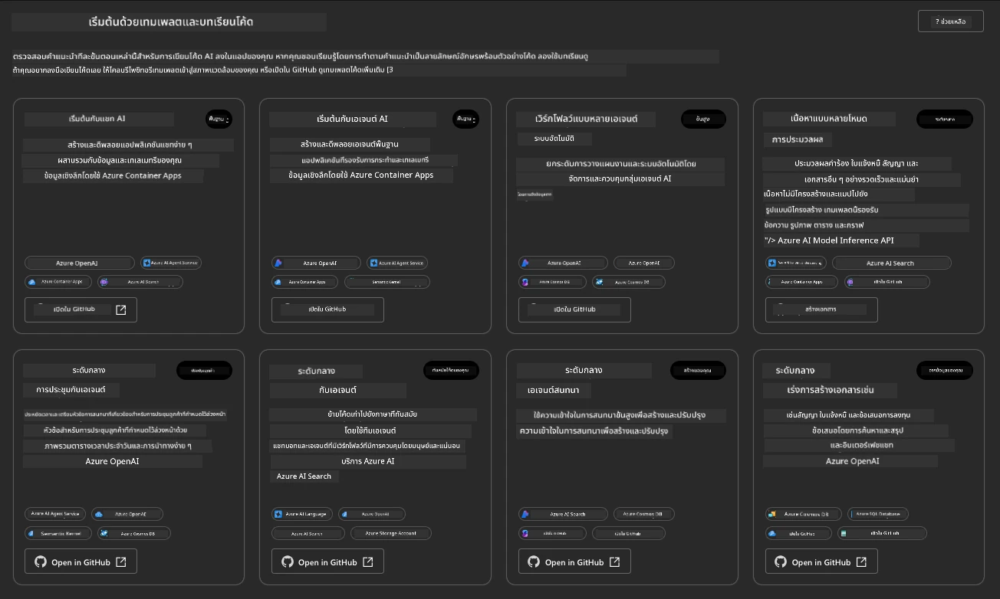


ตัวเลือก **Basic** คือแม่แบบเริ่มต้นของคุณ:

1. [ ] [เริ่มต้นกับ AI Chat](https://github.com/Azure-Samples/get-started-with-ai-chat) ที่ปรับใช้แอปพลิเคชันแชทพื้นฐาน _พร้อมกับข้อมูลของคุณ_ ไปยัง Azure Container Apps ใช้สำหรับสำรวจสถานการณ์แชทบอท AI พื้นฐาน
1. [X] [เริ่มต้นกับ AI Agents](https://github.com/Azure-Samples/get-started-with-ai-agents) ที่ปรับใช้ AI Agent มาตรฐาน (พร้อม Foundry Agents) ใช้เพื่อทำความคุ้นเคยกับโซลูชัน AI agentic ที่เกี่ยวข้องกับเครื่องมือและแบบจำลอง

ไปที่ลิงก์ที่สองในแท็บเบราว์เซอร์ใหม่ (หรือคลิก `Open in GitHub` บนการ์ดที่เกี่ยวข้อง) คุณควรเห็นที่เก็บสำหรับแม่แบบ AZD นี้ ใช้เวลาสักครู่เพื่อสำรวจ README สถาปัตยกรรมแอปพลิเคชันมีลักษณะดังนี้:

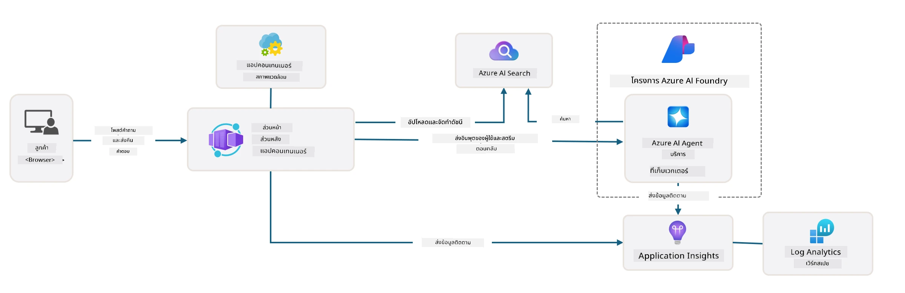

---

## 3. การเปิดใช้งานแม่แบบ

ลองปรับใช้แม่แบบนี้และแน่ใจว่ามันถูกต้อง เราจะปฏิบัติตามคำแนะนำในส่วน [Getting Started](https://github.com/Azure-Samples/get-started-with-ai-agents?tab=readme-ov-file#getting-started)

1. เลือกสภาพแวดล้อมทำงานสำหรับที่เก็บแม่แบบ:

      - **GitHub Codespaces**: คลิก [ลิงก์นี้](https://github.com/codespaces/new/Azure-Samples/get-started-with-ai-agents) และยืนยัน `Create codespace`
      - **โคลนในเครื่องหรือ dev container**: โคลน `Azure-Samples/get-started-with-ai-agents` และเปิดใน VS Code

1. รอจนกว่าเทอร์มินัล VS Code พร้อมใช้งาน จากนั้นพิมพ์คำสั่งต่อไปนี้:

   ```bash title="" linenums="0"
   azd up
   ```

ทำตามขั้นตอนกระบวนการที่จะเกิดขึ้น:

1. คุณจะถูกขอให้เข้าสู่ระบบ Azure - ทำตามคำแนะนำเพื่อลงชื่อเข้าใช้
1. ป้อนชื่อสภาพแวดล้อมที่ไม่ซ้ำกันสำหรับตัวคุณเอง - ตัวอย่างเช่น ฉันใช้ `nitya-mshack-azd`
1. ระบบจะสร้างโฟลเดอร์ `.azure/` - คุณจะเห็นโฟลเดอร์ย่อยที่มีชื่อสภาพแวดล้อม
1. คุณจะถูกขอให้เลือกชื่อการสมัครสมาชิก - เลือกค่าเริ่มต้น
1. คุณจะถูกขอให้เลือกตำแหน่ง - ใช้ `East US 2`

ดังนั้น คุณรอให้การจัดหาโครงสร้างพื้นฐานเสร็จสมบูรณ์ **จะใช้เวลาประมาณ 10-15 นาที**

1. เมื่อติดตั้งเสร็จแล้ว คอนโซลของคุณจะแสดงข้อความ SUCCESS ดังนี้:
      ```bash title="" linenums="0"
      SUCCESS: Your up workflow to provision and deploy to Azure completed in 10 minutes 17 seconds.
      ```
1. พอร์ทัล Azure ของคุณจะมี resource group ที่ได้รับการจัดหาในชื่อสภาพแวดล้อมนั้น:

      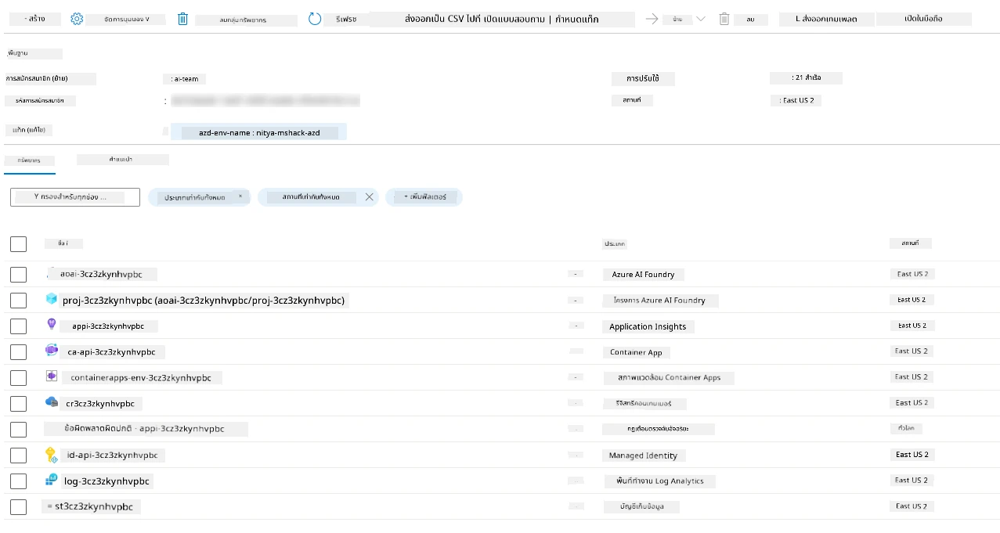

1. **คุณพร้อมที่จะตรวจสอบโครงสร้างพื้นฐานและแอปพลิเคชันที่ปรับใช้แล้ว**

---

## 4. การตรวจสอบแม่แบบ

1. ไปที่หน้า Azure Portal [Resource Groups](https://portal.azure.com/#browse/resourcegroups) - เข้าสู่ระบบเมื่อร้องขอ
1. คลิกที่ RG สำหรับชื่อสภาพแวดล้อมของคุณ - คุณจะเห็นหน้าดังภาพข้างต้น

      - คลิกที่แหล่งข้อมูล Azure Container Apps
      - คลิกที่ Application Url ในส่วน _Essentials_ (มุมขวาบน)

1. คุณควรเห็น UI หน้าแอปพลิเคชันที่โฮสต์อยู่เช่นนี้:

   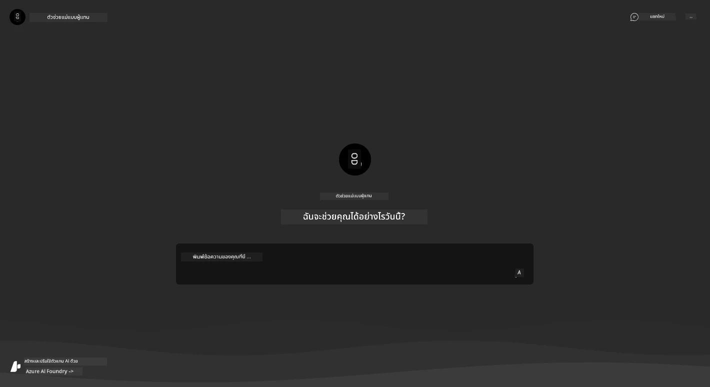

1. ลองถามคำถามตัวอย่างสองสามข้อจาก [ตัวอย่างคำถาม](https://github.com/Azure-Samples/get-started-with-ai-agents/blob/main/docs/sample_questions.md)

      1. ถาม: ```เมืองหลวงของฝรั่งเศสคืออะไร?``` 
      1. ถาม: ```เต็นท์ที่ดีที่สุดภายใต้ $200 สำหรับสองคนคืออะไร และมีคุณสมบัติอะไรบ้าง?```

1. คุณควรได้รับคำตอบคล้ายกับที่แสดงด้านล่าง _แต่มันทำงานอย่างไร?_

      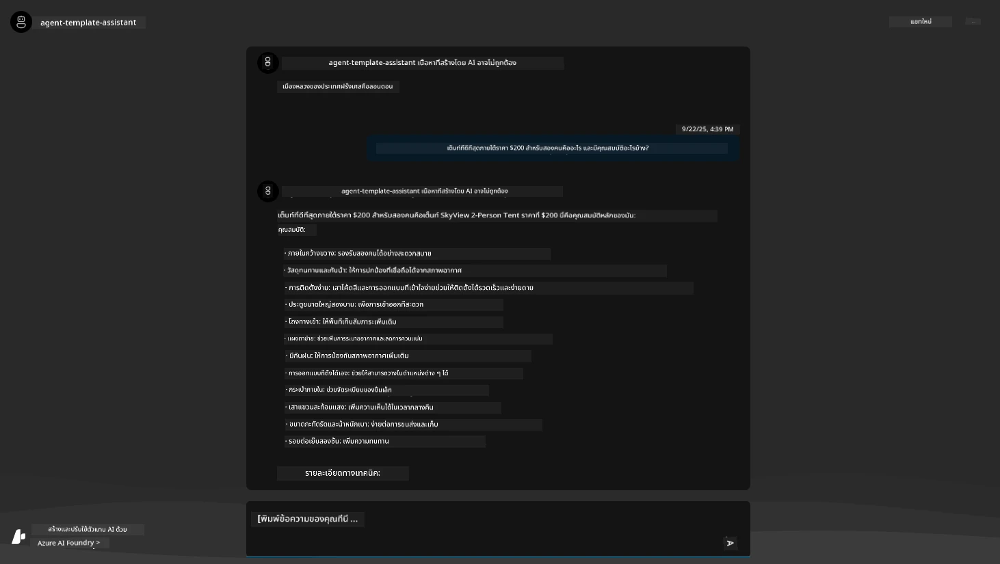

---

## 5. การตรวจสอบเอเจนต์

Azure Container App ปรับใช้ endpoint ที่เชื่อมต่อกับ AI Agent ที่ถูกจัดหาในโครงการ Microsoft Foundry สำหรับแม่แบบนี้ มาดูกันว่าหมายความว่าอย่างไร

1. กลับไปที่หน้า _ภาพรวม_ ใน Azure Portal สำหรับ resource group ของคุณ

1. คลิกที่แหล่งข้อมูล `Microsoft Foundry` ในรายการนั้น

1. คุณควรเห็นหน้านี้ คลิกปุ่ม `Go to Microsoft Foundry Portal` 
   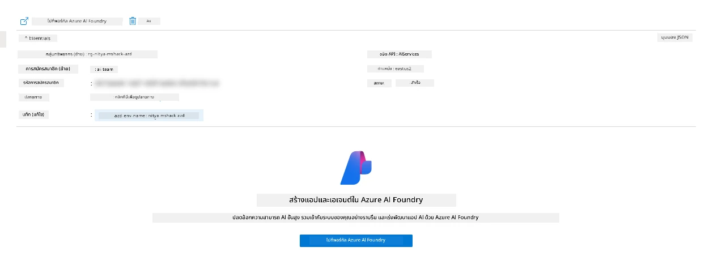

1. คุณควรเห็นหน้าของโครงการ Foundry สำหรับแอปพลิเคชัน AI ของคุณ
   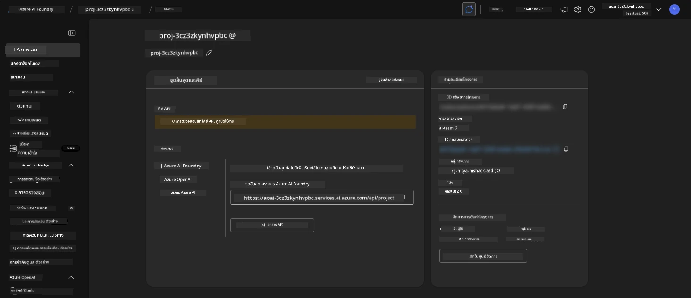

1. คลิกที่ `Agents` - คุณจะเห็น Agent เริ่มต้นที่ถูกจัดหาในโครงการของคุณ
   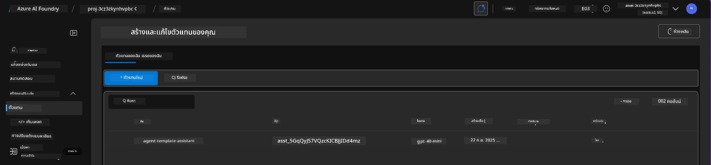

1. เลือกมัน - คุณจะเห็นรายละเอียด Agent โดยสังเกตดังนี้:

      - Agent ใช้ File Search โดยค่าเริ่มต้น (ตลอดเวลา)
      - `Knowledge` ของ agent แสดงว่ามีไฟล์ 32 ไฟล์ที่อัปโหลด (สำหรับการค้นหาไฟล์)
      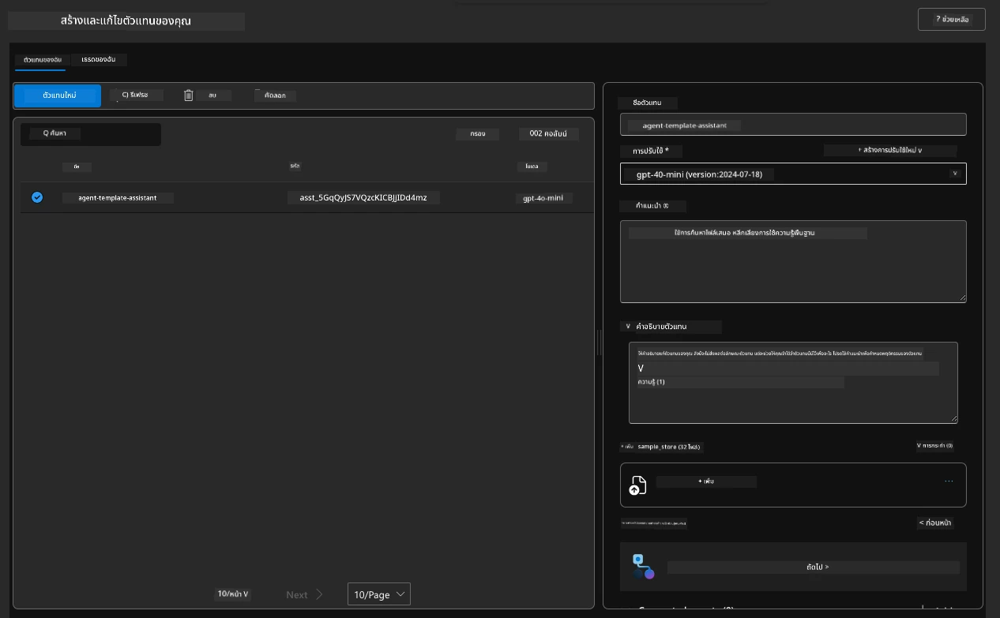

1. มองหาเมนู `Data+indexes` ทางเมนูซ้ายและคลิกเพื่อดูรายละเอียด

      - คุณควรเห็นไฟล์ข้อมูล 32 ไฟล์ที่อัปโหลดเพื่อความรู้
      - ซึ่งตรงกับไฟล์ลูกค้า 12 ไฟล์และไฟล์สินค้า 20 ไฟล์ภายใต้ `src/files`
      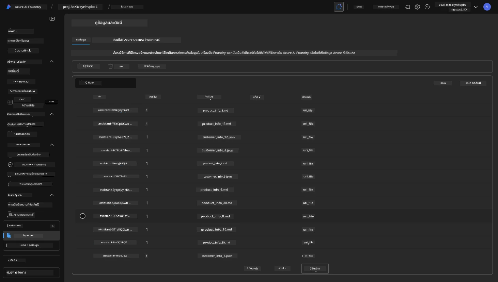

**คุณได้ตรวจสอบการทำงานของ Agent แล้ว!**

1. คำตอบของ agent มีพื้นฐานจากความรู้ในไฟล์เหล่านั้น
1. ตอนนี้คุณสามารถถามคำถามเกี่ยวกับข้อมูลนั้นและได้รับคำตอบที่มีมูลฐาน
1. ตัวอย่าง: `customer_info_10.json` อธิบายการซื้อ 3 ครั้งโดย "Amanda Perez"

กลับไปที่แท็บเบราว์เซอร์ที่มี endpoint ของ Container App แล้วถาม: `สินค้าอะไรที่ Amanda Perez เป็นเจ้าของ?` คุณควรเห็นอะไรบางอย่างเช่นนี้:

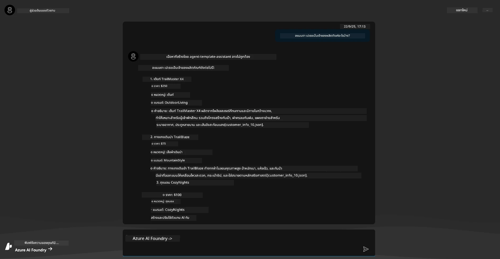

---

## 6. สนามเด็กเล่นสำหรับ Agent

มาเสริมความเข้าใจของเราสำหรับความสามารถของ Microsoft Foundry โดยการลองใช้ Agent ใน Agents Playground

1. กลับไปที่หน้าของ `Agents` ใน Microsoft Foundry - เลือก agent เริ่มต้น
1. คลิกที่ตัวเลือก `Try in Playground` - คุณจะได้รับ UI ของ Playground ดังนี้
1. ถามคำถามเดิม: `สินค้าอะไรที่ Amanda Perez เป็นเจ้าของ?`

    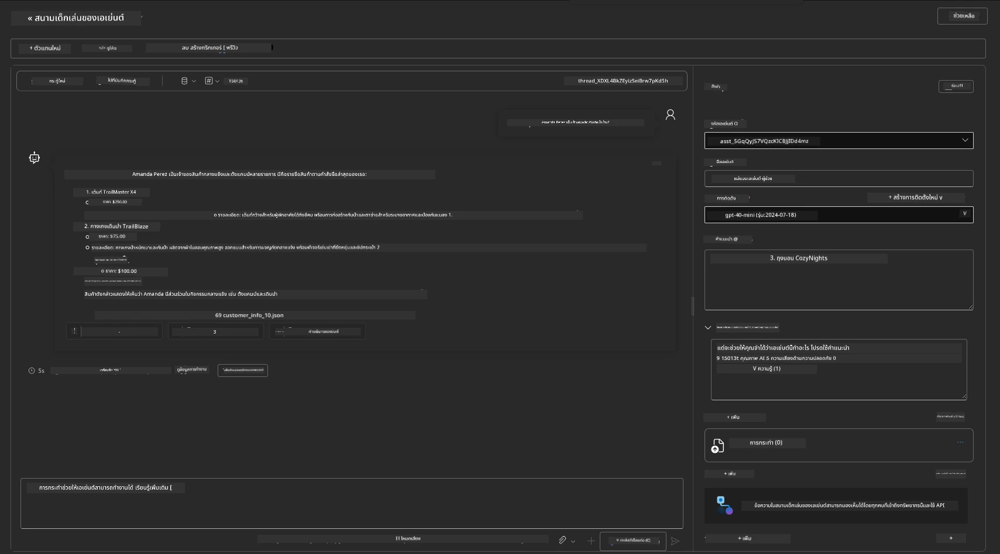

คุณจะได้รับคำตอบเดียวกัน (หรือคล้ายกัน) แต่คุณจะได้รับข้อมูลเพิ่มเติมเพื่อช่วยให้คุณเข้าใจคุณภาพ, ค่าใช้จ่าย และประสิทธิภาพของแอป agentic ตัวอย่างเช่น:

1. สังเกตว่าคำตอบอ้างอิงไฟล์ข้อมูลที่ใช้เพื่อ "รองรับ" คำตอบ
1. วางเมาส์เหนือป้ายชื่อไฟล์ใด ๆ - ข้อมูลตรงตามคำถามและคำตอบที่แสดงหรือไม่?

คุณยังเห็นแถว _สถิติ_ ด้านล่างคำตอบด้วย

1. วางเมาส์เหนือความวัดค่าต่างๆ - เช่น Safety คุณจะเห็นบางอย่างเช่นนี้
1. การจัดอันดับที่ประเมินตรงกับความรู้สึกของคุณเกี่ยวกับระดับความปลอดภัยของคำตอบหรือไม่?

      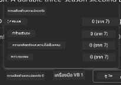

---

## 7. การสังเกตการณ์ในตัว

Observability (การสังเกตการณ์) คือการติดตั้งเครื่องมือในแอปพลิเคชันของคุณเพื่อสร้างข้อมูลที่ใช้ทำความเข้าใจ, แก้ไขปัญหา และปรับปรุงการทำงาน มาทำความเข้าใจด้วย:

1. คลิกปุ่ม `View Run Info` - คุณจะเห็นมุมมองนี้ นี่คือตัวอย่างของ [การติดตาม Agent](https://learn.microsoft.com/en-us/azure/ai-foundry/how-to/develop/trace-agents-sdk#view-trace-results-in-the-azure-ai-foundry-agents-playground) ในการใช้งาน _คุณยังสามารถเข้าถึงมุมมองนี้ได้โดยการคลิก Thread Logs ในเมนูชั้นบนสุด_

   - ทำความเข้าใจขั้นตอนการทำงานและเครื่องมือที่ agent ใช้
   - เข้าใจจำนวน Token ทั้งหมด (เทียบกับการใช้ token ผลลัพธ์) สำหรับคำตอบ
   - เข้าใจความหน่วงเวลาและตำแหน่งเวลาที่ใช้ในการดำเนินการ

      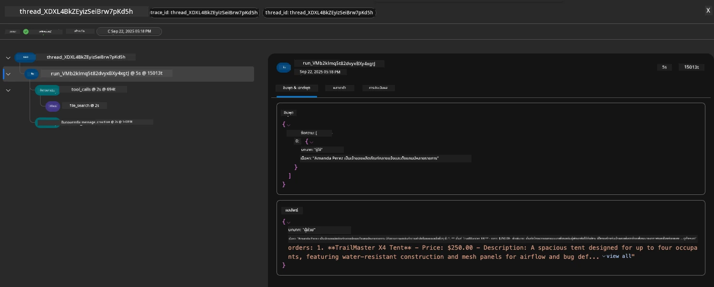

1. คลิกแท็บ `Metadata` เพื่อดูคุณสมบัติเพิ่มเติมของการทำงานซึ่งอาจให้บริบทที่มีประโยชน์สำหรับการแก้ไขปัญหาต่อไป

      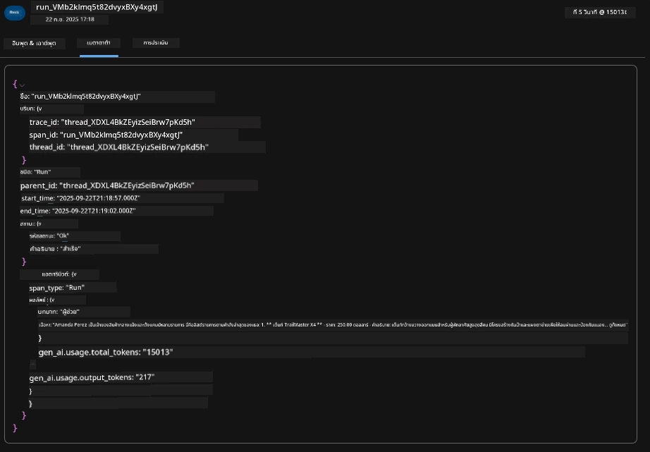


1. คลิกแท็บ `Evaluations` เพื่อดูการประเมินอัตโนมัติที่ทำในคำตอบของ agent รวมถึงการประเมินความปลอดภัย (เช่น Self-harm) และการประเมินเฉพาะของ agent (เช่น การแก้เจตนา, การปฏิบัติตามงาน)

      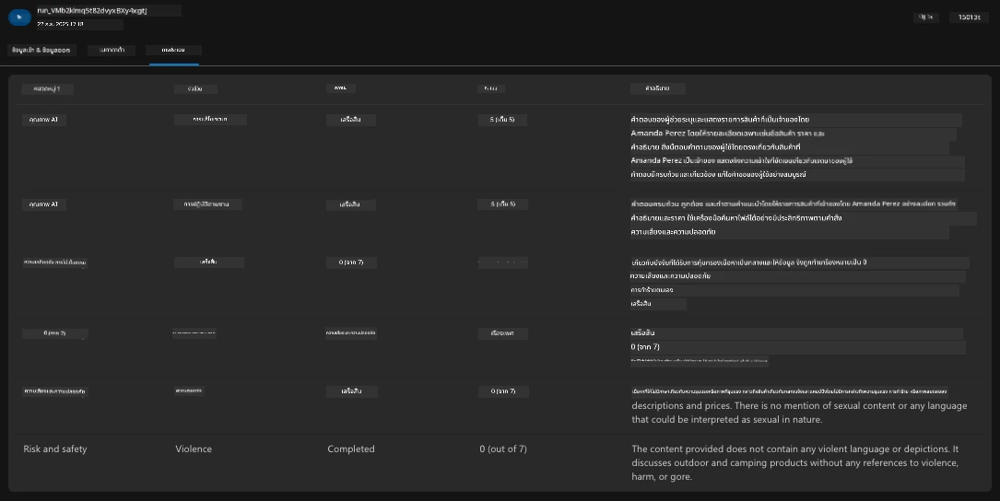

1. สุดท้าย คลิกแท็บ `Monitoring` ในเมนูด้านข้าง

      - เลือกแท็บ `Resource usage` บนหน้าที่แสดง - และดูเมตริกส์
      - ติดตามการใช้งานแอปพลิเคชันในเรื่องค่าใช้จ่าย (โทเค็น) และปริมาณการร้องขอ
      - ติดตามความหน่วงเวลาแอปพลิเคชันถึงไบต์แรก (การประมวลผลอินพุต) และไบต์สุดท้าย (ผลลัพธ์)

      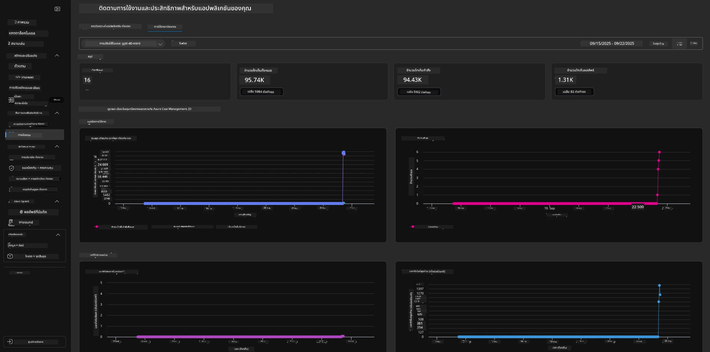

---

## 8. ตัวแปรสภาพแวดล้อม

จนถึงตอนนี้ เราได้เดินผ่านการปรับใช้ในเบราว์เซอร์ และตรวจสอบว่าโครงสร้างพื้นฐานของเราได้รับการจัดหาและแอปพลิเคชันทำงาน แต่ถ้าต้องการทำงานกับโค้ดแอปพลิเคชัน _เป็นอันดับแรก_ เราต้องกำหนดค่าสภาพแวดล้อมพัฒนาท้องถิ่นของเราด้วยตัวแปรที่เกี่ยวข้องที่จำเป็นสำหรับการทำงานกับทรัพยากรเหล่านี้ การใช้ `azd` ทำให้ง่ายขึ้น

1. Azure Developer CLI [ใช้ตัวแปรสภาพแวดล้อม](https://learn.microsoft.com/en-us/azure/developer/azure-developer-cli/manage-environment-variables?tabs=bash) เพื่อจัดเก็บและจัดการค่ากำหนดสำหรับการปรับใช้แอปพลิเคชัน

1. ตัวแปรสภาพแวดล้อมถูกเก็บใน `.azure/<env-name>/.env` - ซึ่งจำกัดขอบเขตในสภาพแวดล้อม `env-name` ที่ใช้ในระหว่างการปรับใช้ และช่วยให้คุณแยกแยะสภาพแวดล้อมระหว่างเป้าหมายการปรับใช้ต่าง ๆ ในที่เก็บเดียวกัน

1. ตัวแปรสภาพแวดล้อมจะถูกโหลดอัตโนมัติโดยคำสั่ง `azd` ทุกครั้งที่รันคำสั่ง (เช่น `azd up`) โปรดทราบว่า `azd` ไม่อ่านตัวแปรสภาพแวดล้อมระดับระบบปฏิบัติการโดยอัตโนมัติ (เช่น ตั้งในเชลล์) — ให้ใช้ `azd set env` และ `azd get env` เพื่อถ่ายโอนข้อมูลภายในสคริปต์แทน

ลองใช้คำสั่งบางคำสั่งดู:

1. ดึงตัวแปรสภาพแวดล้อมทั้งหมดที่ตั้งไว้สำหรับ `azd` ในสภาพแวดล้อมนี้:

      ```bash title="" linenums="0"
      azd env get-values
      ```
      
      คุณจะเห็นบางอย่างเช่น:

      ```bash title="" linenums="0"
      AZURE_AI_AGENT_DEPLOYMENT_NAME="gpt-4.1-mini"
      AZURE_AI_AGENT_NAME="agent-template-assistant"
      AZURE_AI_EMBED_DEPLOYMENT_NAME="text-embedding-3-small"
      AZURE_AI_EMBED_DIMENSIONS=100
      ...
      ```

1. ดึงค่าที่เฉพาะเจาะจง — เช่น ฉันอยากรู้ว่าตั้งค่า `AZURE_AI_AGENT_MODEL_NAME` หรือไม่

      ```bash title="" linenums="0"
      azd env get-value AZURE_AI_AGENT_MODEL_NAME 
      ```
      
      คุณจะเห็นบางอย่างเช่นนี้ — ค่าไม่ได้ตั้งไว้เป็นค่าเริ่มต้น!

      ```bash title="" linenums="0"
      ERROR: key 'AZURE_AI_AGENT_MODEL_NAME' not found in the environment values
      ```

1. ตั้งค่าตัวแปรสภาพแวดล้อมใหม่สำหรับ `azd` ที่นี่เราปรับชื่อโมเดลของเอเจนต์ _หมายเหตุ: การเปลี่ยนแปลงใด ๆ จะสะท้อนทันทีในไฟล์ `.azure/<env-name>/.env`

      ```bash title="" linenums="0"
      azd env set AZURE_AI_AGENT_MODEL_NAME gpt-4.1
      azd env set AZURE_AI_AGENT_MODEL_VERSION 2025-04-14
      azd env set AZURE_AI_AGENT_DEPLOYMENT_CAPACITY 150
      ```

      ตอนนี้ เราควรพบว่าค่าถูกตั้งไว้แล้ว:

      ```bash title="" linenums="0"
      azd env get-value AZURE_AI_AGENT_MODEL_NAME 
      ```

1. ตั้งข้อสังเกตว่าทรัพยากรบางอย่างเป็นแบบถาวร (เช่น การปรับใช้โมเดล) และต้องการมากกว่าคำสั่ง `azd up` เพียงอย่างเดียวเพื่อบังคับให้ปรับใช้ใหม่ มาลองลบการปรับใช้เดิมแล้วปรับใช้ใหม่โดยแก้ไขตัวแปรสภาพแวดล้อม

1. **รีเฟรช** หากคุณเคยปรับใช้โครงสร้างพื้นฐานโดยใช้แม่แบบ azd มาก่อน — คุณสามารถ _รีเฟรช_ สถานะของตัวแปรสภาพแวดล้อมเครื่องท้องถิ่นของคุณตามสถานะปัจจุบันของการปรับใช้ Azure ด้วยคำสั่งนี้:

      ```bash title="" linenums="0"
      azd env refresh
      ```

      นี่คือวิธีที่ทรงพลังในการ _ซิงค์_ ตัวแปรสภาพแวดล้อมข้ามสองหรือหลายสภาพแวดล้อมการพัฒนาท้องถิ่น (เช่น ทีมที่มีนักพัฒนาหลายคน) - โดยอนุญาตให้อินฟราสตรัคเจอร์ที่ปรับใช้ทำหน้าที่เป็นความจริงพื้นฐานสำหรับสถานะตัวแปร env สมาชิกในทีมเพียงแค่ _รีเฟรช_ ตัวแปรเพื่อให้กลับมาซิงค์กัน

---

## 9. ขอแสดงความยินดี 🏆

คุณเพิ่งทำงานแบบ end-to-end workflow เสร็จสิ้นซึ่งคุณได้:

- [X] เลือก AZD เทมเพลตที่คุณต้องการใช้
- [X] เปิดเทมเพลตในสภาพแวดล้อมการพัฒนาที่รองรับ
- [X] ปรับใช้เทมเพลตและตรวจสอบว่ามันทำงานได้

---

<!-- CO-OP TRANSLATOR DISCLAIMER START -->
**ข้อจำกัดความรับผิดชอบ**:  
เอกสารนี้ได้รับการแปลโดยใช้บริการแปลด้วย AI [Co-op Translator](https://github.com/Azure/co-op-translator) แม้เราจะพยายามให้ความถูกต้องอย่างดีที่สุด แต่โปรดทราบว่าการแปลโดยอัตโนมัติอาจมีข้อผิดพลาดหรือความไม่ถูกต้อง เอกสารต้นฉบับในภาษาต้นทางถือเป็นแหล่งข้อมูลที่น่าเชื่อถือที่สุด สำหรับข้อมูลที่สำคัญ แนะนำให้ใช้การแปลโดยผู้เชี่ยวชาญมนุษย์ เราจะไม่รับผิดชอบต่อความเข้าใจผิดหรือความคลาดเคลื่อนที่เกิดขึ้นจากการใช้การแปลนี้
<!-- CO-OP TRANSLATOR DISCLAIMER END -->