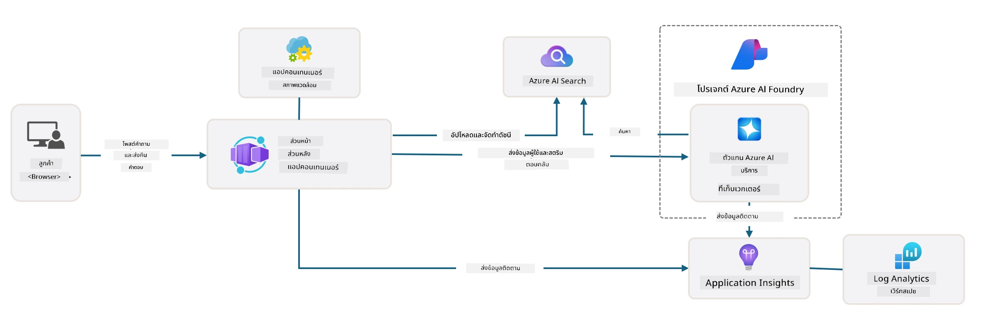

<!--
CO_OP_TRANSLATOR_METADATA:
{
  "original_hash": "4e403f041411361140d6beb88ab2a181",
  "translation_date": "2025-09-24T21:31:55+00:00",
  "source_file": "workshop/docs/instructions/3-Deconstruct-AI-Template.md",
  "language_code": "th"
}
-->
# 3. แยกโครงสร้างเทมเพลต

!!! tip "เมื่อจบโมดูลนี้ คุณจะสามารถ"

    - [ ] รายการ
    - [ ] รายการ
    - [ ] รายการ
    - [ ] **Lab 3:** 

---

ด้วยเทมเพลต AZD และ Azure Developer CLI (`azd`) เราสามารถเริ่มต้นการพัฒนา AI ได้อย่างรวดเร็วด้วยคลังข้อมูลมาตรฐานที่มีโค้ดตัวอย่าง ไฟล์โครงสร้างพื้นฐาน และไฟล์การตั้งค่า - ในรูปแบบของโปรเจกต์เริ่มต้นที่พร้อมใช้งาน

**แต่ตอนนี้ เราจำเป็นต้องเข้าใจโครงสร้างโปรเจกต์และฐานโค้ด - และสามารถปรับแต่งเทมเพลต AZD - โดยไม่ต้องมีประสบการณ์หรือความเข้าใจเกี่ยวกับ AZD มาก่อน!**

---

## 1. เปิดใช้งาน GitHub Copilot

### 1.1 ติดตั้ง GitHub Copilot Chat

ถึงเวลาสำรวจ [GitHub Copilot ในโหมด Agent](https://code.visualstudio.com/docs/copilot/chat/chat-agent-mode) ตอนนี้เราสามารถใช้ภาษาธรรมชาติในการอธิบายงานของเราในระดับสูง และรับความช่วยเหลือในการดำเนินการ สำหรับห้องปฏิบัติการนี้ เราจะใช้ [แผน Copilot Free](https://github.com/github-copilot/signup) ซึ่งมีข้อจำกัดรายเดือนสำหรับการทำงานและการสนทนา

ส่วนขยายสามารถติดตั้งได้จาก Marketplace แต่ควรมีอยู่แล้วในสภาพแวดล้อม Codespaces ของคุณ _คลิก `Open Chat` จากเมนู Copilot icon drop-down - และพิมพ์คำสั่งเช่น `What can you do?`_ - คุณอาจถูกขอให้เข้าสู่ระบบ **GitHub Copilot Chat พร้อมใช้งานแล้ว**

### 1.2 ติดตั้ง MCP Servers

เพื่อให้โหมด Agent มีประสิทธิภาพ จำเป็นต้องเข้าถึงเครื่องมือที่เหมาะสมเพื่อช่วยดึงข้อมูลหรือดำเนินการ นี่คือที่ MCP servers เข้ามาช่วย เราจะตั้งค่าเซิร์ฟเวอร์ดังต่อไปนี้:

1. [Azure MCP Server](../../../../../workshop/docs/instructions)
1. [Microsoft Docs MCP Server](../../../../../workshop/docs/instructions)

เพื่อเปิดใช้งาน:

1. สร้างไฟล์ชื่อ `.vscode/mcp.json` หากยังไม่มี
1. คัดลอกข้อมูลต่อไปนี้ลงในไฟล์นั้น - และเริ่มเซิร์ฟเวอร์!
   ```json title=".vscode/mcp.json"
   {
      "servers": {
         "Azure MCP Server": {
            "command": "npx",
            "args": [
            "-y",
            "@azure/mcp@latest",
            "server",
            "start"
            ]
         },
         "microsoft.docs.mcp": {
            "type": "http",
            "url": "https://learn.microsoft.com/api/mcp"
         }
      }
   }
   ```

??? warning "คุณอาจได้รับข้อผิดพลาดว่า `npx` ยังไม่ได้ติดตั้ง (คลิกเพื่อดูวิธีแก้ไข)"

      เพื่อแก้ไขปัญหา ให้เปิดไฟล์ `.devcontainer/devcontainer.json` และเพิ่มบรรทัดนี้ในส่วน features จากนั้นสร้าง container ใหม่ คุณควรมี `npx` ติดตั้งแล้ว

      ```title="" linenums="0"
         "features": {
            "ghcr.io/devcontainers/features/node:1": {},
            ...
         },
      ```

---

### 1.3 ทดสอบ GitHub Copilot Chat

**เริ่มต้นด้วยการใช้ `az login` เพื่อยืนยันตัวตนกับ Azure จาก VS Code command line**

คุณควรสามารถสอบถามสถานะการสมัคร Azure ของคุณ และถามคำถามเกี่ยวกับทรัพยากรที่ปรับใช้หรือการตั้งค่า ลองใช้คำสั่งเหล่านี้:

1. `List my Azure resource groups`
1. `#foundry list my current deployments`

คุณยังสามารถถามคำถามเกี่ยวกับเอกสาร Azure และรับคำตอบที่อ้างอิงจาก Microsoft Docs MCP server ลองใช้คำสั่งเหล่านี้:

1. `#microsoft_docs_search What is Azure Developer CLI?`
1. `#microsoft_docs_search Show me a Python tutorial to chat with deployed model`

หรือคุณสามารถขอให้สร้างโค้ดตัวอย่างเพื่อทำงานให้เสร็จ ลองใช้คำสั่งนี้:

1. `Give me a Python code example that uses AAD for an interactive chat client`

ในโหมด `Ask` จะให้โค้ดที่คุณสามารถคัดลอกและลองใช้งานได้ ในโหมด `Agent` อาจไปไกลกว่านั้นโดยสร้างทรัพยากรที่เกี่ยวข้องให้คุณ - รวมถึงสคริปต์การตั้งค่าและเอกสาร - เพื่อช่วยคุณดำเนินการงานนั้น

**ตอนนี้คุณพร้อมที่จะเริ่มสำรวจคลังข้อมูลเทมเพลตแล้ว**

---

## 2. แยกโครงสร้างสถาปัตยกรรม

??? prompt "ASK: อธิบายสถาปัตยกรรมแอปพลิเคชันใน docs/images/architecture.png ใน 1 ย่อหน้า"

      แอปพลิเคชันนี้เป็นแอปพลิเคชันแชทที่ขับเคลื่อนด้วย AI บน Azure ซึ่งแสดงให้เห็นถึงสถาปัตยกรรมแบบเอเจนต์สมัยใหม่ โซลูชันนี้มุ่งเน้นไปที่ Azure Container App ที่โฮสต์โค้ดแอปพลิเคชันหลัก ซึ่งประมวลผลข้อมูลผู้ใช้และสร้างการตอบกลับที่ชาญฉลาดผ่าน AI agent
      
      สถาปัตยกรรมนี้ใช้ Azure AI Foundry Project เป็นพื้นฐานสำหรับความสามารถด้าน AI โดยเชื่อมต่อกับ Azure AI Services ที่ให้โมเดลภาษาพื้นฐาน (เช่น GPT-4o-mini) และฟังก์ชันเอเจนต์ การโต้ตอบของผู้ใช้ไหลผ่านส่วนหน้าที่ใช้ React ไปยังส่วนหลังที่ใช้ FastAPI ซึ่งสื่อสารกับบริการ AI agent เพื่อสร้างการตอบกลับที่มีบริบท
      
      ระบบนี้มีความสามารถในการดึงข้อมูลความรู้ผ่านการค้นหาไฟล์หรือบริการ Azure AI Search ทำให้เอเจนต์สามารถเข้าถึงและอ้างอิงข้อมูลจากเอกสารที่อัปโหลดได้ สำหรับความเป็นเลิศในการดำเนินงาน สถาปัตยกรรมนี้รวมการตรวจสอบที่ครอบคลุมผ่าน Application Insights และ Log Analytics Workspace สำหรับการติดตาม การบันทึก และการปรับปรุงประสิทธิภาพ
      
      Azure Storage ให้บริการ blob storage สำหรับข้อมูลแอปพลิเคชันและการอัปโหลดไฟล์ ในขณะที่ Managed Identity ช่วยให้เข้าถึงทรัพยากร Azure ได้อย่างปลอดภัยโดยไม่ต้องจัดเก็บข้อมูลรับรอง โซลูชันทั้งหมดได้รับการออกแบบมาเพื่อความสามารถในการปรับขนาดและการบำรุงรักษา โดยแอปพลิเคชันที่อยู่ใน container จะปรับขนาดโดยอัตโนมัติตามความต้องการ พร้อมทั้งให้ความปลอดภัย การตรวจสอบ และความสามารถ CI/CD ในตัวผ่านระบบบริการที่มีการจัดการของ Azure



---

## 3. โครงสร้างคลังข้อมูล

!!! prompt "ASK: อธิบายโครงสร้างโฟลเดอร์เทมเพลต เริ่มต้นด้วยแผนภาพลำดับชั้นแบบภาพ"

??? info "ANSWER: แผนภาพลำดับชั้นแบบภาพ"

      ```bash title="" 
      get-started-with-ai-agents/
      ├── 📋 การตั้งค่าและการกำหนดค่า
      │   ├── azure.yaml                    # การตั้งค่า Azure Developer CLI
      │   ├── docker-compose.yaml           # container สำหรับการพัฒนาในเครื่อง
      │   ├── pyproject.toml                # การตั้งค่าโปรเจกต์ Python
      │   ├── requirements-dev.txt          # การพัฒนาขึ้นอยู่กับ
      │   └── .devcontainer/                # การตั้งค่า dev container ใน VS Code
      │
      ├── 🏗️ โครงสร้างพื้นฐาน (infra/)
      │   ├── main.bicep                    # เทมเพลตโครงสร้างพื้นฐานหลัก
      │   ├── api.bicep                     # ทรัพยากรเฉพาะ API
      │   ├── main.parameters.json          # พารามิเตอร์โครงสร้างพื้นฐาน
      │   └── core/                         # ส่วนประกอบโครงสร้างพื้นฐานแบบโมดูล
      │       ├── ai/                       # การตั้งค่าบริการ AI
      │       ├── host/                     # โครงสร้างพื้นฐานการโฮสต์
      │       ├── monitor/                  # การตรวจสอบและการบันทึก
      │       ├── search/                   # การตั้งค่า Azure AI Search
      │       ├── security/                 # ความปลอดภัยและตัวตน
      │       └── storage/                  # การตั้งค่าบัญชีจัดเก็บข้อมูล
      │
      ├── 💻 โค้ดแอปพลิเคชัน (src/)
      │   ├── api/                          # API ส่วนหลัง
      │   │   ├── main.py                   # จุดเริ่มต้นแอปพลิเคชัน FastAPI
      │   │   ├── routes.py                 # การกำหนดเส้นทาง API
      │   │   ├── search_index_manager.py   # ฟังก์ชันการค้นหา
      │   │   ├── data/                     # การจัดการข้อมูล API
      │   │   ├── static/                   # เว็บแอสเซทแบบคงที่
      │   │   └── templates/                # เทมเพลต HTML
      │   ├── frontend/                     # ส่วนหน้า React/TypeScript
      │   │   ├── package.json              # การพึ่งพา Node.js
      │   │   ├── vite.config.ts            # การตั้งค่าการสร้าง Vite
      │   │   └── src/                      # โค้ดต้นฉบับส่วนหน้า
      │   ├── data/                         # ไฟล์ข้อมูลตัวอย่าง
      │   │   └── embeddings.csv            # embeddings ที่คำนวณไว้ล่วงหน้า
      │   ├── files/                        # ไฟล์ฐานความรู้
      │   │   ├── customer_info_*.json      # ตัวอย่างข้อมูลลูกค้า
      │   │   └── product_info_*.md         # เอกสารผลิตภัณฑ์
      │   ├── Dockerfile                    # การตั้งค่า container
      │   └── requirements.txt              # การพึ่งพา Python
      │
      ├── 🔧 การทำงานอัตโนมัติและสคริปต์ (scripts/)
      │   ├── postdeploy.sh/.ps1           # การตั้งค่าหลังการปรับใช้
      │   ├── setup_credential.sh/.ps1     # การตั้งค่าข้อมูลรับรอง
      │   ├── validate_env_vars.sh/.ps1    # การตรวจสอบสภาพแวดล้อม
      │   └── resolve_model_quota.sh/.ps1  # การจัดการโควต้าโมเดล
      │
      ├── 🧪 การทดสอบและการประเมินผล
      │   ├── tests/                        # การทดสอบหน่วยและการทดสอบการรวม
      │   │   └── test_search_index_manager.py
      │   ├── evals/                        # เฟรมเวิร์กการประเมินเอเจนต์
      │   │   ├── evaluate.py               # ตัวเรียกใช้งานการประเมิน
      │   │   ├── eval-queries.json         # คำถามทดสอบ
      │   │   └── eval-action-data-path.json
      │   ├── sandbox/                      # พื้นที่เล่นสำหรับการพัฒนา
      │   │   ├── 1-quickstart.py           # ตัวอย่างการเริ่มต้นใช้งาน
      │   │   └── aad-interactive-chat.py   # ตัวอย่างการยืนยันตัวตน
      │   └── airedteaming/                 # การประเมินความปลอดภัย AI
      │       └── ai_redteaming.py          # การทดสอบทีมสีแดง
      │
      ├── 📚 เอกสาร (docs/)
      │   ├── deployment.md                 # คู่มือการปรับใช้
      │   ├── local_development.md          # คำแนะนำการตั้งค่าในเครื่อง
      │   ├── troubleshooting.md            # ปัญหาทั่วไปและวิธีแก้ไข
      │   ├── azure_account_setup.md        # ข้อกำหนดเบื้องต้นของ Azure
      │   └── images/                       # แอสเซทเอกสาร
      │
      └── 📄 เมตาดาต้าโปรเจกต์
         ├── README.md                     # ภาพรวมโปรเจกต์
         ├── CODE_OF_CONDUCT.md           # แนวทางชุมชน
         ├── CONTRIBUTING.md              # คู่มือการมีส่วนร่วม
         ├── LICENSE                      # เงื่อนไขใบอนุญาต
         └── next-steps.md                # คำแนะนำหลังการปรับใช้
      ```

### 3.1 สถาปัตยกรรมแอปหลัก

เทมเพลตนี้ใช้รูปแบบ **แอปพลิเคชันเว็บแบบเต็มรูปแบบ** โดยมี:

- **ส่วนหลัง**: Python FastAPI พร้อมการผสานรวม Azure AI
- **ส่วนหน้า**: TypeScript/React พร้อมระบบสร้าง Vite
- **โครงสร้างพื้นฐาน**: เทมเพลต Azure Bicep สำหรับทรัพยากรคลาวด์
- **การจัด container**: Docker เพื่อการปรับใช้ที่สอดคล้องกัน

### 3.2 โครงสร้างพื้นฐานเป็นโค้ด (bicep)

ชั้นโครงสร้างพื้นฐานใช้ **เทมเพลต Azure Bicep** ที่จัดระเบียบแบบโมดูล:

   - **`main.bicep`**: จัดการทรัพยากร Azure ทั้งหมด
   - **`core/` โมดูล**: ส่วนประกอบที่นำกลับมาใช้ใหม่สำหรับบริการต่างๆ
      - บริการ AI (Azure OpenAI, AI Search)
      - การโฮสต์ container (Azure Container Apps)
      - การตรวจสอบ (Application Insights, Log Analytics)
      - ความปลอดภัย (Key Vault, Managed Identity)

### 3.3 โค้ดแอปพลิเคชัน (`src/`)

**API ส่วนหลัง (`src/api/`)**:

- REST API ที่ใช้ FastAPI
- การผสานรวมบริการ AI Agent ของ Azure
- การจัดการดัชนีการค้นหาสำหรับการดึงข้อมูลความรู้
- ความสามารถในการอัปโหลดและประมวลผลไฟล์

**ส่วนหน้า (`src/frontend/`)**:

- SPA React/TypeScript สมัยใหม่
- Vite สำหรับการพัฒนาอย่างรวดเร็วและการสร้างที่ปรับแต่ง
- อินเทอร์เฟซแชทสำหรับการโต้ตอบกับเอเจนต์

**ฐานความรู้ (`src/files/`)**:

- ตัวอย่างข้อมูลลูกค้าและผลิตภัณฑ์
- แสดงการดึงข้อมูลความรู้จากไฟล์
- ตัวอย่างในรูปแบบ JSON และ Markdown

### 3.4 DevOps และการทำงานอัตโนมัติ

**สคริปต์ (`scripts/`)**:

- สคริปต์ PowerShell และ Bash ข้ามแพลตฟอร์ม
- การตรวจสอบและตั้งค่าสภาพแวดล้อม
- การตั้งค่าหลังการปรับใช้
- การจัดการโควต้าโมเดล

**การผสานรวม Azure Developer CLI**:

- การตั้งค่า `azure.yaml` สำหรับเวิร์กโฟลว์ `azd`
- การจัดเตรียมและการปรับใช้อัตโนมัติ
- การจัดการตัวแปรสภาพแวดล้อม

### 3.5 การทดสอบและการประกันคุณภาพ

**เฟรมเวิร์กการประเมิน (`evals/`)**:

- การประเมินประสิทธิภาพเอเจนต์
- การทดสอบคุณภาพการตอบกลับคำถาม
- ท่อการประเมินอัตโนมัติ

**ความปลอดภัย AI (`airedteaming/`)**:

- การทดสอบทีมสีแดงเพื่อความปลอดภัย AI
- การสแกนช่องโหว่ด้านความปลอดภัย
- แนวปฏิบัติ AI ที่รับผิดชอบ

---

## 4. ขอแสดงความยินดี 🏆

คุณได้ใช้ GitHub Copilot Chat กับ MCP servers สำเร็จแล้ว เพื่อสำรวจคลังข้อมูล

- [X] เปิดใช้งาน GitHub Copilot สำหรับ Azure
- [X] เข้าใจสถาปัตยกรรมแอปพลิเคชัน
- [X] สำรวจโครงสร้างเทมเพลต AZD

สิ่งนี้ทำให้คุณเข้าใจทรัพย์สิน _โครงสร้างพื้นฐานเป็นโค้ด_ สำหรับเทมเพลตนี้ ต่อไปเราจะดูไฟล์การตั้งค่าสำหรับ AZD

---

