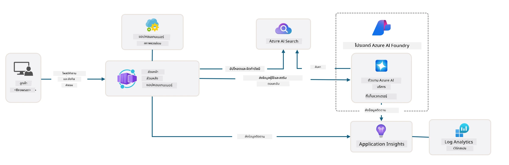

# 3. การแยกโครงสร้างเทมเพลต

!!! tip "เมื่อสิ้นสุดโมดูลนี้คุณจะสามารถ"

    - [ ] เปิดใช้งาน GitHub Copilot กับเซิร์ฟเวอร์ MCP สำหรับช่วยเหลือ Azure
    - [ ] เข้าใจโครงสร้างโฟลเดอร์และส่วนประกอบของเทมเพลต AZD
    - [ ] สำรวจรูปแบบการจัดระเบียบ infrastructure-as-code (Bicep)
    - [ ] **Lab 3:** ใช้ GitHub Copilot เพื่อสำรวจและเข้าใจสถาปัตยกรรมของรีโพสิตอรี่

---


ด้วยเทมเพลต AZD และ Azure Developer CLI (`azd`) เราสามารถเริ่มต้นเส้นทางการพัฒนา AI ได้อย่างรวดเร็วด้วยรีโพสิตอรี่ที่เป็นมาตรฐานซึ่งให้ตัวอย่างโค้ด โครงสร้างพื้นฐาน และไฟล์กำหนดค่าต่าง ๆ ในรูปแบบโปรเจกต์ _starter_ พร้อมใช้งาน

**แต่ตอนนี้ เราจำเป็นต้องเข้าใจโครงสร้างโปรเจกต์และฐานโค้ด – และสามารถปรับแต่งเทมเพลต AZD ได้ – โดยไม่ต้องมีประสบการณ์หรือความเข้าใจเกี่ยวกับ AZD มาก่อน!**

---

## 1. เปิดใช้งาน GitHub Copilot

### 1.1 ติดตั้ง GitHub Copilot Chat

ถึงเวลาสำรวจ [GitHub Copilot กับโหมด Agent](https://code.visualstudio.com/docs/copilot/chat/chat-agent-mode) ตอนนี้เราสามารถใช้ภาษาธรรมชาติในการอธิบายงานในระดับสูง และรับความช่วยเหลือในการปฏิบัติงาน สำหรับแลบนี้ เราจะใช้แผน [Copilot Free](https://github.com/github-copilot/signup) ซึ่งมีขีดจำกัดรายเดือนสำหรับการตอบกลับและการแชท

คุณสามารถติดตั้งส่วนขยายได้จาก marketplace แต่ควรจะพร้อมใช้งานแล้วในสภาพแวดล้อม Codespaces ของคุณ _คลิก `Open Chat` จากเมนูดรอปดาวน์ไอคอน Copilot และพิมพ์ข้อความเช่น `What can you do?`_ — คุณอาจถูกขอให้ล็อกอิน **GitHub Copilot Chat พร้อมใช้งานแล้ว**

### 1.2. ติดตั้ง MCP Servers

สำหรับโหมด Agent จะมีประสิทธิภาพต้องเข้าถึงเครื่องมือที่เหมาะสมเพื่อช่วยดึงความรู้หรือดำเนินการ นี่คือจุดที่เซิร์ฟเวอร์ MCP จะช่วยเรา เราจะกำหนดค่าเซิร์ฟเวอร์ต่อไปนี้:

1. [Azure MCP Server](../../../../../workshop/docs/instructions)
1. [Microsoft Docs MCP Server](../../../../../workshop/docs/instructions)

วิธีเปิดใช้งาน:

1. สร้างไฟล์ชื่อ `.vscode/mcp.json` หากยังไม่มี
1. คัดลอกข้อมูลต่อไปนี้ลงในไฟล์นั้น แล้วเริ่มเซิร์ฟเวอร์!
   ```json title=".vscode/mcp.json"
   {
      "servers": {
         "Azure MCP Server": {
            "command": "npx",
            "args": [
            "-y",
            "@azure/mcp@latest",
            "server",
            "start"
            ]
         },
         "microsoft.docs.mcp": {
            "type": "http",
            "url": "https://learn.microsoft.com/api/mcp"
         }
      }
   }
   ```

??? warning "คุณอาจได้รับข้อผิดพลาดว่า `npx` ไม่ถูกติดตั้ง (คลิกเพื่อขยายวิธีแก้ไข)"

      สำหรับการแก้ไข เปิดไฟล์ `.devcontainer/devcontainer.json` และเพิ่มบรรทัดนี้ในส่วน features แล้วสร้างคอนเทนเนอร์ใหม่ คุณควรจะมี `npx` ติดตั้งแล้ว

      ```title="" linenums="0"
         "features": {
            "ghcr.io/devcontainers/features/node:1": {},
            ...
         },
      ```

---

### 1.3. ทดสอบ GitHub Copilot Chat

**ใช้คำสั่ง `az login` เพื่อยืนยันตัวตนกับ Azure จากบรรทัดคำสั่ง VS Code ก่อน**

ตอนนี้คุณควรสามารถสอบถามสถานะการสมัครสมาชิก Azure ของคุณ และถามคำถามเกี่ยวกับทรัพยากรหรือการกำหนดค่าที่ปรับใช้ ลองใช้คำสั่งต่อไปนี้:

1. `List my Azure resource groups`
1. `#foundry list my current deployments`

คุณยังสามารถถามคำถามเกี่ยวกับเอกสาร Azure และรับคำตอบจากเซิร์ฟเวอร์ Microsoft Docs MCP ลองใช้คำสั่ง:

1. `#microsoft_docs_search What is Azure Developer CLI?`
1. `#microsoft_docs_search Show me a Python tutorial to chat with deployed model`

หรือคุณสามารถขอโค้ดตัวอย่างสำหรับทำงาน ลองใช้คำสั่งนี้

1. `Give me a Python code example that uses AAD for an interactive chat client`

ในโหมด `Ask` ระบบจะให้โค้ดที่คุณสามารถคัดลอกและลองใช้งานได้ ในโหมด `Agent` อาจดำเนินการขั้นตอนต่อไป เช่นสร้างทรัพยากรที่เกี่ยวข้อง รวมสคริปต์ตั้งค่าและเอกสาร เพื่อช่วยให้คุณดำเนินการงานนั้นได้

**ตอนนี้คุณพร้อมที่จะเริ่มสำรวจรีโพสิตอรี่เทมเพลตแล้ว**

---

## 2. แยกโครงสร้างสถาปัตยกรรม

??? prompt "ถาม: อธิบายสถาปัตยกรรมแอปพลิเคชันใน docs/images/architecture.png ใน 1 ย่อหน้า"

      แอปพลิเคชันนี้เป็นแอปแชทที่ใช้ AI พัฒนาอยู่บน Azure ซึ่งแสดงสถาปัตยกรรมแบบเอเจนต์สมัยใหม่ โซลูชันนี้มีศูนย์กลางที่ Azure Container App ที่โฮสต์โค้ดแอปพลิเคชันหลักที่ประมวลผลคำป้อนของผู้ใช้และสร้างการตอบสนองอย่างชาญฉลาดผ่านเอเจนต์ AI
      
      สถาปัตยกรรมนี้ใช้ Microsoft Foundry Project เป็นฐานสำหรับความสามารถ AI โดยเชื่อมต่อกับ Azure AI Services ที่ให้โมเดลภาษาเบื้องหลัง (เช่น gpt-4.1-mini) และฟังก์ชันเอเจนต์ การโต้ตอบของผู้ใช้ไหลผ่าน frontend ที่สร้างด้วย React ไปยัง backend FastAPI ที่สื่อสารกับบริการเอเจนต์ AI เพื่อสร้างการตอบสนองตามบริบท
      
      ระบบมีความสามารถในการดึงข้อมูลความรู้ผ่านการค้นหาไฟล์หรือบริการ Azure AI Search ทำให้เอเจนต์สามารถเข้าถึงและอ้างอิงข้อมูลจากเอกสารที่อัปโหลดได้ เพื่อความเป็นเลิศในการดำเนินงาน สถาปัตยกรรมรวมการติดตามอย่างครอบคลุมผ่าน Application Insights และ Log Analytics Workspace สำหรับการติดตาม รักษาบันทึก และเพิ่มประสิทธิภาพ
      
      Azure Storage ให้บริการที่เก็บบล็อบสำหรับข้อมูลแอปและการอัปโหลดไฟล์ ขณะที่ Managed Identity ช่วยการเข้าถึงอย่างปลอดภัยระหว่างทรัพยากร Azure โดยไม่ต้องจัดเก็บข้อมูลรับรอง โซลูชันทั้งหมดออกแบบมาเพื่อความสามารถในการปรับขนาดและการดูแลรักษา โดยแอปพลิเคชันที่คอนเทนเนอร์จะปรับขนาดโดยอัตโนมัติตามความต้องการ พร้อมด้วยความปลอดภัย การติดตาม และความสามารถ CI/CD ผ่านระบบจัดการบริการของ Azure



---

## 3. โครงสร้างรีโพสิตอรี่

!!! prompt "ถาม: อธิบายโครงสร้างโฟลเดอร์เทมเพลต เริ่มต้นด้วยแผนภาพลำดับชั้นเชิงภาพ"

??? info "คำตอบ: แผนภาพลำดับชั้นเชิงภาพ"

      ```bash title="" 
      get-started-with-ai-agents/
      ├── 📋 Configuration & Setup
      │   ├── azure.yaml                    # การกำหนดค่า Azure Developer CLI
      │   ├── docker-compose.yaml           # คอนเทนเนอร์สำหรับพัฒนาท้องถิ่น
      │   ├── pyproject.toml                # การกำหนดค่าโปรเจกต์ Python
      │   ├── requirements-dev.txt          # ไลบรารีที่ใช้ในการพัฒนา
      │   └── .devcontainer/                # การตั้งค่า dev container ของ VS Code
      │
      ├── 🏗️ Infrastructure (infra/)
      │   ├── main.bicep                    # เทมเพลตโครงสร้างพื้นฐานหลัก
      │   ├── api.bicep                     # ทรัพยากรเฉพาะ API
      │   ├── main.parameters.json          # พารามิเตอร์สำหรับโครงสร้างพื้นฐาน
      │   └── core/                         # ส่วนประกอบโครงสร้างพื้นฐานแบบโมดูลาร์
      │       ├── ai/                       # การกำหนดค่าบริการ AI
      │       ├── host/                     # โครงสร้างพื้นฐานโฮสต์
      │       ├── monitor/                  # การตรวจสอบและบันทึก
      │       ├── search/                   # การตั้งค่า Azure AI Search
      │       ├── security/                 # ความปลอดภัยและตัวตน
      │       └── storage/                  # การกำหนดค่าบัญชีเก็บข้อมูล
      │
      ├── 💻 Application Source (src/)
      │   ├── api/                          # Backend API
      │   │   ├── main.py                   # จุดเริ่มต้นแอป FastAPI
      │   │   ├── routes.py                 # นิยามเส้นทาง API
      │   │   ├── search_index_manager.py   # ฟังก์ชันการค้นหา
      │   │   ├── data/                     # การจัดการข้อมูล API
      │   │   ├── static/                   # แอสเซ็ตเว็บแบบคงที่
      │   │   └── templates/                # เทมเพลต HTML
      │   ├── frontend/                     # Frontend React/TypeScript
      │   │   ├── package.json              # ไลบรารี Node.js
      │   │   ├── vite.config.ts            # การตั้งค่า build Vite
      │   │   └── src/                      # โค้ดต้นทาง frontend
      │   ├── data/                         # ไฟล์ข้อมูลตัวอย่าง
      │   │   └── embeddings.csv            # embedding ที่คำนวณไว้ล่วงหน้า
      │   ├── files/                        # ไฟล์ฐานความรู้
      │   │   ├── customer_info_*.json      # ตัวอย่างข้อมูลลูกค้า
      │   │   └── product_info_*.md         # เอกสารข้อมูลผลิตภัณฑ์
      │   ├── Dockerfile                    # การกำหนดค่าคอนเทนเนอร์
      │   └── requirements.txt              # ไลบรารี Python
      │
      ├── 🔧 Automation & Scripts (scripts/)
      │   ├── postdeploy.sh/.ps1           # การตั้งค่าหลังปรับใช้
      │   ├── setup_credential.sh/.ps1     # การกำหนดค่ารหัสรับรอง
      │   ├── validate_env_vars.sh/.ps1    # ตรวจสอบค่าตัวแปรสภาพแวดล้อม
      │   └── resolve_model_quota.sh/.ps1  # การจัดการโควต้าโมเดล
      │
      ├── 🧪 Testing & Evaluation
      │   ├── tests/                        # ทดสอบยูนิตและทดสอบรวม
      │   │   └── test_search_index_manager.py
      │   ├── evals/                        # เฟรมเวิร์กการประเมินเอเจนต์
      │   │   ├── evaluate.py               # ตัวรันประเมินผล
      │   │   ├── eval-queries.json         # คำสอบถามทดสอบ
      │   │   └── eval-action-data-path.json
      │   ├── sandbox/                      # สนามทดลองพัฒนา
      │   │   ├── 1-quickstart.py           # ตัวอย่างเริ่มต้นใช้งาน
      │   │   └── aad-interactive-chat.py   # ตัวอย่างการยืนยันตัวตน
      │   └── airedteaming/                 # การประเมินความปลอดภัย AI
      │       └── ai_redteaming.py          # การทดสอบทีมสีแดง
      │
      ├── 📚 Documentation (docs/)
      │   ├── deployment.md                 # คู่มือการปรับใช้
      │   ├── local_development.md          # คำแนะนำการตั้งค่าท้องถิ่น
      │   ├── troubleshooting.md            # ปัญหาทั่วไปและวิธีแก้ไข
      │   ├── azure_account_setup.md        # ข้อกำหนดเบื้องต้นของ Azure
      │   └── images/                       # สินทรัพย์เอกสาร
      │
      └── 📄 Project Metadata
         ├── README.md                     # ภาพรวมโปรเจกต์
         ├── CODE_OF_CONDUCT.md           # แนวทางชุมชน
         ├── CONTRIBUTING.md              # คู่มือร่วมมือ
         ├── LICENSE                      # ข้อตกลงใบอนุญาต
         └── next-steps.md                # คำแนะนำหลังปรับใช้
      ```

### 3.1. สถาปัตยกรรมแอปหลัก

เทมเพลตนี้ใช้รูปแบบ **เว็บแอปพลิเคชันเต็มรูปแบบ (full-stack)** ที่ประกอบด้วย:

- **Backend**: Python FastAPI พร้อมการเชื่อมต่อ Azure AI
- **Frontend**: TypeScript/React พร้อมระบบ build Vite
- **โครงสร้างพื้นฐาน**: เทมเพลต Azure Bicep สำหรับทรัพยากรบนคลาวด์
- **การคอนเทนเนอร์**: Docker สำหรับการปรับใช้อย่างสม่ำเสมอ

### 3.2 Infra As Code (bicep)

ชั้นโครงสร้างพื้นฐานใช้เทมเพลต **Azure Bicep** ที่จัดระเบียบแบบโมดูลาร์:

   - **`main.bicep`**: ควบคุมทรัพยากร Azure ทั้งหมด
   - **โมดูล `core/`**: ส่วนประกอบที่นำกลับมาใช้ใหม่ได้สำหรับบริการต่าง ๆ
      - บริการ AI (Microsoft Foundry Models, AI Search)
      - การโฮสต์คอนเทนเนอร์ (Azure Container Apps)
      - การตรวจสอบ (Application Insights, Log Analytics)
      - ความปลอดภัย (Key Vault, Managed Identity)

### 3.3 Application Source (`src/`)

**Backend API (`src/api/`)**:

- REST API บน FastAPI
- การผสานรวม Foundry Agents
- การจัดการดัชนีค้นหาเพื่อตอบสนองความรู้
- ความสามารถในการอัปโหลดและประมวลผลไฟล์

**Frontend (`src/frontend/`)**:

- SPA สมัยใหม่ด้วย React/TypeScript
- Vite สำหรับพัฒนาอย่างรวดเร็วและสร้างผลิตภัณฑ์ที่ปรับแต่งแล้ว
- อินเทอร์เฟซแชทสำหรับโต้ตอบกับเอเจนต์

**Knowledge Base (`src/files/`)**:

- ตัวอย่างข้อมูลลูกค้าและผลิตภัณฑ์
- แสดงการดึงข้อมูลความรู้ผ่านไฟล์
- ตัวอย่างในรูปแบบ JSON และ Markdown


### 3.4 DevOps & Automation

**สคริปต์ (`scripts/`)**:

- สคริปต์ PowerShell และ Bash ข้ามแพลตฟอร์ม
- ตรวจสอบและตั้งค่าสภาพแวดล้อม
- การตั้งค่าหลังการปรับใช้
- การจัดการโควต้าโมเดล

**อินทิเกรชัน Azure Developer CLI**:

- การกำหนดค่า `azure.yaml` สำหรับเวิร์กโฟลว์ `azd`
- การจัดสรรและปรับใช้อัตโนมัติ
- การจัดการตัวแปรสภาพแวดล้อม

### 3.5 การทดสอบและการประกันคุณภาพ

**เฟรมเวิร์กประเมินผล (`evals/`)**:

- การประเมินประสิทธิภาพของเอเจนต์
- การทดสอบคุณภาพตอบกลับคำสั่ง
- กระบวนการประเมินอัตโนมัติ

**ความปลอดภัย AI (`airedteaming/`)**:

- การทดสอบทีมสีแดงเพื่อความปลอดภัย AI
- การสแกนความเปราะบางด้านความปลอดภัย
- แนวทางปฏิบัติ AI ที่รับผิดชอบ

---

## 4. ขอแสดงความยินดี 🏆

คุณใช้งาน GitHub Copilot Chat กับเซิร์ฟเวอร์ MCP เพื่อสำรวจรีโพสิตอรี่สำเร็จแล้ว

- [X] เปิดใช้งาน GitHub Copilot สำหรับ Azure
- [X] เข้าใจสถาปัตยกรรมของแอปพลิเคชัน
- [X] สำรวจโครงสร้างเทมเพลต AZD

นี่ทำให้คุณได้รับความเข้าใจในสินทรัพย์ _infrastructure as code_ สำหรับเทมเพลตนี้ ต่อไปเราจะดูไฟล์กำหนดค่าสำหรับ AZD เพิ่มเติม

---

<!-- CO-OP TRANSLATOR DISCLAIMER START -->
**ข้อจำกัดความรับผิดชอบ**: เอกสารฉบับนี้ได้ถูกแปลโดยใช้บริการแปลด้วย AI [Co-op Translator](https://github.com/Azure/co-op-translator) แม้ว่าเราจะพยายามให้ความถูกต้องสูงสุด แต่โปรดทราบว่าการแปลอัตโนมัติอาจมีข้อผิดพลาดหรือความไม่ถูกต้อง เอกสารต้นฉบับในภาษาต้นฉบับควรถูกพิจารณาเป็นแหล่งข้อมูลที่มีอำนาจ หากเป็นข้อมูลที่สำคัญ ขอแนะนำให้ใช้บริการแปลโดยมนุษย์มืออาชีพ เราไม่รับผิดชอบต่อความเข้าใจผิดหรือการตีความผิดที่เกิดจากการใช้การแปลนี้
<!-- CO-OP TRANSLATOR DISCLAIMER END -->