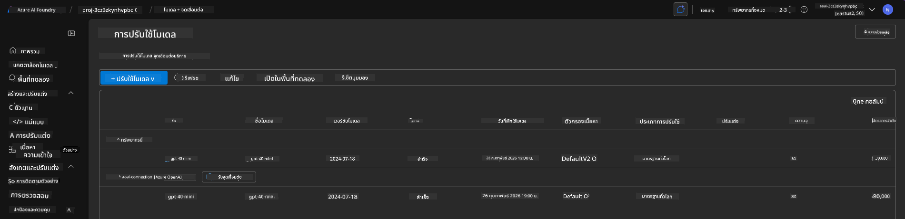
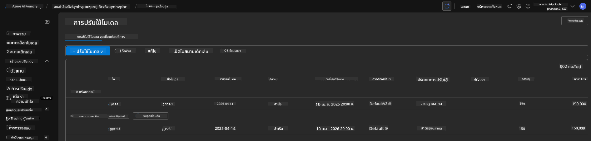

<!--
CO_OP_TRANSLATOR_METADATA:
{
  "original_hash": "6539a34c770f3ceff282370d72ee74dc",
  "translation_date": "2025-09-24T21:30:44+00:00",
  "source_file": "workshop/docs/instructions/6-Teardown-Infrastructure.md",
  "language_code": "th"
}
-->
# 6. การรื้อถอนโครงสร้างพื้นฐาน

!!! tip "เมื่อจบโมดูลนี้ คุณจะสามารถ"

    - [ ] รายการ
    - [ ] รายการ
    - [ ] รายการ

---

## แบบฝึกหัดเพิ่มเติม

ก่อนที่เราจะรื้อถอนโปรเจกต์ ใช้เวลาสักครู่เพื่อสำรวจเพิ่มเติมในแบบเปิดกว้าง

!!! danger "NITYA-TODO: ระบุคำถามหรือแนวทางที่ควรลอง"

---

## การยกเลิกโครงสร้างพื้นฐาน

1. การรื้อถอนโครงสร้างพื้นฐานทำได้ง่ายๆ ดังนี้:
      
      ```bash title="" linenums="0"
      azd down --purge
      ```
1. ตัวเลือก `--purge` จะช่วยให้สามารถลบทรัพยากร Cognitive Service ที่ถูกลบแบบนุ่มนวล (soft-deleted) ออกไปด้วย ซึ่งจะช่วยปลดล็อกโควต้าที่ทรัพยากรเหล่านี้ถือครองอยู่ เมื่อเสร็จสิ้น คุณจะเห็นบางสิ่งที่คล้ายกับนี้:
      
      ```bash title="" linenums="0"
      ? Total resources to delete: 11, are you sure you want to continue? Yes
      Deleting your resources can take some time.
      (✓) Done: Deleted resource group rg-nitya-mshack-azd
      (✓) Done: Purging Cognitive Account: aoai-3cz3zkynhvpbc

      SUCCESS: Your application was removed from Azure in 11 minutes 4 seconds.
      ```

1. (ตัวเลือก) หากคุณรันคำสั่ง `azd up` อีกครั้ง คุณจะสังเกตเห็นว่าโมเดล gpt-4.1 ถูกปรับใช้ใหม่ เนื่องจากตัวแปรสภาพแวดล้อมถูกเปลี่ยนแปลง (และบันทึกไว้) ในโฟลเดอร์ `.azure` บนเครื่องของคุณ

      นี่คือการปรับใช้โมเดล **ก่อน**:

      

      และนี่คือ **หลัง**:
      

---

