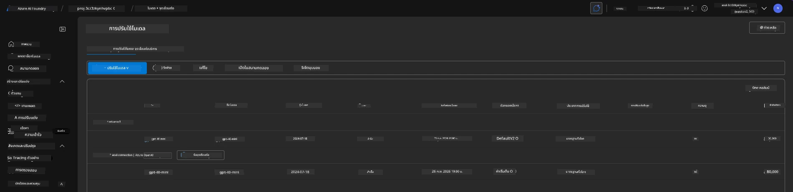
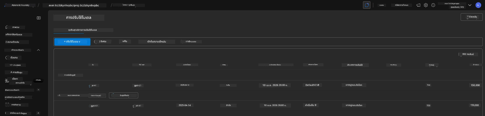

# 6. การรื้อถอนโครงสร้างพื้นฐาน

!!! tip "เมื่อสิ้นสุดโมดูลนี้คุณจะสามารถ"

    - [ ] เข้าใจความสำคัญของการล้างทรัพยากรและการจัดการค่าใช้จ่าย
    - [ ] ใช้ `azd down` ในการถอนการติดตั้งโครงสร้างพื้นฐานอย่างปลอดภัย
    - [ ] กู้คืนบริการ cognitive ที่ถูกลบแบบซอฟต์หากจำเป็น
    - [ ] **แลบ 6:** ทำความสะอาดทรัพยากร Azure และยืนยันการลบ

---

## แบบฝึกหัดเสริม

ก่อนที่เราจะรื้อถอนโปรเจกต์ ให้ใช้เวลาสักครู่ในการสำรวจแบบเปิดกว้าง

!!! info "ลองใช้คำสั่งสำรวจเหล่านี้"

    **ทดลองกับ GitHub Copilot:**
    
    1. ถามว่า: `มีแม่แบบ AZD อะไรที่ฉันสามารถลองสำหรับสถานการณ์หลายตัวแทนบ้าง?`
    2. ถามว่า: `ฉันจะปรับแต่งคำสั่งตัวแทนสำหรับกรณีใช้งานในด้านสุขภาพอย่างไร?`
    3. ถามว่า: `ตัวแปรสภาพแวดล้อมใดที่ควบคุมการเพิ่มประสิทธิภาพค่าใช้จ่าย?`
    
    **สำรวจ Azure Portal:**
    
    1. ตรวจสอบเมตริก Application Insights สำหรับการปรับใช้ของคุณ
    2. ตรวจสอบการวิเคราะห์ค่าใช้จ่ายสำหรับทรัพยากรที่จัดสรรแล้ว
    3. สำรวจ Microsoft Foundry portal agent playground อีกครั้งหนึ่ง

---

## ถอนการติดตั้งโครงสร้างพื้นฐาน

1. การรื้อถอนโครงสร้างพื้นฐานง่ายเหมือนกับ:

      ```bash title="" linenums="0"
      azd down --purge
      ```
1. ธง `--purge` จะช่วยให้ลบทรัพยากร Cognitive Service ที่ถูกลบแบบซอฟต์ด้วย ส่งผลให้ปล่อยโควต้าที่ถือโดยทรัพยากรเหล่านี้ เมื่อเสร็จสิ้นคุณจะเห็นบางอย่างเช่นนี้:

      ```bash title="" linenums="0"
      ? Total resources to delete: 11, are you sure you want to continue? Yes
      Deleting your resources can take some time.
      (✓) Done: Deleted resource group rg-nitya-mshack-azd
      (✓) Done: Purging Cognitive Account: aoai-3cz3zkynhvpbc

      SUCCESS: Your application was removed from Azure in 11 minutes 4 seconds.
      ```

1. (ไม่บังคับ) หากคุณรัน `azd up` อีกครั้ง ตอนนี้คุณจะสังเกตได้ว่าโมเดล gpt-4.1 ถูกปรับใช้เนื่องจากตัวแปรสภาพแวดล้อมถูกเปลี่ยนแปลง (และบันทึก) ในโฟลเดอร์ `.azure` ในเครื่อง

      นี่คือการปรับใช้โมเดล **ก่อนหน้า**:

      

      และนี่คือ **หลังจากนั้น**:
      

---

<!-- CO-OP TRANSLATOR DISCLAIMER START -->
**ข้อจำกัดความรับผิดชอบ**:
เอกสารนี้ได้รับการแปลโดยใช้บริการแปลด้วย AI [Co-op Translator](https://github.com/Azure/co-op-translator) แม้ว่าเราจะพยายามให้การแปลมีความถูกต้อง แต่โปรดทราบว่าการแปลโดยอัตโนมัติอาจมีข้อผิดพลาดหรือความคลาดเคลื่อนได้ เอกสารต้นฉบับในภาษาต้นทางควรถูกพิจารณาเป็นแหล่งข้อมูลที่เชื่อถือได้ สำหรับข้อมูลที่สำคัญควรใช้บริการแปลโดยมนุษย์ผู้เชี่ยวชาญ เราจะไม่รับผิดชอบต่อความเข้าใจผิดหรือการตีความผิดที่เกิดจากการใช้การแปลนี้
<!-- CO-OP TRANSLATOR DISCLAIMER END -->