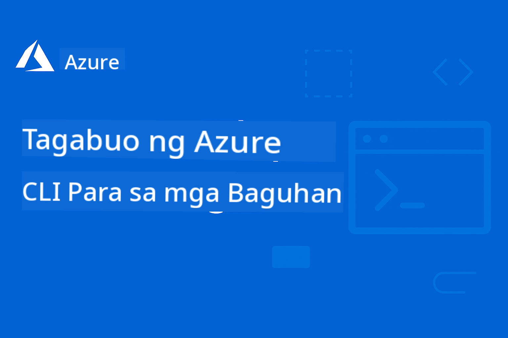

<!--
CO_OP_TRANSLATOR_METADATA:
{
  "original_hash": "c0984265b7a9357388f864c19606c80d",
  "translation_date": "2025-09-11T10:10:15+00:00",
  "source_file": "README.md",
  "language_code": "tl"
}
-->
# AZD Para sa Mga Baguhan

 

Sundin ang mga hakbang na ito upang magsimula sa paggamit ng mga resources na ito:
1. **Fork ang Repository**: I-click ang [](https://GitHub.com/microsoft/azd-for-beginners/fork)
2. **Clone ang Repository**:   `git clone https://github.com/microsoft/azd-for-beginners.git`
3. [**Sumali sa Azure Discord Communities at makipag-ugnayan sa mga eksperto at kapwa developer**](https://discord.com/invite/ByRwuEEgH4)

### 🌐 Suporta sa Maraming Wika

#### Sinusuportahan sa pamamagitan ng GitHub Action (Automated at Laging Napapanahon)

**Kung nais mong magkaroon ng karagdagang mga pagsasalin, ang mga sinusuportahang wika ay nakalista [dito](https://github.com/Azure/co-op-translator/blob/main/getting_started/supported-languages.md)**

## Panimula

Maligayang pagdating sa komprehensibong gabay para sa Azure Developer CLI (azd). Ang repository na ito ay idinisenyo upang tulungan ang mga developer sa lahat ng antas, mula sa mga estudyante hanggang sa mga propesyonal, na matutunan at ma-master ang Azure Developer CLI para sa mas epektibong cloud deployments. Ang structured learning resource na ito ay nagbibigay ng hands-on na karanasan sa Azure cloud deployments, pag-troubleshoot ng mga karaniwang isyu, at pagpapatupad ng mga best practices para sa matagumpay na AZD template deployments.

## Mga Layunin sa Pag-aaral

Sa pamamagitan ng pagtrabaho sa repository na ito, ikaw ay:
- Magiging bihasa sa mga pangunahing konsepto ng Azure Developer CLI
- Matututo kung paano mag-deploy at mag-provision ng Azure resources gamit ang Infrastructure as Code
- Magkakaroon ng kasanayan sa pag-troubleshoot ng mga karaniwang isyu sa AZD deployment
- Mauunawaan ang pre-deployment validation at capacity planning
- Makakapagpatupad ng mga best practices sa seguridad at cost optimization
- Magkakaroon ng kumpiyansa sa pag-deploy ng production-ready applications sa Azure

## Mga Resulta ng Pag-aaral

Pagkatapos makumpleto ang kursong ito, ikaw ay:
- Matagumpay na makakapag-install, makakapag-configure, at makakagamit ng Azure Developer CLI
- Makakagawa at makakapag-deploy ng mga application gamit ang AZD templates
- Makakapag-troubleshoot ng authentication, infrastructure, at deployment problems
- Makakapagsagawa ng pre-deployment checks kabilang ang capacity planning at SKU selection
- Makakapagpatupad ng monitoring, security, at cost management best practices
- Makakapag-integrate ng AZD workflows sa CI/CD pipelines

## Talaan ng Nilalaman

- [Ano ang Azure Developer CLI?](../..)
- [Mabilisang Pagsisimula](../..)
- [Dokumentasyon](../..)
- [Mga Halimbawa at Templates](../..)
- [Mga Resources](../..)
- [Pag-aambag](../..)

## Ano ang Azure Developer CLI?

Ang Azure Developer CLI (azd) ay isang developer-centric na command-line interface na nagpapabilis sa proseso ng paggawa at pag-deploy ng mga application sa Azure. Ito ay nagbibigay ng:

- **Template-based deployments** - Gumamit ng mga pre-built templates para sa mga karaniwang application patterns
- **Infrastructure as Code** - Pamahalaan ang Azure resources gamit ang Bicep o Terraform
- **Integrated workflows** - Seamless na pag-provision, pag-deploy, at pag-monitor ng mga application
- **Developer-friendly** - Optimized para sa produktibidad at karanasan ng developer

## Mabilisang Pagsisimula

### Mga Kinakailangan
- Azure subscription
- Nakainstall na Azure CLI
- Git (para sa pag-clone ng templates)

### Pag-install
```bash
# Windows (PowerShell)
powershell -ex AllSigned -c "Invoke-RestMethod 'https://aka.ms/install-azd.ps1' | Invoke-Expression"

# macOS/Linux
curl -fsSL https://aka.ms/install-azd.sh | bash
```

### Ang Iyong Unang Deployment
```bash
# Initialize a new project
azd init --template todo-nodejs-mongo

# Provision Azure resources and deploy
azd up
```

## Dokumentasyon

### Pagsisimula
- [**AZD Basics**](docs/getting-started/azd-basics.md) - Mga pangunahing konsepto at terminolohiya
- [**Installation & Setup**](docs/getting-started/installation.md) - Mga gabay sa pag-install para sa iba't ibang platform
- [**Configuration**](docs/getting-started/configuration.md) - Setup ng environment at authentication
- [**Ang Iyong Unang Proyekto**](docs/getting-started/first-project.md) - Step-by-step na tutorial

### Deployment at Provisioning
- [**Deployment Guide**](docs/deployment/deployment-guide.md) - Kumpletong workflows sa pag-deploy
- [**Provisioning Resources**](docs/deployment/provisioning.md) - Pamamahala ng Azure resources

### Pre-Deployment Checks
- [**Capacity Planning**](docs/pre-deployment/capacity-planning.md) - Validation ng kapasidad ng Azure resources
- [**SKU Selection**](docs/pre-deployment/sku-selection.md) - Pagpili ng tamang Azure SKUs
- [**Pre-flight Checks**](docs/pre-deployment/preflight-checks.md) - Automated na validation scripts

### Troubleshooting
- [**Mga Karaniwang Isyu**](docs/troubleshooting/common-issues.md) - Mga madalas na problema at solusyon
- [**Debugging Guide**](docs/troubleshooting/debugging.md) - Step-by-step na mga estratehiya sa debugging

## Mga Halimbawa at Templates
- [**Mga Halimbawa**]([examples/README.md) - Mga praktikal na halimbawa, templates, at real-world scenarios upang matutunan ang Azure Developer CLI sa pamamagitan ng hands-on na pagsasanay. Ang bawat halimbawa ay nagbibigay ng kumpletong working code, infrastructure templates, at detalyadong instruksyon para sa iba't ibang application architectures at deployment patterns.

### Hands On Lab/Workshop
- [**AZD Para sa Mga Baguhan**](workshop/README.md) - Ang workshop na ito ay magpopokus sa Get Started with AI Agents AZD template at magbibigay ng hands-on na best practice para sa pag-deploy ng Azure AI services gamit ang AZD

## Mga Resources

### Mabilisang Sanggunian
- [**Command Cheat Sheet**](resources/cheat-sheet.md) - Mahahalagang azd commands
- [**Glossary**](resources/glossary.md) - Terminolohiya ng Azure at azd
- [**FAQ**](resources/faq.md) - Mga madalas itanong
- [**Study Guide**](resources/study-guide.md) - Komprehensibong learning objectives at practice exercises

### Panlabas na Resources
- [Dokumentasyon ng Azure Developer CLI](https://learn.microsoft.com/en-us/azure/developer/azure-developer-cli/)
- [Azure Architecture Center](https://learn.microsoft.com/en-us/azure/architecture/)
- [Azure Pricing Calculator](https://azure.microsoft.com/pricing/calculator/)
- [Azure Status](https://status.azure.com/)

## Learning Path

### Para sa Mga Estudyante at Baguhan
1. Simulan sa [AZD Basics](docs/getting-started/azd-basics.md)
2. Sundin ang [Installation Guide](docs/getting-started/installation.md)
3. Kumpletuhin ang [Ang Iyong Unang Proyekto](docs/getting-started/first-project.md)
4. Magpraktis gamit ang [Simple Web App Example](../../examples/simple-web-app)

### Para sa Mga Developer
1. Suriin ang [Configuration Guide](docs/getting-started/configuration.md)
2. Pag-aralan ang [Deployment Guide](docs/deployment/deployment-guide.md)
3. Trabahuin ang [Database App Example](../../examples/database-app)
4. Tuklasin ang [Container App Example](../../examples/container-app)

### Para sa Mga DevOps Engineers
1. Masterin ang [Provisioning Resources](docs/deployment/provisioning.md)
2. Ipatupad ang [Pre-flight Checks](docs/pre-deployment/preflight-checks.md)
3. Magpraktis sa [Capacity Planning](docs/pre-deployment/capacity-planning.md)
4. Advanced na [Microservices Example](../../examples/microservices)

## Pag-aambag

Malugod naming tinatanggap ang mga kontribusyon! Pakibasa ang aming [Contributing Guide](CONTRIBUTING.md) para sa mga detalye tungkol sa:
- Paano magsumite ng mga isyu at feature requests
- Mga alituntunin sa code contribution
- Mga pagpapabuti sa dokumentasyon
- Mga pamantayan ng komunidad

## Suporta

- **Mga Isyu**: [Mag-report ng bugs at mag-request ng features](https://github.com/microsoft/azd-for-beginners/issues)
- **Mga Diskusyon**: [Microsoft Azure Discord Community Q&A at mga diskusyon](https://discord.gg/microsoft-azure)
- **Email**: Para sa mga pribadong katanungan
- **Microsoft Learn**: [Opisyal na dokumentasyon ng Azure Developer CLI](https://learn.microsoft.com/en-us/azure/developer/azure-developer-cli/)

## Lisensya

Ang proyektong ito ay lisensyado sa ilalim ng MIT License - tingnan ang [LICENSE](../../LICENSE) file para sa mga detalye.

## 🎒 Iba Pang Mga Kurso

Ang aming team ay gumagawa ng iba pang mga kurso! Tingnan ang:

- [**BAGO** Model Context Protocol (MCP) Para sa Mga Baguhan](https://github.com/microsoft/mcp-for-beginners?WT.mc_id=academic-105485-koreyst)
- [AI Agents para sa Mga Baguhan](https://github.com/microsoft/ai-agents-for-beginners?WT.mc_id=academic-105485-koreyst)
- [Generative AI para sa Mga Baguhan gamit ang .NET](https://github.com/microsoft/Generative-AI-for-beginners-dotnet?WT.mc_id=academic-105485-koreyst)
- [Generative AI para sa Mga Baguhan](https://github.com/microsoft/generative-ai-for-beginners?WT.mc_id=academic-105485-koreyst)
- [Generative AI para sa Mga Baguhan gamit ang Java](https://github.com/microsoft/generative-ai-for-beginners-java?WT.mc_id=academic-105485-koreyst)
- [ML para sa Mga Baguhan](https://aka.ms/ml-beginners?WT.mc_id=academic-105485-koreyst)
- [Data Science para sa Mga Baguhan](https://aka.ms/datascience-beginners?WT.mc_id=academic-105485-koreyst)
- [AI para sa Mga Baguhan](https://aka.ms/ai-beginners?WT.mc_id=academic-105485-koreyst)
- [Cybersecurity para sa Mga Baguhan](https://github.com/microsoft/Security-101??WT.mc_id=academic-96948-sayoung)
- [Web Dev para sa Mga Baguhan](https://aka.ms/webdev-beginners?WT.mc_id=academic-105485-koreyst)
- [IoT para sa mga Baguhan](https://aka.ms/iot-beginners?WT.mc_id=academic-105485-koreyst)
- [Pag-develop ng XR para sa mga Baguhan](https://github.com/microsoft/xr-development-for-beginners?WT.mc_id=academic-105485-koreyst)
- [Pag-master ng GitHub Copilot para sa AI Paired Programming](https://aka.ms/GitHubCopilotAI?WT.mc_id=academic-105485-koreyst)
- [Pag-master ng GitHub Copilot para sa mga C#/.NET Developer](https://github.com/microsoft/mastering-github-copilot-for-dotnet-csharp-developers?WT.mc_id=academic-105485-koreyst)
- [Piliin ang Iyong Sariling Copilot Adventure](https://github.com/microsoft/CopilotAdventures?WT.mc_id=academic-105485-koreyst)

---

**Pag-navigate**
- **Susunod na Aralin**: [Mga Pangunahing Kaalaman sa AZD](docs/getting-started/azd-basics.md)

---

**Paunawa**:  
Ang dokumentong ito ay isinalin gamit ang AI translation service na [Co-op Translator](https://github.com/Azure/co-op-translator). Bagama't sinisikap naming maging tumpak, tandaan na ang mga awtomatikong pagsasalin ay maaaring maglaman ng mga pagkakamali o hindi pagkakatugma. Ang orihinal na dokumento sa kanyang katutubong wika ang dapat ituring na opisyal na sanggunian. Para sa mahalagang impormasyon, inirerekomenda ang propesyonal na pagsasalin ng tao. Hindi kami mananagot sa anumang hindi pagkakaunawaan o maling interpretasyon na maaaring magmula sa paggamit ng pagsasaling ito.