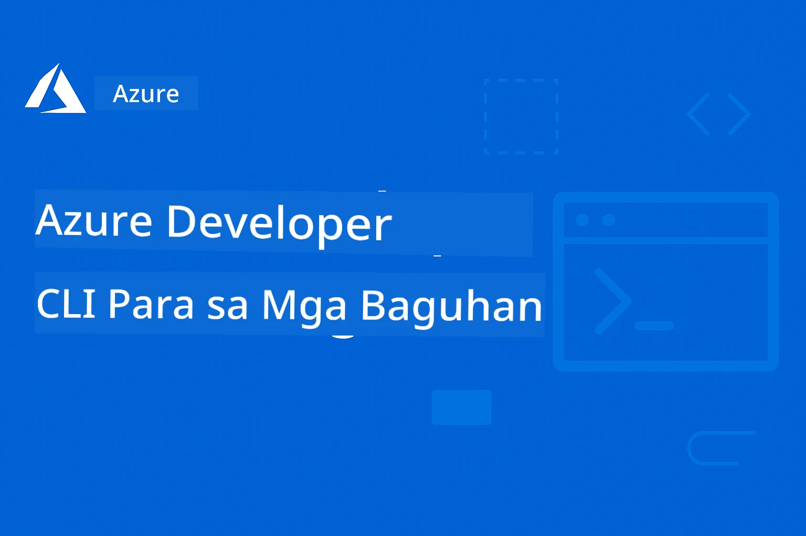

# AZD Para sa mga Nagsisimula: Isang Nakabalangkas na Paglalakbay sa Pag-aaral

 

[](https://GitHub.com/microsoft/azd-for-beginners/watchers/)
[](https://GitHub.com/microsoft/azd-for-beginners/network/)
[](https://GitHub.com/microsoft/azd-for-beginners/stargazers/)

[](https://discord.gg/microsoft-azure)
[](https://discord.gg/nTYy5BXMWG)

## Pagsisimula sa Kursong Ito

Sundin ang mga hakbang na ito upang simulan ang iyong paglalakbay sa pag-aaral ng AZD:

1. **I-fork ang Repositoryo**: I-click ang [](https://GitHub.com/microsoft/azd-for-beginners/fork)
2. **I-clone ang Repositoryo**: `git clone https://github.com/microsoft/azd-for-beginners.git`
3. **Sumali sa Komunidad**: [Azure Discord Communities](https://discord.com/invite/ByRwuEEgH4) para sa ekspertong tulong
4. **Pumili ng Landas sa Pag-aaral**: Piliin ang isang kabanata sa ibaba na angkop sa iyong antas ng karanasan

### Suporta sa Maramihang Wika

#### Automated Translations (Palaging Napapanahon)

<!-- CO-OP TRANSLATOR LANGUAGES TABLE START -->
[Arabic](../ar/README.md) | [Bengali](../bn/README.md) | [Bulgarian](../bg/README.md) | [Burmese (Myanmar)](../my/README.md) | [Chinese (Simplified)](../zh-CN/README.md) | [Chinese (Traditional, Hong Kong)](../zh-HK/README.md) | [Chinese (Traditional, Macau)](../zh-MO/README.md) | [Chinese (Traditional, Taiwan)](../zh-TW/README.md) | [Croatian](../hr/README.md) | [Czech](../cs/README.md) | [Danish](../da/README.md) | [Dutch](../nl/README.md) | [Estonian](../et/README.md) | [Finnish](../fi/README.md) | [French](../fr/README.md) | [German](../de/README.md) | [Greek](../el/README.md) | [Hebrew](../he/README.md) | [Hindi](../hi/README.md) | [Hungarian](../hu/README.md) | [Indonesian](../id/README.md) | [Italian](../it/README.md) | [Japanese](../ja/README.md) | [Kannada](../kn/README.md) | [Korean](../ko/README.md) | [Lithuanian](../lt/README.md) | [Malay](../ms/README.md) | [Malayalam](../ml/README.md) | [Marathi](../mr/README.md) | [Nepali](../ne/README.md) | [Nigerian Pidgin](../pcm/README.md) | [Norwegian](../no/README.md) | [Persian (Farsi)](../fa/README.md) | [Polish](../pl/README.md) | [Portuguese (Brazil)](../pt-BR/README.md) | [Portuguese (Portugal)](../pt-PT/README.md) | [Punjabi (Gurmukhi)](../pa/README.md) | [Romanian](../ro/README.md) | [Russian](../ru/README.md) | [Serbian (Cyrillic)](../sr/README.md) | [Slovak](../sk/README.md) | [Slovenian](../sl/README.md) | [Spanish](../es/README.md) | [Swahili](../sw/README.md) | [Swedish](../sv/README.md) | [Tagalog (Filipino)](./README.md) | [Tamil](../ta/README.md) | [Telugu](../te/README.md) | [Thai](../th/README.md) | [Turkish](../tr/README.md) | [Ukrainian](../uk/README.md) | [Urdu](../ur/README.md) | [Vietnamese](../vi/README.md)

> **Mas Gustong Mag-clone Nang Lokal?**

> Kasama sa repositoryong ito ang 50+ na pagsasalin ng wika na malaki ang ipinapataas sa laki ng pag-download. Para mag-clone nang walang mga pagsasalin, gumamit ng sparse checkout:
> ```bash
> git clone --filter=blob:none --sparse https://github.com/microsoft/AZD-for-beginners.git
> cd AZD-for-beginners
> git sparse-checkout set --no-cone '/*' '!translations' '!translated_images'
> ```
> Bibigyan ka nito ng lahat ng kailangan mo upang matapos ang kurso nang mas mabilis ang pag-download.
<!-- CO-OP TRANSLATOR LANGUAGES TABLE END -->

## Pangkalahatang-ideya ng Kurso

Maging master sa Azure Developer CLI (azd) sa pamamagitan ng mga nakabalangkas na kabanata na idinisenyo para sa progresibong pag-aaral. **Espesyal na pokus sa pag-deploy ng AI application gamit ang integrasyon ng Microsoft Foundry.**

### Bakit Mahalagang Kumuha ng Kursong Ito para sa mga Modernong Developer

Batay sa mga pananaw ng Microsoft Foundry Discord community, **45% ng mga developer ay nais gumamit ng AZD para sa mga AI workloads** ngunit nakakaranas ng mga hamon sa:
- Masalimuot na multi-service AI architectures
- Mga pinakamahusay na kasanayan sa production AI deployment  
- Integrasyon at pagsasaayos ng Azure AI service
- Pag-optimize ng gastos para sa AI workloads
- Pag-troubleshoot ng mga isyu sa AI-specific deployment

### Mga Layunin sa Pagkatuto

Sa pamamagitan ng pagkumpleto ng kursong ito, matututunan mo ang:
- **Pangunahing Kaalaman sa AZD**: Pangunahing konsepto, pag-install, at pagsasaayos
- **Mag-deploy ng AI Applications**: Gamitin ang AZD kasama ang Microsoft Foundry services
- **Ipatupad ang Infrastructure as Code**: Pamahalaan ang mga Azure resources gamit ang Bicep templates
- **Mag-troubleshoot ng Deployments**: Lutasin ang mga karaniwang problema at mag-debug
- **Mag-optimize para sa Production**: Seguridad, pag-scale, pagmamanman, at pamamahala ng gastos
- **Gumawa ng Multi-Agent Solutions**: Mag-deploy ng masalimuot na AI architectures

## 📚 Mga Kabanata sa Pag-aaral

*Pumili ng landas sa pag-aaral ayon sa iyong antas ng karanasan at mga layunin*

### 🚀 Kabanata 1: Pundasyon at Mabilis na Pagsisimula
**Mga Kinakailangan**: Azure subscription, batayang kaalaman sa command line  
**Tagal**: 30-45 minuto  
**Kumplikado**: ⭐

#### Mga Matututunan Mo
- Pag-unawa sa mga pangunahing kaalaman ng Azure Developer CLI
- Pag-install ng AZD sa iyong platform
- Ang iyong unang matagumpay na pag-deploy

#### Mga Sanggunian sa Pag-aaral
- **🎯 Magsimula Dito**: [Ano ang Azure Developer CLI?](../..)
- **📖 Teorya**: [AZD Basics](docs/getting-started/azd-basics.md) - Mga pangunahing konsepto at terminolohiya
- **⚙️ Setup**: [Installation & Setup](docs/getting-started/installation.md) - Mga gabay ayon sa platform
- **🛠️ Hands-On**: [Ang Iyong Unang Proyekto](docs/getting-started/first-project.md) - Sunud-sunod na tutorial
- **📋 Quick Reference**: [Command Cheat Sheet](resources/cheat-sheet.md)

#### Praktikal na Pagsasanay
```bash
# Mabilis na pagsusuri sa pag-install
azd version

# I-deploy ang iyong unang aplikasyon
azd init --template todo-nodejs-mongo
azd up
```

**💡 Resulta ng Kabanata**: Matagumpay na maideploy ang isang simpleng web application sa Azure gamit ang AZD

**✅ Katunayan ng Tagumpay:**
```bash
# Pagkatapos makumpleto ang Kabanata 1, dapat mong magawa ang mga sumusunod:
azd version              # Ipinapakita ang naka-install na bersyon
azd init --template todo-nodejs-mongo  # Inilulunsad ang proyekto
azd up                  # Nagde-deploy sa Azure
azd show                # Ipinapakita ang URL ng tumatakbong app
# Bumubukas ang aplikasyon sa browser at gumagana
azd down --force --purge  # Nililinis ang mga resources
```

**📊 Inilaan na Oras:** 30-45 minuto  
**📈 Antas ng Kasanayan Pagkatapos:** Kayang mag-deploy ng mga basic application nang mag-isa

**✅ Katunayan ng Tagumpay:**
```bash
# Pagkatapos matapos ang Kabanata 1, dapat kang maging capable na:
azd version              # Ipinapakita ang naka-install na bersyon
azd init --template todo-nodejs-mongo  # Ini-initialize ang proyekto
azd up                  # Nagde-deploy sa Azure
azd show                # Ipinapakita ang tumatakbong URL ng app
# Nabubuksan ang application sa browser at gumagana
azd down --force --purge  # Nililinis ang mga resources
```

**📊 Inilaan na Oras:** 30-45 minuto  
**📈 Antas ng Kasanayan Pagkatapos:** Kayang mag-deploy ng mga basic application nang mag-isa

---

### 🤖 Kabanata 2: AI-First Development (Inirerekomenda para sa mga AI Developer)
**Mga Kinakailangan**: Natapos ang Kabanata 1  
**Tagal**: 1-2 oras  
**Kumplikado**: ⭐⭐

#### Mga Matututunan Mo
- Integrasyon ng Microsoft Foundry gamit ang AZD
- Pag-deploy ng mga AI-powered application
- Pag-unawa sa mga pagsasaayos ng AI service

#### Mga Sanggunian sa Pag-aaral
- **🎯 Magsimula Dito**: [Integrasyon ng Microsoft Foundry](docs/microsoft-foundry/microsoft-foundry-integration.md)
- **📖 Mga Pattern**: [Pag-deploy ng AI Model](docs/microsoft-foundry/ai-model-deployment.md) - Mag-deploy at mag-manage ng mga AI model
- **🛠️ Workshop**: [AI Workshop Lab](docs/microsoft-foundry/ai-workshop-lab.md) - Gawing AZD-ready ang iyong AI solutions
- **🎥 Interactive Guide**: [Workshop Materials](workshop/README.md) - Pag-aaral gamit ang browser na may MkDocs * DevContainer Environment
- **📋 Mga Template**: [Microsoft Foundry Templates](../..)
- **📝 Mga Halimbawa**: [AZD Deployment Examples](examples/README.md)

#### Praktikal na Pagsasanay
```bash
# I-deploy ang iyong unang AI na aplikasyon
azd init --template azure-search-openai-demo
azd up

# Subukan ang mga karagdagang template ng AI
azd init --template openai-chat-app-quickstart
azd init --template agent-openai-python-prompty
```

**💡 Resulta ng Kabanata**: Mai-deploy at masasaayos ang isang AI-powered chat application na may RAG capabilities

**✅ Katunayan ng Tagumpay:**
```bash
# Pagkatapos ng Kabanata 2, dapat ay kaya mo nang:
azd init --template azure-search-openai-demo
azd up
# Subukan ang AI chat interface
# Magtanong at makatanggap ng mga sagot mula sa AI na may mga pinagkuhanan
# Suriin kung gumagana ang integrasyon ng paghahanap
azd monitor  # Tingnan kung nagpapakita ang Application Insights ng telemetry
azd down --force --purge
```

**📊 Inilaan na Oras:** 1-2 oras  
**📈 Antas ng Kasanayan Pagkatapos:** Kayang mag-deploy at mag-configure ng production-ready AI applications  
**💰 Kamalayan sa Gastos:** Nauunawaan ang $80-150/buwan para sa dev, $300-3500/buwan para sa production

#### 💰 Mga Pagsasaalang-alang sa Gastos para sa AI Deployments

**Development Environment (Tinatayang $80-150/buwan):**
- Azure OpenAI (Pay-as-you-go): $0-50/buwan (batay sa token usage)
- AI Search (Basic tier): $75/buwan
- Container Apps (Consumption): $0-20/buwan
- Storage (Standard): $1-5/buwan

**Production Environment (Tinatayang $300-3,500+/buwan):**
- Azure OpenAI (PTU para sa consistent performance): $3,000+/buwan O Pay-as-you-go na may mataas na volume
- AI Search (Standard tier): $250/buwan
- Container Apps (Dedicated): $50-100/buwan
- Application Insights: $5-50/buwan
- Storage (Premium): $10-50/buwan

**💡 Mga Tip sa Pag-optimize ng Gastos:**
- Gamitin ang **Free Tier** ng Azure OpenAI para sa pag-aaral (kasama ang 50,000 tokens/buwan)
- Patakbuhin ang `azd down` upang i-deallocate ang mga resources kapag hindi aktibong nagde-develop
- Magsimula sa consumption-based billing, i-upgrade lamang sa PTU para sa production
- Gamitin ang `azd provision --preview` para tantiyahin ang mga gastos bago mag-deploy
- Paganahin ang auto-scaling: magbayad lamang para sa aktwal na paggamit

**Pagsubaybay ng Gastos:**
```bash
# Suriin ang tinatayang buwanang gastos
azd provision --preview

# Subaybayan ang aktwal na gastos sa Azure Portal
az consumption budget list --resource-group <your-rg>
```

---

### ⚙️ Kabanata 3: Pagsasaayos at Authentication
**Mga Kinakailangan**: Natapos ang Kabanata 1  
**Tagal**: 45-60 minuto  
**Kumplikado**: ⭐⭐

#### Mga Matututunan Mo
- Pagsasaayos at pamamahala ng environment
- Mga pinakamahusay na gawi sa authentication at seguridad
- Pangalanan at ayusin ang mga resources

#### Mga Sanggunian sa Pag-aaral
- **📖 Configuration**: [Configuration Guide](docs/getting-started/configuration.md) - Pag-setup ng environment
- **🔐 Security**: [Authentication patterns and managed identity](docs/getting-started/authsecurity.md) - Mga pattern ng authentication
- **📝 Mga Halimbawa**: [Database App Example](examples/database-app/README.md) - Mga halimbawa ng AZD Database

#### Praktikal na Pagsasanay
- Isaayos ang maramihang environments (dev, staging, prod)
- I-setup ang managed identity authentication
- Ipatupad ang environment-specific configurations

**💡 Resulta ng Kabanata**: Mapamamahalaan ang maramihang environment nang may tamang authentication at seguridad

---

### 🏗️ Kabanata 4: Infrastructure as Code at Deployment
**Mga Kinakailangan**: Natapos ang Kabanata 1-3  
**Tagal**: 1-1.5 oras  
**Kumplikado**: ⭐⭐⭐

#### Mga Matututunan Mo
- Mga advanced na pattern sa deployment
- Infrastructure as Code gamit ang Bicep
- Estratehiya sa provisioning ng resources

#### Mga Sanggunian sa Pag-aaral
- **📖 Deployment**: [Deployment Guide](docs/deployment/deployment-guide.md) - Kompleto na mga workflow
- **🏗️ Provisioning**: [Provisioning Resources](docs/deployment/provisioning.md) - Pamamahala ng Azure resources
- **📝 Mga Halimbawa**: [Container App Example](../../examples/container-app) - Containerized deployments

#### Praktikal na Pagsasanay
- Gumawa ng custom na Bicep templates
- Mag-deploy ng multi-service applications
- Ipatupad ang blue-green deployment strategies

**💡 Resulta ng Kabanata**: Ma-deploy ang masalimuot na multi-service applications gamit ang custom infrastructure templates

---

### 🎯 Kabanata 5: Multi-Agent AI Solutions (Advanced)
**Mga Kinakailangan**: Natapos ang Kabanata 1-2  
**Tagal**: 2-3 oras  
**Kumplikado**: ⭐⭐⭐⭐
#### Ano ang Iyong Matututunan
- Mga pattern ng multi-agent architecture
- Orkestrasyon at koordinasyon ng mga agent
- Mga production-ready na deployment ng AI

#### Mga Mapagkukunan sa Pagkatuto
- **🤖 Tampok na Proyekto**: [Retail Multi-Agent Solution](examples/retail-scenario.md) - Kumpletong implementasyon
- **🛠️ ARM Templates**: [ARM Template Package](../../examples/retail-multiagent-arm-template) - Isang-click na deployment
- **📖 Arkitektura**: [Mga pattern ng koordinasyon ng multi-agent](/docs/pre-deployment/coordination-patterns.md) - Mga pattern

#### Praktikal na Mga Ehersisyo
```bash
# I-deploy ang kumpletong retail multi-agent na solusyon
cd examples/retail-multiagent-arm-template
./deploy.sh

# Suriin ang mga konfigurasyon ng ahente
az deployment group show --resource-group <rg-name> --name <deployment-name>
```

**💡 Kinalabasan ng Kabanata**: I-deploy at pamahalaan ang production-ready na multi-agent AI solution gamit ang Customer at Inventory agents

---

### 🔍 Kabanata 6: Pre-Deployment Validation & Planning
**Mga Kinakailangan**: Nakumpleto ang Kabanata 4  
**Tagal**: 1 oras  
**Kumplikasyon**: ⭐⭐

#### Ano ang Iyong Matututunan
- Pagpaplano ng kapasidad at pag-validate ng mga resource
- Mga estratehiya sa pagpili ng SKU
- Mga pre-flight na tsek at automation

#### Mga Mapagkukunan sa Pagkatuto
- **📊 Pagpaplano**: [Capacity Planning](docs/pre-deployment/capacity-planning.md) - Pag-validate ng mga resource
- **💰 Pagpili**: [SKU Selection](docs/pre-deployment/sku-selection.md) - Mga cost-effective na pagpipilian
- **✅ Pag-validate**: [Pre-flight Checks](docs/pre-deployment/preflight-checks.md) - Automated scripts

#### Praktikal na Mga Ehersisyo
- Patakbuhin ang mga script ng pag-validate ng kapasidad
- I-optimize ang mga pagpili ng SKU para sa gastos
- Ipatupad ang automated na mga pre-deployment check

**💡 Kinalabasan ng Kabanata**: I-validate at i-optimize ang mga deployment bago isagawa

---

### 🚨 Kabanata 7: Troubleshooting & Debugging
**Mga Kinakailangan**: Nakumpleto ang anumang deployment chapter  
**Tagal**: 1-1.5 oras  
**Kumplikasyon**: ⭐⭐

#### Ano ang Iyong Matututunan
- Sistematikong mga pamamaraan sa debugging
- Mga karaniwang isyu at solusyon
- Pag-troubleshoot na specific sa AI

#### Mga Mapagkukunan sa Pagkatuto
- **🔧 Mga Karaniwang Isyu**: [Common Issues](docs/troubleshooting/common-issues.md) - FAQ at mga solusyon
- **🕵️ Debugging**: [Debugging Guide](docs/troubleshooting/debugging.md) - Mga step-by-step na estratehiya
- **🤖 AI Isyu**: [AI-Specific Troubleshooting](docs/troubleshooting/ai-troubleshooting.md) - Mga problema sa AI service

#### Praktikal na Mga Ehersisyo
- Mag-diagnose ng mga pagkabigo sa deployment
- Lutasin ang mga isyu sa authentication
- I-debug ang konektividad ng AI service

**💡 Kinalabasan ng Kabanata**: Magawang mag-diagnose at mag-resolba nang independyente ng mga karaniwang isyu sa deployment

---

### 🏢 Kabanata 8: Production & Enterprise Patterns
**Mga Kinakailangan**: Nakumpleto ang Mga Kabanata 1-4  
**Tagal**: 2-3 oras  
**Kumplikasyon**: ⭐⭐⭐⭐

#### Ano ang Iyong Matututunan
- Mga estratehiya sa production deployment
- Mga pattern ng seguridad para sa enterprise
- Pagmomonitor at pag-optimize ng gastos

#### Mga Mapagkukunan sa Pagkatuto
- **🏭 Produksyon**: [Production AI Best Practices](docs/microsoft-foundry/production-ai-practices.md) - Mga pattern ng enterprise
- **📝 Mga Halimbawa**: [Microservices Example](../../examples/microservices) - Mga kumplikadong arkitektura
- **📊 Monitoring**: [Application Insights integration](docs/pre-deployment/application-insights.md) - Pag-momonitor

#### Praktikal na Mga Ehersisyo
- Ipatupad ang mga pattern ng seguridad ng enterprise
- Mag-set up ng komprehensibong monitoring
- Mag-deploy sa production nang may wastong pamamahala

**💡 Kinalabasan ng Kabanata**: Mag-deploy ng mga aplikasyong handa na para sa enterprise na may buong kakayahan sa production

---

## 🎓 Pangkalahatang Pagsilip sa Workshop: Hands-On Learning Experience

> **⚠️ KALAGAYAN NG WORKSHOP: Aktibong Pagbuo**  
> Ang mga materyales sa workshop ay kasalukuyang ginagawa at pina-fine tune. Gumagana na ang mga pangunahing module, ngunit may ilang advanced na bahagi na hindi pa kumpleto. Aktibo kaming nagtatrabaho upang makumpleto ang lahat ng nilalaman. [Subaybayan ang progreso →](workshop/README.md)

### Interactive Workshop Materials
**Komprehensibong hands-on learning gamit ang browser-based na mga tool at guided exercises**

Nagbibigay ang aming workshop materials ng isang istrukturadong, interactive na karanasan sa pagkatuto na sumusuporta sa chapter-based curriculum sa itaas. Ang workshop ay dinisenyo para sa parehong self-paced learning at instructor-led sessions.

#### 🛠️ Mga Tampok ng Workshop
- **Browser-Based Interface**: Kumpletong MkDocs-powered workshop na may paghahanap, pag-copy, at mga tema
- **GitHub Codespaces Integration**: Isang-click na pag-setup ng development environment
- **Structured Learning Path**: 7-step guided exercises (3.5 oras kabuuan)
- **Discovery → Deployment → Customization**: Progressive na metodolohiya
- **Interactive DevContainer Environment**: Pre-configured na mga tool at dependencies

#### 📚 Istruktura ng Workshop
Sinusunod ng workshop ang metodolohiyang **Discovery → Deployment → Customization**:

1. **Discovery Phase** (45 minuto)
   - Tuklasin ang mga Microsoft Foundry template at serbisyo
   - Unawain ang mga pattern ng multi-agent architecture
   - Suriin ang mga kinakailangan at prerequisites para sa deployment

2. **Deployment Phase** (2 oras)
   - Hands-on deployment ng AI applications gamit ang AZD
   - I-configure ang Azure AI services at endpoints
   - Ipatupad ang security at authentication patterns

3. **Customization Phase** (45 minuto)
   - Baguhin ang mga aplikasyon para sa mga partikular na gamit
   - I-optimize para sa production deployment
   - Ipatupad ang monitoring at pamamahala ng gastos

#### 🚀 Pagsisimula sa Workshop
```bash
# Opsyon 1: GitHub Codespaces (Inirerekomenda)
# I-click ang "Code" → "Create codespace on main" sa repositoryo

# Opsyon 2: Lokal na Pag-unlad
git clone https://github.com/microsoft/azd-for-beginners.git
cd azd-for-beginners/workshop
# Sundin ang mga tagubilin sa pag-setup sa workshop/README.md
```

#### 🎯 Mga Kinalabasan sa Pagkatuto ng Workshop
Sa pagkumpleto ng workshop, ang mga kalahok ay:
- **Magde-deploy ng Production AI Applications**: Gamit ang AZD at Microsoft Foundry services
- **Magmamaster ng Multi-Agent Architectures**: Ipatupad ang coordinated AI agent solutions
- **Magpapatupad ng Security Best Practices**: I-configure ang authentication at access control
- **Mag-optimize para sa Scale**: Magdisenyo ng cost-effective at performant na mga deployment
- **Mag-troubleshoot ng Deployments**: Mag-resolba ng mga karaniwang isyu nang independyente

#### 📖 Mga Mapagkukunan ng Workshop
- **🎥 Interactive Guide**: [Workshop Materials](workshop/README.md) - Browser-based na learning environment
- **📋 Step-by-Step Instructions**: [Guided Exercises](../../workshop/docs/instructions) - Detalyadong walkthroughs
- **🛠️ AI Workshop Lab**: [AI Workshop Lab](docs/microsoft-foundry/ai-workshop-lab.md) - Mga exercise na nakatuon sa AI
- **💡 Quick Start**: [Workshop Setup Guide](workshop/README.md#quick-start) - Konfigurasyon ng environment

**Perpekto para sa**: Corporate training, mga kurso sa unibersidad, self-paced learning, at developer bootcamps.

---

## 📖 Ano ang Azure Developer CLI?

Ang Azure Developer CLI (azd) ay isang developer-centric na command-line interface na nagpapabilis sa proseso ng pagbuo at pag-deploy ng mga aplikasyon sa Azure. Ito ay nagbibigay ng:

- **Template-based na deployment** - Gumamit ng mga pre-built na template para sa mga karaniwang application pattern
- **Infrastructure as Code** - Pamahalaan ang mga Azure resource gamit ang Bicep o Terraform  
- **Integrated workflows** - Makinis na pag-provision, deployment, at pag-momonitor ng mga aplikasyon
- **Developer-friendly** - Na-optimize para sa productivity at karanasan ng developer

### **AZD + Microsoft Foundry: Perpekto para sa AI Deployments**

**Bakit AZD para sa AI Solutions?** Tinugunan ng AZD ang mga pangunahing hamon na kinakaharap ng mga AI developer:

- **AI-Ready na template** - Mga pre-configured na template para sa Azure OpenAI, Cognitive Services, at ML workloads
- **Secure na AI Deployment** - Mga built-in na security pattern para sa AI services, API keys, at model endpoints  
- **Production AI Patterns** - Pinakamahusay na mga practice para sa scalable, cost-effective na AI application deployments
- **End-to-End AI Workflows** - Mula sa pagbuo ng modelo hanggang production deployment gamit ang tamang monitoring
- **Cost Optimization** - Matalinong alokasyon ng mga resource at scaling strategy para sa AI workloads
- **Microsoft Foundry Integration** - Tuloy-tuloy na koneksyon sa Microsoft Foundry model catalog at endpoints

---

## 🎯 Templates at Halimbawang Library

### Tampok: Microsoft Foundry Templates
**Simulan dito kung nag-de-deploy ka ng AI applications!**

> **Tandaan:** Ipinapakita ng mga template na ito ang iba't ibang AI pattern. Ang ilan ay external Azure Samples, ang iba nama'y lokal na implementasyon.

| Template | Kabanata | Kumplikasyon | Mga Serbisyo | Uri |
|----------|---------|------------|----------|------|
| [**Get started with AI chat**](https://github.com/Azure-Samples/get-started-with-ai-chat) | Kabanata 2 | ⭐⭐ | AzureOpenAI + Azure AI Model Inference API + Azure AI Search + Azure Container Apps + Application Insights | External |
| [**Get started with AI agents**](https://github.com/Azure-Samples/get-started-with-ai-agents) | Kabanata 2 | ⭐⭐ | Azure AI Agent Service + AzureOpenAI + Azure AI Search + Azure Container Apps + Application Insights| External |
| [**Azure Search + OpenAI Demo**](https://github.com/Azure-Samples/azure-search-openai-demo) | Kabanata 2 | ⭐⭐ | AzureOpenAI + Azure AI Search + App Service + Storage | External |
| [**OpenAI Chat App Quickstart**](https://github.com/Azure-Samples/openai-chat-app-quickstart) | Kabanata 2 | ⭐ | AzureOpenAI + Container Apps + Application Insights | External |
| [**Agent OpenAI Python Prompty**](https://github.com/Azure-Samples/agent-openai-python-prompty) | Kabanata 5 | ⭐⭐⭐ | AzureOpenAI + Azure Functions + Prompty | External |
| [**Contoso Chat RAG**](https://github.com/Azure-Samples/contoso-chat) | Kabanata 8 | ⭐⭐⭐⭐ | AzureOpenAI + AI Search + Cosmos DB + Container Apps | External |
| [**Retail Multi-Agent Solution**](examples/retail-scenario.md) | Kabanata 5 | ⭐⭐⭐⭐ | AzureOpenAI + AI Search + Storage + Container Apps + Cosmos DB | **Lokal** |

### Tampok: Kumpletong Learning Scenarios
**Mga template ng production-ready na aplikasyon na naka-map sa mga kabanata ng pagkatuto**

| Template | Kabanata ng Pagkatuto | Kumplikasyon | Pangunahing Natutunan |
|----------|------------------|------------|--------------|
| [**openai-chat-app-quickstart**](https://github.com/Azure-Samples/openai-chat-app-quickstart) | Kabanata 2 | ⭐ | Mga batayang pattern ng AI deployment |
| [**azure-search-openai-demo**](https://github.com/Azure-Samples/azure-search-openai-demo) | Kabanata 2 | ⭐⭐ | RAG implementation gamit ang Azure AI Search |
| [**ai-document-processing**](https://github.com/Azure-Samples/ai-document-processing) | Kabanata 4 | ⭐⭐ | Integrasyon ng Document Intelligence |
| [**agent-openai-python-prompty**](https://github.com/Azure-Samples/agent-openai-python-prompty) | Kabanata 5 | ⭐⭐⭐ | Agent framework at function calling |
| [**contoso-chat**](https://github.com/Azure-Samples/contoso-chat) | Kabanata 8 | ⭐⭐⭐ | Enterprise AI orchestration |
| [**retail-multi-agent-solution**](examples/retail-scenario.md) | Kabanata 5 | ⭐⭐⭐⭐ | Multi-agent architecture gamit ang Customer at Inventory agents |

### Pagkatuto sa Pamamagitan ng Uri ng Halimbawa

> **📌 Lokal vs. External na Mga Halimbawa:**  
> **Lokal na Mga Halimbawa** (sa repo na ito) = Handa nang gamitin agad  
> **External na Mga Halimbawa** (Azure Samples) = Kailangan i-clone mula sa mga nakalink na repositories

#### Lokal na Mga Halimbawa (Handa nang Gamitin)
- [**Retail Multi-Agent Solution**](examples/retail-scenario.md) - Kumpletong production-ready implementation kasama ang ARM templates
  - Multi-agent architecture (Customer + Inventory agents)
  - Komprehensibong monitoring at pagsusuri
  - Isang-click na deployment gamit ang ARM template

#### Lokal na Mga Halimbawa - Container Applications (Mga Kabanata 2-5)
**Komprehensibong mga halimbawa ng container deployment sa repository na ito:**
- [**Container App Examples**](examples/container-app/README.md) - Kumpletong gabay sa containerized deployments
  - [Simple Flask API](../../examples/container-app/simple-flask-api) - Basic REST API na may scale-to-zero
  - [Microservices Architecture](../../examples/container-app/microservices) - Production-ready multi-service deployment
  - Quick Start, Production, at Advanced deployment pattern
  - Mga gabay sa monitoring, seguridad, at pag-optimize ng gastos

#### External na Mga Halimbawa - Simple Applications (Mga Kabanata 1-2)
**I-clone ang mga Azure Samples repo na ito para makapagsimula:**
- [Simple Web App - Node.js + MongoDB](https://github.com/Azure-Samples/todo-nodejs-mongo) - Mga batayang pattern sa deployment
- [Static Website - React SPA](https://github.com/Azure-Samples/todo-csharp-sql-swa-func) - Static content deployment
- [Container App - Python Flask](https://github.com/Azure-Samples/container-apps-store-api-microservice) - REST API deployment

#### External na Mga Halimbawa - Database Integration (Mga Kabanata 3-4)  
- [Database App - C# + SQL](https://github.com/Azure-Samples/todo-csharp-sql) - Mga pattern ng connectivity sa database
- [Functions + Cosmos DB](https://github.com/Azure-Samples/todo-python-mongo-swa-func) - Serverless data workflow

#### External na Mga Halimbawa - Advanced Patterns (Mga Kabanata 4-8)
- [Java Microservices](https://github.com/Azure-Samples/java-microservices-aca-lab) - Multi-service mga arkitektura
- [Container Apps Jobs](https://github.com/Azure-Samples/container-apps-jobs) - Background processing  
- [Enterprise ML Pipeline](https://github.com/Azure-Samples/mlops-v2) - Production-ready ML pattern

### Panlabas na Koleksyon ng Template
- [**Opisyal na AZD Template Gallery**](https://azure.github.io/awesome-azd/) - Piniling koleksyon ng opisyal at mga community template
- [**Mga Template ng Azure Developer CLI**](https://learn.microsoft.com/en-us/azure/developer/azure-developer-cli/azd-templates) - Dokumentasyon ng template ng Microsoft Learn
- [**Direktoryo ng Mga Halimbawa**](examples/README.md) - Lokal na mga halimbawa sa pag-aaral na may detalyadong mga paliwanag

---

## 📚 Mga Mapagkukunan sa Pag-aaral at Mga Sanggunian

### Mabilisang Mga Sanggunian
- [**Command Cheat Sheet**](resources/cheat-sheet.md) - Mahahalagang azd na mga utos na inayos ayon sa kabanata
- [**Glossary**](resources/glossary.md) - Terminolohiyang Azure at azd  
- [**FAQ**](resources/faq.md) - Mga karaniwang tanong na inayos ayon sa kabanata sa pag-aaral
- [**Study Guide**](resources/study-guide.md) - Komprehensibong mga ehersisyo sa pagsasanay

### Mga Hands-On na Workshop
- [**AI Workshop Lab**](docs/microsoft-foundry/ai-workshop-lab.md) - Gawing ma-deploy sa AZD ang iyong mga solusyon sa AI (2-3 oras)
- [**Interactive Workshop Guide**](workshop/README.md) - Workshop na naka-base sa browser gamit ang MkDocs at DevContainer Environment
- [**Structured Learning Path**](../../workshop/docs/instructions) - 7-hakbang na mga guided na ehersisyo (Discovery → Deployment → Customization)
- [**AZD For Beginners Workshop**](workshop/README.md) - Kumpletong mga materyales ng hands-on workshop na may pagsasama sa GitHub Codespaces

### Mga Panlabas na Mapagkukunang Pang-edukasyon
- Dokumentasyon ng Azure Developer CLI
- Azure Architecture Center
- Azure Pricing Calculator
- Azure Status

---

## 🔧 Mabilisang Gabay sa Pag-aayos ng Problema

**Karaniwang mga isyu na hinaharap ng mga nagsisimula at agarang mga solusyon:**

### ❌ "azd: command not found"

```bash
# I-install muna ang AZD
# Windows (PowerShell):
winget install microsoft.azd

# macOS:
brew tap azure/azd && brew install azd

# Linux:
curl -fsSL https://aka.ms/install-azd.sh | bash

# Suriin ang pag-install
azd version
```

### ❌ "No subscription found" o "Subscription not set"

```bash
# Ilista ang mga magagamit na subscription
az account list --output table

# Itakda ang default na subscription
az account set --subscription "<subscription-id-or-name>"

# Itakda para sa AZD na kapaligiran
azd env set AZURE_SUBSCRIPTION_ID "<subscription-id>"

# Patunayan
az account show
```

### ❌ "InsufficientQuota" o "Quota exceeded"

```bash
# Subukan ang iba't ibang Azure region
azd env set AZURE_LOCATION "westus2"
azd up

# O gumamit ng mas maliliit na SKU sa development
# I-edit ang infra/main.parameters.json:
{
  "sku": "B1"  // Instead of "P1V2"
}
```

### ❌ Nabigo ang "azd up" sa kalagitnaan ng proseso

```bash
# Opsyon 1: Linisin at subukang muli
azd down --force --purge
azd up

# Opsyon 2: Ayusin lamang ang imprastruktura
azd provision

# Opsyon 3: Suriin ang mga detalyadong tala
azd show
azd logs
```

### ❌ "Authentication failed" o "Token expired"

```bash
# Muling i-authenticate
az logout
az login

azd auth logout
azd auth login

# Tiyaking ang pagsasanay
az account show
```

### ❌ "Resource already exists" o mga salungatan sa pangalan

```bash
# Ang AZD ay gumagawa ng mga natatanging pangalan, ngunit kung may kaguluhan:
azd down --force --purge

# Pagkatapos subukang muli gamit ang bagong kapaligiran
azd env new dev-v2
azd up
```

### ❌ Mahabang oras ng pag-deploy ng template

**Karaniwang oras ng paghihintay:**
- Simpleng web app: 5-10 minuto
- App na may database: 10-15 minuto
- Mga aplikasyon ng AI: 15-25 minuto (mabagal ang provisioning ng OpenAI)

```bash
# Suriin ang progreso
azd show

# Kung natigil ng higit sa 30 minuto, tingnan ang Azure Portal:
azd monitor
# Hanapin ang mga nabigong deployment
```

### ❌ "Permission denied" o "Forbidden"

```bash
# Suriin ang iyong Azure na papel
az role assignment list --assignee $(az account show --query user.name -o tsv)

# Kailangan mo ng hindi bababa sa "Contributor" na papel
# Hilingin sa iyong Azure admin na magbigay ng:
# - Contributor (para sa mga resources)
# - User Access Administrator (para sa mga pagtatalaga ng papel)
```

### ❌ Hindi makita ang URL ng na-deploy na aplikasyon

```bash
# Ipakita ang lahat ng mga endpoint ng serbisyo
azd show

# O buksan ang Azure Portal
azd monitor

# Suriin ang partikular na serbisyo
azd env get-values
# Hanapin ang mga *_URL na variable
```

### 📚 Kumpletong Mga Mapagkukunan sa Pag-aayos ng Problema

- **Gabay sa Karaniwang Mga Isyu:** [Detalyadong mga Solusyon](docs/troubleshooting/common-issues.md)
- **Mga Isyu na Tungkulin sa AI:** [Pag-aayos ng Problema sa AI](docs/troubleshooting/ai-troubleshooting.md)
- **Gabay sa Pag-debug:** [Hakbang-hakbang na Pag-debug](docs/troubleshooting/debugging.md)
- **Humingi ng Tulong:** [Azure Discord](https://discord.gg/microsoft-azure) #azure-developer-cli

---

## 🔧 Mabilisang Gabay sa Pag-aayos ng Problema

**Karaniwang mga isyu na hinaharap ng mga nagsisimula at agarang mga solusyon:**

<details>
<summary><strong>❌ "azd: command not found"</strong></summary>

```bash
# I-install muna ang AZD
# Windows (PowerShell):
winget install microsoft.azd

# macOS:
brew tap azure/azd && brew install azd

# Linux:
curl -fsSL https://aka.ms/install-azd.sh | bash

# Suriin ang pag-install
azd version
```
</details>

<details>
<summary><strong>❌ "No subscription found" o "Subscription not set"</strong></summary>

```bash
# Ilan ang mga magagamit na subscription
az account list --output table

# Itakda ang default na subscription
az account set --subscription "<subscription-id-or-name>"

# Itakda para sa AZD na kapaligiran
azd env set AZURE_SUBSCRIPTION_ID "<subscription-id>"

# Beripikahin
az account show
```
</details>

<details>
<summary><strong>❌ "InsufficientQuota" o "Quota exceeded"</strong></summary>

```bash
# Subukan ang iba't ibang rehiyon ng Azure
azd env set AZURE_LOCATION "westus2"
azd up

# O gumamit ng mas maliliit na SKU sa pag-develop
# I-edit ang infra/main.parameters.json:
{
  "sku": "B1"  // Instead of "P1V2"
}
```
</details>

<details>
<summary><strong>❌ Nabigo ang "azd up" sa kalagitnaan ng proseso</strong></summary>

```bash
# Opsyon 1: Linisin at subukan muli
azd down --force --purge
azd up

# Opsyon 2: Ayusin lamang ang imprastruktura
azd provision

# Opsyon 3: Suriin ang detalyadong mga log
azd show
azd logs
```
</details>

<details>
<summary><strong>❌ "Authentication failed" o "Token expired"</strong></summary>

```bash
# Muling patunayan ang pagkakakilanlan
az logout
az login

azd auth logout
azd auth login

# Beripikahin ang pagpapatunay
az account show
```
</details>

<details>
<summary><strong>❌ "Resource already exists" o mga salungatan sa pangalan</strong></summary>

```bash
# Ang AZD ay lumilikha ng natatanging mga pangalan, ngunit kung magkakaroon ng conflict:
azd down --force --purge

# Pagkatapos subukang muli gamit ang bagong environment
azd env new dev-v2
azd up
```
</details>

<details>
<summary><strong>❌ Mahabang oras ng pag-deploy ng template</strong></summary>

**Karaniwang oras ng paghihintay:**
- Simpleng web app: 5-10 minuto
- App na may database: 10-15 minuto
- Mga aplikasyon ng AI: 15-25 minuto (mabagal ang provisioning ng OpenAI)

```bash
# Suriin ang progreso
azd show

# Kung na-stuck ng higit sa 30 minuto, tingnan ang Azure Portal:
azd monitor
# Hanapin ang mga nabigong deployment
```
</details>

<details>
<summary><strong>❌ "Permission denied" o "Forbidden"</strong></summary>

```bash
# Suriin ang iyong Azure na papel
az role assignment list --assignee $(az account show --query user.name -o tsv)

# Kailangan mo ng hindi bababa sa papel na "Contributor"
# Hilingin sa iyong Azure admin na bigyan ng:
# - Contributor (para sa mga resources)
# - User Access Administrator (para sa mga role assignments)
```
</details>

<details>
<summary><strong>❌ Hindi makita ang URL ng na-deploy na aplikasyon</strong></summary>

```bash
# Ipakita ang lahat ng mga endpoint ng serbisyo
azd show

# O buksan ang Azure Portal
azd monitor

# Suriin ang partikular na serbisyo
azd env get-values
# Hanapin ang mga *_URL na variable
```
</details>

### 📚 Kumpletong Mga Mapagkukunan sa Pag-aayos ng Problema

- **Gabay sa Karaniwang Mga Isyu:** [Detalyadong mga Solusyon](docs/troubleshooting/common-issues.md)
- **Mga Isyu na Tungkulin sa AI:** [Pag-aayos ng Problema sa AI](docs/troubleshooting/ai-troubleshooting.md)
- **Gabay sa Pag-debug:** [Hakbang-hakbang na Pag-debug](docs/troubleshooting/debugging.md)
- **Humingi ng Tulong:** [Azure Discord](https://discord.gg/microsoft-azure) #azure-developer-cli

---

## 🎓 Pagtatapos ng Kurso at Sertipikasyon

### Pagsubaybay ng Progreso
Subaybayan ang iyong progreso sa pag-aaral sa bawat kabanata:

- [ ] **Kabanata 1**: Pundasyon at Mabilisang Panimula ✅
- [ ] **Kabanata 2**: AI-First Development ✅  
- [ ] **Kabanata 3**: Konpigurasyon at Pagpapatunay ✅
- [ ] **Kabanata 4**: Infrastructure as Code at Deployment ✅
- [ ] **Kabanata 5**: Multi-Agent AI Solutions ✅
- [ ] **Kabanata 6**: Pre-Deployment Validation at Pagpaplano ✅
- [ ] **Kabanata 7**: Pag-aayos ng Problema at Pag-debug ✅
- [ ] **Kabanata 8**: Kalakaran sa Produksyon at Enterprise ✅

### Pagpapatunay sa Pagkatuto
Pagkatapos kumpletuhin ang bawat kabanata, patunayan ang iyong kaalaman sa pamamagitan ng:
1. **Praktikal na Ehersisyo**: Kumpletuhin ang hands-on deployment ng kabanata
2. **Pagsusuri sa Kaalaman**: Suriin ang seksyon ng FAQ para sa iyong kabanata
3. **Talakayan sa Komunidad**: Ibahagi ang iyong karanasan sa Azure Discord
4. **Susunod na Kabanata**: Lumipat sa susunod na antas ng kahirapan

### Mga Benepisyo ng Pagtatapos ng Kurso
Kapag natapos mo ang lahat ng kabanata, magkakaroon ka ng:
- **Karanasan sa Produksyon**: Na-deploy na totoong mga aplikasyon ng AI sa Azure
- **Propesyonal na Kasanayan**: Kakayahan sa enterprise-ready deployment  
- **Pagkilala sa Komunidad**: Aktibong miyembro ng Azure developer community
- **Pagsulong sa Karera**: In-demand na kasanayan sa AZD at AI deployment

---

## 🤝 Komunidad at Suporta

### Kumuha ng Tulong at Suporta
- **Mga Teknikal na Isyu**: [I-report ang mga bugs at humiling ng mga feature](https://github.com/microsoft/azd-for-beginners/issues)
- **Mga Tanong sa Pag-aaral**: [Microsoft Azure Discord Community](https://discord.gg/microsoft-azure) at [](https://discord.gg/nTYy5BXMWG)
- **Tulong na Tungkulin sa AI**: Sumali sa [](https://discord.gg/nTYy5BXMWG)
- **Dokumentasyon**: [Opisyal na dokumentasyon ng Azure Developer CLI](https://learn.microsoft.com/en-us/azure/developer/azure-developer-cli/)

### Mga Pananaw ng Komunidad mula sa Microsoft Foundry Discord

**Mga Kamakailang Resulta ng Poll mula sa #Azure Channel:**
- **45%** ng mga developer ay nais gamitin ang AZD para sa mga AI workload
- **Pangunahing hamon**: Mga multi-service deployment, pamamahala ng kredensyal, kahandaan sa produksyon  
- **Pinakahiniling**: Mga AI-specific na template, mga gabay sa pag-aayos ng problema, pinakamahusay na gawi

**Sumali sa aming komunidad upang:**
- Ibahagi ang iyong mga karanasan sa AZD + AI at humingi ng tulong
- Makakuha ng maagang preview ng mga bagong AI template
- Mag-ambag sa mga pinakamahusay na gawi sa AI deployment
- Impluwensyahan ang hinaharap na pag-develop ng AI + AZD na feature

### Pag-aambag sa Kurso
Malugod naming tinatanggap ang mga kontribusyon! Mangyaring basahin ang aming [Contributing Guide](CONTRIBUTING.md) para sa mga detalye tungkol sa:
- **Pagpapahusay ng Nilalaman**: Paigtingin ang mga umiiral na kabanata at mga halimbawa
- **Mga Bagong Halimbawa**: Magdagdag ng mga totoong senaryo at template  
- **Pagsasalin**: Tumulong panatilihin ang suporta sa maraming wika
- **Ulat ng Bug**: Pahusayin ang katumpakan at kalinawan
- **Mga Pamantayan sa Komunidad**: Sundin ang aming inklusibong mga gabay sa komunidad

---

## 📄 Impormasyon sa Kurso

### Lisensya
Ang proyektong ito ay lisensyado sa ilalim ng MIT License - tingnan ang [LICENSE](../../LICENSE) file para sa mga detalye.

### Kaugnay na Mga Mapagkukunan sa Pag-aaral ng Microsoft

Ang aming koponan ay gumagawa ng iba pang mga komprehensibong kurso sa pag-aaral:

<!-- CO-OP TRANSLATOR OTHER COURSES START -->
### LangChain
[](https://aka.ms/langchain4j-for-beginners)
[](https://aka.ms/langchainjs-for-beginners?WT.mc_id=m365-94501-dwahlin)
[](https://github.com/microsoft/langchain-for-beginners?WT.mc_id=m365-94501-dwahlin)
---

### Azure / Edge / MCP / Agents
[](https://github.com/microsoft/AZD-for-beginners?WT.mc_id=academic-105485-koreyst)
[](https://github.com/microsoft/edgeai-for-beginners?WT.mc_id=academic-105485-koreyst)
[](https://github.com/microsoft/mcp-for-beginners?WT.mc_id=academic-105485-koreyst)
[](https://github.com/microsoft/ai-agents-for-beginners?WT.mc_id=academic-105485-koreyst)

---
 
### Generative AI Series
[](https://github.com/microsoft/generative-ai-for-beginners?WT.mc_id=academic-105485-koreyst)
[-9333EA?style=for-the-badge&labelColor=E5E7EB&color=9333EA)](https://github.com/microsoft/Generative-AI-for-beginners-dotnet?WT.mc_id=academic-105485-koreyst)
[-C084FC?style=for-the-badge&labelColor=E5E7EB&color=C084FC)](https://github.com/microsoft/generative-ai-for-beginners-java?WT.mc_id=academic-105485-koreyst)
[-E879F9?style=for-the-badge&labelColor=E5E7EB&color=E879F9)](https://github.com/microsoft/generative-ai-with-javascript?WT.mc_id=academic-105485-koreyst)

---
 
### Core Learning
---
 
### Copilot Series


---

## 🗺️ Navigasyon ng Kurso

**🚀 Handa Ka Na Bang Magsimula Matuto?**

**Mga Baguhan**: Magsimula sa [Kabanata 1: Pundasyon at Mabilis na Pagsisimula](../..)  
**Mga Developer ng AI**: Tumalon sa [Kabanata 2: AI-Unang Pag-develop](../..)  
**Mga May Karanasang Developer**: Simulan sa [Kabanata 3: Konfigurasyon at Pagpapatunay](../..)

**Mga Susunod na Hakbang**: [Simulan ang Kabanata 1 - Mga Pangunahing Kaalaman sa AZD](docs/getting-started/azd-basics.md) →

---

<!-- CO-OP TRANSLATOR DISCLAIMER START -->
**Paalala**:
Ang dokumentong ito ay naisalin gamit ang AI translation service na [Co-op Translator](https://github.com/Azure/co-op-translator). Bagama't nagsusumikap kami para sa katumpakan, pakatandaan na ang mga awtomatikong pagsasalin ay maaaring maglaman ng mga pagkakamali o hindi pagkakatugma. Ang orihinal na dokumento sa orihinal nitong wika ang dapat ituring na pangunahing sanggunian. Para sa mga mahahalagang impormasyon, inirerekomenda ang propesyonal na pagsasalin ng tao. Hindi kami mananagot sa anumang hindi pagkakaunawaan o maling interpretasyon na maaaring lumitaw mula sa paggamit ng pagsasaling ito.
<!-- CO-OP TRANSLATOR DISCLAIMER END -->