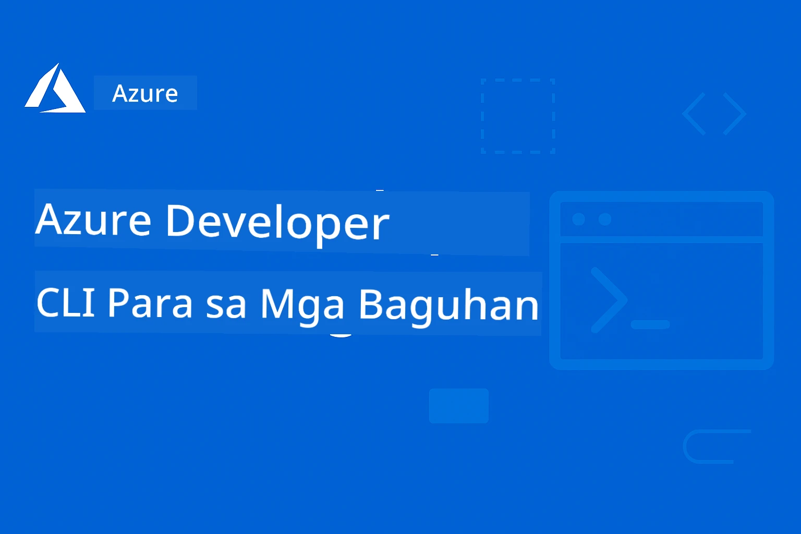

# AZD Para sa mga Nagsisimula: Isang Estrukturadong Paglalakbay sa Pagkatuto

 

[](https://GitHub.com/microsoft/azd-for-beginners/watchers/)
[](https://GitHub.com/microsoft/azd-for-beginners/network/)
[](https://GitHub.com/microsoft/azd-for-beginners/stargazers/)

[](https://discord.gg/microsoft-azure)
[](https://discord.gg/nTYy5BXMWG)

---

### Awtomatikong Mga Salin (Lagi Nang Napapanahon)

<!-- CO-OP TRANSLATOR LANGUAGES TABLE START -->
[Arabic](../ar/README.md) | [Bengali](../bn/README.md) | [Bulgarian](../bg/README.md) | [Burmese (Myanmar)](../my/README.md) | [Chinese (Simplified)](../zh-CN/README.md) | [Chinese (Traditional, Hong Kong)](../zh-HK/README.md) | [Chinese (Traditional, Macau)](../zh-MO/README.md) | [Chinese (Traditional, Taiwan)](../zh-TW/README.md) | [Croatian](../hr/README.md) | [Czech](../cs/README.md) | [Danish](../da/README.md) | [Dutch](../nl/README.md) | [Estonian](../et/README.md) | [Finnish](../fi/README.md) | [French](../fr/README.md) | [German](../de/README.md) | [Greek](../el/README.md) | [Hebrew](../he/README.md) | [Hindi](../hi/README.md) | [Hungarian](../hu/README.md) | [Indonesian](../id/README.md) | [Italian](../it/README.md) | [Japanese](../ja/README.md) | [Kannada](../kn/README.md) | [Korean](../ko/README.md) | [Lithuanian](../lt/README.md) | [Malay](../ms/README.md) | [Malayalam](../ml/README.md) | [Marathi](../mr/README.md) | [Nepali](../ne/README.md) | [Nigerian Pidgin](../pcm/README.md) | [Norwegian](../no/README.md) | [Persian (Farsi)](../fa/README.md) | [Polish](../pl/README.md) | [Portuguese (Brazil)](../pt-BR/README.md) | [Portuguese (Portugal)](../pt-PT/README.md) | [Punjabi (Gurmukhi)](../pa/README.md) | [Romanian](../ro/README.md) | [Russian](../ru/README.md) | [Serbian (Cyrillic)](../sr/README.md) | [Slovak](../sk/README.md) | [Slovenian](../sl/README.md) | [Spanish](../es/README.md) | [Swahili](../sw/README.md) | [Swedish](../sv/README.md) | [Tagalog (Filipino)](./README.md) | [Tamil](../ta/README.md) | [Telugu](../te/README.md) | [Thai](../th/README.md) | [Turkish](../tr/README.md) | [Ukrainian](../uk/README.md) | [Urdu](../ur/README.md) | [Vietnamese](../vi/README.md)

> **Mas gusto mo bang i-clone nang lokal?**
>
> Kasama sa repositoryong ito ang 50+ na salin ng wika na malaki ang nadaragdag sa laki ng pag-download. Upang i-clone nang walang mga salin, gamitin ang sparse checkout:
>
> **Bash / macOS / Linux:**
> ```bash
> git clone --filter=blob:none --sparse https://github.com/microsoft/AZD-for-beginners.git
> cd AZD-for-beginners
> git sparse-checkout set --no-cone '/*' '!translations' '!translated_images'
> ```
>
> **CMD (Windows):**
> ```cmd
> git clone --filter=blob:none --sparse https://github.com/microsoft/AZD-for-beginners.git
> cd AZD-for-beginners
> git sparse-checkout set --no-cone "/*" "!translations" "!translated_images"
> ```
>
> This gives you everything you need to complete the course with a much faster download.
<!-- CO-OP TRANSLATOR LANGUAGES TABLE END -->

## 🚀 Ano ang Azure Developer CLI (azd)?

**Azure Developer CLI (azd)** ay isang developer-friendly na command-line tool na nagpapadali sa pag-deploy ng mga aplikasyon sa Azure. Sa halip na manu-manong gumawa at ikonekta ang dose-dosenang Azure resources, maaari mong i-deploy ang buong aplikasyon gamit ang isang utos lang.

### Ang Mahika ng `azd up`

```bash
# Ginagawa ng isang utos na ito lahat ng bagay:
# ✅ Lumilikha ng lahat ng Azure resources
# ✅ Nagkokonpigura ng networking at seguridad
# ✅ Binubuo ang iyong application code
# ✅ Nagde-deploy sa Azure
# ✅ Nagbibigay sa iyo ng gumaganang URL
azd up
```

**Tapos na!** Walang pag-click sa Azure Portal, walang kumplikadong ARM templates na kailangang pag-aralan muna, walang manu-manong konfigurasyon - mga gumaganang aplikasyon agad sa Azure.

---

## ❓ Azure Developer CLI vs Azure CLI: Ano ang Pagkakaiba?

Ito ang pinaka-karaniwang tanong ng mga nagsisimula. Narito ang simpleng sagot:

| Tampok | **Azure CLI (`az`)** | **Azure Developer CLI (`azd`)** |
|---------|---------------------|--------------------------------|
| **Layunin** | Pamahalaan ang mga indibidwal na Azure resource | I-deploy ang kumpletong mga aplikasyon |
| **Pananaw** | Nakatuon sa imprastruktura | Nakatuon sa aplikasyon |
| **Halimbawa** | `az webapp create --name myapp...` | `azd up` |
| **Antas ng Pagkatuto** | Kailangang malaman ang mga serbisyo ng Azure | Sapat na kilalanin ang iyong app |
| **Pinakamainam Para sa** | DevOps, Imprastruktura | Mga Developer, Paggawa ng Prototype |

### Simpleng Analohiya

- **Azure CLI** ay parang pagkakaroon ng lahat ng kasangkapan para bumuo ng bahay - mga martilyo, lagari, pako. Maaari kang bumuo ng kahit ano, pero kailangan mong malaman ang konstruksyon.
- **Azure Developer CLI** ay parang pagkuha ng kontratista - ilalarawan mo ang gusto mo, at sila na ang mag-aasikaso ng pagtatayo.

### Kailan Gamitin ang Bawat Isa

| Scenario | Use This |
|----------|----------|
| "Gusto kong mabilis na i-deploy ang web app ko" | `azd up` |
| "Kailangan kong gumawa lang ng storage account" | `az storage account create` |
| "Gumagawa ako ng kumpletong AI na aplikasyon" | `azd init --template azure-search-openai-demo` |
| "Kailangan kong i-debug ang isang tiyak na Azure resource" | `az resource show` |
| "Gusto ko ng deployment na handa para sa produksyon sa loob ng ilang minuto" | `azd up --environment production` |

### Magkatulungan Sila!

Gumagamit ang AZD ng Azure CLI sa ilalim. Maaari mong gamitin pareho:
```bash
# I-deploy ang iyong app gamit ang AZD
azd up

# Pagkatapos ay ayusin nang mas detalyado ang mga partikular na resource gamit ang Azure CLI
az webapp config set --name myapp --always-on true
```

---

## 🌟 Hanapin ang Mga Template sa Awesome AZD

Huwag magsimula sa simula! Ang **Awesome AZD** ay koleksyon ng komunidad ng mga template na handa nang i-deploy:

| Mapagkukunan | Paglalarawan |
|----------|-------------|
| 🔗 [**Awesome AZD Gallery**](https://azure.github.io/awesome-azd/) | Mag-browse ng 200+ template na may one-click na deployment |
| 🔗 [**Submit a Template**](https://github.com/Azure/awesome-azd/issues) | Mag-ambag ng iyong sariling template sa komunidad |
| 🔗 [**GitHub Repository**](https://github.com/Azure/awesome-azd) | I-star at galugarin ang pinagmulan |

### Mga Sikat na Template ng AI mula sa Awesome AZD

```bash
# RAG Chat gamit ang Azure OpenAI + AI Search
azd init --template azure-search-openai-demo

# Mabilis na AI Chat Application
azd init --template openai-chat-app-quickstart

# Mga AI Agents gamit ang Foundry Agents
azd init --template get-started-with-ai-agents
```

---

## 🎯 Magsimula sa 3 Hakbang

### Hakbang 1: I-install ang AZD (2 minuto)

**Windows:**
```powershell
winget install microsoft.azd
```

**macOS:**
```bash
brew tap azure/azd && brew install azd
```

**Linux:**
```bash
curl -fsSL https://aka.ms/install-azd.sh | bash
```

### Hakbang 2: Mag-login sa Azure

```bash
azd auth login
```

### Hakbang 3: I-deploy ang Iyong Unang App

```bash
# Simulan mula sa isang template
azd init --template todo-nodejs-mongo

# I-deploy sa Azure (lumilikha ng lahat!)
azd up
```

**🎉 Tapos na!** Naka-live na ang iyong app sa Azure.

### Linisin (Huwag Kalimutan!)

```bash
# Remove all resources when done experimenting
azd down --force --purge
```

---

## 📚 Paano Gamitin ang Kursong Ito

Dinisenyo ang kursong ito para sa **sunud-sunod na pagkatuto** - magsimula kung saan ka kumportable at magpatuloy pataas:

| Ang Iyong Karanasan | Magsimula Dito |
|-----------------|------------|
| **Baguhan sa Azure** | [Kabanata 1: Pundasyon](../..) |
| **May alam sa Azure, bago sa AZD** | [Kabanata 1: Pundasyon](../..) |
| **Gusto mag-deploy ng AI apps** | [Kabanata 2: Pag-unlad ng AI](../..) |
| **Nais ng praktikal na pagsasanay** | [🎓 Interaktibong Workshop](workshop/README.md) - 3-4 hour guided lab |
| **Kailangan ng mga pattern para sa produksyon** | [Kabanata 8: Produksyon at Enterprise](../..) |

### Mabilis na Setup

1. **I-fork ang Repositoryong Ito**: [](https://GitHub.com/microsoft/azd-for-beginners/fork)
2. **I-clone ito**: `git clone https://github.com/YOUR-USERNAME/azd-for-beginners.git`
3. **Kumuha ng Tulong**: [Komunidad ng Azure Discord](https://discord.com/invite/ByRwuEEgH4)

> **Mas gusto mo bang i-clone nang lokal?**
>
> Kasama sa repositoryong ito ang 50+ na salin ng wika na malaki ang nadaragdag sa laki ng pag-download. Upang i-clone nang walang mga salin, gamitin ang sparse checkout:
> ```bash
> git clone --filter=blob:none --sparse https://github.com/microsoft/AZD-for-beginners.git
> cd AZD-for-beginners
> git sparse-checkout set --no-cone '/*' '!translations' '!translated_images'
> ```
> This gives you everything you need to complete the course with a much faster download.


## Pangkalahatang-ideya ng Kurso

Magsanay sa Azure Developer CLI (azd) sa pamamagitan ng mga estrukturadong kabanata na idinisenyo para sa sunud-sunod na pagkatuto. **Espesyal na pokus sa pag-deploy ng mga AI application na may integrasyon ng Microsoft Foundry.**

### Bakit Mahalaga ang Kurso na Ito para sa Mga Modernong Developer

Batay sa mga pananaw mula sa Microsoft Foundry Discord community, **45% ng mga developer ay nais gumamit ng AZD para sa AI workloads** ngunit nakakaranas ng mga hamon sa:
- Kumplikadong multi-service na mga arkitekturang AI
- Pinakamahuhusay na kasanayan sa pag-deploy ng AI para sa produksyon  
- Integrasyon at konfigurasyon ng mga serbisyo ng Azure AI
- Pag-optimize ng gastos para sa mga AI workload
- Pagsosolusyon sa mga isyu ng deployment na partikular sa AI

### Mga Layunin sa Pagkatuto

Sa pagtatapos ng estrukturadong kursong ito, ikaw ay:
- **Maging bihasa sa Mga Pundasyon ng AZD**: Mga pangunahing konsepto, pag-install, at konfigurasyon
- **Mag-deploy ng mga AI Application**: Gamitin ang AZD kasama ang mga serbisyo ng Microsoft Foundry
- **Ipatupad ang Infrastructure as Code**: Pamahalaan ang mga resource ng Azure gamit ang mga Bicep template
- **Ayusin ang mga Isyu sa Deployment**: Lutasin ang karaniwang mga problema at mag-debug
- **I-optimize para sa Produksyon**: Seguridad, scaling, monitoring, at pamamahala ng gastos
- **Bumuo ng Mga Solusyong Multi-Agent**: I-deploy ang kumplikadong mga arkitekturang AI

## 🗺️ Mapa ng Kurso: Mabilis na Navigasyon ayon sa Kabanata

Bawat kabanata ay may nakalaang README na may mga layunin sa pagkatuto, mabilis na panimulang gabay, at mga ehersisyo:

| Kabanata | Paksa | Mga Leksyon | Tagal | Antas ng Kahirapan |
|---------|-------|---------|----------|------------|
| **[Kabanata 1: Pundasyon](docs/chapter-01-foundation/README.md)** | Pagsisimula | [Mga Pangunahing Kaalaman sa AZD](docs/chapter-01-foundation/azd-basics.md) &#124; [Pag-install](docs/chapter-01-foundation/installation.md) &#124; [Unang Proyekto](docs/chapter-01-foundation/first-project.md) | 30-45 min | ⭐ |
| **[Kabanata 2: Pag-unlad ng AI](docs/chapter-02-ai-development/README.md)** | Mga App na Nakatuon sa AI | [Integrasyon ng Foundry](docs/chapter-02-ai-development/microsoft-foundry-integration.md) &#124; [Mga Ahente ng AI](docs/chapter-02-ai-development/agents.md) &#124; [Pag-deploy ng Modelo](docs/chapter-02-ai-development/ai-model-deployment.md) &#124; [Workshop](docs/chapter-02-ai-development/ai-workshop-lab.md) | 1-2 hrs | ⭐⭐ |
| **[Kabanata 3: Konfigurasyon](docs/chapter-03-configuration/README.md)** | Awtorisasyon & Seguridad | [Konfigurasyon](docs/chapter-03-configuration/configuration.md) &#124; [Auth & Seguridad](docs/chapter-03-configuration/authsecurity.md) | 45-60 min | ⭐⭐ |
| **[Kabanata 4: Imprastruktura](docs/chapter-04-infrastructure/README.md)** | IaC at Pag-deploy | [Patnubay sa Pag-deploy](docs/chapter-04-infrastructure/deployment-guide.md) &#124; [Pagprovision](docs/chapter-04-infrastructure/provisioning.md) | 1-1.5 hrs | ⭐⭐⭐ |
| **[Kabanata 5: Multi-Agent](docs/chapter-05-multi-agent/README.md)** | Mga Solusyon ng AI Agent | [Senaryo sa Retail](examples/retail-scenario.md) &#124; [Mga Pattern ng Koordinasyon](docs/chapter-06-pre-deployment/coordination-patterns.md) | 2-3 hrs | ⭐⭐⭐⭐ |
| **[Kabanata 6: Bago Pag-deploy](docs/chapter-06-pre-deployment/README.md)** | Pagpaplano at Pagpapatunay | [Paunang Pagsusuri](docs/chapter-06-pre-deployment/preflight-checks.md) &#124; [Pagpaplano ng Kapasidad](docs/chapter-06-pre-deployment/capacity-planning.md) &#124; [Pagpili ng SKU](docs/chapter-06-pre-deployment/sku-selection.md) &#124; [Mga Insight ng App](docs/chapter-06-pre-deployment/application-insights.md) | 1 hr | ⭐⭐ |
| **[Kabanata 7: Pagsasaayos ng Problema at Pag-aayos](docs/chapter-07-troubleshooting/README.md)** | Debug at Pag-ayos | [Karaniwang Mga Isyu](docs/chapter-07-troubleshooting/common-issues.md) &#124; [Pag-debug](docs/chapter-07-troubleshooting/debugging.md) &#124; [Mga Isyu ng AI](docs/chapter-07-troubleshooting/ai-troubleshooting.md) | 1-1.5 hrs | ⭐⭐ |
| **[Kabanata 8: Produksyon](docs/chapter-08-production/README.md)** | Mga Pattern para sa Enterprise | [Mga Praktika sa Produksyon](docs/chapter-08-production/production-ai-practices.md) | 2-3 hrs | ⭐⭐⭐⭐ |
| **[🎓 Workshop](workshop/README.md)** | Praktikal na Pagsasanay | [Panimula](workshop/docs/instructions/0-Introduction.md) &#124; [Pagpili](workshop/docs/instructions/1-Select-AI-Template.md) &#124; [Pagpapatunay](workshop/docs/instructions/2-Validate-AI-Template.md) &#124; [Pag-deconstruct](workshop/docs/instructions/3-Deconstruct-AI-Template.md) &#124; [Konfigurasyon](workshop/docs/instructions/4-Configure-AI-Template.md) &#124; [Pagpapasadya](workshop/docs/instructions/5-Customize-AI-Template.md) &#124; [Pag-teardown](workshop/docs/instructions/6-Teardown-Infrastructure.md) &#124; [Pagsasara](workshop/docs/instructions/7-Wrap-up.md) | 3-4 hrs | ⭐⭐ |

**Kabuuang Tagal ng Kurso:** ~10-14 hours | **Pag-usbong ng Kasanayan:** Beginner → Production-Ready

---

## 📚 Mga Kabanata sa Pagkatuto

*Piliin ang iyong landas ng pagkatuto batay sa antas ng karanasan at mga layunin*

### 🚀 Kabanata 1: Pundasyon at Mabilis na Pagsisimula
**Mga Kinakailangan**: Azure subscription, batayang kaalaman sa command line  
**Tagal**: 30-45 minutes  
**Kumplikado**: ⭐

#### Mga Matututunan Mo
- Pag-unawa sa mga pundasyon ng Azure Developer CLI
- Pag-install ng AZD sa iyong platform
- Ang iyong unang matagumpay na pag-deploy

#### Mga Mapagkukunan ng Pagkatuto
- **🎯 Magsimula Dito**: [Ano ang Azure Developer CLI?](../..)
- **📖 Teorya**: [AZD Basics](docs/chapter-01-foundation/azd-basics.md) - Mga pangunahing konsepto at terminolohiya
- **⚙️ Setup**: [Installation & Setup](docs/chapter-01-foundation/installation.md) - Mga gabay na nakatuon sa platform
- **🛠️ Hands-On**: [Your First Project](docs/chapter-01-foundation/first-project.md) - Sunod-sunod na tutorial
- **📋 Quick Reference**: [Command Cheat Sheet](resources/cheat-sheet.md)

#### Mga Praktikal na Gawain
```bash
# Mabilis na pagsusuri ng pag-install
azd version

# I-deploy ang iyong unang aplikasyon
azd init --template todo-nodejs-mongo
azd up
```

**💡 Kinalabasan ng Kabanata**: Matagumpay na mag-deploy ng simpleng web application sa Azure gamit ang AZD

**✅ Pagpapatunay ng Tagumpay:**
```bash
# Pagkatapos makumpleto ang Kabanata 1, dapat ay magawa mo:
azd version              # Ipinapakita ang naka-install na bersyon
azd init --template todo-nodejs-mongo  # Ini-initialize ang proyekto
azd up                  # Ina-deploy sa Azure
azd show                # Ipinapakita ang URL ng tumatakbong app
# Bubukas ang aplikasyon sa browser at gumagana
azd down --force --purge  # Nililinis ang mga resource
```

**📊 Inbestment ng Oras:** 30-45 minutes  
**📈 Antas ng Kasanayan Pagkatapos:** Kayang mag-deploy ng mga pangunahing aplikasyon nang mag-isa

**✅ Pagpapatunay ng Tagumpay:**
```bash
# Pagkatapos makumpleto ang Kabanata 1, dapat mong magawa:
azd version              # Ipinapakita ang naka-install na bersyon
azd init --template todo-nodejs-mongo  # Ini-initialize ang proyekto
azd up                  # Nagre-deploy sa Azure
azd show                # Ipinapakita ang URL ng tumatakbong app
# Bubukas ang aplikasyon sa browser at gumagana
azd down --force --purge  # Nililinis ang mga resource
```

**📊 Inbestment ng Oras:** 30-45 minutes  
**📈 Antas ng Kasanayan Pagkatapos:** Kayang mag-deploy ng mga pangunahing aplikasyon nang mag-isa

---

### 🤖 Kabanata 2: AI-First Development (Inirerekomenda para sa mga AI Developer)
**Mga Kinakailangan**: Kabanata 1 natapos  
**Tagal**: 1-2 hours  
**Kumplikado**: ⭐⭐

#### Mga Matututunan Mo
- Integrasyon ng Microsoft Foundry sa AZD
- Pag-deploy ng mga application na may kakayahang AI
- Pag-unawa sa mga konfigurasyon ng AI service

#### Mga Mapagkukunan ng Pagkatuto
- **🎯 Magsimula Dito**: [Microsoft Foundry Integration](docs/chapter-02-ai-development/microsoft-foundry-integration.md)
- **🤖 AI Agents**: [AI Agents Guide](docs/chapter-02-ai-development/agents.md) - Mag-deploy ng mga intelligent agent gamit ang AZD
- **📖 Mga Pattern**: [AI Model Deployment](docs/chapter-02-ai-development/ai-model-deployment.md) - Pag-deploy at pamamahala ng mga AI model
- **🛠️ Workshop**: [AI Workshop Lab](docs/chapter-02-ai-development/ai-workshop-lab.md) - Gawing AZD-ready ang iyong mga solusyon sa AI
- **🎥 Interactive Guide**: [Workshop Materials](workshop/README.md) - Browser-based na pagkatuto gamit ang MkDocs * DevContainer Environment
- **📋 Templates**: [Microsoft Foundry Templates](../..)
- **📝 Mga Halimbawa**: [AZD Deployment Examples](examples/README.md)

#### Mga Praktikal na Gawain
```bash
# I-deploy ang iyong unang aplikasyon ng AI
azd init --template azure-search-openai-demo
azd up

# Subukan ang karagdagang mga template ng AI
azd init --template openai-chat-app-quickstart
azd init --template agent-openai-python-prompty
```

**💡 Kinalabasan ng Kabanata**: I-deploy at i-configure ang isang AI-powered chat application na may RAG capabilities

**✅ Pagpapatunay ng Tagumpay:**
```bash
# Pagkatapos ng Kabanata 2, dapat ay kaya mong:
azd init --template azure-search-openai-demo
azd up
# Subukan ang interface ng AI chat
# Magtanong at makakuha ng mga tugon na pinapagana ng AI na may mga sanggunian
# Tiyakin na gumagana ang integrasyon ng paghahanap
azd monitor  # Suriin na ipinapakita ng Application Insights ang telemetry
azd down --force --purge
```

**📊 Inbestment ng Oras:** 1-2 hours  
**📈 Antas ng Kasanayan Pagkatapos:** Kayang mag-deploy at mag-configure ng production-ready na mga AI application  
**💰 Pagkaalam sa Gastos:** Unawain ang $80-150/month para sa dev, $300-3500/month para sa production

#### 💰 Mga konsiderasyon sa Gastos para sa mga AI Deployment

**Development Environment (Tinatayang $80-150/month):**
- Azure OpenAI (Pay-as-you-go): $0-50/month (batay sa token usage)
- AI Search (Basic tier): $75/month
- Container Apps (Consumption): $0-20/month
- Storage (Standard): $1-5/month

**Production Environment (Tinatayang $300-3,500+/month):**
- Azure OpenAI (PTU para sa consistent na performance): $3,000+/month O Pay-as-go na may mataas na volume
- AI Search (Standard tier): $250/month
- Container Apps (Dedicated): $50-100/month
- Application Insights: $5-50/month
- Storage (Premium): $10-50/month

**💡 Mga Tip para sa Pag-optimize ng Gastos:**
- Gamitin ang **Free Tier** ng Azure OpenAI para sa pag-aaral (50,000 tokens/month kasama)
- Patakbuhin ang `azd down` para i-deallocate ang mga resources kapag hindi aktibong nagde-develop
- Magsimula sa consumption-based billing, mag-upgrade sa PTU para lang sa production
- Gamitin ang `azd provision --preview` para tantiyahin ang gastos bago mag-deploy
- I-enable ang auto-scaling: magbayad lamang para sa aktwal na paggamit

**Pagsubaybay ng Gastos:**
```bash
# Suriin ang tinatayang buwanang gastos
azd provision --preview

# Subaybayan ang aktwal na gastos sa Azure Portal
az consumption budget list --resource-group <your-rg>
```

---

### ⚙️ Kabanata 3: Konfigurasyon at Pag-authenticate
**Mga Kinakailangan**: Kabanata 1 natapos  
**Tagal**: 45-60 minutes  
**Kumplikado**: ⭐⭐

#### Mga Matututunan Mo
- Konfigurasyon ng environment at pamamahala
- Mga pinakamahuhusay na gawi sa authentication at seguridad
- Pagpangalang at organisasyon ng mga resource

#### Mga Mapagkukunan ng Pagkatuto
- **📖 Konfigurasyon**: [Configuration Guide](docs/chapter-03-configuration/configuration.md) - Pag-setup ng environment
- **🔐 Seguridad**: [Authentication patterns and managed identity](docs/chapter-03-configuration/authsecurity.md) - Mga pattern ng authentication
- **📝 Mga Halimbawa**: [Database App Example](examples/database-app/README.md) - Mga halimbawa ng AZD Database

#### Mga Praktikal na Gawain
- I-configure ang maraming environment (dev, staging, prod)
- Mag-set up ng managed identity authentication
- Magpatupad ng environment-specific na mga konfigurasyon

**💡 Kinalabasan ng Kabanata**: Pamahalaan ang maraming environment na may tamang authentication at seguridad

---

### 🏗️ Kabanata 4: Infrastructure as Code at Pag-deploy
**Mga Kinakailangan**: Kabanata 1-3 natapos  
**Tagal**: 1-1.5 hours  
**Kumplikado**: ⭐⭐⭐

#### Mga Matututunan Mo
- Mga advanced na pattern sa pag-deploy
- Infrastructure as Code gamit ang Bicep
- Mga estratehiya sa provisioning ng resource

#### Mga Mapagkukunan ng Pagkatuto
- **📖 Pag-deploy**: [Deployment Guide](docs/chapter-04-infrastructure/deployment-guide.md) - Kumpletong workflows
- **🏗️ Provisioning**: [Provisioning Resources](docs/chapter-04-infrastructure/provisioning.md) - Pamamahala ng Azure resources
- **📝 Mga Halimbawa**: [Container App Example](../../examples/container-app) - Containerized na mga deployment

#### Mga Praktikal na Gawain
- Gumawa ng custom na Bicep templates
- Mag-deploy ng multi-service na mga aplikasyon
- Magpatupad ng blue-green deployment na mga estratehiya

**💡 Kinalabasan ng Kabanata**: Mag-deploy ng kumplikadong multi-service na mga aplikasyon gamit ang custom na infrastructure templates

---

### 🎯 Kabanata 5: Multi-Agent AI Solutions (Advanced)
**Mga Kinakailangan**: Kabanata 1-2 natapos  
**Tagal**: 2-3 hours  
**Kumplikado**: ⭐⭐⭐⭐

#### Mga Matututunan Mo
- Mga pattern ng multi-agent na arkitektura
- Orkestrasyon at koordinasyon ng mga agent
- Production-ready na mga AI deployment

#### Mga Mapagkukunan ng Pagkatuto
- **🤖 Tampok na Proyekto**: [Retail Multi-Agent Solution](examples/retail-scenario.md) - Kumpletong implementasyon
- **🛠️ ARM Templates**: [ARM Template Package](../../examples/retail-multiagent-arm-template) - One-click deployment
- **📖 Arkitektura**: [Multi-agent coordination patterns](docs/chapter-06-pre-deployment/coordination-patterns.md) - Mga pattern

#### Mga Praktikal na Gawain
```bash
# I-deploy ang kumpletong multi-ahenteng solusyon para sa retail
cd examples/retail-multiagent-arm-template
./deploy.sh

# Tuklasin ang mga konfigurasyon ng ahente
az deployment group show --resource-group <rg-name> --name <deployment-name>
```

**💡 Kinalabasan ng Kabanata**: Mag-deploy at pamahalaan ang production-ready na multi-agent AI solution na may Customer at Inventory agents

---

### 🔍 Kabanata 6: Pagpaplano at Pagpapatunay Bago Pag-deploy
**Mga Kinakailangan**: Kabanata 4 natapos  
**Tagal**: 1 hour  
**Kumplikado**: ⭐⭐

#### Mga Matututunan Mo
- Pagpaplano ng kapasidad at pagpapatunay ng resource
- Mga estratehiya sa pagpili ng SKU
- Paunang pagsusuri at automation

#### Mga Mapagkukunan ng Pagkatuto
- **📊 Pagpaplano**: [Capacity Planning](docs/chapter-06-pre-deployment/capacity-planning.md) - Pagpapatunay ng resource
- **💰 Pagpili**: [SKU Selection](docs/chapter-06-pre-deployment/sku-selection.md) - Mga cost-effective na pagpipilian
- **✅ Pagpapatunay**: [Pre-flight Checks](docs/chapter-06-pre-deployment/preflight-checks.md) - Mga automated script

#### Mga Praktikal na Gawain
- Patakbuhin ang mga script para sa capacity validation
- I-optimize ang pagpili ng SKU para sa gastos
- Magpatupad ng automated na paunang pagsusuri bago mag-deploy

**💡 Kinalabasan ng Kabanata**: I-validate at i-optimize ang mga deployment bago isagawa

---

### 🚨 Kabanata 7: Pag-troubleshoot at Pag-debug
**Mga Kinakailangan**: Kahit anong deployment chapter natapos  
**Tagal**: 1-1.5 hours  
**Kumplikado**: ⭐⭐

#### Mga Matututunan Mo
- Sistematikong mga paraan ng pag-debug
- Mga karaniwang isyu at solusyon
- Pag-troubleshoot na partikular sa AI

#### Mga Mapagkukunan ng Pagkatuto
- **🔧 Karaniwang Mga Isyu**: [Common Issues](docs/chapter-07-troubleshooting/common-issues.md) - FAQ at mga solusyon
- **🕵️ Pag-debug**: [Debugging Guide](docs/chapter-07-troubleshooting/debugging.md) - Sunod-sunod na mga estratehiya
- **🤖 Mga Isyu ng AI**: [AI-Specific Troubleshooting](docs/chapter-07-troubleshooting/ai-troubleshooting.md) - Mga problema sa AI service

#### Mga Praktikal na Gawain
- Tukuyin ang mga pagkabigo sa deployment
- Ayusin ang mga isyu sa authentication
- I-debug ang konektividad ng AI service

**💡 Kinalabasan ng Kabanata**: Magawang tukuyin at ayusin nang mag-isa ang mga karaniwang isyu sa deployment

---

### 🏢 Kabanata 8: Produksyon at Mga Pattern para sa Enterprise
**Mga Kinakailangan**: Kabanata 1-4 natapos  
**Tagal**: 2-3 hours  
**Kumplikado**: ⭐⭐⭐⭐

#### Mga Matututunan Mo
- Mga estratehiya sa pag-deploy para sa produksyon
- Mga pattern ng seguridad para sa enterprise
- Pagsubaybay at pag-optimize ng gastos

#### Mga Mapagkukunan ng Pagkatuto
- **🏭 Produksyon**: [Production AI Best Practices](docs/chapter-08-production/production-ai-practices.md) - Mga pattern para sa enterprise
- **📝 Mga Halimbawa**: [Microservices Example](../../examples/microservices) - Mga komplikadong arkitektura
- **📊 Pagsubaybay**: [Application Insights integration](docs/chapter-06-pre-deployment/application-insights.md) - Pagsubaybay

#### Mga Praktikal na Gawain
- Magpatupad ng mga pattern ng seguridad para sa enterprise
- Mag-set up ng komprehensibong pagsubaybay
- Mag-deploy sa produksyon na may tamang pamamahala

**💡 Kinalabasan ng Kabanata**: Mag-deploy ng enterprise-ready na mga aplikasyon na may kumpletong kakayahan sa produksyon

---

## 🎓 Workshop Overview: Praktikal na Karanasan sa Pagkatuto

> **⚠️ KATAYUAN NG WORKSHOP: Aktibong Pag-unlad**
> Ang mga materyales ng workshop ay kasalukuyang dine-develop at pinuhin. Gumagana ang mga pangunahing module, ngunit ang ilang advanced na seksyon ay hindi pa kumpleto. Aktibo kaming nagtatrabaho upang tapusin ang lahat ng nilalaman. [Subaybayan ang progreso →](workshop/README.md)

### Mga Interaktibong Materyales ng Workshop
**Komprehensibong praktikal na pagkatuto gamit ang mga browser-based na tool at ginabayang mga pagsasanay**

Ang aming mga materyales sa workshop ay nagbibigay ng isang istrakturadong, interaktibong karanasan sa pagkatuto na kumukumplemento sa curriculum na nakaayos ayon sa mga kabanata sa itaas. Ang workshop ay idinisenyo para sa parehong self-paced na pagkatuto at mga sesyon na pinangungunahan ng instruktor.

#### 🛠️ Tampok ng Workshop
- **Interface na Batay sa Browser**: Kumpletong MkDocs-powered na workshop na may search, copy, at mga tampok na tema
- **Integrasyon ng GitHub Codespaces**: Isang-click na pagsasaayos ng development environment
- **Istrakturadong Landas ng Pagkatuto**: 8-modyul na ginabay na mga pagsasanay (3-4 na oras kabuuan)
- **Progresibong Metodolohiya**: Introduksyon → Pagpili → Pagpapatunay → Dekonstruksyon → Konfigurasyon → Pag-customize → Pag-aalis → Pagtatapos
- **Interaktibong DevContainer Environment**: Mga paunang-configure na tool at dependencies

#### 📚 Estruktura ng Module ng Workshop
Ang workshop ay sumusunod sa isang **8-modyul na progresibong metodolohiya** na magdadala sa iyo mula sa pagtuklas hanggang sa mastery ng pag-deploy:

| Modyul | Paksa | Ano ang Gagawin Mo | Tagal |
|--------|-------|--------------------|----------|
| **0. Introduksyon** | Pangkalahatang-ideya ng Workshop | Unawain ang mga layunin ng pagkatuto, mga kinakailangan, at estruktura ng workshop | 15 min |
| **1. Pagpili** | Pagtuklas ng Template | Siyasatin ang mga template ng AZD at piliin ang tamang AI template para sa iyong sitwasyon | 20 min |
| **2. Pagpapatunay** | Deploy & Verify | I-deploy ang template gamit ang `azd up` at beripikahin na gumagana ang imprastruktura | 30 min |
| **3. Dekonstruksyon** | Unawain ang Estruktura | Gamitin ang GitHub Copilot para siyasatin ang arkitektura ng template, mga Bicep file, at organisasyon ng code | 30 min |
| **4. Konfigurasyon** | Malalim na Pagsusuri ng azure.yaml | Maging bihasa sa konfigurasyon ng `azure.yaml`, lifecycle hooks, at mga environment variable | 30 min |
| **5. Pag-customize** | Gawing Iyo | I-enable ang AI Search, tracing, evaluation, at i-customize para sa iyong sitwasyon | 45 min |
| **6. Pag-aalis** | Paglilinis | Ligtas na i-deprovision ang mga resource gamit ang `azd down --purge` | 15 min |
| **7. Pagtatapos** | Susunod na Mga Hakbang | Balikan ang mga natapos, mga pangunahing konsepto, at ipagpatuloy ang iyong paglalakbay sa pag-aaral | 15 min |

**Daloy ng Workshop:**
```
Introduction → Selection → Validation → Deconstruction → Configuration → Customization → Teardown → Wrap-up
     ↓            ↓           ↓              ↓               ↓              ↓            ↓           ↓
  Overview    Find the     Deploy &      Explore        Master         Customize     Clean up    Review &
             right        verify        code &        azure.yaml      for your      resources   next steps
             template                   structure                     scenario
```

#### 🚀 Paano Magsimula sa Workshop
```bash
# Opsyon 1: GitHub Codespaces (Inirerekomenda)
# I-click ang "Code" → "Create codespace on main" sa repositoryo

# Opsyon 2: Lokal na Pag-develop
git clone https://github.com/microsoft/azd-for-beginners.git
cd azd-for-beginners/workshop
# Sundin ang mga tagubilin sa pag-setup sa workshop/README.md
```

#### 🎯 Mga Kinalabasan ng Pagkatuto mula sa Workshop
Sa pagtatapos ng workshop, ang mga kalahok ay:
- **Mag-deploy ng Mga Production AI Application**: Gamitin ang AZD kasama ang mga serbisyo ng Microsoft Foundry
- **Maging Bihasa sa Multi-Agent Architectures**: Ipatupad ang naka-coordinate na solusyon ng AI agent
- **Ipatupad ang Pinakamahuhusay na Praktika sa Seguridad**: I-configure ang authentication at access control
- **I-optimize para sa Scalability**: Disenyuhin ang cost-effective at performant na mga deployment
- **Mag-troubleshoot ng Mga Deployment**: Lutasin ang karaniwang mga isyu nang mag-isa

#### 📖 Mga Mapagkukunan ng Workshop
- **🎥 Interaktibong Gabay**: [Workshop Materials](workshop/README.md) - Kapaligirang pagkatuto na batay sa browser
- **📋 Mga Tagubilin bawat Module**:
  - [0. Introduksyon](workshop/docs/instructions/0-Introduction.md) - Pangkalahatang-ideya ng workshop at mga layunin
  - [1. Pagpili](workshop/docs/instructions/1-Select-AI-Template.md) - Hanapin at piliin ang mga AI template
  - [2. Pagpapatunay](workshop/docs/instructions/2-Validate-AI-Template.md) - I-deploy at beripikahin ang mga template
  - [3. Dekonstruksyon](workshop/docs/instructions/3-Deconstruct-AI-Template.md) - Siyasatin ang arkitektura ng template
  - [4. Konfigurasyon](workshop/docs/instructions/4-Configure-AI-Template.md) - Maging bihasa sa azure.yaml
  - [5. Pag-customize](workshop/docs/instructions/5-Customize-AI-Template.md) - I-customize para sa iyong sitwasyon
  - [6. Pag-aalis](workshop/docs/instructions/6-Teardown-Infrastructure.md) - Linisin ang mga resource
  - [7. Pagtatapos](workshop/docs/instructions/7-Wrap-up.md) - Balikan at susunod na mga hakbang
- **🛠️ AI Workshop Lab**: [AI Workshop Lab](docs/chapter-02-ai-development/ai-workshop-lab.md) - Mga pagsasanay na naka-focus sa AI
- **💡 Quick Start**: [Workshop Setup Guide](workshop/README.md#quick-start) - Konfigurasyon ng kapaligiran

**Perpekto para sa**: Pagsasanay ng korporasyon, mga kurso ng unibersidad, self-paced na pagkatuto, at mga developer bootcamp.

---

## 📖 Malalimang Pagsusuri: Mga Kakayahan ng AZD

Higit pa sa mga batayan, nag-aalok ang AZD ng makapangyarihang mga tampok para sa production deployments:

- **Pag-deploy na Batay sa Template** - Gamitin ang mga pre-built na template para sa mga karaniwang pattern ng aplikasyon
- **Infrastructure as Code** - Pamahalaan ang mga Azure resource gamit ang Bicep o Terraform  
- **Integrated workflows** - Walang putol na mag-provision, mag-deploy, at mag-monitor ng mga aplikasyon
- **Developer-friendly** - In-optimize para sa produktibidad at karanasan ng developer

### **AZD + Microsoft Foundry: Perpekto para sa Pag-deploy ng AI**

**Bakit AZD para sa Mga Solusyon sa AI?** Tinatalakay ng AZD ang mga pangunahing hamon na hinaharap ng mga AI developer:

- **AI-Ready Templates** - Mga paunang-configure na template para sa Azure OpenAI, Cognitive Services, at ML workloads
- **Secure AI Deployments** - Mga built-in na pattern ng seguridad para sa AI services, API keys, at model endpoints  
- **Production AI Patterns** - Mga pinakamahusay na praktika para sa scalable, cost-effective na pag-deploy ng AI applications
- **End-to-End AI Workflows** - Mula sa pag-develop ng modelo hanggang sa production deployment na may tamang monitoring
- **Cost Optimization** - Matalinong alokasyon ng resources at mga estratehiya sa scaling para sa AI workloads
- **Microsoft Foundry Integration** - Seamless na koneksyon sa Microsoft Foundry model catalog at mga endpoint

---

## 🎯 Library ng Mga Template at Halimbawa

### Tampok: Microsoft Foundry Templates
**Magsimula dito kung nag-de-deploy ka ng mga AI application!**

> **Tandaan:** Ipinapakita ng mga template na ito ang iba't ibang AI pattern. Ang ilan ay external Azure Samples, ang iba ay lokal na implementasyon.

| Template | Kabanata | Kompleksidad | Mga Serbisyo | Uri |
|----------|---------|------------|----------|------|
| [**Get started with AI chat**](https://github.com/Azure-Samples/get-started-with-ai-chat) | Kabanata 2 | ⭐⭐ | AzureOpenAI + Azure AI Model Inference API + Azure AI Search + Azure Container Apps + Application Insights | Panlabas |
| [**Get started with AI agents**](https://github.com/Azure-Samples/get-started-with-ai-agents) | Kabanata 2 | ⭐⭐ | Foundry Agents + AzureOpenAI + Azure AI Search + Azure Container Apps + Application Insights| Panlabas |
| [**Azure Search + OpenAI Demo**](https://github.com/Azure-Samples/azure-search-openai-demo) | Kabanata 2 | ⭐⭐ | AzureOpenAI + Azure AI Search + App Service + Storage | Panlabas |
| [**OpenAI Chat App Quickstart**](https://github.com/Azure-Samples/openai-chat-app-quickstart) | Kabanata 2 | ⭐ | AzureOpenAI + Container Apps + Application Insights | Panlabas |
| [**Agent OpenAI Python Prompty**](https://github.com/Azure-Samples/agent-openai-python-prompty) | Kabanata 5 | ⭐⭐⭐ | AzureOpenAI + Azure Functions + Prompty | Panlabas |
| [**Contoso Chat RAG**](https://github.com/Azure-Samples/contoso-chat) | Kabanata 8 | ⭐⭐⭐⭐ | AzureOpenAI + AI Search + Cosmos DB + Container Apps | Panlabas |
| [**Retail Multi-Agent Solution**](examples/retail-scenario.md) | Kabanata 5 | ⭐⭐⭐⭐ | AzureOpenAI + AI Search + Storage + Container Apps + Cosmos DB | **Lokal** |

### Tampok: Kumpletong Mga Senaryong Pampagkatuto
**Mga template ng aplikasyon na handa para sa produksyon na naka-map sa mga kabanata ng pagkatuto**

| Template | Kabanata ng Pagkatuto | Kompleksidad | Pangunahing Aral |
|----------|------------------|------------|--------------|
| [**openai-chat-app-quickstart**](https://github.com/Azure-Samples/openai-chat-app-quickstart) | Kabanata 2 | ⭐ | Mga pangunahing pattern ng pag-deploy ng AI |
| [**azure-search-openai-demo**](https://github.com/Azure-Samples/azure-search-openai-demo) | Kabanata 2 | ⭐⭐ | Implementasyon ng RAG gamit ang Azure AI Search |
| [**ai-document-processing**](https://github.com/Azure-Samples/ai-document-processing) | Kabanata 4 | ⭐⭐ | Integrasyon ng Document Intelligence |
| [**agent-openai-python-prompty**](https://github.com/Azure-Samples/agent-openai-python-prompty) | Kabanata 5 | ⭐⭐⭐ | Agent framework at function calling |
| [**contoso-chat**](https://github.com/Azure-Samples/contoso-chat) | Kabanata 8 | ⭐⭐⭐ | Enterprise AI orchestration |
| [**retail-multi-agent-solution**](examples/retail-scenario.md) | Kabanata 5 | ⭐⭐⭐⭐ | Arkitekturang multi-agent kasama ang Customer at Inventory agents |

### Pagkatuto ayon sa Uri ng Halimbawa

> **📌 Lokal vs. Panlabas na Mga Halimbawa:**  
> **Lokal na Mga Halimbawa** (sa repo na ito) = Handa agad gamitin  
> **Panlabas na Mga Halimbawa** (Azure Samples) = I-clone mula sa mga naka-link na repositoryo

#### Lokal na Mga Halimbawa (Handa Gamitin)
- [**Retail Multi-Agent Solution**](examples/retail-scenario.md) - Kumpletong production-ready na implementasyon na may ARM templates
  - Multi-agent architecture (Customer + Inventory agents)
  - Komprehensibong monitoring at evaluation
  - One-click deployment via ARM template

#### Lokal na Mga Halimbawa - Container Applications (Kabanata 2-5)
**Komprehensibong mga halimbawa ng container deployment sa repositoryong ito:**
- [**Container App Examples**](examples/container-app/README.md) - Kumpletong gabay sa containerized deployments
  - [Simple Flask API](../../examples/container-app/simple-flask-api) - Basic REST API na may scale-to-zero
  - [Microservices Architecture](../../examples/container-app/microservices) - Production-ready na multi-service deployment
  - Quick Start, Production, at Advanced na mga pattern ng deployment
  - Gabay sa monitoring, seguridad, at pag-optimize ng gastos

#### Panlabas na Mga Halimbawa - Simpleng Aplikasyon (Kabanata 1-2)
**I-clone ang mga Azure Samples na ito para makapagsimula:**
- [Simple Web App - Node.js + MongoDB](https://github.com/Azure-Samples/todo-nodejs-mongo) - Mga pangunahing pattern ng deployment
- [Static Website - React SPA](https://github.com/Azure-Samples/todo-csharp-sql-swa-func) - Pag-deploy ng static na nilalaman
- [Container App - Python Flask](https://github.com/Azure-Samples/container-apps-store-api-microservice) - Pag-deploy ng REST API

#### Panlabas na Mga Halimbawa - Integrasyon ng Database (Kabanata 3-4)  
- [Database App - C# + SQL](https://github.com/Azure-Samples/todo-csharp-sql) - Mga pattern ng konektividad sa database
- [Functions + Cosmos DB](https://github.com/Azure-Samples/todo-python-mongo-swa-func) - Serverless data workflow

#### Panlabas na Mga Halimbawa - Mga Advanced na Pattern (Kabanata 4-8)
- [Java Microservices](https://github.com/Azure-Samples/java-microservices-aca-lab) - Mga multi-service architectures
- [Container Apps Jobs](https://github.com/Azure-Samples/container-apps-jobs) - Background processing  
- [Enterprise ML Pipeline](https://github.com/Azure-Samples/mlops-v2) - Mga production-ready na pattern para sa ML

### Panlabas na Koleksyon ng Template
- [**Official AZD Template Gallery**](https://azure.github.io/awesome-azd/) - Piniling koleksyon ng opisyal at community templates
- [**Azure Developer CLI Templates**](https://learn.microsoft.com/en-us/azure/developer/azure-developer-cli/azd-templates) - Dokumentasyon ng Microsoft Learn para sa mga template
- [**Examples Directory**](examples/README.md) - Lokal na mga learning example na may detalyadong paliwanag

---

## 📚 Mga Mapagkukunan at Sanggunian sa Pagkatuto

### Mabilisang Sanggunian
- [**Command Cheat Sheet**](resources/cheat-sheet.md) - Mahahalagang azd na command na inayos ayon sa kabanata
- [**Glossary**](resources/glossary.md) - Terminolohiya ng Azure at azd  
- [**FAQ**](resources/faq.md) - Mga karaniwang tanong na inayos ayon sa kabanata ng pagkatuto
- [**Study Guide**](resources/study-guide.md) - Komprehensibong mga practice exercise

### Mga Hands-On na Workshop
- [**AI Workshop Lab**](docs/chapter-02-ai-development/ai-workshop-lab.md) - Gawing AZD-deployable ang iyong mga AI solution (2-3 oras)
- [**Interactive Workshop**](workshop/README.md) - 8-modyul na ginabay na pagsasanay gamit ang MkDocs at GitHub Codespaces
  - Sinusunod: Introduksyon → Pagpili → Pagpapatunay → Dekonstruksyon → Konfigurasyon → Pag-customize → Pag-aalis → Pagtatapos

### Panlabas na Mga Mapagkukunan sa Pagkatuto
- [Azure Developer CLI Documentation](https://learn.microsoft.com/en-us/azure/developer/azure-developer-cli/)
- [Azure Architecture Center](https://learn.microsoft.com/en-us/azure/architecture/)
- [Azure Pricing Calculator](https://azure.microsoft.com/pricing/calculator/)
- [Azure Status](https://status.azure.com/)

---

## 🔧 Mabilisang Gabay sa Pag-troubleshoot

**Karaniwang mga isyu na kinakaharap ng mga nagsisimula at agarang mga solusyon:**

<details>
<summary><strong>❌ "azd: command not found"</strong></summary>

```bash
# I-install muna ang AZD
# Windows (PowerShell):
winget install microsoft.azd

# macOS:
brew tap azure/azd && brew install azd

# Linux:
curl -fsSL https://aka.ms/install-azd.sh | bash

# Suriin ang pag-install
azd version
```
</details>

<details>
<summary><strong>❌ "No subscription found" or "Subscription not set"</strong></summary>

```bash
# Ilista ang mga magagamit na subscription
az account list --output table

# Itakda ang default na subscription
az account set --subscription "<subscription-id-or-name>"

# Itakda para sa kapaligiran ng AZD
azd env set AZURE_SUBSCRIPTION_ID "<subscription-id>"

# Suriin
az account show
```
</details>
<details>
<summary><strong>❌ "InsufficientQuota" o "Quota exceeded"</strong></summary>

```bash
# Subukan ang ibang rehiyon ng Azure
azd env set AZURE_LOCATION "westus2"
azd up

# O gumamit ng mas maliit na mga SKU sa development
# I-edit ang infra/main.parameters.json:
{
  "sku": "B1"  // Instead of "P1V2"
}
```
</details>

<details>
<summary><strong>❌ Nabibigo ang "azd up" sa kalagitnaan</strong></summary>

```bash
# Opsyon 1: Linisin at subukang muli
azd down --force --purge
azd up

# Opsyon 2: Ayusin lang ang imprastruktura
azd provision

# Opsyon 3: Suriin ang detalyadong katayuan
azd show

# Opsyon 4: Suriin ang mga log sa Azure Monitor
azd monitor --logs
```
</details>

<details>
<summary><strong>❌ "Authentication failed" o "Token expired"</strong></summary>

```bash
# Muling patunayan ang pagkakakilanlan
az logout
az login

azd auth logout
azd auth login

# Suriin ang pagpapatunay
az account show
```
</details>

<details>
<summary><strong>❌ "Resource already exists" o mga salungatan sa pangalan</strong></summary>

```bash
# Ang AZD ay bumubuo ng natatanging mga pangalan, ngunit kung magkakaroon ng konflikto:
azd down --force --purge

# Muling subukan gamit ang bagong kapaligiran
azd env new dev-v2
azd up
```
</details>

<details>
<summary><strong>❌ Matagal ang pag-deploy ng template</strong></summary>

**Karaniwang oras ng paghihintay:**
- Simpleng web app: 5-10 minuto
- App na may database: 10-15 minuto
- Mga AI application: 15-25 minuto (mabagal ang provisioning ng OpenAI)

```bash
# Suriin ang progreso
azd show

# Kung natigil nang higit sa 30 minuto, tingnan ang Azure Portal:
azd monitor
# Hanapin ang mga nabigong deployment
```
</details>

<details>
<summary><strong>❌ "Permission denied" o "Forbidden"</strong></summary>

```bash
# Suriin ang iyong papel sa Azure
az role assignment list --assignee $(az account show --query user.name -o tsv)

# Kailangan mo ng hindi bababa sa papel na "Contributor"
# Hilingin sa iyong Azure admin na magbigay ng:
# - Contributor (para sa mga resource)
# - User Access Administrator (para sa mga pagtatalaga ng papel)
```
</details>

<details>
<summary><strong>❌ Hindi mahanap ang URL ng na-deploy na aplikasyon</strong></summary>

```bash
# Ipakita ang lahat ng endpoints ng serbisyo
azd show

# O buksan ang Azure Portal
azd monitor

# Suriin ang partikular na serbisyo
azd env get-values
# Hanapin ang mga variable na *_URL
```
</details>

### 📚 Kompletong Mga Mapagkukunan sa Pag-troubleshoot

- **Patnubay sa Karaniwang Isyu:** [Mga Detalyadong Solusyon](docs/chapter-07-troubleshooting/common-issues.md)
- **Mga Isyung Tiyak sa AI:** [Pag-troubleshoot ng AI](docs/chapter-07-troubleshooting/ai-troubleshooting.md)
- **Patnubay sa Pag-debug:** [Hakbang-hakbang na Pag-debug](docs/chapter-07-troubleshooting/debugging.md)
- **Kumuha ng Tulong:** [Azure Discord](https://discord.gg/microsoft-azure) #azure-developer-cli

---

## 🎓 Pagkumpleto ng Kurso at Sertipikasyon

### Pagsubaybay sa Progreso
Subaybayan ang iyong pag-unlad sa bawat kabanata:

- [ ] **Kabanata 1**: Pundasyon at Mabilis na Pagsisimula ✅
- [ ] **Kabanata 2**: Pag-develop na Unahin ang AI ✅  
- [ ] **Kabanata 3**: Konfigurasyon at Pagpapatotoo ✅
- [ ] **Kabanata 4**: Imprastruktura bilang Code at Pag-deploy ✅
- [ ] **Kabanata 5**: Mga Multi-Agent AI na Solusyon ✅
- [ ] **Kabanata 6**: Pagpapatunay at Pagpaplano Bago ang Pag-deploy ✅
- [ ] **Kabanata 7**: Pag-troubleshoot at Pag-debug ✅
- [ ] **Kabanata 8**: Produksyon at Mga Pattern ng Enterprise ✅

### Pagpapatunay ng Pagkatuto
Matapos makumpleto ang bawat kabanata, patunayan ang iyong kaalaman sa pamamagitan ng:
1. **Praktikal na Ehersisyo**: Kumpletuhin ang praktikal na pag-deploy ng kabanata
2. **Pagsusuri ng Kaalaman**: Suriin ang seksyon ng FAQ para sa iyong kabanata
3. **Talakayan sa Komunidad**: Ibahagi ang iyong karanasan sa Azure Discord
4. **Susunod na Kabanata**: Lumipat sa susunod na antas ng pagiging kumplikado

### Mga Benepisyo sa Pagkumpleto ng Kurso
Kapag nakumpleto mo ang lahat ng kabanata, magkakaroon ka ng:
- **Karanasan sa Produksyon**: Na-deploy ang totoong AI na mga aplikasyon sa Azure
- **Propesyonal na Kasanayan**: Mga kakayahan sa pag-deploy na handa para sa enterprise  
- **Pagkilala ng Komunidad**: Aktibong miyembro ng komunidad ng mga developer ng Azure
- **Pagsulong sa Karera**: Kasanayan sa AZD at pag-deploy ng AI na in-demand

---

## 🤝 Komunidad at Suporta

### Kumuha ng Tulong at Suporta
- **Teknikal na Mga Isyu:** [I-report ang mga bug at humiling ng mga tampok](https://github.com/microsoft/azd-for-beginners/issues)
- **Mga Tanong sa Pagkatuto:** [Microsoft Azure Discord Community](https://discord.gg/microsoft-azure) at [](https://discord.gg/nTYy5BXMWG)
- **Tulong na Tiyak sa AI:** Sumali sa [](https://discord.gg/nTYy5BXMWG)
- **Dokumentasyon:** [Opisyal na dokumentasyon ng Azure Developer CLI](https://learn.microsoft.com/en-us/azure/developer/azure-developer-cli/)

### Mga Pananaw ng Komunidad mula sa Microsoft Foundry Discord

**Mga Resulta ng Kamakailang Botohan mula sa #Azure Channel:**
- **45%** ng mga developer ang nagnanais gumamit ng AZD para sa mga AI workload
- **Nangungunang mga hamon**: pag-deploy ng maraming serbisyo, pamamahala ng kredensyal, kahandaan para sa produksyon  
- **Pinakahiniling**: Mga template na tiyak sa AI, mga gabay sa pag-troubleshoot, pinakamainam na mga kasanayan

**Sumali sa aming komunidad para:**
- Ibahagi ang iyong mga karanasan sa AZD + AI at humingi ng tulong
- Makakuha ng maagang preview ng mga bagong template ng AI
- Mag-ambag sa pinakamainam na mga kasanayan sa pag-deploy ng AI
- Makaimpluwensya sa hinaharap na pag-unlad ng mga feature ng AI + AZD

### Pag-aambag sa Kurso
Malugod naming tinatanggap ang mga kontribusyon! Mangyaring basahin ang [Patnubay sa Pag-aambag](CONTRIBUTING.md) para sa mga detalye tungkol sa:
- **Pagpapabuti ng Nilalaman**: Pahusayin ang mga umiiral na kabanata at mga halimbawa
- **Mga Bagong Halimbawa**: Magdagdag ng mga totoong senaryo at mga template  
- **Pagsasalin**: Tumulong magpanatili ng suporta sa maraming wika
- **Mga Ulat ng Bug**: Pagbutihin ang katumpakan at kalinawan
- **Pamantayan ng Komunidad**: Sundin ang aming mga inklusibong patnubay sa komunidad

---

## 📄 Impormasyon ng Kurso

### Lisensya
Ang proyektong ito ay lisensyado sa ilalim ng MIT License - tingnan ang [LICENSE](../../LICENSE) na file para sa mga detalye.

### Kaugnay na Mga Mapagkukunang Pang-Aral ng Microsoft

Gumagawa ang aming koponan ng iba pang komprehensibong kurso sa pagkatuto:

<!-- CO-OP TRANSLATOR OTHER COURSES START -->
### LangChain
[](https://aka.ms/langchain4j-for-beginners)
[](https://aka.ms/langchainjs-for-beginners?WT.mc_id=m365-94501-dwahlin)
[](https://github.com/microsoft/langchain-for-beginners?WT.mc_id=m365-94501-dwahlin)
---

### Azure / Edge / MCP / Agents
[](https://github.com/microsoft/AZD-for-beginners?WT.mc_id=academic-105485-koreyst)
[](https://github.com/microsoft/edgeai-for-beginners?WT.mc_id=academic-105485-koreyst)
[](https://github.com/microsoft/mcp-for-beginners?WT.mc_id=academic-105485-koreyst)
[](https://github.com/microsoft/ai-agents-for-beginners?WT.mc_id=academic-105485-koreyst)

---
 
### Generative AI Series
[](https://github.com/microsoft/generative-ai-for-beginners?WT.mc_id=academic-105485-koreyst)
[-9333EA?style=for-the-badge&labelColor=E5E7EB&color=9333EA)](https://github.com/microsoft/Generative-AI-for-beginners-dotnet?WT.mc_id=academic-105485-koreyst)
[-C084FC?style=for-the-badge&labelColor=E5E7EB&color=C084FC)](https://github.com/microsoft/generative-ai-for-beginners-java?WT.mc_id=academic-105485-koreyst)
[-E879F9?style=for-the-badge&labelColor=E5E7EB&color=E879F9)](https://github.com/microsoft/generative-ai-with-javascript?WT.mc_id=academic-105485-koreyst)

---
 
### Pangunahing Pagkatuto
[](https://aka.ms/ml-beginners?WT.mc_id=academic-105485-koreyst)
[](https://aka.ms/datascience-beginners?WT.mc_id=academic-105485-koreyst)
[](https://aka.ms/ai-beginners?WT.mc_id=academic-105485-koreyst)
[](https://github.com/microsoft/Security-101?WT.mc_id=academic-96948-sayoung)
[](https://aka.ms/webdev-beginners?WT.mc_id=academic-105485-koreyst)
[](https://aka.ms/iot-beginners?WT.mc_id=academic-105485-koreyst)
[](https://github.com/microsoft/xr-development-for-beginners?WT.mc_id=academic-105485-koreyst)

---
 
### Copilot Series
[](https://aka.ms/GitHubCopilotAI?WT.mc_id=academic-105485-koreyst)
[](https://github.com/microsoft/mastering-github-copilot-for-dotnet-csharp-developers?WT.mc_id=academic-105485-koreyst)
[](https://github.com/microsoft/CopilotAdventures?WT.mc_id=academic-105485-koreyst)
<!-- CO-OP TRANSLATOR OTHER COURSES END -->

---

## 🗺️ Nabigasyon ng Kurso

**🚀 Handa ka nang Magsimulang Matuto?**

**Mga Baguhan**: Magsimula sa [Kabanata 1: Pundasyon at Mabilis na Panimula](../..)  
**Mga Developer ng AI**: Pumunta sa [Kabanata 2: Pag-unlad na Inuuna ang AI](../..)  
**Mga Karanasang Developer**: Simulan sa [Kabanata 3: Konfigurasyon at Pagpapatunay](../..)

**Mga Susunod na Hakbang**: [Simulan ang Kabanata 1 - Mga Pangunahing Kaalaman sa AZD](docs/chapter-01-foundation/azd-basics.md) →

---

<!-- CO-OP TRANSLATOR DISCLAIMER START -->
Paunawa:
Ang dokumentong ito ay isinalin gamit ang serbisyong pagsasaling AI na [Co-op Translator](https://github.com/Azure/co-op-translator). Bagaman nagsusumikap kaming maging tumpak, pakitandaan na ang mga awtomatikong pagsasalin ay maaaring maglaman ng mga kamalian o kakulangan sa katumpakan. Ang orihinal na dokumento sa likas nitong wika ang dapat ituring na opisyal na sanggunian. Para sa mahahalagang impormasyon, inirerekomenda ang propesyonal na pagsasaling-tao. Hindi kami mananagot sa anumang hindi pagkakaunawaan o maling interpretasyon na maaaring magmula sa paggamit ng pagsasaling ito.
<!-- CO-OP TRANSLATOR DISCLAIMER END -->