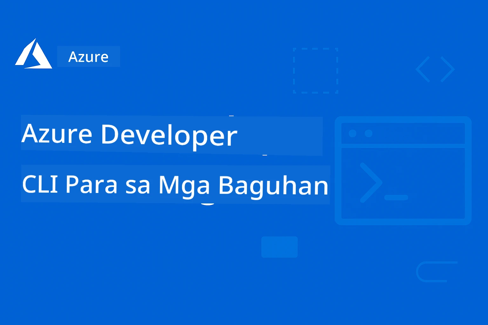

# AZD Para sa mga Nagsisimula: Isang Estrukturadong Paglalakbay sa Pag-aaral

 

[](https://GitHub.com/microsoft/azd-for-beginners/watchers/)
[](https://GitHub.com/microsoft/azd-for-beginners/network/)
[](https://GitHub.com/microsoft/azd-for-beginners/stargazers/)

[](https://discord.com/invite/nkVh3dp)
[](https://discord.gg/nTYy5BXMWG)

---

### Awtomatikong Mga Pagsasalin (Laging Napapanahon)

<!-- CO-OP TRANSLATOR LANGUAGES TABLE START -->
[Arabic](../ar/README.md) | [Bengali](../bn/README.md) | [Bulgarian](../bg/README.md) | [Burmese (Myanmar)](../my/README.md) | [Chinese (Simplified)](../zh-CN/README.md) | [Chinese (Traditional, Hong Kong)](../zh-HK/README.md) | [Chinese (Traditional, Macau)](../zh-MO/README.md) | [Chinese (Traditional, Taiwan)](../zh-TW/README.md) | [Croatian](../hr/README.md) | [Czech](../cs/README.md) | [Danish](../da/README.md) | [Dutch](../nl/README.md) | [Estonian](../et/README.md) | [Finnish](../fi/README.md) | [French](../fr/README.md) | [German](../de/README.md) | [Greek](../el/README.md) | [Hebrew](../he/README.md) | [Hindi](../hi/README.md) | [Hungarian](../hu/README.md) | [Indonesian](../id/README.md) | [Italian](../it/README.md) | [Japanese](../ja/README.md) | [Kannada](../kn/README.md) | [Khmer](../km/README.md) | [Korean](../ko/README.md) | [Lithuanian](../lt/README.md) | [Malay](../ms/README.md) | [Malayalam](../ml/README.md) | [Marathi](../mr/README.md) | [Nepali](../ne/README.md) | [Nigerian Pidgin](../pcm/README.md) | [Norwegian](../no/README.md) | [Persian (Farsi)](../fa/README.md) | [Polish](../pl/README.md) | [Portuguese (Brazil)](../pt-BR/README.md) | [Portuguese (Portugal)](../pt-PT/README.md) | [Punjabi (Gurmukhi)](../pa/README.md) | [Romanian](../ro/README.md) | [Russian](../ru/README.md) | [Serbian (Cyrillic)](../sr/README.md) | [Slovak](../sk/README.md) | [Slovenian](../sl/README.md) | [Spanish](../es/README.md) | [Swahili](../sw/README.md) | [Swedish](../sv/README.md) | [Tagalog (Filipino)](./README.md) | [Tamil](../ta/README.md) | [Telugu](../te/README.md) | [Thai](../th/README.md) | [Turkish](../tr/README.md) | [Ukrainian](../uk/README.md) | [Urdu](../ur/README.md) | [Vietnamese](../vi/README.md)

> **Mas Gusto Mong Mag-clone Nang Lokal?**
>
> Kasama sa repository na ito ang higit sa 50 na pagsasalin ng wika na nagpapalaki nang malaki sa laki ng download. Para mag-clone nang walang mga pagsasalin, gamitin ang sparse checkout:
>
> **Bash / macOS / Linux:**
> ```bash
> git clone --filter=blob:none --sparse https://github.com/microsoft/AZD-for-beginners.git
> cd AZD-for-beginners
> git sparse-checkout set --no-cone '/*' '!translations' '!translated_images'
> ```
>
> **CMD (Windows):**
> ```cmd
> git clone --filter=blob:none --sparse https://github.com/microsoft/AZD-for-beginners.git
> cd AZD-for-beginners
> git sparse-checkout set --no-cone "/*" "!translations" "!translated_images"
> ```
>
> Ito ay nagbibigay sa iyo ng lahat ng kailangan mo upang makumpleto ang kurso nang mas mabilis ang download.
<!-- CO-OP TRANSLATOR LANGUAGES TABLE END -->

## 🆕 Ano ang Bago sa azd Ngayon

> 📌 Ang kursong ito ay na-validate gamit ang **`azd 1.27.1`** (Hulyo 2026). Patakbuhin ang `azd version` upang i-check ang iyong build, at `azd upgrade` para makuha ang pinakabago.

Ang Azure Developer CLI ay lumago lampas sa tradisyunal na mga web app at API. Ngayon, ang azd ay ang nag-iisang kasangkapan para mag-deploy ng **anumang** aplikasyon sa Azure—kabilang ang mga app na may AI at intelligent agents.

Ganito ang ibig sabihin nito para sa iyo:

- **Ang mga AI agents ay ngayon kabilang sa mga pangunahing workload ng azd.** Maaari kang mag-initialize, mag-deploy, at mag-manage ng mga AI agent na proyekto gamit ang parehong `azd init` → `azd up` workflow na kabisado mo na.
- **Kompletong lifecycle ng agent mula sa CLI.** Sinasaklaw na ngayon ng `azure.ai.agents` extension ang buong paglalakbay—`azd ai agent init` para mag-scaffold, `azd ai agent invoke` para mag-test (na may output ng response-timing), `azd ai agent eval generate` at `azd ai agent optimize` para sukatin at pagbutihin ang kalidad, at `azd ai agent delete` para maglinis.
- **Maraming AI building blocks.** Bagong preview extensions—`azure.ai.skills` at `azure.ai.connections`—ang nagpapahintulot sa'yo na mag-manage ng reusable agent skills at Foundry connections nang direkta gamit ang azd.
- **Microsoft Foundry integration** nagdadala ng model deployment, agent hosting, at AI service configuration nang direkta sa azd template ecosystem.
- **Mas maayos ang araw-araw na mga simpleng gawain.** Ang mga bagong release ay ginawang idempotent ang `azd init` (ligtas ulitin), nilinaw ng `azd auth login` ang mga stale token nang awtomatiko, at nagdagdag ng isang friendly na `azd tool` first-run setup prompt.
- **Hindi nagbago ang core workflow.** Kahit nagda-deploy ka ng todo app, microservice, o multi-agent AI solution, pareho pa rin ang mga command.

> **Paalala para sa mga user ng Aspire:** Tinatawag na lang ng Microsoft ang produkto bilang **Aspire** (dating ".NET Aspire"). Hindi nagbago ang suporta ng azd sa Aspire—pinalitan lang ang pangalan.

Kung nagamit mo na ang azd dati, ang suporta para sa AI ay natural na extension—hindi hiwalay na kasangkapan o advanced na track. Kung nagsisimula ka, matututuhan mo ang isang workflow na gumagana para sa lahat.

---

## 🚀 Ano ang Azure Developer CLI (azd)?

**Azure Developer CLI (azd)** ay isang developer-friendly na command-line tool na nagpapadali sa pag-deploy ng mga aplikasyon sa Azure. Sa halip na manual na gumawa at mag-connect ng maraming Azure resources, maaari kang mag-deploy ng buong apps gamit ang isang command lang.

### Ang Magic ng `azd up`

```bash
# Ang iisang utos na ito ang gumagawa ng lahat:
# ✅ Lumilikha ng lahat ng Azure resources
# ✅ Nagse-set up ng networking at seguridad
# ✅ Binuo ang iyong application code
# ✅ Ipinapadala sa Azure
# ✅ Nagbibigay sa iyo ng gumaganang URL
azd up
```

**Tapos na!** Walang Azure Portal na kailangang i-click, walang kailangang araling komplikadong ARM templates, walang manual na configuration—diretso na ang mga gumaganang app sa Azure.

---

## ❓ Azure Developer CLI kumpara sa Azure CLI: Ano ang Pagkakaiba?

Ito ang pinakakaraniwang tanong ng mga baguhan. Narito ang simpleng sagot:

| Feature | **Azure CLI (`az`)** | **Azure Developer CLI (`azd`)** |
|---------|---------------------|--------------------------------|
| **Layunin** | Pamahalaan ang indibidwal na Azure resources | Mag-deploy ng kompletong mga aplikasyon |
| **Isipin** | Nakatuon sa imprastruktura | Nakatuon sa aplikasyon |
| **Halimbawa** | `az webapp create --name myapp...` | `azd up` |
| **Antas ng Pagkatuto** | Kailangan marunong sa Azure services | Kailangan lang malaman ang iyong app |
| **Pinakamainam Para sa** | DevOps, Imprastruktura | Mga Developer, Prototyping |

### Simpleng Paghalintulad

- **Azure CLI** ay parang may kompletong mga gamit para magtayo ng bahay—martilyo, lagari, pako. Kayang buuin ang anuman, pero kailangan marunong sa konstruksyon.
- **Azure Developer CLI** ay parang kumuha ng kontraktor—isinusulat mo kung ano ang gusto mo, sila na ang bahala sa pagtayo.

### Kailan Gagamitin ang Bawat Isa

| Sitwasyon | Gamitin Ito |
|----------|----------|
| "Gusto kong mabilis mag-deploy ng web app" | `azd up` |
| "Kailangan ko lang gumawa ng storage account" | `az storage account create` |
| "Gumagawa ako ng buong AI application" | `azd init --template azure-search-openai-demo` |
| "Kailangan kong i-debug ang isang partikular na Azure resource" | `az resource show` |
| "Gusto ko ng production-ready na deployment sa ilang minuto" | `azd up --environment production` |

### Magkasamang Gumagana ang Dalawa!

Ang AZD ay gumagamit ng Azure CLI sa ilalim. Pwede mong gamitin ang pareho:
```bash
# I-deploy ang iyong app gamit ang AZD
azd up

# Pagkatapos i-fine-tune ang mga partikular na resources gamit ang Azure CLI
az webapp config set --name myapp --always-on true
```

---

## 🌟 Hanapin ang mga Template sa Awesome AZD

Huwag magsimula mula sa wala! Ang **Awesome AZD** ay koleksyon ng komunidad ng mga ready-to-deploy na template:

| Resource | Deskripsyon |
|----------|-------------|
| 🔗 [**Awesome AZD Gallery**](https://azure.github.io/awesome-azd/) | Mag-browse ng 200+ mga template na may one-click deploy |
| 🔗 [**Mag-submit ng Template**](https://github.com/Azure/awesome-azd/issues) | Mag-ambag ng sariling template sa komunidad |
| 🔗 [**GitHub Repository**](https://github.com/Azure/awesome-azd) | I-star at siyasatin ang pinagmulan |

### Mga Patok na AI Template mula sa Awesome AZD

```bash
# RAG Chat gamit ang Microsoft Foundry Models + AI Search
azd init --template azure-search-openai-demo

# Mabilis na AI Chat Application
azd init --template openai-chat-app-quickstart

# AI Agents gamit ang Foundry Agents
azd init --template get-started-with-ai-agents
```

---

## 🎯 Pagsisimula sa 3 Hakbang

Bago magsimula, siguraduhing handa ang iyong makina para sa template na gusto mong i-deploy:

**Windows:**
```powershell
.\validate-setup.ps1
```

**macOS / Linux:**
```bash
bash ./validate-setup.sh
```

Kung mayroong anumang kailangang tseke na pumalya, ayusin muna iyon bago magpatuloy sa mabilisang pagsisimula.

### Hakbang 1: I-install ang AZD (2 minuto)

**Windows:**
```powershell
winget install microsoft.azd
```

**macOS:**
```bash
brew tap azure/azd && brew install azd
```

**Linux:**
```bash
curl -fsSL https://aka.ms/install-azd.sh | bash
```

### Hakbang 2: Mag-authenticate para sa AZD

```bash
# Opsyonal kung plano mong gamitin ang mga Azure CLI na utos nang direkta sa kursong ito
az login

# Kinakailangan para sa mga AZD workflow
azd auth login
```

Kung hindi ka sigurado kung alin ang kailangan mo, sundan ang buong setup flow sa [Installation & Setup](docs/chapter-01-foundation/installation.md#authentication-setup).

### Hakbang 3: I-deploy ang Iyong Unang App

```bash
# Simulan mula sa isang template
azd init --template todo-nodejs-mongo

# I-deploy sa Azure (lumilikha ng lahat!)
azd up
```

**🎉 Tapos na!** Live na ang iyong app sa Azure.

### Linisin (Huwag Kalimutan!)

```bash
# Alisin ang lahat ng mapagkukunan kapag tapos na sa pag-eksperimento
azd down --force --purge
```

---

## 📚 Paano Gamitin ang Kursong Ito

Ang kursong ito ay idinisenyo para sa **sunod-sunod na pag-aaral** - magsimula saan ka kumportable at unti-unting umangat:

| Iyong Karanasan | Magsimula Dito |
|-----------------|------------|
| **Bago sa Azure** | [Kabanata 1: Pundasyon](#-chapter-1-foundation--quick-start) |
| **Alam ang Azure, bago sa AZD** | [Kabanata 1: Pundasyon](#-chapter-1-foundation--quick-start) |
| **Gusto mag-deploy ng AI apps** | [Kabanata 2: AI-First Development](#-chapter-2-ai-first-development-recommended-for-ai-developers) |
| **Gusto ng hands-on na praktis** | [🎓 Interactive Workshop](workshop/README.md) - 3-4 na oras na guided lab |
| **Kailangan ng production patterns** | [Kabanata 8: Production & Enterprise](#-chapter-8-production--enterprise-patterns) |

### Mabilisang Setup

1. **I-fork ang Repository na Ito**: [](https://GitHub.com/microsoft/azd-for-beginners/fork)
2. **I-clone Ito**: `git clone https://github.com/YOUR-USERNAME/azd-for-beginners.git`
3. **Kumuha ng Tulong**: [Azure Discord Community](https://discord.com/invite/ByRwuEEgH4)

> **Mas Gusto Mong Mag-clone Nang Lokal?**

> Kasama sa repository na ito ang higit sa 50 na pagsasalin ng wika na nagpapalaki nang malaki sa laki ng download. Para mag-clone nang walang mga pagsasalin, gamitin ang sparse checkout:
> ```bash
> git clone --filter=blob:none --sparse https://github.com/microsoft/AZD-for-beginners.git
> cd AZD-for-beginners
> git sparse-checkout set --no-cone '/*' '!translations' '!translated_images'
> ```
> Ito ay nagbibigay sa iyo ng lahat ng kailangan mo upang makumpleto ang kurso nang mas mabilis ang download.


## Pangkalahatang-ideya ng Kurso

Masterin ang Azure Developer CLI (azd) sa pamamagitan ng mga estrukturadong kabanata na idinisenyo para sa sunod-sunod na pagkatuto. **Espesyal na pokus sa AI application deployment gamit ang Microsoft Foundry integration.**


### Bakit Mahalaga ang Kursong Ito para sa Mga Modernong Developer

Batay sa mga pananaw mula sa Microsoft Foundry Discord community, **45% ng mga developer ay nais gumamit ng AZD para sa mga AI workload** ngunit nahaharap sa mga hamon tulad ng:
- Masalimuot na multi-service AI architectures
- Mga pinakamahusay na kasanayan sa production AI deployment  
- Integrasyon at konfigurasyon ng Azure AI service
- Pag-optimize ng gastos para sa AI workload
- Pag-troubleshoot ng mga ispesipikong isyu sa AI deployment

### Mga Layunin sa Pagkatuto

Sa pagtatapos ng kursong ito, magagawa mong:
- **Pangunahan ang Mga Pangunahing Kaalaman ng AZD**: Mga pangunahing konsepto, pag-install, at konfigurasyon
- **I-deploy ang AI Applications**: Gamitin ang AZD kasama ang mga serbisyo ng Microsoft Foundry
- **Ipatupad ang Infrastructure as Code**: Pamahalaan ang mga Azure resources gamit ang Bicep templates
- **Mag-troubleshoot ng Deployments**: Lutasin ang mga karaniwang isyu at mag-debug ng problema
- **Mag-optimize para sa Production**: Seguridad, scaling, monitoring, at pamamahala ng gastos
- **Gumawa ng Multi-Agent Solutions**: Mag-deploy ng mga kumplikadong AI architecture

## Bago Magsimula: Mga Account, Access, at mga Palagay

Bago simulan ang Kabanata 1, siguraduhing narito na ang mga sumusunod. Ang mga hakbang sa pag-install sa gabay na ito ay nakabatay sa pagkakaroon ng mga pangunahing ito.

- **Isang Azure subscription**: Maaari kang gumamit ng umiiral na subscription mula sa trabaho o sariling account, o gumawa ng [free trial](https://aka.ms/azurefreetrial) upang makapagsimula.
- **Pahintulot para gumawa ng Azure resources**: Sa karamihan ng mga gawain, kailangan ng hindi bababa sa **Contributor** access sa target na subscription o resource group. May ilang kabanata na maaaring mag-assume na kaya kang gumawa ng resource groups, managed identities, at RBAC assignments.
- [**Account sa GitHub**](https://github.com): Mahalaga ito para maka-fork sa repository, subaybayan ang sariling mga pagbabago, at gamitin ang GitHub Codespaces para sa workshop.
- **Mga kinakailangan para sa template runtime**: Kailangan ng ilang templates ng mga lokal na tool tulad ng Node.js, Python, Java, o Docker. Patakbuhin ang setup validator bago magsimula upang makita ang mga kulang na tools nang maaga.
- **Pangunahing kaalaman sa terminal**: Hindi mo kailangang maging eksperto, ngunit dapat ay komportable kang magpatakbo ng mga utos tulad ng `git clone`, `azd auth login`, at `azd up`.

> **Nagtatrabaho sa isang enterprise subscription?**
> Kung ang iyong Azure environment ay pinamamahalaan ng isang administrator, siguraduhing kumpirmahin bago magsimula na maaari kang mag-deploy ng mga resources sa subscription o resource group na balak mong gamitin. Kung hindi, humiling ng sandbox subscription o Contributor access bago magsimula.

> **Bago sa Azure?**
> Magsimula gamit ang sarili mong Azure trial o pay-as-you-go subscription sa https://aka.ms/azurefreetrial upang makumpleto ang mga gawain nang buo nang hindi naghihintay ng tenant-level approvals.

## 🗺️ Mapa ng Kurso: Mabilis na Pag-navigate ayon sa Kabanata

Bawat kabanata ay may dedikadong README na may mga layunin sa pagkatuto, mabilisang simulang gabay, at mga gawain:

| Kabanata | Paksa | Mga Aralin | Tagal | Antas ng Kahirapan |
|---------|-------|---------|----------|------------|
| **[Kabanata 1: Pundasyon](docs/chapter-01-foundation/README.md)** | Pagsisimula | [Mga Pangunahing AZD](docs/chapter-01-foundation/azd-basics.md) &#124; [Pag-install](docs/chapter-01-foundation/installation.md) &#124; [Unang Proyekto](docs/chapter-01-foundation/first-project.md) | 30-45 min | ⭐ |
| **[Kabanata 2: Pag-unlad ng AI](docs/chapter-02-ai-development/README.md)** | Mga AI-First App | [Microsoft Foundry Integration](docs/chapter-02-ai-development/microsoft-foundry-integration.md) &#124; [AI Agents](docs/chapter-02-ai-development/agents.md) &#124; [Deployment ng Modelo](docs/chapter-02-ai-development/ai-model-deployment.md) &#124; [Workshop](docs/chapter-02-ai-development/ai-workshop-lab.md) | 1-2 hrs | ⭐⭐ |
| **[Kabanata 3: Konfigurasyon](docs/chapter-03-configuration/README.md)** | Autentikasyon at Seguridad | [Konfigurasyon](docs/chapter-03-configuration/configuration.md) &#124; [Autentikasyon & Seguridad](docs/chapter-03-configuration/authsecurity.md) | 45-60 min | ⭐⭐ |
| **[Kabanata 4: Imprastraktura](docs/chapter-04-infrastructure/README.md)** | IaC at Deployment | [Gabay sa Deployment](docs/chapter-04-infrastructure/deployment-guide.md) &#124; [Provisioning](docs/chapter-04-infrastructure/provisioning.md) | 1-1.5 hrs | ⭐⭐⭐ |
| **[Kabanata 5: Multi-Agent](docs/chapter-05-multi-agent/README.md)** | Mga Solusyon ng AI Agent | [Senaryo sa Retail](examples/retail-scenario.md) &#124; [Mga Pattern sa Koordinasyon](docs/chapter-06-pre-deployment/coordination-patterns.md) | 2-3 hrs | ⭐⭐⭐⭐ |
| **[Kabanata 6: Bago ang Deployment](docs/chapter-06-pre-deployment/README.md)** | Pagpaplano at Pagpapatunay | [Preflight Checks](docs/chapter-06-pre-deployment/preflight-checks.md) &#124; [Capacity Planning](docs/chapter-06-pre-deployment/capacity-planning.md) &#124; [Pagpili ng SKU](docs/chapter-06-pre-deployment/sku-selection.md) &#124; [Application Insights](docs/chapter-06-pre-deployment/application-insights.md) | 1 hr | ⭐⭐ |
| **[Kabanata 7: Pag-troubleshoot](docs/chapter-07-troubleshooting/README.md)** | Pag-debug at Pag-aayos | [Mga Karaniwang Isyu](docs/chapter-07-troubleshooting/common-issues.md) &#124; [Pag-debug](docs/chapter-07-troubleshooting/debugging.md) &#124; [AI Issues](docs/chapter-07-troubleshooting/ai-troubleshooting.md) | 1-1.5 hrs | ⭐⭐ |
| **[Kabanata 8: Produksyon](docs/chapter-08-production/README.md)** | Mga Pattern sa Enterprise | [Mga Praktis sa Produksyon](docs/chapter-08-production/production-ai-practices.md) | 2-3 hrs | ⭐⭐⭐⭐ |
| **[🎓 Workshop](workshop/README.md)** | Hands-On Lab | [Panimula](workshop/docs/instructions/0-Introduction.md) &#124; [Pagpili](workshop/docs/instructions/1-Select-AI-Template.md) &#124; [Pagpapatunay](workshop/docs/instructions/2-Validate-AI-Template.md) &#124; [Pag-deconstruct](workshop/docs/instructions/3-Deconstruct-AI-Template.md) &#124; [Konfigurasyon](workshop/docs/instructions/4-Configure-AI-Template.md) &#124; [Pag-customize](workshop/docs/instructions/5-Customize-AI-Template.md) &#124; [Pagtakip](workshop/docs/instructions/6-Teardown-Infrastructure.md) &#124; [Pagtatapos](workshop/docs/instructions/7-Wrap-up.md) | 3-4 hrs | ⭐⭐ |

**Kabuuang Tagal ng Kurso:** ~10-14 na oras | **Antas ng Kasanayan:** Baguhan → Handa sa Produksyon

---

## 📚 Mga Kabanata sa Pagkatuto

*Pumili ng landas ng pagkatuto base sa antas ng karanasan at mga layunin*

### 🚀 Kabanata 1: Pundasyon & Mabilisang Pagsisimula
**Kinakailangan**: Azure subscription, pangunahing kaalaman sa command line  
**Tagal**: 30-45 minuto  
**Kahirapan**: ⭐

#### Ano ang iyong Matututunan
- Pag-unawa sa mga pangunahing kaalaman ng Azure Developer CLI
- Pag-install ng AZD sa iyong platform
- Ang iyong unang matagumpay na deployment

#### Mga Pinagkukunan ng Pagkatuto
- **🎯 Magsimula Dito**: [Ano ang Azure Developer CLI?](#what-is-azure-developer-cli)
- **📖 Teorya**: [Mga Pangunahing AZD](docs/chapter-01-foundation/azd-basics.md) - Mga pangunahing konsepto at terminolohiya
- **⚙️ Setup**: [Pag-install at Setup](docs/chapter-01-foundation/installation.md) - Mga patnubay para sa tiyak na platform
- **🛠️ Hands-On**: [Iyong Unang Proyekto](docs/chapter-01-foundation/first-project.md) - Step-by-step na tutorial
- **📋 Mabilisang Reference**: [Command Cheat Sheet](resources/cheat-sheet.md)

#### Mga Praktikal na Ehersisyo
```bash
# Mabilis na tsek ng pag-install
azd version

# I-deploy ang iyong unang aplikasyon
azd init --template todo-nodejs-mongo
azd up
```

**💡 Kinalabasan ng Kabanata**: Matagumpay na mag-deploy ng isang simpleng web application sa Azure gamit ang AZD

**✅ Katunayan ng Tagumpay:**
```bash
# Pagkatapos matapos ang Kabanata 1, dapat mong magawa ang mga sumusunod:
azd version              # Ipinapakita ang naka-install na bersyon
azd init --template todo-nodejs-mongo  # Ino-initialize ang proyekto
azd up                  # Nagde-deploy sa Azure
azd show                # Ipinapakita ang tumatakbong URL ng app
# Nabubuksan ang aplikasyon sa browser at gumagana
azd down --force --purge  # Nililinis ang mga resources
```

**📊 Oras na Ilalaan:** 30-45 minuto  
**📈 Antas ng Kasanayan Pagkatapos:** Kayang magdeploy ng mga pangunahing aplikasyon nang mag-isa
**📈 Antas ng Kasanayan Pagkatapos:** Kayang magdeploy ng mga pangunahing aplikasyon nang mag-isa

---

### 🤖 Kabanata 2: AI-First Development (Inirerekomenda para sa mga AI Developer)
**Kinakailangan**: Natapos ang Kabanata 1  
**Tagal**: 1-2 oras  
**Kahirapan**: ⭐⭐

#### Ano ang iyong Matututunan
- Integrasyon ng Microsoft Foundry sa AZD
- Pag-deploy ng mga AI-powered na aplikasyon
- Pag-unawa sa mga konfigurasyon ng AI service

#### Mga Pinagkukunan ng Pagkatuto
- **🎯 Magsimula Dito**: [Microsoft Foundry Integration](docs/chapter-02-ai-development/microsoft-foundry-integration.md)
- **🤖 AI Agents**: [Gabay sa AI Agents](docs/chapter-02-ai-development/agents.md) - Mag-deploy ng mga intelligent agents gamit ang AZD
- **📖 Mga Pattern**: [Deployment ng AI Model](docs/chapter-02-ai-development/ai-model-deployment.md) - Mag-deploy at mag-manage ng mga AI models
- **🛠️ Workshop**: [AI Workshop Lab](docs/chapter-02-ai-development/ai-workshop-lab.md) - Ihanda ang iyong mga AI solusyon para sa AZD
- **🎥 Interaktibong Gabay**: [Workshop Materials](workshop/README.md) - Pagkatuto sa browser gamit ang MkDocs * DevContainer Environment
- **📋 Templates**: [Microsoft Foundry Templates](#mga-mapagkukunan-sa-workshop)
- **📝 Mga Halimbawa**: [Mga Halimbawa ng AZD Deployment](examples/README.md)

#### Mga Praktikal na Ehersisyo
```bash
# I-deploy ang iyong unang aplikasyon ng AI
azd init --template azure-search-openai-demo
azd up

# Subukan ang iba pang mga template ng AI
azd init --template openai-chat-app-quickstart
azd init --template agent-openai-python-prompty
```

**💡 Kinalabasan ng Kabanata**: Mag-deploy at mag-configure ng AI-powered chat application na may RAG capabilities

**✅ Katunayan ng Tagumpay:**
```bash
# Pagkatapos ng Kabanata 2, dapat mong magawa ang mga sumusunod:
azd init --template azure-search-openai-demo
azd up
# Subukan ang AI chat interface
# Magtanong at tumanggap ng mga tugon mula sa AI na may mga sanggunian
# Suriin kung gumagana ang pagsasama ng paghahanap
azd monitor  # Tiyakin na nagpapakita ang Application Insights ng telemetry
azd down --force --purge
```

**📊 Oras na Ilalaan:** 1-2 oras  
**📈 Antas ng Kasanayan Pagkatapos:** Kayang magdeploy at mag-configure ng production-ready AI applications  
**💰 Kaantasan sa Gastos:** Nauunawaan ang gastos na $80-150/buwan para sa dev, $300-3500/buwan para sa produksyon

#### 💰 Mga Pagsasaalang-alang sa Gastos para sa AI Deployments

**Development Environment (Tinatayang $80-150/buwan):**
- Microsoft Foundry Models (Pay-as-you-go): $0-50/buwan (batay sa token usage)
- AI Search (Basic tier): $75/buwan
- Container Apps (Consumption): $0-20/buwan
- Storage (Standard): $1-5/buwan

**Production Environment (Tinatayang $300-3,500+/buwan):**
- Microsoft Foundry Models (PTU para sa tuloy-tuloy na performance): $3,000+/buwan O Pay-as-you-go kung mataas ang volume
- AI Search (Standard tier): $250/buwan
- Container Apps (Dedicated): $50-100/buwan
- Application Insights: $5-50/buwan
- Storage (Premium): $10-50/buwan

**💡 Mga Tip para sa Pag-optimize ng Gastos:**
- Gamitin ang **Free Tier** ng Microsoft Foundry Models para sa pagkatuto (Azure OpenAI 50,000 tokens/buwan kasama)
- Patakbuhin ang `azd down` para i-deallocate ang mga resources kapag hindi aktibo sa pag-develop
- Magsimula sa consumption-based billing, mag-upgrade sa PTU para lang sa produksyon
- Gamitin ang `azd provision --preview` para tantiyahin ang gastos bago ang deployment
- Paganahin ang auto-scaling: magbayad lamang para sa aktwal na paggamit

**Pagsubaybay sa Gastos:**
```bash
# Suriin ang tinatayang buwanang gastos
azd provision --preview

# Subaybayan ang aktwal na gastos sa Azure Portal
az consumption budget list --resource-group <your-rg>
```

---

### ⚙️ Kabanata 3: Konfigurasyon at Autentikasyon
**Kinakailangan**: Natapos ang Kabanata 1  
**Tagal**: 45-60 minuto  
**Kahirapan**: ⭐⭐

#### Ano ang iyong Matututunan
- Pagkonfigura at pamamahala ng mga environment
- Mga pinakamahusay na kasanayan sa autentikasyon at seguridad
- Pagpapangalan at organisasyon ng mga resource

#### Mga Pinagkukunan ng Pagkatuto
- **📖 Konfigurasyon**: [Gabay sa Konfigurasyon](docs/chapter-03-configuration/configuration.md) - Pagsasaayos ng environment
- **🔐 Seguridad**: [Authentication patterns at managed identity](docs/chapter-03-configuration/authsecurity.md) - Mga authentication pattern
- **📝 Mga Halimbawa**: [Halimbawa ng Database App](examples/database-app/README.md) - Mga Halimbawa ng AZD Database

#### Mga Praktikal na Ehersisyo
- Magkonfigura ng maraming environment (dev, staging, prod)
- Mag-set up ng managed identity authentication
- Magpatupad ng mga environment-specific configurations

**💡 Kinalabasan ng Kabanata**: Mapamahalaan ang maraming environment na may tamang autentikasyon at seguridad

---

### 🏗️ Kabanata 4: Infrastructure bilang Code at Deployment
**Kinakailangan**: Natapos ang mga Kabanata 1-3  
**Tagal**: 1-1.5 oras  
**Kahirapan**: ⭐⭐⭐

#### Ano ang iyong Matututunan
- Mga advanced na pattern ng deployment
- Infrastructure bilang Code gamit ang Bicep
- Mga estratehiya sa provisioning ng resource

#### Mga Pinagkukunan ng Pagkatuto
- **📖 Deployment**: [Gabay sa Deployment](docs/chapter-04-infrastructure/deployment-guide.md) - Kumpletong workflow
- **🏗️ Provisioning**: [Provisioning ng mga Resources](docs/chapter-04-infrastructure/provisioning.md) - Pamamahala ng Azure resource
- **📝 Mga Halimbawa**: [Halimbawa ng Container App](../../examples/container-app) - Mga containerized deployment

#### Mga Praktikal na Ehersisyo
- Gumawa ng mga custom na Bicep template
- Mag-deploy ng mga multi-service application
- Magpatupad ng blue-green deployment strategies

**💡 Kinalabasan ng Kabanata**: Matagumpay na makapagdeploy ng mga kompleks na multi-service application gamit ang custom infrastructure templates

---


### 🎯 Kabanata 5: Mga Solusyon ng Multi-Agent AI (Advanced)
**Mga Kinakailangan**: Nakumpleto ang Kabanata 1-2  
**Tagal**: 2-3 oras  
**Kumplikado**: ⭐⭐⭐⭐

#### Ano ang Iyong Matututuhan
- Mga pattern ng multi-agent arkitektura
- Orkestrasyon at koordinasyon ng mga agent
- Produksyon-handa na mga deployment ng AI

#### Mga Mapagkukunan sa Pag-aaral
- **🤖 Tampok na Proyekto**: [Retail Multi-Agent Solution](examples/retail-scenario.md) - Kumpletong implementasyon
- **🛠️ ARM Templates**: [ARM Template Package](../../examples/retail-multiagent-arm-template) - Isang-click na deployment
- **📖 Arkitektura**: [Multi-agent coordination patterns](docs/chapter-06-pre-deployment/coordination-patterns.md) - Mga Pattern

#### Mga Praktikal na Pagsasanay
```bash
# I-deploy ang kumpletong retail multi-agent na solusyon
cd examples/retail-multiagent-arm-template
./deploy.sh

# Suriin ang mga konfigurasyon ng agent
az deployment group show --resource-group <rg-name> --name <deployment-name>
```

**💡 Kinalabasan ng Kabanata**: I-deploy at pamahalaan ang produksyon-handang multi-agent AI solution na may mga Customer at Inventory agent

---

### 🔍 Kabanata 6: Pre-Deployment Validation at Pagpaplano
**Mga Kinakailangan**: Nakumpleto ang Kabanata 4  
**Tagal**: 1 oras  
**Kumplikado**: ⭐⭐

#### Ano ang Iyong Matututuhan
- Pagpaplano ng kapasidad at pagpapatunay ng mga resources
- Mga estratehiya sa pagpili ng SKU
- Mga pre-flight checks at automation

#### Mga Mapagkukunan sa Pag-aaral
- **📊 Pagpaplano**: [Capacity Planning](docs/chapter-06-pre-deployment/capacity-planning.md) - Pagpapatunay ng resources
- **💰 Pagpili**: [SKU Selection](docs/chapter-06-pre-deployment/sku-selection.md) - Mga cost-effective na pagpipilian
- **✅ Pagpapatunay**: [Pre-flight Checks](docs/chapter-06-pre-deployment/preflight-checks.md) - Automated scripts

#### Mga Praktikal na Pagsasanay
- Patakbuhin ang mga capacity validation scripts
- I-optimize ang mga pagpili ng SKU para sa gastusin
- Ipatupad ang automated pre-deployment checks

**💡 Kinalabasan ng Kabanata**: Patunayan at i-optimize ang mga deployment bago isagawa

---

### 🚨 Kabanata 7: Troubleshooting at Debugging
**Mga Kinakailangan**: Anumang deployment chapter na nakumpleto  
**Tagal**: 1-1.5 oras  
**Kumplikado**: ⭐⭐

#### Ano ang Iyong Matututuhan
- Sistematikong pamamaraan ng debugging
- Mga karaniwang isyu at mga solusyon
- Troubleshooting na espesipiko sa AI

#### Mga Mapagkukunan sa Pag-aaral
- **🔧 Karaniwang Isyu**: [Common Issues](docs/chapter-07-troubleshooting/common-issues.md) - FAQ at mga solusyon
- **🕵️ Debugging**: [Debugging Guide](docs/chapter-07-troubleshooting/debugging.md) - Mga hakbang-hakbang na estratehiya
- **🤖 AI Issues**: [AI-Specific Troubleshooting](docs/chapter-07-troubleshooting/ai-troubleshooting.md) - Mga problema sa AI service

#### Mga Praktikal na Pagsasanay
- Diagnosen ang mga pagkabigo sa deployment
- Lutasin ang mga isyu sa authentication
- I-debug ang connectivity ng AI service

**💡 Kinalabasan ng Kabanata**: Makapag-diagnose at makalutas ng mga karaniwang isyu sa deployment nang mag-isa

---

### 🏢 Kabanata 8: Mga Pattern sa Produksyon at Enterprise
**Mga Kinakailangan**: Nakumpleto ang Kabanata 1-4  
**Tagal**: 2-3 oras  
**Kumplikado**: ⭐⭐⭐⭐

#### Ano ang Iyong Matututuhan
- Mga estratehiya sa produksyon na deployment
- Mga pattern ng seguridad para sa enterprise
- Monitoring at pag-optimize ng gastusin

#### Mga Mapagkukunan sa Pag-aaral
- **🏭 Produksyon**: [Production AI Best Practices](docs/chapter-08-production/production-ai-practices.md) - Mga pattern sa enterprise
- **📝 Mga Halimbawa**: [Microservices Example](../../examples/microservices) - Mga kumplikadong arkitektura
- **📊 Monitoring**: [Application Insights integration](docs/chapter-06-pre-deployment/application-insights.md) - Monitoring

#### Mga Praktikal na Pagsasanay
- Ipatupad ang mga pattern ng seguridad ng enterprise
- Mag-setup ng komprehensibong monitoring
- Mag-deploy sa produksyon na may tamang pamamahala

**💡 Kinalabasan ng Kabanata**: Mag-deploy ng mga enterprise-ready na aplikasyon na may buong kakayahan sa produksyon

---

## 🎓 Pangkalahatang-ideya ng Workshop: Hands-On Learning Experience

> **⚠️ STATUS NG WORKSHOP: Aktibong Pag-develop**  
> Ang mga materyales sa workshop ay kasalukuyang dine-develop at pinapaganda. Gumagana na ang mga pangunahing module, ngunit may ilang advanced na bahagi na hindi pa kumpleto. Aktibo kaming nagtatrabaho upang matapos ang lahat ng nilalaman. [Subaybayan ang progreso →](workshop/README.md)

### Interaktibong Materyales ng Workshop
**Komprehensibong hands-on learning gamit ang mga browser-based na tool at gabay na pagsasanay**

Ang aming mga materyales sa workshop ay nagbibigay ng nakaayos, interaktibong karanasan sa pag-aaral na nagpapahusay sa kurikulum na nakabatay sa kabanata sa itaas. Dinisenyo ang workshop para sa parehong self-paced learning at instructor-led sessions.

#### 🛠️ Mga Tampok ng Workshop
- **Browser-Based Interface**: Kumpletong MkDocs-powered na workshop na may paghahanap, pagkopya, at mga tampok sa tema
- **GitHub Codespaces Integration**: Isang-click na setup ng development environment
- **Structured Learning Path**: 8-module na gabay na mga pagsasanay (3-4 na oras kabuuan)
- **Progressive Methodology**: Panimula → Pagpili → Pagpapatunay → Pagde-deconstruct → Configuration → Customization → Teardown → Pagsasara
- **Interactive DevContainer Environment**: Mga pre-configured na tool at dependencies

#### 📚 Istraktura ng Mga Module sa Workshop
Ang workshop ay sumusunod sa isang **8-module progressive methodology** na magdadala sa iyo mula pagtuklas hanggang mastery sa deployment:

| Module | Paksa | Ano ang Gagawin Mo | Tagal |
|--------|-------|----------------|----------|
| **0. Panimula** | Pangkalahatang Ideya ng Workshop | Unawain ang mga layunin sa pagkatuto, mga kinakailangan, at istraktura ng workshop | 15 min |
| **1. Pagpili** | Pagdiskubre ng Template | Tuklasin ang mga AZD template at piliin ang angkop na AI template para sa iyong senaryo | 20 min |
| **2. Pagpapatunay** | I-deploy at Suriin | I-deploy ang template gamit ang `azd up` at patunayan na gumagana ang imprastruktura | 30 min |
| **3. Pagde-deconstruct** | Unawain ang Istraktura | Gamitin ang GitHub Copilot para tuklasin ang arkitektura ng template, mga Bicep file, at organisasyon ng code | 30 min |
| **4. Configuration** | Masusing pag-aaral ng azure.yaml | Masterin ang `azure.yaml` configuration, lifecycle hooks, at environment variables | 30 min |
| **5. Customization** | Gawing Iyo | Paganahin ang AI Search, tracing, evaluation, at i-customize para sa iyong senaryo | 45 min |
| **6. Teardown** | Paglilinis | Maingat na i-deprovision ang mga resources gamit ang `azd down --purge` | 15 min |
| **7. Pagsasara** | Mga Susunod na Hakbang | Suriin ang mga na-accomplish, mga pangunahing konsepto, at ipagpatuloy ang iyong paglalakbay sa pagkatuto | 15 min |

**Daloy ng Workshop:**
```
Introduction → Selection → Validation → Deconstruction → Configuration → Customization → Teardown → Wrap-up
     ↓            ↓           ↓              ↓               ↓              ↓            ↓           ↓
  Overview    Find the     Deploy &      Explore        Master         Customize     Clean up    Review &
             right        verify        code &        azure.yaml      for your      resources   next steps
             template                   structure                     scenario
```

#### 🚀 Pagsisimula sa Workshop
```bash
# Opsyon 1: GitHub Codespaces (Inirerekomenda)
# I-click ang "Code" → "Create codespace on main" sa repositoryo

# Opsyon 2: Lokal na Pag-unlad
git clone https://github.com/microsoft/azd-for-beginners.git
cd azd-for-beginners/workshop
# Sundin ang mga tagubilin sa pagsasaayos sa workshop/README.md
```

#### 🎯 Mga Kinalabasan ng Pagkatuto sa Workshop
Sa pagtapos ng workshop, ang mga kalahok ay:
- **Mag-deploy ng Production AI Applications**: Gamitin ang AZD kasama ang Microsoft Foundry services
- **Maging Master sa Multi-Agent Architectures**: Magpatupad ng magkordinadong mga solusyon ng AI agent
- **Magpatupad ng Mga Pinakamahusay na Praktis sa Seguridad**: I-configure ang authentication at kontrol sa access
- **I-optimize para sa Sukat**: Magdisenyo ng cost-effective at mataas na performance na mga deployment
- **Mag-troubleshoot ng Mga Deployment**: Malutas ang mga karaniwang isyu nang mag-isa

#### 📖 Mga Mapagkukunan sa Workshop
- **🎥 Interaktibong Gabay**: [Workshop Materials](workshop/README.md) - Browser-based na learning environment
- **📋 Mga Instruksyon Bawat Module**:
  - [0. Panimula](workshop/docs/instructions/0-Introduction.md) - Pangkalahatang-ideya at mga layunin ng workshop
  - [1. Pagpili](workshop/docs/instructions/1-Select-AI-Template.md) - Hanapin at piliin ang mga AI template
  - [2. Pagpapatunay](workshop/docs/instructions/2-Validate-AI-Template.md) - I-deploy at patunayan ang mga template
  - [3. Pagde-deconstruct](workshop/docs/instructions/3-Deconstruct-AI-Template.md) - Tuklasin ang arkitektura ng template
  - [4. Configuration](workshop/docs/instructions/4-Configure-AI-Template.md) - Masterin ang azure.yaml
  - [5. Customization](workshop/docs/instructions/5-Customize-AI-Template.md) - I-customize para sa iyong senaryo
  - [6. Teardown](workshop/docs/instructions/6-Teardown-Infrastructure.md) - Linisin ang mga resources
  - [7. Pagsasara](workshop/docs/instructions/7-Wrap-up.md) - Suriin at mga susunod na hakbang
- **🛠️ AI Workshop Lab**: [AI Workshop Lab](docs/chapter-02-ai-development/ai-workshop-lab.md) - Mga pagsasanay na nakatutok sa AI
- **💡 Quick Start**: [Workshop Setup Guide](workshop/README.md#quick-start) - Pag-configure ng kapaligiran

**Perpekto para sa**: Pagsasanay sa korporasyon, mga kurso sa unibersidad, self-paced na pagkatuto, at developer bootcamps.

---

## 📖 Malalim na Pagsisid: Mga Kakayahan ng AZD

Higit pa sa mga batayan, nagbibigay ang AZD ng makapangyarihang mga tampok para sa produksyon na mga deployment:

- **Deployment na naka-template** - Gamitin ang mga pre-built na template para sa mga karaniwang pattern ng aplikasyon
- **Infrastructure as Code** - Pamahalaan ang mga Azure resources gamit ang Bicep o Terraform  
- **Pinagsamang workflows** - Seamless na pag-provision, pag-deploy, at pag-monitor ng mga aplikasyon
- **Developer-friendly** - Na-optimize para sa productivity at karanasan ng developer

### **AZD + Microsoft Foundry: Perpekto para sa Mga Deployment ng AI**

**Bakit AZD para sa Mga Solusyon ng AI?** Tinutugunan ng AZD ang mga pangunahing hamon na hinaharap ng mga AI developer:

- **AI-Ready Templates** - Mga pre-configured na template para sa Microsoft Foundry Models, Azure AI Services, at mga ML workload
- **Secure na Mga Deployment ng AI** - May built-in na mga pattern ng seguridad para sa AI services, API keys, at mga model endpoint  
- **Mga Pattern ng Produksyon ng AI** - Pinakamahusay na praktis para sa scalable, cost-effective na pag-deploy ng AI applications
- **End-to-End AI Workflows** - Mula sa pag-develop ng model hanggang sa produksyon na deployment na may tamang monitoring
- **Pag-optimize ng Gastos** - Smart na alokasyon ng resources at mga estratehiya sa scaling para sa mga AI workload
- **Integrasyon sa Microsoft Foundry** - Seamless na koneksyon sa Microsoft Foundry model catalog at mga endpoint

---

## 🎯 Mga Template at Halimbawa na Aklatan

### Tampok: Mga Template ng Microsoft Foundry
**Magsimula dito kung nag-de-deploy ka ng mga AI application!**

> **Tandaan:** Ipinapakita ng mga template na ito ang iba't ibang mga pattern ng AI. Ang iba ay panlabas na Azure Samples, ang iba ay lokal na implementasyon.

| Template | Kabanata | Kumplikado | Mga Serbisyo | Uri |
|----------|---------|------------|----------|------|
| [**Get started with AI chat**](https://github.com/Azure-Samples/get-started-with-ai-chat) | Kabanata 2 | ⭐⭐ | AzureOpenAI + Azure AI Model Inference API + Azure AI Search + Azure Container Apps + Application Insights | Panlabas |
| [**Get started with AI agents**](https://github.com/Azure-Samples/get-started-with-ai-agents) | Kabanata 2 | ⭐⭐ | Foundry Agents + AzureOpenAI + Azure AI Search + Azure Container Apps + Application Insights| Panlabas |
| [**Azure Search + OpenAI Demo**](https://github.com/Azure-Samples/azure-search-openai-demo) | Kabanata 2 | ⭐⭐ | AzureOpenAI + Azure AI Search + App Service + Storage | Panlabas |
| [**OpenAI Chat App Quickstart**](https://github.com/Azure-Samples/openai-chat-app-quickstart) | Kabanata 2 | ⭐ | AzureOpenAI + Container Apps + Application Insights | Panlabas |
| [**Agent OpenAI Python Prompty**](https://github.com/Azure-Samples/agent-openai-python-prompty) | Kabanata 5 | ⭐⭐⭐ | AzureOpenAI + Azure Functions + Prompty | Panlabas |
| [**Contoso Chat RAG**](https://github.com/Azure-Samples/contoso-chat) | Kabanata 8 | ⭐⭐⭐⭐ | AzureOpenAI + AI Search + Cosmos DB + Container Apps | Panlabas |
| [**Retail Multi-Agent Solution**](examples/retail-scenario.md) | Kabanata 5 | ⭐⭐⭐⭐ | AzureOpenAI + AI Search + Storage + Container Apps + Cosmos DB | **Lokal** |

### Tampok: Kumpletong Mga Learning Scenario
**Mga produksyon-handang template ng aplikasyon na naka-map sa mga kabanata ng pag-aaral**

| Template | Learning Chapter | Kumplikado | Pangunahing Natutuhan |
|----------|------------------|------------|--------------|
| [**openai-chat-app-quickstart**](https://github.com/Azure-Samples/openai-chat-app-quickstart) | Kabanata 2 | ⭐ | Mga pangunahing pattern ng deployment ng AI |
| [**azure-search-openai-demo**](https://github.com/Azure-Samples/azure-search-openai-demo) | Kabanata 2 | ⭐⭐ | Implementasyon ng RAG gamit ang Azure AI Search |
| [**ai-document-processing**](https://github.com/Azure-Samples/ai-document-processing) | Kabanata 4 | ⭐⭐ | Integrasyon ng Document Intelligence |
| [**agent-openai-python-prompty**](https://github.com/Azure-Samples/agent-openai-python-prompty) | Kabanata 5 | ⭐⭐⭐ | Framework ng agent at pagtawag sa function |
| [**contoso-chat**](https://github.com/Azure-Samples/contoso-chat) | Kabanata 8 | ⭐⭐⭐ | Orkestrasyon ng enterprise AI |
| [**retail-multi-agent-solution**](examples/retail-scenario.md) | Kabanata 5 | ⭐⭐⭐⭐ | Multi-agent architecture na may mga Customer at Inventory agent |

### Pagkatuto sa Uri ng Halimbawa

> **📌 Lokal vs. Panlabas na Halimbawa:**  
> **Lokal na Halimbawa** (sa repo na ito) = Handa nang gamitin agad  
> **Panlabas na Halimbawa** (Azure Samples) = I-clone mula sa mga naka-link na repositoryo

#### Lokal na Halimbawa (Handa Nang Gamitin)
- [**Retail Multi-Agent Solution**](examples/retail-scenario.md) - Kumpletong produksyon-handang implementasyon gamit ang mga ARM template
  - Multi-agent arkitektura (Customer + Inventory agents)
  - Komprehensibong monitoring at pagsusuri
  - Isang-click na deployment sa pamamagitan ng ARM template

#### Lokal na Halimbawa - Mga Container Application (Kabanata 2-5)
**Komprehensibong mga halimbawa ng container deployment sa repositoryong ito:**

- [**Mga Halimbawa ng Container App**](examples/container-app/README.md) - Kumpletong gabay sa containerized deployments
  - [Simple Flask API](../../examples/container-app/simple-flask-api) - Pangunahing REST API na may scale-to-zero
  - [Microservices Architecture](../../examples/container-app/microservices) - Production-ready multi-service deployment
  - Quick Start, Production, at Advanced deployment patterns
  - Gabay sa monitoring, seguridad, at cost optimization

#### Mga Panlabas na Halimbawa - Simpleng mga Aplikasyon (Mga Kabanata 1-2)
**I-clone ang mga repositoryo ng Azure Samples na ito upang makapagsimula:**
- [Simpleng Web App - Node.js + MongoDB](https://github.com/Azure-Samples/todo-nodejs-mongo) - Mga pangunahing deployment pattern
- [Static Website - React SPA](https://github.com/Azure-Samples/todo-csharp-sql-swa-func) - Deployment ng static na nilalaman
- [Container App - Python Flask](https://github.com/Azure-Samples/container-apps-store-api-microservice) - REST API deployment

#### Mga Panlabas na Halimbawa - Pagsasama ng Database (Mga Kabanata 3-4)  
- [Database App - C# + SQL](https://github.com/Azure-Samples/todo-csharp-sql) - Mga pattern sa konektividad ng database
- [Functions + Cosmos DB](https://github.com/Azure-Samples/todo-python-mongo-swa-func) - Serverless na workflow ng data

#### Mga Panlabas na Halimbawa - Advanced na mga Pattern (Mga Kabanata 4-8)
- [Java Microservices](https://github.com/Azure-Samples/java-microservices-aca-lab) - Mga architecture na multi-serbisyo
- [Container Apps Jobs](https://github.com/Azure-Samples/container-apps-jobs) - Background processing  
- [Enterprise ML Pipeline](https://github.com/Azure-Samples/mlops-v2) - Production-ready ML patterns

### Mga Koleksyon ng Panlabas na Template
- [**Opisyal na AZD Template Gallery**](https://azure.github.io/awesome-azd/) - Piniling koleksyon ng opisyal at komunidad na mga template
- [**Azure Developer CLI Templates**](https://learn.microsoft.com/en-us/azure/developer/azure-developer-cli/azd-templates) - Dokumentasyon ng Microsoft Learn sa mga template
- [**Mga Halimbawa sa Direktoryo**](examples/README.md) - Lokal na mga halimbawa sa pag-aaral na may detalyadong paliwanag

---

## 📚 Mga Mapagkukunan at Sanggunian para sa Pagkatuto

### Mabilisang Sanggunian
- [**Command Cheat Sheet**](resources/cheat-sheet.md) - Mahahalagang azd na mga utos na inayos ayon sa kabanata
- [**Glossary**](resources/glossary.md) - Terminolohiyang Azure at azd  
- [**FAQ**](resources/faq.md) - Mga karaniwang tanong na inayos ayon sa kabanata ng pagkatuto
- [**Study Guide**](resources/study-guide.md) - Komprehensibong mga pagsasanay

### Mga Hands-On Workshop
- [**AI Workshop Lab**](docs/chapter-02-ai-development/ai-workshop-lab.md) - Gawing AZD-deployable ang iyong mga AI solution (2-3 oras)
- [**Interactive Workshop**](workshop/README.md) - 8-module na mga gabay na ehersisyo gamit ang MkDocs at GitHub Codespaces
  - Sundan: Panimula → Pagpili → Pagpapatunay → Pagbuwag → Pag-configure → Pag-customize → Pag-aalis → Pagsasara

### Mga Panlabas na Mapagkukunan sa Pagkatuto
- [Azure Developer CLI Documentation](https://learn.microsoft.com/en-us/azure/developer/azure-developer-cli/)
- [Azure Architecture Center](https://learn.microsoft.com/en-us/azure/architecture/)
- [Azure Pricing Calculator](https://azure.microsoft.com/pricing/calculator/)
- [Azure Status](https://status.azure.com/)

### Mga Kasanayan ng AI Agent para sa Iyong Editor
- [**Microsoft Azure Skills on skills.sh**](https://skills.sh/microsoft/github-copilot-for-azure) - 37 bukas na kasanayan ng agent para sa Azure AI, Foundry, deployment, diagnostics, cost optimization, at iba pa. I-install ang mga ito sa GitHub Copilot, Cursor, Claude Code, o anumang suportadong agent:
  ```bash
  npx skills add microsoft/github-copilot-for-azure
  ```

---

## 🔧 Mabilisang Gabay sa Pag-troubleshoot

**Mga karaniwang problema na nararanasan ng mga nagsisimula at agarang solusyon:**

<details>
<summary><strong>❌ "azd: command not found"</strong></summary>

```bash
# I-install muna ang AZD
# Windows (PowerShell):
winget install microsoft.azd

# macOS:
brew tap azure/azd && brew install azd

# Linux:
curl -fsSL https://aka.ms/install-azd.sh | bash

# Suriin ang pag-install
azd version
```
</details>

<details>
<summary><strong>❌ "No subscription found" o "Subscription not set"</strong></summary>

```bash
# Ilista ang mga magagamit na subscription
az account list --output table

# Itakda ang default na subscription
az account set --subscription "<subscription-id-or-name>"

# Itakda para sa AZD na kapaligiran
azd env set AZURE_SUBSCRIPTION_ID "<subscription-id>"

# Patunayan
az account show
```
</details>

<details>
<summary><strong>❌ "InsufficientQuota" o "Quota exceeded"</strong></summary>

```bash
# Subukan ang iba't ibang Azure region
azd env set AZURE_LOCATION "westus2"
azd up

# O gumamit ng mas maliliit na SKU sa development
# I-edit ang infra/main.parameters.json:
{
  "sku": "B1"  // Instead of "P1V2"
}
```
</details>

<details>
<summary><strong>❌ Nabigo ang "azd up" sa kalagitnaan</strong></summary>

```bash
# Opsyon 1: Linisin at subukang muli
azd down --force --purge
azd up

# Opsyon 2: Ayusin lamang ang imprastraktura
azd provision

# Opsyon 3: Suriin ang detalyadong katayuan
azd show

# Opsyon 4: Suriin ang mga log sa Azure Monitor
azd monitor --logs
```
</details>

<details>
<summary><strong>❌ "Authentication failed" o "Token expired"</strong></summary>

```bash
# Muling magpatunay para sa AZD
azd auth logout
azd auth login

# Opsyonal: i-refresh din ang Azure CLI kung nagpapatakbo ka ng mga az command
az logout
az login

# Suriin ang pagpapatunay
az account show
```
</details>

<details>
<summary><strong>❌ "Resource already exists" o mga naming conflict</strong></summary>

```bash
# Gumagawa ang AZD ng mga natatanging pangalan, ngunit kung may salungatan:
azd down --force --purge

# Pagkatapos subukang muli gamit ang bagong kapaligiran
azd env new dev-v2
azd up
```
</details>

<details>
<summary><strong>❌ Mahabang oras ang deployment ng template</strong></summary>

**Normal na oras ng paghihintay:**
- Simpleng web app: 5-10 minuto
- App na may database: 10-15 minuto
- Mga AI application: 15-25 minuto (Mabagal ang provisioning ng OpenAI)

```bash
# Suriin ang progreso
azd show

# Kung na-stuck ng >30 minuto, suriin ang Azure Portal:
azd monitor --overview
# Hanapin ang mga nabigong deployment
```
</details>

<details>
<summary><strong>❌ "Permission denied" o "Forbidden"</strong></summary>

```bash
# Suriin ang iyong Azure na papel
az role assignment list --assignee $(az account show --query user.name -o tsv)

# Kailangan mo ng hindi bababa sa papel na "Contributor"
# Hilingin sa iyong Azure admin na magbigay:
# - Contributor (para sa mga resources)
# - User Access Administrator (para sa mga role assignments)
```
</details>

<details>
<summary><strong>❌ Hindi makita ang URL ng deployed na aplikasyon</strong></summary>

```bash
# Ipakita ang lahat ng mga endpoint ng serbisyo
azd show

# O buksan ang Azure Portal
azd monitor

# Suriin ang partikular na serbisyo
azd env get-values
# Hanapin ang mga variable na *_URL
```
</details>

### 📚 Kumpletong Mga Mapagkukunan sa Pag-troubleshoot

- **Gabay sa Karaniwang mga Isyu:** [Detaladong Solusyon](docs/chapter-07-troubleshooting/common-issues.md)
- **AI-Specific na mga Isyu:** [AI Troubleshooting](docs/chapter-07-troubleshooting/ai-troubleshooting.md)
- **Gabay sa Pag-debug:** [Hakbang-hakbang na Pag-debug](docs/chapter-07-troubleshooting/debugging.md)
- **Humingi ng Tulong:** [Azure Discord](https://discord.gg/microsoft-azure) #azure-developer-cli

---

## 🎓 Pagtatapos sa Kurso at Sertipikasyon

### Pagsubaybay sa Progreso
Subaybayan ang iyong progreso sa pagkatuto sa bawat kabanata:

- [ ] **Kabanata 1**: Pundasyon at Quick Start ✅
- [ ] **Kabanata 2**: AI-First Development ✅  
- [ ] **Kabanata 3**: Configuration at Authentication ✅
- [ ] **Kabanata 4**: Infrastructure as Code at Deployment ✅
- [ ] **Kabanata 5**: Multi-Agent AI Solutions ✅
- [ ] **Kabanata 6**: Pre-Deployment Validation at Planning ✅
- [ ] **Kabanata 7**: Troubleshooting at Debugging ✅
- [ ] **Kabanata 8**: Production at Enterprise Patterns ✅

### Pagpapatunay sa Pagkatuto
Pagkatapos makumpleto ang bawat kabanata, patunayan ang iyong kaalaman sa pamamagitan ng:
1. **Praktikal na Ehersisyo**: Kumpletuhin ang hands-on deployment ng kabanata
2. **Pagsusuri ng Kaalaman**: Suriin ang seksyon ng FAQ para sa iyong kabanata
3. **Diskusyon sa Komunidad**: Ibahagi ang iyong karanasan sa Azure Discord
4. **Susunod na Kabanata**: Lumipat sa susunod na antas ng kahirapan

### Mga Benepisyo ng Pagtatapos ng Kurso
Kapag natapos ang lahat ng mga kabanata, magkakaroon ka ng:
- **Karanasan sa Produksyon**: Nailathala nang tunay na mga AI application sa Azure
- **Mga Propesyonal na Kasanayan**: Kakayahang mag-deploy na handa para sa enterprise  
- **Pagkilala mula sa Komunidad**: Aktibong miyembro ng Azure developer community
- **Pag-unlad sa Karera**: In-demand na kasanayan sa AZD at AI deployment

---

## 🤝 Komunidad at Suporta

### Humingi ng Tulong at Suporta
- **Teknikal na Isyu**: [Mag-ulat ng mga bugs at humiling ng mga tampok](https://github.com/microsoft/azd-for-beginners/issues)
- **Mga Tanong sa Pagkatuto**: [Microsoft Azure Discord Community](https://discord.gg/microsoft-azure) at [](https://discord.gg/nTYy5BXMWG)
- **Tulong na AI-Specific**: Sumali sa [](https://discord.gg/nTYy5BXMWG)
- **Dokumentasyon**: [Opisyal na dokumentasyon ng Azure Developer CLI](https://learn.microsoft.com/en-us/azure/developer/azure-developer-cli/)

### Mga Insight mula sa Komunidad ng Microsoft Foundry Discord

**Mga Kamakailang Resulta ng Poll mula sa #Azure Channel:**
- **45%** ng mga developer ay nais gamitin ang AZD para sa AI workloads
- **Pangunahing mga hamon**: Multi-service deployments, pamamahala ng kredensyal, kahandaan sa produksyon  
- **Pinakaginagawa**: AI-specific na mga template, mga gabay sa pag-troubleshoot, pinakamahuhusay na gawi

**Sumali sa aming komunidad upang:**
- Ibahagi ang iyong mga karanasan sa AZD + AI at humingi ng tulong
- Ma-access ang mga maagang preview ng mga bagong AI template
- Mag-ambag sa mga pinakamahuhusay na gawi sa AI deployment
- Makaimpluwensya sa hinaharap na pag-unlad ng mga tampok ng AI + AZD

### Pag-aambag sa Kurso
Malugod naming tinatanggap ang mga kontribusyon! Mangyaring basahin ang aming [Contributing Guide](CONTRIBUTING.md) para sa mga detalye sa:
- **Pagpapabuti ng Nilalaman**: Pahusayin ang mga kasalukuyang kabanata at mga halimbawa
- **Mga Bagong Halimbawa**: Magdagdag ng mga totoong senaryo at mga template  
- **Pagsasalin**: Tumulong sa pagpapanatili ng suporta sa maraming wika
- **Mga Ulat ng Bug**: Pahusayin ang katumpakan at kalinawan
- **Mga Pamantayan ng Komunidad**: Sundin ang aming inklusibong mga patnubay sa komunidad

---

## 📄 Impormasyon ng Kurso

### Lisensya
Ang proyektong ito ay lisensyado sa ilalim ng MIT License - tingnan ang [LICENSE](../../LICENSE) na file para sa mga detalye.

### Mga Kaugnay na Microsoft Learning Resources

Ang aming koponan ay gumagawa ng iba pang mga komprehensibong kurso sa pagkatuto:

<!-- CO-OP TRANSLATOR OTHER COURSES START -->
### LangChain
[](https://aka.ms/langchain4j-for-beginners)
[](https://aka.ms/langchainjs-for-beginners?WT.mc_id=m365-94501-dwahlin)
[](https://github.com/microsoft/langchain-for-beginners?WT.mc_id=m365-94501-dwahlin)
---

### Azure / Edge / MCP / Agents
[](https://github.com/microsoft/AZD-for-beginners?WT.mc_id=academic-105485-koreyst)
[](https://github.com/microsoft/edgeai-for-beginners?WT.mc_id=academic-105485-koreyst)
[](https://github.com/microsoft/mcp-for-beginners?WT.mc_id=academic-105485-koreyst)
[](https://github.com/microsoft/ai-agents-for-beginners?WT.mc_id=academic-105485-koreyst)

---
 
### Generative AI Series
[](https://github.com/microsoft/generative-ai-for-beginners?WT.mc_id=academic-105485-koreyst)
[-9333EA?style=for-the-badge&labelColor=E5E7EB&color=9333EA)](https://github.com/microsoft/Generative-AI-for-beginners-dotnet?WT.mc_id=academic-105485-koreyst)
[-C084FC?style=for-the-badge&labelColor=E5E7EB&color=C084FC)](https://github.com/microsoft/generative-ai-for-beginners-java?WT.mc_id=academic-105485-koreyst)

[-E879F9?style=for-the-badge&labelColor=E5E7EB&color=E879F9)](https://github.com/microsoft/generative-ai-with-javascript?WT.mc_id=academic-105485-koreyst)

---
 
### Pangunahing Pag-aaral
[](https://aka.ms/ml-beginners?WT.mc_id=academic-105485-koreyst)
[](https://aka.ms/datascience-beginners?WT.mc_id=academic-105485-koreyst)
[](https://aka.ms/ai-beginners?WT.mc_id=academic-105485-koreyst)
[](https://github.com/microsoft/Security-101?WT.mc_id=academic-96948-sayoung)
[](https://aka.ms/webdev-beginners?WT.mc_id=academic-105485-koreyst)
[](https://aka.ms/iot-beginners?WT.mc_id=academic-105485-koreyst)
[](https://github.com/microsoft/xr-development-for-beginners?WT.mc_id=academic-105485-koreyst)

---
 
### Series ng Copilot
[](https://aka.ms/GitHubCopilotAI?WT.mc_id=academic-105485-koreyst)
[](https://github.com/microsoft/mastering-github-copilot-for-dotnet-csharp-developers?WT.mc_id=academic-105485-koreyst)
[](https://github.com/microsoft/CopilotAdventures?WT.mc_id=academic-105485-koreyst)
<!-- CO-OP TRANSLATOR OTHER COURSES END -->

---

## 🗺️ Pag-navigate ng Kurso

**🚀 Handa Nang Magsimulang Matuto?**

**Mga Baguhan**: Magsimula sa [Kabanata 1: Pundasyon at Mabilis na Pagsisimula](#-chapter-1-foundation--quick-start)  
**Mga Tagapag-develop ng AI**: Tumalon sa [Kabanata 2: AI-First Development](#-chapter-2-ai-first-development-recommended-for-ai-developers)  
**Mga Batikang Tagapag-develop**: Magsimula sa [Kabanata 3: Pag-configure at Pagpapatunay](#️-chapter-3-configuration--authentication)

**Mga Susunod na Hakbang**: [Simulan ang Kabanata 1 - Mga Pangunahing Kaalaman sa AZD](docs/chapter-01-foundation/azd-basics.md) →

---

<!-- CO-OP TRANSLATOR DISCLAIMER START -->
**Pagtatanggi**:
Ang dokumentong ito ay isinalin gamit ang serbisyo ng AI translation na [Co-op Translator](https://github.com/Azure/co-op-translator). Bagama't nagsusumikap kami para sa katumpakan, pakatandaan na ang awtomatikong pagsasalin ay maaaring maglaman ng mga pagkakamali o hindi pagkakatugma. Ang orihinal na dokumento sa orihinal nitong wika ang dapat ituring na pangunahing sanggunian. Para sa mahahalagang impormasyon, inirerekomenda ang propesyonal na pagsasalin ng tao. Hindi kami mananagot sa anumang maling pagkakaintindi o maling interpretasyon na nagmula sa paggamit ng pagsasaling ito.
<!-- CO-OP TRANSLATOR DISCLAIMER END -->