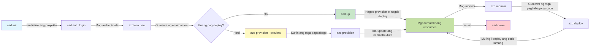

# AZD Basics - Pag-unawa sa Azure Developer CLI

# AZD Basics - Mga Pangunahing Konsepto at Pundamental

**Pag-navigate ng Kabanata:**
- **📚 Tahanan ng Kurso**: [AZD For Beginners](../../README.md)
- **📖 Kasalukuyang Kabanata**: Kabanata 1 - Pundasyon at Mabilis na Pagsisimula
- **⬅️ Nakaraan**: [Course Overview](../../README.md#-chapter-1-foundation--quick-start)
- **➡️ Susunod**: [Installation & Setup](installation.md)
- **🚀 Susunod na Kabanata**: [Chapter 2: AI-First Development](../chapter-02-ai-development/microsoft-foundry-integration.md)

## Introduksyon

Ipinapakilala ng leksyong ito ang Azure Developer CLI (azd), isang makapangyarihang tool sa command-line na nagpapabilis ng iyong paglalakbay mula sa lokal na pag-develop hanggang sa deployment sa Azure. Matututuhan mo ang mga pundamental na konsepto, mga pangunahing tampok, at maiintindihan kung paano pinapasimple ng azd ang deployment ng cloud-native na aplikasyon.

## Mga Layunin sa Pagkatuto

Sa pagtatapos ng leksyong ito, ikaw ay:
- Maiintindihan kung ano ang Azure Developer CLI at ang pangunahing layunin nito
- Matututuhan ang mga pangunahing konsepto ng mga template, kapaligiran, at mga serbisyo
- Masusuri ang mga pangunahing tampok kabilang ang template-driven development at Infrastructure as Code
- Maiintindihan ang estruktura ng proyekto at workflow ng azd
- Maging handa na i-install at i-configure ang azd para sa iyong development environment

## Mga Kinalabasan ng Pagkatuto

Pagkatapos makumpleto ang leksyong ito, magagawa mong:
- Ipaliwanag ang papel ng azd sa modernong cloud development workflows
- Tukuyin ang mga bahagi ng estruktura ng isang azd na proyekto
- Ilarawan kung paano nagtutulungan ang mga template, kapaligiran, at serbisyo
- Maiintindihan ang mga benepisyo ng Infrastructure as Code gamit ang azd
- Kilalanin ang iba't ibang azd na mga command at ang mga layunin nito

## Ano ang Azure Developer CLI (azd)?

Azure Developer CLI (azd) ay isang command-line tool na idinisenyo upang pabilisin ang iyong paglalakbay mula lokal na pag-develop hanggang sa deployment sa Azure. Pinapasimple nito ang proseso ng pagbuo, pag-deploy, at pamamahala ng cloud-native na mga aplikasyon sa Azure.

### 🎯 Bakit Gamitin ang AZD? Isang Paghahambing sa Totoong Mundo

Ihambing natin ang pag-deploy ng isang simpleng web app na may database:

#### ❌ WALA ANG AZD: Manwal na Deployment sa Azure (30+ minuto)

```bash
# Hakbang 1: Lumikha ng grupong ng mga mapagkukunan
az group create --name myapp-rg --location eastus

# Hakbang 2: Lumikha ng Plano ng App Service
az appservice plan create --name myapp-plan \
  --resource-group myapp-rg \
  --sku B1 --is-linux

# Hakbang 3: Lumikha ng aplikasyong web
az webapp create --name myapp-web-unique123 \
  --resource-group myapp-rg \
  --plan myapp-plan \
  --runtime "NODE:18-lts"

# Hakbang 4: Lumikha ng account ng Cosmos DB (10-15 minuto)
az cosmosdb create --name myapp-cosmos-unique123 \
  --resource-group myapp-rg \
  --kind MongoDB

# Hakbang 5: Lumikha ng database
az cosmosdb mongodb database create \
  --account-name myapp-cosmos-unique123 \
  --resource-group myapp-rg \
  --name tododb

# Hakbang 6: Lumikha ng koleksyon
az cosmosdb mongodb collection create \
  --account-name myapp-cosmos-unique123 \
  --resource-group myapp-rg \
  --database-name tododb \
  --name todos

# Hakbang 7: Kunin ang string ng koneksyon
CONN_STR=$(az cosmosdb keys list \
  --name myapp-cosmos-unique123 \
  --resource-group myapp-rg \
  --type connection-strings \
  --query "connectionStrings[0].connectionString" -o tsv)

# Hakbang 8: I-configure ang mga setting ng app
az webapp config appsettings set \
  --name myapp-web-unique123 \
  --resource-group myapp-rg \
  --settings MONGODB_URI="$CONN_STR"

# Hakbang 9: Paganahin ang pag-log
az webapp log config --name myapp-web-unique123 \
  --resource-group myapp-rg \
  --application-logging filesystem \
  --detailed-error-messages true

# Hakbang 10: I-set up ang Application Insights
az monitor app-insights component create \
  --app myapp-insights \
  --location eastus \
  --resource-group myapp-rg

# Hakbang 11: I-link ang App Insights sa aplikasyong web
INSTRUMENTATION_KEY=$(az monitor app-insights component show \
  --app myapp-insights \
  --resource-group myapp-rg \
  --query "instrumentationKey" -o tsv)

az webapp config appsettings set \
  --name myapp-web-unique123 \
  --resource-group myapp-rg \
  --settings APPINSIGHTS_INSTRUMENTATIONKEY="$INSTRUMENTATION_KEY"

# Hakbang 12: Buuin ang aplikasyon nang lokal
npm install
npm run build

# Hakbang 13: Lumikha ng pakete ng deployment
zip -r app.zip . -x "*.git*" "node_modules/*"

# Hakbang 14: I-deploy ang aplikasyon
az webapp deployment source config-zip \
  --resource-group myapp-rg \
  --name myapp-web-unique123 \
  --src app.zip

# Hakbang 15: Maghintay at manalangin na gumana ito 🙏
# (Walang awtomatikong pag-validate, kinakailangan ang manwal na pagsubok)
```

**Mga Suliranin:**
- ❌ 15+ na mga utos na kailangang alalahanin at isagawa ayon sa pagkakasunod
- ❌ 30-45 minuto ng manwal na gawain
- ❌ Madaling magkamali (typos, maling parameter)
- ❌ Mga connection string na nahahayag sa kasaysayan ng terminal
- ❌ Walang awtomatikong rollback kung may pumalya
- ❌ Mahirap i-replicate para sa mga miyembro ng koponan
- ❌ Iba-iba sa bawat pagkakataon (hindi reproducible)

#### ✅ GAMIT ANG AZD: Awtomatikong Deployment (5 utos, 10-15 minuto)

```bash
# Hakbang 1: I-initialize mula sa template
azd init --template todo-nodejs-mongo

# Hakbang 2: Patunayan ang pagkakakilanlan
azd auth login

# Hakbang 3: Lumikha ng kapaligiran
azd env new dev

# Hakbang 4: I-preview ang mga pagbabago (opsyonal ngunit inirerekomenda)
azd provision --preview

# Hakbang 5: I-deploy ang lahat
azd up

# ✨ Tapos na! Na-deploy, na-configure, at minomonitor ang lahat
```

**Mga Benepisyo:**
- ✅ **5 utos** kumpara sa 15+ na manwal na hakbang
- ✅ **10-15 minuto** kabuuang oras (kadalsang paghihintay sa Azure)
- ✅ **Walang error** - awtomatiko at nasubok
- ✅ **Sekreto na pinamamahalaan nang ligtas** via Key Vault
- ✅ **Awtomatikong rollback** kapag may pagkabigo
- ✅ **Ganap na reproducible** - parehong resulta sa bawat pagkakataon
- ✅ **Handa para sa koponan** - sinuman ay maaaring mag-deploy gamit ang parehong mga utos
- ✅ **Infrastructure as Code** - version controlled na mga Bicep template
- ✅ **Built-in na monitoring** - Application Insights naka-configure nang awtomatiko

### 📊 Pagbawas ng Oras at Error

| Metric | Manual Deployment | AZD Deployment | Improvement |
|:-------|:------------------|:---------------|:------------|
| **Commands** | 15+ | 5 | 67% fewer |
| **Time** | 30-45 min | 10-15 min | 60% faster |
| **Error Rate** | ~40% | <5% | 88% reduction |
| **Consistency** | Low (manual) | 100% (automated) | Perfect |
| **Team Onboarding** | 2-4 hours | 30 minutes | 75% faster |
| **Rollback Time** | 30+ min (manual) | 2 min (automated) | 93% faster |

## Mga Pangunahing Konsepto

### Mga Template
Ang mga template ay ang pundasyon ng azd. Naglalaman ang mga ito ng:
- **Kodigo ng Aplikasyon** - Ang iyong source code at mga dependency
- **Mga kahulugan ng imprastruktura** - Mga Azure resource na tinukoy sa Bicep o Terraform
- **Mga file ng konfigurasyon** - Mga setting at environment variables
- **Mga script ng deployment** - Mga awtomatikong workflow sa deployment

### Mga Kapaligiran
Ang mga kapaligiran ay kumakatawan sa iba't ibang target ng deployment:
- **Development** - Para sa pagsubok at pag-develop
- **Staging** - Kapaligiran bago ilagay sa produksyon
- **Production** - Live na produksyon na kapaligiran

Ang bawat kapaligiran ay may sarili nitong:
- Azure resource group
- Mga setting ng konfigurasyon
- Estado ng deployment

### Mga Serbisyo
Ang mga serbisyo ay mga bloke ng paggawa ng iyong aplikasyon:
- **Frontend** - Mga web application, SPA
- **Backend** - Mga API, microservices
- **Database** - Mga solusyon sa pag-iimbak ng data
- **Storage** - File at blob storage

## Mga Pangunahing Tampok

### 1. Pag-develop na Batay sa Template
```bash
# Mag-browse ng mga magagamit na template
azd template list

# Simulan gamit ang isang template
azd init --template <template-name>
```

### 2. Imprastruktura bilang Code
- **Bicep** - Domain-specific language ng Azure
- **Terraform** - Multi-cloud na tool para sa imprastruktura
- **ARM Templates** - Azure Resource Manager templates

### 3. Pinagsamang Mga Workflow
```bash
# Kumpletong workflow ng deployment
azd up            # Provision + Deploy — awtomatiko para sa unang pag-setup

# 🧪 BAGO: I-preview ang mga pagbabago sa imprastruktura bago i-deploy (LIGTAS)
azd provision --preview    # Simulahin ang deployment ng imprastruktura nang hindi gumagawa ng mga pagbabago

azd provision     # Gumawa ng mga Azure resources — kapag ina-update mo ang imprastruktura, gamitin ito
azd deploy        # I-deploy ang code ng aplikasyon o i-redeploy ang code ng aplikasyon pagkatapos ng update
azd down          # Linisin ang mga resource
```

#### 🛡️ Ligtas na Pagpaplano ng Imprastruktura gamit ang Preview
Ang command na `azd provision --preview` ay isang malaking tulong para sa ligtas na deployment:
- **Pagsusuri na dry-run** - Ipinapakita kung ano ang malilikha, mababago, o mabubura
- **Walang panganib** - Walang aktwal na pagbabago ang ginagawa sa iyong Azure environment
- **Pakikipagtulungan ng koponan** - Ibahagi ang resulta ng preview bago i-deploy
- **Pagtataya ng gastos** - Maunawaan ang gastos ng mga resource bago mag-commit

```bash
# Halimbawang daloy ng trabaho para sa preview
azd provision --preview           # Tingnan kung ano ang magbabago
# Suriin ang output, talakayin ito sa koponan
azd provision                     # Ipatupad ang mga pagbabago nang may kumpiyansa
```

### 📊 Biswal: Workflow ng Pag-develop ng AZD


**Paliwanag ng Workflow:**
1. **Init** - Magsimula gamit ang template o bagong proyekto
2. **Auth** - Mag-authenticate sa Azure
3. **Environment** - Lumikha ng nakahiwalay na deployment environment
4. **Preview** - 🆕 Palaging i-preview muna ang mga pagbabago sa imprastruktura (ligtas na gawi)
5. **Provision** - Lumikha/i-update ang mga Azure resource
6. **Deploy** - I-push ang kodigo ng iyong aplikasyon
7. **Monitor** - Obserbahan ang performance ng aplikasyon
8. **Iterate** - Gumawa ng pagbabago at i-redeploy ang kodigo
9. **Cleanup** - Alisin ang mga resource kapag tapos na

### 4. Pamamahala ng Kapaligiran
```bash
# Lumikha at pamahalaan ang mga kapaligiran
azd env new <environment-name>
azd env select <environment-name>
azd env list
```

## 📁 Estruktura ng Proyekto

Isang tipikal na estruktura ng proyektong azd:
```
my-app/
├── .azd/                    # azd configuration
│   └── config.json
├── .azure/                  # Azure deployment artifacts
├── .devcontainer/          # Development container config
├── .github/workflows/      # GitHub Actions
├── .vscode/               # VS Code settings
├── infra/                 # Infrastructure code
│   ├── main.bicep        # Main infrastructure template
│   ├── main.parameters.json
│   └── modules/          # Reusable modules
├── src/                  # Application source code
│   ├── api/             # Backend services
│   └── web/             # Frontend application
├── azure.yaml           # azd project configuration
└── README.md
```

## 🔧 Mga File ng Konfigurasyon

### azure.yaml
Ang pangunahing file ng konfigurasyon ng proyekto:
```yaml
name: my-awesome-app
metadata:
  template: my-template@1.0.0

services:
  web:
    project: ./src/web
    language: js
    host: appservice
  api:
    project: ./src/api
    language: js
    host: appservice

hooks:
  preprovision:
    shell: pwsh
    run: echo "Preparing to provision..."
```

### .azure/config.json
Konfigurasyon na tiyak sa kapaligiran:
```json
{
  "version": 1,
  "defaultEnvironment": "dev",
  "environments": {
    "dev": {
      "subscriptionId": "your-subscription-id",
      "location": "eastus"
    }
  }
}
```

## 🎪 Karaniwang Mga Workflow na may Praktikal na Mga Ehersisyo

> **💡 Tip sa Pagkatuto:** Sundin ang mga ehersisyong ito ayon sa pagkakasunud-sunod para unti-unting buuin ang iyong mga kasanayan sa AZD.

### 🎯 Ehersisyo 1: I-initialize ang Iyong Unang Proyekto

**Layunin:** Lumikha ng isang AZD na proyekto at suriin ang estruktura nito

**Mga Hakbang:**
```bash
# Gumamit ng napatunayan na template
azd init --template todo-nodejs-mongo

# Galugarin ang mga nabuo na file
ls -la  # Tingnan ang lahat ng file kabilang ang mga nakatagong file

# Pangunahing mga file na nilikha:
# - azure.yaml (pangunahing konfigurasyon)
# - infra/ (kodigo ng imprastruktura)
# - src/ (kodigo ng aplikasyon)
```

**✅ Tagumpay:** Mayroon kang azure.yaml, infra/, at src/ na mga direktoryo

---

### 🎯 Ehersisyo 2: Mag-deploy sa Azure

**Layunin:** Kumpletuhin ang end-to-end na deployment

**Mga Hakbang:**
```bash
# 1. Patunayan ang pagkakakilanlan
az login && azd auth login

# 2. Lumikha ng kapaligiran
azd env new dev
azd env set AZURE_LOCATION eastus

# 3. I-preview ang mga pagbabago (INIREREKOMENDA)
azd provision --preview

# 4. I-deploy ang lahat
azd up

# 5. Tiyakin ang pag-deploy
azd show    # Tingnan ang URL ng iyong app
```

**Tinatayang Oras:** 10-15 minuto  
**✅ Tagumpay:** Bubukas ang URL ng aplikasyon sa browser

---

### 🎯 Ehersisyo 3: Maramihang Kapaligiran

**Layunin:** Mag-deploy sa dev at staging

**Mga Hakbang:**
```bash
# May dev na, gumawa ng staging
azd env new staging
azd env set AZURE_LOCATION westus2
azd up

# Lumipat sa pagitan nila
azd env list
azd env select dev
```

**✅ Tagumpay:** Dalawang hiwalay na resource groups sa Azure Portal

---

### 🛡️ Malinis na Simula: `azd down --force --purge`

Kapag kailangan mong ganap na mag-reset:

```bash
azd down --force --purge
```

**Ano ang ginagawa nito:**
- `--force`: Walang prompt para sa kumpirmasyon
- `--purge`: Binubura ang lahat ng lokal na estado at Azure resources

**Gamitin kapag:**
- Nabigo ang deployment sa kalagitnaan
- Nagpapalitan ng mga proyekto
- Kailangan ng bagong simula

---

## 🎪 Orihinal na Sanggunian ng Workflow

### Pagsisimula ng Bagong Proyekto
```bash
# Paraan 1: Gumamit ng umiiral na template
azd init --template todo-nodejs-mongo

# Paraan 2: Magsimula mula sa simula
azd init

# Paraan 3: Gumamit ng kasalukuyang direktoryo
azd init .
```

### Siklo ng Pag-develop
```bash
# Ihanda ang kapaligiran para sa pag-develop
azd auth login
azd env new dev
azd env select dev

# I-deploy ang lahat
azd up

# Gumawa ng mga pagbabago at muling i-deploy
azd deploy

# Linisin kapag tapos na
azd down --force --purge # Ang utos sa Azure Developer CLI ay isang **hard reset** para sa iyong kapaligiran—lalo na kapaki-pakinabang kapag nag-troubleshoot ka ng mga nabigong deployment, naglilinis ng mga naiwan na resources, o naghahanda para sa isang bagong pag-deploy.
```

## Pag-unawa sa `azd down --force --purge`
Ang command na `azd down --force --purge` ay isang makapangyarihang paraan upang ganap na i-tear down ang iyong azd environment at lahat ng kaugnay na mga resource. Narito ang paghahati-hati ng kung ano ang ginagawa ng bawat flag:
```
--force
```
- Nag-iwas sa mga prompt ng kumpirmasyon.
- Kapaki-pakinabang para sa automation o scripting kung saan hindi posible ang manual na input.
- Tinitiyak na magpapatuloy ang teardown nang walang pagkaantala, kahit na may makita ang CLI na mga inconsistencies.

```
--purge
```
Nagbubura ng **lahat ng kaugnay na metadata**, kabilang ang:
Estado ng kapaligiran
Local `.azure` folder
Cached deployment info
Pinipigilan ang azd mula sa "pag-alala" ng mga nakaraang deployment, na maaaring magdulot ng mga isyu tulad ng hindi nagtutugmang resource groups o lumang mga registry references.


### Bakit gamitin ang parehong?
Kapag naipit ka sa `azd up` dahil sa nananatiling estado o partial na deployment, tinitiyak ng kombinasyong ito ang isang **malinis na simula**.

Napakalinang ito lalo na pagkatapos ng manu-manong pagbura ng mga resource sa Azure portal o kapag nagpapalit ng mga template, kapaligiran, o mga konbensiyon sa pag-ngalan ng resource group.


### Pamamahala ng Maramihang Kapaligiran
```bash
# Lumikha ng staging na kapaligiran
azd env new staging
azd env select staging
azd up

# Lumipat pabalik sa dev
azd env select dev

# Ihambing ang mga kapaligiran
azd env list
```

## 🔐 Autentikasyon at Mga Kredensyal

Mahalaga ang pag-unawa sa autentikasyon para sa matagumpay na mga deployment ng azd. Gumagamit ang Azure ng maraming paraan ng autentikasyon, at ginagamit ng azd ang parehong credential chain na ginagamit ng iba pang mga Azure tool.

### Azure CLI Authentication (`az login`)

Bago gamitin ang azd, kailangan mong mag-authenticate sa Azure. Ang pinaka-karaniwang paraan ay gamit ang Azure CLI:

```bash
# Interaktibong pag-login (nagbubukas ng browser)
az login

# Mag-login sa partikular na tenant
az login --tenant <tenant-id>

# Mag-login gamit ang service principal
az login --service-principal -u <app-id> -p <password> --tenant <tenant-id>

# Suriin ang kasalukuyang status ng pag-login
az account show

# Ilista ang mga magagamit na subscription
az account list --output table

# Itakda ang default na subscription
az account set --subscription <subscription-id>
```

### Daloy ng Autentikasyon
1. **Interactive Login**: Binubuksan ang iyong default browser para sa autentikasyon
2. **Device Code Flow**: Para sa mga environment na walang access sa browser
3. **Service Principal**: Para sa automation at mga senaryo ng CI/CD
4. **Managed Identity**: Para sa mga aplikasyon na naka-host sa Azure

### DefaultAzureCredential Chain

`DefaultAzureCredential` ay isang credential type na nagbibigay ng pinasimpleng karanasan sa autentikasyon sa pamamagitan ng awtomatikong pagsubok sa maraming pinagmumulan ng kredensyal sa isang partikular na pagkakasunod-sunod:

#### Credential Chain Order

#### 1. Environment Variables
```bash
# Itakda ang mga environment variable para sa service principal
export AZURE_CLIENT_ID="<app-id>"
export AZURE_CLIENT_SECRET="<password>"
export AZURE_TENANT_ID="<tenant-id>"
```

#### 2. Workload Identity (Kubernetes/GitHub Actions)
Ginagamit nang awtomatiko sa:
- Azure Kubernetes Service (AKS) na may Workload Identity
- GitHub Actions na may OIDC federation
- Iba pang mga scenario na may federated identity

#### 3. Managed Identity
Para sa mga Azure resource tulad ng:
- Virtual Machines
- App Service
- Azure Functions
- Container Instances

```bash
# Suriin kung tumatakbo sa Azure resource na may pinamamahalaang identity
az account show --query "user.type" --output tsv
# Ibabalik: "servicePrincipal" kung gumagamit ng pinamamahalaang identity
```

#### 4. Developer Tools Integration
- **Visual Studio**: Awtomatikong gumagamit ng naka-sign in na account
- **VS Code**: Gumagamit ng credentials mula sa Azure Account extension
- **Azure CLI**: Gumagamit ng `az login` credentials (pinaka-karaniwan para sa lokal na pag-develop)

### AZD Authentication Setup

```bash
# Paraan 1: Gumamit ng Azure CLI (Inirerekomenda para sa pag-unlad)
az login
azd auth login  # Gumagamit ng umiiral na kredensyal ng Azure CLI

# Paraan 2: Direktang pag-autentikasyon gamit ang azd
azd auth login --use-device-code  # Para sa mga kapaligirang walang GUI

# Paraan 3: Suriin ang katayuan ng pag-autentikasyon
azd auth login --check-status

# Paraan 4: Mag-logout at muling mag-login
azd auth logout
azd auth login
```

### Mga Pinakamahusay na Gawi sa Autentikasyon

#### Para sa Lokal na Pag-develop
```bash
# 1. Mag-login gamit ang Azure CLI
az login

# 2. Siguraduhin ang tamang subscription
az account show
az account set --subscription "Your Subscription Name"

# 3. Gamitin ang azd gamit ang umiiral na kredensyal
azd auth login
```

#### Para sa CI/CD Pipelines
```yaml
# GitHub Actions example
- name: Azure Login
  uses: azure/login@v1
  with:
    creds: ${{ secrets.AZURE_CREDENTIALS }}

- name: Deploy with azd
  run: |
    azd auth login --client-id ${{ secrets.AZURE_CLIENT_ID }} \
                    --client-secret ${{ secrets.AZURE_CLIENT_SECRET }} \
                    --tenant-id ${{ secrets.AZURE_TENANT_ID }}
    azd up --no-prompt
```

#### Para sa Mga Production Environment
- Gumamit ng **Managed Identity** kapag tumatakbo sa mga Azure resource
- Gumamit ng **Service Principal** para sa mga automation na senaryo
- Iwasang itago ang mga kredensyal sa code o mga file ng konfigurasyon
- Gumamit ng **Azure Key Vault** para sa sensitibong konfigurasyon

### Mga Karaniwang Isyu sa Autentikasyon at mga Solusyon

#### Isyu: "No subscription found"
```bash
# Solusyon: Itakda ang default na subscription
az account list --output table
az account set --subscription "<subscription-id>"
azd env set AZURE_SUBSCRIPTION_ID "<subscription-id>"
```

#### Isyu: "Insufficient permissions"
```bash
# Solusyon: Suriin at italaga ang mga kinakailangang tungkulin
az role assignment list --assignee $(az account show --query user.name --output tsv)

# Karaniwang kinakailangang mga tungkulin:
# - Contributor (para sa pamamahala ng mga resource)
# - User Access Administrator (para sa pagtatalaga ng mga tungkulin)
```

#### Isyu: "Token expired"
```bash
# Solusyon: Muling mag-login
az logout
az login
azd auth logout
azd auth login
```

### Autentikasyon sa Iba't Ibang Senaryo

#### Lokal na Pag-develop
```bash
# Account para sa personal na pag-unlad
az login
azd auth login
```

#### Pag-develop ng Koponan
```bash
# Gumamit ng partikular na tenant para sa organisasyon
az login --tenant contoso.onmicrosoft.com
azd auth login
```

#### Multi-tenant na mga Senaryo
```bash
# Lumipat sa pagitan ng mga tenant
az login --tenant tenant1.onmicrosoft.com
# I-deploy sa tenant 1
azd up

az login --tenant tenant2.onmicrosoft.com  
# I-deploy sa tenant 2
azd up
```

### Mga Pagsasaalang-alang sa Seguridad

1. **Pag-iimbak ng Kredensyal**: Huwag kailanman mag-imbak ng kredensyal sa source code
2. **Limitasyon ng Saklaw**: Gamitin ang prinsipyo ng least-privilege para sa service principals
3. **Pag-ikot ng Token**: Regular na i-rotate ang mga secret ng service principal
4. **Audit Trail**: I-monitor ang mga aktibidad ng autentikasyon at deployment
5. **Seguridad sa Network**: Gumamit ng private endpoints kapag posible

### Pag-troubleshoot ng Autentikasyon

```bash
# I-debug ang mga problema sa awtentikasyon
azd auth login --check-status
az account show
az account get-access-token

# Karaniwang mga diagnostic na utos
whoami                          # Kasalukuyang konteksto ng gumagamit
az ad signed-in-user show      # Mga detalye ng gumagamit ng Azure AD
az group list                  # Subukan ang pag-access sa resource
```

## Pag-unawa sa `azd down --force --purge`

### Discovery
```bash
azd template list              # Mag-browse ng mga template
azd template show <template>   # Mga detalye ng template
azd init --help               # Mga opsyon sa inisyalisasyon
```

### Pamamahala ng Proyekto
```bash
azd show                     # Pangkalahatang-ideya ng proyekto
azd env show                 # Kasalukuyang kapaligiran
azd config list             # Mga pagsasaayos ng konfigurasyon
```

### Pagmomonitor
```bash
azd monitor                  # Buksan ang monitoring sa Azure portal
azd monitor --logs           # Tingnan ang mga log ng aplikasyon
azd monitor --live           # Tingnan ang mga real-time na metric
azd pipeline config          # I-set up ang CI/CD
```

## Mga Pinakamahusay na Gawi

### 1. Gumamit ng Makabuluhang Mga Pangalan
```bash
# Mabuti
azd env new production-east
azd init --template web-app-secure

# Iwasan
azd env new env1
azd init --template template1
```

### 2. Samantalahin ang Mga Template
- Magsimula sa umiiral na mga template
- I-customize ayon sa iyong pangangailangan
- Gumawa ng mga reusable na template para sa iyong organisasyon

### 3. Pag-isolate ng Kapaligiran
- Gumamit ng hiwalay na mga kapaligiran para sa dev/staging/prod
- Huwag mag-deploy nang direkta sa produksyon mula sa lokal na makina
- Gumamit ng CI/CD pipelines para sa mga deployment sa produksyon

### 4. Pamamahala ng Konfigurasyon
- Gumamit ng environment variables para sa sensitibong data
- Panatilihin ang konfigurasyon sa version control
- Idokumento ang mga setting na tiyak sa kapaligiran

## Pag-usbong sa Pagkatuto

### Baguhan (Linggo 1-2)
1. I-install ang azd at mag-authenticate
2. Mag-deploy ng isang simpleng template
3. Unawain ang estruktura ng proyekto
4. Matutunan ang mga pangunahing utos (up, down, deploy)

### Intermediate (Linggo 3-4)
1. I-customize ang mga template
2. Pamahalaan ang maramihang kapaligiran
3. Unawain ang infrastructure code
4. Mag-set up ng CI/CD pipelines

### Advanced (Linggo 5+)
1. Lumikha ng custom na mga template
2. Mga advanced na pattern sa imprastruktura
3. Multi-region na deployment
4. Enterprise-grade na mga konfigurasyon

## Mga Susunod na Hakbang

**📖 Magpatuloy sa Pag-aaral ng Kabanata 1:**
- [Pag-install at Pagsasaayos](installation.md) - I-install at i-configure ang azd
- [Ang Iyong Unang Proyekto](first-project.md) - Kompletong praktikal na tutorial
- [Gabay sa Konfigurasyon](configuration.md) - Mga advanced na pagpipilian sa konfigurasyon

**🎯 Handa na para sa Susunod na Kabanata?**
- [Kabanata 2: Pag-unlad na Nakatuon sa AI](../chapter-02-ai-development/microsoft-foundry-integration.md) - Simulan ang pagbuo ng mga AI na aplikasyon

## Karagdagang Mga Mapagkukunan

- [Pangkalahatang-ideya ng Azure Developer CLI](https://learn.microsoft.com/en-us/azure/developer/azure-developer-cli/)
- [Galerya ng Mga Template](https://azure.github.io/awesome-azd/)
- [Mga Halimbawa ng Komunidad](https://github.com/Azure-Samples)

---

## 🙋 Madalas na Itinanong

### Pangkalahatang Mga Tanong

**Q: Ano ang pagkakaiba ng AZD at Azure CLI?**

A: Ang Azure CLI (`az`) ay para sa pamamahala ng indibidwal na mga resource ng Azure. Ang AZD (`azd`) ay para sa pamamahala ng buong mga aplikasyon:

```bash
# Azure CLI - Pamamahala ng mga resource sa mababang antas
az webapp create --name myapp --resource-group rg
az sql server create --name myserver --resource-group rg
# ...marami pang mga utos ang kailangan

# AZD - Pamamahala sa antas ng aplikasyon
azd up  # Nagde-deploy ng buong app kasama ang lahat ng mga resource
```

**Isipin ito ng ganito:**
- `az` = Gumagana sa mga indibidwal na bloke ng Lego
- `azd` = Nagtatrabaho sa kumpletong set ng Lego

---

**Q: Kailangan ko bang malaman ang Bicep o Terraform para gamitin ang AZD?**

A: Hindi! Magsimula sa mga template:
```bash
# Gamitin ang umiiral na template - hindi kailangan ng kaalaman sa IaC
azd init --template todo-nodejs-mongo
azd up
```

Maaari mong pag-aralan ang Bicep mamaya upang i-customize ang imprastruktura. Nagbibigay ang mga template ng mga gumaganang halimbawa na mapag-aaralan.

---

**Q: Magkano ang gastos sa pagpapatakbo ng mga AZD template?**

A: Nag-iiba ang mga gastos depende sa template. Karamihan sa mga development template ay nagkakahalaga ng $50–150/buwan:

```bash
# Suriin ang mga gastos bago mag-deploy
azd provision --preview

# Laging linisin kapag hindi ginagamit
azd down --force --purge  # Inaalis ang lahat ng resources
```

**Pro tip:** Gamitin ang mga libreng tier kung mayroon:
- App Service: F1 (Libre) tier
- Azure OpenAI: 50,000 tokens/buwan libre
- Cosmos DB: 1000 RU/s libreng tier

---

**Q: Maaari ko bang gamitin ang AZD sa umiiral na mga resource ng Azure?**

A: Oo, ngunit mas madali magsimula mula sa simula. Mas mahusay ang AZD kapag pinamamahalaan nito ang buong lifecycle. Para sa umiiral na mga resource:

```bash
# Opsyon 1: I-import ang umiiral na mga resource (advanced)
azd init
# Pagkatapos, baguhin ang infra/ upang tumukoy sa umiiral na mga resource

# Opsyon 2: Magsimula mula sa simula (inirerekomenda)
azd init --template matching-your-stack
azd up  # Lumilikha ng bagong kapaligiran
```

---

**Q: Paano ko ibabahagi ang aking proyekto sa mga kasamahan?**

A: I-commit ang AZD na proyekto sa Git (ngunit HUWAG ang .azure na folder):

```bash
# Nasa .gitignore na bilang default
.azure/        # Naglalaman ng mga lihim at datos ng kapaligiran
*.env          # Mga variable ng kapaligiran

# Mga miyembro ng koponan noon:
git clone <your-repo>
azd auth login
azd env new <their-name>-dev
azd up
```

Makakakuha ang lahat ng magkaparehong imprastruktura mula sa parehong mga template.

---

### Mga Tanong sa Pag-troubleshoot

**Q: Nabigo ang "azd up" sa kalagitnaan. Ano ang gagawin ko?**

A: Tingnan ang error, ayusin ito, pagkatapos ay subukang muli:

```bash
# Tingnan ang detalyadong log
azd show

# Karaniwang pag-aayos:

# 1. Kung lumampas sa quota:
azd env set AZURE_LOCATION "westus2"  # Subukan ang ibang rehiyon

# 2. Kung may salungatan sa pangalan ng resource:
azd down --force --purge  # Magsimulang muli
azd up  # Subukan muli

# 3. Kung nag-expire ang awtentikasyon:
az login
azd auth login
azd up
```

**Pinakakaraniwang isyu:** Mali ang napiling Azure subscription
```bash
az account list --output table
az account set --subscription "<correct-subscription>"
```

---

**Q: Paano ko ide-deploy ang mga pagbabago sa code nang hindi nire-reprovision?**

A: Gamitin ang `azd deploy` sa halip na `azd up`:

```bash
azd up          # Unang beses: paglalaan + pag-deploy (mabagal)

# Gumawa ng mga pagbabago sa code...

azd deploy      # Sa mga sumunod na beses: mag-deploy lamang (mabilis)
```

Paghahambing ng bilis:
- `azd up`: 10–15 minuto (nagpo-provision ng imprastruktura)
- `azd deploy`: 2–5 minuto (code lamang)

---

**Q: Maaari ko bang i-customize ang mga template ng imprastruktura?**

A: Oo! I-edit ang mga Bicep file sa `infra/`:

```bash
# Pagkatapos ng azd init
cd infra/
code main.bicep  # I-edit sa VS Code

# I-preview ang mga pagbabago
azd provision --preview

# I-apply ang mga pagbabago
azd provision
```

**Tip:** Magsimula sa maliit - palitan muna ang mga SKU:
```bicep
// infra/main.bicep
sku: {
  name: 'B1'  // Change to 'P1V2' for production
}
```

---

**Q: Paano ko buburahin ang lahat ng nilikha ng AZD?**

A: Isang command ang nag-aalis ng lahat ng resource:

```bash
azd down --force --purge

# Binubura nito:
# - Lahat ng mga resource ng Azure
# - Grupo ng resource
# - Lokal na estado ng kapaligiran
# - Naka-cache na datos ng deployment
```

**Laging patakbuhin ito kapag:**
- Natapos ang pagsubok sa isang template
- Lumilipat sa ibang proyekto
- Nais magsimula muli

**Tipid sa gastos:** Ang pagbura ng mga hindi nagamit na resource = $0 na singil

---

**Q: Ano kung aksidenteng binura ko ang mga resource sa Azure Portal?**

A: Maaaring hindi mag-sync ang estado ng AZD. Para sa malinis na simula:

```bash
# 1. Tanggalin ang lokal na estado
azd down --force --purge

# 2. Magsimula muli
azd up

# Alternatibo: Hayaan ang AZD na matukoy at ayusin
azd provision  # Lilikha ng mga nawawalang resources
```

---

### Mga Advanced na Tanong

**Q: Maaari ko bang gamitin ang AZD sa mga CI/CD pipeline?**

A: Oo! Halimbawa gamit ang GitHub Actions:

```yaml
# .github/workflows/deploy.yml
name: Deploy with AZD

on:
  push:
    branches: [main]

jobs:
  deploy:
    runs-on: ubuntu-latest
    steps:
      - uses: actions/checkout@v2
      
      - name: Install azd
        run: curl -fsSL https://aka.ms/install-azd.sh | bash
      
      - name: Azure Login
        run: |
          azd auth login \
            --client-id ${{ secrets.AZURE_CLIENT_ID }} \
            --client-secret ${{ secrets.AZURE_CLIENT_SECRET }} \
            --tenant-id ${{ secrets.AZURE_TENANT_ID }}
      
      - name: Deploy
        run: azd up --no-prompt
```

---

**Q: Paano ko haharapin ang mga lihim at sensitibong data?**

A: Ang AZD ay awtomatikong nag-iintegrate sa Azure Key Vault:

```bash
# Ang mga lihim ay naka-imbak sa Key Vault, hindi sa code
azd env set DATABASE_PASSWORD "$(openssl rand -base64 32)"

# Awtomatikong ginagawa ng AZD:
# 1. Lumilikha ng Key Vault
# 2. Nag-iimbak ng lihim
# 3. Nagbibigay ng access sa app sa pamamagitan ng Managed Identity
# 4. Ini-inject sa runtime
```

**Huwag kailanman i-commit:**
- `.azure/` folder (naglalaman ng environment data)
- mga `.env` file (lokal na mga lihim)
- mga string ng koneksyon

---

**Q: Maaari ba akong mag-deploy sa maraming rehiyon?**

A: Oo, lumikha ng environment para sa bawat rehiyon:

```bash
# Kapaligiran ng Silangang Estados Unidos
azd env new prod-eastus
azd env set AZURE_LOCATION eastus
azd up

# Kapaligiran ng Kanlurang Europa
azd env new prod-westeurope
azd env set AZURE_LOCATION westeurope
azd up

# Ang bawat kapaligiran ay magkakahiwalay
azd env list
```

Para sa totoong multi-region na apps, i-customize ang mga Bicep template upang mag-deploy sa maraming rehiyon nang sabay-sabay.

---

**Q: Saan ako makakakuha ng tulong kung ako'y natigil?**

1. **Dokumentasyon ng AZD:** https://learn.microsoft.com/azure/developer/azure-developer-cli/
2. **Mga Isyu sa GitHub:** https://github.com/Azure/azure-dev/issues
3. **Discord:** [Discord ng Azure](https://discord.gg/microsoft-azure) - sa channel na #azure-developer-cli
4. **Stack Overflow:** Gamitin ang tag `azure-developer-cli`
5. **Kursong Ito:** [Gabay sa Pag-troubleshoot](../chapter-07-troubleshooting/common-issues.md)

**Pro tip:** Bago magtanong, patakbuhin:
```bash
azd show       # Ipinapakita ang kasalukuyang estado
azd version    # Ipinapakita ang iyong bersyon
```
Isama ang impormasyong ito sa iyong tanong para sa mas mabilis na tulong.

---

## 🎓 Ano ang Susunod?

Nauunawaan mo na ang mga batayan ng AZD. Piliin ang iyong landas:

### 🎯 Para sa mga Nagsisimula:
1. **Susunod:** [Pag-install at Pagsasaayos](installation.md) - I-install ang AZD sa iyong makina
2. **Sunod:** [Ang Iyong Unang Proyekto](first-project.md) - I-deploy ang iyong unang aplikasyon
3. **Magsanay:** Kumpletuhin ang lahat ng 3 na ehersisyo sa araling ito

### 🚀 Para sa mga AI Developer:
1. **Tumalon sa:** [Kabanata 2: Pag-unlad na Nakatuon sa AI](../chapter-02-ai-development/microsoft-foundry-integration.md)
2. **I-deploy:** Magsimula sa `azd init --template get-started-with-ai-chat`
3. **Matuto:** Bumuo habang nagde-deploy

### 🏗️ Para sa mga May Karanasang Developer:
1. **Suriin:** [Gabay sa Konfigurasyon](configuration.md) - Mga advanced na setting
2. **Tuklasin:** [Infrastructure as Code](../chapter-04-infrastructure/provisioning.md) - Malalim na pagtalakay sa Bicep
3. **Bumuo:** Gumawa ng custom na mga template para sa iyong stack

---

**Pag-navigate sa Kabanata:**
- **📚 Tahanan ng Kurso**: [AZD For Beginners](../../README.md)
- **📖 Kabanatang Kasalukuyan**: Kabanata 1 - Pundasyon at Mabilis na Pagsisimula  
- **⬅️ Nakaraan**: [Pangkalahatang-ideya ng Kurso](../../README.md#-chapter-1-foundation--quick-start)
- **➡️ Susunod**: [Pag-install at Pagsasaayos](installation.md)
- **🚀 Susunod na Kabanata**: [Kabanata 2: Pag-unlad na Nakatuon sa AI](../chapter-02-ai-development/microsoft-foundry-integration.md)

---

<!-- CO-OP TRANSLATOR DISCLAIMER START -->
Paunawa:
Isinalin ang dokumentong ito gamit ang AI translation service na [Co-op Translator](https://github.com/Azure/co-op-translator). Bagaman nagsusumikap kami para sa katumpakan, pakitandaan na ang mga awtomatikong pagsasalin ay maaaring maglaman ng mga pagkakamali o hindi tumpak na bahagi. Ang orihinal na dokumento sa orihinal nitong wika ang dapat ituring na opisyal na pinagmulan. Para sa mga kritikal na impormasyon, inirerekomenda ang propesyonal na pagsasalin ng tao. Hindi kami mananagot sa anumang hindi pagkakaunawaan o maling interpretasyon na maaaring magmula sa paggamit ng pagsasaling ito.
<!-- CO-OP TRANSLATOR DISCLAIMER END -->