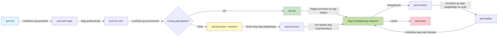
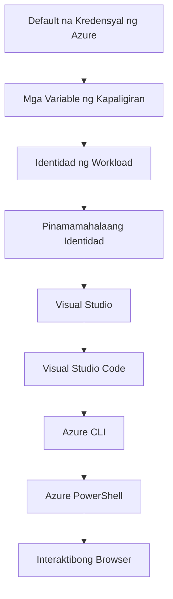

# AZD Basics - Pag-unawa sa Azure Developer CLI

# AZD Basics - Mga Pangunahing Konsepto at Pundasyon

**Pag-navigate ng Kabanata:**
- **📚 Tahanan ng Kurso**: [AZD Para sa mga Nagsisimula](../../README.md)
- **📖 Kasalukuyang Kabanata**: Kabanata 1 - Pundasyon at Mabilisang Pagsisimula
- **⬅️ Nakaraan**: [Paunang-ideya ng Kurso](../../README.md#-chapter-1-foundation--quick-start)
- **➡️ Susunod**: [Pag-install at Setup](installation.md)
- **🚀 Susunod na Kabanata**: [Kabanata 2: Pag-unlad na Nakatuon sa AI](../chapter-02-ai-development/microsoft-foundry-integration.md)

## Panimula

Itong leksyon ay ipinapakilala sa iyo ang Azure Developer CLI (azd), isang makapangyarihang command-line tool na nagpapabilis ng iyong paglalakbay mula sa lokal na pag-develop hanggang sa pag-deploy sa Azure. Malalaman mo ang mga pangunahing konsepto, mga pangunahing tampok, at mauunawaan kung paano pinapasimple ng azd ang pag-deploy ng cloud-native na aplikasyon.

## Mga Layunin sa Pagkatuto

Sa pagtatapos ng leksyong ito, ikaw ay:
- Mauunawaan kung ano ang Azure Developer CLI at ang pangunahing layunin nito
- Matutunan ang mga pangunahing konsepto ng mga template, kapaligiran, at serbisyo
- Siyasatin ang mga pangunahing tampok kabilang ang template-driven development at Infrastructure as Code
- Mauunawaan ang estruktura ng proyekto ng azd at workflow
- Maging handa mag-install at mag-configure ng azd para sa iyong development environment

## Mga Kinalabasan ng Pagkatuto

Matapos makumpleto ang leksyong ito, magagawa mong:
- Ipaliwanag ang papel ng azd sa modernong cloud development workflows
- Tukuyin ang mga bahagi ng estruktura ng isang azd project
- Ilarawan kung paano nagtutulungan ang mga template, kapaligiran, at serbisyo
- Mauunawaan ang mga benepisyo ng Infrastructure as Code gamit ang azd
- Kilalanin ang iba't ibang azd commands at ang mga layunin nito

## Ano ang Azure Developer CLI (azd)?

Azure Developer CLI (azd) ay isang command-line tool na dinisenyo upang pabilisin ang iyong paglalakbay mula sa lokal na pag-develop hanggang sa pag-deploy sa Azure. Pinapasimple nito ang proseso ng pagbuo, pag-deploy, at pamamahala ng cloud-native na mga aplikasyon sa Azure.

### Ano ang Maaari Mong I-deploy gamit ang azd?

azd ay sumusuporta sa malawak na hanay ng mga workload—at patuloy itong lumalawak. Sa ngayon, maaari mong gamitin ang azd upang i-deploy ang:

| Uri ng Workload | Mga Halimbawa | Parehong Workflow? |
|---------------|----------|----------------|
| **Tradisyunal na mga aplikasyon** | Mga web app, REST API, mga static site | ✅ `azd up` |
| **Mga serbisyo at microservices** | Container Apps, Function Apps, multi-service backends | ✅ `azd up` |
| **Mga aplikasyon na pinapagana ng AI** | Mga chat app na may Microsoft Foundry Models, RAG solutions na may AI Search | ✅ `azd up` |
| **Matalinong ahente** | Mga agent na hinahost ng Foundry, multi-agent orchestrations | ✅ `azd up` |

Ang mahalagang pananaw ay na **ang lifecycle ng azd ay nananatiling pareho anuman ang iyong ide-deploy**. Ini-initialize mo ang isang proyekto, nagpo-provision ng imprastruktura, ine-deploy ang iyong code, mino-monitor ang iyong app, at nililinis—mapa-simpleng website man o sopistikadong AI agent.

Ang pagkakapareho na ito ay idinisenyo. Tinatrato ng azd ang mga kakayahan ng AI bilang isa pang uri ng serbisyo na maaaring gamitin ng iyong aplikasyon, hindi bilang isang bagay na lubhang naiiba. Ang isang chat endpoint na pinapagana ng Microsoft Foundry Models ay, mula sa perspektiba ng azd, isa lamang pang serbisyong ikokonekta at ide-deploy.

### 🎯 Bakit Gumamit ng AZD? Isang Paghahambing sa Tunay na Mundo

Ihambing natin ang pag-deploy ng isang simpleng web app na may database:

#### ❌ WALANG AZD: Manu-manong Pag-deploy sa Azure (30+ minuto)

```bash
# Hakbang 1: Lumikha ng resource group
az group create --name myapp-rg --location eastus

# Hakbang 2: Lumikha ng App Service Plan
az appservice plan create --name myapp-plan \
  --resource-group myapp-rg \
  --sku B1 --is-linux

# Hakbang 3: Lumikha ng Web App
az webapp create --name myapp-web-unique123 \
  --resource-group myapp-rg \
  --plan myapp-plan \
  --runtime "NODE:18-lts"

# Hakbang 4: Lumikha ng Cosmos DB account (10-15 minuto)
az cosmosdb create --name myapp-cosmos-unique123 \
  --resource-group myapp-rg \
  --kind MongoDB

# Hakbang 5: Lumikha ng database
az cosmosdb mongodb database create \
  --account-name myapp-cosmos-unique123 \
  --resource-group myapp-rg \
  --name tododb

# Hakbang 6: Lumikha ng koleksyon
az cosmosdb mongodb collection create \
  --account-name myapp-cosmos-unique123 \
  --resource-group myapp-rg \
  --database-name tododb \
  --name todos

# Hakbang 7: Kunin ang string ng koneksyon
CONN_STR=$(az cosmosdb keys list \
  --name myapp-cosmos-unique123 \
  --resource-group myapp-rg \
  --type connection-strings \
  --query "connectionStrings[0].connectionString" -o tsv)

# Hakbang 8: I-configure ang mga setting ng app
az webapp config appsettings set \
  --name myapp-web-unique123 \
  --resource-group myapp-rg \
  --settings MONGODB_URI="$CONN_STR"

# Hakbang 9: Paganahin ang logging
az webapp log config --name myapp-web-unique123 \
  --resource-group myapp-rg \
  --application-logging filesystem \
  --detailed-error-messages true

# Hakbang 10: I-set up ang Application Insights
az monitor app-insights component create \
  --app myapp-insights \
  --location eastus \
  --resource-group myapp-rg

# Hakbang 11: I-link ang App Insights sa Web App
INSTRUMENTATION_KEY=$(az monitor app-insights component show \
  --app myapp-insights \
  --resource-group myapp-rg \
  --query "instrumentationKey" -o tsv)

az webapp config appsettings set \
  --name myapp-web-unique123 \
  --resource-group myapp-rg \
  --settings APPINSIGHTS_INSTRUMENTATIONKEY="$INSTRUMENTATION_KEY"

# Hakbang 12: Buuin ang aplikasyon nang lokal
npm install
npm run build

# Hakbang 13: Lumikha ng pakete ng deployment
zip -r app.zip . -x "*.git*" "node_modules/*"

# Hakbang 14: I-deploy ang aplikasyon
az webapp deployment source config-zip \
  --resource-group myapp-rg \
  --name myapp-web-unique123 \
  --src app.zip

# Hakbang 15: Maghintay at manalangin na gumana ito 🙏
# (Walang awtomatikong pagpapatunay, kinakailangan ang manu-manong pagsubok)
```

**Mga Problema:**
- ❌ 15+ na utos na kailangang tandaan at patakbuhin ayon sa pagkakasunod
- ❌ 30-45 minuto ng manu-manong trabaho
- ❌ Madaling magkamali (mga typographical error, maling mga parametro)
- ❌ Mga connection string na nakalantad sa kasaysayan ng terminal
- ❌ Walang awtomatikong rollback kung may mabigo
- ❌ Mahirap i-replicate para sa mga miyembro ng koponan
- ❌ Iba-iba tuwing isinasagawa (hindi reproducible)

#### ✅ GAMIT ANG AZD: Awtomatikong Pag-deploy (5 utos, 10-15 minuto)

```bash
# Hakbang 1: I-initialize mula sa template
azd init --template todo-nodejs-mongo

# Hakbang 2: Patunayan ang pagkakakilanlan
azd auth login

# Hakbang 3: Lumikha ng kapaligiran
azd env new dev

# Hakbang 4: Tingnan muna ang mga pagbabago (opsyonal ngunit inirerekomenda)
azd provision --preview

# Hakbang 5: I-deploy ang lahat
azd up

# ✨ Tapos na! Na-deploy, naka-configure, at minomonitor na ang lahat
```

**Mga Benepisyo:**
- ✅ **5 utos** kumpara sa 15+ na manu-manong hakbang
- ✅ **10-15 minuto** kabuuang oras (karaniwang naghihintay para sa Azure)
- ✅ **Walang error** - awtomatiko at nasubukan
- ✅ **Lihim na pinamamahalaan nang ligtas** via Key Vault
- ✅ **Awtomatikong rollback** sa mga pagkabigo
- ✅ **Ganap na reproducible** - pareho ang resulta sa bawat pagkakataon
- ✅ **Handa para sa koponan** - sinuman ay maaaring mag-deploy gamit ang parehong mga utos
- ✅ **Infrastructure as Code** - version controlled na mga Bicep template
- ✅ **Built-in monitoring** - application insights na naka-configure nang awtomatiko

### 📊 Pagbawas ng Oras at Pagkakamali

| Sukat | Manu-manong Pag-deploy | Pag-deploy gamit ang AZD | Pag-unlad |
|:-------|:------------------|:---------------|:------------|
| **Mga Utos** | 15+ | 5 | 67% mas kaunti |
| **Oras** | 30-45 min | 10-15 min | 60% mas mabilis |
| **Rate ng Error** | ~40% | <5% | 88% nabawasan |
| **Pagkakapare-pareho** | Mababa (manu-mano) | 100% (awtomatiko) | Perpekto |
| **Pagsasanay ng Koponan** | 2-4 oras | 30 minuto | 75% mas mabilis |
| **Oras ng Rollback** | 30+ min (manu-mano) | 2 min (awtomatiko) | 93% mas mabilis |

## Mga Pangunahing Konsepto

### Mga Template
Ang mga template ay ang pundasyon ng azd. Naglalaman ang mga ito ng:
- **Code ng Aplikasyon** - Ang iyong source code at mga dependency
- **Mga depinisyon ng imprastruktura** - Mga Azure resource na tinukoy sa Bicep o Terraform
- **Mga configuration file** - Mga setting at mga variable ng kapaligiran
- **Mga deployment script** - Awtomatikong mga workflow ng pag-deploy

### Mga Kapaligiran
Ang mga kapaligiran ay kumakatawan sa iba't ibang target ng pag-deploy:
- **Development** - Para sa pagsubok at pag-unlad
- **Staging** - Kapaligiran bago ang produksyon
- **Production** - Live na kapaligiran ng produksyon

Bawat kapaligiran ay nagpapanatili ng sarili nitong:
- Azure resource group
- Mga setting ng konfigurasyon
- Estado ng pag-deploy

### Mga Serbisyo
Ang mga serbisyo ay mga pang-block na bumubuo ng iyong aplikasyon:
- **Frontend** - Mga web application, SPA
- **Backend** - Mga API, microservices
- **Database** - Mga solusyon para sa pag-iimbak ng data
- **Storage** - File at blob storage

## Mga Pangunahing Tampok

### 1. Pag-develop na Pinapatakbo ng Template
```bash
# Mag-browse ng mga magagamit na template
azd template list

# Simulan mula sa isang template
azd init --template <template-name>
```

### 2. Imprastruktura bilang Code
- **Bicep** - Domain-specific language ng Azure
- **Terraform** - Tool para sa imprastrukturang multi-cloud
- **ARM Templates** - Mga template ng Azure Resource Manager

### 3. Pinag-isang Mga Workflow
```bash
# Kompletong daloy ng deployment
azd up            # Provision + Deploy — hindi na kailangan ng manu-manong interbensyon para sa unang pag-setup

# 🧪 BAGONG: I-preview ang mga pagbabago sa imprastruktura bago i-deploy (LIGTAS)
azd provision --preview    # Gayahin ang pag-deploy ng imprastruktura nang hindi gumagawa ng anumang pagbabago

azd provision     # Gumawa ng mga resource ng Azure — gamitin ito kapag ina-update mo ang imprastruktura
azd deploy        # I-deploy o muling i-deploy ang code ng aplikasyon pagkatapos mag-update
azd down          # Linisin ang mga resource
```

#### 🛡️ Ligtas na Pagpaplano ng Imprastruktura gamit ang Preview
Ang `azd provision --preview` command ay isang malaking pagbabago para sa ligtas na pag-deploy:
- **Dry-run analysis** - Ipinapakita kung ano ang malilikha, mababago, o mabubura
- **Zero risk** - Walang aktwal na pagbabago ang gagawin sa iyong Azure environment
- **Team collaboration** - Ibahagi ang mga resulta ng preview bago mag-deploy
- **Cost estimation** - Unawain ang gastos sa mga resource bago mag-commit

```bash
# Halimbawa ng workflow ng preview
azd provision --preview           # Tingnan kung ano ang magbabago
# Suriin ang output, talakayin kasama ang koponan
azd provision                     # Ipatupad ang mga pagbabago nang may kumpiyansa
```

### 📊 Biswal: Workflow ng Pag-unlad gamit ang AZD


**Paliwanag ng Workflow:**
1. **Init** - Magsimula gamit ang template o bagong proyekto
2. **Auth** - Mag-authenticate sa Azure
3. **Environment** - Lumikha ng naka-isolate na deployment environment
4. **Preview** - 🆕 Laging i-preview muna ang mga pagbabago sa imprastruktura (ligtas na praktis)
5. **Provision** - Lumikha/i-update ang mga Azure resource
6. **Deploy** - I-push ang iyong application code
7. **Monitor** - Obserbahan ang performance ng aplikasyon
8. **Iterate** - Gumawa ng mga pagbabago at i-redeploy ang code
9. **Cleanup** - Alisin ang mga resource kapag tapos na

### 4. Pamamahala ng Kapaligiran
```bash
# Lumikha at pamahalaan ang mga kapaligiran
azd env new <environment-name>
azd env select <environment-name>
azd env list
```

### 5. Mga Extension at Mga Utos ng AI

ang azd ay gumagamit ng extension system upang magdagdag ng mga kakayahan lampas sa core CLI. Ito ay lalo nang kapaki-pakinabang para sa mga workload na may kinalaman sa AI:

```bash
# Ilista ang mga magagamit na extension
azd extension list

# I-install ang extension para sa mga ahente ng Foundry
azd extension install azure.ai.agents

# I-initialize ang proyekto ng ahente ng AI mula sa manifest
azd ai agent init -m agent-manifest.yaml

# Simulan ang MCP server para sa pagpapaunlad na may tulong ng AI (Alpha)
azd mcp start
```

> Ang mga extension ay tinalakay nang detalyado sa [Kabanata 2: Pag-unlad na Nakatuon sa AI](../chapter-02-ai-development/agents.md) at ang [Mga Utos ng AZD AI CLI](../chapter-08-production/production-ai-practices.md#azd-ai-cli-commands-and-extensions) na reperensiya.

## 📁 Estruktura ng Proyekto

Karaniwang estruktura ng proyekto ng azd:
```
my-app/
├── .azd/                    # azd configuration
│   └── config.json
├── .azure/                  # Azure deployment artifacts
├── .devcontainer/          # Development container config
├── .github/workflows/      # GitHub Actions
├── .vscode/               # VS Code settings
├── infra/                 # Infrastructure code
│   ├── main.bicep        # Main infrastructure template
│   ├── main.parameters.json
│   └── modules/          # Reusable modules
├── src/                  # Application source code
│   ├── api/             # Backend services
│   └── web/             # Frontend application
├── azure.yaml           # azd project configuration
└── README.md
```

## 🔧 Mga File ng Konfigurasyon

### azure.yaml
Ang pangunahing file ng konfigurasyon ng proyekto:
```yaml
name: my-awesome-app
metadata:
  template: my-template@1.0.0

services:
  web:
    project: ./src/web
    language: js
    host: appservice
  api:
    project: ./src/api
    language: js
    host: appservice

hooks:
  preprovision:
    shell: pwsh
    run: echo "Preparing to provision..."
```

### .azure/config.json
Kapaligiran-specifikong konfigurasyon:
```json
{
  "version": 1,
  "defaultEnvironment": "dev",
  "environments": {
    "dev": {
      "subscriptionId": "your-subscription-id",
      "location": "eastus"
    }
  }
}
```

## 🎪 Karaniwang Mga Workflow na may Hands-On na Mga Ehersisyo

> **💡 Tip sa Pagkatuto:** Sundin ang mga ehersisyong ito nang sunod-sunod upang paunlarin ang iyong mga kasanayan sa AZD nang paunti-unti.

### 🎯 Ehersisyo 1: I-initialize ang Iyong Unang Proyekto

**Layunin:** Lumikha ng isang AZD na proyekto at galugarin ang estruktura nito

**Mga Hakbang:**
```bash
# Gumamit ng napatunayang template
azd init --template todo-nodejs-mongo

# Suriin ang mga nabuo na file
ls -la  # Tingnan ang lahat ng file kasama ang mga nakatagong file

# Mga pangunahing file na nilikha:
# - azure.yaml (pangunahing konfigurasyon)
# - infra/ (kodigo ng imprastruktura)
# - src/ (kodigo ng aplikasyon)
```

**✅ Tagumpay:** Mayroon kang azure.yaml, infra/, at src/ na mga direktoryo

---

### 🎯 Ehersisyo 2: I-deploy sa Azure

**Layunin:** Kumpletong end-to-end na pag-deploy

**Mga Hakbang:**
```bash
# 1. Magpatunay ng pagkakakilanlan
az login && azd auth login

# 2. Lumikha ng kapaligiran
azd env new dev
azd env set AZURE_LOCATION eastus

# 3. I-preview ang mga pagbabago (INIREREKOMENDA)
azd provision --preview

# 4. I-deploy ang lahat
azd up

# 5. Suriin ang pag-deploy
azd show    # Tingnan ang URL ng iyong app
```

**Inaasahang Oras:** 10-15 minuto  
**✅ Tagumpay:** Bumubukas ang URL ng aplikasyon sa browser

---

### 🎯 Ehersisyo 3: Maramihang Kapaligiran

**Layunin:** I-deploy sa dev at staging

**Mga Hakbang:**
```bash
# May dev na, gumawa ng staging
azd env new staging
azd env set AZURE_LOCATION westus2
azd up

# Lumipat sa pagitan nila
azd env list
azd env select dev
```

**✅ Tagumpay:** Dalawang hiwalay na resource group sa Azure Portal

---

### 🛡️ Malinis na Simula: `azd down --force --purge`

Kapag kailangan mong ganap na i-reset:

```bash
azd down --force --purge
```

**Ano ang ginagawa nito:**
- `--force`: Walang mga prompt ng kumpirmasyon
- `--purge`: Binubura ang lahat ng lokal na estado at mga resource ng Azure

**Gamitin kapag:**
- Nabigo ang pag-deploy sa kalagitnaan
- Nagpapalit ng proyekto
- Kailangan ng bagong simula

---

## 🎪 Orihinal na Reperensya ng Workflow

### Pagsisimula ng Bagong Proyekto
```bash
# Paraan 1: Gamitin ang umiiral na template
azd init --template todo-nodejs-mongo

# Paraan 2: Magsimula mula sa simula
azd init

# Paraan 3: Gamitin ang kasalukuyang direktoryo
azd init .
```

### Development Cycle
```bash
# Ihanda ang kapaligiran para sa pag-develop
azd auth login
azd env new dev
azd env select dev

# I-deploy ang lahat
azd up

# Gumawa ng mga pagbabago at muling i-deploy
azd deploy

# Linisin kapag tapos na
azd down --force --purge # Ang command sa Azure Developer CLI ay isang **kompletong pag-reset** para sa iyong kapaligiran—lalong kapaki-pakinabang kapag nagte-troubleshoot ka ng mga nabigong deployment, naglilinis ng mga naiwan na resources, o naghahanda para sa isang bagong pag-deploy.
```

## Pag-unawa sa `azd down --force --purge`
Ang `azd down --force --purge` command ay isang makapangyarihang paraan upang ganap na i-tear down ang iyong azd environment at lahat ng kaugnay na mga resource. Narito ang paliwanag kung ano ang ginagawa ng bawat flag:
```
--force
```
- Naglaktaw ng mga prompt ng kumpirmasyon.
- Kapaki-pakinabang para sa automation o scripting kung saan hindi praktikal ang manwal na input.
- Tinitiyak na magpapatuloy ang teardown nang walang pagkaantala, kahit na makakita ang CLI ng mga inconsistency.

```
--purge
```
Binubura ang **lahat ng kaugnay na metadata**, kabilang ang:
Estado ng kapaligiran
Lokal na `.azure` na folder
Na-cache na impormasyon ng pag-deploy
Pinipigilan ang azd mula sa "pag-alala" ng mga naunang pag-deploy, na maaaring magdulot ng mga isyu tulad ng hindi pagtutugmang mga resource group o mga lumang reference sa registry.

### Bakit gamitin pareho?
Kapag na-stuck ka sa `azd up` dahil sa natitirang estado o partial na pag-deploy, tinitiyak ng kumbinasyong ito ang isang **malinis na simula**.

Lalo itong kapaki-pakinabang matapos ang manu-manong pag-delete ng mga resource sa Azure portal o kapag nagpapalit ng mga template, kapaligiran, o mga convention sa pag-noname ng resource group.

### Pamamahala ng Maramihang Kapaligiran
```bash
# Gumawa ng staging na kapaligiran
azd env new staging
azd env select staging
azd up

# Lumipat pabalik sa dev
azd env select dev

# Ihambing ang mga kapaligiran
azd env list
```

## 🔐 Pagpapatunay at Mga Kredensyal

Ang pag-unawa sa pagpapatunay ay mahalaga para sa matagumpay na azd deployments. Gumagamit ang Azure ng maraming metodo ng pagpapatunay, at ginagamit ng azd ang parehong credential chain na ginagamit ng iba pang Azure tools.

### Pagpapatunay sa Azure CLI (`az login`)

Bago gamitin ang azd, kailangan mong mag-authenticate sa Azure. Ang pinaka-karaniwang metodo ay ang paggamit ng Azure CLI:

```bash
# Interaktibong pag-login (nagbubukas ng browser)
az login

# Mag-login gamit ang partikular na tenant
az login --tenant <tenant-id>

# Mag-login gamit ang service principal
az login --service-principal -u <app-id> -p <password> --tenant <tenant-id>

# Suriin ang kasalukuyang status ng pag-login
az account show

# Ilista ang mga magagamit na subscription
az account list --output table

# Itakda ang default na subscription
az account set --subscription <subscription-id>
```

### Daloy ng Pagpapatunay
1. **Interactive Login**: Binubuksan ang iyong default browser para sa authentication
2. **Device Code Flow**: Para sa mga kapaligirang walang access sa browser
3. **Service Principal**: Para sa automation at mga senaryo ng CI/CD
4. **Managed Identity**: Para sa mga application na hinahost sa Azure

### DefaultAzureCredential Chain

`DefaultAzureCredential` ay isang uri ng credential na nagbibigay ng pina-simpleng karanasan sa pagpapatunay sa pamamagitan ng awtomatikong pagsubok ng maraming pinagkukunan ng credential sa isang partikular na pagkakasunod:

#### Pagkakasunud-sunod ng Credential Chain

#### 1. Mga Environment Variable
```bash
# Itakda ang mga environment variable para sa service principal
export AZURE_CLIENT_ID="<app-id>"
export AZURE_CLIENT_SECRET="<password>"
export AZURE_TENANT_ID="<tenant-id>"
```

#### 2. Workload Identity (Kubernetes/GitHub Actions)
Ginagamit nang awtomatiko sa:
- Azure Kubernetes Service (AKS) na may Workload Identity
- GitHub Actions na may OIDC federation
- Iba pang senaryong may federated identity

#### 3. Managed Identity
Para sa mga resource ng Azure tulad ng:
- Virtual Machines
- App Service
- Azure Functions
- Container Instances

```bash
# Suriin kung tumatakbo sa isang Azure resource na may managed identity
az account show --query "user.type" --output tsv
# Nagbabalik: "servicePrincipal" kung gumagamit ng managed identity
```

#### 4. Integrasyon ng Mga Tool ng Developer
- **Visual Studio**: Awtomatikong gumagamit ng naka-sign-in na account
- **VS Code**: Gumagamit ng Azure Account extension credentials
- **Azure CLI**: Gumagamit ng `az login` credentials (pinaka-karaniwan para sa lokal na pag-develop)

### Pag-setup ng AZD Authentication

```bash
# Method 1: Gamitin ang Azure CLI (Inirerekomenda para sa pag-develop)
az login
azd auth login  # Gumagamit ng umiiral na kredensyal ng Azure CLI

# Method 2: Direktang awtentikasyon ng azd
azd auth login --use-device-code  # Para sa mga headless na kapaligiran

# Method 3: Suriin ang katayuan ng awtentikasyon
azd auth login --check-status

# Method 4: Mag-logout at muling mag-authenticate
azd auth logout
azd auth login
```

### Mga Pinakamahusay na Kasanayan sa Pagpapatunay

#### Para sa Lokal na Pag-unlad
```bash
# 1. Mag-login gamit ang Azure CLI
az login

# 2. Tiyakin ang tamang subscription
az account show
az account set --subscription "Your Subscription Name"

# 3. Gamitin ang azd gamit ang umiiral na kredensyal
azd auth login
```

#### Para sa mga pipeline ng CI/CD
```yaml
# GitHub Actions example
- name: Azure Login
  uses: azure/login@v1
  with:
    creds: ${{ secrets.AZURE_CREDENTIALS }}

- name: Deploy with azd
  run: |
    azd auth login --client-id ${{ secrets.AZURE_CLIENT_ID }} \
                    --client-secret ${{ secrets.AZURE_CLIENT_SECRET }} \
                    --tenant-id ${{ secrets.AZURE_TENANT_ID }}
    azd up --no-prompt
```

#### Para sa Mga Kapaligiran ng Produksyon
- Gumamit ng **Managed Identity** kapag tumatakbo sa mga resource ng Azure
- Gumamit ng **Service Principal** para sa mga senaryo ng automation
- Iwasang mag-imbak ng mga kredensyal sa code o mga configuration file
- Gumamit ng **Azure Key Vault** para sa sensitibong konfigurasyon

### Karaniwang Mga Isyu sa Pagpapatunay at Mga Solusyon

#### Isyu: "No subscription found"
```bash
# Solusyon: Itakda ang default na subscription
az account list --output table
az account set --subscription "<subscription-id>"
azd env set AZURE_SUBSCRIPTION_ID "<subscription-id>"
```

#### Isyu: "Insufficient permissions"
```bash
# Solusyon: Suriin at italaga ang mga kinakailangang tungkulin
az role assignment list --assignee $(az account show --query user.name --output tsv)

# Karaniwang kinakailangang tungkulin:
# - Contributor (para sa pamamahala ng mga resource)
# - User Access Administrator (para sa pagtatalaga ng mga tungkulin)
```

#### Isyu: "Token expired"
```bash
# Solusyon: Muling magpatunay ng pagkakakilanlan
az logout
az login
azd auth logout
azd auth login
```

### Pagpapatunay sa Iba't Ibang Senaryo

#### Lokal na Pag-unlad
```bash
# Account para sa personal na pag-unlad
az login
azd auth login
```

#### Pag-unlad ng Koponan
```bash
# Gumamit ng tukoy na tenant para sa organisasyon
az login --tenant contoso.onmicrosoft.com
azd auth login
```

#### Mga Senaryong Maramihang Tenant
```bash
# Lumipat sa pagitan ng mga tenant
az login --tenant tenant1.onmicrosoft.com
# I-deploy sa tenant 1
azd up

az login --tenant tenant2.onmicrosoft.com  
# I-deploy sa tenant 2
azd up
```

### Mga Pagsasaalang-alang sa Seguridad
1. **Pag-iimbak ng Kredensyal**: Huwag kailanman mag-imbak ng mga kredensyal sa source code
2. **Limitasyon ng Saklaw**: Gamitin ang prinsipyong least-privilege para sa mga service principal
3. **Pag-ikot ng Token**: Regular na i-rotate ang mga lihim ng service principal
4. **Audit Trail**: I-monitor ang mga aktibidad ng authentication at deployment
5. **Seguridad ng Network**: Gumamit ng private endpoints kung maaari

### Pag-troubleshoot ng Authentication

```bash
# I-debug ang mga isyu sa pagpapatunay
azd auth login --check-status
az account show
az account get-access-token

# Karaniwang mga utos na pang-diagnostiko
whoami                          # Kasalukuyang konteksto ng gumagamit
az ad signed-in-user show      # Mga detalye ng gumagamit ng Azure AD
az group list                  # Subukan ang pag-access sa resource
```

## Pag-unawa sa `azd down --force --purge`

### Pagtuklas
```bash
azd template list              # I-browse ang mga template
azd template show <template>   # Mga detalye ng template
azd init --help               # Mga pagpipilian sa inisyal na pagsasaayos
```

### Pamamahala ng Proyekto
```bash
azd show                     # Pangkalahatang-ideya ng proyekto
azd env show                 # Kasalukuyang kapaligiran
azd config list             # Mga setting ng konfigūrasyon
```

### Pagmamanman
```bash
azd monitor                  # Buksan ang monitoring sa Azure portal
azd monitor --logs           # Tingnan ang mga log ng aplikasyon
azd monitor --live           # Tingnan ang mga live na metric
azd pipeline config          # I-set up ang CI/CD
```

## Mga Pinakamahusay na Gawi

### 1. Gumamit ng Makabuluhang Mga Pangalan
```bash
# Mabuti
azd env new production-east
azd init --template web-app-secure

# Iwasan
azd env new env1
azd init --template template1
```

### 2. Samantalahin ang mga Template
- Magsimula sa umiiral na mga template
- I-customize ayon sa iyong pangangailangan
- Lumikha ng mga template na maaaring muling gamitin para sa iyong organisasyon

### 3. Paghiwalay ng Kapaligiran
- Gumamit ng hiwalay na mga kapaligiran para sa dev/staging/prod
- Huwag mag-deploy nang direkta sa production mula sa lokal na makina
- Gumamit ng CI/CD pipelines para sa mga deployment sa production

### 4. Pamamahala ng Konfigurasyon
- Gumamit ng environment variables para sa sensitibong data
- Ilagay ang konfigurasyon sa version control
- Idokumento ang mga setting na partikular sa kapaligiran

## Pag-usad ng Pagkatuto

### Baguhan (Linggo 1-2)
1. I-install ang azd at mag-authenticate
2. I-deploy ang isang simpleng template
3. Unawain ang istruktura ng proyekto
4. Matutunan ang mga pangunahing utos (up, down, deploy)

### Intermediate (Linggo 3-4)
1. I-customize ang mga template
2. Pamahalaan ang maramihang mga kapaligiran
3. Unawain ang kodigo ng imprastruktura
4. I-setup ang CI/CD pipelines

### Advanced (Linggo 5+)
1. Lumikha ng custom na mga template
2. Mga advanced na pattern ng imprastruktura
3. Mga deployment sa maraming rehiyon
4. Mga konfigurasyong pang-enterprise

## Susunod na Mga Hakbang

**📖 Ipagpatuloy ang Pag-aaral ng Kabanata 1:**
- [Pag-install at Setup](installation.md) - I-install at i-configure ang azd
- [Ang Iyong Unang Proyekto](first-project.md) - Tapusin ang praktikal na tutorial
- [Gabay sa Konfigurasyon](configuration.md) - Mga advanced na opsyon sa konfigurasyon

**🎯 Handa na para sa Susunod na Kabanata?**
- [Kabanata 2: AI-First Development](../chapter-02-ai-development/microsoft-foundry-integration.md) - Magsimula sa pagbuo ng mga aplikasyon ng AI

## Karagdagang Mga Mapagkukunan

- [Pangkalahatang-ideya ng Azure Developer CLI](https://learn.microsoft.com/en-us/azure/developer/azure-developer-cli/)
- [Galeria ng Mga Template](https://azure.github.io/awesome-azd/)
- [Mga Sample ng Komunidad](https://github.com/Azure-Samples)

---

## 🙋 Madalas Na Itanong

### Pangkalahatang Mga Tanong

**Q: Ano ang pagkakaiba ng AZD at Azure CLI?**

A: Ang Azure CLI (`az`) ay para sa pamamahala ng mga indibidwal na Azure na resources. Ang AZD (`azd`) ay para sa pamamahala ng buong mga aplikasyon:

```bash
# Azure CLI - Mababang antas ng pamamahala ng mga resource
az webapp create --name myapp --resource-group rg
az sql server create --name myserver --resource-group rg
# ...kinakailangan pa ang maraming karagdagang utos

# AZD - Pamamahala sa antas ng aplikasyon
azd up  # Nagde-deploy ng buong aplikasyon kasama ang lahat ng mga resource
```

**Isipin ito nang ganito:**
- `az` = Gumagana sa mga indibidwal na piraso ng Lego
- `azd` = Gumagana sa kumpletong set ng Lego

---

**Q: Kailangan ko bang malaman ang Bicep o Terraform para gamitin ang AZD?**

A: Hindi! Magsimula sa mga template:
```bash
# Gamitin ang umiiral na template - hindi kailangan ng kaalaman sa IaC
azd init --template todo-nodejs-mongo
azd up
```

Maaari mong pag-aralan ang Bicep mamaya para i-customize ang imprastruktura. Nagbibigay ang mga template ng mga gumaganang halimbawa na maaaring pag-aralan.

---

**Q: Magkano ang gastos para patakbuhin ang mga AZD template?**

A: Nag-iiba ang gastos depende sa template. Karamihan sa mga development template ay nagkakahalaga ng $50-150/buwan:

```bash
# I-preview ang mga gastos bago i-deploy
azd provision --preview

# Laging maglinis kapag hindi ginagamit
azd down --force --purge  # Tinatanggal ang lahat ng resources
```

**Pro tip:** Gamitin ang mga libreng tier kung magagamit:
- App Service: F1 (Free) tier
- Microsoft Foundry Models: Azure OpenAI 50,000 tokens/buwan libre
- Cosmos DB: 1000 RU/s libreng tier

---

**Q: Maaari ko bang gamitin ang AZD sa umiiral na mga Azure resource?**

A: Oo, pero mas madali magsimula ng bago. Pinakamainam gumagana ang AZD kapag minamanage nito ang buong lifecycle. Para sa umiiral na mga resources:

```bash
# Opsyon 1: I-import ang umiiral na mga resource (para sa may karanasan)
azd init
# Pagkatapos, baguhin ang infra/ upang tumukoy sa umiiral na mga resource

# Opsyon 2: Magsimula mula sa simula (inirerekomenda)
azd init --template matching-your-stack
azd up  # Lumilikha ng bagong kapaligiran
```

---

**Q: Paano ko ibabahagi ang aking proyekto sa mga kasama sa koponan?**

A: I-commit ang AZD project sa Git (ngunit HUWAG ang .azure folder):

```bash
# Nasa .gitignore na bilang default
.azure/        # Naglalaman ng mga lihim at datos ng kapaligiran
*.env          # Mga variable ng kapaligiran

# Mga miyembro ng koponan noon:
git clone <your-repo>
azd auth login
azd env new <their-name>-dev
azd up
```

Makakakuha ang lahat ng magkatulad na imprastruktura mula sa parehong mga template.

---

### Mga Tanong sa Pag-troubleshoot

**Q: "azd up" failed halfway. What do I do?**

A: Suriin ang error, ayusin ito, pagkatapos subukang muli:

```bash
# Tingnan ang mga detalyadong log
azd show

# Mga karaniwang solusyon:

# 1. Kung lumampas ang quota:
azd env set AZURE_LOCATION "westus2"  # Subukan ang ibang rehiyon

# 2. Kung may pagkakasalungatan sa pangalan ng mapagkukunan:
azd down --force --purge  # Panibagong simula
azd up  # Subukan muli

# 3. Kung nag-expire ang awtentikasyon:
az login
azd auth login
azd up
```

**Pinaka-karaniwang isyu:** Napiling maling Azure subscription
```bash
az account list --output table
az account set --subscription "<correct-subscription>"
```

---

**Q: Paano ko i-deploy ang mga pagbabago sa code nang hindi nire-reprovision?**

A: Gamitin ang `azd deploy` sa halip na `azd up`:

```bash
azd up          # Unang beses: paghahanda at pag-deploy (mabagal)

# Gumawa ng mga pagbabago sa code...

azd deploy      # Sa mga sumunod na pagkakataon: pag-deploy lamang (mabilis)
```

Paghahambing ng bilis:
- `azd up`: 10-15 minutes (nagpo-provision ng imprastruktura)
- `azd deploy`: 2-5 minutes (code lamang)

---

**Q: Maaari ko bang i-customize ang mga template ng imprastruktura?**

A: Oo! I-edit ang mga Bicep file sa `infra/`:

```bash
# Pagkatapos ng azd init
cd infra/
code main.bicep  # I-edit sa VS Code

# I-preview ang mga pagbabago
azd provision --preview

# I-apply ang mga pagbabago
azd provision
```

**Tip:** Magsimula sa maliit - baguhin muna ang mga SKU:
```bicep
// infra/main.bicep
sku: {
  name: 'B1'  // Change to 'P1V2' for production
}
```

---

**Q: Paano ko buburahin ang lahat ng ginawa ng AZD?**

A: Isang command ang mag-aalis ng lahat ng resources:

```bash
azd down --force --purge

# Binubura nito:
# - Lahat ng mga resource ng Azure
# - Grupo ng resource
# - Estado ng lokal na kapaligiran
# - Na-cache na datos ng deployment
```

**Laging patakbuhin ito kapag:**
- Natapos ang pag-test ng template
- Lumilipat sa ibang proyekto
- Nais magsimula mula sa simula

**Pagtipid sa gastos:** Ang pagbura ng hindi nagamit na mga resources = $0 singil

---

**Q: Paano kung aksidenteng nabura ko ang mga resource sa Azure Portal?**

A: Maaaring hindi tumugma ang estado ng AZD. Para sa malinis na simula:

```bash
# 1. Alisin ang lokal na estado
azd down --force --purge

# 2. Magsimula muli
azd up

# Alternatibo: Hayaan ang AZD na tuklasin at ayusin
azd provision  # Lilikha ng mga nawawalang resources
```

---

### Mga Advanced na Tanong

**Q: Maaari ko bang gamitin ang AZD sa CI/CD pipelines?**

A: Oo! Halimbawa para sa GitHub Actions:

```yaml
# .github/workflows/deploy.yml
name: Deploy with AZD

on:
  push:
    branches: [main]

jobs:
  deploy:
    runs-on: ubuntu-latest
    steps:
      - uses: actions/checkout@v2
      
      - name: Install azd
        run: curl -fsSL https://aka.ms/install-azd.sh | bash
      
      - name: Azure Login
        run: |
          azd auth login \
            --client-id ${{ secrets.AZURE_CLIENT_ID }} \
            --client-secret ${{ secrets.AZURE_CLIENT_SECRET }} \
            --tenant-id ${{ secrets.AZURE_TENANT_ID }}
      
      - name: Deploy
        run: azd up --no-prompt
```

---

**Q: Paano ko pangangasiwaan ang mga lihim at sensitibong data?**

A: Ang AZD ay awtomatikong nag-iintegrate sa Azure Key Vault:

```bash
# Ang mga lihim ay naka-imbak sa Key Vault, hindi sa code
azd env set DATABASE_PASSWORD "$(openssl rand -base64 32)"

# Awtomatikong ginagawa ng AZD:
# 1. Lumilikha ng Key Vault
# 2. Nag-iimbak ng lihim
# 3. Nagbibigay ng access sa app sa pamamagitan ng Managed Identity
# 4. Ini-inject sa runtime
```

**Huwag kailanman i-commit:**
- .azure/ folder (naglalaman ng environment data)
- .env files (lokal na mga lihim)
- Connection strings

---

**Q: Maaari ba akong mag-deploy sa maraming rehiyon?**

A: Oo, lumikha ng environment para sa bawat rehiyon:

```bash
# Kapaligiran ng Silangang US
azd env new prod-eastus
azd env set AZURE_LOCATION eastus
azd up

# Kapaligiran ng Kanlurang Europa
azd env new prod-westeurope
azd env set AZURE_LOCATION westeurope
azd up

# Ang bawat kapaligiran ay independiyente
azd env list
```

Para sa totoong multi-region na apps, i-customize ang mga Bicep template upang mag-deploy sa maraming rehiyon nang sabay-sabay.

---

**Q: Saan ako makakakuha ng tulong kung ako'y natigil?**

1. **Dokumentasyon ng AZD:** https://learn.microsoft.com/azure/developer/azure-developer-cli/
2. **Mga Isyu sa GitHub:** https://github.com/Azure/azure-dev/issues
3. **Discord:** [Azure Discord](https://discord.gg/microsoft-azure) - #azure-developer-cli channel
4. **Stack Overflow:** Gumamit ng tag `azure-developer-cli`
5. **Kursong Ito:** [Gabay sa Pag-troubleshoot](../chapter-07-troubleshooting/common-issues.md)

**Pro tip:** Bago magtanong, patakbuhin:
```bash
azd show       # Ipinapakita ang kasalukuyang estado
azd version    # Ipinapakita ang iyong bersyon
```
Isama ang impormasyong ito sa iyong tanong para sa mas mabilis na tulong.

---

## 🎓 Ano ang Susunod?

Ngayon ay naiintindihan mo na ang mga pundasyon ng AZD. Piliin ang iyong landas:

### 🎯 Para sa Mga Baguhan:
1. **Susunod:** [Pag-install at Setup](installation.md) - I-install ang AZD sa iyong makina
2. **Pagkatapos:** [Ang Iyong Unang Proyekto](first-project.md) - I-deploy ang iyong unang app
3. **Praktis:** Kumpletuhin ang lahat ng 3 na pagsasanay sa araling ito

### 🚀 Para sa Mga AI Developer:
1. **Laktawan:** [Kabanata 2: AI-First Development](../chapter-02-ai-development/microsoft-foundry-integration.md)
2. **I-deploy:** Magsimula sa `azd init --template get-started-with-ai-chat`
3. **Matuto:** Bumuo habang nag-deploy

### 🏗️ Para sa Mga May Karanasang Developer:
1. **Suriin:** [Gabay sa Konfigurasyon](configuration.md) - Mga advanced na setting
2. **Galugarin:** [Infrastructure as Code](../chapter-04-infrastructure/provisioning.md) - Malalim na pagsisid sa Bicep
3. **Bumuo:** Lumikha ng custom na mga template para sa iyong stack

---

**Pag-navigate ng Kabanata:**
- **📚 Home ng Kurso**: [AZD Para sa Mga Baguhan](../../README.md)
- **📖 Kasalukuyang Kabanata**: Kabanata 1 - Pundasyon at Mabilisang Simula  
- **⬅️ Nakaraang**: [Pangkalahatang-ideya ng Kurso](../../README.md#-chapter-1-foundation--quick-start)
- **➡️ Susunod**: [Pag-install at Setup](installation.md)
- **🚀 Susunod na Kabanata**: [Kabanata 2: AI-First Development](../chapter-02-ai-development/microsoft-foundry-integration.md)

---

<!-- CO-OP TRANSLATOR DISCLAIMER START -->
**Disclaimer**:
Ang dokumentong ito ay isinalin gamit ang serbisyo ng pagsasaling AI na [Co-op Translator](https://github.com/Azure/co-op-translator). Bagaman nagsusumikap kami para sa katumpakan, mangyaring tandaan na ang mga awtomatikong salin ay maaaring maglaman ng mga pagkakamali o hindi pagkakatumpak. Ang orihinal na dokumento sa orihinal nitong wika ang dapat ituring na awtoritatibong sanggunian. Para sa mahahalagang impormasyon, inirerekomenda ang propesyonal na pagsasaling-tao. Hindi kami mananagot sa anumang hindi pagkakaunawaan o maling interpretasyon na nagmumula sa paggamit ng salin na ito.
<!-- CO-OP TRANSLATOR DISCLAIMER END -->