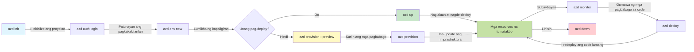
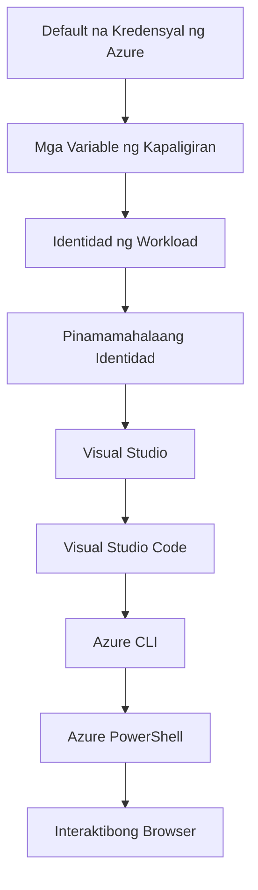

# AZD Basics - Pag-unawa sa Azure Developer CLI

# AZD Basics - Pangunahing Konsepto at Mga Pundasyon

**Pag-navigate ng Kabanata:**
- **📚 Course Home**: [AZD Para sa Mga Nagsisimula](../../README.md)
- **📖 Kasalukuyang Kabanata**: Kabanata 1 - Pundasyon at Mabilis na Pagsisimula
- **⬅️ Previous**: [Pangkalahatang-ideya ng Kurso](../../README.md#-chapter-1-foundation--quick-start)
- **➡️ Next**: [Pag-install at Pag-setup](installation.md)
- **🚀 Next Chapter**: [Kabanata 2: Pag-unlad na Nauuna ang AI](../chapter-02-ai-development/microsoft-foundry-integration.md)

## Introduksyon

Itong aralin ay ipinakikilala sa iyo ang Azure Developer CLI (azd), isang makapangyarihang command-line tool na nagpapabilis ng iyong paglalakbay mula sa lokal na pag-develop hanggang sa pag-deploy sa Azure. Matututuhan mo ang mga pangunahing konsepto, pangunahing tampok, at maiintindihan kung paano pinapasimple ng azd ang pag-deploy ng cloud-native na aplikasyon.

## Mga Layunin sa Pagkatuto

Sa pagtatapos ng araling ito, ikaw ay:
- Maiintindihan kung ano ang Azure Developer CLI at ang pangunahing layunin nito
- Matututo ng mga pangunahing konsepto ng mga template, mga kapaligiran, at mga serbisyo
- Susuriin ang mga pangunahing tampok kabilang ang template-driven development at Infrastructure as Code
- Maiintindihan ang estruktura ng proyekto ng azd at workflow
- Handa na mag-install at mag-configure ng azd para sa iyong development environment

## Mga Kinalabasan ng Pagkatuto

Pagkatapos makumpleto ang araling ito, magagawa mong:
- Ipaliwanag ang papel ng azd sa modernong cloud development workflows
- Tukuyin ang mga bahagi ng estruktura ng isang azd project
- Ilarawan kung paano nagtutulungan ang mga template, kapaligiran, at serbisyo
- Maunawaan ang mga benepisyo ng Infrastructure as Code gamit ang azd
- Makilala ang iba't ibang azd commands at ang kanilang mga layunin

## Ano ang Azure Developer CLI (azd)?

Azure Developer CLI (azd) ay isang command-line tool na idinisenyo upang pabilisin ang iyong paglalakbay mula sa lokal na pag-develop hanggang sa pag-deploy sa Azure. Pinapasimple nito ang proseso ng pagbuo, pag-deploy, at pamamahala ng mga cloud-native na aplikasyon sa Azure.

### Ano ang Maaari Mong I-deploy gamit ang azd?

azd ay sumusuporta sa malawak na hanay ng mga workload—at patuloy na lumalawak ang listahan. Ngayon, maaari mong gamitin ang azd para mag-deploy ng:

| Uri ng Workload | Mga Halimbawa | Parehong Workflow? |
|---------------|----------|----------------|
| **Tradisyonal na mga aplikasyon** | Mga web app, REST API, mga static na site | ✅ `azd up` |
| **Mga serbisyo at microservices** | Container Apps, Function Apps, mga multi-service backend | ✅ `azd up` |
| **Mga aplikasyon na pinapagana ng AI** | Mga chat app na may Microsoft Foundry Models, mga solusyon ng RAG gamit ang AI Search | ✅ `azd up` |
| **Matalinong mga ahente** | Mga agent na naka-host sa Foundry, mga orchestrasyon ng multi-agent | ✅ `azd up` |

Ang mahalagang pananaw ay na **pareho ang lifecycle ng azd anuman ang dini-deploy mo**. Ini-initialize mo ang isang proyekto, nagpo-provision ng imprastruktura, nagde-deploy ng iyong code, mino-monitor ang iyong app, at nililinis—mapa-simpleng website man o sopistikadong AI agent.

Ang pagkakaparehong ito ay idinisenyo. Tinuturing ng azd ang mga kakayahan ng AI bilang isa pang uri ng serbisyo na maaaring gamitin ng iyong aplikasyon, hindi bilang isang bagay na ganap na naiiba. Ang isang chat endpoint na sinusuportahan ng Microsoft Foundry Models ay, mula sa perspektibo ng azd, isa lamang pang serbisyo na i-configure at i-deploy.

### 🎯 Bakit Gamitin ang AZD? Isang Paghahambing sa Totoong Mundo

Ihambing natin ang pag-deploy ng isang simpleng web app na may database:

#### ❌ WALANG AZD: Manwal na Pag-deploy sa Azure (30+ minuto)

```bash
# Hakbang 1: Lumikha ng grupo ng mga mapagkukunan
az group create --name myapp-rg --location eastus

# Hakbang 2: Lumikha ng plano ng App Service
az appservice plan create --name myapp-plan \
  --resource-group myapp-rg \
  --sku B1 --is-linux

# Hakbang 3: Lumikha ng Web App
az webapp create --name myapp-web-unique123 \
  --resource-group myapp-rg \
  --plan myapp-plan \
  --runtime "NODE:18-lts"

# Hakbang 4: Lumikha ng account ng Cosmos DB (10-15 minuto)
az cosmosdb create --name myapp-cosmos-unique123 \
  --resource-group myapp-rg \
  --kind MongoDB

# Hakbang 5: Lumikha ng database
az cosmosdb mongodb database create \
  --account-name myapp-cosmos-unique123 \
  --resource-group myapp-rg \
  --name tododb

# Hakbang 6: Lumikha ng koleksyon
az cosmosdb mongodb collection create \
  --account-name myapp-cosmos-unique123 \
  --resource-group myapp-rg \
  --database-name tododb \
  --name todos

# Hakbang 7: Kunin ang string ng koneksyon
CONN_STR=$(az cosmosdb keys list \
  --name myapp-cosmos-unique123 \
  --resource-group myapp-rg \
  --type connection-strings \
  --query "connectionStrings[0].connectionString" -o tsv)

# Hakbang 8: I-configure ang mga setting ng app
az webapp config appsettings set \
  --name myapp-web-unique123 \
  --resource-group myapp-rg \
  --settings MONGODB_URI="$CONN_STR"

# Hakbang 9: Paganahin ang pag-log
az webapp log config --name myapp-web-unique123 \
  --resource-group myapp-rg \
  --application-logging filesystem \
  --detailed-error-messages true

# Hakbang 10: I-set up ang Application Insights
az monitor app-insights component create \
  --app myapp-insights \
  --location eastus \
  --resource-group myapp-rg

# Hakbang 11: I-link ang Application Insights sa Web App
INSTRUMENTATION_KEY=$(az monitor app-insights component show \
  --app myapp-insights \
  --resource-group myapp-rg \
  --query "instrumentationKey" -o tsv)

az webapp config appsettings set \
  --name myapp-web-unique123 \
  --resource-group myapp-rg \
  --settings APPINSIGHTS_INSTRUMENTATIONKEY="$INSTRUMENTATION_KEY"

# Hakbang 12: Buuin ang aplikasyon nang lokal
npm install
npm run build

# Hakbang 13: Lumikha ng pakete ng deployment
zip -r app.zip . -x "*.git*" "node_modules/*"

# Hakbang 14: I-deploy ang aplikasyon
az webapp deployment source config-zip \
  --resource-group myapp-rg \
  --name myapp-web-unique123 \
  --src app.zip

# Hakbang 15: Maghintay at manalangin na gumana ito 🙏
# (Walang awtomatikong pag-validate, kinakailangan ang manu-manong pagsubok)
```

**Mga Problema:**
- ❌ Higit sa 15 utos na dapat tandaan at isagawa ayon sa pagkakasunod
- ❌ 30-45 minuto ng manwal na trabaho
- ❌ Madaling magkamali (pagkakamali sa pag-type, maling mga parameter)
- ❌ Mga connection string na nakikita sa kasaysayan ng terminal
- ❌ Walang awtomatikong rollback kung may mabigo
- ❌ Mahirap ulitin para sa mga miyembro ng koponan
- ❌ Iba-iba tuwing pagkakataon (hindi nare-reproduce)

#### ✅ GAMIT ANG AZD: Awtomatikong Pag-deploy (5 utos, 10-15 minuto)

```bash
# Hakbang 1: I-initialize mula sa template
azd init --template todo-nodejs-mongo

# Hakbang 2: Patunayan ang pagkakakilanlan
azd auth login

# Hakbang 3: Lumikha ng kapaligiran
azd env new dev

# Hakbang 4: I-preview ang mga pagbabago (opsyonal ngunit inirerekomenda)
azd provision --preview

# Hakbang 5: I-deploy ang lahat
azd up

# ✨ Tapos na! Ang lahat ay na-deploy, na-configure, at binabantayan.
```

**Mga Benepisyo:**
- ✅ **5 utos** vs. 15+ manwal na hakbang
- ✅ **10-15 minuto** kabuuang oras (kadalasan naghihintay sa Azure)
- ✅ **Mas kaunting manwal na pagkakamali** - pare-pareho, daloy na pinapatakbo ng template
- ✅ **Ligtas na paghawak ng mga lihim** - maraming template ang gumagamit ng Azure-managed secret storage
- ✅ **Maaari ulitin na mga pag-deploy** - pareho ang daloy sa bawat pagkakataon
- ✅ **Ganap na nare-reproduce** - pareho ang resulta sa bawat pagkakataon
- ✅ **Handa para sa koponan** - kahit sino ay maaaring mag-deploy gamit ang parehong mga utos
- ✅ **Imprastruktura bilang Code** - mga Bicep template na naka-version control
- ✅ **Naka-built-in na monitoring** - awtomatikong na-configure ang Application Insights

### 📊 Pagbawas ng Oras at Error

| Metriko | Manwal na Pag-deploy | Pag-deploy gamit ang AZD | Pagpabuti |
|:-------|:------------------|:---------------|:------------|
| **Utos** | 15+ | 5 | 67% mas kaunti |
| **Oras** | 30-45 min | 10-15 min | 60% mas mabilis |
| **Rate ng Error** | ~40% | <5% | 88% pagbawas |
| **Konsistensya** | Mababa (manwal) | 100% (awtomatiko) | Perpekto |
| **Onboarding ng Koponan** | 2-4 oras | 30 minuto | 75% mas mabilis |
| **Oras ng Rollback** | 30+ min (manwal) | 2 min (awtomatiko) | 93% mas mabilis |

## Pangunahing Konsepto

### Mga Template
Ang mga template ang pundasyon ng azd. Naglalaman ang mga ito ng:
- **Code ng Aplikasyon** - Ang iyong source code at mga dependency
- **Mga definisyon ng imprastruktura** - Mga Azure resource na nade-define sa Bicep o Terraform
- **Mga configuration file** - Mga setting at environment variable
- **Mga deployment script** - Awtomatikong mga workflow sa pag-deploy

### Mga Kapaligiran
Ang mga kapaligiran ay kumakatawan sa iba't ibang target ng pag-deploy:
- **Development** - Para sa pag-test at pag-develop
- **Staging** - Kapaligiran bago produksyon
- **Production** - Live na kapaligiran ng produksyon

Bawat kapaligiran ay may sariling:
- resource group ng Azure
- Mga setting ng configuration
- Estado ng pag-deploy

### Mga Serbisyo
Ang mga serbisyo ang mga bloke ng pagbuo ng iyong aplikasyon:
- **Frontend** - Mga web application, mga SPA
- **Backend** - Mga API, microservices
- **Database** - Mga solusyon sa pag-iimbak ng data
- **Storage** - File at blob storage

## Pangunahing Mga Tampok

### 1. Pag-develop na Pinapatakbo ng Template
```bash
# Mag-browse ng mga magagamit na template
azd template list

# Simulan mula sa isang template
azd init --template <template-name>
```

### 2. Imprastruktura bilang Code
- **Bicep** - Ang domain-specific na wika ng Azure
- **Terraform** - Tool para sa imprastruktura na multi-cloud
- **ARM Templates** - Mga template ng Azure Resource Manager

### 3. Pinagsamang Mga Workflow
```bash
# Kumpletong daloy ng pag-deploy
azd up            # Mag-provision + Mag-deploy — awtomatiko ito para sa unang pagsasaayos

# 🧪 BAGO: I-preview ang mga pagbabago sa imprastruktura bago i-deploy (LIGTAS)
azd provision --preview    # Simulahin ang pag-deploy ng imprastruktura nang hindi gumagawa ng mga pagbabago

azd provision     # Lumikha ng mga resource sa Azure — gamitin ito kapag ina-update mo ang imprastruktura
azd deploy        # I-deploy ang code ng aplikasyon o muling i-deploy ang code kapag na-update
azd down          # Linisin ang mga resource
```

#### 🛡️ Ligtas na Pagpaplano ng Imprastruktura gamit ang Preview
Ang utos na `azd provision --preview` ay malaking pagbabago para sa ligtas na mga pag-deploy:
- **Dry-run analysis** - Ipinapakita kung ano ang malilikha, mababago, o mabubura
- **Zero risk** - Walang aktwal na pagbabago ang gagawin sa iyong Azure environment
- **Team collaboration** - Ibahagi ang mga resulta ng preview bago i-deploy
- **Cost estimation** - Unawain ang mga gastos ng resource bago mag-commit

```bash
# Halimbawa ng workflow ng preview
azd provision --preview           # Tingnan kung ano ang magbabago
# Suriin ang output, talakayin ito kasama ang koponan
azd provision                     # Ipatupad ang mga pagbabago nang may kumpiyansa
```

### 📊 Biswal: AZD Development Workflow



**Paliwanag ng Workflow:**
1. **Init** - Magsimula gamit ang template o bagong proyekto
2. **Auth** - Mag-authenticate sa Azure
3. **Environment** - Gumawa ng hiwalay na deployment environment
4. **Preview** - 🆕 Laging i-preview muna ang mga pagbabago sa imprastruktura (ligtas na gawi)
5. **Provision** - Lumikha/i-update ang mga Azure resource
6. **Deploy** - I-push ang iyong application code
7. **Monitor** - Obserbahan ang performance ng aplikasyon
8. **Iterate** - Gumawa ng mga pagbabago at i-redeploy ang code
9. **Cleanup** - Alisin ang mga resource kapag tapos na

### 4. Pamamahala ng Kapaligiran
```bash
# Lumikha at pamahalaan ang mga kapaligiran
azd env new <environment-name>
azd env select <environment-name>
azd env list
```

### 5. Mga Extension at mga Utos para sa AI

azd ay gumagamit ng isang extension system para magdagdag ng mga kakayahan lampas sa core CLI. Ito ay lalong kapaki-pakinabang para sa mga workload ng AI:

```bash
# Ilista ang mga magagamit na extension
azd extension list

# I-install ang Foundry agents na ekstensyon
azd extension install azure.ai.agents

# I-initialize ang isang proyekto ng AI agent mula sa manifest
azd ai agent init -m agent-manifest.yaml

# Subukan ang isang naka-deploy na agent (ipapakita ang pagkaantala at oras hanggang unang byte)
azd ai agent invoke

# Simulan ang MCP server para sa pag-develop na may tulong ng AI (Alpha)
azd mcp start
```

**Ang lifecycle ng agent, mula simula hanggang dulo.** Kapag na-install mo na ang `azure.ai.agents`, isang workflow lang ang magdadala sa iyo mula sa ideya hanggang sa isang tumatakbo at mino-monitor na agent. Hindi mo kailangang gamitin lahat ng ito sa unang araw—alamin lang na umiiral sila:

| Yugto | Utos | Ginagawa nito |
|-------|---------|--------------|
| **Scaffold** | `azd ai agent init -m <manifest>` | Gumawa ng agent project mula sa isang manifest |
| **Test** | `azd ai agent invoke` | Tawagan ang agent at tingnan ang oras ng tugon |
| **Measure** | `azd ai agent eval generate` | Gumawa ng evaluation dataset para sa agent |
| **Improve** | `azd ai agent optimize` | I-optimize ang mga instruction ng agent batay sa iyong data |
| **Inspect** | `azd ai agent endpoint show` | Tingnan ang live na configuration ng endpoint |
| **Clean up** | `azd ai agent delete` | Tanggalin ang isang naka-host na agent at lahat ng mga bersyon nito |

> Tinalakay nang detalyado ang mga extension sa [Kabanata 2: Pag-unlad na Nauuna ang AI](../chapter-02-ai-development/agents.md) at ang sanggunian na [Mga Utos ng AZD AI CLI](../chapter-08-production/production-ai-practices.md#azd-ai-cli-commands-and-extensions).

## 📁 Estruktura ng Proyekto

Isang tipikal na estruktura ng proyekto ng azd:
```
my-app/
├── .azd/                    # azd configuration
│   └── config.json
├── .azure/                  # Azure deployment artifacts
├── .devcontainer/          # Development container config
├── .github/workflows/      # GitHub Actions
├── .vscode/               # VS Code settings
├── infra/                 # Infrastructure code
│   ├── main.bicep        # Main infrastructure template
│   ├── main.parameters.json
│   └── modules/          # Reusable modules
├── src/                  # Application source code
│   ├── api/             # Backend services
│   └── web/             # Frontend application
├── azure.yaml           # azd project configuration
└── README.md
```

## 🔧 Mga File ng Konfigurasyon

### azure.yaml
Ang pangunahing configuration file ng proyekto:
```yaml
name: my-awesome-app
metadata:
  template: my-template@1.0.0

services:
  web:
    project: ./src/web
    language: js
    host: appservice
  api:
    project: ./src/api
    language: js
    host: appservice

hooks:
  preprovision:
    shell: pwsh
    run: echo "Preparing to provision..."
```

### .azure/config.json
Kalikasan ng configuration na pang-kapaligiran:
```json
{
  "version": 1,
  "defaultEnvironment": "dev",
  "environments": {
    "dev": {
      "subscriptionId": "your-subscription-id",
      "location": "eastus"
    }
  }
}
```

## 🎪 Karaniwang Mga Workflow na may Praktikal na Mga Ehersisyo

> **💡 Tip sa Pagkatuto:** Sundin ang mga ehersisyong ito nang sunod-sunod upang unti-unting buuin ang iyong mga kasanayan sa AZD.

### 🎯 Ehersisyo 1: I-initialize ang Iyong Unang Proyekto

**Layunin:** Lumikha ng isang AZD proyekto at alamin ang estruktura nito

**Mga Hakbang:**
```bash
# Gumamit ng napatunayan na template
azd init --template todo-nodejs-mongo

# Tuklasin ang mga nabuo na file
ls -la  # Tingnan ang lahat ng file kasama na ang mga nakatagong file

# Mga pangunahing file na nilikha:
# - azure.yaml (pangunahing konfigurasyon)
# - infra/ (kodigo ng imprastruktura)
# - src/ (kodigo ng aplikasyon)
```

**✅ Tagumpay:** Mayroon kang azure.yaml, infra/, at src/ mga direktoryo

---

### 🎯 Ehersisyo 2: I-deploy sa Azure

**Layunin:** Kumpletuhin ang end-to-end na pag-deploy

**Mga Hakbang:**
```bash
# 1. Patunayan ang pagkakakilanlan
az login && azd auth login

# 2. Lumikha ng kapaligiran
azd env new dev
azd env set AZURE_LOCATION eastus

# 3. Suriin muna ang mga pagbabago (INIREREKOMENDA)
azd provision --preview

# 4. I-deploy ang lahat
azd up

# 5. Tiyakin ang pag-deploy
azd show    # 6. Tingnan ang URL ng iyong app
```

**Inaasahang Oras:** 10-15 minuto  
**✅ Tagumpay:** Nagbubukas ang URL ng aplikasyon sa browser

---

### 🎯 Ehersisyo 3: Maramihang Kapaligiran

**Layunin:** Mag-deploy sa dev at staging

**Mga Hakbang:**
```bash
# May dev na, gumawa ng staging
azd env new staging
azd env set AZURE_LOCATION westus2
azd up

# Lumipat sa pagitan nila
azd env list
azd env select dev
```

**✅ Tagumpay:** Dalawang hiwalay na resource group sa Azure Portal

---

### 🛡️ Malinis na Simula: `azd down --force --purge`

Kapag kailangan mong ganap na i-reset:

```bash
azd down --force --purge
```

**Ano ang ginagawa nito:**
- `--force`: Walang mga prompt para sa kumpirmasyon
- `--purge`: Tinatanggal ang lahat ng lokal na estado at mga Azure resource

**Gamitin kapag:**
- Nabigo ang pag-deploy sa gitna
- Nagpapalit ng mga proyekto
- Kailangan ng bagong simula

---

## 🎪 Orihinal na Sanggunian ng Workflow

### Pagsisimula ng Bagong Proyekto
```bash
# Paraan 1: Gumamit ng umiiral na template
azd init --template todo-nodejs-mongo

# Paraan 2: Magsimula mula sa simula
azd init

# Paraan 3: Gamitin ang kasalukuyang direktoryo
azd init .
```

### Siklo ng Pag-develop
```bash
# Ihanda ang kapaligiran para sa pag-develop
azd auth login
azd env new dev
azd env select dev

# I-deploy ang lahat
azd up

# Gumawa ng mga pagbabago at muling i-deploy
azd deploy

# Linisin kapag tapos na
azd down --force --purge # Ang utos sa Azure Developer CLI ay isang **kumpletong pag-reset** para sa iyong kapaligiran—partikular na kapaki-pakinabang kapag nagte-troubleshoot ka ng mga nabigong deployment, nililinis ang mga naiwan na resource, o naghahanda para sa muling pag-deploy.
```

## Pag-unawa sa `azd down --force --purge`
Ang utos na `azd down --force --purge` ay isang makapangyarihang paraan upang lubusang buwagin ang iyong azd environment at lahat ng kaugnay na resources. Narito ang paliwanag kung ano ang ginagawa ng bawat flag:
```
--force
```
- Lumlaktaw sa mga prompt ng kumpirmasyon.
- Kapaki-pakinabang para sa automation o scripting kung saan hindi praktikal ang manwal na input.
- Tinitiyak na ang teardown ay nagpapatuloy nang hindi napuputol, kahit na may makita ang CLI na hindi pagkakatugma.

```
--purge
```
Tinatanggal **lahat ng kaugnay na metadata**, kasama ang:
Estado ng kapaligiran
Lokal na `.azure` folder
Na-cache na impormasyon ng deployment
Pinipigilan ang azd na "maalala" ang mga naunang pag-deploy, na maaaring magdulot ng mga isyu tulad ng hindi tumutugmang resource group o mga luma/maling sanggunian sa registry.

### Bakit gamitin pareho?
Kapag na-stuck ka sa `azd up` dahil sa natitirang estado o partial na mga pag-deploy, tinitiyak ng kombinasyong ito ang isang **malinis na simula**.

Partikular itong kapaki-pakinabang pagkatapos ng manwal na pagtanggal ng mga resource sa Azure portal o kapag nagpapalit ng mga template, kapaligiran, o mga convention sa pag-name ng resource group.

### Pamamahala ng Maramihang Kapaligiran
```bash
# Gumawa ng staging na kapaligiran
azd env new staging
azd env select staging
azd up

# Lumipat pabalik sa dev
azd env select dev

# Ihambing ang mga kapaligiran
azd env list
```

## 🔐 Pag-authenticate at Mga Kredensyal

Ang pag-unawa sa authentication ay mahalaga para sa matagumpay na pag-deploy gamit ang azd. Gumagamit ang Azure ng maraming paraan ng authentication, at ginagamit ng azd ang parehong credential chain na ginagamit ng iba pang Azure tools.

### Pag-authenticate gamit ang Azure CLI (`az login`)

Bago gamitin ang azd, kailangan mong mag-authenticate sa Azure. Ang pinakakaraniwang paraan ay ang paggamit ng Azure CLI:

```bash
# Interaktibong pag-login (nagbubukas ng browser)
az login

# Mag-log in sa isang partikular na tenant
az login --tenant <tenant-id>

# Mag-log in gamit ang service principal
az login --service-principal -u <app-id> -p <password> --tenant <tenant-id>

# Suriin ang kasalukuyang status ng pag-login
az account show

# Ilista ang mga available na subscription
az account list --output table

# Itakda ang default na subscription
az account set --subscription <subscription-id>
```

### Daloy ng Pag-authenticate
1. **Interactive Login**: Binubuksan ang iyong default na browser para sa pag-authenticate
2. **Device Code Flow**: Para sa mga kapaligiran na walang access sa browser
3. **Service Principal**: Para sa automation at mga senaryo ng CI/CD
4. **Managed Identity**: Para sa mga aplikasyon na naka-host sa Azure

### DefaultAzureCredential Chain

`DefaultAzureCredential` ay isang uri ng kredensyal na nagbibigay ng pinasimpleng karanasan sa pag-authenticate sa pamamagitan ng awtomatikong pagsubok ng maramihang pinagkukunan ng kredensyal sa isang partikular na pagkakasunod-sunod:

#### Pagkakasunod-sunod ng Kadena ng Kredensyal


#### 1. Mga Environment Variable
```bash
# Itakda ang mga variable ng kapaligiran para sa service principal
export AZURE_CLIENT_ID="<app-id>"
export AZURE_CLIENT_SECRET="<password>"
export AZURE_TENANT_ID="<tenant-id>"
```

#### 2. Workload Identity (Kubernetes/GitHub Actions)
Ginagamit nang awtomatiko sa:
- Azure Kubernetes Service (AKS) with Workload Identity
- GitHub Actions with OIDC federation
- Iba pang mga senaryo ng federated identity

#### 3. Managed Identity
Para sa mga Azure resource tulad ng:
- Mga Virtual Machine
- App Service
- Azure Functions
- Container Instances

```bash
# Suriin kung tumatakbo sa isang Azure resource na may managed identity
az account show --query "user.type" --output tsv
# Ibinabalik: "servicePrincipal" kung gumagamit ng managed identity
```

#### 4. Integrasyon ng Mga Developer Tool
- **Visual Studio**: Awtomatikong ginagamit ang naka-sign-in na account
- **VS Code**: Gumagamit ng mga kredensyal mula sa Azure Account extension
- **Azure CLI**: Gumagamit ng mga kredensyal mula sa `az login` (pinakakaraniwan para sa lokal na pag-develop)

### Setup ng Pag-authenticate para sa AZD

```bash
# Paraan 1: Gumamit ng Azure CLI (Inirerekomenda para sa pag-develop)
az login
azd auth login  # Gumagamit ng umiiral na mga kredensyal ng Azure CLI

# Paraan 2: Direktang awtentikasyon ng azd
azd auth login --use-device-code  # Para sa walang UI na mga kapaligiran

# Paraan 3: Suriin ang katayuan ng awtentikasyon
azd auth login --check-status

# Paraan 4: Mag-logout at muling mag-authenticate
azd auth logout
azd auth login
```

### Pinakamahusay na Kasanayan sa Pag-authenticate

#### Para sa Lokal na Pag-develop
```bash
# 1. Mag-login gamit ang Azure CLI
az login

# 2. Kumpirmahin ang tamang subscription
az account show
az account set --subscription "Your Subscription Name"

# 3. Gamitin ang azd gamit ang umiiral na mga kredensyal
azd auth login
```

#### Para sa CI/CD Pipelines
```yaml
# GitHub Actions example
- name: Azure Login
  uses: azure/login@v1
  with:
    creds: ${{ secrets.AZURE_CREDENTIALS }}

- name: Deploy with azd
  run: |
    azd auth login --client-id ${{ secrets.AZURE_CLIENT_ID }} \
                    --client-secret ${{ secrets.AZURE_CLIENT_SECRET }} \
                    --tenant-id ${{ secrets.AZURE_TENANT_ID }}
    azd up --no-prompt
```

#### Para sa Mga Production Environment
- Gumamit ng **Managed Identity** kapag nagpapatakbo sa mga Azure resources
- Gumamit ng **Service Principal** para sa mga automation na senaryo
- Iwasang mag-imbak ng mga kredensyal sa code o mga configuration file
- Gumamit ng **Azure Key Vault** para sa sensitibong konfigurasyon

### Karaniwang Mga Isyu sa Autentikasyon at mga Solusyon

#### Isyu: "No subscription found"
```bash
# Solusyon: Itakda ang default na subskripsyon
az account list --output table
az account set --subscription "<subscription-id>"
azd env set AZURE_SUBSCRIPTION_ID "<subscription-id>"
```

#### Isyu: "Insufficient permissions"
```bash
# Solusyon: Suriin at italaga ang mga kinakailangang tungkulin
az role assignment list --assignee $(az account show --query user.name --output tsv)

# Karaniwang kinakailangang tungkulin:
# - Contributor (para sa pamamahala ng mga resource)
# - User Access Administrator (para sa pagtatalaga ng mga tungkulin)
```

#### Isyu: "Token expired"
```bash
# Solusyon: Muling pagpapatunay ng pagkakakilanlan
az logout
az login
azd auth logout
azd auth login
```

### Autentikasyon sa Iba't Ibang Mga Senaryo

#### Lokal na Pag-develop
```bash
# Account para sa personal na pag-unlad
az login
azd auth login
```

#### Pangkatang Pag-develop
```bash
# Gumamit ng partikular na tenant para sa organisasyon
az login --tenant contoso.onmicrosoft.com
azd auth login
```

#### Multi-tenant na Mga Senaryo
```bash
# Lumipat sa pagitan ng mga tenant
az login --tenant tenant1.onmicrosoft.com
# I-deploy sa tenant 1
azd up

az login --tenant tenant2.onmicrosoft.com  
# I-deploy sa tenant 2
azd up
```

### Mga Pagsasaalang-alang sa Seguridad

1. **Credential Storage**: Huwag kailanman mag-imbak ng mga kredensyal sa source code
2. **Scope Limitation**: Gamitin ang prinsipyong least-privilege para sa mga service principal
3. **Token Rotation**: Regular na i-rotate ang mga secret ng service principal
4. **Audit Trail**: I-monitor ang mga aktibidad sa autentikasyon at deployment
5. **Network Security**: Gumamit ng private endpoints kapag posible

### Pag-troubleshoot ng Autentikasyon

```bash
# I-debug ang mga isyu sa pagpapatotoo
azd auth login --check-status
az account show
az account get-access-token

# Karaniwang mga utos ng diagnostiko
whoami                          # Kasalukuyang konteksto ng gumagamit
az ad signed-in-user show      # Mga detalye ng gumagamit ng Microsoft Entra ID
az group list                  # Subukan ang pag-access sa resource
```

## Pag-unawa sa `azd down --force --purge`

### Pagtuklas
```bash
azd template list              # Mag-browse ng mga template
azd template show <template>   # Mga detalye ng template
azd init --help               # Mga opsyon sa inisyalisasyon
```

### Pamamahala ng Proyekto
```bash
azd show                     # Pangkalahatang-ideya ng proyekto
azd env list                # Magagamit na mga kapaligiran at ang napiling default
azd config show            # Mga setting ng konfigurasyon
```

### Pagmo-monitor
```bash
azd monitor                  # Buksan ang monitoring sa Azure portal
azd monitor --logs           # Tingnan ang mga log ng aplikasyon
azd monitor --live           # Tingnan ang mga real-time na sukatan
azd pipeline config          # Itakda ang CI/CD
```

## Mga Pinakamainam na Kasanayan

### 1. Gumamit ng Makabuluhang Mga Pangalan
```bash
# Mabuti
azd env new production-east
azd init --template web-app-secure

# Iwasan
azd env new env1
azd init --template template1
```

### 2. Samantalahin ang Mga Template
- Magsimula sa umiiral na mga template
- I-customize ayon sa iyong pangangailangan
- Gumawa ng mga reusable na template para sa iyong organisasyon

### 3. Paghiwalay ng Kapaligiran
- Gumamit ng hiwalay na mga environment para sa dev/staging/prod
- Huwag mag-deploy nang direkta sa production mula sa lokal na makina
- Gumamit ng CI/CD pipelines para sa mga production deployment

### 4. Pamamahala ng Konfigurasyon
- Gumamit ng environment variables para sa sensitibong datos
- Panatilihin ang konfigurasyon sa version control
- I-dokumento ang environment-specific na mga setting

## Pag-unlad sa Pagkatuto

### Nagsisimula (Linggo 1-2)
1. I-install ang azd at mag-authenticate
2. I-deploy ang isang simpleng template
3. Unawain ang estruktura ng proyekto
4. Matutunan ang mga pangunahing command (up, down, deploy)

### Intermediate (Linggo 3-4)
1. I-customize ang mga template
2. Pamahalaan ang maraming mga environment
3. Unawain ang infrastructure code
4. Mag-setup ng CI/CD pipelines

### Advanced (Linggo 5+)
1. Lumikha ng mga custom na template
2. Advanced na mga pattern ng imprastruktura
3. Mga deployment sa maraming rehiyon
4. Enterprise-grade na mga konfigurasyon

## Mga Susunod na Hakbang

**📖 Ipagpatuloy ang Kabanata 1 na Pag-aaral:**
- [Installation & Setup](installation.md) - I-install at i-configure ang azd
- [Your First Project](first-project.md) - Kumpletuhin ang hands-on na tutorial
- [Configuration Guide](configuration.md) - Mga advanced na opsyon sa konfigurasyon

**🎯 Handa na para sa Susunod na Kabanata?**
- [Chapter 2: AI-First Development](../chapter-02-ai-development/microsoft-foundry-integration.md) - Magsimulang bumuo ng mga AI application

## Karagdagang Mga Mapagkukunan

- [Azure Developer CLI Overview](https://learn.microsoft.com/en-us/azure/developer/azure-developer-cli/)
- [Template Gallery](https://azure.github.io/awesome-azd/)
- [Community Samples](https://github.com/Azure-Samples)

---

## 🙋 Madalas na Itanong

### Mga Pangkalahatang Tanong

**Q: Ano ang pagkakaiba ng AZD at Azure CLI?**

A: Ang Azure CLI (`az`) ay para sa pamamahala ng mga indibidwal na Azure resources. Ang AZD (`azd`) ay para sa pamamahala ng buong mga application:

```bash
# Azure CLI - Mababang antas na pamamahala ng mga mapagkukunan
az webapp create --name myapp --resource-group rg
az sql server create --name myserver --resource-group rg
# ...kailangan pa ng maraming utos

# AZD - Pamamahala sa antas ng aplikasyon
azd up  # Inilulunsad ang buong aplikasyon kasama ang lahat ng mga mapagkukunan
```

**Isipin mo ito sa ganitong paraan:**
- `az` = Pag-ooperate sa mga indibidwal na Lego bricks
- `azd` = Pagtatrabaho sa kumpletong mga Lego set

---

**Q: Kailangan ko bang marunong ng Bicep o Terraform para gumamit ng AZD?**

A: Hindi! Magsimula sa mga template:
```bash
# Gamitin ang umiiral na template - hindi kailangan ng kaalaman sa IaC
azd init --template todo-nodejs-mongo
azd up
```

Maaari kang matuto ng Bicep mamaya para i-customize ang imprastruktura. Nagbibigay ang mga template ng gumaganang mga halimbawa na mapag-aaralan.

---

**Q: Magkano ang gastos ng pagpapatakbo ng mga AZD template?**

A: Nagkakaiba ang gastos ayon sa template. Karamihan sa mga development template ay nagkakahalaga ng $50-150/buwan:

```bash
# I-preview ang mga gastos bago mag-deploy
azd provision --preview

# Laging linisin kapag hindi ginagamit
azd down --force --purge  # Tinatanggal ang lahat ng mga resource
```

**Pro tip:** Gumamit ng mga free tier kung available:
- App Service: F1 (Free) tier
- Microsoft Foundry Models: Azure OpenAI 50,000 tokens/month free
- Cosmos DB: 1000 RU/s free tier

---

**Q: Maaari ko bang gamitin ang AZD sa umiiral na Azure resources?**

A: Oo, ngunit mas madali magsimula mula sa simula. Pinakamainam ang AZD kapag pinamamahalaan nito ang buong lifecycle. Para sa umiiral na resources:

```bash
# Opsyon 1: I-import ang umiiral na mga mapagkukunan (avansado)
azd init
# Pagkatapos, baguhin ang infra/ upang tumukoy sa umiiral na mga mapagkukunan

# Opsyon 2: Magsimula muli (inirerekomenda)
azd init --template matching-your-stack
azd up  # Lumilikha ng bagong kapaligiran
```

---

**Q: Paano ko ibabahagi ang aking proyekto sa mga kasamahan?**

A: I-commit ang AZD project sa Git (ngunit HUWAG ang .azure folder):

```bash
# Kasama na sa .gitignore bilang default
.azure/        # Naglalaman ng mga lihim at datos ng kapaligiran
*.env          # Mga variable ng kapaligiran

# Mga miyembro ng koponan noon:
git clone <your-repo>
azd auth login
azd env new <their-name>-dev
azd up
```

Lahat ay makakakuha ng identikal na imprastruktura mula sa parehong mga template.

---

### Mga Tanong sa Pag-troubleshoot

**Q: Nabigo ang "azd up" habang nasa kalagitnaan. Ano ang gagawin ko?**

A: Suriin ang error, ayusin ito, saka ulitin:

```bash
# Tingnan ang detalyadong mga log
azd show

# Karaniwang pag-aayos:

# 1. Kung lumagpas ang quota:
azd env set AZURE_LOCATION "westus2"  # Subukan ang ibang rehiyon

# 2. Kung may konflikto sa pangalan ng resource:
azd down --force --purge  # Magsimula mula sa simula
azd up  # Subukan muli

# 3. Kung nag-expire ang awtentikasyon:
az login
azd auth login
azd up
```

**Karamihang sanhi:** Mali ang napiling Azure subscription
```bash
az account list --output table
az account set --subscription "<correct-subscription>"
```

---

**Q: Paano ko ide-deploy ang mga pagbabago sa code nang hindi nire-reprovision?**

A: Gamitin ang `azd deploy` sa halip na `azd up`:

```bash
azd up          # Unang beses: maghanda ng mga resources at ilunsad (mabagal)

# Gumawa ng mga pagbabago sa code...

azd deploy      # Sa mga sumunod na pagkakataon: ilunsad lamang (mabilis)
```

Paghahambing ng bilis:
- `azd up`: 10-15 minuto (nagpo-provision ng imprastruktura)
- `azd deploy`: 2-5 minuto (code lamang)

---

**Q: Maaari ko bang i-customize ang mga infrastructure template?**

A: Oo! I-edit ang mga Bicep file sa `infra/`:

```bash
# Pagkatapos ng azd init
cd infra/
code main.bicep  # I-edit sa VS Code

# Tingnan ang mga pagbabago
azd provision --preview

# Ilapat ang mga pagbabago
azd provision
```

**Tip:** Magsimula sa maliit - palitan muna ang mga SKU:
```bicep
// infra/main.bicep
sku: {
  name: 'B1'  // Change to 'P1V2' for production
}
```

---

**Q: Paano ko buburahin ang lahat ng nilikha ng AZD?**

A: Isang command ang nag-aalis ng lahat ng resources:

```bash
azd down --force --purge

# Tinatanggal nito:
# - Lahat ng mga Azure na resource
# - Grupo ng mga resource
# - Lokal na estado ng kapaligiran
# - Na-cache na data ng pag-deploy
```

**Laging patakbuhin ito kapag:**
- Tapos na ang pag-test ng isang template
- Lumilipat sa ibang proyekto
- Nais magsimula mula sa simula

**Pagtitipid sa gastos:** Ang pagtanggal ng hindi ginagamit na resources = $0 charge

---

**Q: Ano ang gagawin ko kung aksidenteng nabura ko ang mga resources sa Azure Portal?**

A: Maaaring magkaiba ang estado ng AZD. Para sa malinis na simula:

```bash
# 1. Alisin ang lokal na estado
azd down --force --purge

# 2. Magsimula muli
azd up

# Alternatibo: Hayaan ang AZD tuklasin at ayusin
azd provision  # Lilikha ng mga nawawalang resource
```

---

### Mga Advanced na Tanong

**Q: Maaari ko bang gamitin ang AZD sa CI/CD pipelines?**

A: Oo! Halimbawa para sa GitHub Actions:

```yaml
# .github/workflows/deploy.yml
name: Deploy with AZD

on:
  push:
    branches: [main]

jobs:
  deploy:
    runs-on: ubuntu-latest
    steps:
      - uses: actions/checkout@v2
      
      - name: Install azd
        run: curl -fsSL https://aka.ms/install-azd.sh | bash
      
      - name: Azure Login
        run: |
          azd auth login \
            --client-id ${{ secrets.AZURE_CLIENT_ID }} \
            --client-secret ${{ secrets.AZURE_CLIENT_SECRET }} \
            --tenant-id ${{ secrets.AZURE_TENANT_ID }}
      
      - name: Deploy
        run: azd up --no-prompt
```

---

**Q: Paano ko hinahandle ang mga secret at sensitibong data?**

A: Ang AZD ay nag-iintegrate sa Azure Key Vault nang awtomatiko:

```bash
# Ang mga lihim ay nakaimbak sa Key Vault, hindi sa code
azd env set DATABASE_PASSWORD "$(openssl rand -base64 32)"

# Awtomatikong ginagawa ng AZD:
# 1. Lumilikha ng Key Vault
# 2. Nag-iimbak ng lihim
# 3. Nagbibigay sa app ng access sa pamamagitan ng Managed Identity
# 4. Ini-inject sa runtime
```

**Huwag kailanman i-commit:**
- `.azure/` folder (naglalaman ng environment data)
- `.env` files (mga lokal na secret)
- Connection strings

---

**Q: Maaari ba akong mag-deploy sa maraming rehiyon?**

A: Oo, gumawa ng environment bawat rehiyon:

```bash
# Kapaligiran ng Silangang Estados Unidos
azd env new prod-eastus
azd env set AZURE_LOCATION eastus
azd up

# Kapaligiran ng Kanlurang Europa
azd env new prod-westeurope
azd env set AZURE_LOCATION westeurope
azd up

# Bawat kapaligiran ay independiyente
azd env list
```

Para sa totoong multi-region apps, i-customize ang mga Bicep template upang mag-deploy sa maraming rehiyon nang sabay-sabay.

---

**Q: Saan ako maaaring humingi ng tulong kung ako'y na-stuck?**

1. **AZD Documentation:** https://learn.microsoft.com/azure/developer/azure-developer-cli/
2. **GitHub Issues:** https://github.com/Azure/azure-dev/issues
3. **Discord:** [Azure Discord](https://discord.gg/microsoft-azure) - #azure-developer-cli channel
4. **Stack Overflow:** Tag `azure-developer-cli`
5. **This Course:** [Troubleshooting Guide](../chapter-07-troubleshooting/common-issues.md)

**Pro tip:** Bago magtanong, patakbuhin:
```bash
azd show       # Ipinapakita ang kasalukuyang estado
azd version    # Ipinapakita ang iyong bersyon
```
Isama ang impormasyong ito sa iyong tanong para sa mas mabilis na tulong.

---

## 🎓 Ano ang Susunod?

Nauunawaan mo na ang mga pundasyon ng AZD. Piliin ang iyong landas:

### 🎯 Para sa Mga Nagsisimula:
1. **Susunod:** [Installation & Setup](installation.md) - I-install ang AZD sa iyong makina
2. **Sunod:** [Your First Project](first-project.md) - I-deploy ang iyong unang app
3. **Magpraktis:** Kumpletuhin ang lahat ng 3 ehersisyo sa leksyong ito

### 🚀 Para sa Mga AI Developer:
1. **Laktawan sa:** [Chapter 2: AI-First Development](../chapter-02-ai-development/microsoft-foundry-integration.md)
2. **I-deploy:** Magsimula sa `azd init --template get-started-with-ai-chat`
3. **Matuto:** Bumuo habang nagde-deploy

### 🏗️ Para sa Mga May Karanasang Developer:
1. **Suriin:** [Configuration Guide](configuration.md) - Mga advanced na setting
2. **I-explore:** [Infrastructure as Code](../chapter-04-infrastructure/provisioning.md) - Malalim sa Bicep
3. **Bumuo:** Lumikha ng mga custom na template para sa iyong stack

---

**Pag-navigate sa Kabanata:**
- **📚 Course Home**: [AZD For Beginners](../../README.md)
- **📖 Kasalukuyang Kabanata**: Kabanata 1 - Foundation & Quick Start  
- **⬅️ Nakaraan**: [Course Overview](../../README.md#-chapter-1-foundation--quick-start)
- **➡️ Susunod**: [Installation & Setup](installation.md)
- **🚀 Susunod na Kabanata**: [Chapter 2: AI-First Development](../chapter-02-ai-development/microsoft-foundry-integration.md)

---

<!-- CO-OP TRANSLATOR DISCLAIMER START -->
**Pagtatanggi**:
Ang dokumentong ito ay isinalin gamit ang serbisyo ng AI translation na [Co-op Translator](https://github.com/Azure/co-op-translator). Bagama't nagsusumikap kami para sa katumpakan, pakatandaan na ang awtomatikong pagsasalin ay maaaring maglaman ng mga pagkakamali o hindi pagkakatugma. Ang orihinal na dokumento sa orihinal nitong wika ang dapat ituring na pangunahing sanggunian. Para sa mahahalagang impormasyon, inirerekomenda ang propesyonal na pagsasalin ng tao. Hindi kami mananagot sa anumang maling pagkakaintindi o maling interpretasyon na nagmula sa paggamit ng pagsasaling ito.
<!-- CO-OP TRANSLATOR DISCLAIMER END -->