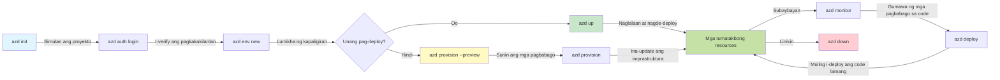
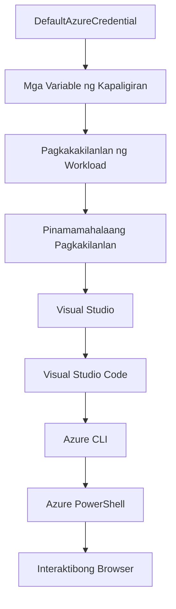

# AZD Basics - Pag-unawa sa Azure Developer CLI

# AZD Basics - Mga Pangunahing Konsepto at Fundamentals

**Pag-navigate ng Kabanata:**
- **📚 Course Home**: [AZD For Beginners](../../README.md)
- **📖 Current Chapter**: Chapter 1 - Foundation & Quick Start
- **⬅️ Previous**: [Course Overview](../../README.md#-chapter-1-foundation--quick-start)
- **➡️ Next**: [Installation & Setup](installation.md)
- **🚀 Next Chapter**: [Chapter 2: AI-First Development](../chapter-02-ai-development/microsoft-foundry-integration.md)

## Panimula

Ipinapakilala ng araling ito ang Azure Developer CLI (azd), isang makapangyarihang command-line na kasangkapan na nagpapabilis ng iyong paglalakbay mula sa lokal na pag-develop hanggang sa deployment sa Azure. Matututuhan mo ang mga pangunahing konsepto, pangunahing tampok, at mauunawaan kung paano pinapasimple ng azd ang pag-deploy ng cloud-native na application.

## Mga Layunin sa Pagkatuto

Sa pagtatapos ng araling ito, ikaw ay:
- Mauunawaan kung ano ang Azure Developer CLI at ang pangunahing layunin nito
- Matutunan ang mga pangunahing konsepto ng mga template, mga environment, at mga serbisyo
- Susuriin ang mga pangunahing tampok kabilang ang template-driven development at Infrastructure as Code
- Mauunawaan ang istruktura ng proyekto at workflow ng azd
- Handa nang i-install at i-configure ang azd para sa iyong development environment

## Mga Kinalabasan ng Pagkatuto

Pagkatapos makumpleto ang araling ito, magagawa mong:
- Ipaliwanag ang papel ng azd sa modernong workflow ng cloud development
- Tukuyin ang mga bahagi ng isang azd project structure
- Ilarawan kung paano nagtutulungan ang mga template, environment, at serbisyo
- Mauunawaan ang mga benepisyo ng Infrastructure as Code gamit ang azd
- Kilalanin ang iba't ibang azd na utos at ang kanilang mga layunin

## Ano ang Azure Developer CLI (azd)?

Ang Azure Developer CLI (azd) ay isang command-line na kasangkapan na idinisenyo upang pabilisin ang iyong paglalakbay mula sa lokal na pag-develop hanggang sa deployment sa Azure. Pinapasimple nito ang proseso ng pagbuo, pag-deploy, at pamamahala ng cloud-native na mga application sa Azure.

### Ano ang Maaari Mong I-deploy gamit ang azd?

Sinusuportahan ng azd ang malawak na hanay ng mga workload—at patuloy ang paglago ng listahan. Ngayon, maaari mong gamitin ang azd upang i-deploy:

| Uri ng Workload | Mga Halimbawa | Parehong Workflow? |
|---------------|----------|----------------|
| **Tradisyonal na mga aplikasyon** | Web apps, REST APIs, static sites | ✅ `azd up` |
| **Mga serbisyo at microservices** | Container Apps, Function Apps, multi-service backends | ✅ `azd up` |
| **Mga aplikasyong may AI** | Chat apps na may Microsoft Foundry Models, RAG solutions na may AI Search | ✅ `azd up` |
| **Mga intelligent agents** | Foundry-hosted agents, multi-agent orchestrations | ✅ `azd up` |

Ang pangunahing pananaw ay na **pareho ang lifecycle ng azd kahit ano pa man ang dini-deploy mo**. Ini-initialize mo ang proyekto, nagpo-provision ng imprastruktura, dine-deploy ang iyong code, mino-monitor ang iyong app, at nililinis—mapa-simpleng website man o sopistikadong AI agent.

Ang tuloy-tuloy na ito ay by design. Tinitingnan ng azd ang mga kakayahan ng AI bilang isa pang uri ng serbisyo na maaaring gamitin ng iyong application, hindi bilang isang bagay na ibang-iba sa pinakapayak. Ang isang chat endpoint na pinapagana ng Microsoft Foundry Models ay, mula sa perspektibo ng azd, isa lamang pang serbisyo na i-configure at i-deploy.

### 🎯 Bakit Gamitin ang AZD? Isang Paghahambing sa Totoong Mundo

Ihambing natin ang pag-deploy ng isang simpleng web app na may database:

#### ❌ KUNG WALANG AZD: Manu-manong Azure Deployment (30+ minuto)

```bash
# Hakbang 1: Lumikha ng grupo ng mga resource
az group create --name myapp-rg --location eastus

# Hakbang 2: Lumikha ng plano ng App Service
az appservice plan create --name myapp-plan \
  --resource-group myapp-rg \
  --sku B1 --is-linux

# Hakbang 3: Lumikha ng Web App
az webapp create --name myapp-web-unique123 \
  --resource-group myapp-rg \
  --plan myapp-plan \
  --runtime "NODE:18-lts"

# Hakbang 4: Lumikha ng Cosmos DB account (10-15 minuto)
az cosmosdb create --name myapp-cosmos-unique123 \
  --resource-group myapp-rg \
  --kind MongoDB

# Hakbang 5: Lumikha ng database
az cosmosdb mongodb database create \
  --account-name myapp-cosmos-unique123 \
  --resource-group myapp-rg \
  --name tododb

# Hakbang 6: Lumikha ng koleksyon
az cosmosdb mongodb collection create \
  --account-name myapp-cosmos-unique123 \
  --resource-group myapp-rg \
  --database-name tododb \
  --name todos

# Hakbang 7: Kunin ang connection string
CONN_STR=$(az cosmosdb keys list \
  --name myapp-cosmos-unique123 \
  --resource-group myapp-rg \
  --type connection-strings \
  --query "connectionStrings[0].connectionString" -o tsv)

# Hakbang 8: I-configure ang mga setting ng app
az webapp config appsettings set \
  --name myapp-web-unique123 \
  --resource-group myapp-rg \
  --settings MONGODB_URI="$CONN_STR"

# Hakbang 9: Paganahin ang pag-log
az webapp log config --name myapp-web-unique123 \
  --resource-group myapp-rg \
  --application-logging filesystem \
  --detailed-error-messages true

# Hakbang 10: I-setup ang Application Insights
az monitor app-insights component create \
  --app myapp-insights \
  --location eastus \
  --resource-group myapp-rg

# Hakbang 11: I-link ang App Insights sa Web App
INSTRUMENTATION_KEY=$(az monitor app-insights component show \
  --app myapp-insights \
  --resource-group myapp-rg \
  --query "instrumentationKey" -o tsv)

az webapp config appsettings set \
  --name myapp-web-unique123 \
  --resource-group myapp-rg \
  --settings APPINSIGHTS_INSTRUMENTATIONKEY="$INSTRUMENTATION_KEY"

# Hakbang 12: I-build ang aplikasyon nang lokal
npm install
npm run build

# Hakbang 13: Lumikha ng package ng deployment
zip -r app.zip . -x "*.git*" "node_modules/*"

# Hakbang 14: I-deploy ang aplikasyon
az webapp deployment source config-zip \
  --resource-group myapp-rg \
  --name myapp-web-unique123 \
  --src app.zip

# Hakbang 15: Maghintay at manalangin na gumana ito 🙏
# (Walang awtomatikong pag-validate, kailangan ng manu-manong pagsubok)
```

**Mga Problema:**
- ❌ 15+ mga utos na kailangang tandaan at isagawa nang sunod-sunod
- ❌ 30-45 minuto ng manu-manong trabaho
- ❌ Madaling magkamali (mga typographical error, maling mga parameter)
- ❌ Nakalantad ang mga connection string sa kasaysayan ng terminal
- ❌ Walang awtomatikong rollback kung may pumalya
- ❌ Mahirap ulitin para sa mga kasapi ng team
- ❌ Iba-iba sa bawat pagkakataon (hindi reproducible)

#### ✅ KUNG GUMAMIT NG AZD: Awtomatikong Deployment (5 utos, 10-15 minuto)

```bash
# Hakbang 1: I-inisyalisa mula sa template
azd init --template todo-nodejs-mongo

# Hakbang 2: Patunayan ang pagkakakilanlan
azd auth login

# Hakbang 3: Lumikha ng kapaligiran
azd env new dev

# Hakbang 4: Tingnan ang mga pagbabago (opsyonal ngunit inirerekomenda)
azd provision --preview

# Hakbang 5: I-deploy ang lahat
azd up

# ✨ Tapos na! Ang lahat ay na-deploy, na-configure, at minomonitor
```

**Mga Benepisyo:**
- ✅ **5 utos** kumpara sa 15+ na manu-manong hakbang
- ✅ **10-15 minuto** kabuuang oras (kadalasan naghihintay na lang sa Azure)
- ✅ **Mas kaunting manu-manong pagkakamali** - consistent, template-driven na workflow
- ✅ **Secure na paghawak ng mga secret** - maraming template ang gumagamit ng Azure-managed secret storage
- ✅ **Maaaring ulitin ang deployment** - pareho ang workflow sa bawat pagkakataon
- ✅ **Ganap na reproducible** - pareho ang resulta sa bawat pagkakataon
- ✅ **Handa para sa team** - kahit sino ay maaaring mag-deploy gamit ang parehong mga utos
- ✅ **Infrastructure as Code** - version controlled na mga Bicep template
- ✅ **Built-in monitoring** - Application Insights na naka-configure nang awtomatiko

### 📊 Pagbabawas ng Oras at Error

| Sukatan | Manu-manong Pag-deploy | Pag-deploy gamit ang AZD | Pagbuti |
|:-------|:------------------|:---------------|:------------|
| **Mga Utos** | 15+ | 5 | 67% mas kaunti |
| **Oras** | 30-45 min | 10-15 min | 60% mas mabilis |
| **Rate ng Error** | ~40% | <5% | 88% pagbawas |
| **Konsistensi** | Mababa (manu-mano) | 100% (awtomatiko) | Perpekto |
| **Pag-onboard ng Team** | 2-4 oras | 30 minuto | 75% mas mabilis |
| **Oras ng Rollback** | 30+ min (manu-mano) | 2 min (awtomatiko) | 93% mas mabilis |

## Mga Pangunahing Konsepto

### Mga Template
Ang mga template ang pundasyon ng azd. Naglalaman ang mga ito ng:
- **Application code** - Ang iyong source code at mga dependency
- **Mga kahulugan ng imprastruktura** - Mga Azure resource na tinukoy sa Bicep o Terraform
- **Mga configuration file** - Mga setting at environment variable
- **Mga deployment script** - Mga awtomatikong workflow ng deployment

### Mga Environment
Kinakatawan ng mga environment ang iba't ibang target ng deployment:
- **Development** - Para sa testing at pag-develop
- **Staging** - Pre-production na environment
- **Production** - Live na production environment

Bawat environment ay may sariling:
- Azure resource group
- Mga setting ng configuration
- Estado ng deployment

### Mga Serbisyo
Ang mga serbisyo ang mga gusali ng iyong application:
- **Frontend** - Mga web application, SPA
- **Backend** - Mga API, microservices
- **Database** - Mga solusyon sa pag-iimbak ng data
- **Storage** - File at blob storage

## Mga Pangunahing Tampok

### 1. Template-Driven Development
```bash
# Mag-browse ng mga magagamit na template
azd template list

# Magsimula mula sa isang template
azd init --template <template-name>
```

### 2. Infrastructure as Code
- **Bicep** - Domain-specific language ng Azure
- **Terraform** - Multi-cloud na kasangkapan para sa imprastruktura
- **ARM Templates** - Azure Resource Manager templates

### 3. Integrated Workflows
```bash
# Kumpletong daloy ng pag-deploy
azd up            # I-provision at i-deploy — walang mano-manong kailangan para sa unang pag-setup

# 🧪 BAGO: I-preview ang mga pagbabago sa imprastruktura bago ang pag-deploy (LIGTAS)
azd provision --preview    # I-simulate ang pag-deploy ng imprastruktura nang hindi gumagawa ng mga pagbabago

azd provision     # Gumawa ng mga resource sa Azure — gamitin ito kapag ina-update mo ang imprastruktura
azd deploy        # I-deploy o i-redeploy ang code ng aplikasyon matapos ang pag-update
azd down          # Linisin ang mga resource
```

#### 🛡️ Ligtas na Pagpaplano ng Imprastruktura gamit ang Preview
Ang utos na `azd provision --preview` ay isang malaking pagbabago para sa ligtas na deployment:
- **Dry-run analysis** - Ipinapakita kung ano ang malilikha, mababago, o mabubura
- **Walang panganib** - Walang aktwal na pagbabago ang isinasagawa sa iyong Azure environment
- **Kolaborasyon ng team** - Maaaring ibahagi ang resulta ng preview bago mag-deploy
- **Tantiyang gastos** - Mauunawaan ang gastos ng mga resource bago mag-commit

```bash
# Halimbawang daloy ng trabaho para sa preview
azd provision --preview           # Tingnan kung ano ang magbabago
# Suriin ang output, talakayin kasama ang koponan
azd provision                     # Ipatupad ang mga pagbabago nang may kumpiyansa
```

### 📊 Visual: AZD Development Workflow


**Paliwanag ng Workflow:**
1. **Init** - Magsimula gamit ang template o bagong proyekto
2. **Auth** - Mag-authenticate sa Azure
3. **Environment** - Gumawa ng hiwalay na deployment environment
4. **Preview** - 🆕 Laging i-preview muna ang mga pagbabago sa imprastruktura (ligtas na kasanayan)
5. **Provision** - Gumawa/update ng mga Azure resources
6. **Deploy** - I-push ang iyong application code
7. **Monitor** - Obserbahan ang performance ng application
8. **Iterate** - Gumawa ng mga pagbabago at i-redeploy ang code
9. **Cleanup** - Alisin ang mga resource kapag tapos na

### 4. Pamamahala ng Environment
```bash
# Lumikha at pamahalaan ang mga kapaligiran
azd env new <environment-name>
azd env select <environment-name>
azd env list
```

### 5. Mga Extension at Mga Utos para sa AI

Gumagamit ang azd ng extension system upang magdagdag ng kakayahan lampas sa core CLI. Kapaki-pakinabang ito lalo na para sa mga workload na may AI:

```bash
# Ilista ang mga magagamit na extension
azd extension list

# I-install ang extension ng Foundry agents
azd extension install azure.ai.agents

# I-initialize ang isang proyekto ng AI agent mula sa manifest
azd ai agent init -m agent-manifest.yaml

# Simulan ang MCP server para sa pag-develop na may tulong ng AI (Alpha)
azd mcp start
```

> Ang mga extension ay tinalakay nang detalyado sa [Kabanata 2: AI-First Development](../chapter-02-ai-development/agents.md) at sa [Mga Utos ng AZD AI CLI](../chapter-08-production/production-ai-practices.md#azd-ai-cli-commands-and-extensions) sanggunian.

## 📁 Istruktura ng Proyekto

Karaniwang istruktura ng isang azd na proyekto:
```
my-app/
├── .azd/                    # azd configuration
│   └── config.json
├── .azure/                  # Azure deployment artifacts
├── .devcontainer/          # Development container config
├── .github/workflows/      # GitHub Actions
├── .vscode/               # VS Code settings
├── infra/                 # Infrastructure code
│   ├── main.bicep        # Main infrastructure template
│   ├── main.parameters.json
│   └── modules/          # Reusable modules
├── src/                  # Application source code
│   ├── api/             # Backend services
│   └── web/             # Frontend application
├── azure.yaml           # azd project configuration
└── README.md
```

## 🔧 Mga Configuration File

### azure.yaml
Ang pangunahing project configuration file:
```yaml
name: my-awesome-app
metadata:
  template: my-template@1.0.0

services:
  web:
    project: ./src/web
    language: js
    host: appservice
  api:
    project: ./src/api
    language: js
    host: appservice

hooks:
  preprovision:
    shell: pwsh
    run: echo "Preparing to provision..."
```

### .azure/config.json
Environment-specific na configuration:
```json
{
  "version": 1,
  "defaultEnvironment": "dev",
  "environments": {
    "dev": {
      "subscriptionId": "your-subscription-id",
      "location": "eastus"
    }
  }
}
```

## 🎪 Karaniwang Workflow na may Mga Hands-On na Ehersisyo

> **💡 Tip sa Pagkatuto:** Sundin ang mga ehersisyong ito nang sunod-sunod upang unti-unting bumuo ng iyong mga kakayahan sa AZD.

### 🎯 Ehersisyo 1: I-initialize ang Iyong Unang Proyekto

**Layunin:** Lumikha ng AZD project at siyasatin ang istruktura nito

**Mga Hakbang:**
```bash
# Gumamit ng napatunayan na template
azd init --template todo-nodejs-mongo

# Galugarin ang mga nabuo na file
ls -la  # Tingnan ang lahat ng file kasama ang mga nakatagong file

# Mga pangunahing file na nalikha:
# - azure.yaml (pangunahing konfigurasyon)
# - infra/ (kodigo ng imprastruktura)
# - src/ (kodigo ng aplikasyon)
```

**✅ Tagumpay:** Mayroon ka nang azure.yaml, infra/, at src/ na mga direktoryo

---

### 🎯 Ehersisyo 2: I-deploy sa Azure

**Layunin:** Kumpletuhin ang end-to-end na deployment

**Mga Hakbang:**
```bash
# 1. Mag-authenticate
az login && azd auth login

# 2. Lumikha ng kapaligiran
azd env new dev
azd env set AZURE_LOCATION eastus

# 3. Tingnan ang mga pagbabago (INIREREKOMENDA)
azd provision --preview

# 4. I-deploy ang lahat
azd up

# 5. Suriin ang deployment
azd show    # Tingnan ang URL ng iyong app
```

**Inaasahang Oras:** 10-15 minuto  
**✅ Tagumpay:** Gumagana ang URL ng application at bumubukas sa browser

---

### 🎯 Ehersisyo 3: Maramihang Mga Environment

**Layunin:** Mag-deploy sa dev at staging

**Mga Hakbang:**
```bash
# May dev na, gumawa ng staging
azd env new staging
azd env set AZURE_LOCATION westus2
azd up

# Lumipat sa pagitan nila
azd env list
azd env select dev
```

**✅ Tagumpay:** Dalawang magkahiwalay na resource group sa Azure Portal

---

### 🛡️ Malinis na Simula: `azd down --force --purge`

Kapag kailangan mong ganap na i-reset:

```bash
azd down --force --purge
```

**Ano ang ginagawa nito:**
- `--force`: Walang mga prompt ng kumpirmasyon
- `--purge`: Binubura ang lahat ng lokal na estado at mga Azure resource

**Gamitin kapag:**
- Nabigo ang deployment sa kalagitnaan
- Lumilipat ng proyekto
- Kailangan ng bagong simula

---

## 🎪 Sanggunian ng Orihinal na Workflow

### Pagsisimula ng Bagong Proyekto
```bash
# Paraan 1: Gumamit ng umiiral na template
azd init --template todo-nodejs-mongo

# Paraan 2: Magsimula mula sa simula
azd init

# Paraan 3: Gamitin ang kasalukuyang direktoryo
azd init .
```

### Sirkulo ng Pag-unlad
```bash
# Ihanda ang kapaligiran ng pag-develop
azd auth login
azd env new dev
azd env select dev

# I-deploy ang lahat
azd up

# Gumawa ng mga pagbabago at muling i-deploy
azd deploy

# Linisin kapag tapos na
azd down --force --purge # Ang command sa Azure Developer CLI ay isang **kompletong pag-reset** para sa iyong kapaligiran—lalo na kapaki-pakinabang kapag nagte-troubleshoot ka ng mga nabigong deployment, nililinis ang mga naiwan na resource, o naghahanda para sa isang bagong redeploy.
```

## Pag-unawa sa `azd down --force --purge`
Ang utos na `azd down --force --purge` ay isang makapangyarihang paraan upang ganap na gibain ang iyong azd environment at lahat ng kaakibat na resources. Narito ang paliwanag kung ano ang ginagawa ng bawat flag:
```
--force
```
- Tinalaktakan ang mga prompt ng kumpirmasyon.
- Kapaki-pakinabang para sa automation o scripting kung saan hindi posible ang manwal na input.
- Tinitiyak na magpapatuloy ang teardown nang walang patid, kahit na makakita ang CLI ng mga inconsistency.

```
--purge
```
Binubura **lahat ng kaugnay na metadata**, kasama ang:
Estado ng environment
Lokal na `.azure` folder
Cached deployment info
Pinipigilan ang azd mula sa "pag-alala" ng mga naunang deployment, na maaaring magdulot ng mga isyu tulad ng hindi tugmang mga resource group o lumang mga reference sa registry.

### Bakit gamitin ang pareho?
Kapag naharap ka sa hadlang sa `azd up` dahil sa natitirang estado o partial na mga deployment, tinitiyak ng kombinasyong ito ang isang **malinis na simula**.

Labis itong nakakatulong pagkatapos ng manwal na pagtanggal ng mga resource sa Azure portal o kapag nagpapalit ng mga template, environment, o mga konbensiyon sa pagpe-penomina ng resource group.

### Pamamahala ng Maramihang Mga Environment
```bash
# Lumikha ng staging na kapaligiran
azd env new staging
azd env select staging
azd up

# Lumipat pabalik sa dev
azd env select dev

# Ihambing ang mga kapaligiran
azd env list
```

## 🔐 Authentication at Mga Kredensyal

Mahalaga ang pag-unawa sa authentication para sa matagumpay na mga azd deployment. Gumagamit ang Azure ng maraming paraan ng authentication, at sinasamantala ng azd ang parehong credential chain na ginagamit ng iba pang mga kasangkapan ng Azure.

### Azure CLI Authentication (`az login`)

Bago gamitin ang azd, kailangan mong mag-authenticate sa Azure. Ang pinaka-karaniwang paraan ay ang paggamit ng Azure CLI:

```bash
# Interaktibong pag-login (magbubukas ng browser)
az login

# Mag-login gamit ang tinukoy na tenant
az login --tenant <tenant-id>

# Mag-login gamit ang service principal
az login --service-principal -u <app-id> -p <password> --tenant <tenant-id>

# Tingnan ang kasalukuyang katayuan ng pag-login
az account show

# Ilista ang mga magagamit na subscription
az account list --output table

# Itakda ang default na subscription
az account set --subscription <subscription-id>
```

### Daloy ng Authentication
1. **Interactive Login**: Binubuksan ang iyong default browser para sa authentication
2. **Device Code Flow**: Para sa mga environment na walang browser access
3. **Service Principal**: Para sa automation at CI/CD na mga scenario
4. **Managed Identity**: Para sa mga application na naka-host sa Azure

### DefaultAzureCredential Chain

Ang `DefaultAzureCredential` ay isang uri ng kredensyal na nagbibigay ng pinasimpleng karanasan sa authentication sa pamamagitan ng awtomatikong pagsubok sa maraming pinanggagalingan ng kredensyal sa isang partikular na pagkakasunod-sunod:

#### Pagkakasunod-sunod ng Credential Chain

#### 1. Mga environment variable
```bash
# Itakda ang mga environment variable para sa service principal
export AZURE_CLIENT_ID="<app-id>"
export AZURE_CLIENT_SECRET="<password>"
export AZURE_TENANT_ID="<tenant-id>"
```

#### 2. Workload Identity (Kubernetes/GitHub Actions)
Ginagamit nang awtomatiko sa:
- Azure Kubernetes Service (AKS) na may Workload Identity
- GitHub Actions na may OIDC federation
- Iba pang mga senaryo ng federated identity

#### 3. Managed Identity
Para sa mga Azure resource tulad ng:
- Virtual Machines
- App Service
- Azure Functions
- Container Instances

```bash
# Suriin kung tumatakbo sa isang Azure resource na may managed identity
az account show --query "user.type" --output tsv
# Bumabalik: "servicePrincipal" kung gumagamit ng managed identity
```

#### 4. Integrasyon ng Mga Developer Tool
- **Visual Studio**: Awtomatikong ginagamit ang naka-sign in na account
- **VS Code**: Ginagamit ang Azure Account extension credentials
- **Azure CLI**: Ginagamit ang mga kredensyal mula sa `az login` (pinaka-karaniwan para sa lokal na pag-develop)

### AZD Authentication Setup

```bash
# Paraan 1: Gamitin ang Azure CLI (Inirerekomenda para sa pag-develop)
az login
azd auth login  # Gumagamit ng umiiral na mga kredensyal ng Azure CLI

# Paraan 2: Direktang azd na pagpapatotoo
azd auth login --use-device-code  # Para sa mga kapaligirang walang GUI

# Paraan 3: Suriin ang katayuan ng pagpapatotoo
azd auth login --check-status

# Paraan 4: Mag-logout at muling magpatotoo
azd auth logout
azd auth login
```

### Pinakamahusay na Kasanayan sa Authentication

#### Para sa Lokal na Pag-develop
```bash
# 1. Mag-login gamit ang Azure CLI
az login

# 2. Tiyakin ang tamang subscription
az account show
az account set --subscription "Your Subscription Name"

# 3. Gumamit ng azd gamit ang umiiral na mga kredensyal
azd auth login
```

#### Para sa CI/CD Pipelines
```yaml
# GitHub Actions example
- name: Azure Login
  uses: azure/login@v1
  with:
    creds: ${{ secrets.AZURE_CREDENTIALS }}

- name: Deploy with azd
  run: |
    azd auth login --client-id ${{ secrets.AZURE_CLIENT_ID }} \
                    --client-secret ${{ secrets.AZURE_CLIENT_SECRET }} \
                    --tenant-id ${{ secrets.AZURE_TENANT_ID }}
    azd up --no-prompt
```

#### Para sa Mga Production Environment
- Gumamit ng **Managed Identity** kapag tumatakbo sa mga Azure resource
- Gumamit ng **Service Principal** para sa mga automation na scenario
- Iwasang iimbak ang mga kredensyal sa code o mga configuration file
- Gumamit ng **Azure Key Vault** para sa sensitibong configuration

### Karaniwang Mga Isyu sa Authentication at Mga Solusyon

#### Issue: "No subscription found"
```bash
# Solusyon: Itakda ang default na subskripsyon
az account list --output table
az account set --subscription "<subscription-id>"
azd env set AZURE_SUBSCRIPTION_ID "<subscription-id>"
```

#### Issue: "Insufficient permissions"
```bash
# Solusyon: Suriin at italaga ang mga kinakailangang tungkulin
az role assignment list --assignee $(az account show --query user.name --output tsv)

# Mga karaniwang kinakailangang tungkulin:
# - Contributor (para sa pamamahala ng mga resource)
# - User Access Administrator (para sa pagtatalaga ng mga tungkulin)
```

#### Issue: "Token expired"
```bash
# Solusyon: Muling patunayan ang pagkakakilanlan
az logout
az login
azd auth logout
azd auth login
```

### Authentication sa Iba't Ibang Senaryo

#### Lokal na Pag-develop
```bash
# Account para sa personal na pag-unlad
az login
azd auth login
```

#### Pag-develop ng Team
```bash
# Gumamit ng tiyak na tenant para sa organisasyon
az login --tenant contoso.onmicrosoft.com
azd auth login
```

#### Multi-tenant na Mga Senaryo
```bash
# Lumipat sa pagitan ng mga tenant
az login --tenant tenant1.onmicrosoft.com
# I-deploy sa tenant 1
azd up

az login --tenant tenant2.onmicrosoft.com  
# I-deploy sa tenant 2
azd up
```

### Mga Pagsasaalang-alang sa Seguridad
1. **Pag-iimbak ng Kredensyal**: Huwag kailanman mag-imbak ng mga kredensyal sa source code
2. **Limitasyon ng Saklaw**: Gamitin ang prinsipyo ng pinakamababang pribilehiyo para sa mga service principal
3. **Pag-ikot ng Token**: Palitan nang regular ang mga lihim ng service principal
4. **Audit Trail**: Subaybayan ang mga aktibidad ng pagpapatotoo at deployment
5. **Seguridad ng Network**: Gumamit ng mga private endpoint kapag posible

### Pag-troubleshoot ng Pagpapatotoo

```bash
# I-debug ang mga isyu sa awtentikasyon
azd auth login --check-status
az account show
az account get-access-token

# Karaniwang mga utos para sa pagsusuri
whoami                          # Kasalukuyang konteksto ng gumagamit
az ad signed-in-user show      # Mga detalye ng gumagamit ng Azure AD
az group list                  # Subukan ang pag-access sa resource
```

## Pag-unawa sa `azd down --force --purge`

### Pagdiskubre
```bash
azd template list              # Mag-browse ng mga template
azd template show <template>   # Mga detalye ng template
azd init --help               # Mga pagpipilian sa inisyalisasyon
```

### Pamamahala ng Proyekto
```bash
azd show                     # Pangkalahatang-ideya ng proyekto
azd env list                # Mga magagamit na kapaligiran at napiling default
azd config show            # Mga setting ng konfigurasyon
```

### Pagmamanman
```bash
azd monitor                  # Buksan ang pagmamanman sa Azure portal
azd monitor --logs           # Tingnan ang mga log ng aplikasyon
azd monitor --live           # Tingnan ang mga real-time na sukatan
azd pipeline config          # Itakda ang CI/CD
```

## Mga Pinakamahuhusay na Kasanayan

### 1. Gumamit ng Makabuluhang Pangalan
```bash
# Mabuti
azd env new production-east
azd init --template web-app-secure

# Iwasan
azd env new env1
azd init --template template1
```

### 2. Gamitin ang mga Template
- Magsimula sa mga umiiral na template
- I-customize ayon sa iyong pangangailangan
- Lumikha ng mga template na muling magagamit para sa iyong organisasyon

### 3. Pag-iisa ng Kapaligiran
- Gumamit ng hiwalay na mga environment para sa dev/staging/prod
- Huwag kailanman direktang mag-deploy sa production mula sa lokal na makina
- Gumamit ng CI/CD pipelines para sa mga deployment sa production

### 4. Pamamahala ng Konfigurasyon
- Gumamit ng mga environment variable para sa sensitibong data
- Ilagay ang konfigurasyon sa version control
- I-dokumento ang mga setting na partikular sa environment

## Pag-unlad ng Pagkatuto

### Nagsisimula (Linggo 1-2)
1. I-install ang azd at mag-authenticate
2. I-deploy ang isang simpleng template
3. Unawain ang istraktura ng proyekto
4. Matutunan ang mga pangunahing utos (up, down, deploy)

### Katamtaman (Linggo 3-4)
1. I-customize ang mga template
2. Pamahalaan ang maraming environment
3. Unawain ang kodigo ng imprastruktura
4. I-set up ang CI/CD pipelines

### Advanced (Linggo 5+)
1. Lumikha ng custom na mga template
2. Mga advanced na pattern ng imprastruktura
3. Mga deployment sa maraming rehiyon
4. Mga konfigurasyong pang-enterprise

## Mga Susunod na Hakbang

**📖 Ipagpatuloy ang Pag-aaral ng Kabanata 1:**
- [Pag-install at Pag-setup](installation.md) - I-install at i-configure ang azd
- [Ang Iyong Unang Proyekto](first-project.md) - Kumpletuhin ang praktikal na tutorial
- [Gabay sa Konfigurasyon](configuration.md) - Mga advanced na opsyon sa konfigurasyon

**🎯 Handa na ba para sa Susunod na Kabanata?**
- [Kabanata 2: Pag-develop na Nakauna ang AI](../chapter-02-ai-development/microsoft-foundry-integration.md) - Simulan ang paggawa ng mga aplikasyon ng AI

## Karagdagang Mga Mapagkukunan

- [Pangkalahatang-ideya ng Azure Developer CLI](https://learn.microsoft.com/en-us/azure/developer/azure-developer-cli/)
- [Galeria ng Template](https://azure.github.io/awesome-azd/)
- [Mga Sample ng Komunidad](https://github.com/Azure-Samples)

---

## 🙋 Mga Madalas na Tanong

### Pangkalahatang Mga Tanong

**Q: Ano ang pagkakaiba ng AZD at Azure CLI?**

A: Ang Azure CLI (`az`) ay para sa pamamahala ng indibidwal na mga resource ng Azure. Ang AZD (`azd`) ay para sa pamamahala ng buong mga aplikasyon:

```bash
# Azure CLI - Mababang antas na pamamahala ng mga resource
az webapp create --name myapp --resource-group rg
az sql server create --name myserver --resource-group rg
# ...kailangan pa ng maraming utos

# AZD - Pamamahala sa antas ng aplikasyon
azd up  # Ina-deploy ang buong app kasama ang lahat ng mga resource
```

**Isipin ito sa ganitong paraan:**
- `az` = Gumagawa sa mga indibidwal na piraso ng Lego
- `azd` = Gumagamit ng kumpletong set ng Lego

---

**Q: Kailangan ko bang malaman ang Bicep o Terraform para gamitin ang AZD?**

A: Hindi! Magsimula sa mga template:
```bash
# Gamitin ang umiiral na template - hindi kailangan ng kaalaman sa IaC
azd init --template todo-nodejs-mongo
azd up
```

Maaari mong pag-aralan ang Bicep mamaya para i-customize ang imprastruktura. Nagbibigay ang mga template ng mga gumaganang halimbawa na mapag-aaralan.

---

**Q: Magkano ang gastos sa pagpapatakbo ng mga template ng AZD?**

A: Nag-iiba ang gastos depende sa template. Karamihan sa mga development template ay nagkakahalaga ng $50-150/buwan:

```bash
# Tingnan muna ang mga gastos bago i-deploy
azd provision --preview

# Laging maglinis kapag hindi ginagamit
azd down --force --purge  # Inaalis ang lahat ng mga resource
```

**Pro tip:** Gumamit ng mga libreng tier kung mayroon:
- App Service: F1 (Free) tier
- Microsoft Foundry Models: Azure OpenAI 50,000 tokens/month free
- Cosmos DB: 1000 RU/s free tier

---

**Q: Maaari ko bang gamitin ang AZD sa umiiral na mga resource ng Azure?**

A: Oo, pero mas madali magsimula ng bago. Mas mahusay gumagana ang AZD kapag ito ang nagmamanage ng buong lifecycle. Para sa umiiral na mga resource:

```bash
# Opsyon 1: I-import ang mga umiiral na mapagkukunan (para sa may karanasan)
azd init
# Pagkatapos, baguhin ang infra/ upang sumangguni sa umiiral na mga mapagkukunan

# Opsyon 2: Magsimula mula sa simula (inirerekomenda)
azd init --template matching-your-stack
azd up  # Lumilikha ng bagong kapaligiran
```

---

**Q: Paano ko ibabahagi ang aking proyekto sa mga kasama sa koponan?**

A: I-commit ang proyekto ng AZD sa Git (ngunit HUWAG ang .azure folder):

```bash
# Nasa .gitignore na bilang default
.azure/        # Naglalaman ng mga lihim at data ng kapaligiran
*.env          # Mga variable ng kapaligiran

# Mga miyembro ng koponan noon:
git clone <your-repo>
azd auth login
azd env new <their-name>-dev
azd up
```

Lahat ay makakatanggap ng magkatulad na imprastruktura mula sa parehong mga template.

---

### Mga Tanong sa Pag-troubleshoot

**Q: "azd up" failed halfway. What do I do?**

A: Suriin ang error, ayusin ito, pagkatapos subukang muli:

```bash
# Tingnan ang mga detalyadong log
azd show

# Mga karaniwang pag-aayos:

# 1. Kung lumampas ang quota:
azd env set AZURE_LOCATION "westus2"  # Subukan ang ibang rehiyon

# 2. Kung may salungatan sa pangalan ng resource:
azd down --force --purge  # Magsimula muli
azd up  # Subukan muli

# 3. Kung nag-expire ang awtentikasyon:
az login
azd auth login
azd up
```

**Pinakamadalas na isyu:** Napiling maling Azure subscription
```bash
az account list --output table
az account set --subscription "<correct-subscription>"
```

---

**Q: Paano ko i-de-deploy lamang ang mga pagbabago sa code nang hindi nire-reprovision?**

A: Gumamit ng `azd deploy` sa halip na `azd up`:

```bash
azd up          # Sa unang pagkakataon: maglaan ng mga resources at mag-deploy (mabagal)

# Gumawa ng mga pagbabago sa code...

azd deploy      # Sa mga susunod na pagkakataon: mag-deploy lamang (mabilis)
```

Paghahambing ng bilis:
- `azd up`: 10-15 minuto (nagpo-provision ng imprastruktura)
- `azd deploy`: 2-5 minuto (code lang)

---

**Q: Maaari ko bang i-customize ang mga template ng imprastruktura?**

A: Oo! I-edit ang mga Bicep file sa `infra/`:

```bash
# Pagkatapos ng azd init
cd infra/
code main.bicep  # I-edit sa VS Code

# I-preview ang mga pagbabago
azd provision --preview

# I-apply ang mga pagbabago
azd provision
```

**Tip:** Magsimula sa maliit - baguhin muna ang mga SKU:
```bicep
// infra/main.bicep
sku: {
  name: 'B1'  // Change to 'P1V2' for production
}
```

---

**Q: Paano ko buburahin ang lahat ng nilikha ng AZD?**

A: Isang utos ang mag-aalis ng lahat ng resource:

```bash
azd down --force --purge

# Binubura nito:
# - Lahat ng mga Azure resources
# - Grupo ng resource
# - Lokal na estado ng kapaligiran
# - Naka-cache na datos ng deployment
```

**Palaging patakbuhin ito kapag:**
- Natapos na ang pag-test ng isang template
- Lumilipat sa ibang proyekto
- Nais magsimula mula sa simula

**Tipid sa gastos:** Ang pagbura ng hindi ginagamit na mga resource = $0 singil

---

**Q: Paano kung aksidenteng nabura ko ang mga resource sa Azure Portal?**

A: Maaaring mag-out of sync ang estado ng AZD. Para sa malinis na simula:

```bash
# 1. Alisin ang lokal na estado
azd down --force --purge

# 2. Magsimula muli
azd up

# Alternatibo: Hayaan ang AZD na tuklasin at ayusin
azd provision  # Lilikha ng mga nawawalang resources
```

---

### Mga Advanced na Tanong

**Q: Maaari ko bang gamitin ang AZD sa CI/CD pipelines?**

A: Oo! Halimbawa sa GitHub Actions:

```yaml
# .github/workflows/deploy.yml
name: Deploy with AZD

on:
  push:
    branches: [main]

jobs:
  deploy:
    runs-on: ubuntu-latest
    steps:
      - uses: actions/checkout@v2
      
      - name: Install azd
        run: curl -fsSL https://aka.ms/install-azd.sh | bash
      
      - name: Azure Login
        run: |
          azd auth login \
            --client-id ${{ secrets.AZURE_CLIENT_ID }} \
            --client-secret ${{ secrets.AZURE_CLIENT_SECRET }} \
            --tenant-id ${{ secrets.AZURE_TENANT_ID }}
      
      - name: Deploy
        run: azd up --no-prompt
```

---

**Q: Paano ko hinahandle ang mga secret at sensitibong data?**

A: Ang AZD ay may integrasyon sa Azure Key Vault nang awtomatiko:

```bash
# Ang mga lihim ay naka-imbak sa Key Vault, hindi sa code
azd env set DATABASE_PASSWORD "$(openssl rand -base64 32)"

# Awtomatikong ginagawa ng AZD:
# 1. Lumilikha ng Key Vault
# 2. Nag-iimbak ng lihim
# 3. Nagbibigay ng access sa app sa pamamagitan ng Managed Identity
# 4. Ini-inject sa runtime
```

**Huwag kailanman i-commit:**
- `.azure/` folder (naglalaman ng environment data)
- `.env` files (lokal na mga lihim)
- Mga connection string

---

**Q: Maaari ba akong mag-deploy sa maraming rehiyon?**

A: Oo, lumikha ng environment para sa bawat rehiyon:

```bash
# Kapaligiran ng Silangang Estados Unidos
azd env new prod-eastus
azd env set AZURE_LOCATION eastus
azd up

# Kapaligiran ng Kanlurang Europa
azd env new prod-westeurope
azd env set AZURE_LOCATION westeurope
azd up

# Ang bawat kapaligiran ay independiyente
azd env list
```

Para sa totoong multi-region na app, i-customize ang mga Bicep template upang mag-deploy sa maraming rehiyon nang sabay-sabay.

---

**Q: Saan ako makakakuha ng tulong kung ako'y natigil?**

1. **Dokumentasyon ng AZD:** https://learn.microsoft.com/azure/developer/azure-developer-cli/
2. **Mga Isyu sa GitHub:** https://github.com/Azure/azure-dev/issues
3. **Discord:** [Discord ng Azure](https://discord.gg/microsoft-azure) - channel na #azure-developer-cli
4. **Stack Overflow:** Tag `azure-developer-cli`
5. **Ang Kurso na ito:** [Gabay sa Pag-troubleshoot](../chapter-07-troubleshooting/common-issues.md)

**Pro tip:** Bago magtanong, patakbuhin:
```bash
azd show       # Ipinapakita ang kasalukuyang estado
azd version    # Ipinapakita ang iyong bersyon
```
Isama ang impormasyong ito sa iyong tanong para sa mas mabilis na tulong.

---

## 🎓 Ano ang Susunod?

Nauunawaan mo na ang mga pundasyon ng AZD. Piliin ang iyong landas:

### 🎯 Para sa Mga Nagsisimula:
1. **Susunod:** [Pag-install at Pag-setup](installation.md) - I-install ang AZD sa iyong makina
2. **Pagkatapos:** [Ang Iyong Unang Proyekto](first-project.md) - I-deploy ang iyong unang app
3. **Magsanay:** Kumpletuhin ang lahat ng 3 pagsasanay sa araling ito

### 🚀 Para sa Mga Developer ng AI:
1. **Laktawan patungo sa:** [Kabanata 2: Pag-develop na Nakauna ang AI](../chapter-02-ai-development/microsoft-foundry-integration.md)
2. **I-deploy:** Magsimula sa `azd init --template get-started-with-ai-chat`
3. **Matuto:** Bumuo habang nagde-deploy ka

### 🏗️ Para sa Mga Naghahasa na Developer:
1. **Balikan:** [Gabay sa Konfigurasyon](configuration.md) - Mga advanced na setting
2. **Siyasatin:** [Infrastructure as Code](../chapter-04-infrastructure/provisioning.md) - Malalim na pagtalakay sa Bicep
3. **Bumuo:** Lumikha ng custom na mga template para sa iyong stack

---

**Pag-navigate ng Kabanata:**
- **📚 Course Home**: [AZD Para sa Mga Nagsisimula](../../README.md)
- **📖 Kasalukuyang Kabanata**: Kabanata 1 - Pundasyon at Mabilis na Pagsisimula  
- **⬅️ Nakaraan**: [Pangkalahatang-ideya ng Kurso](../../README.md#-chapter-1-foundation--quick-start)
- **➡️ Susunod**: [Pag-install at Pag-setup](installation.md)
- **🚀 Next Chapter**: [Kabanata 2: Pag-develop na Nakauna ang AI](../chapter-02-ai-development/microsoft-foundry-integration.md)

---

<!-- CO-OP TRANSLATOR DISCLAIMER START -->
**Paunawa**:
Isinalin ang dokumentong ito gamit ang serbisyong pagsasalin ng AI [Co-op Translator](https://github.com/Azure/co-op-translator). Bagaman nagsusumikap kami para sa katumpakan, pakitandaan na ang mga awtomatikong pagsasalin ay maaaring maglaman ng mga pagkakamali o di-katumpakan. Ang orihinal na dokumento sa katutubong wika nito ang dapat ituring na awtoritatibong sanggunian. Para sa mahahalagang impormasyon, inirerekomenda ang propesyonal na pagsasaling-tao. Hindi kami mananagot sa anumang hindi pagkakaunawaan o maling interpretasyon na nagmumula sa paggamit ng pagsasaling ito.
<!-- CO-OP TRANSLATOR DISCLAIMER END -->