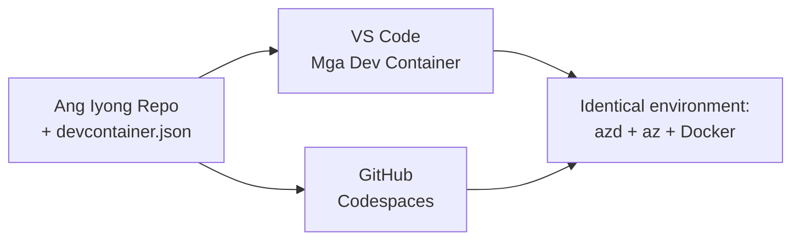

# Dev Containers & GitHub Codespaces para sa azd

**Pag-navigate sa Kabanata:**
- **📚 Tahanan ng Kurso**: [AZD Para sa mga Baguhan](../../README.md)
- **📖 Kasalukuyang Kabanata**: Kabanata 1 - Pundasyon at Mabilis na Pagsisimula
- **⬅️ Nakaraang Kabanata**: [Magdala ng Sariling App](bring-your-own-app.md)
- **🚀 Susunod na Kabanata**: [Kabanata 2: AI-First Development](../chapter-02-ai-development/README.md)

> Napatunayan gamit ang `azd 1.27.1` noong Hulyo 2026.

## Panimula

Ang pag-install ng azd, tamang language runtime, Docker, at Azure CLI sa bawat makina ay isang abala—at ito ang pangunahing dahilan kung bakit nagkakamali ang tutorial na "gumagana sa aking makina" para sa iba. Ang isang **dev container** ay naglutas nito sa pamamagitan ng paglarawan ng iyong buong toolchain sa isang file. Sinumang magbukas ng proyekto sa VS Code o GitHub Codespaces ay makakakuha ng eksaktong parehong kapaligiran, na may azd na naka-install na. Ipinapakita ng araling ito kung paano magdagdag ng isa.

## Mga Layunin ng Pagkatuto

Sa pagtatapos ng araling ito, makakagawa ka ng:
- Maunawaan kung ano ang dev container at bakit ito nakakatulong sa azd
- Magdagdag ng isang minimal na `.devcontainer/devcontainer.json` sa isang proyekto
- Isama ang azd, Azure CLI, at Docker gamit ang mga Dev Container *features*
- Buksan ang proyekto sa GitHub Codespaces o VS Code

## Mga Kinalabasan ng Pagkatuto

Matapos matapos ang araling ito, magagawa mo nang:
- Gumawa ng isang `devcontainer.json` para sa proyekto ng azd
- Magdagdag ng azd at mga tooling ng Azure nang walang manu-manong pag-install
- Patakbuhin ang `azd up` mula sa loob ng container o Codespace

---

## Ano ang Dev Container?

Ang dev container ay isang Docker-based na kapaligiran ng pag-develop na tinukoy ng `.devcontainer/devcontainer.json` na file sa iyong repositoryo. Kapag binuksan mo ang proyekto:

- **VS Code** (kasama ang Dev Containers extension) ay gagawa ng container at iko-connect dito.
- **GitHub Codespaces** ay gagawa ng parehong container sa cloud at bibigyan ka ng editor na naka-browser.

Sa alinmang paraan, bawat kontribyutor ay magkakaroon ng magkaparehong mga tool—wala nang "na-install mo ba ang azd?" na troubleshooting.



---

## Hakbang 1: Gumawa ng devcontainer File

Gumawa ng `.devcontainer/devcontainer.json` sa root ng iyong proyekto:

```json
{
  "name": "azd-project",
  "image": "mcr.microsoft.com/devcontainers/base:bookworm",
  "features": {
    "ghcr.io/devcontainers/features/azure-cli:1": {},
    "ghcr.io/azure/azure-dev/azd:latest": {},
    "ghcr.io/devcontainers/features/docker-in-docker:2": {},
    "ghcr.io/devcontainers/features/node:1": {}
  },
  "customizations": {
    "vscode": {
      "extensions": [
        "ms-azuretools.azure-dev",
        "ms-azuretools.vscode-bicep"
      ]
    }
  },
  "forwardPorts": [3000],
  "postCreateCommand": "azd version"
}
```

Ang ginagawa ng bawat bahagi:

| Susi | Layunin |
|-----|---------|
| `image` | Ang base OS para sa container |
| `features` | Prebuilt installers—dito: Azure CLI, **azd**, Docker, at Node.js |
| `customizations.vscode.extensions` | Awtomatikong nag-i-install ng azd at Bicep VS Code extensions |
| `forwardPorts` | Inilalantad ang port ng iyong app sa browser |
| `postCreateCommand` | Isinasagawa matapos mabuo ang container (dito, sanity check) |

> Ang `ghcr.io/azure/azure-dev/azd:latest` feature ay ang opisyal na paraan para makuha ang azd sa loob ng container. I-pin ang isang partikular na bersyon (hal. `azd:1.27.1`) kung kailangan ang reproducibility.

---

## Hakbang 2: Itugma ang Feature sa Wika ng Iyong App

Palitan ang `node` feature ng anumang wika ang iyong app ay gamit:

```jsonc
// Python project
"ghcr.io/devcontainers/features/python:1": {},

// .NET project
"ghcr.io/devcontainers/features/dotnet:2": {},

// Java project
"ghcr.io/devcontainers/features/java:1": {},

// Go project
"ghcr.io/devcontainers/features/go:1": {}
```

Panatilihin ang `docker-in-docker` kung ang `host` mo ay `containerapp`, `aks`, o anumang gumagawa ng container image—kailangan ng azd ang Docker para gumawa at mag-push ng mga imahe.

---

## Hakbang 3: Buksan Ito

**Sa VS Code:**
1. I-install ang **Dev Containers** na extension.
2. Buksan ang folder ng proyekto.
3. I-click ang **Reopen in Container** kapag lumabas (o patakbuhin ang *Dev Containers: Reopen in Container*).

**Sa GitHub Codespaces:**
1. I-push ang repo sa GitHub.
2. I-click ang **Code → Codespaces → Create codespace on main**.
3. Maghintay para mabuo ang container—handa na ang azd sa terminal.

---

## Hakbang 4: Mag-deploy Mula sa Loob ng Container

May naka-preinstall na azd ang container, kaya ang normal na workflow ay gumagana lang:

```bash
azd auth login --use-device-code   # Ang device code ay kapaki-pakinabang sa loob ng Codespaces
azd up
```

> **Bakit `--use-device-code`?** Sa remote container o Codespace wala kang lokal na browser para i-redirect, kaya ang device-code login ang maaasahang paraan. Ikaw ay magpa-paste ng code sa tab ng browser upang matapos ang pag-sign in.

---

## Mga Karaniwang Pakikibaka

| Pakikibaka | Solusyon |
|---------|-----|
| `azd up` ay hindi makakagawa ng imahe | Magdagdag ng `docker-in-docker` feature |
| Naghihintay ang browser login sa Codespaces | Gamitin ang `azd auth login --use-device-code` |
| Iba ang mga tools sa pagitan ng mga teammates | Mag-pin ng mga bersyon ng feature (hal. `azd:1.27.1`) |
| Hindi maabot ang app sa browser | Idagdag ang port sa `forwardPorts` |

---

## Buod

- Ang dev container ay gumagawa ng iyong azd toolchain na reproducible para sa lahat.
- Magdagdag ng azd, Azure CLI, at Docker sa pamamagitan ng Dev Container *features*.
- Itugma ang language feature sa iyong app at panatilihin ang `docker-in-docker` para sa mga container host.
- Gamitin ang device-code login kapag tumatakbo sa loob ng Codespaces.

---

## 🔗 Pag-navigate

| Direksyon | Mapagkukunan |
|-----------|----------|
| **Nakaraan** | [Magdala ng Sariling App](bring-your-own-app.md) |
| **Tahanan ng Kabanata** | [Kabanata 1: Pundasyon at Mabilis na Pagsisimula](README.md) |
| **Susunod na Kabanata** | [Kabanata 2: AI-First Development](../chapter-02-ai-development/README.md) |

## 📖 Mga Kaugnay na Mapagkukunan

- [Pag-install at Setup](installation.md)
- [Command Cheat Sheet](../../resources/cheat-sheet.md)
- [Opisyal na Dev Containers specification](https://containers.dev/)
- [azd Dev Container feature](https://github.com/Azure/azure-dev/tree/main/ext/devcontainer)

---

<!-- CO-OP TRANSLATOR DISCLAIMER START -->
**Pagtatanggi**:
Ang dokumentong ito ay isinalin gamit ang serbisyo ng AI translation na [Co-op Translator](https://github.com/Azure/co-op-translator). Bagama't nagsusumikap kami para sa katumpakan, pakatandaan na ang awtomatikong pagsasalin ay maaaring maglaman ng mga pagkakamali o hindi pagkakatugma. Ang orihinal na dokumento sa orihinal nitong wika ang dapat ituring na pangunahing sanggunian. Para sa mahahalagang impormasyon, inirerekomenda ang propesyonal na pagsasalin ng tao. Hindi kami mananagot sa anumang maling pagkakaintindi o maling interpretasyon na nagmula sa paggamit ng pagsasaling ito.
<!-- CO-OP TRANSLATOR DISCLAIMER END -->