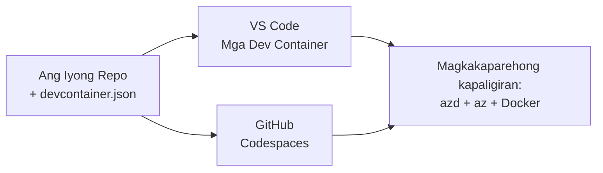

# Dev Containers & GitHub Codespaces para sa azd

**Pag-navigate ng Kabanata:**
- **📚 Tahanan ng Kurso**: [AZD Para sa mga Nagsisimula](../../README.md)
- **📖 Kasalukuyang Kabanata**: Kabanata 1 - Foundation & Quick Start
- **⬅️ Nakaraan**: [Magdala ng Sariling App](bring-your-own-app.md)
- **🚀 Susunod na Kabanata**: [Kabanata 2: Pag-unlad na Pinaprayoridad ang AI](../chapter-02-ai-development/README.md)

> Napatunayan laban sa `azd 1.25.6` noong Hunyo 2026.

## Panimula

Ang pag-install ng azd, ng tamang language runtime, Docker, at ang Azure CLI sa bawat makina ay nakakapagod—at ito ang pangunahing dahilan kung bakit ang tutorial na "gumagana sa makina ko" ay pumapalya para sa iba. Nilulutas ng **dev container** ito sa pamamagitan ng paglalarawan ng buong toolchain mo sa isang file. Sinumang magbubukas ng proyekto sa VS Code o GitHub Codespaces ay makakakuha ng eksaktong kaparehong kapaligiran, na may azd na naka-install na. Ipinapakita ng leksyon na ito kung paano magdagdag ng isa.

## Mga Layunin ng Pagkatuto

Sa pagtatapos ng leksyon na ito, ikaw ay:
- Maunawaan kung ano ang dev container at bakit ito nakakatulong sa azd
- Magdagdag ng minimal na `.devcontainer/devcontainer.json` sa isang proyekto
- Isama ang azd, ang Azure CLI, at Docker gamit ang Dev Container *mga tampok*
- Buksan ang proyekto sa GitHub Codespaces o VS Code

## Mga Kinalabasan ng Pagkatuto

Pagkatapos makumpleto ang leksyon na ito, magagawa mo:
- Gumawa ng `devcontainer.json` para sa isang proyektong azd
- Magdagdag ng azd at tooling ng Azure nang hindi manu-manong nag-i-install
- Patakbuhin ang `azd up` mula sa loob ng container o Codespace

---

## Ano ang Dev Container?

Ang dev container ay isang Docker-based na development environment na tinukoy ng isang `.devcontainer/devcontainer.json` file sa iyong repository. Kapag binuksan mo ang proyekto:

- **VS Code** (na may Dev Containers extension) binubuo ang container at nakakabit dito.
- **GitHub Codespaces** binubuo ang parehong container sa cloud at nagbibigay sa iyo ng editor sa browser.

Sa alinmang paraan, lahat ng kontribyutor ay nakakakuha ng magkakaparehong mga tool—wala nang "na-install mo ba ang azd?" na troubleshooting.



---

## Hakbang 1: Lumikha ng file ng devcontainer

Gumawa ng `.devcontainer/devcontainer.json` sa root ng iyong proyekto:

```json
{
  "name": "azd-project",
  "image": "mcr.microsoft.com/devcontainers/base:bookworm",
  "features": {
    "ghcr.io/devcontainers/features/azure-cli:1": {},
    "ghcr.io/azure/azure-dev/azd:latest": {},
    "ghcr.io/devcontainers/features/docker-in-docker:2": {},
    "ghcr.io/devcontainers/features/node:1": {}
  },
  "customizations": {
    "vscode": {
      "extensions": [
        "ms-azuretools.azure-dev",
        "ms-azuretools.vscode-bicep"
      ]
    }
  },
  "forwardPorts": [3000],
  "postCreateCommand": "azd version"
}
```

Ano ang ginagawa ng bawat bahagi:

| Susi | Layunin |
|-----|---------|
| `image` | Ang base OS para sa container |
| `features` | Mga prebuilt na installer—dito: Azure CLI, **azd**, Docker, at Node.js |
| `customizations.vscode.extensions` | Awtomatikong ini-install ang azd at Bicep na extension ng VS Code |
| `forwardPorts` | Ginagawa na maa-access sa browser ang port ng iyong app |
| `postCreateCommand` | Tumakbo nang isang beses pagkatapos mabuo ang container (dito, isang sanity check) |

> Ang `ghcr.io/azure/azure-dev/azd:latest` na tampok ay ang opisyal na paraan para makuha ang azd sa isang container. I-pin ang isang partikular na bersyon (halimbawa `azd:1.25.6`) kung kailangan mo ng reproducibility.

---

## Hakbang 2: Itugma ang tampok sa wika ng iyong app

Palitan ang `node` na tampok ng kung ano man ang ginagamit ng iyong app:

```jsonc
// Python project
"ghcr.io/devcontainers/features/python:1": {},

// .NET project
"ghcr.io/devcontainers/features/dotnet:2": {},

// Java project
"ghcr.io/devcontainers/features/java:1": {},

// Go project
"ghcr.io/devcontainers/features/go:1": {}
```

Panatilihin ang `docker-in-docker` kung ang iyong `host` ay `containerapp`, `aks`, o anumang bagay na nagbuo ng imahe ng container—kailangan ng azd ang Docker para bumuo at mag-push ng mga imahe.

---

## Hakbang 3: Buksan Ito

**Sa VS Code:**
1. I-install ang **Dev Containers** extension.
2. Buksan ang folder ng proyekto.
3. I-click ang **Reopen in Container** kapag may prompt (o patakbuhin ang *Dev Containers: Reopen in Container*).

**Sa GitHub Codespaces:**
1. I-push ang repo sa GitHub.
2. I-click ang **Code → Codespaces → Create codespace on main**.
3. Maghintay na mabuo ang container—handa na ang azd sa terminal.

---

## Hakbang 4: Mag-deploy Mula sa Loob ng Container

May azd na naka-preinstall sa container, kaya gumagana lang ang normal na workflow:

```bash
azd auth login --use-device-code   # kapaki-pakinabang ang device code sa loob ng Codespaces
azd up
```

> **Bakit `--use-device-code`?** Sa isang remote na container o Codespace walang lokal na browser na puwedeng i-redirect, kaya ang device-code na pag-login ang maasahang paraan. Ipipaste mo ang isang code sa isang tab ng browser para kumpletuhin ang pag-sign in.

---

## Karaniwang mga Patibong

| Patibong | Solusyon |
|---------|-----|
| `azd up` can't build an image | Magdagdag ng `docker-in-docker` na tampok |
| Browser login hangs in Codespaces | Gamitin ang `azd auth login --use-device-code` |
| Tools differ between teammates | I-pin ang mga bersyon ng tampok (hal. `azd:1.25.6`) |
| App not reachable in browser | Idagdag ang port sa `forwardPorts` |

---

## Buod

- Ginagawang reproducible ng dev container ang iyong azd toolchain para sa lahat.
- Idagdag ang azd, ang Azure CLI, at Docker sa pamamagitan ng mga *tampok* ng Dev Container.
- Itugma ang tampok ng wika sa iyong app at panatilihin ang `docker-in-docker` para sa mga container host.
- Gumamit ng device-code na pag-login kapag nagpapatakbo sa loob ng Codespaces.

---

## 🔗 Pag-navigate

| Direksyon | Mapagkukunan |
|-----------|----------|
| **Nakaraan** | [Magdala ng Sariling App](bring-your-own-app.md) |
| **Tahanan ng Kabanata** | [Kabanata 1: Pundasyon at Mabilis na Panimula](README.md) |
| **Susunod na Kabanata** | [Kabanata 2: Pag-unlad na Pinaprayoridad ang AI](../chapter-02-ai-development/README.md) |

## 📖 Mga Kaugnay na Mapagkukunan

- [Pag-install at Setup](installation.md)
- [Cheat Sheet ng Mga Utos](../../resources/cheat-sheet.md)
- [Opisyal na espesipikasyon ng Dev Containers](https://containers.dev/)
- [Tampok na Dev Container ng azd](https://github.com/Azure/azure-dev/tree/main/ext/devcontainer)

---

<!-- CO-OP TRANSLATOR DISCLAIMER START -->
**Pagtatanggi**:
Ang dokumentong ito ay isinalin gamit ang serbisyo ng AI translation na [Co-op Translator](https://github.com/Azure/co-op-translator). Bagama't nagsusumikap kami para sa katumpakan, pakatandaan na ang awtomatikong pagsasalin ay maaaring maglaman ng mga pagkakamali o hindi pagkakatugma. Ang orihinal na dokumento sa orihinal nitong wika ang dapat ituring na pangunahing sanggunian. Para sa mahahalagang impormasyon, inirerekomenda ang propesyonal na pagsasalin ng tao. Hindi kami mananagot sa anumang maling pagkakaintindi o maling interpretasyon na nagmula sa paggamit ng pagsasaling ito.
<!-- CO-OP TRANSLATOR DISCLAIMER END -->