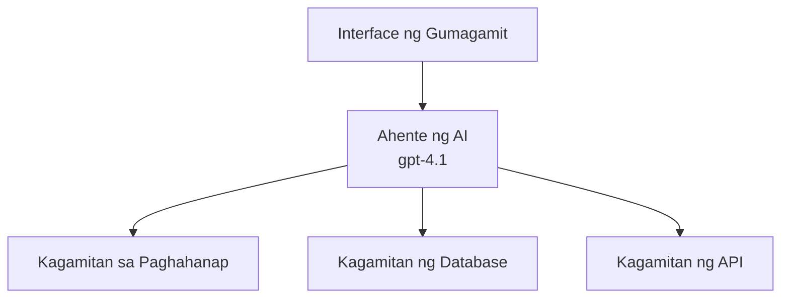
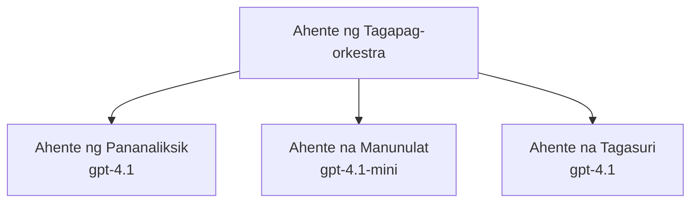

# Mga Ahente ng AI gamit ang Azure Developer CLI

**Pag-navigate ng Kabanata:**
- **📚 Tahanan ng Kurso**: [AZD Para sa Mga Baguhan](../../README.md)
- **📖 Kasalukuyang Kabanata**: Kabanata 2 - Pag-unlad na Inuuna ang AI
- **⬅️ Nakaraan**: [Integrasyon ng Microsoft Foundry](microsoft-foundry-integration.md)
- **➡️ Susunod**: [Pag-deploy ng Modelong AI](ai-model-deployment.md)
- **🚀 Mas Advanced**: [Mga Solusyon na Multi-Ahente](../../examples/retail-scenario.md)

---

## Panimula

Ang mga ahente ng AI ay mga awtonomong programa na maaaring maramdaman ang kanilang kapaligiran, gumawa ng mga desisyon, at magsagawa ng mga aksyon upang makamit ang mga tiyak na layunin. Hindi tulad ng mga simpleng chatbot na tumutugon sa mga prompt, ang mga ahente ay maaaring:

- **Gumamit ng mga tool** - Tumawag ng APIs, maghanap sa mga database, magpatakbo ng code
- **Magplano at mag-analisa** - Hatiin ang kumplikadong mga gawain sa mga hakbang
- **Matuto mula sa konteksto** - Panatilihin ang memorya at iangkop ang pag-uugali
- **Makipagtulungan** - Makipagtrabaho sa ibang mga ahente (mga sistema ng maramihang ahente)

Ipinapakita ng gabay na ito kung paano i-deploy ang mga ahente ng AI sa Azure gamit ang Azure Developer CLI (azd).

> **Tala sa pagpapatunay (2026-03-25):** Sinuri ang gabay na ito laban sa `azd` `1.23.12` at `azure.ai.agents` `0.1.18-preview`. Ang karanasan ng `azd ai` ay nasa preview pa rin, kaya tingnan ang help ng extension kung iba ang mga flag na naka-install mo.

## Mga Layunin sa Pagkatuto

Sa pagkompleto ng gabay na ito, ikaw ay:
- Mauunawaan kung ano ang mga ahente ng AI at paano ito naiiba sa mga chatbot
- Makakapag-deploy ng mga paunang-gawang template ng ahente ng AI gamit ang AZD
- Makakapag-configure ng Foundry Agents para sa mga pasadyang ahente
- Makakapagpatupad ng mga basic na pattern ng ahente (paggamit ng tool, RAG, multi-agent)
- Makakasubaybay at makaka-debug ng mga na-deploy na ahente

## Mga Kinalabasan ng Pagkatuto

Sa pagtatapos, magagawa mong:
- Mag-deploy ng mga aplikasyon ng ahente ng AI sa Azure gamit ang isang utos
- I-configure ang mga tool at kakayahan ng ahente
- Ipatupad ang retrieval-augmented generation (RAG) gamit ang mga ahente
- Disenyuhin ang mga arkitekturang multi-ahente para sa komplikadong mga workflow
- Ayusin ang mga karaniwang suliranin sa pag-deploy ng ahente

---

## 🤖 Ano ang Kaibahan ng Ahente sa Isang Chatbot?

| Tampok | Chatbot | Ahente ng AI |
|---------|---------|----------|
| **Pag-uugali** | Tumutugon sa mga prompt | Gumagawa ng awtonomong aksyon |
| **Mga Tool** | Wala | Maaaring tumawag ng APIs, maghanap, magpatakbo ng code |
| **Memorya** | Nakabatay lamang sa sesyon | Permanenteng memorya sa pagitan ng mga sesyon |
| **Pagpaplano** | Isang tugon | Maramihang-hakbang na pangangatwiran |
| **Pakikipagtulungan** | Isang entidad | Maaaring makipagtulungan sa ibang mga ahente |

### Simpleng Analohiya

- **Chatbot** = Isang matulunging tao na sumasagot ng mga tanong sa isang mesa ng impormasyon
- **Ahente ng AI** = Isang personal na katulong na maaaring tumawag, mag-iskedyul ng mga appointment, at kumpletuhin ang mga gawain para sa iyo

---

## 🚀 Mabilis na Simula: I-deploy ang Iyong Unang Ahente

### Opsyon 1: Template ng Foundry Agents (Inirerekomenda)

```bash
# I-initialize ang template ng mga AI agent
azd init --template get-started-with-ai-agents

# I-deploy sa Azure
azd up
```

**Mga ide-deploy:**
- ✅ Foundry Agents
- ✅ Microsoft Foundry Models (gpt-4.1)
- ✅ Azure AI Search (for RAG)
- ✅ Azure Container Apps (web interface)
- ✅ Application Insights (monitoring)

**Oras:** ~15-20 minuto
**Gastos:** ~$100-150/buwan (pag-unlad)

### Opsyon 2: OpenAI Agent gamit ang Prompty

```bash
# I-initialize ang template ng agent na batay sa Prompty
azd init --template agent-openai-python-prompty

# I-deploy sa Azure
azd up
```

**Mga ide-deploy:**
- ✅ Azure Functions (walang-server na pagpapatakbo ng ahente)
- ✅ Microsoft Foundry Models
- ✅ Mga file ng configuration ng Prompty
- ✅ Halimbawang implementasyon ng ahente

**Oras:** ~10-15 minuto
**Gastos:** ~$50-100/buwan (pag-unlad)

### Opsyon 3: RAG Chat Agent

```bash
# I-initialize ang template ng RAG chat
azd init --template azure-search-openai-demo

# I-deploy sa Azure
azd up
```

**Mga ide-deploy:**
- ✅ Microsoft Foundry Models
- ✅ Azure AI Search na may halimbawang data
- ✅ Pipeline ng pagproseso ng dokumento
- ✅ Chat interface na may mga citation

**Oras:** ~15-25 minuto
**Gastos:** ~$80-150/buwan (pag-unlad)

### Opsyon 4: AZD AI Agent Init (Preview na Batay sa Manifest o Template)

Kung mayroon kang agent manifest file, maaari mong gamitin ang `azd ai` na utos upang i-scaffold nang direkta ang isang Foundry Agent Service project. Nagdagdag din ang mga kamakailang preview release ng suporta para sa template-based initialization, kaya ang eksaktong daloy ng prompt ay maaaring bahagyang mag-iba depende sa bersyon ng extension na naka-install mo.

```bash
# I-install ang extension ng AI agents
azd extension install azure.ai.agents

# Opsyonal: suriin ang naka-install na preview na bersyon
azd extension show azure.ai.agents

# I-initialize mula sa manifest ng agent
azd ai agent init -m agent-manifest.yaml

# I-deploy sa Azure
azd up

# Subukan ang na-deploy na agent (ipinapakita ang latency at oras hanggang unang byte)
azd ai agent invoke
```

**Kailan gagamitin ang `azd ai agent init` vs `azd init --template`:**

| Paraan | Pinakamainam Para sa | Paano Ito Gumagana |
|----------|----------|------|
| `azd init --template` | Nagsisimula mula sa gumaganang sample app | Kinokopya ang buong template na repo na may code + infra |
| `azd ai agent init -m` | Pagtatayo mula sa sariling agent manifest | Gumagawa ng istruktura ng proyekto mula sa iyong paglalarawan ng ahente |

> **Tip:** Gamitin ang `azd init --template` kapag nag-aaral (Mga Opsyon 1-3 sa itaas). Gamitin ang `azd ai agent init` kapag nagbuo ng mga production agent gamit ang iyong sariling mga manifest.

Pagkatapos ng `azd up`, dinadala ka ng parehong extension sa natitirang bahagi ng agent lifecycle: `azd ai agent invoke` para subukan, `azd ai agent eval generate` at `azd ai agent optimize` para sukatin at pagandahin ang kalidad, at `azd ai agent delete` para linisin. Tingnan ang [Mga Command ng AZD AI CLI](../chapter-08-production/production-ai-practices.md#azd-ai-cli-commands-and-extensions) para sa buong sanggunian.

---

## 🏗️ Mga Pattern ng Arkitektura ng Ahente

### Pattern 1: Isang Ahente na may Mga Tool

Ang pinakasimpleng pattern ng ahente - isang ahente na maaaring gumamit ng maraming tool.



**Pinakamainam para sa:**
- Mga bot para sa suporta sa customer
- Mga assistant sa pananaliksik
- Mga ahente sa pagsusuri ng data

**AZD Template:** `azure-search-openai-demo`

### Pattern 2: RAG Agent (Retrieval-Augmented Generation)

Isang ahente na kumukuha ng mga kaugnay na dokumento bago bumuo ng mga tugon.

```mermaid
graph TD
    Query[Tanong ng Gumagamit] --> RAG[Ahente ng RAG]
    RAG --> Vector[Paghahanap ng Vector]
    RAG --> LLM[Malaking Modelong Wika (LLM)<br/>gpt-4.1]
    Vector -- Mga Dokumento --> LLM
    LLM --> Response[Tugon na may Mga Sipi]
```

**Pinakamainam para sa:**
- Enterprise knowledge bases
- Mga systema ng FAQ/Q&A sa dokumento
- Pagsasaliksik sa compliance at legal

**AZD Template:** `azure-search-openai-demo`

### Pattern 3: Sistema ng Multi-Ahente

Maraming mga espesyal na ahente na nagtutulungan sa mga kumplikadong gawain.



**Pinakamainam para sa:**
- Komplikadong pagbuo ng nilalaman
- Mga multi-step na workflow
- Mga gawain na nangangailangan ng iba't ibang espesyalisasyon

**Matuto Pa:** [Mga Pattern ng Koordinasyon ng Multi-Ahente](../chapter-06-pre-deployment/coordination-patterns.md)

---

## ⚙️ Pag-configure ng Mga Tool ng Ahente

Nagiging makapangyarihan ang mga ahente kapag maaari silang gumamit ng mga tool. Narito kung paano i-configure ang mga karaniwang tool:

### Konfigurasyon ng Tool sa Foundry Agents

```python
# agent_config.py
from azure.ai.projects import AIProjectClient
from azure.ai.projects.models import FunctionTool, CodeInterpreterTool

# Tukuyin ang mga pasadyang tool
search_tool = FunctionTool(
    name="search_knowledge_base",
    description="Search the company knowledge base for relevant documents",
    parameters={
        "type": "object",
        "properties": {
            "query": {
                "type": "string",
                "description": "The search query"
            }
        },
        "required": ["query"]
    }
)

# Lumikha ng ahente gamit ang mga tool
agent = project_client.agents.create_agent(
    model="gpt-4.1",
    name="Support Agent",
    instructions="You are a helpful support agent. Use the search tool to find relevant information.",
    tools=[search_tool, CodeInterpreterTool()]
)
```

### Konfigurasyon ng Kapaligiran

```bash
# Itakda ang mga environment variable na partikular sa agent
azd env set AZURE_OPENAI_MODEL "gpt-4.1"
azd env set AGENT_INSTRUCTIONS "You are a helpful assistant..."
azd env set ENABLE_CODE_INTERPRETER "true"
azd env set ENABLE_FILE_SEARCH "true"

# I-deploy gamit ang na-update na konfigurasyon
azd deploy
```

---

## 📊 Pagsubaybay sa mga Ahente

### Integrasyon ng Application Insights

Lahat ng AZD agent template ay kasama ang Application Insights para sa pagsubaybay:

```bash
# Buksan ang dashboard ng pagsubaybay
azd monitor --overview

# Tingnan ang mga log nang real-time
azd monitor --logs

# Tingnan ang mga sukatan nang real-time
azd monitor --live
```

### Mga Pangunahing Metric na Subaybayan

| Metric | Paglalarawan | Target |
|--------|-------------|--------|
| Antala ng Tugon | Oras upang makabuo ng tugon | < 5 seconds |
| Paggamit ng Token | Mga token bawat request | Subaybayan para sa gastos |
| Tasa ng Tagumpay ng Tawag sa Tool | % ng matagumpay na pagpapatupad ng tool | > 95% |
| Tasa ng Error | Nabigong mga request ng ahente | < 1% |
| Kasiyahan ng Gumagamit | Mga iskor ng feedback | > 4.0/5.0 |

### Pasadyang Pag-log para sa mga Ahente

```python
import os
from azure.monitor.opentelemetry import configure_azure_monitor
from opentelemetry import trace

# I-configure ang Azure Monitor gamit ang OpenTelemetry
configure_azure_monitor(
    connection_string=os.environ["APPLICATIONINSIGHTS_CONNECTION_STRING"]
)

tracer = trace.get_tracer(__name__)

def log_agent_interaction(user_query, agent_response, tools_used, latency_ms):
    with tracer.start_as_current_span("agent_interaction") as span:
        span.set_attributes({
            "user_query": user_query,
            "response_length": len(agent_response),
            "tools_used": tools_used,
            "latency_ms": latency_ms
        })
```

> **Tala:** I-install ang kinakailangang mga package: `pip install azure-monitor-opentelemetry opentelemetry`

---

## 💰 Mga Pagsasaalang-alang sa Gastos

### Tinatayang Buwanang Gastos ayon sa Pattern

| Pattern | Dev Environment | Production |
|---------|-----------------|------------|
| Single Agent | $50-100 | $200-500 |
| RAG Agent | $80-150 | $300-800 |
| Multi-Agent (2-3 agents) | $150-300 | $500-1,500 |
| Enterprise Multi-Agent | $300-500 | $1,500-5,000+ |

### Mga Tip sa Pag-optimize ng Gastos

1. **Gamitin ang gpt-4.1-mini para sa simpleng mga gawain**
   ```bash
   azd env set AZURE_OPENAI_MODEL "gpt-4.1-mini"
   ```

2. **Mag-implementa ng caching para sa paulit-ulit na mga query**
   ```python
   from functools import lru_cache
   
   @lru_cache(maxsize=1000)
   def get_cached_response(query_hash):
       return agent.run(query_hash)
   ```

3. **Itakda ang limitasyon ng token kada run**
   ```python
   # Itakda ang max_completion_tokens kapag pinapatakbo ang agent, hindi habang nililikha
   run = project_client.agents.create_run(
       thread_id=thread.id,
       agent_id=agent.id,
       max_completion_tokens=1000  # Limitahan ang haba ng tugon
   )
   ```

4. **I-scale sa zero kapag hindi ginagamit**
   ```bash
   # Ang Container Apps ay awtomatikong nag-scale hanggang zero.
   azd env set MIN_REPLICAS "0"
   ```

---

## 🔧 Pag-troubleshoot ng mga Ahente

### Mga Karaniwang Isyu at Solusyon

<details>
<summary><strong>❌ Hindi tumutugon ang ahente sa mga tawag sa tool</strong></summary>

```bash
# Suriin kung maayos na nakarehistro ang mga tool
azd show

# Tiyakin ang deployment ng OpenAI
az cognitiveservices account deployment list \
  --name $AZURE_OPENAI_NAME \
  --resource-group $RG_NAME

# Suriin ang mga log ng ahente
azd monitor --logs
```

**Mga karaniwang sanhi:**
- Hindi tugma ang signature ng function ng tool
- Nawawala ang kinakailangang mga pahintulot
- Hindi maa-access ang API endpoint
</details>

<details>
<summary><strong>❌ Mataas na antala sa mga tugon ng ahente</strong></summary>

```bash
# Suriin ang Application Insights para sa mga bottleneck
azd monitor --live

# Isaalang-alang ang paggamit ng mas mabilis na modelo
azd env set AZURE_OPENAI_MODEL "gpt-4.1-mini"
azd deploy
```

**Mga tip sa pag-optimize:**
- Gumamit ng streaming na mga tugon
- Mag-implementa ng response caching
- Bawasan ang laki ng context window
</details>

<details>
<summary><strong>❌ Nagbabalik ang ahente ng maling o 'hallucinated' na impormasyon</strong></summary>

```python
# Pagbutihin gamit ang mas mahusay na mga prompt ng sistema
instructions = """
You are a helpful assistant. IMPORTANT:
- Only answer based on provided context
- If you don't know, say "I don't know"
- Always cite your sources
- Never make up information
"""

# Magdagdag ng mekanismo ng pagkuha ng impormasyon para sa pagbibigay-batay
agent = project_client.agents.create_agent(
    model="gpt-4.1",
    instructions=instructions,
    tools=[FileSearchTool()]  # I-base ang mga sagot sa mga dokumento
)
```
</details>

<details>
<summary><strong>❌ Mga error na lumampas sa limitasyon ng token</strong></summary>

```python
# Ipatupad ang pamamahala ng bintana ng konteksto
def truncate_context(messages, max_tokens=8000, model="gpt-4.1"):
    """Keep only recent messages within token limit."""
    import tiktoken
    encoding = tiktoken.encoding_for_model(model)
    total_tokens = 0
    truncated = []
    
    for msg in reversed(messages):
        msg_tokens = len(encoding.encode(msg.content))
        if total_tokens + msg_tokens > max_tokens:
            break
        truncated.insert(0, msg)
        total_tokens += msg_tokens
    
    return truncated
```
</details>

---

## 🎓 Mga Hands-On na Ehersisyo

### Ehersisyo 1: I-deploy ang Isang Pangunahing Ahente (20 minuto)

**Layunin:** I-deploy ang iyong unang ahente ng AI gamit ang AZD

```bash
# Hakbang 1: I-initialize ang template
azd init --template get-started-with-ai-agents

# Hakbang 2: Mag-login sa Azure
azd auth login
# Kung gumagana ka sa iba't ibang mga tenant, idagdag ang --tenant-id <tenant-id>

# Hakbang 3: I-deploy
azd up

# Hakbang 4: Subukan ang ahente
# Inaasahang output pagkatapos ng pag-deploy:
#   Tapos na ang deployment!
#   Endpoint: https://<app-name>.<region>.azurecontainerapps.io
# Buksan ang URL na ipinakita sa output at subukang magtanong

# Hakbang 5: Tingnan ang pagmamanman
azd monitor --overview

# Hakbang 6: Linisin
azd down --force --purge
```

**Kriterya ng Tagumpay:**
- [ ] Tumutugon ang ahente sa mga tanong
- [ ] Maaaring ma-access ang monitoring dashboard sa pamamagitan ng `azd monitor`
- [ ] Matagumpay na nalinis ang mga resources

### Ehersisyo 2: Magdagdag ng Pasadyang Tool (30 minuto)

**Layunin:** Palawakin ang ahente gamit ang isang pasadyang tool

1. I-deploy ang agent template:
   ```bash
   azd init --template get-started-with-ai-agents
   azd up
   ```
2. Lumikha ng bagong tool function sa iyong agent code:
   ```python
   def get_weather(location: str) -> str:
       """Get current weather for a location."""
       # API call sa serbisyo ng panahon
       return f"Weather in {location}: Sunny, 72°F"
   ```
3. Irehistro ang tool sa ahente:
   ```python
   from azure.ai.projects.models import FunctionTool

   weather_tool = FunctionTool(
       name="get_weather",
       description="Get current weather for a location",
       parameters={
           "type": "object",
           "properties": {
               "location": {"type": "string", "description": "City name"}
           },
           "required": ["location"]
       }
   )

   agent = project_client.agents.create_agent(
       model="gpt-4.1",
       name="Weather Agent",
       tools=[weather_tool]
   )
   ```
4. I-redeploy at subukan:
   ```bash
   azd deploy
   # Tanong: "Ano ang lagay ng panahon sa Seattle?"
   # Inaasahan: Tinatawag ng ahente ang get_weather("Seattle") at ibinabalik ang impormasyon ng panahon
   ```

**Kriterya ng Tagumpay:**
- [ ] Nakikilala ng ahente ang mga query na may kaugnayan sa panahon
- [ ] Tama ang pagtawag sa tool
- [ ] Kasama sa tugon ang impormasyon tungkol sa panahon

### Ehersisyo 3: Bumuo ng RAG Agent (45 minuto)

**Layunin:** Lumikha ng ahente na sumasagot sa mga tanong mula sa iyong mga dokumento

```bash
# Hakbang 1: I-deploy ang template ng RAG
azd init --template azure-search-openai-demo
azd up

# Hakbang 2: I-upload ang iyong mga dokumento
# Ilagay ang mga PDF/TXT na file sa direktoryo ng data/, pagkatapos patakbuhin:
python scripts/prepdocs.py

# Hakbang 3: Subukan gamit ang mga tanong na partikular sa domain
# Buksan ang URL ng web app mula sa output ng azd up
# Magtanong tungkol sa iyong mga in-upload na dokumento
# Dapat kasama sa mga tugon ang mga sanggunian tulad ng [doc.pdf]
```

**Kriterya ng Tagumpay:**
- [ ] Sumusagot ang ahente mula sa na-upload na mga dokumento
- [ ] Kasama sa mga tugon ang mga citation
- [ ] Walang 'hallucination' sa mga tanong na wala sa saklaw

---

## 📚 Mga Susunod na Hakbang

Ngayon na naiintindihan mo ang mga ahente ng AI, tuklasin ang mga sumusunod na advanced na paksa:

| Paksa | Paglalarawan | Link |
|-------|-------------|------|
| **Mga Sistema ng Multi-Ahente** | Bumuo ng mga sistema na may maramihang magkakatuwang na ahente | [Halimbawa ng Retail na Multi-Ahente](../../examples/retail-scenario.md) |
| **Mga Pattern ng Koordinasyon** | Matuto ng mga pattern ng orkestrasiyon at komunikasyon | [Mga Pattern ng Koordinasyon](../chapter-06-pre-deployment/coordination-patterns.md) |
| **Pag-deploy para sa Produksyon** | Pag-deploy ng ahente na handa para sa enterprise | [Mga Praktika ng AI para sa Produksyon](../chapter-08-production/production-ai-practices.md) |
| **Pagsusuri ng Ahente** | Subukan at suriin ang performance ng ahente | [Pag-troubleshoot ng AI](../chapter-07-troubleshooting/ai-troubleshooting.md) |
| **AI Workshop Lab** | Hands-on: Gawing AZD-ready ang iyong AI solution | [AI Workshop Lab](ai-workshop-lab.md) |

---

## 📖 Karagdagang mga Sanggunian

### Opisyal na Dokumentasyon
- [Microsoft Foundry Agent Service](https://learn.microsoft.com/azure/ai-services/agents/)
- [Microsoft Foundry Agent Service Quickstart](https://learn.microsoft.com/azure/ai-services/agents/quickstart)
- [Semantic Kernel Agent Framework](https://learn.microsoft.com/semantic-kernel/)

### Mga Template ng AZD para sa mga Ahente
- [Get Started with AI Agents](https://github.com/Azure-Samples/get-started-with-ai-agents)
- [Agent OpenAI Python Prompty](https://github.com/Azure-Samples/agent-openai-python-prompty)
- [Azure Search OpenAI Demo](https://github.com/Azure-Samples/azure-search-openai-demo)

### Mga Mapagkukunan ng Komunidad
- [Awesome AZD - Agent Templates](https://azure.github.io/awesome-azd/?tags=ai-agents)
- [Azure AI Discord](https://discord.gg/microsoft-azure)
- [Microsoft Foundry Discord](https://discord.gg/nTYy5BXMWG)

### Mga Kakayahan ng Ahente para sa Iyong Editor
- [**Microsoft Azure Agent Skills**](https://skills.sh/microsoft/github-copilot-for-azure) - I-install ang mga reusable na kakayahan ng AI agent para sa pag-develop sa Azure sa GitHub Copilot, Cursor, o anumang suportadong agent. Kabilang ang mga kakayahan para sa [Azure AI](https://skills.sh/microsoft/github-copilot-for-azure/azure-ai), [Microsoft Foundry](https://skills.sh/microsoft/github-copilot-for-azure/microsoft-foundry), [pag-deploy](https://skills.sh/microsoft/github-copilot-for-azure/azure-deploy), at [diagnostiko](https://skills.sh/microsoft/github-copilot-for-azure/azure-diagnostics):
  ```bash
  npx skills add microsoft/github-copilot-for-azure
  ```

---

**Pag-navigate**
- **Nakaraang Aralin**: [Integrasyon ng Microsoft Foundry](microsoft-foundry-integration.md)
- **Susunod na Aralin**: [Pag-deploy ng Modelong AI](ai-model-deployment.md)

---

<!-- CO-OP TRANSLATOR DISCLAIMER START -->
**Pagtatanggi**:
Ang dokumentong ito ay isinalin gamit ang serbisyo ng AI translation na [Co-op Translator](https://github.com/Azure/co-op-translator). Bagama't nagsusumikap kami para sa katumpakan, pakatandaan na ang awtomatikong pagsasalin ay maaaring maglaman ng mga pagkakamali o hindi pagkakatugma. Ang orihinal na dokumento sa orihinal nitong wika ang dapat ituring na pangunahing sanggunian. Para sa mahahalagang impormasyon, inirerekomenda ang propesyonal na pagsasalin ng tao. Hindi kami mananagot sa anumang maling pagkakaintindi o maling interpretasyon na nagmula sa paggamit ng pagsasaling ito.
<!-- CO-OP TRANSLATOR DISCLAIMER END -->