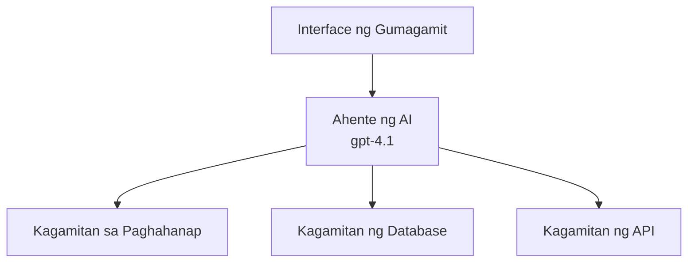
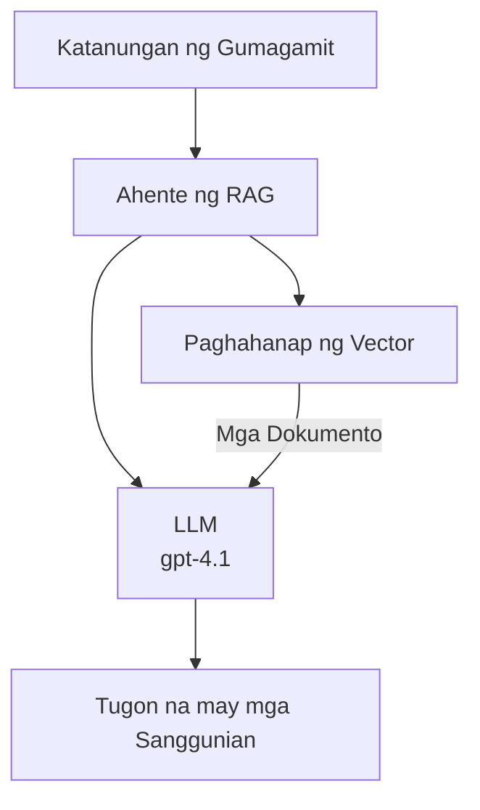
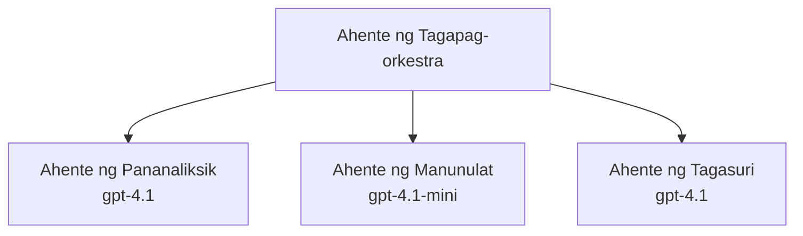

# AI Agents with Azure Developer CLI

**Chapter Navigation:**
- **📚 Course Home**: [AZD For Beginners](../../README.md)
- **📖 Current Chapter**: Chapter 2 - AI-First Development
- **⬅️ Previous**: [Microsoft Foundry Integration](microsoft-foundry-integration.md)
- **➡️ Next**: [AI Model Deployment](ai-model-deployment.md)
- **🚀 Advanced**: [Multi-Agent Solutions](../../examples/retail-scenario.md)

---

## Introduction

Ang mga AI agent ay mga awtonomong programa na kayang tumingin sa kanilang kapaligiran, gumawa ng mga desisyon, at kumilos upang makamit ang mga partikular na layunin. Hindi tulad ng mga simpleng chatbot na sumasagot lang sa mga prompt, ang mga agent ay maaaring:

- **Gumamit ng mga tool** - Tumawag ng mga API, maghanap sa mga database, magpatakbo ng code
- **Magplano at magpaliwanag** - Hatiin ang mga kumplikadong gawain sa mga hakbang
- **Matuto mula sa konteksto** - Panatilihin ang memorya at iakma ang ugali
- **Makipagtulungan** - Makipagtrabaho sa ibang mga agent (multi-agent systems)

Ipinapakita ng gabay na ito kung paano i-deploy ang mga AI agent sa Azure gamit ang Azure Developer CLI (azd).

## Learning Goals

Sa pagkumpleto ng gabay na ito, ikaw ay:
- Maiintindihan kung ano ang mga AI agent at paano sila naiiba sa mga chatbot
- Makakapag-deploy ng mga pre-built na AI agent template gamit ang AZD
- Makakapag-configure ng Foundry Agents para sa mga custom na agent
- Makakapag-implementa ng mga basic na pattern ng agent (paggamit ng tool, RAG, multi-agent)
- Makakapag-monitor at mag-debug ng mga na-deploy na agent

## Learning Outcomes

Pagkatapos makumpleto, magagawa mong:
- Mag-deploy ng AI agent applications sa Azure gamit ang isang utos
- I-configure ang mga tool at kakayahan ng agent
- Mag-implementa ng retrieval-augmented generation (RAG) kasama ang mga agent
- Mag-disenyo ng multi-agent architectures para sa mga kumplikadong workflow
- Mag-troubleshoot ng mga karaniwang isyu sa deployment ng agent

---

## 🤖 Ano ang Nagpapakaiba ng Agent mula sa Chatbot?

| Feature | Chatbot | AI Agent |
|---------|---------|----------|
| **Behavior** | Responds to prompts | Takes autonomous actions |
| **Tools** | None | Can call APIs, search, execute code |
| **Memory** | Session-based only | Persistent memory across sessions |
| **Planning** | Single response | Multi-step reasoning |
| **Collaboration** | Single entity | Can work with other agents |

### Simple Analogy

- **Chatbot** = Isang matulunging tao na sumasagot ng mga tanong sa isang information desk
- **AI Agent** = Isang personal na katulong na kayang tumawag, mag-book ng appointment, at tapusin ang mga gawain para sa iyo

---

## 🚀 Quick Start: I-deploy ang Iyong Unang Ahente

### Option 1: Foundry Agents Template (Recommended)

```bash
# Ihanda ang template para sa mga AI agent
azd init --template get-started-with-ai-agents

# I-deploy sa Azure
azd up
```

**Ano ang nade-deploy:**
- ✅ Foundry Agents
- ✅ Microsoft Foundry Models (gpt-4.1)
- ✅ Azure AI Search (for RAG)
- ✅ Azure Container Apps (web interface)
- ✅ Application Insights (monitoring)

**Oras:** ~15-20 minuto
**Gastos:** ~$100-150/buwan (development)

### Option 2: OpenAI Agent with Prompty

```bash
# I-initialize ang template ng ahente na nakabase sa Prompty
azd init --template agent-openai-python-prompty

# I-deploy sa Azure
azd up
```

**Ano ang nade-deploy:**
- ✅ Azure Functions (serverless agent execution)
- ✅ Microsoft Foundry Models
- ✅ Prompty configuration files
- ✅ Sample agent implementation

**Oras:** ~10-15 minuto
**Gastos:** ~$50-100/buwan (development)

### Option 3: RAG Chat Agent

```bash
# I-initialize ang RAG chat template
azd init --template azure-search-openai-demo

# I-deploy sa Azure
azd up
```

**Ano ang nade-deploy:**
- ✅ Microsoft Foundry Models
- ✅ Azure AI Search with sample data
- ✅ Document processing pipeline
- ✅ Chat interface with citations

**Oras:** ~15-25 minuto
**Gastos:** ~$80-150/buwan (development)

### Option 4: AZD AI Agent Init (Manifest-Based)

Kung mayroon kang agent manifest file, maaari mong gamitin ang `azd ai` command para mag-scaffold ng Foundry Agent Service project nang direkta:

```bash
# I-install ang extension para sa mga AI agent
azd extension install azure.ai.agents

# I-initialize mula sa manifest ng agent
azd ai agent init -m agent-manifest.yaml

# I-deploy sa Azure
azd up
```

**Kailan gagamitin ang `azd ai agent init` kumpara sa `azd init --template`:**

| Approach | Best For | How It Works |
|----------|----------|------|
| `azd init --template` | Starting from a working sample app | Clones a full template repo with code + infra |
| `azd ai agent init -m` | Building from your own agent manifest | Scaffolds project structure from your agent definition |

> **Tip:** Gamitin ang `azd init --template` kapag nag-aaral (Options 1-3 sa itaas). Gamitin ang `azd ai agent init` kapag nagbuo ng production agents gamit ang iyong sariling manifests. Tingnan ang [AZD AI CLI Commands](../chapter-08-production/production-ai-practices.md#azd-ai-cli-commands-and-extensions) para sa buong sanggunian.

---

## 🏗️ Mga Pattern ng Arkitektura ng Agent

### Pattern 1: Single Agent with Tools

Ang pinakasimpleng pattern ng agent - isang agent na kayang gumamit ng maraming tool.


**Pinakamainam para sa:**
- Customer support bots
- Research assistants
- Data analysis agents

**AZD Template:** `azure-search-openai-demo`

### Pattern 2: RAG Agent (Retrieval-Augmented Generation)

Isang agent na kumukuha ng mga relevant na dokumento bago bumuo ng mga tugon.


**Pinakamainam para sa:**
- Enterprise knowledge bases
- Document Q&A systems
- Compliance at legal research

**AZD Template:** `azure-search-openai-demo`

### Pattern 3: Multi-Agent System

Maramihang espesyalisadong agent na nagtutulungan para sa mga kumplikadong gawain.


**Pinakamainam para sa:**
- Kumplikadong content generation
- Multi-step workflows
- Mga gawain na nangangailangan ng iba't ibang ekspertis

**Learn More:** [Multi-Agent Coordination Patterns](../chapter-06-pre-deployment/coordination-patterns.md)

---

## ⚙️ Pag-configure ng Mga Tool ng Agent

Nagiging makapangyarihan ang mga agent kapag kayang gumamit ng mga tool. Narito kung paano i-configure ang mga karaniwang tool:

### Tool Configuration in Foundry Agents

```python
# agent_config.py
from azure.ai.projects import AIProjectClient
from azure.ai.projects.models import FunctionTool, CodeInterpreterTool

# Tukuyin ang mga pasadyang kasangkapan
search_tool = FunctionTool(
    name="search_knowledge_base",
    description="Search the company knowledge base for relevant documents",
    parameters={
        "type": "object",
        "properties": {
            "query": {
                "type": "string",
                "description": "The search query"
            }
        },
        "required": ["query"]
    }
)

# Gumawa ng ahente gamit ang mga kasangkapan
agent = project_client.agents.create_agent(
    model="gpt-4.1",
    name="Support Agent",
    instructions="You are a helpful support agent. Use the search tool to find relevant information.",
    tools=[search_tool, CodeInterpreterTool()]
)
```

### Environment Configuration

```bash
# Itakda ang mga variable ng kapaligiran na partikular sa ahente
azd env set AZURE_OPENAI_MODEL "gpt-4.1"
azd env set AGENT_INSTRUCTIONS "You are a helpful assistant..."
azd env set ENABLE_CODE_INTERPRETER "true"
azd env set ENABLE_FILE_SEARCH "true"

# I-deploy gamit ang na-update na konfigurasyon
azd deploy
```

---

## 📊 Pagmo-monitor ng Mga Agent

### Application Insights Integration

Lahat ng AZD agent templates ay may kasamang Application Insights para sa pagmo-monitor:

```bash
# Buksan ang dashboard ng pagsubaybay
azd monitor --overview

# Tingnan ang mga log nang real-time
azd monitor --logs

# Tingnan ang mga sukatan nang real-time
azd monitor --live
```

### Mahahalagang Metriko na I-monitor

| Metric | Description | Target |
|--------|-------------|--------|
| Response Latency | Time to generate response | < 5 seconds |
| Token Usage | Tokens per request | Monitor for cost |
| Tool Call Success Rate | % of successful tool executions | > 95% |
| Error Rate | Failed agent requests | < 1% |
| User Satisfaction | Feedback scores | > 4.0/5.0 |

### Custom Logging para sa Mga Agent

```python
import os
from azure.monitor.opentelemetry import configure_azure_monitor
from opentelemetry import trace

# I-configure ang Azure Monitor gamit ang OpenTelemetry
configure_azure_monitor(
    connection_string=os.environ["APPLICATIONINSIGHTS_CONNECTION_STRING"]
)

tracer = trace.get_tracer(__name__)

def log_agent_interaction(user_query, agent_response, tools_used, latency_ms):
    with tracer.start_as_current_span("agent_interaction") as span:
        span.set_attributes({
            "user_query": user_query,
            "response_length": len(agent_response),
            "tools_used": tools_used,
            "latency_ms": latency_ms
        })
```

> **Note:** I-install ang mga kinakailangang package: `pip install azure-monitor-opentelemetry opentelemetry`

---

## 💰 Mga Dapat Isaalang-alang sa Gastos

### Tinantiyang Buwanang Gastos ayon sa Pattern

| Pattern | Dev Environment | Production |
|---------|-----------------|------------|
| Single Agent | $50-100 | $200-500 |
| RAG Agent | $80-150 | $300-800 |
| Multi-Agent (2-3 agents) | $150-300 | $500-1,500 |
| Enterprise Multi-Agent | $300-500 | $1,500-5,000+ |

### Mga Tip para sa Pag-optimize ng Gastos

1. **Gamitin ang gpt-4.1-mini para sa mga simpleng gawain**
   ```bash
   azd env set AZURE_OPENAI_MODEL "gpt-4.1-mini"
   ```

2. **Mag-implementa ng caching para sa mga paulit-ulit na query**
   ```python
   from functools import lru_cache
   
   @lru_cache(maxsize=1000)
   def get_cached_response(query_hash):
       return agent.run(query_hash)
   ```

3. **Mag-set ng token limits kada run**
   ```python
   # Itakda ang max_completion_tokens kapag pinapatakbo ang agent, hindi noong paglikha
   run = project_client.agents.create_run(
       thread_id=thread.id,
       agent_id=agent.id,
       max_completion_tokens=1000  # Limitahan ang haba ng tugon
   )
   ```

4. **I-scale to zero kapag hindi ginagamit**
   ```bash
   # Awtomatikong nag-scale ang Container Apps hanggang zero
   azd env set MIN_REPLICAS "0"
   ```

---

## 🔧 Pag-troubleshoot ng Mga Agent

### Karaniwang Mga Isyu at Solusyon

<details>
<summary><strong>❌ Agent not responding to tool calls</strong></summary>

```bash
# Suriin kung maayos na nakarehistro ang mga tool
azd show

# Suriin ang deployment ng OpenAI
az cognitiveservices account deployment list \
  --name $AZURE_OPENAI_NAME \
  --resource-group $RG_NAME

# Suriin ang mga log ng ahente
azd monitor --logs
```

**Karaniwang mga dahilan:**
- Tool function signature mismatch
- Missing required permissions
- API endpoint not accessible
</details>

<details>
<summary><strong>❌ High latency in agent responses</strong></summary>

```bash
# Suriin ang Application Insights para sa mga bottleneck
azd monitor --live

# Isaalang-alang ang paggamit ng mas mabilis na modelo
azd env set AZURE_OPENAI_MODEL "gpt-4.1-mini"
azd deploy
```

**Mga tip sa pag-optimize:**
- Gumamit ng streaming responses
- Mag-implementa ng response caching
- Bawasan ang laki ng context window
</details>

<details>
<summary><strong>❌ Agent returning incorrect or hallucinated information</strong></summary>

```python
# Pagbutihin gamit ang mas mahusay na mga prompt ng sistema
instructions = """
You are a helpful assistant. IMPORTANT:
- Only answer based on provided context
- If you don't know, say "I don't know"
- Always cite your sources
- Never make up information
"""

# Magdagdag ng pagkuha para sa pagbabatayan
agent = project_client.agents.create_agent(
    model="gpt-4.1",
    instructions=instructions,
    tools=[FileSearchTool()]  # Ibatay ang mga tugon sa mga dokumento
)
```
</details>

<details>
<summary><strong>❌ Token limit exceeded errors</strong></summary>

```python
# Ipatupad ang pamamahala ng bintana ng konteksto
def truncate_context(messages, max_tokens=8000, model="gpt-4.1"):
    """Keep only recent messages within token limit."""
    import tiktoken
    encoding = tiktoken.encoding_for_model(model)
    total_tokens = 0
    truncated = []
    
    for msg in reversed(messages):
        msg_tokens = len(encoding.encode(msg.content))
        if total_tokens + msg_tokens > max_tokens:
            break
        truncated.insert(0, msg)
        total_tokens += msg_tokens
    
    return truncated
```
</details>

---

## 🎓 Hands-On Exercises

### Exercise 1: Deploy a Basic Agent (20 minutes)

**Layunin:** I-deploy ang iyong unang AI agent gamit ang AZD

```bash
# Hakbang 1: I-inisyalisa ang template
azd init --template get-started-with-ai-agents

# Hakbang 2: Mag-login sa Azure
azd auth login

# Hakbang 3: I-deploy
azd up

# Hakbang 4: Subukan ang ahente
# Inaasahang output pagkatapos ng pag-deploy:
#   Matagumpay na na-deploy!
#   Endpoint: https://<app-name>.<region>.azurecontainerapps.io
# Buksan ang URL na ipinakita sa output at subukang magtanong.

# Hakbang 5: Tingnan ang pagmamanman
azd monitor --overview

# Hakbang 6: Linisin
azd down --force --purge
```

**Success Criteria:**
- [ ] Agent responds to questions
- [ ] Can access monitoring dashboard via `azd monitor`
- [ ] Resources cleaned up successfully

### Exercise 2: Add a Custom Tool (30 minutes)

**Layunin:** Palawakin ang isang agent gamit ang custom na tool

1. Deploy the agent template:
   ```bash
   azd init --template get-started-with-ai-agents
   azd up
   ```
2. Create a new tool function in your agent code:
   ```python
   def get_weather(location: str) -> str:
       """Get current weather for a location."""
       # Tawag sa API sa serbisyo ng panahon
       return f"Weather in {location}: Sunny, 72°F"
   ```
3. Register the tool with the agent:
   ```python
   from azure.ai.projects.models import FunctionTool

   weather_tool = FunctionTool(
       name="get_weather",
       description="Get current weather for a location",
       parameters={
           "type": "object",
           "properties": {
               "location": {"type": "string", "description": "City name"}
           },
           "required": ["location"]
       }
   )

   agent = project_client.agents.create_agent(
       model="gpt-4.1",
       name="Weather Agent",
       tools=[weather_tool]
   )
   ```
4. Redeploy and test:
   ```bash
   azd deploy
   # Tanong: "Kumusta ang panahon sa Seattle?"
   # Inaasahan: Tinatawagan ng ahente ang get_weather("Seattle") at ibinabalik ang impormasyon ng panahon
   ```

**Success Criteria:**
- [ ] Agent recognizes weather-related queries
- [ ] Tool is called correctly
- [ ] Response includes weather information

### Exercise 3: Build a RAG Agent (45 minutes)

**Layunin:** Gumawa ng agent na sumasagot mula sa iyong mga dokumento

```bash
# Hakbang 1: I-deploy ang template ng RAG
azd init --template azure-search-openai-demo
azd up

# Hakbang 2: I-upload ang iyong mga dokumento
# Ilagay ang mga PDF/TXT file sa direktoryong data/, pagkatapos ay patakbuhin:
python scripts/prepdocs.py

# Hakbang 3: Subukan gamit ang mga tanong na partikular sa iyong larangan
# Buksan ang URL ng web app mula sa output ng azd up
# Magtanong tungkol sa iyong mga nai-upload na dokumento
# Dapat kasama sa mga tugon ang mga sanggunian tulad ng [doc.pdf]
```

**Success Criteria:**
- [ ] Agent answers from uploaded documents
- [ ] Responses include citations
- [ ] No hallucination on out-of-scope questions

---

## 📚 Susunod na Mga Hakbang

Ngayon na naiintindihan mo ang mga AI agent, tuklasin ang mga sumusunod na advanced na paksa:

| Topic | Description | Link |
|-------|-------------|------|
| **Multi-Agent Systems** | Build systems with multiple collaborating agents | [Retail Multi-Agent Example](../../examples/retail-scenario.md) |
| **Coordination Patterns** | Learn orchestration and communication patterns | [Coordination Patterns](../chapter-06-pre-deployment/coordination-patterns.md) |
| **Production Deployment** | Enterprise-ready agent deployment | [Production AI Practices](../chapter-08-production/production-ai-practices.md) |
| **Agent Evaluation** | Test and evaluate agent performance | [AI Troubleshooting](../chapter-07-troubleshooting/ai-troubleshooting.md) |
| **AI Workshop Lab** | Hands-on: Make your AI solution AZD-ready | [AI Workshop Lab](ai-workshop-lab.md) |

---

## 📖 Karagdagang Mga Mapagkukunan

### Official Documentation
- [Azure AI Agent Service](https://learn.microsoft.com/azure/ai-services/agents/)
- [Azure AI Foundry Agent Service Quickstart](https://learn.microsoft.com/azure/ai-services/agents/quickstart)
- [Semantic Kernel Agent Framework](https://learn.microsoft.com/semantic-kernel/)

### AZD Templates for Agents
- [Get Started with AI Agents](https://github.com/Azure-Samples/get-started-with-ai-agents)
- [Agent OpenAI Python Prompty](https://github.com/Azure-Samples/agent-openai-python-prompty)
- [Azure Search OpenAI Demo](https://github.com/Azure-Samples/azure-search-openai-demo)

### Community Resources
- [Awesome AZD - Agent Templates](https://azure.github.io/awesome-azd/?tags=ai-agents)
- [Azure AI Discord](https://discord.gg/microsoft-azure)
- [Microsoft Foundry Discord](https://discord.gg/nTYy5BXMWG)

### Agent Skills para sa Iyong Editor
- [**Microsoft Azure Agent Skills**](https://skills.sh/microsoft/github-copilot-for-azure) - Mag-install ng reusable na AI agent skills para sa Azure development sa GitHub Copilot, Cursor, o anumang suportadong agent. Kasama ang mga skill para sa [Azure AI](https://skills.sh/microsoft/github-copilot-for-azure/azure-ai), [Microsoft Foundry](https://skills.sh/microsoft/github-copilot-for-azure/microsoft-foundry), [deployment](https://skills.sh/microsoft/github-copilot-for-azure/azure-deploy), at [diagnostics](https://skills.sh/microsoft/github-copilot-for-azure/azure-diagnostics):
  ```bash
  npx skills add microsoft/github-copilot-for-azure
  ```

---

**Navigation**
- **Previous Lesson**: [Microsoft Foundry Integration](microsoft-foundry-integration.md)
- **Next Lesson**: [AI Model Deployment](ai-model-deployment.md)

---

<!-- CO-OP TRANSLATOR DISCLAIMER START -->
**Disclaimer**:
Ang dokumentong ito ay isinalin gamit ang AI na serbisyo ng pagsasalin na [Co-op Translator](https://github.com/Azure/co-op-translator). Bagaman nagsusumikap kami para sa katumpakan, mangyaring tandaan na ang awtomatikong pagsasalin ay maaaring maglaman ng mga pagkakamali o hindi tumpak na bahagi. Ang orihinal na dokumento sa orihinal nitong wika ang dapat ituring na pinagkakatiwalaang sanggunian. Para sa mahahalagang impormasyon, inirerekomenda ang propesyonal na pagsasalin na ginawa ng tao. Hindi kami mananagot para sa anumang hindi pagkakaunawaan o maling interpretasyon na nagmumula sa paggamit ng pagsasaling ito.
<!-- CO-OP TRANSLATOR DISCLAIMER END -->