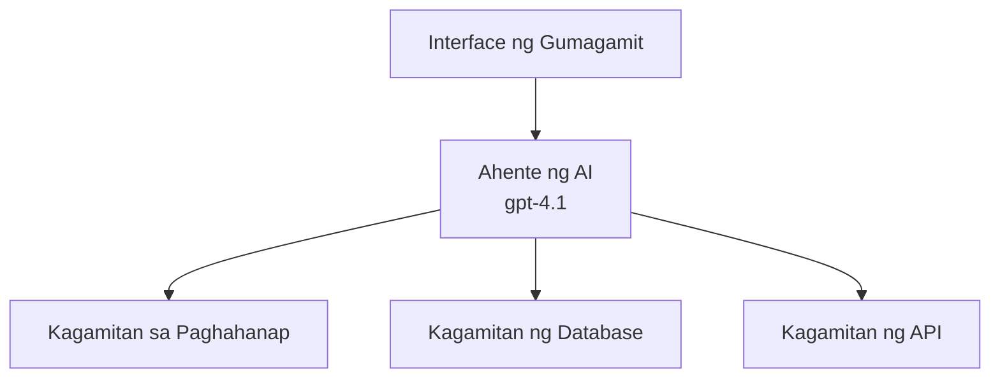
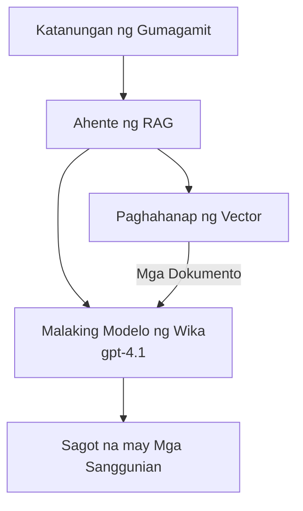

# Mga AI Agent gamit ang Azure Developer CLI

**Pag-navigate ng Kabanata:**
- **📚 Home ng Kurso**: [AZD Para sa Mga Nagsisimula](../../README.md)
- **📖 Kasalukuyang Kabanata**: Kabanata 2 - AI-First Development
- **⬅️ Nakaraan**: [Microsoft Foundry Integration](microsoft-foundry-integration.md)
- **➡️ Susunod**: [AI Model Deployment](ai-model-deployment.md)
- **🚀 Advanced**: [Multi-Agent Solutions](../../examples/retail-scenario.md)

---

## Panimula

Ang mga AI agent ay mga autonomous na programa na kayang maramdaman ang kanilang kapaligiran, gumawa ng mga desisyon, at magsagawa ng mga aksyon upang makamit ang partikular na mga layunin. Hindi tulad ng simpleng mga chatbot na tumutugon lang sa mga prompt, ang mga agent ay maaaring:

- **Gumamit ng mga tool** - Tumawag sa mga API, maghanap sa mga database, magpatakbo ng code
- **Magplano at mag-reason** - Hatiin ang mga kumplikadong gawain sa mga hakbang
- **Matuto mula sa konteksto** - Magpanatili ng memorya at mag-adapt ng pag-uugali
- **Makipagtulungan** - Magsanib-puwersa sa ibang mga agent (multi-agent systems)

Ipinapakita ng gabay na ito kung paano mag-deploy ng mga AI agent sa Azure gamit ang Azure Developer CLI (azd).

> **Validation note (2026-03-25):** Sinuri ang gabay na ito laban sa `azd` `1.23.12` at `azure.ai.agents` `0.1.18-preview`. Ang karanasan ng `azd ai` ay nasa preview pa rin, kaya tingnan ang extension help kung iba ang mga flag na naka-install sa iyo.

## Mga Layunin sa Pagkatuto

Sa pagtatapos ng gabay na ito, ikaw ay:
- Maiintindihan kung ano ang mga AI agent at paano ito naiiba sa mga chatbot
- Makakapag-deploy ng mga pre-built na AI agent template gamit ang AZD
- Makakapag-configure ng Foundry Agents para sa mga custom na agent
- Makakapag-implementa ng mga pangunahing pattern ng agent (paggamit ng tool, RAG, multi-agent)
- Makakapag-monitor at mag-debug ng mga deployed na agent

## Mga Kinalabasan ng Pagkatuto

Sa pagkumpleto, magagawa mong:
- Mag-deploy ng mga AI agent application sa Azure sa isang utos lamang
- I-configure ang mga tool at kakayahan ng agent
- Mag-implementa ng retrieval-augmented generation (RAG) kasama ang mga agent
- Magdisenyo ng mga multi-agent architecture para sa kumplikadong workflows
- Mag-troubleshoot ng mga karaniwang isyu sa pag-deploy ng agent

---

## 🤖 Ano ang Pagkakaiba ng Agent sa Chatbot?

| Feature | Chatbot | AI Agent |
|---------|---------|----------|
| **Pag-uugali** | Tumutugon sa mga prompt | Gumagawa ng autonomous na mga aksyon |
| **Mga Tool** | Wala | Kayang tumawag sa mga API, maghanap, magpatakbo ng code |
| **Memorya** | Session-based lamang | Persistent na memorya sa mga session |
| **Pagpaplano** | Isang tugon | Multi-step na pag-iisip |
| **Pakikipagtulungan** | Isang entidad | Kayang makipagtulungan sa ibang mga agent |

### Simpleng Analohiya

- **Chatbot** = Isang matulunging tao na sumasagot sa mga tanong sa isang information desk
- **AI Agent** = Isang personal na katulong na kayang tumawag, mag-book ng appointment, at tapusin ang mga gawain para sa iyo

---

## 🚀 Quick Start: I-deploy ang Iyong Unang Agent

### Opsyon 1: Foundry Agents Template (Inirerekomenda)

```bash
# I-initialize ang template ng mga AI agent
azd init --template get-started-with-ai-agents

# I-deploy sa Azure
azd up
```

**Ano ang nade-deploy:**
- ✅ Foundry Agents
- ✅ Microsoft Foundry Models (gpt-4.1)
- ✅ Azure AI Search (para sa RAG)
- ✅ Azure Container Apps (web interface)
- ✅ Application Insights (monitoring)

**Oras:** ~15-20 minuto
**Gastos:** ~$100-150/buwan (development)

### Opsyon 2: OpenAI Agent gamit ang Prompty

```bash
# I-initialize ang template ng ahente na nakabase sa Prompty
azd init --template agent-openai-python-prompty

# I-deploy sa Azure
azd up
```

**Ano ang nade-deploy:**
- ✅ Azure Functions (serverless agent execution)
- ✅ Microsoft Foundry Models
- ✅ Prompty configuration files
- ✅ Halimbawang implementasyon ng agent

**Oras:** ~10-15 minuto
**Gastos:** ~$50-100/buwan (development)

### Opsyon 3: RAG Chat Agent

```bash
# I-initialize ang template ng RAG chat
azd init --template azure-search-openai-demo

# I-deploy sa Azure
azd up
```

**Ano ang nade-deploy:**
- ✅ Microsoft Foundry Models
- ✅ Azure AI Search na may sample data
- ✅ Document processing pipeline
- ✅ Chat interface na may mga citation

**Oras:** ~15-25 minuto
**Gastos:** ~$80-150/buwan (development)

### Opsyon 4: AZD AI Agent Init (Manifest- o Template-Based Preview)

Kung mayroon kang agent manifest file, maaari mong gamitin ang `azd ai` command upang i-scaffold ang isang Foundry Agent Service project nang direkta. Nagdagdag din ang mga kamakailang preview release ng suporta para sa template-based initialization, kaya maaaring bahagyang magkaiba ang eksaktong daloy ng prompt depende sa bersyon ng extension na naka-install.

```bash
# I-install ang extension ng AI agents
azd extension install azure.ai.agents

# Opsyonal: beripikahin ang naka-install na preview na bersyon
azd extension show azure.ai.agents

# I-initialize mula sa manifest ng ahente
azd ai agent init -m agent-manifest.yaml

# I-deploy sa Azure
azd up
```

**Kailan gagamitin ang `azd ai agent init` vs `azd init --template`:**

| Approach | Best For | How It Works |
|----------|----------|------|
| `azd init --template` | Pagsisimula mula sa isang gumaganang sample app | Kinokopya ang isang buong template repo na may code + infra |
| `azd ai agent init -m` | Pagbuo mula sa iyong sariling agent manifest | Gini-generate ang project structure mula sa iyong agent definition |

> **Tip:** Gamitin ang `azd init --template` kapag nag-aaral (Mga Opsyon 1-3 sa itaas). Gamitin ang `azd ai agent init` kapag nagbuo ng production agents gamit ang iyong sariling manifests. Tingnan ang [AZD AI CLI Commands](../chapter-08-production/production-ai-practices.md#azd-ai-cli-commands-and-extensions) para sa buong sanggunian.

---

## 🏗️ Mga Pattern ng Arkitektura ng Agent

### Pattern 1: Isang Agent na may Mga Tool

Ang pinakasimpleng pattern ng agent - isang agent na kayang gumamit ng maraming tool.


**Pinakamainam para sa:**
- Mga customer support bot
- Mga research assistant
- Mga data analysis agent

**AZD Template:** `azure-search-openai-demo`

### Pattern 2: RAG Agent (Retrieval-Augmented Generation)

Isang agent na nagre-retrieve ng mga kaugnay na dokumento bago bumuo ng mga tugon.


**Pinakamainam para sa:**
- Enterprise knowledge bases
- Mga document Q&A system
- Compliance at legal research

**AZD Template:** `azure-search-openai-demo`

### Pattern 3: Multi-Agent System

Maramihang espesyal na mga agent na nagtutulungan sa kumplikadong mga gawain.


**Pinakamainam para sa:**
- Kumplikadong content generation
- Multi-step workflows
- Mga gawain na nangangailangan ng iba't ibang kadalubhasaan

**Matuto pa:** [Multi-Agent Coordination Patterns](../chapter-06-pre-deployment/coordination-patterns.md)

---

## ⚙️ Pag-configure ng Mga Tool ng Agent

Nagiging makapangyarihan ang mga agent kapag nakakagamit sila ng mga tool. Narito kung paano i-configure ang mga karaniwang tool:

### Tool Configuration sa Foundry Agents

```python
# agent_config.py
from azure.ai.projects import AIProjectClient
from azure.ai.projects.models import FunctionTool, CodeInterpreterTool

# Tukuyin ang mga pasadyang kasangkapan
search_tool = FunctionTool(
    name="search_knowledge_base",
    description="Search the company knowledge base for relevant documents",
    parameters={
        "type": "object",
        "properties": {
            "query": {
                "type": "string",
                "description": "The search query"
            }
        },
        "required": ["query"]
    }
)

# Gumawa ng ahente na may mga kasangkapan
agent = project_client.agents.create_agent(
    model="gpt-4.1",
    name="Support Agent",
    instructions="You are a helpful support agent. Use the search tool to find relevant information.",
    tools=[search_tool, CodeInterpreterTool()]
)
```

### Pag-configure ng Environment

```bash
# Itakda ang mga environment variable na tukoy sa ahente
azd env set AZURE_OPENAI_MODEL "gpt-4.1"
azd env set AGENT_INSTRUCTIONS "You are a helpful assistant..."
azd env set ENABLE_CODE_INTERPRETER "true"
azd env set ENABLE_FILE_SEARCH "true"

# I-deploy gamit ang na-update na konfigurasyon
azd deploy
```

---

## 📊 Pag-monitor ng Mga Agent

### Application Insights Integration

Lahat ng AZD agent templates ay may kasamang Application Insights para sa monitoring:

```bash
# Buksan ang dashboard ng pagmamanman
azd monitor --overview

# Tingnan ang mga live na log
azd monitor --logs

# Tingnan ang mga live na sukatan
azd monitor --live
```

### Mga Key Metric na Sundan

| Metric | Paglalarawan | Target |
|--------|--------------|--------|
| Response Latency | Oras para makabuo ng tugon | < 5 segundo |
| Token Usage | Mga token bawat request | Subaybayan para sa gastos |
| Tool Call Success Rate | % ng matagumpay na pag-execute ng tool | > 95% |
| Error Rate | Mga nabigong agent request | < 1% |
| User Satisfaction | Mga score ng feedback | > 4.0/5.0 |

### Custom Logging para sa Mga Agent

```python
import os
from azure.monitor.opentelemetry import configure_azure_monitor
from opentelemetry import trace

# I-configure ang Azure Monitor gamit ang OpenTelemetry
configure_azure_monitor(
    connection_string=os.environ["APPLICATIONINSIGHTS_CONNECTION_STRING"]
)

tracer = trace.get_tracer(__name__)

def log_agent_interaction(user_query, agent_response, tools_used, latency_ms):
    with tracer.start_as_current_span("agent_interaction") as span:
        span.set_attributes({
            "user_query": user_query,
            "response_length": len(agent_response),
            "tools_used": tools_used,
            "latency_ms": latency_ms
        })
```

> **Note:** I-install ang kinakailangang mga package: `pip install azure-monitor-opentelemetry opentelemetry`

---

## 💰 Mga Dapat Isaalang-alang sa Gastos

### Tinatayang Buwanang Gastos ayon sa Pattern

| Pattern | Dev Environment | Production |
|---------|-----------------|------------|
| Single Agent | $50-100 | $200-500 |
| RAG Agent | $80-150 | $300-800 |
| Multi-Agent (2-3 agents) | $150-300 | $500-1,500 |
| Enterprise Multi-Agent | $300-500 | $1,500-5,000+ |

### Mga Tip sa Pag-optimize ng Gastos

1. **Gamitin ang gpt-4.1-mini para sa simpleng mga gawain**
   ```bash
   azd env set AZURE_OPENAI_MODEL "gpt-4.1-mini"
   ```

2. **Mag-implementa ng caching para sa mga paulit-ulit na query**
   ```python
   from functools import lru_cache
   
   @lru_cache(maxsize=1000)
   def get_cached_response(query_hash):
       return agent.run(query_hash)
   ```

3. **Mag-set ng token limits bawat run**
   ```python
   # Itakda ang max_completion_tokens kapag pinapatakbo ang ahente, hindi habang nililikha ito
   run = project_client.agents.create_run(
       thread_id=thread.id,
       agent_id=agent.id,
       max_completion_tokens=1000  # Limitahan ang haba ng tugon
   )
   ```

4. **I-scale to zero kapag hindi ginagamit**
   ```bash
   # Ang Container Apps ay awtomatikong nag-scale hanggang zero
   azd env set MIN_REPLICAS "0"
   ```

---

## 🔧 Pag-troubleshoot ng Mga Agent

### Mga Karaniwang Isyu at Solusyon

<details>
<summary><strong>❌ Ahente hindi tumutugon sa mga tawag ng tool</strong></summary>

```bash
# Suriin kung maayos na nakarehistro ang mga tool
azd show

# Tiyakin ang deployment ng OpenAI
az cognitiveservices account deployment list \
  --name $AZURE_OPENAI_NAME \
  --resource-group $RG_NAME

# Suriin ang mga log ng agent
azd monitor --logs
```

**Mga karaniwang sanhi:**
- Mismatch sa tool function signature
- Nawawalang kinakailangang mga permiso
- Hindi naa-access ang API endpoint
</details>

<details>
<summary><strong>❌ Mataas na latency sa mga tugon ng agent</strong></summary>

```bash
# Suriin ang Application Insights para sa mga bottleneck
azd monitor --live

# Isaalang-alang ang paggamit ng mas mabilis na modelo
azd env set AZURE_OPENAI_MODEL "gpt-4.1-mini"
azd deploy
```

**Mga tip sa optimization:**
- Gamitin ang streaming responses
- Mag-implementa ng response caching
- Bawasan ang laki ng context window
</details>

<details>
<summary><strong>❌ Ahente nagbabalik ng maling o hallucinated na impormasyon</strong></summary>

```python
# Pagbutihin gamit ang mas mahusay na mga prompt ng sistema
instructions = """
You are a helpful assistant. IMPORTANT:
- Only answer based on provided context
- If you don't know, say "I don't know"
- Always cite your sources
- Never make up information
"""

# Magdagdag ng pagkuha para sa pagbatayan
agent = project_client.agents.create_agent(
    model="gpt-4.1",
    instructions=instructions,
    tools=[FileSearchTool()]  # Ibatay ang mga tugon sa mga dokumento
)
```
</details>

<details>
<summary><strong>❌ Nag-exceed ng token limit errors</strong></summary>

```python
# Ipapatupad ang pamamahala ng window ng konteksto
def truncate_context(messages, max_tokens=8000, model="gpt-4.1"):
    """Keep only recent messages within token limit."""
    import tiktoken
    encoding = tiktoken.encoding_for_model(model)
    total_tokens = 0
    truncated = []
    
    for msg in reversed(messages):
        msg_tokens = len(encoding.encode(msg.content))
        if total_tokens + msg_tokens > max_tokens:
            break
        truncated.insert(0, msg)
        total_tokens += msg_tokens
    
    return truncated
```
</details>

---

## 🎓 Hands-On Exercises

### Exercise 1: I-deploy ang Isang Basic na Agent (20 minuto)

**Layunin:** I-deploy ang iyong unang AI agent gamit ang AZD

```bash
# Hakbang 1: I-initialize ang template
azd init --template get-started-with-ai-agents

# Hakbang 2: Mag-login sa Azure
azd auth login
# Kung nagtatrabaho ka sa iba't ibang tenant, idagdag ang --tenant-id <tenant-id>

# Hakbang 3: I-deploy
azd up

# Hakbang 4: Subukan ang ahente
# Inaasahang output pagkatapos ng deployment:
#   Natapos na ang deployment!
#   Endpoint: https://<app-name>.<region>.azurecontainerapps.io
# Buksan ang URL na ipinakita sa output at subukang magtanong

# Hakbang 5: Tingnan ang pagmamanman
azd monitor --overview

# Hakbang 6: Linisin
azd down --force --purge
```

**Kriteriya ng Tagumpay:**
- [ ] Tumutugon ang Agent sa mga tanong
- [ ] Maaaring ma-access ang monitoring dashboard via `azd monitor`
- [ ] Maayos na nalinis ang mga resources

### Exercise 2: Magdagdag ng Custom na Tool (30 minuto)

**Layunin:** Palawakin ang isang agent gamit ang isang custom na tool

1. I-deploy ang agent template:
   ```bash
   azd init --template get-started-with-ai-agents
   azd up
   ```
2. Gumawa ng bagong tool function sa iyong agent code:
   ```python
   def get_weather(location: str) -> str:
       """Get current weather for a location."""
       # Pagtawag sa serbisyo ng panahon gamit ang API
       return f"Weather in {location}: Sunny, 72°F"
   ```
3. Irehistro ang tool sa agent:
   ```python
   from azure.ai.projects.models import FunctionTool

   weather_tool = FunctionTool(
       name="get_weather",
       description="Get current weather for a location",
       parameters={
           "type": "object",
           "properties": {
               "location": {"type": "string", "description": "City name"}
           },
           "required": ["location"]
       }
   )

   agent = project_client.agents.create_agent(
       model="gpt-4.1",
       name="Weather Agent",
       tools=[weather_tool]
   )
   ```
4. I-redeploy at subukan:
   ```bash
   azd deploy
   # Tanong: "Kumusta ang panahon sa Seattle?"
   # Inaasahan: Tinatawagan ng agent ang get_weather("Seattle") at ibinabalik ang impormasyon tungkol sa panahon
   ```

**Kriteriya ng Tagumpay:**
- [ ] Nakikilala ng Agent ang mga query na may kinalaman sa panahon
- [ ] Tama ang pagtawag sa tool
- [ ] Kasama sa tugon ang impormasyon ng panahon

### Exercise 3: Gumawa ng RAG Agent (45 minuto)

**Layunin:** Lumikha ng agent na sumasagot mula sa iyong mga dokumento

```bash
# Hakbang 1: I-deploy ang RAG na template
azd init --template azure-search-openai-demo
azd up

# Hakbang 2: I-upload ang iyong mga dokumento
# Ilagay ang mga PDF/TXT na file sa direktoryong data/, pagkatapos ay patakbuhin:
python scripts/prepdocs.py

# Hakbang 3: Subukan gamit ang mga tanong na tukoy sa domain
# Buksan ang URL ng web app mula sa output ng azd up
# Magtanong tungkol sa iyong mga na-upload na dokumento
# Dapat isama ng mga sagot ang mga sanggunian tulad ng [doc.pdf]
```

**Kriteriya ng Tagumpay:**
- [ ] Sumusagot ang Agent mula sa mga in-upload na dokumento
- [ ] Kasama sa mga tugon ang mga citation
- [ ] Walang hallucination sa mga tanong na wala sa saklaw

---

## 📚 Mga Susunod na Hakbang

Ngayon na nauunawaan mo ang mga AI agent, tuklasin ang mga advanced na paksang ito:

| Topic | Paglalarawan | Link |
|-------|--------------|------|
| **Multi-Agent Systems** | Bumuo ng mga sistema na may maramihang nagtutulungang agent | [Retail Multi-Agent Example](../../examples/retail-scenario.md) |
| **Coordination Patterns** | Matuto ng mga pattern ng orchestration at komunikasyon | [Coordination Patterns](../chapter-06-pre-deployment/coordination-patterns.md) |
| **Production Deployment** | Enterprise-ready na pag-deploy ng agent | [Production AI Practices](../chapter-08-production/production-ai-practices.md) |
| **Agent Evaluation** | Subukan at i-evaluate ang performance ng agent | [AI Troubleshooting](../chapter-07-troubleshooting/ai-troubleshooting.md) |
| **AI Workshop Lab** | Hands-on: Gawing AZD-ready ang iyong AI solution | [AI Workshop Lab](ai-workshop-lab.md) |

---

## 📖 Karagdagang Mga Mapagkukunan

### Opisyal na Dokumentasyon
- [Azure AI Agent Service](https://learn.microsoft.com/azure/ai-services/agents/)
- [Azure AI Foundry Agent Service Quickstart](https://learn.microsoft.com/azure/ai-services/agents/quickstart)
- [Semantic Kernel Agent Framework](https://learn.microsoft.com/semantic-kernel/)

### AZD Templates para sa Mga Agent
- [Get Started with AI Agents](https://github.com/Azure-Samples/get-started-with-ai-agents)
- [Agent OpenAI Python Prompty](https://github.com/Azure-Samples/agent-openai-python-prompty)
- [Azure Search OpenAI Demo](https://github.com/Azure-Samples/azure-search-openai-demo)

### Mga Resource mula sa Komunidad
- [Awesome AZD - Agent Templates](https://azure.github.io/awesome-azd/?tags=ai-agents)
- [Azure AI Discord](https://discord.gg/microsoft-azure)
- [Microsoft Foundry Discord](https://discord.gg/nTYy5BXMWG)

### Mga Agent Skills para sa Iyong Editor
- [**Microsoft Azure Agent Skills**](https://skills.sh/microsoft/github-copilot-for-azure) - Mag-install ng reusable na AI agent skills para sa Azure development sa GitHub Copilot, Cursor, o alinmang suportadong agent. Kasama ang mga skill para sa [Azure AI](https://skills.sh/microsoft/github-copilot-for-azure/azure-ai), [Microsoft Foundry](https://skills.sh/microsoft/github-copilot-for-azure/microsoft-foundry), [deployment](https://skills.sh/microsoft/github-copilot-for-azure/azure-deploy), at [diagnostics](https://skills.sh/microsoft/github-copilot-for-azure/azure-diagnostics):
  ```bash
  npx skills add microsoft/github-copilot-for-azure
  ```

---

**Pag-navigate**
- **Nakaraang Leksyon**: [Microsoft Foundry Integration](microsoft-foundry-integration.md)
- **Susunod na Leksyon**: [AI Model Deployment](ai-model-deployment.md)

---

<!-- CO-OP TRANSLATOR DISCLAIMER START -->
**Paunawa**:
Isinalin ang dokumentong ito gamit ang serbisyong pagsasaling AI na [Co-op Translator](https://github.com/Azure/co-op-translator). Bagaman nagsusumikap kami para sa pagiging tumpak, pakitandaan na ang mga awtomatikong pagsasalin ay maaaring maglaman ng mga pagkakamali o hindi pagkakatumpak. Dapat ituring na awtoritatibong sanggunian ang orihinal na dokumento sa orihinal nitong wika. Para sa mga kritikal na impormasyon, inirerekomenda ang propesyonal na pagsasaling-tao. Hindi kami mananagot para sa anumang hindi pagkakaunawaan o maling interpretasyon na maaaring magmula sa paggamit ng pagsasaling ito.
<!-- CO-OP TRANSLATOR DISCLAIMER END -->