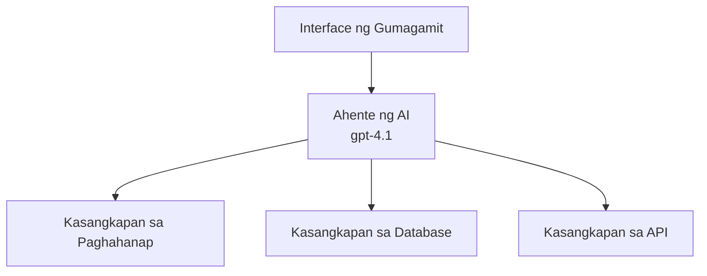
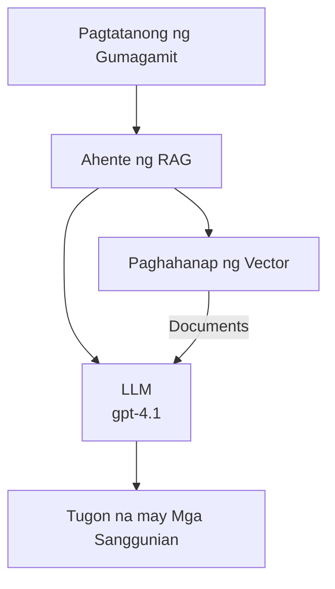
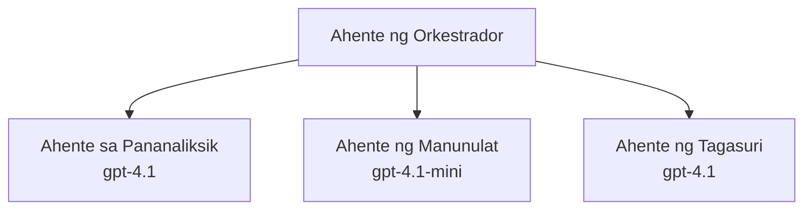

# AI Agents gamit ang Azure Developer CLI

**Pag-navigate sa Kabanata:**
- **📚 Pahina ng Kurso**: [AZD Para sa mga Nagsisimula](../../README.md)
- **📖 Kasalukuyang Kabanata**: Kabanata 2 - AI-Primereng Pag-unlad
- **⬅️ Nakaraang Kabanata**: [Microsoft Foundry Integration](microsoft-foundry-integration.md)
- **➡️ Susunod na Kabanata**: [Pag-deploy ng AI Model](ai-model-deployment.md)
- **🚀 Advanced**: [Mga Solusyon na Multi-Agent](../../examples/retail-scenario.md)

---

## Panimula

Ang mga AI agent ay autonomous na mga programa na maaaring makita ang kanilang kapaligiran, gumawa ng mga desisyon, at magsagawa ng mga aksyon upang makamit ang mga partikular na layunin. Hindi tulad ng simpleng mga chatbot na tumutugon lamang sa mga prompt, ang mga agent ay maaaring:

- **Gumamit ng mga kasangkapan** - Tawagan ang mga API, maghanap sa mga database, magpatupad ng code
- **Magplano at magisip** - Hatiin ang mga kumplikadong gawain sa mga hakbang
- **Matuto mula sa konteksto** - Panatilihin ang memorya at iangkop ang pag-uugali
- **Makipagtulungan** - Makipagtulungan sa iba pang mga agent (mga sistema ng multi-agent)

Ipinapakita sa gabay na ito kung paano mag-deploy ng mga AI agent sa Azure gamit ang Azure Developer CLI (azd).

> **Paalala sa Pagpapatunay (2026-07-13):** Ang gabay na ito ay na-review laban sa `azd` `1.27.1` at `azure.ai.agents` `1.0.0-beta.5`. Ang karanasan ng `azd ai` ay preview pa rin, kaya suriin ang tulong ng extension kung iba ang mga naka-install mong flag.

## Mga Layunin ng Pagkatuto

Sa pamamagitan ng pagtatapos ng gabay na ito, matututuhan mo:
- Maunawaan kung ano ang mga AI agent at paano sila naiiba sa mga chatbot
- Mag-deploy ng mga pre-built na template ng AI agent gamit ang AZD
- I-configure ang Foundry Agents para sa mga custom na agent
- Magpatupad ng mga pangunahing pattern ng agent (paggamit ng tool, RAG, multi-agent)
- Subaybayan at i-debug ang mga na-deploy na agent

## Mga Kinalabasan ng Pagkatuto

Pagkatapos makumpleto, magagawa mong:
- Mag-deploy ng mga AI agent application sa Azure gamit ang isang command lang
- I-configure ang mga tool at kakayahan ng agent
- Magpatupad ng retrieval-augmented generation (RAG) gamit ang mga agent
- Magdisenyo ng mga arkitektura ng multi-agent para sa mga kumplikadong workflow
- Mag-troubleshoot ng mga karaniwang isyu sa deployment ng agent

---

## 🤖 Ano ang Pagkakaiba ng Agent sa Chatbot?

| Katangian | Chatbot | AI Agent |
|---------|---------|----------|
| **Pag-uugali** | Tumutugon sa mga prompt | Gumagawa ng autonomous na aksyon |
| **Mga Kasangkapan** | Wala | Maaaring tumawag ng mga API, maghanap, magpatakbo ng code |
| **Memorya** | Batay lang sa session | Persistenteng memorya sa mga sesyon |
| **Pagpaplano** | Isang tugon lang | Multi-step na pangangatwiran |
| **Pakikipagtulungan** | Isang entity lang | Makikipagtulungan sa ibang mga agent |

### Simpleng Analogy

- **Chatbot** = Isang matulunging tao na sumasagot sa mga tanong sa isang information desk
- **AI Agent** = Isang personal na katulong na maaaring tumawag, mag-book ng appointment, at magkompleto ng mga gawain para sa'yo

---

## 🚀 Mabilisang Simula: I-deploy ang Iyong Unang Agent

### Opsyon 1: Foundry Agents Template (Inirerekomenda)

```bash
# I-initial ang template ng AI agents
azd init --template get-started-with-ai-agents

# I-deploy sa Azure
azd up
```

**Mga ide-deploy:**
- ✅ Foundry Agents
- ✅ Microsoft Foundry Models (gpt-4.1)
- ✅ Azure AI Search (para sa RAG)
- ✅ Azure Container Apps (web interface)
- ✅ Application Insights (monitoring)

**Oras:** ~15-20 minuto
**Gastos:** ~$100-150/buwan (para sa development)

### Opsyon 2: OpenAI Agent gamit ang Prompty

```bash
# I-initialize ang Prompty-based na template ng ahente
azd init --template agent-openai-python-prompty

# I-deploy sa Azure
azd up
```

**Mga ide-deploy:**
- ✅ Azure Functions (serverless na pagpapatupad ng agent)
- ✅ Microsoft Foundry Models
- ✅ Mga configuration file ng Prompty
- ✅ Halimbawang implementasyon ng agent

**Oras:** ~10-15 minuto
**Gastos:** ~$50-100/buwan (para sa development)

### Opsyon 3: RAG Chat Agent

```bash
# I-initialize ang RAG chat template
azd init --template azure-search-openai-demo

# I-deploy sa Azure
azd up
```

**Mga ide-deploy:**
- ✅ Microsoft Foundry Models
- ✅ Azure AI Search na may halimbawang data
- ✅ Pipeline sa pagproseso ng dokumento
- ✅ Chat interface na may mga sanggunian

**Oras:** ~15-25 minuto
**Gastos:** ~$80-150/buwan (para sa development)

### Opsyon 4: AZD AI Agent Init (Manifest- o Template-Based Preview)

Kung mayroon kang agent manifest file, maaari mong gamitin ang `azd ai` command upang direktang mag-scaffold ng Foundry Agent Service project. Ang mga bagong preview release ay nagdagdag din ng suporta para sa template-based initialization, kaya maaaring bahagyang mag-iba ang eksaktong daloy ng prompt depende sa bersyon ng extension na naka-install.

```bash
# I-install ang AI agents na extension
azd extension install azure.ai.agents

# Opsyonal: beripikahin ang na-install na preview na bersyon
azd extension show azure.ai.agents

# I-initialize mula sa isang agent manifest
azd ai agent init -m agent-manifest.yaml

# I-deploy sa Azure
azd up

# Subukan ang na-deploy na agent (ipinapakita ang latency + oras-sa-unang-byte)
azd ai agent invoke
```

**Kailan gagamitin ang `azd ai agent init` kumpara sa `azd init --template`:**

| Paraan | Pinakamabuti Para sa | Paano Ito Gumagana |
|----------|----------|------|
| `azd init --template` | Nagsisimula mula sa gumaganang sample app | Kinokopya ang buong repo ng template kasama ang code + infrastructure |
| `azd ai agent init -m` | Nagtatayo gamit ang sarili mong agent manifest | Nag-scafold ng istraktura ng proyekto mula sa iyong agent definition |

> **Tip:** Gamitin ang `azd init --template` kapag nag-aaral (Mga Opsyon 1-3 sa itaas). Gamitin ang `azd ai agent init` kapag gumagawa ng production agents gamit ang iyong sariling mga manifest.

Pagkatapos ng `azd up`, ang parehong extension ang gagabay sa iyo sa natitirang lifecycle ng agent: `azd ai agent invoke` para subukan, `azd ai agent eval generate` at `azd ai agent optimize` para sukatin at pagbutihin ang kalidad, at `azd ai agent delete` para maglinis. Tingnan ang [AZD AI CLI Commands](../chapter-08-production/production-ai-practices.md#azd-ai-cli-commands-and-extensions) para sa kabuuang sanggunian.

---

## 🏗️ Mga Pattern sa Arkitektura ng Agent

### Pattern 1: Isang Agent na may mga Kasangkapan

Ang pinakasimpleng pattern ng agent - isang agent na maaaring gumamit ng maraming mga kasangkapan.



**Pinakamabuti para sa:**
- Mga bot para sa customer support
- Mga research assistant
- Mga agent sa pagsusuri ng datos

**AZD Template:** `azure-search-openai-demo`

### Pattern 2: RAG Agent (Retrieval-Augmented Generation)

Isang agent na kumukuha ng mga kaugnay na dokumento bago bumuo ng mga sagot.



**Pinakamabuti para sa:**
- Mga knowledge base ng enterprise
- Mga sistema ng Q&A sa dokumento
- Pananaliksik sa pagsunod at legal

**AZD Template:** `azure-search-openai-demo`

### Pattern 3: Sistema ng Multi-Agent

Maraming mga specialized na agent na nagtutulungan sa mga kumplikadong gawain.



**Pinakamabuti para sa:**
- Kumplikadong paglikha ng nilalaman
- Mga multi-step na workflow
- Mga gawain na nangangailangan ng iba't ibang kadalubhasaan

**Matuto Pa:** [Mga Pattern ng Koordinasyon sa Multi-Agent](../chapter-06-pre-deployment/coordination-patterns.md)

---

## ⚙️ Pag-configure ng mga Kasangkapan ng Agent

Nagiging makapangyarihan ang mga agent kapag maaari silang gumamit ng mga kasangkapan. Ganito ang pag-configure ng mga karaniwang kasangkapan:

### Pag-configure ng Kasangkapan sa Foundry Agents

```python
# agent_config.py
from azure.ai.projects import AIProjectClient
from azure.ai.projects.models import FunctionTool, CodeInterpreterTool

# Tukuyin ang mga pasadyang kasangkapan
search_tool = FunctionTool(
    name="search_knowledge_base",
    description="Search the company knowledge base for relevant documents",
    parameters={
        "type": "object",
        "properties": {
            "query": {
                "type": "string",
                "description": "The search query"
            }
        },
        "required": ["query"]
    }
)

# Gumawa ng ahente gamit ang mga kasangkapan
agent = project_client.agents.create_agent(
    model="gpt-4.1",
    name="Support Agent",
    instructions="You are a helpful support agent. Use the search tool to find relevant information.",
    tools=[search_tool, CodeInterpreterTool()]
)
```

### Pag-configure ng Kapaligiran

```bash
# Itakda ang mga environment variable na partikular sa ahente
azd env set AZURE_OPENAI_MODEL "gpt-4.1"
azd env set AGENT_INSTRUCTIONS "You are a helpful assistant..."
azd env set ENABLE_CODE_INTERPRETER "true"
azd env set ENABLE_FILE_SEARCH "true"

# I-deploy gamit ang na-update na configuration
azd deploy
```

---

## 📊 Pagsubaybay sa mga Agent

### Integrasyon ng Application Insights

Lahat ng AZD template ng agent ay may kasamang Application Insights para sa pagsubaybay:

```bash
# Buksan ang dashboard ng pagmamanman
azd monitor --overview

# Tingnan ang mga live na log
azd monitor --logs

# Tingnan ang mga live na sukatan
azd monitor --live
```

### Mga Pangunahing Mga Metric na Susubaybayan

| Metric | Deskripsyon | Target |
|--------|-------------|--------|
| Latency ng Tugon | Oras upang bumuo ng tugon | < 5 segundo |
| Paggamit ng Token | Mga token bawat kahilingan | Subaybayan para sa gastos |
| Rate ng Tagumpay sa Pagtawag ng Tool | % ng matagumpay na pagpapatupad ng tool | > 95% |
| Rate ng Mali | Mga nabigong kahilingan ng agent | < 1% |
| Kasiyahan ng User | Mga marka ng feedback | > 4.0/5.0 |

### Custom Logging para sa mga Agent

```python
import os
from azure.monitor.opentelemetry import configure_azure_monitor
from opentelemetry import trace

# I-configure ang Azure Monitor gamit ang OpenTelemetry
configure_azure_monitor(
    connection_string=os.environ["APPLICATIONINSIGHTS_CONNECTION_STRING"]
)

tracer = trace.get_tracer(__name__)

def log_agent_interaction(user_query, agent_response, tools_used, latency_ms):
    with tracer.start_as_current_span("agent_interaction") as span:
        span.set_attributes({
            "user_query": user_query,
            "response_length": len(agent_response),
            "tools_used": tools_used,
            "latency_ms": latency_ms
        })
```

> **Tandaan:** I-install ang mga kinakailangang pakete: `pip install azure-monitor-opentelemetry opentelemetry`

---

## 💰 Mga Pagsasaalang-alang sa Gastos

### Tinatayang Buwanang Gastos ayon sa Pattern

| Pattern | Kapaligiran sa Dev | Produksyon |
|---------|------------------|------------|
| Isang Agent | $50-100 | $200-500 |
| RAG Agent | $80-150 | $300-800 |
| Multi-Agent (2-3 agents) | $150-300 | $500-1,500 |
| Enterprise Multi-Agent | $300-500 | $1,500-5,000+ |

### Mga Tip sa Pag-optimize ng Gastos

1. **Gumamit ng gpt-4.1-mini para sa simpleng mga gawain**
   ```bash
   azd env set AZURE_OPENAI_MODEL "gpt-4.1-mini"
   ```

2. **Magpatupad ng caching para sa mga paulit-ulit na query**
   ```python
   from functools import lru_cache
   
   @lru_cache(maxsize=1000)
   def get_cached_response(query_hash):
       return agent.run(query_hash)
   ```

3. **Mag-set ng mga limitasyon ng token bawat takbo**
   ```python
   # Itakda ang max_completion_tokens kapag pinapatakbo ang ahente, hindi sa panahon ng paggawa
   run = project_client.agents.create_run(
       thread_id=thread.id,
       agent_id=agent.id,
       max_completion_tokens=1000  # Limitahan ang haba ng tugon
   )
   ```

4. **Mag-scale sa zero kapag hindi ginagamit**
   ```bash
   # Ang Container Apps ay awtomatikong nag-i-scale hanggang zero
   azd env set MIN_REPLICAS "0"
   ```

---

## 🔧 Pag-troubleshoot ng mga Agent

### Karaniwang mga Isyu at Solusyon

<details>
<summary><strong>❌ Agent hindi tumutugon sa pagtawag ng tool</strong></summary>

```bash
# Suriin kung ang mga kasangkapan ay tama ang pagkakarehistro
azd show

# Beripikahin ang OpenAI deployment
az cognitiveservices account deployment list \
  --name $AZURE_OPENAI_NAME \
  --resource-group $RG_NAME

# Suriin ang mga log ng ahente
azd monitor --logs
```

**Mga karaniwang sanhi:**
- Maling lagda ng tool function
- Kulang sa kinakailangang mga permiso
- Hindi ma-access ang API endpoint
</details>

<details>
<summary><strong>❌ Mataas na latency sa mga tugon ng agent</strong></summary>

```bash
# Suriin ang Application Insights para sa mga hadlang
azd monitor --live

# Isaalang-alang ang paggamit ng mas mabilis na modelo
azd env set AZURE_OPENAI_MODEL "gpt-4.1-mini"
azd deploy
```

**Mga tip sa pag-optimize:**
- Gumamit ng streaming na mga tugon
- Magpatupad ng response caching
- Bawasan ang laki ng context window
</details>

<details>
<summary><strong>❌ Agent na nagbabalik ng maling o hinallusina na impormasyon</strong></summary>

```python
# Pagbutihin gamit ang mas magagandang prompt ng sistema
instructions = """
You are a helpful assistant. IMPORTANT:
- Only answer based on provided context
- If you don't know, say "I don't know"
- Always cite your sources
- Never make up information
"""

# Magdagdag ng pagkuha para sa pagsuporta
agent = project_client.agents.create_agent(
    model="gpt-4.1",
    instructions=instructions,
    tools=[FileSearchTool()]  # Ipaloob ang mga tugon sa mga dokumento
)
```
</details>

<details>
<summary><strong>❌ Mga error sa lumampas sa limitasyon ng token</strong></summary>

```python
# Ipatupad ang pamamahala ng window ng konteksto
def truncate_context(messages, max_tokens=8000, model="gpt-4.1"):
    """Keep only recent messages within token limit."""
    import tiktoken
    encoding = tiktoken.encoding_for_model(model)
    total_tokens = 0
    truncated = []
    
    for msg in reversed(messages):
        msg_tokens = len(encoding.encode(msg.content))
        if total_tokens + msg_tokens > max_tokens:
            break
        truncated.insert(0, msg)
        total_tokens += msg_tokens
    
    return truncated
```
</details>

---

## 🎓 Mga Hands-On na Pagsasanay

### Pagsasanay 1: Mag-deploy ng Basic Agent (20 minuto)

**Layunin:** I-deploy ang iyong unang AI agent gamit ang AZD

```bash
# Hakbang 1: I-initialize ang template
azd init --template get-started-with-ai-agents

# Hakbang 2: Mag-login sa Azure
azd auth login
# Kung nagtatrabaho ka sa iba't ibang tenant, idagdag ang --tenant-id <tenant-id>

# Hakbang 3: I-deploy
azd up

# Hakbang 4: Subukan ang agent
# Inaasahang output pagkatapos ng deployment:
#   Kumpleto na ang Deployment!
#   Endpoint: https://<app-name>.<region>.azurecontainerapps.io
# Buksan ang URL na ipinakita sa output at subukang magtanong

# Hakbang 5: Tingnan ang monitoring
azd monitor --overview

# Hakbang 6: Linisin
azd down --force --purge
```

**Mga Pamantayan ng Tagumpay:**
- [ ] Tumutugon ang agent sa mga tanong
- [ ] Maaaring ma-access ang monitoring dashboard gamit ang `azd monitor`
- [ ] Matagumpay na na-linis ang mga resources

### Pagsasanay 2: Magdagdag ng Custom Tool (30 minuto)

**Layunin:** Palawakin ang isang agent gamit ang custom na tool

1. I-deploy ang agent template:
   ```bash
   azd init --template get-started-with-ai-agents
   azd up
   ```
2. Gumawa ng bagong tool function sa iyong agent code:
   ```python
   def get_weather(location: str) -> str:
       """Get current weather for a location."""
       # Tawag sa API sa serbisyo ng panahon
       return f"Weather in {location}: Sunny, 72°F"
   ```
3. Irehistro ang tool sa agent:
   ```python
   from azure.ai.projects.models import FunctionTool

   weather_tool = FunctionTool(
       name="get_weather",
       description="Get current weather for a location",
       parameters={
           "type": "object",
           "properties": {
               "location": {"type": "string", "description": "City name"}
           },
           "required": ["location"]
       }
   )

   agent = project_client.agents.create_agent(
       model="gpt-4.1",
       name="Weather Agent",
       tools=[weather_tool]
   )
   ```
4. I-redeploy at subukan:
   ```bash
   azd deploy
   # Tanong: "Kumusta ang panahon sa Seattle?"
   # Inaasahan: Tatawagan ng ahente ang get_weather("Seattle") at ibabalik ang impormasyon ng panahon
   ```

**Mga Pamantayan ng Tagumpay:**
- [ ] Nakikilala ng agent ang mga tanong tungkol sa panahon
- [ ] Tama ang pagtawag ng tool
- [ ] Kasama sa tugon ang impormasyon ng panahon

### Pagsasanay 3: Gumawa ng RAG Agent (45 minuto)

**Layunin:** Lumikha ng agent na sumasagot sa mga tanong mula sa iyong mga dokumento

```bash
# Hakbang 1: I-deploy ang RAG na template
azd init --template azure-search-openai-demo
azd up

# Hakbang 2: I-upload ang iyong mga dokumento
# Ilagay ang mga PDF/TXT na file sa data/ na direktoryo, pagkatapos ay patakbuhin:
python scripts/prepdocs.py

# Hakbang 3: Subukan gamit ang mga tanong na pang-domain
# Buksan ang URL ng web app mula sa azd up output
# Magtanong tungkol sa iyong mga na-upload na dokumento
# Ang mga sagot ay dapat maglaman ng mga sanggunian ng sipi tulad ng [doc.pdf]
```

**Mga Pamantayan ng Tagumpay:**
- [ ] Sumagot ang agent mula sa mga na-upload na dokumento
- [ ] Kasama sa mga tugon ang mga sanggunian
- [ ] Walang hallucination sa mga tanong na wala sa saklaw

---

## 📚 Mga Susunod na Hakbang

Ngayon na naintindihan mo ang mga AI agent, tuklasin ang mga advanced na paksang ito:

| Paksa | Deskripsyon | Link |
|-------|-------------|------|
| **Multi-Agent Systems** | Bumuo ng mga sistema na may maraming nagtutulungang agent | [Retail Multi-Agent Example](../../examples/retail-scenario.md) |
| **Mga Pattern ng Koordinasyon** | Matutunan ang orchestration at communication patterns | [Coordination Patterns](../chapter-06-pre-deployment/coordination-patterns.md) |
| **Production Deployment** | Paghahanda ng agent deployment sa antas enterprise | [Production AI Practices](../chapter-08-production/production-ai-practices.md) |
| **Pagsusuri ng Agent** | Subukan at suriin ang performance ng agent | [AI Troubleshooting](../chapter-07-troubleshooting/ai-troubleshooting.md) |
| **AI Workshop Lab** | Hands-on: Gawing AZD-ready ang iyong AI solution | [AI Workshop Lab](ai-workshop-lab.md) |

---

## 📖 Karagdagang Mga Mapagkukunan

### Opisyal na Dokumentasyon
- [Microsoft Foundry Agent Service](https://learn.microsoft.com/azure/ai-services/agents/)
- [Microsoft Foundry Agent Service Quickstart](https://learn.microsoft.com/azure/ai-services/agents/quickstart)
- [Semantic Kernel Agent Framework](https://learn.microsoft.com/semantic-kernel/)

### Mga AZD Template para sa mga Agent
- [Magsimula sa AI Agents](https://github.com/Azure-Samples/get-started-with-ai-agents)
- [Agent OpenAI Python Prompty](https://github.com/Azure-Samples/agent-openai-python-prompty)
- [Azure Search OpenAI Demo](https://github.com/Azure-Samples/azure-search-openai-demo)

### Mga Komunidad na Mapagkukunan
- [Awesome AZD - Mga Template ng Agent](https://azure.github.io/awesome-azd/?tags=ai-agents)
- [Azure AI Discord](https://discord.gg/microsoft-azure)
- [Microsoft Foundry Discord](https://discord.gg/nTYy5BXMWG)

### Mga Kasanayan ng Agent para sa Iyong Editor
- [**Microsoft Azure Agent Skills**](https://skills.sh/microsoft/github-copilot-for-azure) - Mag-install ng mga reusable na kasanayan ng AI agent para sa Azure development sa GitHub Copilot, Cursor, o anumang suportadong agent. Kasama ang mga kasanayan para sa [Azure AI](https://skills.sh/microsoft/github-copilot-for-azure/azure-ai), [Microsoft Foundry](https://skills.sh/microsoft/github-copilot-for-azure/microsoft-foundry), [deployment](https://skills.sh/microsoft/github-copilot-for-azure/azure-deploy), at [diagnostics](https://skills.sh/microsoft/github-copilot-for-azure/azure-diagnostics):
  ```bash
  npx skills add microsoft/github-copilot-for-azure
  ```

---

**Pag-navigate**
- **Nakaraang Aralin**: [Microsoft Foundry Integration](microsoft-foundry-integration.md)
- **Susunod na Aralin**: [Pag-deploy ng AI Model](ai-model-deployment.md)

---

<!-- CO-OP TRANSLATOR DISCLAIMER START -->
**Pagtatanggi**:
Ang dokumentong ito ay isinalin gamit ang serbisyo ng AI translation na [Co-op Translator](https://github.com/Azure/co-op-translator). Bagama't nagsusumikap kami para sa katumpakan, pakatandaan na ang awtomatikong pagsasalin ay maaaring maglaman ng mga pagkakamali o hindi pagkakatugma. Ang orihinal na dokumento sa orihinal nitong wika ang dapat ituring na pangunahing sanggunian. Para sa mahahalagang impormasyon, inirerekomenda ang propesyonal na pagsasalin ng tao. Hindi kami mananagot sa anumang maling pagkakaintindi o maling interpretasyon na nagmula sa paggamit ng pagsasaling ito.
<!-- CO-OP TRANSLATOR DISCLAIMER END -->