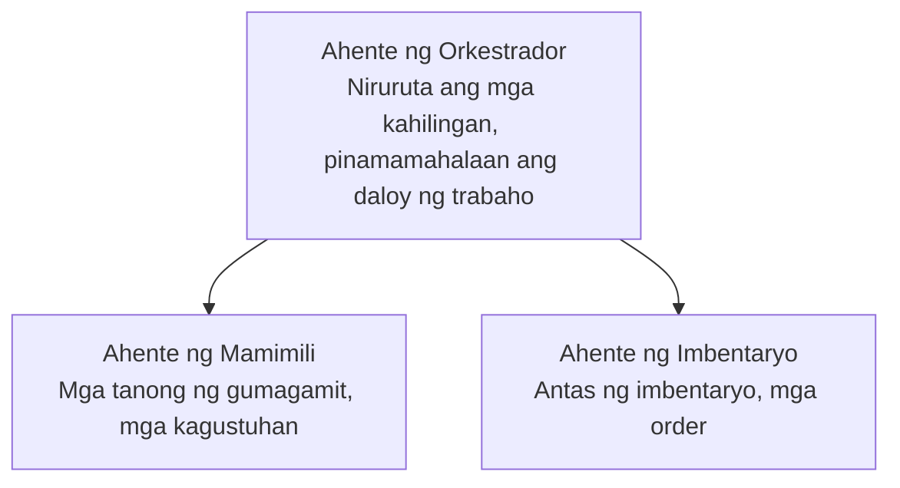

# Kabanata 5: Mga Solusyon ng Multi-Agent AI

**📚 Kurso**: [AZD Para sa Mga Nagsisimula](../../README.md) | **⏱️ Tagal**: 2-3 oras | **⭐ Kompleksidad**: Mataas na Antas

---

## Pangkalahatang-ideya

Ang kabanatang ito ay sumasaklaw sa mga advanced na pattern ng arkitektura ng maramihang ahente, orkestrasyon ng ahente, at mga production-ready na deployment ng AI para sa mga kumplikadong senaryo.

> Napatunayan laban sa `azd 1.23.12` noong Marso 2026.

## Mga Layunin sa Pagkatuto

Sa pagtatapos ng kabanatang ito, ikaw ay:
- Maunawaan ang mga pattern ng arkitektura para sa maramihang ahente
- Mag-deploy ng magkokoordinadong mga sistema ng AI na ahente
- Ipatupad ang komunikasyon sa pagitan ng mga ahente
- Bumuo ng mga multi-agent na solusyon na handa para sa produksyon

---

## 📚 Mga Leksyon

| # | Aralin | Paglalarawan | Oras |
|---|--------|-------------|------|
| 1 | [Retail Multi-Agent na Solusyon](../../examples/retail-scenario.md) | Kompletong walkthrough ng implementasyon | 90 min |
| 2 | [Mga Pattern ng Koordinasyon](../chapter-06-pre-deployment/coordination-patterns.md) | Mga estratehiya ng orkestrasyon ng ahente | 30 min |
| 3 | [Pag-deploy ng ARM Template](../../examples/retail-multiagent-arm-template/README.md) | Isang-click na pag-deploy | 30 min |

---

## 🚀 Mabilis na Pagsisimula

```bash
# Opsyon 1: I-deploy mula sa isang template
azd init --template agent-openai-python-prompty
azd up

# Opsyon 2: I-deploy mula sa isang manifest ng agent (nangangailangan ng azure.ai.agents extension)
azd extension install azure.ai.agents
azd ai agent init -m agent-manifest.yaml
azd up
```

> **Aling paraan?** Gamitin ang `azd init --template` para magsimula mula sa isang gumaganang sample. Gamitin ang `azd ai agent init` kapag may sarili kang agent manifest. Tingnan ang [Sanggunian ng AZD AI CLI](../chapter-08-production/production-ai-practices.md#azd-ai-cli-commands-and-extensions) para sa kumpletong detalye.

---

## 🤖 Arkitekturang Multi-Ahente


---

## 🎯 Tampok na Solusyon: Retail Multi-Agent

Ang [Retail Multi-Agent na Solusyon](../../examples/retail-scenario.md) ay nagpapakita ng:

- **Customer Agent**: Humahawak ng interaksyon sa user at mga kagustuhan
- **Inventory Agent**: Namamahala sa stock at pagproseso ng mga order
- **Orchestrator**: Nagko-coordinate sa pagitan ng mga ahente
- **Shared Memory**: Pamamahala ng konteksto na pinaghahatian ng mga ahente

### Mga Serbisyong Ginamit

| Serbisyo | Layunin |
|---------|---------|
| Microsoft Foundry Models | Pag-unawa sa wika |
| Azure AI Search | Katalogo ng produkto |
| Cosmos DB | Estado at memorya ng ahente |
| Container Apps | Pagho-host ng mga ahente |
| Application Insights | Pagmamanman |

---

## 🔗 Navigasyon

| Direksyon | Kabanata |
|-----------|---------|
| **Nakaraan** | [Kabanata 4: Imprastruktura](../chapter-04-infrastructure/README.md) |
| **Susunod** | [Kabanata 6: Bago ang Pag-deploy](../chapter-06-pre-deployment/README.md) |

---

## 📖 Mga Kaugnay na Mapagkukunan

- [Gabay sa Mga Ahenteng AI](../chapter-02-ai-development/agents.md)
- [Mga Praktika para sa Produksyon ng AI](../chapter-08-production/production-ai-practices.md)
- [Pag-troubleshoot ng AI](../chapter-07-troubleshooting/ai-troubleshooting.md)

---

<!-- CO-OP TRANSLATOR DISCLAIMER START -->
**Paunawa**:
Ang dokumentong ito ay isinalin gamit ang serbisyong pagsasalin ng AI na [Co-op Translator](https://github.com/Azure/co-op-translator). Bagaman sinisikap naming maging tumpak, pakatandaan na ang mga awtomatikong pagsasalin ay maaaring maglaman ng mga pagkakamali o hindi pagkakatumpak. Ang orihinal na dokumento sa orihinal nitong wika ang dapat ituring na awtoritatibong sanggunian. Para sa mahahalagang impormasyon, inirerekomenda ang propesyonal na pagsasaling-tao. Hindi kami mananagot para sa anumang hindi pagkakaunawaan o maling interpretasyon na nagmumula sa paggamit ng pagsasaling ito.
<!-- CO-OP TRANSLATOR DISCLAIMER END -->