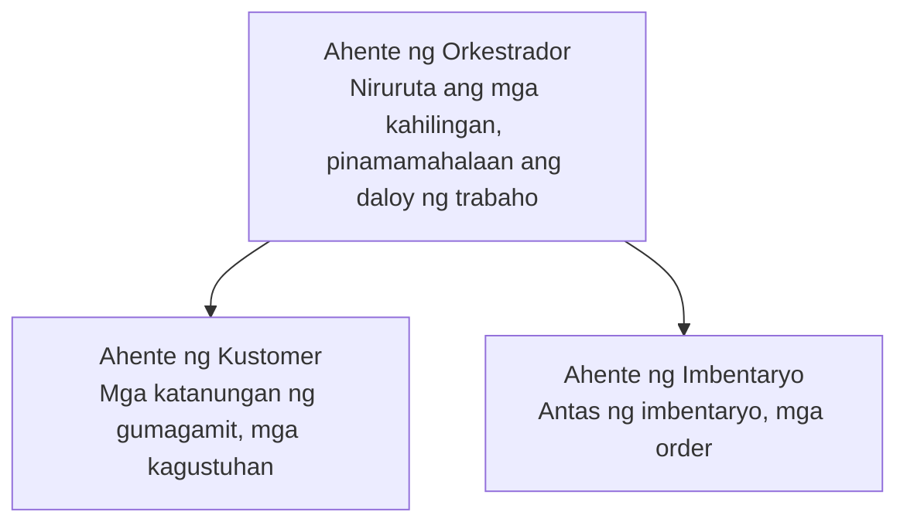

# Kabanata 5: Mga Solusyong Multi-Agent AI

**📚 Kurso**: [AZD For Beginners](../../README.md) | **⏱️ Tagal**: 2-3 oras | **⭐ Antas ng Kahirapan**: Mataas

---

## Pangkalahatang-ideya

Saklaw ng kabanatang ito ang mga advanced na pattern ng arkitekturang multi-agent, orchestrasyon ng mga ahente, at production-ready na mga deployment ng AI para sa mga kumplikadong sitwasyon.

> Napatunayan laban sa `azd 1.25.6` noong Hunyo 2026.

## Mga Layunin sa Pagkatuto

Sa pagkompleto ng kabanatang ito, ikaw ay:
- Mauunawaan ang mga pattern ng arkitekturang multi-agent
- Makakapag-deploy ng magkaka-ugnay na mga sistema ng AI agent
- Makakapagpatupad ng komunikasyon mula ahente-sa-ahente
- Makakabuo ng production-ready na mga multi-agent na solusyon

---

## 📚 Mga Aralin

| # | Aralin | Paglalarawan | Oras |
|---|--------|-------------|------|
| 1 | [Mga Pangunahing Kaalaman sa Multi-Agent](multi-agent-basics.md) | Praktikal: i-deploy ang gumaganang multi-agent app gamit ang `azd up` | 45 min |
| 2 | [Mga Pattern ng Koordinasyon](../chapter-06-pre-deployment/coordination-patterns.md) | Mga estratehiya ng orchestrasyon ng ahente (nagpapatuloy sa Kabanata 6) | 30 min |
| 3 | [Pag-deploy ng ARM Template](../../examples/retail-multiagent-arm-template/README.md) | Halimbawa ng pag-deploy na may isang pag-click | 30 min |

> **Magsimula sa Aralin 1.** Ito lamang ang ganap na praktikal at maaaring i-deploy na aralin sa kabanatang ito. Ang Aralin 2 ay nasa Kabanata 6 (ibinabahagi ito sa paunang pagpaplano ng pag-deploy), at ang [Solusyong Retail Multi-Agent](../../examples/retail-scenario.md) ay isang blueprint ng arkitektura—isang sanggunian sa disenyo, hindi isang template na isang utos lang.

---

## 🚀 Mabilis na Simula

```bash
# Opsyon 1: Mag-deploy mula sa isang template
azd init --template agent-openai-python-prompty
azd up

# Opsyon 2: Mag-deploy mula sa isang agent manifest (kinakailangan ang azure.ai.agents extension)
azd extension install azure.ai.agents
azd ai agent init -m agent-manifest.yaml
azd up
```

> **Aling paraan?** Gamitin ang `azd init --template` upang magsimula mula sa isang gumaganang sample. Gamitin ang `azd ai agent init` kapag mayroon ka nang sariling agent manifest. Tingnan ang [Sanggunian ng AZD AI CLI](../chapter-08-production/production-ai-practices.md#azd-ai-cli-commands-and-extensions) para sa kumpletong detalye.

---

## 🤖 Arkitekturang Multi-Agent



---

## 🎯 Tampok na Solusyon: Retail Multi-Agent

Ipinapakita ng [Solusyong Retail Multi-Agent](../../examples/retail-scenario.md):

- **Ahente ng Kostumer**: Humahawak sa pakikipag-ugnayan sa gumagamit at mga kagustuhan
- **Ahente ng Imbentaryo**: Namamahala ng stock at pagproseso ng mga order
- **Orkestrador**: Nagkokordina sa pagitan ng mga ahente
- **Pinagsamang Memorya**: Pamamahala ng konteksto sa pagitan ng mga ahente

### Mga Serbisyong Ginamit

| Serbisyo | Layunin |
|---------|---------|
| Microsoft Foundry Models | Pag-unawa sa wika |
| Azure AI Search | Katalogo ng produkto |
| Cosmos DB | Estado at memorya ng ahente |
| Container Apps | Pagho-host ng ahente |
| Application Insights | Pagsubaybay |

---

## 🔗 Nabigasyon

| Direksyon | Kabanata |
|-----------|---------|
| **Nakaraan** | [Kabanata 4: Infrastructure](../chapter-04-infrastructure/README.md) |
| **Susunod** | [Kabanata 6: Paunang Pag-deploy](../chapter-06-pre-deployment/README.md) |

---

## 📖 Mga Kaugnay na Mapagkukunan

- [Gabay sa Mga Ahente ng AI](../chapter-02-ai-development/agents.md)
- [Mga Praktika sa Produksyon ng AI](../chapter-08-production/production-ai-practices.md)
- [Pag-troubleshoot ng AI](../chapter-07-troubleshooting/ai-troubleshooting.md)

---

<!-- CO-OP TRANSLATOR DISCLAIMER START -->
**Pagtatanggi**:
Ang dokumentong ito ay isinalin gamit ang serbisyo ng AI translation na [Co-op Translator](https://github.com/Azure/co-op-translator). Bagama't nagsusumikap kami para sa katumpakan, pakatandaan na ang awtomatikong pagsasalin ay maaaring maglaman ng mga pagkakamali o hindi pagkakatugma. Ang orihinal na dokumento sa orihinal nitong wika ang dapat ituring na pangunahing sanggunian. Para sa mahahalagang impormasyon, inirerekomenda ang propesyonal na pagsasalin ng tao. Hindi kami mananagot sa anumang maling pagkakaintindi o maling interpretasyon na nagmula sa paggamit ng pagsasaling ito.
<!-- CO-OP TRANSLATOR DISCLAIMER END -->