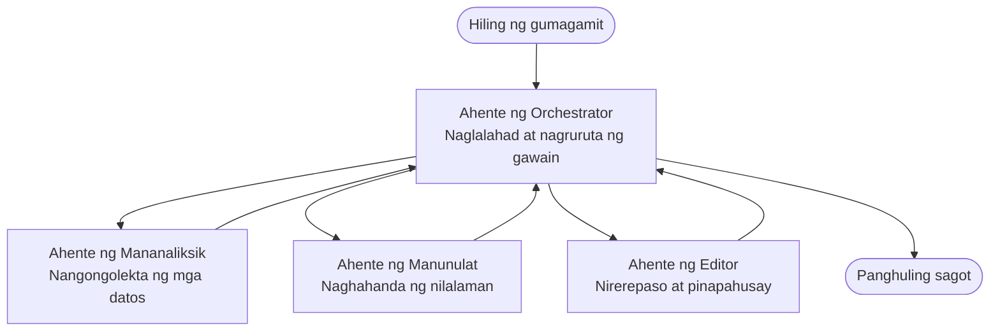

# Mga Pangunahing Kaalaman sa Multi-Agent - I-deploy ang Iyong Unang Pinagsamang AI System

**Pag-navigate ng Kabanata:**
- **📚 Tahanan ng Kurso**: [AZD Para sa mga Nagsisimula](../../README.md)
- **📖 Kasalukuyang Kabanata**: Kabanata 5 - Mga Solusyong Multi-Agent AI
- **⬅️ Nakaraan**: [Kabanata 4: Imprastruktura](../chapter-04-infrastructure/README.md)
- **➡️ Susunod**: [Mga Pattern ng Koordinasyon](../chapter-06-pre-deployment/coordination-patterns.md)

> Napatunayan gamit ang `azd 1.27.1` noong Hulyo 2026.

## Panimula

Sa mga naunang kabanata, nag-deploy ka ng isang aplikasyon—at sa Kabanata 2, nag-deploy ka ng isang AI agent. Ang leksyon na ito ay sumusunod sa susunod na hakbang: pag-deploy ng **multi-agent system**, kung saan maraming espesyalisadong agent ang nagtutulungan upang lutasin ang isang problema na hindi kayang gawin nang mahusay nang mag-isa ng isang agent.

Ang magandang balita para sa mga nagsisimula: **hindi mo kailangan ng mga bagong utos.** Ang isang multi-agent na solusyon ay isang azd proyekto pa rin. Mag `azd init`, mag `azd up`, mag-test, at mag `azd down` ka—eksaktong workflow na alam mo na. Ang nagbabago lang ay ang *hugis* ng app sa loob.

## Mga Layunin sa Pagkatuto

Sa pagtatapos ng leksyon na ito, magagawa mong:
- Maunawaan kung ano ang ibig sabihin ng "multi-agent" at kailan ito sulit sa karagdagang komplikasyon
- Makilala ang mga karaniwang papel sa isang multi-agent system (orchestrator + mga espesyalista)
- Mag-deploy ng totoong gumaganang multi-agent template gamit ang `azd up`
- Maunawaan ang mga Azure resources na sumusuporta sa isang multi-agent app
- Malaman kung paano i-verify, i-customize, at ligtas na i-tear down ang solusyon

## Mga Kinalabasan ng Pagkatuto

Matapos matapos ang leksyon na ito, magagawa mong:
- Ipaliwanag ang pagkakaiba sa pagitan ng isang single agent at multi-agent system
- Pumili sa pagitan ng isang single agent na may mga tool at isang tunay na disenyo ng multi-agent
- Mag-deploy at mag-test ng multi-agent template ng buo gamit ang azd
- Tukuyin kung saan tumatakbo ang bawat agent at paano sila nag-uusap
- Linisin lahat ng resources upang maiwasan ang patuloy na singil

---

## Ano ang Multi-Agent System?

Ang isang AI agent ay isang modelo na may set ng mga tagubilin at (opsyonal) ilang mga tools. Epektibo ito para sa mga espesipikong gawain. Ngunit habang lumalaki ang gawain—pananaliksik, pagsulat, pag-edit, at pag-check ng mga katotohanan—ang pagsiksik ng lahat sa isang prompt ay nagpapabagal sa agent, nagpapababa ng pagiging maaasahan, at nagpapahirap sa pag-debug.

Ang isang **multi-agent system** ay naghahati ng trabaho sa mga espesyalista na bawat isa ay mahusay sa isang gawain, na pinamumunuan ng isang orchestrator:



### Ang dalawang papel na palaging makikita mo

| Papel | Trabaho | Halimbawa |
|------|---------|-----------|
| **Orchestrator** | Nagpapasya *kung ano ang susunod* at nagruruta ng trabaho sa mga agent | "Una magsaliksik, pagsulat, pagkatapos pag-edit" |
| **Espesyalista** | Gumagawa ng isang nakatuong gawain at nagbabalik ng resulta | Isang "mananaliksik" na nagko-kolekta lamang ng mga katotohanan |

### Talaga bang kailangan mo ng maraming agents?

Magsimula sa simple. Gamitin lang ang multi-agent **kapag** ang isa sa mga ito ay totoo:

- ✅ Ang gawain ay may **mga malinaw na yugto** na nakikinabang sa iba't ibang mga tagubilin (pananaliksik vs. pagsulat vs. pagsusuri)
- ✅ Nais mong ang mga espesyalista ay tumakbo **ng sabay-sabay** para makatipid sa oras
- ✅ Kailangan ng iba't ibang mga hakbang ng **iba't ibang mga tool o pinanggagalingan ng data**
- ✅ Kailangan ang bawat hakbang na **nait-test at na-debug nang nakapag-iisa**

Kung ang gawain mo ay isang simpleng tanong-at-sagot o isang simpleng tawag sa tool, ang **isang agent na may mga tool** (Kabanata 2) ay mas simple, mas mura, at mas madaling patakbuhin.

> **Tip sa Nagsisimula:** "Mas maraming agents" ay hindi nangangahulugang "mas mabuti." Bawat agent ay nagdadagdag ng latency, gastos, at isang bagong bagay na imonitor. Magdagdag lang ng agents kung malinaw na nahahati ang problema sa mga bahagi.

---

## Dalawang Paraan ng Paggawa ng Multi-Agent sa Azure

| Paraan | Ano ito | Pinakamabuti para sa |
|--------|----------|---------------------|
| **Isang agent + mga tool** | Isang Foundry agent na tumatawag ng mga function/tool | Mga simpleng workflow, panimulang hakbang |
| **Maraming pinagsamang agents** | Ilang agents na may orchestrator | Malinaw na yugto, sabayang trabaho, espesyalisasyon |

Nakatuon ang leksyon na ito sa pangalawang paraan gamit ang isang **handang template**, upang makita mo ang aktwal na multi-agent system bago ka gumawa ng sarili mo.

---

## Praktikal: Mag-deploy ng Gumaganang Multi-Agent App

Magde-deploy tayo ng **Contoso Creative Writer**, isang opisyal na Azure sample na gumagamit ng maraming agents (researcher, writer, editor) na pinagsama-sama upang gumawa ng isang artikulo. Maganda itong unang multi-agent app dahil madaling maunawaan ang mga papel.

### Hakbang 1: I-initialize ang template

```bash
# Gumawa ng isang gumaganang folder
mkdir creative-writer && cd creative-writer

# I-initialize mula sa opisyal na multi-agent na template
azd init --template contoso-creative-writer
```

> Tingnan pa ang ibang multi-agent templates anumang oras sa [Awesome AZD AI gallery](https://azure.github.io/awesome-azd/?tags=ai). Kasama sa mga beginner-friendly option ang `get-started-with-ai-agents` at `azure-ai-travel-agents`.

### Hakbang 2: Mag-authenticate

```bash
# Kinakailangan para sa mga azd workflows
azd auth login
```

### Hakbang 3: Gumawa ng environment

```bash
azd env new dev
```

### Hakbang 4: I-preview, tapos i-deploy

```bash
# Tingnan kung ano ang malilikha bago gumastos ng kahit ano (inirerekomenda)
azd provision --preview

# Maghanda ng imprastruktura at mag-deploy ng lahat ng ahente sa isang hakbang
azd up
```

Ang `azd up` ay magta-tip para sa subscription at rehiyon, tapos magp-provision ng mga Azure resources at ide-deploy ang aplikasyon. Mas matagal ang AI deployments kaysa simpleng web app—kung nagde-deploy ka ng mas malalaking modelo, pwede mong palawigin ang deploy timeout:

```bash
azd deploy --timeout 1800
```

> **Babala sa gastos at kapasidad:** Ang mga multi-agent apps ay nagde-deploy ng mga AI model na kumakain ng quota at may kaakibat na gastos. Kung pumalya ang `azd up` dahil sa quota ng modelo, tingnan ang [AI Troubleshooting](../chapter-07-troubleshooting/ai-troubleshooting.md) para sa mga ayos sa rehiyon at quota, at Kabanata 6 [Capacity Planning](../chapter-06-pre-deployment/capacity-planning.md).

---

## Pag-unawa sa Iyong Na-deploy

Isang karaniwang multi-agent app tulad nito ay nagpo-provision ng isang set ng mga Azure resources na tumutugma sa mga responsibilidad sa diagram sa itaas:

| Resource | Bakit ito nandiyan |
|----------|----------------------|
| **Microsoft Foundry / Models** | Nagho-host ng mga language model na ginagamit ng bawat agent |
| **Azure AI Search** | Nagbibigay sa researcher agent ng grounded data para hanapin |
| **Container Apps** (o App Service) | Nagho-host ng orchestrator at agent na code |
| **Cosmos DB** (sa ilang samples) | Nag-iimbak ng shared state/memory na pinapasa sa pagitan ng mga agents |
| **Application Insights** | Nagta-track ng mga request *galing sa* mga agents para madali ang pag-debug ng daloy |

### Paano nag-uusap ang mga agents sa isa't isa

Sa karamihan ng azd multi-agent samples, ang **orchestrator ay tumatakbo sa iyong application code** (halimbawa gamit ang framework tulad ng Semantic Kernel o Microsoft Agent Framework). Tinatawag ng orchestrator ang bawat specialist agent nang paisa-isa, ipinapasa ang mga resulta, at binubuo ang huling sagot. Nagbabahagi ang mga agents ng konteksto sa pamamagitan ng:

- **Function/tool calls** — tinatawagan ng orchestrator ang espesyalista at nakakatanggap ng resulta
- **Shared memory** — isang database (madalas Cosmos DB) ang nagtatago ng estado na maaaring basahin ng parehong agents
- **Mga mensahe/kaganapan** — para sa mas maluwag na koneksyon, nakikipag-ugnayan ang mga agents sa pamamagitan ng queue o Service Bus

> **Bakit mahalaga ito para sa pag-debug:** dahil ang bawat hakbang ay hiwalay, ipinapakita ng Application Insights kung *alin* na agent ang mabagal o pumalya. Isa ito sa mga pangunahing dahilan kung bakit hinahati ang trabaho sa mga agents.

---

## I-verify ang Deployment

Kumpirmahin na gumagana talaga ang system bago magpatuloy:

```bash
# Ipakita ang mga naka-deploy na endpoints
azd show

# Buksan ang monitoring dashboard ng app
azd monitor

# Sundan ang mga log kung may kakaiba
azd monitor --logs
```

Pagkatapos buksan ang URL ng app mula sa `azd show` at subukang mag-request na gumagamit ng lahat ng agents (para sa Creative Writer, humiling ng maikling artikulo tungkol sa isang paksa). Sa Application Insights **transaction search**, makikita mo ang request na kumalat sa mga hakbang ng researcher, writer, at editor.

**Mga sukatan ng tagumpay:**
- ✅ Naglilista ang `azd show` ng maabot na endpoint
- ✅ Nagbibigay ang isang request ng resulta na malinaw na dumaan sa maraming yugto
- ✅ Nagpapakita ang Application Insights ng traces para sa higit sa isang hakbang ng agent

---

## I-customize: Magdagdag o Ayusin ang isang Agent

Dahil ang bawat agent ay mga tagubilin lamang kasama ang mga tool, madaling mag-customize:

1. **Hanapin ang mga depinisyon ng agent** sa template (madalas nasa `prompts/`, `agents/`, o `*.prompty` na mga file).
2. **I-tune ang mga tagubilin ng agent** — halimbawa, sabihan ang editor agent na ipatupad ang isang partikular na tono o bilang ng salita.
3. **I-redeploy lamang ang code** (hindi nagbabago ang imprastruktura):

   ```bash
   azd deploy
   ```

Para mas tumalima at gumawa ng mga agent mula sa *sariling* manifest, gamitin ang agent extension at ang buong lifecycle nito:

```bash
azd extension install azure.ai.agents
azd ai agent init -m agent-manifest.yaml
azd up
azd ai agent invoke      # pagsubok, kasama ang timing ng tugon
```

Tingnan ang [Kabanata 2: Mga Agent](../chapter-02-ai-development/agents.md) at ang [AZD AI CLI reference](../chapter-08-production/production-ai-practices.md#azd-ai-cli-commands-and-extensions) para sa kumpletong lifecycle ng agent (`invoke`, `eval generate`, `optimize`, `delete`).

---

## Linisin

Ang mga multi-agent apps ay nagpapatakbo ng maraming billable services. I-tear down ang lahat kapag tapos ka na:

```bash
azd down --force --purge
```

Ang flag na `--purge` ay nagtatanggal din ng mga soft-deleted AI resources (tulad ng Foundry/Azure AI Services accounts) para hindi ito humarang sa isang susunod na redeploy o patuloy na magkaroon ng gastos.

---

## Isang Tala Tungkol sa Production Multi-Agent Systems

Ang [Retail Multi-Agent Solution](../../examples/retail-scenario.md) sa repo na ito ay isang **architecture blueprint**, hindi isang one-command template—dinodokumento nito kung paano itatayo ang isang production retail system (at malinaw na nagsasaad na ang buong build ay malaking gawain). Gamitin ito bilang sanggunian sa disenyo *pagkatapos* mag-deploy ng gumaganang sample dito. Para sa mga alalahanin sa produksyon (resilience, gastos, monitoring, governance), magpatuloy sa [Kabanata 8: Mga Praktis sa Production AI](../chapter-08-production/production-ai-practices.md).

---

## Buod

- Hinahati ng multi-agent system ang trabaho sa mga espesyalista na pinagsama-sama ng isang orchestrator.
- Gamitin lang ito kapag ang gawain ay may malinaw na yugto, parallelism, o iba't ibang mga tool kada hakbang—kung hindi, mas piliin ang isang agent lang.
- Hindi nagbabago ang azd workflow: `azd init` → `azd up` → test → `azd down`.
- Isang tunay na template tulad ng `contoso-creative-writer` ang nagpapakita at nagpapahintulot i-customize ang gumaganang multi-agent app ngayon.
- Ang tracing gamit ang Application Insights sa pagitan ng mga agents ay isa sa pinakamalaking praktikal na benepisyo ng multi-agent na disenyo.

---

## 🔗 Pag-navigate

| Direksyon | Leksiyon |
|-----------|----------|
| **Nakaraan** | [Kabanata 4: Imprastruktura](../chapter-04-infrastructure/README.md) |
| **Susunod** | [Mga Pattern ng Koordinasyon](../chapter-06-pre-deployment/coordination-patterns.md) |

## 📖 Mga Kaugnay na Resources

- [AI Agents Guide](../chapter-02-ai-development/agents.md)
- [Mga Pattern ng Koordinasyon](../chapter-06-pre-deployment/coordination-patterns.md)
- [Mga Praktis sa Production AI](../chapter-08-production/production-ai-practices.md)
- [AI Troubleshooting](../chapter-07-troubleshooting/ai-troubleshooting.md)

---

<!-- CO-OP TRANSLATOR DISCLAIMER START -->
**Pagtatanggi**:
Ang dokumentong ito ay isinalin gamit ang serbisyo ng AI translation na [Co-op Translator](https://github.com/Azure/co-op-translator). Bagama't nagsusumikap kami para sa katumpakan, pakatandaan na ang awtomatikong pagsasalin ay maaaring maglaman ng mga pagkakamali o hindi pagkakatugma. Ang orihinal na dokumento sa orihinal nitong wika ang dapat ituring na pangunahing sanggunian. Para sa mahahalagang impormasyon, inirerekomenda ang propesyonal na pagsasalin ng tao. Hindi kami mananagot sa anumang maling pagkakaintindi o maling interpretasyon na nagmula sa paggamit ng pagsasaling ito.
<!-- CO-OP TRANSLATOR DISCLAIMER END -->