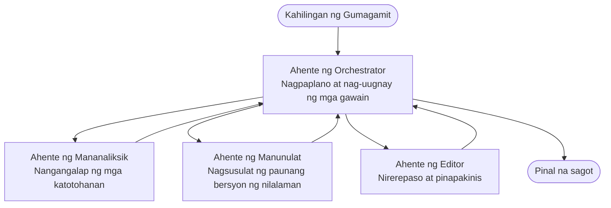

# Multi-Agent Basics - Deploy Your First Coordinated AI System

**Chapter Navigation:**
- **📚 Course Home**: [AZD Para sa mga Baguhan](../../README.md)
- **📖 Current Chapter**: Kabanata 5 - Multi-Agent AI Solutions
- **⬅️ Previous**: [Kabanata 4: Imprastruktura](../chapter-04-infrastructure/README.md)
- **➡️ Next**: [Coordination Patterns](../chapter-06-pre-deployment/coordination-patterns.md)

> Na-validate laban sa `azd 1.25.6` noong Hunyo 2026.

## Introduksyon

Sa mga naunang kabanata nag-deploy ka ng isang aplikasyon—at sa Kabanata 2 nag-deploy ka ng isang AI agent lamang. Ang leksyong ito ay sumusunod sa susunod na hakbang: pag-deploy ng isang **multi-agent system**, kung saan ilang espesyalistang mga agent ang nagtutulungan para lutasin ang isang problema na hindi kayang mahusay na gawin ng isang agent lang.

Ang magandang balita para sa mga baguhan: **hindi mo kailangan ng mga bagong utos.** Ang multi-agent na solusyon ay isa pa ring azd project. Gagawa ka pa rin ng `azd init`, `azd up`, susubukan, at `azd down`—eksaktong workflow na alam mo na. Ang nagbabago lang ay ang *hugis* ng app sa loob.

## Mga Layunin sa Pagkatuto

Sa pagtatapos ng leksyong ito, ikaw ay:
- Maiintindihan kung ano ang ibig sabihin ng "multi-agent" at kailan ito sulit sa karagdagang komplikasyon
- Makikilala ang mga karaniwang papel sa isang multi-agent system (orchestrator + specialists)
- Maka-deploy ng isang totoong gumaganang multi-agent template gamit ang `azd up`
- Maiintindihan ang mga Azure resource na sumusuporta sa isang multi-agent app
- Malalaman kung paano i-verify, i-customize, at i-tear down nang ligtas ang solusyon

## Mga Kinalabasan ng Pagkatuto

Pagkatapos matapos ang leksyong ito, magagawa mo:
- Ipaliwanag ang pagkakaiba sa pagitan ng isang single agent at isang multi-agent system
- Pumili sa pagitan ng isang single agent na may tools at isang tunay na multi-agent na disenyo
- I-deploy at subukan ang isang multi-agent template end to end gamit ang azd
- Tukuyin kung saan tumatakbo ang bawat agent at kung paano sila nagkaka-komunikasyon
- Linisin lahat ng resources upang maiwasan ang patuloy na singil

---

## Ano ang Multi-Agent System?

Ang isang single AI agent ay isang modelo na may hanay ng mga instruksyon at (opsyonal) ilang tools. Epektibo iyon para sa mga nakatuong gawain. Ngunit habang lumalaki ang gawain—pananaliksik, pagkatapos pagsusulat, pagkatapos pag-edit, pagkatapos pag-fact-check—ang pagsiksik ng lahat sa isang prompt ay nagpapabagal sa agent, nagiging mas hindi mapagkakatiwalaan, at mas mahirap i-debug.

Ang isang **multi-agent system** ay hinahati ang gawain sa mga espesyalista na bawat isa ay gumagawa ng isang trabaho nang mahusay, na pinagtutugma ng isang orchestrator:



### Ang dalawang papel na palaging makikita mo

| Role | Job | Example |
|------|-----|---------|
| **Orchestrator** | Nagpapasya *ano ang susunod na gagawin* at nag-reroute ng trabaho sa pagitan ng mga agent | "Una mag-research, pagkatapos magsulat, pagkatapos mag-edit" |
| **Specialist** | Gumagawa ng isang nakatuon na trabaho at nagbabalik ng resulta | Isang "researcher" na nag-iipon lamang ng mga katotohanan |

### Kailangan mo ba talaga ng maraming agent?

Magsimula sa simple. Sumangguni sa multi-agent **lamang** kapag totoo ang isa sa mga sumusunod:

- ✅ Ang gawain ay may **iba't ibang yugto** na nakikinabang sa magkakaibang instruksyon (research vs. write vs. review)
- ✅ Nais mong tumakbo ang mga specialist **nang sabay-sabay** upang makatipid ng oras
- ✅ Iba't ibang hakbang ang nangangailangan ng **iba't ibang tools o pinanggagalingan ng data**
- ✅ Kailangan mong ang bawat hakbang ay **maring masubok at ma-debug nang hiwalay**

Kung ang gawain mo ay isang simpleng tanong-at-sagot o isang simpleng tool call, ang isang **single agent na may tools** (Kabanata 2) ay mas simple, mas mura, at mas madaling patakbuhin.

> **Tip para sa mga baguhan:** "Mas maraming agents" ay hindi laging "mas mabuti." Ang bawat agent ay nagdadagdag ng latency, gastos, at bagong bagay na imo-monitor. Magdagdag ng agents lamang kapag malinaw na nahahati ang problema sa mga bahagi.

---

## Dalawang Paraan sa Paggawa ng Multi-Agent sa Azure

| Approach | What it is | Best for |
|----------|-----------|----------|
| **Single agent + tools** | Isang Foundry agent na tumatawag ng mga function/tools | Simpleng workflows, pagsisimula |
| **Multiple coordinated agents** | Ilang agents na may orchestrator | Iba't ibang yugto, parallel na trabaho, espesyalisasyon |

Nakatuon ang leksyong ito sa pangalawang paraan gamit ang isang **ready-made template**, para makita mo ang isang totoong multi-agent system na tumatakbo bago ka gumawa ng sarili mong bersyon.

---

## Hands-On: I-deploy ang Isang Gumagawang Multi-Agent App

Ide-deploy natin ang **Contoso Creative Writer**, isang opisyal na Azure sample na gumagamit ng maraming agents (researcher, writer, editor) na magkakasamang gumagana upang makagawa ng isang artikulo. Magandang unang multi-agent app ito dahil madaling intindihin ang mga papel.

### Hakbang 1: I-initialize ang template

```bash
# Gumawa ng folder para sa trabaho
mkdir creative-writer && cd creative-writer

# I-initialize mula sa opisyal na template para sa multi-agent
azd init --template contoso-creative-writer
```

> Maaari kang mag-browse ng higit pang multi-agent templates anumang oras sa [Awesome AZD AI gallery](https://azure.github.io/awesome-azd/?tags=ai). Ang iba pang beginner-friendly na opsyon ay kinabibilangan ng `get-started-with-ai-agents` at `azure-ai-travel-agents`.

### Hakbang 2: Mag-authenticate

```bash
# Kinakailangan para sa mga azd na daloy ng trabaho
azd auth login
```

### Hakbang 3: Gumawa ng isang environment

```bash
azd env new dev
```

### Hakbang 4: I-preview, pagkatapos i-deploy

```bash
# Tingnan kung ano ang malilikha bago gumastos ng kahit ano (inirerekomenda)
azd provision --preview

# Ihanda ang imprastruktura at i-deploy ang lahat ng mga ahente sa isang hakbang
azd up
```

`azd up` ay magtatanong para sa subscription at region, pagkatapos ipo-provision ang mga Azure resources at ide-deploy ang aplikasyon. Ang mga AI deployment ay maaaring tumagal nang mas matagal kaysa sa isang simpleng web app—kung nagde-deploy ka ng mas malalaking modelo, maaari mong palawigin ang deploy timeout:

```bash
azd deploy --timeout 1800
```

> **Paunawa tungkol sa gastos at kapasidad:** Nagde-deploy ang mga multi-agent app ng mga AI model na kumokonsumo ng quota at nagdudulot ng gastos. Kung mabigo ang `azd up` dahil sa model quota, tingnan ang [AI Troubleshooting](../chapter-07-troubleshooting/ai-troubleshooting.md) para sa mga pag-aayos ng rehiyon at quota, at ang Kabanata 6 [Capacity Planning](../chapter-06-pre-deployment/capacity-planning.md).

---

## Pag-unawa sa Inyong Na-deploy

Isang tipikal na multi-agent app gaya nito ay nagpo-provision ng hanay ng mga Azure resources na direktang tumutugma sa mga tungkulin sa diagram sa itaas:

| Resource | Why it's there |
|----------|----------------|
| **Microsoft Foundry / Models** | Nagho-host ng mga language model na ginagamit ng bawat agent |
| **Azure AI Search** | Nagbibigay sa researcher agent ng grounded na data para hanapin |
| **Container Apps** (o App Service) | Nagho-host ng orchestrator at ng agent code |
| **Cosmos DB** (sa ilang samples) | Nag-iimbak ng shared state/memory na ipinapasa sa pagitan ng mga agent |
| **Application Insights** | Nagt-trace ng mga request *sa buong* agents para ma-debug ang daloy |

### Paano nag-uusap ang mga agent sa isa't isa

Sa karamihan ng azd multi-agent samples, ang **orchestrator ay tumatakbo sa iyong application code** (halimbawa, gamit ang isang framework tulad ng Semantic Kernel o ang Microsoft Agent Framework). Tinatawagan ng orchestrator ang bawat specialist agent nang sunud-sunod, ipinapasa ang mga resulta, at binubuo ang panghuling sagot. Nagbabahagi ng konteksto ang mga agent sa pamamagitan ng:

- **Function/tool calls** — tinatawagan ng orchestrator ang isang specialist at kumukuha ng resulta pabalik
- **Shared memory** — isang database (madalas Cosmos DB) ang humahawak ng state na mababasa ng parehong agent
- **Messages/events** — para sa mas maluwag na coupling, nagkukomunika ang mga agent sa pamamagitan ng queue o Service Bus

> **Bakit mahalaga ito sa pag-debug:** dahil hiwalay ang bawat hakbang, ipinapakita ng Application Insights kung *alin* agent ang mabagal o nabigo. Isa iyan sa malalaking dahilan kung bakit hahatiin ang trabaho sa mga agent.

---

## I-verify ang Deployment

Kumpirmahin na gumagana talaga ang sistema bago magpatuloy:

```bash
# Ipakita ang mga naka-deploy na endpoint
azd show

# Buksan ang dashboard ng pagmamanman ng app
azd monitor

# Sundan ang mga log kung may tila mali
azd monitor --logs
```

Pagkatapos buksan ang app URL mula sa `azd show` at subukan ang isang request na nagpapagana sa lahat ng agent (para sa Creative Writer, hilingin na sumulat ng isang maikling artikulo tungkol sa isang paksa). Sa Application Insights **transaction search**, dapat mong makita ang request na nag-fan out sa researcher, writer, at editor na mga hakbang.

**Kriteriya ng tagumpay:**
- ✅ `azd show` ay naglilista ng isang naaabot na endpoint
- ✅ Isang request ay nagbubunga ng resulta na malinaw na dumaan sa maramihang yugto
- ✅ Ipinapakita ng Application Insights ang mga trace para sa higit sa isang agent step

---

## I-customize: Magdagdag o Mag-adjust ng Agent

Dahil ang bawat agent ay mga instruksyon lamang plus tools, approachable ang pag-customize:

1. **Hanapin ang mga agent definitions** sa template (madalas isang `prompts/`, `agents/`, o `*.prompty` na set ng mga file).
2. **I-tune ang instruksyon ng isang agent** — halimbawa, sabihin sa editor agent na magpataw ng isang partikular na tono o bilang ng salita.
3. **I-redeploy lamang ang code** (hindi binabago ang imprastruktura):

   ```bash
   azd deploy
   ```

Upang magpatuloy pa at bumuo ng mga agent mula sa iyong *sariling* manifest, gamitin ang agent extension at ang buong lifecycle nito:

```bash
azd extension install azure.ai.agents
azd ai agent init -m agent-manifest.yaml
azd up
azd ai agent invoke      # pagsubok, kasama ang oras ng tugon
```

Tingnan ang [Kabanata 2: Agents](../chapter-02-ai-development/agents.md) at ang [AZD AI CLI reference](../chapter-08-production/production-ai-practices.md#azd-ai-cli-commands-and-extensions) para sa kumpletong agent lifecycle (`invoke`, `eval generate`, `optimize`, `delete`).

---

## Linisin

Ang mga multi-agent app ay nagpapatakbo ng maramihang billable na serbisyo. I-tear down lahat kapag tapos ka na:

```bash
azd down --force --purge
```

Inaalis din ng `--purge` flag ang mga soft-deleted na AI resources (tulad ng Foundry/Azure AI Services accounts) upang hindi nila hadlangan ang isang susunod na redeploy o patuloy na magdulot ng gastos.

---

## Isang Tala sa Production Multi-Agent Systems

Ang [Retail Multi-Agent Solution](../../examples/retail-scenario.md) sa repo na ito ay isang **architecture blueprint**, hindi isang one-command template—dinodokumento nito kung paano *maaari* itayo ang isang production retail system (at malinaw na malaking gawa ang buong build). Gamitin ito bilang sanggunian sa disenyo *pagkatapos* makapag-deploy ka ng isang gumaganang sample dito. Para sa mga production na alalahanin (resilience, gastos, monitoring, governance), magpatuloy sa [Kabanata 8: Production AI Practices](../chapter-08-production/production-ai-practices.md).

---

## Buod

- Hinahati ng isang multi-agent system ang trabaho sa mga espesyalista na pinagtutugma ng isang orchestrator.
- Gamitin lamang ito kapag ang gawain ay may magkakaibang yugto, parallelism, o magkakaibang tools sa bawat hakbang—kung hindi, mas piliin ang isang single agent.
- Hindi nagbabago ang azd workflow: `azd init` → `azd up` → test → `azd down`.
- Isang tunay na template tulad ng `contoso-creative-writer` ang nagbibigay-daan makita at i-customize ang isang gumaganang multi-agent app ngayon din.
- Ang Application Insights tracing sa buong agents ay isa sa pinakamalaking praktikal na benepisyo ng multi-agent na disenyo.

---

## 🔗 Navigation

| Direction | Lesson |
|-----------|--------|
| **Previous** | [Kabanata 4: Imprastruktura](../chapter-04-infrastructure/README.md) |
| **Next** | [Coordination Patterns](../chapter-06-pre-deployment/coordination-patterns.md) |

## 📖 Mga Kaugnay na Resource

- [AI Agents Guide](../chapter-02-ai-development/agents.md)
- [Coordination Patterns](../chapter-06-pre-deployment/coordination-patterns.md)
- [Production AI Practices](../chapter-08-production/production-ai-practices.md)
- [AI Troubleshooting](../chapter-07-troubleshooting/ai-troubleshooting.md)

---

<!-- CO-OP TRANSLATOR DISCLAIMER START -->
**Pagtatanggi**:
Ang dokumentong ito ay isinalin gamit ang serbisyo ng AI translation na [Co-op Translator](https://github.com/Azure/co-op-translator). Bagama't nagsusumikap kami para sa katumpakan, pakatandaan na ang awtomatikong pagsasalin ay maaaring maglaman ng mga pagkakamali o hindi pagkakatugma. Ang orihinal na dokumento sa orihinal nitong wika ang dapat ituring na pangunahing sanggunian. Para sa mahahalagang impormasyon, inirerekomenda ang propesyonal na pagsasalin ng tao. Hindi kami mananagot sa anumang maling pagkakaintindi o maling interpretasyon na nagmula sa paggamit ng pagsasaling ito.
<!-- CO-OP TRANSLATOR DISCLAIMER END -->