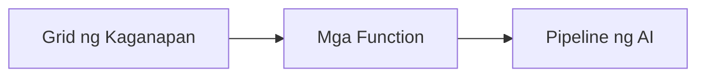

# Kabanata 8: Mga Pattern para sa Produksyon at Enterprise

**📚 Kurso**: [AZD For Beginners](../../README.md) | **⏱️ Tagal**: 2-3 oras | **⭐ Antas ng Kahirapan**: Mataas

---

## Pangkalahatang-ideya

Itong kabanata ay sumasaklaw sa mga enterprise-ready na pattern ng deployment, pagpapalakas ng seguridad, pagmamanman, at pag-optimize ng gastos para sa production AI workloads.

> Napatunayan laban sa `azd 1.23.12` noong Marso 2026.

## Mga Layunin sa Pagkatuto

Sa pagtatapos ng kabanatang ito, magagawa mo ang mga sumusunod:
- Mag-deploy ng mga aplikasyong matatag sa maraming rehiyon
- Ipatupad ang mga enterprise na pattern ng seguridad
- I-configure ang komprehensibong pagmamanman
- I-optimize ang gastos sa malakihang antas
- I-set up ang mga pipeline ng CI/CD gamit ang AZD

---

## 📚 Mga Aralin

| # | Aralin | Paglalarawan | Oras |
|---|--------|-------------|------|
| 1 | [Production AI Practices](production-ai-practices.md) | Mga pattern ng deployment para sa enterprise | 90 min |

---

## 🚀 Checklist para sa Produksyon

- [ ] Pag-deploy sa maraming rehiyon para sa katatagan
- [ ] Managed identity para sa pagpapatunay (walang mga key)
- [ ] Application Insights para sa pagmamanman
- [ ] Mga badyet at alerto sa gastos na naka-configure
- [ ] Pinagana ang pag-scan ng seguridad
- [ ] Integrasyon ng CI/CD pipeline
- [ ] Plano para sa disaster recovery

---

## 🏗️ Mga Pattern ng Arkitektura

### Patterna 1: Microservices AI


### Patterna 2: Event-Driven AI


---

## 🔐 Pinakamahuhusay na Praktika sa Seguridad

```bicep
// Use managed identity
identity: {
  type: 'SystemAssigned'
}

// Private endpoints for AI services
properties: {
  publicNetworkAccess: 'Disabled'
  networkAcls: {
    defaultAction: 'Deny'
  }
}
```

---

## 💰 Pag-optimize ng Gastos

| Estratehiya | Pag-iimpok |
|----------|---------|
| I-scale sa zero (Container Apps) | 60-80% |
| Gamitin ang consumption tiers para sa dev | 50-70% |
| Nakaiskedyul na scaling | 30-50% |
| Nakalaan na kapasidad | 20-40% |

```bash
# Itakda ang mga alerto sa badyet
az consumption budget create \
  --budget-name "AI-Budget" \
  --amount 500 \
  --category Cost \
  --time-grain Monthly
```

---

## 📊 Pagtatakda ng Pagmamanman

```bash
# I-stream ang mga log
azd monitor --logs

# Suriin ang Application Insights
azd monitor --overview

# Tingnan ang mga sukatan
az monitor metrics list --resource <resource-id>
```

---

## 🔗 Navigasyon

| Direksyon | Kabanata |
|-----------|---------|
| **Nakaraang** | [Kabanata 7: Pag-troubleshoot](../chapter-07-troubleshooting/README.md) |
| **Kumpletong Kurso** | [Pahina ng Kurso](../../README.md) |

---

## 📖 Mga Kaugnay na Mapagkukunan

- [AI Agents Guide](../chapter-02-ai-development/agents.md)
- [Application Insights](../chapter-06-pre-deployment/application-insights.md)
- [Multi-Agent Solutions](../chapter-05-multi-agent/README.md)
- [Microservices Example](../../examples/microservices/README.md)

---

<!-- CO-OP TRANSLATOR DISCLAIMER START -->
**Disclaimer**:
Ang dokumentong ito ay isinalin gamit ang AI na serbisyo ng pagsasalin [Co-op Translator](https://github.com/Azure/co-op-translator). Bagaman nagsusumikap kami para sa katumpakan, pakitandaan na ang mga awtomatikong pagsasalin ay maaaring maglaman ng mga pagkakamali o hindi pagkakatumpak. Ang orihinal na dokumento sa orihinal nitong wika ang dapat ituring na awtoritatibong pinagmulan. Para sa mahahalagang impormasyon, inirerekomenda ang propesyonal na pagsasaling ginawa ng tao. Hindi kami mananagot sa anumang hindi pagkakaunawaan o maling interpretasyon na nagmumula sa paggamit ng pagsasaling ito.
<!-- CO-OP TRANSLATOR DISCLAIMER END -->