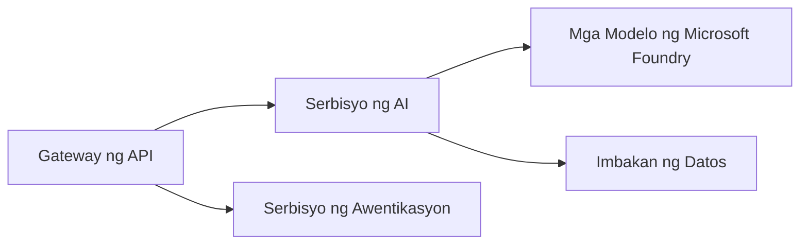
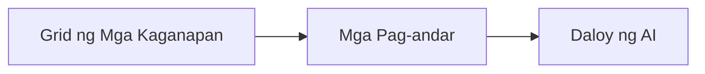

# Kabanata 8: Mga Pattern sa Produksyon at Enterprise

**📚 Kurso**: [AZD Para sa Nagsisimula](../../README.md) | **⏱️ Tagal**: 2-3 oras | **⭐ Antas ng Kahirapan**: Mataas

---

## Pangkalahatang-ideya

Sinasaklaw ng kabanatang ito ang mga enterprise-ready na pattern ng pag-deploy, pagpapatibay ng seguridad, pagmo-monitor, at pag-optimize ng gastos para sa mga workload ng AI sa produksyon.

> Na-validate gamit ang `azd 1.25.6` noong Hunyo 2026.

## Mga Layunin sa Pagkatuto

Sa pagtatapos ng kabanatang ito, magagawa mo:
- Mag-deploy ng mga resilient na aplikasyon sa maraming rehiyon
- Magpatupad ng mga pattern ng seguridad para sa enterprise
- I-configure ang komprehensibong pagmo-monitor
- I-optimize ang mga gastos sa malaking sukat
- I-set up ang CI/CD pipelines gamit ang AZD

---

## 📚 Mga Aralin

| # | Aralin | Paglalarawan | Oras |
|---|--------|-------------|------|
| 1 | [Mga Kasanayan sa Produksyon ng AI](production-ai-practices.md) | Mga pattern ng pag-deploy para sa enterprise | 90 min |

---

## 🚀 Checklist ng Produksyon

- [ ] Pag-deploy sa maraming rehiyon para sa pagiging matatag
- [ ] Pinamamahalaang identity para sa pagpapatunay (walang mga susi)
- [ ] Application Insights para sa pagmo-monitor
- [ ] Na-configure ang mga budget sa gastos at mga alerto
- [ ] Pinagana ang security scanning
- [ ] Integrasyon ng CI/CD pipeline
- [ ] Plano para sa disaster recovery

---

## 🏗️ Mga Pattern ng Arkitektura

### Pattern 1: Microservices AI



### Pattern 2: Event-Driven AI



---

## 🔐 Mga Pinakamahuhusay na Praktis sa Seguridad

```bicep
// Use managed identity
identity: {
  type: 'SystemAssigned'
}

// Private endpoints for AI services
properties: {
  publicNetworkAccess: 'Disabled'
  networkAcls: {
    defaultAction: 'Deny'
  }
}
```

---

## 💰 Pag-optimize ng Gastos

| Estratehiya | Pag-iimpok |
|----------|---------|
| I-scale hanggang zero (Container Apps) | 60-80% |
| Gamitin ang consumption tiers para sa dev | 50-70% |
| Nakaiskedyul na scaling | 30-50% |
| Nakalaan na kapasidad | 20-40% |

```bash
# Itakda ang mga alerto sa badyet
az consumption budget create \
  --budget-name "AI-Budget" \
  --amount 500 \
  --category Cost \
  --time-grain Monthly
```

---

## 📊 Pagsasaayos ng Pagmo-monitor

```bash
# I-stream ang mga log
azd monitor --logs

# Suriin ang Application Insights
azd monitor --overview

# Tingnan ang mga metric
az monitor metrics list --resource <resource-id>
```

---

## 🔗 Nabigasyon

| Direksyon | Kabanata |
|-----------|---------|
| **Nakaraan** | [Kabanata 7: Pag-troubleshoot](../chapter-07-troubleshooting/README.md) |
| **Course Complete** | [Home ng Kurso](../../README.md) |

---

## 📖 Mga Kaugnay na Mapagkukunan

- [Gabay sa AI Agents](../chapter-02-ai-development/agents.md)
- [Application Insights](../chapter-06-pre-deployment/application-insights.md)
- [Mga Solusyong Multi-Agent](../chapter-05-multi-agent/README.md)
- [Halimbawa ng Microservices](../../examples/microservices/README.md)

---

<!-- CO-OP TRANSLATOR DISCLAIMER START -->
**Pagtatanggi**:
Ang dokumentong ito ay isinalin gamit ang serbisyo ng AI translation na [Co-op Translator](https://github.com/Azure/co-op-translator). Bagama't nagsusumikap kami para sa katumpakan, pakatandaan na ang awtomatikong pagsasalin ay maaaring maglaman ng mga pagkakamali o hindi pagkakatugma. Ang orihinal na dokumento sa orihinal nitong wika ang dapat ituring na pangunahing sanggunian. Para sa mahahalagang impormasyon, inirerekomenda ang propesyonal na pagsasalin ng tao. Hindi kami mananagot sa anumang maling pagkakaintindi o maling interpretasyon na nagmula sa paggamit ng pagsasaling ito.
<!-- CO-OP TRANSLATOR DISCLAIMER END -->