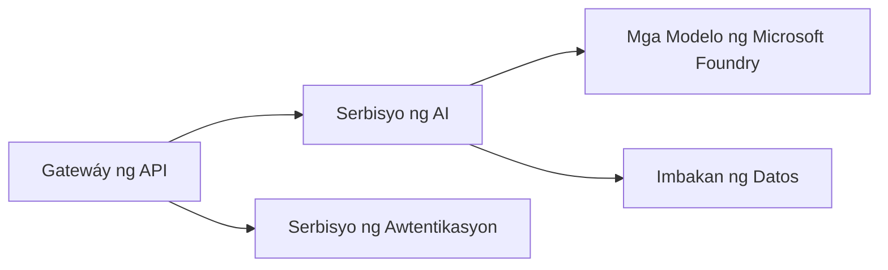
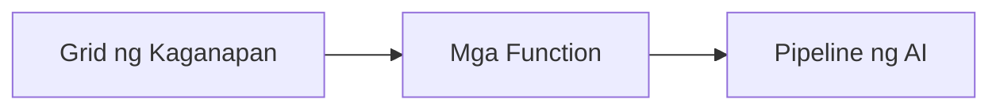

# Kabanata 8: Mga Pattern sa Produksyon at Enterprise

**📚 Course**: [AZD Para sa mga Nagsisimula](../../README.md) | **⏱️ Duration**: 2-3 oras | **⭐ Complexity**: Advanced

---

## Pangkalahatang-ideya

Sinasaklaw ng kabanatang ito ang mga enterprise-ready na pattern ng deployment, pagpapatibay ng seguridad, pagmamanman, at pag-optimize ng gastos para sa mga production AI workload.

## Mga Layunin sa Pagkatuto

Sa pagtatapos ng kabanatang ito, magagawa mo:
- Mag-deploy ng mga aplikasyong matatag sa maraming rehiyon
- Magpatupad ng mga pattern ng seguridad para sa enterprise
- I-configure ang komprehensibong pagmamanman
- I-optimize ang mga gastos sa malakihang sukat
- Itakda ang mga pipeline ng CI/CD gamit ang AZD

---

## 📚 Mga Aralin

| # | Aralin | Paglalarawan | Oras |
|---|--------|-------------|------|
| 1 | [Mga Praktika sa Produksyon ng AI](production-ai-practices.md) | Mga pattern ng deployment para sa enterprise | 90 min |

---

## 🚀 Checklist para sa Produksyon

- [ ] Pag-deploy sa maraming rehiyon para sa katatagan
- [ ] Managed identity para sa authentication (walang mga susi)
- [ ] Application Insights para sa pagmamanman
- [ ] Mga budget at alerto para sa gastos na naka-configure
- [ ] Pinagana ang pag-scan ng seguridad
- [ ] Integrasyon ng pipeline ng CI/CD
- [ ] Plano para sa disaster recovery

---

## 🏗️ Mga Pattern ng Arkitektura

### Pattern 1: Microservices AI


### Pattern 2: Event-Driven AI


---

## 🔐 Mga Pinakamahuhusay na Praktika sa Seguridad

```bicep
// Use managed identity
identity: {
  type: 'SystemAssigned'
}

// Private endpoints for AI services
properties: {
  publicNetworkAccess: 'Disabled'
  networkAcls: {
    defaultAction: 'Deny'
  }
}
```

---

## 💰 Pag-optimize ng Gastos

| Estratehiya | Tipid |
|----------|---------|
| I-scale hanggang zero (Container Apps) | 60-80% |
| Gamitin ang consumption tiers para sa dev | 50-70% |
| Nakaiskedyul na scaling | 30-50% |
| Nakareserbang kapasidad | 20-40% |

```bash
# Itakda ang mga alerto sa badyet
az consumption budget create \
  --budget-name "AI-Budget" \
  --amount 500 \
  --category Cost \
  --time-grain Monthly
```

---

## 📊 Pagsasaayos ng Pagmamanman

```bash
# I-stream ang mga log
azd monitor --logs

# Suriin ang Application Insights
azd monitor

# Tingnan ang mga sukatan
az monitor metrics list --resource <resource-id>
```

---

## 🔗 Nabigasyon

| Direksyon | Kabanata |
|-----------|---------|
| **Nakaraan** | [Kabanata 7: Pag-troubleshoot](../chapter-07-troubleshooting/README.md) |
| **Kumpletong Kurso** | [Home ng Kurso](../../README.md) |

---

## 📖 Mga Kaugnay na Mapagkukunan

- [Gabay sa AI Agents](../chapter-02-ai-development/agents.md)
- [Application Insights](../chapter-06-pre-deployment/application-insights.md)
- [Mga Solusyon ng Multi-Agent](../chapter-05-multi-agent/README.md)
- [Halimbawa ng Microservices](../../examples/microservices/README.md)

---

<!-- CO-OP TRANSLATOR DISCLAIMER START -->
**Paunawa**:
Ang dokumentong ito ay isinalin gamit ang serbisyong pagsasalin ng AI na [Co-op Translator](https://github.com/Azure/co-op-translator). Bagaman nagsusumikap kami para sa katumpakan, pakitandaan na ang mga awtomatikong pagsasalin ay maaaring maglaman ng mga pagkakamali o hindi tumpak na impormasyon. Ang orihinal na dokumento sa orihinal nitong wika ang dapat ituring bilang opisyal na sanggunian. Para sa mahahalagang impormasyon, inirerekomenda ang propesyonal na pagsasalin ng tao. Hindi kami mananagot sa anumang hindi pagkakaintindihan o maling interpretasyon na nagmumula sa paggamit ng pagsasaling ito.
<!-- CO-OP TRANSLATOR DISCLAIMER END -->