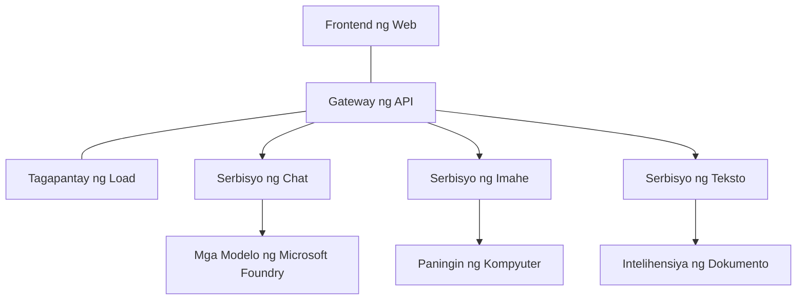

# Pinakamahusay na Kasanayan para sa Production AI Workloads gamit ang AZD

**Pag-navigate ng Kabanata:**
- **📚 Tahanan ng Kurso**: [AZD Para sa mga Nagsisimula](../../README.md)
- **📖 Kasalukuyang Kabanata**: Kabanata 8 - Mga Pattern para sa Produksyon at Enterprise
- **⬅️ Nakaraang Kabanata**: [Kabanata 7: Pag-troubleshoot](../chapter-07-troubleshooting/debugging.md)
- **⬅️ Kaugnay din**: [AI Workshop Lab](ai-workshop-lab.md)
- **🎯 Kumpletong Kurso**: [AZD Para sa mga Nagsisimula](../../README.md)

## Pangkalahatang-ideya

Ang gabay na ito ay nagbibigay ng komprehensibong pinakamahusay na kasanayan para sa pag-deploy ng production-ready AI workloads gamit ang Azure Developer CLI (AZD). Batay sa feedback mula sa komunidad ng Microsoft Foundry Discord at mga tunay na deployment ng customer, tinutugunan ng mga kasanayang ito ang mga pinaka-karaniwang hamon sa production AI systems.

## Mga Pangunahing Hamong Tinugunan

Batay sa resulta ng aming poll sa komunidad, ito ang mga pangunahing hamon na kinakaharap ng mga developer:

- **45%** nahihirapan sa multi-service AI deployments
- **38%** may isyu sa pamamahala ng kredensyal at mga lihim  
- **35%** nahihirapan sa pagiging handa para sa produksyon at pag-scale
- **32%** kailangan ng mas mahusay na mga estratehiya sa pag-optimize ng gastos
- **29%** nangangailangan ng pinahusay na pagsubaybay at pag-troubleshoot

## Mga Arkitekturang Pattern para sa Production AI

### Pattern 1: Microservices AI Architecture

**Kailan gagamitin**: Mga komplikadong AI application na may maraming kakayahan


**AZD Implementation**:

```yaml
# azure.yaml
name: enterprise-ai-platform
services:
  web:
    project: ./web
    host: staticwebapp
  api-gateway:
    project: ./api-gateway
    host: containerapp
  chat-service:
    project: ./services/chat
    host: containerapp
  vision-service:
    project: ./services/vision
    host: containerapp
  text-service:
    project: ./services/text
    host: containerapp
```

### Pattern 2: Event-Driven AI Processing

**Kailan gagamitin**: Batch processing, pagsusuri ng dokumento, async workflows

```bicep
// Event Hub for AI processing pipeline
resource eventHub 'Microsoft.EventHub/namespaces@2023-01-01-preview' = {
  name: eventHubNamespaceName
  location: location
  sku: {
    name: 'Standard'
    tier: 'Standard'
    capacity: 1
  }
}

// Service Bus for reliable message processing
resource serviceBus 'Microsoft.ServiceBus/namespaces@2022-10-01-preview' = {
  name: serviceBusNamespaceName
  location: location
  sku: {
    name: 'Premium'
    tier: 'Premium'
    capacity: 1
  }
}

// Function App for processing
resource functionApp 'Microsoft.Web/sites@2023-01-01' = {
  name: functionAppName
  location: location
  kind: 'functionapp,linux'
  properties: {
    siteConfig: {
      appSettings: [
        {
          name: 'FUNCTIONS_EXTENSION_VERSION'
          value: '~4'
        }
        {
          name: 'AZURE_OPENAI_ENDPOINT'
          value: '@Microsoft.KeyVault(VaultName=${keyVault.name};SecretName=openai-endpoint)'
        }
      ]
    }
  }
}
```

## Pag-iisip Tungkol sa Kalusugan ng AI Agent

Kapag ang tradisyonal na web app ay nagkakaroon ng sira, pamilyar ang mga sintomas: hindi naglo-load ang pahina, nagbabalik ang API ng error, o nabibigo ang deployment. Ang mga AI-powered na aplikasyon ay maaaring masira sa lahat ng mga parehong paraan—ngunit maaari rin silang gumalaw nang hindi gaanong halata na hindi nagpapakita ng maliwanag na mga mensahe ng error.

Tinutulungan ka ng seksyong ito na bumuo ng mental model para sa pagsubaybay ng AI workloads para malaman mo kung saan titingnan kapag may hindi tama.

### Paano Naiiba ang Kalusugan ng Agent mula sa Tradisyonal na Kalusugan ng App

Ang tradisyonal na app ay gumagana o hindi. Ang AI agent ay maaaring magmukhang gumagana ngunit magbigay ng mahihinang resulta. Isipin ang kalusugan ng agent sa dalawang layer:

| Patong | Ano ang Bantayan | Saan Tingnan |
|-------|------------------|---------------|
| **Kalusugan ng imprastruktura** | Tumatakbo ba ang serbisyo? Na-provision ba ang mga resource? Maaabot ba ang mga endpoint? | `azd monitor`, Azure Portal resource health, container/app logs |
| **Kalusugan ng pag-uugali** | Tumutugon ba ang agent nang tama? Napapanahon ba ang mga tugon? Tama bang tinatawag ang modelo? | Application Insights traces, model call latency metrics, response quality logs |

Pamilyar ang kalusugan ng imprastruktura—pareho ito para sa anumang azd app. Ang kalusugan ng pag-uugali ang bagong layer na ipinakikilala ng AI workloads.

### Saan Titingnan Kapag Hindi Gumagana ayon sa Inaasahan ang AI Apps

Kung ang iyong AI application ay hindi nagbibigay ng inaasahang resulta, narito ang isang konseptwal na checklist:

1. **Magsimula sa mga batayan.** Tumakbo ba ang app? Maaabot ba ang mga dependency nito? Suriin ang `azd monitor` at resource health tulad ng gagawin mo sa anumang app.
2. **Suriin ang koneksyon sa modelo.** Matagumpay bang tinatawag ng iyong aplikasyon ang AI model? Ang nabigong o nag-timeout na mga tawag sa modelo ang pinaka-karaniwang dahilan ng mga isyu sa AI app at lalabas ito sa iyong application logs.
3. **Tingnan kung ano ang natanggap ng modelo.** Nakadepende ang mga tugon ng AI sa input (ang prompt at anumang nakuha na konteksto). Kung mali ang output, karaniwan ay mali ang input. Suriin kung ang iyong aplikasyon ay nagpapadala ng tamang data sa modelo.
4. **Review-in ang latency ng tugon.** Mas mabagal ang mga tawag sa AI model kaysa karaniwang mga API call. Kung mabagal ang app, suriin kung tumaas ang oras ng tugon ng modelo—maaaring magpahiwatig ito ng throttling, limitasyon sa kapasidad, o congestion sa antas ng rehiyon.
5. **Bantayan ang mga senyales ng gastos.** Ang hindi inaasahang pagtaas sa paggamit ng token o mga API call ay maaaring magpahiwatig ng loop, maling naka-configure na prompt, o labis na retries.

Hindi mo kailangang maging dalubhasa sa mga observability tooling agad. Ang pangunahing aral ay may dagdag na layer ng pag-uugali na dapat subaybayan ang mga AI application, at ang built-in na pagsubaybay ng azd (`azd monitor`) ay nagbibigay sa iyo ng panimulang punto para imbestigahan ang parehong mga layer.

---

## Pinakamahusay na Kasanayan sa Seguridad

### 1. Zero-Trust Security Model

**Estratehiya ng Implementasyon**:
- Walang komunikasyon ng serbisyo-sa-serbisyo nang walang awtentikasyon
- Lahat ng tawag sa API ay gumagamit ng managed identities
- Isolasyon ng network gamit ang private endpoints
- Kontrol ng access na may pinakamababang pribilehiyo

```bicep
// Managed Identity for each service
resource chatServiceIdentity 'Microsoft.ManagedIdentity/userAssignedIdentities@2023-01-31' = {
  name: 'chat-service-identity'
  location: location
}

// Role assignments with minimal permissions
resource openAIUserRole 'Microsoft.Authorization/roleAssignments@2022-04-01' = {
  scope: openAIAccount
  name: guid(openAIAccount.id, chatServiceIdentity.id, openAIUserRoleDefinitionId)
  properties: {
    roleDefinitionId: subscriptionResourceId('Microsoft.Authorization/roleDefinitions', '5e0bd9bd-7b93-4f28-af87-19fc36ad61bd')
    principalId: chatServiceIdentity.properties.principalId
    principalType: 'ServicePrincipal'
  }
}
```

### 2. Secure Secret Management

**Pattern ng Integrasyon ng Key Vault**:

```bicep
// Key Vault with proper access policies
resource keyVault 'Microsoft.KeyVault/vaults@2023-02-01' = {
  name: keyVaultName
  location: location
  properties: {
    tenantId: tenant().tenantId
    sku: {
      family: 'A'
      name: 'premium'  // Use premium for production
    }
    enableRbacAuthorization: true  // Use RBAC instead of access policies
    enablePurgeProtection: true    // Prevent accidental deletion
    enableSoftDelete: true
    softDeleteRetentionInDays: 90
  }
}

// Store all AI service credentials
resource openAIKeySecret 'Microsoft.KeyVault/vaults/secrets@2023-02-01' = {
  parent: keyVault
  name: 'openai-api-key'
  properties: {
    value: openAIAccount.listKeys().key1
    attributes: {
      enabled: true
    }
  }
}
```

### 3. Network Security

**Konfigurasyon ng Private Endpoint**:

```bicep
// Virtual Network for AI services
resource virtualNetwork 'Microsoft.Network/virtualNetworks@2023-04-01' = {
  name: vnetName
  location: location
  properties: {
    addressSpace: {
      addressPrefixes: ['10.0.0.0/16']
    }
    subnets: [
      {
        name: 'ai-services-subnet'
        properties: {
          addressPrefix: '10.0.1.0/24'
          privateEndpointNetworkPolicies: 'Disabled'
        }
      }
      {
        name: 'app-services-subnet'
        properties: {
          addressPrefix: '10.0.2.0/24'
          delegations: [
            {
              name: 'Microsoft.Web/serverFarms'
              properties: {
                serviceName: 'Microsoft.Web/serverFarms'
              }
            }
          ]
        }
      }
    ]
  }
}

// Private endpoints for all AI services
resource openAIPrivateEndpoint 'Microsoft.Network/privateEndpoints@2023-04-01' = {
  name: '${openAIAccountName}-pe'
  location: location
  properties: {
    subnet: {
      id: virtualNetwork.properties.subnets[0].id
    }
    privateLinkServiceConnections: [
      {
        name: 'openai-connection'
        properties: {
          privateLinkServiceId: openAIAccount.id
          groupIds: ['account']
        }
      }
    ]
  }
}
```

## Pagganap at Pag-scale

### 1. Mga Estratehiya sa Auto-Scaling

**Auto-scaling para sa Container Apps**:

```bicep
resource containerApp 'Microsoft.App/containerApps@2023-05-01' = {
  name: containerAppName
  location: location
  properties: {
    configuration: {
      ingress: {
        external: true
        targetPort: 8000
        transport: 'http'
      }
    }
    template: {
      scale: {
        minReplicas: 2  // Always have 2 instances minimum
        maxReplicas: 50 // Scale up to 50 for high load
        rules: [
          {
            name: 'http-scaling'
            http: {
              metadata: {
                concurrentRequests: '20'  // Scale when >20 concurrent requests
              }
            }
          }
          {
            name: 'cpu-scaling'
            custom: {
              type: 'cpu'
              metadata: {
                type: 'Utilization'
                value: '70'  // Scale when CPU >70%
              }
            }
          }
        ]
      }
    }
  }
}
```

### 2. Mga Estratehiya sa Caching

**Redis Cache para sa mga Tugon ng AI**:

```bicep
// Redis Premium for production workloads
resource redisCache 'Microsoft.Cache/redis@2023-04-01' = {
  name: redisCacheName
  location: location
  properties: {
    sku: {
      name: 'Premium'
      family: 'P'
      capacity: 1
    }
    enableNonSslPort: false
    minimumTlsVersion: '1.2'
    redisConfiguration: {
      'maxmemory-policy': 'allkeys-lru'
    }
    // Enable clustering for high availability
    redisVersion: '6.0'
    shardCount: 2
  }
}

// Cache configuration in application
var cacheConnectionString = '${redisCache.properties.hostName}:6380,password=${redisCache.listKeys().primaryKey},ssl=True,abortConnect=False'
```

### 3. Load Balancing at Pamamahala ng Trapiko

**Application Gateway na may WAF**:

```bicep
// Application Gateway with Web Application Firewall
resource applicationGateway 'Microsoft.Network/applicationGateways@2023-04-01' = {
  name: appGatewayName
  location: location
  properties: {
    sku: {
      name: 'WAF_v2'
      tier: 'WAF_v2'
      capacity: 2
    }
    webApplicationFirewallConfiguration: {
      enabled: true
      firewallMode: 'Prevention'
      ruleSetType: 'OWASP'
      ruleSetVersion: '3.2'
    }
    // Backend pools for AI services
    backendAddressPools: [
      {
        name: 'ai-services-pool'
        properties: {
          backendAddresses: [
            {
              fqdn: '${containerApp.properties.configuration.ingress.fqdn}'
            }
          ]
        }
      }
    ]
  }
}
```

## 💰 Pag-optimize ng Gastos

### 1. Pagtatakda ng Tamang Sukat ng mga Resource

**Mga Konfigurasyon Batay sa Kapaligiran**:

```bash
# Kapaligiran ng pag-unlad
azd env new development
azd env set AZURE_OPENAI_SKU "S0"
azd env set AZURE_OPENAI_CAPACITY 10
azd env set AZURE_SEARCH_SKU "basic"
azd env set CONTAINER_CPU 0.5
azd env set CONTAINER_MEMORY 1.0

# Kapaligiran ng produksyon
azd env new production
azd env set AZURE_OPENAI_SKU "S0"
azd env set AZURE_OPENAI_CAPACITY 100
azd env set AZURE_SEARCH_SKU "standard"
azd env set CONTAINER_CPU 2.0
azd env set CONTAINER_MEMORY 4.0
```

### 2. Pagsubaybay ng Gastos at mga Badyet

```bicep
// Cost management and budgets
resource budget 'Microsoft.Consumption/budgets@2023-05-01' = {
  name: 'ai-workload-budget'
  properties: {
    timePeriod: {
      startDate: '2024-01-01'
      endDate: '2024-12-31'
    }
    timeGrain: 'Monthly'
    amount: 2000  // $2000 monthly budget
    category: 'Cost'
    notifications: {
      warning: {
        enabled: true
        operator: 'GreaterThan'
        threshold: 80
        contactEmails: [
          'finance@company.com'
          'engineering@company.com'
        ]
        contactRoles: [
          'Owner'
          'Contributor'
        ]
      }
      critical: {
        enabled: true
        operator: 'GreaterThan'
        threshold: 95
        contactEmails: [
          'cto@company.com'
        ]
      }
    }
  }
}
```

### 3. Pag-optimize ng Paggamit ng Token

**OpenAI Cost Management**:

```typescript
// Pag-optimize ng token sa antas ng aplikasyon
class TokenOptimizer {
  private readonly maxTokens = 4000;
  private readonly reserveTokens = 500;
  
  optimizePrompt(userInput: string, context: string): string {
    const availableTokens = this.maxTokens - this.reserveTokens;
    const estimatedTokens = this.estimateTokens(userInput + context);
    
    if (estimatedTokens > availableTokens) {
      // Paikliin ang konteksto, hindi ang input ng gumagamit
      context = this.truncateContext(context, availableTokens - this.estimateTokens(userInput));
    }
    
    return `${context}\n\nUser: ${userInput}`;
  }
  
  private estimateTokens(text: string): number {
    // Tinatayang: 1 token ≈ 4 na karakter
    return Math.ceil(text.length / 4);
  }
}
```

## Pagsubaybay at Kakayahang Masubaybayan

### 1. Komprehensibong Application Insights

```bicep
// Application Insights with advanced features
resource applicationInsights 'Microsoft.Insights/components@2020-02-02' = {
  name: applicationInsightsName
  location: location
  kind: 'web'
  properties: {
    Application_Type: 'web'
    WorkspaceResourceId: logAnalyticsWorkspace.id
    SamplingPercentage: 100  // Full sampling for AI apps
    DisableIpMasking: false  // Enable for security
  }
}

// Custom metrics for AI operations
resource aiMetricAlerts 'Microsoft.Insights/metricAlerts@2018-03-01' = {
  name: 'ai-high-error-rate'
  location: 'global'
  properties: {
    description: 'Alert when AI service error rate is high'
    severity: 2
    enabled: true
    scopes: [
      applicationInsights.id
    ]
    evaluationFrequency: 'PT1M'
    windowSize: 'PT5M'
    criteria: {
      'odata.type': 'Microsoft.Azure.Monitor.SingleResourceMultipleMetricCriteria'
      allOf: [
        {
          name: 'high-error-rate'
          metricName: 'requests/failed'
          operator: 'GreaterThan'
          threshold: 10
          timeAggregation: 'Count'
        }
      ]
    }
  }
}
```

### 2. Monitoring na Espesipiko sa AI

**Mga Custom Dashboard para sa AI Metrics**:

```json
// Dashboard configuration for AI workloads
{
  "dashboard": {
    "name": "AI Application Monitoring",
    "tiles": [
      {
        "name": "OpenAI Request Volume",
        "query": "requests | where name contains 'openai' | summarize count() by bin(timestamp, 5m)"
      },
      {
        "name": "AI Response Latency",
        "query": "requests | where name contains 'openai' | summarize avg(duration) by bin(timestamp, 5m)"
      },
      {
        "name": "Token Usage",
        "query": "customMetrics | where name == 'openai_tokens_used' | summarize sum(value) by bin(timestamp, 1h)"
      },
      {
        "name": "Cost per Hour",
        "query": "customMetrics | where name == 'openai_cost' | summarize sum(value) by bin(timestamp, 1h)"
      }
    ]
  }
}
```

### 3. Health Checks at Pagsubaybay ng Uptime

```bicep
// Application Insights availability tests
resource availabilityTest 'Microsoft.Insights/webtests@2022-06-15' = {
  name: 'ai-app-availability-test'
  location: location
  tags: {
    'hidden-link:${applicationInsights.id}': 'Resource'
  }
  properties: {
    SyntheticMonitorId: 'ai-app-availability-test'
    Name: 'AI Application Availability Test'
    Description: 'Tests AI application endpoints'
    Enabled: true
    Frequency: 300  // 5 minutes
    Timeout: 120    // 2 minutes
    Kind: 'ping'
    Locations: [
      {
        Id: 'us-east-2-azr'
      }
      {
        Id: 'us-west-2-azr'
      }
    ]
    Configuration: {
      WebTest: '''
        <WebTest Name="AI Health Check" 
                 Id="8d2de8d2-a2b0-4c2e-9a0d-8f9c9a0b8c8d" 
                 Enabled="True" 
                 CssProjectStructure="" 
                 CssIteration="" 
                 Timeout="120" 
                 WorkItemIds="" 
                 xmlns="http://microsoft.com/schemas/VisualStudio/TeamTest/2010" 
                 Description="" 
                 CredentialUserName="" 
                 CredentialPassword="" 
                 PreAuthenticate="True" 
                 Proxy="default" 
                 StopOnError="False" 
                 RecordedResultFile="" 
                 ResultsLocale="">
          <Items>
            <Request Method="GET" 
                     Guid="a5f10126-e4cd-570d-961c-cea43999a200" 
                     Version="1.1" 
                     Url="${webApp.properties.defaultHostName}/health" 
                     ThinkTime="0" 
                     Timeout="120" 
                     ParseDependentRequests="True" 
                     FollowRedirects="True" 
                     RecordResult="True" 
                     Cache="False" 
                     ResponseTimeGoal="0" 
                     Encoding="utf-8" 
                     ExpectedHttpStatusCode="200" 
                     ExpectedResponseUrl="" 
                     ReportingName="" 
                     IgnoreHttpStatusCode="False" />
          </Items>
        </WebTest>
      '''
    }
  }
}
```

## Pagbawi sa Sakuna at Mataas na Availability

### 1. Deployment sa Maramihang Rehiyon

```yaml
# azure.yaml - Multi-region configuration
name: ai-app-multiregion
services:
  api-primary:
    project: ./api
    host: containerapp
    env:
      - AZURE_REGION=eastus
  api-secondary:
    project: ./api
    host: containerapp
    env:
      - AZURE_REGION=westus2
```

```bicep
// Traffic Manager for global load balancing
resource trafficManager 'Microsoft.Network/trafficManagerProfiles@2022-04-01' = {
  name: trafficManagerProfileName
  location: 'global'
  properties: {
    profileStatus: 'Enabled'
    trafficRoutingMethod: 'Priority'
    dnsConfig: {
      relativeName: trafficManagerProfileName
      ttl: 30
    }
    monitorConfig: {
      protocol: 'HTTPS'
      port: 443
      path: '/health'
      intervalInSeconds: 30
      toleratedNumberOfFailures: 3
      timeoutInSeconds: 10
    }
    endpoints: [
      {
        name: 'primary-endpoint'
        type: 'Microsoft.Network/trafficManagerProfiles/azureEndpoints'
        properties: {
          targetResourceId: primaryAppService.id
          endpointStatus: 'Enabled'
          priority: 1
        }
      }
      {
        name: 'secondary-endpoint'
        type: 'Microsoft.Network/trafficManagerProfiles/azureEndpoints'
        properties: {
          targetResourceId: secondaryAppService.id
          endpointStatus: 'Enabled'
          priority: 2
        }
      }
    ]
  }
}
```

### 2. Pag-backup at Pagbawi ng Data

```bicep
// Backup configuration for critical data
resource backupVault 'Microsoft.DataProtection/backupVaults@2023-05-01' = {
  name: backupVaultName
  location: location
  identity: {
    type: 'SystemAssigned'
  }
  properties: {
    storageSettings: [
      {
        datastoreType: 'VaultStore'
        type: 'LocallyRedundant'
      }
    ]
  }
}

// Backup policy for AI models and data
resource backupPolicy 'Microsoft.DataProtection/backupVaults/backupPolicies@2023-05-01' = {
  parent: backupVault
  name: 'ai-data-backup-policy'
  properties: {
    policyRules: [
      {
        backupParameters: {
          backupType: 'Full'
          objectType: 'AzureBackupParams'
        }
        trigger: {
          schedule: {
            repeatingTimeIntervals: [
              'R/2024-01-01T02:00:00+00:00/P1D'  // Daily at 2 AM
            ]
          }
          objectType: 'ScheduleBasedTriggerContext'
        }
        dataStore: {
          datastoreType: 'VaultStore'
          objectType: 'DataStoreInfoBase'
        }
        name: 'BackupDaily'
        objectType: 'AzureBackupRule'
      }
    ]
  }
}
```

## DevOps at Integrasyon ng CI/CD

### 1. GitHub Actions Workflow

```yaml
# .github/workflows/deploy-ai-app.yml
name: Deploy AI Application

on:
  push:
    branches: [main]
  pull_request:
    branches: [main]

jobs:
  test:
    runs-on: ubuntu-latest
    steps:
      - uses: actions/checkout@v4
      
      - name: Setup Python
        uses: actions/setup-python@v4
        with:
          python-version: '3.11'
          
      - name: Install dependencies
        run: |
          pip install -r requirements.txt
          pip install pytest
          
      - name: Run tests
        run: pytest tests/
        
      - name: AI Safety Tests
        run: |
          python scripts/test_ai_safety.py
          python scripts/validate_prompts.py

  deploy-staging:
    needs: test
    if: github.event_name == 'pull_request'
    runs-on: ubuntu-latest
    steps:
      - uses: actions/checkout@v4
      
      - name: Setup AZD
        uses: Azure/setup-azd@v2
        
      - name: Login to Azure
        uses: azure/login@v1
        with:
          creds: ${{ secrets.AZURE_CREDENTIALS }}
          
      - name: Deploy to Staging
        run: |
          azd env select staging
          azd deploy

  deploy-production:
    needs: test
    if: github.ref == 'refs/heads/main'
    runs-on: ubuntu-latest
    steps:
      - uses: actions/checkout@v4
      
      - name: Setup AZD
        uses: Azure/setup-azd@v2
        
      - name: Login to Azure
        uses: azure/login@v1
        with:
          creds: ${{ secrets.AZURE_CREDENTIALS }}
          
      - name: Deploy to Production
        run: |
          azd env select production
          azd deploy
          
      - name: Run Production Health Checks
        run: |
          python scripts/health_check.py --env production
```

### 2. Pag-validate ng Imprastruktura

```bash
# scripts/validate_infrastructure.sh
#!/bin/bash

echo "Validating AI infrastructure deployment..."

# Suriin kung lahat ng kinakailangang serbisyo ay tumatakbo
services=("openai" "search" "storage" "keyvault")
for service in "${services[@]}"; do
    echo "Checking $service..."
    if ! az resource list --resource-type "Microsoft.CognitiveServices/accounts" --query "[?contains(name, '$service')]" -o tsv; then
        echo "ERROR: $service not found"
        exit 1
    fi
done

# Suriin ang mga deployment ng modelo ng OpenAI
echo "Validating OpenAI model deployments..."
models=$(az cognitiveservices account deployment list --name $AZURE_OPENAI_NAME --resource-group $AZURE_RESOURCE_GROUP --query "[].name" -o tsv)
if [[ ! $models == *"gpt-4.1-mini"* ]]; then
  echo "ERROR: Required model gpt-4.1-mini not deployed"
    exit 1
fi

# Subukan ang konektividad ng serbisyo ng AI
echo "Testing AI service connectivity..."
python scripts/test_connectivity.py

echo "Infrastructure validation completed successfully!"
```

## Checklist para sa Kahandaan sa Produksyon

### Seguridad ✅
- [ ] Lahat ng serbisyo ay gumagamit ng managed identities
- [ ] Mga lihim naka-imbak sa Key Vault
- [ ] Mga private endpoint na naka-configure
- [ ] Mga network security group na ipinatupad
- [ ] RBAC na may pinakamababang pribilehiyo
- [ ] WAF enabled sa mga public endpoint

### Pagganap ✅
- [ ] Auto-scaling na naka-configure
- [ ] Implementado ang caching
- [ ] Load balancing na naka-setup
- [ ] CDN para sa static na nilalaman
- [ ] Database connection pooling
- [ ] Pag-optimize ng paggamit ng token

### Pagsubaybay ✅
- [ ] Application Insights na naka-configure
- [ ] Mga custom metric na nakadefine
- [ ] Mga alerting rule na naka-setup
- [ ] Dashboard na ginawa
- [ ] Mga health check na ipinatupad
- [ ] Mga patakaran sa log retention

### Katatagan ✅
- [ ] Deployment sa maramihang rehiyon
- [ ] Plano para sa backup at pagbawi
- [ ] Mga circuit breaker na ipinatupad
- [ ] Mga retry policy na naka-configure
- [ ] Graceful degradation
- [ ] Mga health check endpoint

### Pamamahala ng Gastos ✅
- [ ] Mga alerto sa badyet na naka-configure
- [ ] Tamang sukat ng mga resource
- [ ] Nalapat ang mga diskwento para sa dev/test
- [ ] Mga reserved instance na binili
- [ ] Dashboard para sa pagsubaybay ng gastos
- [ ] Regular na pagsusuri ng gastos

### Pagsunod (Compliance) ✅
- [ ] Natutugunan ang mga kinakailangan sa residency ng data
- [ ] Naka-enable ang audit logging
- [ ] Naipatutupad ang mga patakaran ng pagsunod
- [ ] Naipatupad ang mga security baseline
- [ ] Regular na security assessment
- [ ] Plano para sa incident response

## Mga Benchmark ng Pagganap

### Tipikal na Mga Metric sa Produksyon

| Sukat | Target | Pagsubaybay |
|--------|--------|------------|
| **Response Time** | < 2 seconds | Application Insights |
| **Availability** | 99.9% | Uptime monitoring |
| **Error Rate** | < 0.1% | Application logs |
| **Token Usage** | < $500/month | Cost management |
| **Concurrent Users** | 1000+ | Load testing |
| **Recovery Time** | < 1 hour | Disaster recovery tests |

### Load Testing

```bash
# Script para sa load testing ng mga aplikasyon ng AI
python scripts/load_test.py \
  --endpoint https://your-ai-app.azurewebsites.net \
  --concurrent-users 100 \
  --duration 300 \
  --ramp-up 60
```

## 🤝 Mga Pinakamahusay na Kasanayan ng Komunidad

Batay sa feedback mula sa komunidad ng Microsoft Foundry Discord:

### Nangungunang Rekomendasyon mula sa Komunidad:

1. **Magsimula nang Maliit, I-scale Nang Paunti-unti**: Magsimula sa mga basic na SKU at i-scale pataas base sa aktwal na paggamit
2. **I-monitor ang Lahat**: Mag-set up ng komprehensibong pagsubaybay mula sa unang araw
3. **I-automate ang Seguridad**: Gamitin ang infrastructure as code para sa consistent na seguridad
4. **Subukan nang Mabuti**: Isama ang AI-specific testing sa iyong pipeline
5. **Magplano para sa Mga Gastos**: Subaybayan ang paggamit ng token at mag-set ng budget alerts agad

### Karaniwang Mga Pagkakamaling Iwasan:

- ❌ Pag-hardcode ng API keys sa code
- ❌ Hindi pagsasaayos ng tamang pagsubaybay
- ❌ Pagpapabaya sa pag-optimize ng gastos
- ❌ Hindi pagsubok ng mga failure scenario
- ❌ Pag-deploy nang walang health checks

## Mga AZD AI CLI Command at Extensions

Kasama sa AZD ang lumalawak na set ng AI-specific na command at extension na nagpapadali sa production AI workflows. Nilalagay ng mga tool na ito ang tulay sa pagitan ng lokal na development at production deployment para sa mga AI workload.

### Mga Extension ng AZD para sa AI

Gumagamit ang AZD ng extension system para magdagdag ng AI-specific na kakayahan. I-install at i-manage ang mga extension gamit ang:

```bash
# Ilista ang lahat ng magagamit na extension (kasama ang AI)
azd extension list

# Suriin ang mga detalye ng naka-install na extension
azd extension show azure.ai.agents

# I-install ang Foundry agents extension
azd extension install azure.ai.agents

# I-install ang fine-tuning extension
azd extension install azure.ai.finetune

# I-install ang extension para sa mga pasadyang modelo
azd extension install azure.ai.models

# I-upgrade ang lahat ng naka-install na extension
azd extension upgrade --all
```

**Available na AI extensions:**

| Extension | Layunin | Katayuan |
|-----------|---------|--------|
| `azure.ai.agents` | Foundry Agent Service management | Preview |
| `azure.ai.finetune` | Foundry model fine-tuning | Preview |
| `azure.ai.models` | Foundry custom models | Preview |
| `azure.coding-agent` | Coding agent configuration | Available |

### Pag-initialize ng Mga Proyektong Agent gamit ang `azd ai agent init`

Ang utos na `azd ai agent init` ay nag-scaffold ng production-ready AI agent project na naka-integrate sa Microsoft Foundry Agent Service:

```bash
# I-initialize ang bagong proyekto ng agent mula sa manifest ng agent
azd ai agent init -m <manifest-path-or-uri>

# I-initialize at i-target ang isang partikular na Foundry na proyekto
azd ai agent init -m agent-manifest.yaml --project-id <foundry-project-id>

# I-initialize gamit ang pasadyang direktoryo ng source
azd ai agent init -m agent-manifest.yaml --src ./agents/my-agent

# Itarget ang Container Apps bilang host
azd ai agent init -m agent-manifest.yaml --host containerapp
```

**Pangunahing flags:**

| Flag | Paglalarawan |
|------|-------------|
| `-m, --manifest` | Path o URI patungo sa isang agent manifest na idaragdag sa iyong proyekto |
| `-p, --project-id` | Umiiral na Microsoft Foundry Project ID para sa iyong azd kapaligiran |
| `-s, --src` | Direktoryo para i-download ang definisyon ng agent (default ay `src/<agent-id>`) |
| `--host` | I-override ang default na host (hal., `containerapp`) |
| `-e, --environment` | Ang kapaligiran ng azd na gagamitin |

**Tip para sa Produksyon**: Gamitin ang `--project-id` para kumonekta nang direkta sa umiiral na Foundry project, na pinananatiling naka-link ang iyong agent code at cloud resources mula pa sa simula.

### Model Context Protocol (MCP) gamit ang `azd mcp`

Kasama sa AZD ang built-in na suporta ng MCP server (Alpha), na nagpapahintulot sa mga AI agent at tool na makipag-interact sa iyong mga Azure resource sa pamamagitan ng isang standard na protocol:

```bash
# Simulan ang MCP server para sa iyong proyekto
azd mcp start

# Suriin ang kasalukuyang mga patakaran sa pahintulot ng Copilot para sa pagpapatupad ng mga tool
azd copilot consent list
```

Ipinapakita ng MCP server ang konteksto ng iyong azd project—mga kapaligiran, serbisyo, at mga Azure resource—sa mga AI-powered na development tool. Ito ay nagpapahintulot ng:

- **AI-assisted deployment**: Hayaan ang mga coding agent na i-query ang estado ng iyong proyekto at mag-trigger ng deployments
- **Resource discovery**: Maaaring tuklasin ng mga AI tool kung anong Azure resources ang ginagamit ng iyong proyekto
- **Pamamahala ng kapaligiran**: Maaaring lumipat ang mga agent sa pagitan ng dev/staging/production na mga kapaligiran

### Pag-generate ng Imprastruktura gamit ang `azd infra generate`

Para sa production AI workloads, maaari mong i-generate at i-customize ang Infrastructure as Code sa halip na umasa sa automatic provisioning:

```bash
# Gumawa ng mga Bicep/Terraform na file mula sa iyong paglalarawan ng proyekto
azd infra generate
```

Ito ay nagsusulat ng IaC sa disk upang maaari mong:
- Suriin at i-audit ang imprastruktura bago mag-deploy
- Magdagdag ng custom na security policy (network rules, private endpoints)
- I-integrate sa umiiral na IaC review processes
- I-version control ang mga pagbabago sa imprastruktura nang hiwalay mula sa application code

### Mga Hook ng Lifecycle para sa Produksyon

Pinapayagan ka ng mga AZD hook na mag-inject ng custom na lohika sa bawat yugto ng deployment lifecycle—kritikal para sa production AI workflows:

```yaml
# azure.yaml - Production hooks example
name: ai-production-app
hooks:
  preprovision:
    shell: sh
    run: scripts/validate-quotas.sh    # Check AI model quota before provisioning
  postprovision:
    shell: sh
    run: scripts/configure-networking.sh  # Set up private endpoints
  predeploy:
    shell: sh
    run: scripts/run-ai-safety-tests.sh  # Run prompt safety checks
  postdeploy:
    shell: sh
    run: scripts/smoke-test.sh           # Verify agent responses post-deploy
services:
  agent-api:
    project: ./src/agent
    host: containerapp
    hooks:
      predeploy:
        shell: sh
        run: scripts/validate-model-access.sh  # Per-service hook
```

```bash
# Patakbuhin nang manu-mano ang isang partikular na hook habang nagde-develop
azd hooks run predeploy
```

**Inirerekomendang production hooks para sa AI workloads:**

| Hook | Gamit |
|------|----------|
| `preprovision` | I-validate ang subscription quotas para sa kapasidad ng AI model |
| `postprovision` | I-configure ang private endpoints, i-deploy ang model weights |
| `predeploy` | Patakbuhin ang AI safety tests, i-validate ang prompt templates |
| `postdeploy` | Smoke test ng mga tugon ng agent, i-verify ang koneksyon sa modelo |

### Konfigurasyon ng CI/CD Pipeline

Gamitin ang `azd pipeline config` para ikonekta ang iyong proyekto sa GitHub Actions o Azure Pipelines na may secure na Azure authentication:

```bash
# I-configure ang CI/CD pipeline (interaktibo)
azd pipeline config

# I-configure gamit ang isang partikular na provider
azd pipeline config --provider github
```

Ang utos na ito:
- Lumilikha ng service principal na may pinakamababang pribilehiyo
- Nagko-configure ng federated credentials (walang naka-store na lihim)
- Nagge-generate o nag-a-update ng iyong pipeline definition file
- Nagse-set ng kinakailangang environment variables sa iyong CI/CD system

**Produksyon na workflow gamit ang pipeline config:**

```bash
# 1. Ihanda ang production environment
azd env new production
azd env set AZURE_OPENAI_CAPACITY 100

# 2. I-configure ang pipeline
azd pipeline config --provider github

# 3. Pinapatakbo ng pipeline ang azd deploy sa bawat push sa main
```

### Pagdaragdag ng Mga Komponent gamit ang `azd add`

Paunti-unting magdagdag ng mga Azure service sa umiiral na proyekto:

```bash
# Magdagdag ng bagong komponent ng serbisyo nang interaktibo
azd add
```

Labis itong kapaki-pakinabang para sa pagpapalawak ng production AI applications—halimbawa, pagdaragdag ng vector search service, bagong agent endpoint, o monitoring component sa umiiral na deployment.

## Karagdagang Mga Mapagkukunan
- **Azure Well-Architected Framework**: [Patnubay sa workload ng AI](https://learn.microsoft.com/azure/well-architected/ai/)
- **Microsoft Foundry Documentation**: [Opisyal na dokumentasyon](https://learn.microsoft.com/azure/ai-studio/)
- **Mga Template ng Komunidad**: [Azure Samples](https://github.com/Azure-Samples)
- **Komunidad ng Discord**: [#Azure channel](https://discord.gg/microsoft-azure)
- **Mga Kasanayan ng Ahente para sa Azure**: [microsoft/github-copilot-for-azure on skills.sh](https://skills.sh/microsoft/github-copilot-for-azure) - 37 bukas na mga kasanayan ng ahente para sa Azure AI, Foundry, pag-deploy, pag-optimize ng gastos, at diagnostiko. I-install sa iyong editor:
  ```bash
  npx skills add microsoft/github-copilot-for-azure
  ```

---

**Pag-navigate ng Kabanata:**
- **📚 Tahanan ng Kurso**: [AZD For Beginners](../../README.md)
- **📖 Kasalukuyang Kabanata**: Kabanata 8 - Mga Pattern para sa Produksyon at Enterprise
- **⬅️ Nakaraang Kabanata**: [Kabanata 7: Pag-troubleshoot](../chapter-07-troubleshooting/debugging.md)
- **⬅️ Kaugnay Din**: [AI Workshop Lab](ai-workshop-lab.md)
- **� Kumpletong Kurso**: [AZD For Beginners](../../README.md)

**Tandaan**: Ang mga workload ng AI sa produksyon ay nangangailangan ng maingat na pagpaplano, pagmamanman, at patuloy na pag-optimize. Magsimula sa mga pattern na ito at iangkop ang mga ito sa iyong mga partikular na pangangailangan.

---

<!-- CO-OP TRANSLATOR DISCLAIMER START -->
**Paunawa**:
Ang dokumentong ito ay isinalin gamit ang serbisyong AI para sa pagsasalin na [Co-op Translator](https://github.com/Azure/co-op-translator). Bagaman nagsusumikap kaming maging tumpak, pakitandaan na ang mga awtomatikong pagsasalin ay maaaring maglaman ng mga pagkakamali o hindi eksaktong pagsasalin. Ang orihinal na dokumento sa sarili nitong wika ang dapat ituring bilang opisyal na pinagmulan. Para sa mahahalagang impormasyon, inirerekomenda ang propesyonal na pagsasalin na ginawa ng tao. Hindi kami mananagot sa anumang hindi pagkakaintindihan o maling interpretasyon na maaaring magmula sa paggamit ng pagsasaling ito.
<!-- CO-OP TRANSLATOR DISCLAIMER END -->